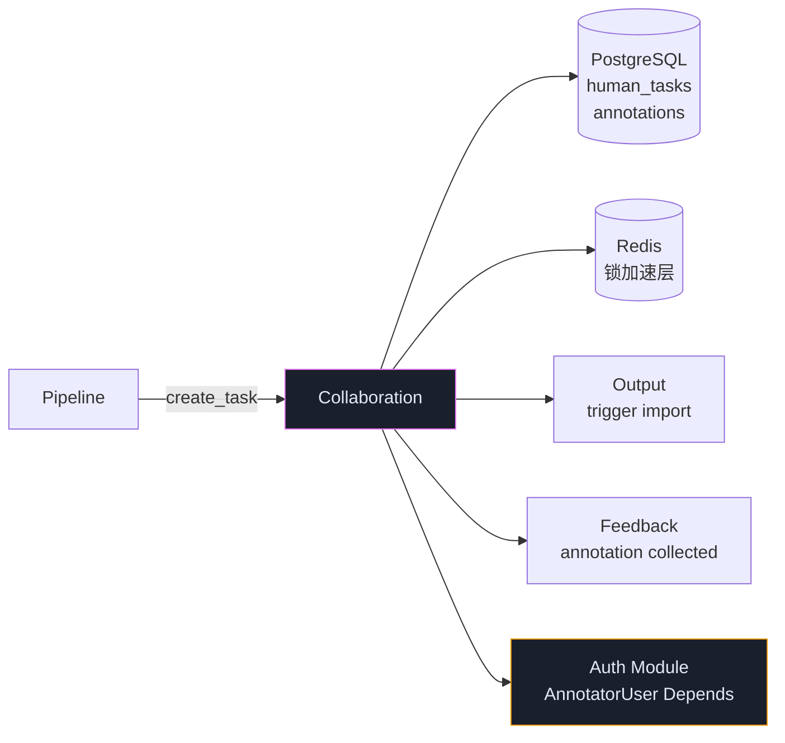
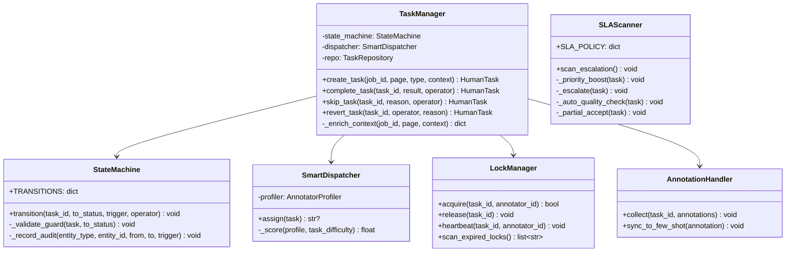
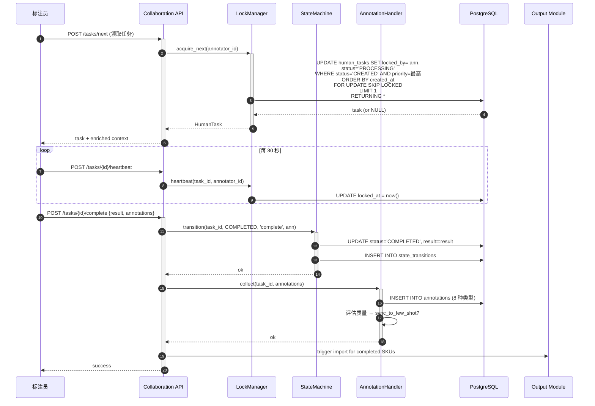
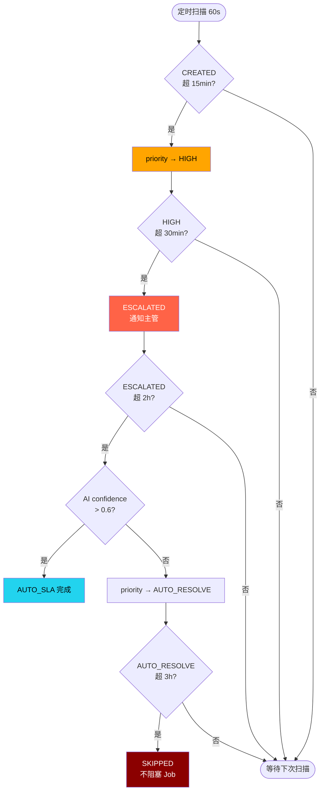

# Collaboration 模块详细设计

> **文档版本**: V1.1  
> **上游依赖**: TA V1.6 §3.5 | BA V1.1 §5.4 | BRD V2.1 §7  
> **模块定位**: 人机协作 — 任务创建/分配/锁/心跳/SLA升级/回退/标注采集  
> **设计原则**: DB 为锁**唯一**权威来源、SKIP LOCKED 并发安全、宁可超时也不丢任务

### V1.1 修订说明

| 变更 ID | 级别 | 说明 | 来源 |
|---------|------|------|------|
| P1-C1 | P1 | 跨页表格虚拟长图 + 跨页 SKU 回溯 API | Gemini+Qwen3 |
| P1-C2 | P1 | SLA 熔断增加人工通知（企微/钉钉） | Qwen3 |
| P1-C3 | P1 | revert 审计增加 operator/reason | Qwen3 |
| P1-C4 | P1 | binding_candidates 透传至 UI + 落库 | Qwen3 |
| P1-C5 | P1 | LockManager 心跳与 DB 更新原子性 | Kimi |
| P1-C6 | P1 | AUTO_SLA 抽样 5% 人工复核 | Kimi |
| P1-C7 | P1 | SLA L3 confidence 阈值从 Config 读取 | GLM-5 |
| P1-C8 | P1 | 任务重入上限（rework_count≥5 强制 SKIPPED） | GLM-5 |
| P1-C9 | P1 | DB 为锁唯一权威显式声明 | Qwen3 |
| P1-C10 | P1 | AnnotatorProfiler 归属本模块 + 数据结构 | GLM-5 |

---

## 1. 模块职责边界

| 职责 | 说明 | 对齐 |
|------|------|------|
| **任务创建** | Pipeline 低置信度/歧义 → 创建 HumanTask + 上下文增强（前后页+文档属性） | V1.6:P1-4 |
| **智能派单** | 标注员能力画像 × 任务难度 → 加权评分匹配 | T79 |
| **锁管理** | SKIP LOCKED 领取、DB 先写锁、心跳保活、超时释放 | V1.6:P1-18 |
| **SLA 四级熔断** | 15min 提优先级 → 30min 通知主管 → 2h AI 兜底 → 3h 部分接受 | T73/Q2 |
| **任务回退** | 组长角色撤销 COMPLETED/SKIPPED → CREATED (rework_count++) | T76 |
| **标注采集** | 8 种 annotation 类型（BA §4.8），优质样本入 few-shot 库 | V1.6:P0-4 |
| **审计日志** | 所有状态转换写 state_transitions 表 | T46 |

### 依赖



> **[V1.2 补充] 认证依赖**：所有人工任务操作端点（lock/complete/skip/release/revert/heartbeat）
> 通过 `Depends(AnnotatorUser)` 注入当前标注员身份，`operator` 参数从 `user.username` 自动获取，
> 不再接受客户端传入。管理员角色（AdminUser）亦可通过权限守卫。

---

## 2. 目录结构

```
app/
├── collaboration/
│   ├── __init__.py
│   ├── task_manager.py         # 任务创建 + 上下文增强 + 重入上限  [V1.1]
│   ├── state_machine.py        # 状态机 + 转换守卫 + 审计(含operator/reason)  [V1.1]
│   ├── lock_manager.py         # SKIP LOCKED 领取 + 心跳(原子性) + 超时释放  [V1.1]
│   ├── dispatch.py             # 智能派单（能力画像+评分）
│   ├── timeout_scanner.py      # SLA 四级熔断扫描 + 通知 + 抽样复核  [V1.1]
│   ├── annotation_handler.py   # 标注采集 + few-shot 同步
│   ├── annotator_profiler.py   # [V1.1] 标注员画像（归属本模块）
│   ├── context_enricher.py     # [V1.1] 上下文增强（跨页虚拟长图）
│   ├── notification.py         # [V1.1] SLA 通知（企微/钉钉 webhook）
│   ├── api.py                  # REST API（含跨页 SKU 回溯）  [V1.1]
│   ├── schemas.py
│   ├── repository.py
│   └── constants.py
```

---

## 3. 类图



---

## 4. 核心时序图

### 4.1 领取 → 完成 → 标注采集



### 4.2 SLA 四级熔断



---

## 5. 组件详细规格

### 5.1 LockManager — SKIP LOCKED

```python
class LockManager:
    """
    锁管理（V1.6:P1-18）：
    - [V1.1 P1-C9] DB 为**唯一**权威来源：locked_by + locked_at 在 human_tasks 表
      所有锁判定以 DB 为准，Redis 仅做查询加速层，实例重启以 DB 为准。
    - SKIP LOCKED 确保多实例并发安全
    - 心跳 30s，超时 5min 释放

    [V1.1] 变更：
    - P1-C5: 心跳更新 DB + Redis 在同一事务中（原子性）
    - P1-C8: scan_expired_locks 增加重入次数检查
    """

    HEARTBEAT_INTERVAL = 30   # 秒
    LOCK_TIMEOUT = 300        # 5 分钟
    MAX_REWORK_COUNT = 5      # [V1.1 P1-C8] 重入上限

    async def acquire_next(self, annotator_id: str) -> HumanTask | None:
        """SKIP LOCKED 领取优先级最高的待处理任务"""
        async with db.begin() as tx:
            row = await tx.execute(text("""
                UPDATE human_tasks
                SET locked_by = :ann, locked_at = now(),
                    status = 'PROCESSING', assigned_to = :ann,
                    assigned_at = now()
                WHERE task_id = (
                    SELECT task_id FROM human_tasks
                    WHERE status IN ('CREATED', 'ESCALATED')
                    ORDER BY
                        CASE priority
                            WHEN 'AUTO_RESOLVE' THEN 0
                            WHEN 'URGENT' THEN 1
                            WHEN 'HIGH' THEN 2
                            WHEN 'NORMAL' THEN 3
                        END,
                        created_at ASC
                    FOR UPDATE SKIP LOCKED
                    LIMIT 1
                )
                RETURNING *
            """), {"ann": annotator_id})
            task = row.fetchone()

            if task:
                # [V1.1 P1-C5] Redis 写入在同一逻辑块内（DB 已 commit 即生效）
                await redis.setex(
                    f"task:lock:{task.task_id}", self.LOCK_TIMEOUT, annotator_id)
                await self._record_transition(
                    task.task_id, "CREATED", "PROCESSING", "lock", annotator_id)
        return task

    async def heartbeat(self, task_id: str, annotator_id: str):
        """[V1.1 P1-C5] 心跳：DB 更新 + Redis 续期在同一事务内"""
        async with db.begin() as tx:
            result = await tx.execute(text("""
                UPDATE human_tasks SET locked_at = now()
                WHERE task_id = :tid AND locked_by = :ann AND status = 'PROCESSING'
                RETURNING task_id
            """), {"tid": task_id, "ann": annotator_id})
            if result.rowcount == 0:
                raise BusinessError("Heartbeat failed: lock lost", "LOCK_LOST")
            # 同一事务成功后再更新 Redis
            await redis.setex(f"task:lock:{task_id}", self.LOCK_TIMEOUT, annotator_id)

    async def scan_expired_locks(self):
        """定时扫描超时锁 → 释放回队列 [V1.1 P1-C8 含重入上限]"""
        expired = await db.fetch(text("""
            SELECT task_id, locked_by, rework_count FROM human_tasks
            WHERE status = 'PROCESSING'
              AND locked_at < now() - interval ':timeout seconds'
        """), {"timeout": self.LOCK_TIMEOUT})

        for task in expired:
            # [V1.1 P1-C8] 重入上限检查
            if task.rework_count >= self.MAX_REWORK_COUNT:
                await db.execute(text("""
                    UPDATE human_tasks
                    SET status = 'SKIPPED', locked_by = NULL, locked_at = NULL
                    WHERE task_id = :tid AND status = 'PROCESSING'
                """), {"tid": task.task_id})
                await self._record_transition(
                    task.task_id, "PROCESSING", "SKIPPED",
                    "max_rework_exceeded", "system")
                metrics.human_task_max_rework_total.inc()
            else:
                await db.execute(text("""
                    UPDATE human_tasks
                    SET status = 'CREATED', locked_by = NULL, locked_at = NULL
                    WHERE task_id = :tid AND status = 'PROCESSING'
                """), {"tid": task.task_id})
                await self._record_transition(
                    task.task_id, "PROCESSING", "CREATED", "lock_timeout", "system")
                metrics.human_task_lock_timeout_total.inc()
            await redis.delete(f"task:lock:{task.task_id}")
```

### 5.2 SmartDispatcher — 智能派单

```python
class SmartDispatcher:
    """
    智能派单（T79）：
    - 难任务（低置信度 < 0.5）→ 仅分配给高准确率（≥ 0.85）标注员
    - 评分 = quality × 0.6 + load_balance × 0.4
    - 无合适人选 → None（进公共队列）
    """

    async def assign(self, task: HumanTask) -> str | None:
        difficulty = task.context.get("page_confidence", 0.5)
        available = await self._get_available_annotators()

        scored = []
        for ann in available:
            profile = await self._profiler.get_profile(ann.id)
            if difficulty < 0.5 and profile.accuracy_rate < 0.85:
                continue
            load = 1.0 - min(ann.current_tasks / 10, 1.0)
            score = profile.accuracy_rate * 0.6 + load * 0.4
            scored.append((ann.id, score))

        if not scored:
            return None
        scored.sort(key=lambda x: x[1], reverse=True)
        return scored[0][0]
```

### 5.3 SLA 四级熔断

```python
SLA_POLICY = {
    "NORMAL":       {"timeout_min": 15,  "action": "PRIORITY_BOOST",     "next": "HIGH"},
    "HIGH":         {"timeout_min": 30,  "action": "ESCALATE_TO_SUPERVISOR", "next": "CRITICAL"},
    "CRITICAL":     {"timeout_min": 120, "action": "AUTO_QUALITY_CHECK",  "next": "AUTO_RESOLVE"},
    "AUTO_RESOLVE": {"timeout_min": 180, "action": "PARTIAL_ACCEPTANCE",  "next": None},
}

class SLAScanner:
    """
    [V1.1] 变更：
    - P1-C2: ESCALATE_TO_SUPERVISOR 增加企微/钉钉 webhook 通知
    - P1-C6: AUTO_QUALITY_CHECK 完成后抽样 5% 人工复核
    - P1-C7: AI confidence 阈值从 Config 读取（非硬编码 0.6）
    """

    AUTO_REVIEW_SAMPLE_RATE = 0.05  # [V1.1 P1-C6] 5% 抽样

    async def scan_escalation(self):
        for level, policy in SLA_POLICY.items():
            stale = await db.fetch(text("""
                SELECT * FROM human_tasks
                WHERE status IN ('CREATED', 'ESCALATED')
                  AND priority = :level
                  AND created_at < now() - interval ':min minutes'
            """), {"level": level, "min": policy["timeout_min"]})

            for task in stale:
                match policy["action"]:
                    case "PRIORITY_BOOST":
                        await self._boost(task, policy["next"])
                    case "ESCALATE_TO_SUPERVISOR":
                        await self._escalate(task)
                    case "AUTO_QUALITY_CHECK":
                        await self._auto_check(task)
                    case "PARTIAL_ACCEPTANCE":
                        await self._partial_accept(task)
                metrics.human_task_escalated_total.labels(
                    action=policy["action"]).inc()

    async def _escalate(self, task):
        """[V1.1 P1-C2] 升级 + 通知主管"""
        await db.execute(text("""
            UPDATE human_tasks SET priority = 'CRITICAL'
            WHERE task_id = :tid
        """), {"tid": task.task_id})
        # [V1.1 P1-C2] 企微/钉钉 webhook 通知
        await self._notifier.send(
            channel="supervisor",
            message=f"⚠️ 任务 {task.task_id} 超时 30min 未处理，"
                    f"Job={task.job_id}, 类型={task.task_type}",
            level="WARNING")

    async def _auto_check(self, task):
        """L3: AI confidence > 阈值 → 自动接受 [V1.1 P1-C7 阈值配置化]"""
        # [V1.1 P1-C7] 从 Config 读取阈值
        profile = config.get_profile(task.context.get("config_version"))
        auto_accept_threshold = profile.sla_auto_accept_confidence or 0.6

        ai = task.context.get("ai_result", {})
        if ai.get("confidence", 0) > auto_accept_threshold:
            await self._task_mgr.complete_task(
                task.task_id, result=ai, operator="AUTO_SLA")

            # [V1.1 P1-C6] 抽样 5% 人工复核
            if random.random() < self.AUTO_REVIEW_SAMPLE_RATE:
                await self._create_review_task(task, ai)
                metrics.human_task_auto_review_total.inc()
        else:
            await db.execute(text("""
                UPDATE human_tasks SET priority = 'AUTO_RESOLVE'
                WHERE task_id = :tid
            """), {"tid": task.task_id})

    async def _create_review_task(self, original_task, ai_result):
        """[V1.1 P1-C6] 创建 AUTO_SLA 复核任务"""
        await self._task_mgr.create_task(
            job_id=original_task.job_id,
            page_number=original_task.context.get("page_number"),
            task_type="AUTO_SLA_REVIEW",
            context={
                "original_task_id": original_task.task_id,
                "ai_result": ai_result,
                "review_reason": "auto_sla_sample_review",
            },
            priority="HIGH")
```

### 5.4 TaskManager — 回退/撤销

```python
class TaskManager:
    REVERTABLE = {"COMPLETED", "SKIPPED"}
    MAX_REWORK_COUNT = 5  # [V1.1 P1-C8]

    async def revert_task(
        self, task_id: str, operator: str, reason: str
    ) -> HumanTask:
        task = await self._repo.get(task_id)
        if task.status not in self.REVERTABLE:
            raise BusinessError(f"Cannot revert from {task.status}", "TASK_NOT_REVERTABLE")

        # [V1.1 P1-C8] 重入上限检查
        if task.rework_count >= self.MAX_REWORK_COUNT:
            raise BusinessError(
                f"Max rework count ({self.MAX_REWORK_COUNT}) exceeded",
                "MAX_REWORK_EXCEEDED")

        await db.execute(text("""
            UPDATE human_tasks
            SET status = 'CREATED', locked_by = NULL, locked_at = NULL,
                result = NULL, rework_count = rework_count + 1
            WHERE task_id = :tid
        """), {"tid": task_id})
        # [V1.1 P1-C3] 审计增加 operator + reason
        await self._sm.record_audit(
            "task", task_id, task.status, "CREATED", "revert",
            operator=operator, reason=reason)
        return await self._repo.get(task_id)
```

### 5.5 AnnotatorProfiler — 标注员画像

```python
class AnnotatorProfiler:
    """
    [V1.1 P1-C10] 标注员画像管理（归属 Collaboration 模块）

    数据结构：
    - accuracy_rate: float  — 历史准确率（0.0~1.0）
    - speed_factor: float   — 平均完成速度（相对值）
    - specialties: list[str] — 擅长任务类型
    - total_tasks: int      — 历史任务总数
    - reject_rate: float    — 被组长退回率

    冷启动（P1-C10）：
    - 新标注员默认 accuracy_rate=0.6（保守估计）
    - 前 10 个任务随机分配（不参与智能派单评分）
    - 第 11 个任务起使用真实画像

    被 SmartDispatcher 和 FewShotSyncer 依赖。
    """

    DEFAULT_PROFILE = AnnotatorProfile(
        accuracy_rate=0.6,  # [V1.1] Kimi 建议从 0.8 降至 0.6 更保守
        speed_factor=1.0,
        specialties=[],
        total_tasks=0,
        reject_rate=0.0,
    )
    COLD_START_THRESHOLD = 10

    async def get_profile(self, annotator_id: str) -> AnnotatorProfile:
        profile = await self._repo.get_annotator_profile(annotator_id)
        if not profile:
            return self.DEFAULT_PROFILE
        return profile

    def is_cold_start(self, profile: AnnotatorProfile) -> bool:
        return profile.total_tasks < self.COLD_START_THRESHOLD

    async def refresh_profiles(self):
        """定时任务（1h）：根据最近 30 天标注数据刷新画像"""
        annotators = await self._repo.get_active_annotators()
        for ann in annotators:
            stats = await self._repo.compute_annotator_stats(ann.id, days=30)
            await self._repo.update_profile(ann.id, AnnotatorProfile(
                accuracy_rate=stats.accuracy,
                speed_factor=stats.avg_duration_ratio,
                specialties=stats.top_task_types,
                total_tasks=stats.total,
                reject_rate=stats.reject_rate,
            ))
```

### 5.6 ContextEnricher — 上下文增强

```python
class ContextEnricher:
    """
    [V1.1 P1-C1] 跨页表格虚拟长图 + 上下文增强

    对于跨页表格修正任务，标注员需要的是"逻辑上的整张表"，
    而非物理上的前后页图片。Pipeline 的 cross_page_merger 已有合并结果，
    在此构建虚拟长图传递给 task.context。
    """

    MAX_CONTEXT_SIZE = 4096  # [V1.1 P1-C4/Kimi] 截断上限

    async def enrich(self, job_id: str, page_number: int, context: dict) -> dict:
        # 基础上下文：前后页截图 + 文档全局属性
        base = await self._build_base_context(job_id, page_number)

        # [V1.1 P1-C1] 跨页表格虚拟长图
        cross_page = await self._repo.get_cross_page_merge(job_id, page_number)
        if cross_page:
            base["cross_page_table"] = {
                "merged_image_uri": cross_page.merged_image_uri,
                "from_page": cross_page.from_page,
                "to_page": cross_page.to_page,
                "table_header_hash": cross_page.header_hash,
            }

        # [V1.1 P1-C4] binding_candidates 透传
        binding_candidates = context.get("binding_candidates")
        if binding_candidates:
            base["binding_candidates"] = binding_candidates

        # 截断保护
        serialized = json.dumps(base)
        if len(serialized) > self.MAX_CONTEXT_SIZE:
            base.pop("prev_page_screenshot", None)
            base.pop("next_page_screenshot", None)
            logger.warning("context_truncated", job_id=job_id, page=page_number)

        return {**context, **base}
```

---

## 6. 定时任务

| 任务 | 间隔 | 锁 | 说明 |
|------|------|-----|------|
| 锁超时扫描 | 60s | Redis lock + watchdog | 释放超时的 PROCESSING 任务 |
| SLA 熔断扫描 | 60s | Redis lock + watchdog | 四级升级 |
| 标注员画像刷新 | 1h | 无（幂等） | 刷新 annotator_profiles |

---

## 7. Prometheus 指标

```python
human_task_created_total = Counter("human_task_created_total", "", ["task_type"])
human_task_completed_total = Counter("human_task_completed_total", "", ["task_type"])
human_task_duration_seconds = Histogram("human_task_duration_seconds", "", ["task_type"])
human_task_queue_length = Gauge("human_task_queue_length", "", ["status", "priority"])
human_task_escalated_total = Counter("human_task_escalated_total", "", ["action"])
human_task_lock_timeout_total = Counter("human_task_lock_timeout_total", "")
human_task_reverted_total = Counter("human_task_reverted_total", "")
# [V1.1] 新增
human_task_max_rework_total = Counter("human_task_max_rework_total", "Tasks SKIPPED by max rework")
human_task_auto_review_total = Counter("human_task_auto_review_total", "AUTO_SLA sampled for review")
human_task_notification_total = Counter("human_task_notification_total", "", ["channel"])
```

---

## 8. 交付清单

| 文件 | 行数(估) | 优先级 | V1.1 变更 |
|------|---------|--------|----------|
| `task_manager.py` | ~240 | P0 | +40: 重入上限 / 审计增强 |
| `state_machine.py` | ~140 | P0 | +20: record_audit 增加 reason 参数 |
| `lock_manager.py` | ~220 | P0 | +40: 心跳原子性 / 重入上限检查 |
| `dispatch.py` | ~120 | P0 | — |
| `timeout_scanner.py` | ~230 | P0 | +80: 通知 / 抽样复核 / 阈值配置化 |
| `annotation_handler.py` | ~100 | P0 | — |
| `annotator_profiler.py` | ~100 | P1 | 🆕 新增 |
| `context_enricher.py` | ~80 | P1 | 🆕 新增 |
| `notification.py` | ~60 | P1 | 🆕 新增 |
| `api.py` | ~200 | P0 | +50: 跨页 SKU 回溯 API |
| `schemas.py` | ~100 | P0 | +20: AnnotatorProfile / CrossPageContext |
| `repository.py` | ~120 | P0 | +20: 画像 CRUD |
| `constants.py` | ~40 | P0 | +10: 新增配置项 |
| **总计** | **~1750** | — | **+520（V1.0: 1230 → V1.1: 1750）** |
