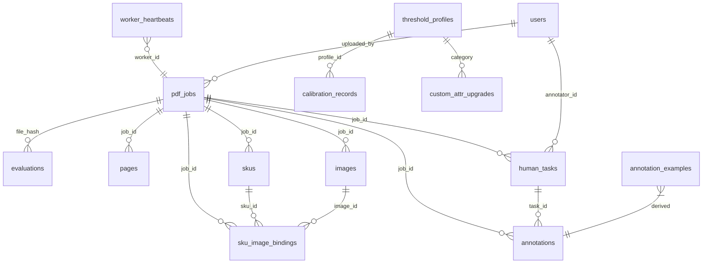

# PDF-SKU 系统数据库 DDL 汇总

> **版本**: V1.2（对齐 OpenAPI V2.0 + 前端详设 V1.1）  
> **上游**: TA V1.6 · OpenAPI V2.0 · 部署架构 V1.2  
> **数据库**: PostgreSQL 15  
> **编码**: UTF-8 / COLLATE zh_CN.UTF-8  
> **执行顺序**: 先建枚举 → 主表（按外键依赖）→ V1.2 增量 Migration → 索引

---

## V1.2 变更记录

| 变更 | 来源 | 影响表 |
|------|------|--------|
| pdf_jobs +user_status, +action_hint, +error_message | OpenAPI V2.0 Job 双轨状态 | pdf_jobs |
| skus.status 增加 PARTIAL, INVALID | OpenAPI V2.0 SKU schema | skus |
| 新表 custom_attr_upgrades | OpenAPI V2.0 /ops/custom-attr-upgrades | 新建 |
| 新表 worker_heartbeats | 部署架构 V1.2 Gateway OrphanScanner | 新建 |
| annotations 表 task_id 改为 nullable | OpenAPI V2.0 POST /annotations（独立标注） | annotations |
| evaluations +route_reason, +thresholds_used | OpenAPI V2.0 Evaluation 增强 | evaluations |
| 新表 users | Auth 模块 JWT/RBAC | 新建 |
| Migration 002 新增（users） | Auth 模块 | 新建 |
| Migration 009-013 新增 | — | — |

---

## 1. ER 关系总览



## 2. 表清单

| # | 表名 | 拥有模块 | 行数预估(V1) | 说明 |
|---|------|---------|-------------|------|
| 1 | `pdf_jobs` | Gateway | ~100/天 | 处理作业主表 [V1.2: +user_status/action_hint/error_message] |
| 2 | `evaluations` | Evaluator | ~100/天 | 置信度评估缓存 [V1.2: +route_reason/thresholds_used] |
| 3 | `pages` | Pipeline | ~5000/天 | 页面处理记录 |
| 4 | `skus` | Pipeline | ~15000/天 | 商品单元 [V1.2: +PARTIAL/INVALID 状态] |
| 5 | `images` | Pipeline | ~30000/天 | 图片实体 |
| 6 | `sku_image_bindings` | Pipeline | ~30000/天 | SKU-图片 N:M 绑定 |
| 7 | `human_tasks` | Collaboration | ~500/天 | 人工任务 |
| 8 | `annotations` | Collaboration | ~1000/天 | 人工标注记录 [V1.2: task_id nullable] |
| 9 | `state_transitions` | 全局 | ~20000/天 | 状态转换审计日志 |
| 10 | `annotation_examples` | Feedback | 缓慢增长 | Few-shot 示例库 |
| 11 | `annotator_profiles` | Collaboration | ~50 | 标注员能力画像 |
| 12 | `threshold_profiles` | Config | ~20 | 阈值配置（版本链）|
| 13 | `calibration_records` | Feedback | ~2/周 | 校准快照 |
| 14 | `eval_reports` | 离线评测 | ~1/周 | 评测报告 |
| 15 | `import_dedup` | Output | ~15000/天 | 增量导入幂等去重 |
| 16 | **`custom_attr_upgrades`** | Feedback/Ops | ~10/周 | **[V1.2 新增]** 非标属性升级建议 |
| 17 | **`worker_heartbeats`** | Gateway | ~5 | **[V1.2 新增]** Worker 心跳注册 |
| 18 | **`users`** | Auth | ~100 | **[V1.2 新增]** 用户表（JWT 认证 / RBAC） |

---

## 3. 完整 DDL

### 3.1 主表（按外键依赖顺序）

```sql
-- =====================================================
-- 1. PDFJob: 处理作业主表
-- 拥有模块: Gateway
-- [V1.2] +user_status, +action_hint, +error_message
-- =====================================================
CREATE TABLE pdf_jobs (
    job_id              UUID PRIMARY KEY DEFAULT gen_random_uuid(),
    source_file         TEXT NOT NULL,
    file_hash           TEXT NOT NULL,
    merchant_id         TEXT NOT NULL,
    category            TEXT,
    industry            TEXT,
    uploaded_by         TEXT NOT NULL,
    uploaded_at         TIMESTAMPTZ NOT NULL DEFAULT now(),

    -- 状态与路由
    status              TEXT NOT NULL DEFAULT 'UPLOADED',
    -- 合法值: UPLOADED | EVALUATING | EVAL_FAILED | EVALUATED | PROCESSING
    --   | PARTIAL_FAILED | PARTIAL_IMPORTED | DEGRADED_HUMAN | FULL_IMPORTED
    --   | REJECTED | ORPHANED | CANCELLED

    -- [V1.2] 面向前端的简化状态
    user_status         TEXT NOT NULL DEFAULT 'processing',
    -- 合法值: processing | partial_success | completed | needs_manual | failed
    -- 映射规则:
    --   processing: UPLOADED/EVALUATING/EVALUATED/PROCESSING
    --   partial_success: PARTIAL_IMPORTED/PARTIAL_FAILED
    --   completed: FULL_IMPORTED
    --   needs_manual: DEGRADED_HUMAN
    --   failed: EVAL_FAILED/REJECTED/CANCELLED/ORPHANED

    -- [V1.2] 前端操作提示
    action_hint         TEXT,

    route               TEXT,           -- AUTO | HYBRID | HUMAN_ALL
    degrade_reason      TEXT,

    -- [V1.2] 错误信息
    error_message       TEXT,

    -- 配置冻结
    frozen_config_version TEXT,

    -- 实例标识
    worker_id           TEXT,

    -- Checkpoint
    checkpoint_page     INT DEFAULT 0,
    checkpoint_skus     INT DEFAULT 0,
    checkpoint_at       TIMESTAMPTZ,

    -- 输出
    output_base_url     TEXT,
    completion_source   TEXT,
    -- 合法值: AI_ONLY | HUMAN_ONLY | HYBRID | DEGRADED_HUMAN

    -- 文档属性
    total_pages         INT NOT NULL,
    blank_pages         INT[] DEFAULT '{}',
    ai_pages            INT[] DEFAULT '{}',
    human_pages         INT[] DEFAULT '{}',
    skipped_pages       INT[] DEFAULT '{}',
    failed_pages        INT[] DEFAULT '{}',

    -- 统计
    total_skus          INT DEFAULT 0,
    total_images        INT DEFAULT 0,

    -- 追踪
    processing_trace    JSONB,
    token_consumption   JSONB DEFAULT '{"eval_tokens":0,"process_tokens":0,"total_api_calls":0}',

    -- 时间线
    eval_started_at     TIMESTAMPTZ,
    eval_completed_at   TIMESTAMPTZ,
    process_started_at  TIMESTAMPTZ,
    process_completed_at TIMESTAMPTZ,
    parse_time_ms       INT,

    created_at          TIMESTAMPTZ NOT NULL DEFAULT now(),
    updated_at          TIMESTAMPTZ NOT NULL DEFAULT now()
);

CREATE INDEX idx_jobs_status ON pdf_jobs(status);
CREATE INDEX idx_jobs_user_status ON pdf_jobs(user_status);            -- [V1.2]
CREATE INDEX idx_jobs_merchant ON pdf_jobs(merchant_id);
CREATE INDEX idx_jobs_file_hash ON pdf_jobs(file_hash);
CREATE INDEX idx_jobs_worker ON pdf_jobs(worker_id);
CREATE INDEX idx_jobs_created ON pdf_jobs(created_at);                 -- [V1.2] 支持 created_after/before 查询


-- =====================================================
-- 2. Evaluations: 置信度评估结果
-- 拥有模块: Evaluator
-- [V1.2] +route_reason, +thresholds_used
-- =====================================================
CREATE TABLE evaluations (
    id                  SERIAL PRIMARY KEY,
    file_hash           TEXT NOT NULL,
    config_version      TEXT NOT NULL,
    doc_confidence      REAL NOT NULL,
    route               TEXT NOT NULL,
    route_reason        TEXT,                  -- [V1.2] 路由决策原因
    degrade_reason      TEXT,
    dimension_scores    JSONB NOT NULL,
    weights_snapshot    JSONB NOT NULL,
    thresholds_used     JSONB,                 -- [V1.2] 使用的阈值快照
    prescan             JSONB NOT NULL,        -- 含 raw_metrics 子对象
    sampling            JSONB NOT NULL,
    page_evaluations    JSONB,
    model_used          TEXT NOT NULL,
    prompt_version      TEXT,
    evaluated_at        TIMESTAMPTZ NOT NULL DEFAULT now(),
    UNIQUE(file_hash, config_version)
);


-- =====================================================
-- 3. Pages: 页面处理记录
-- 拥有模块: Pipeline
-- =====================================================
CREATE TABLE pages (
    id                  SERIAL PRIMARY KEY,
    job_id              UUID NOT NULL REFERENCES pdf_jobs(job_id),
    page_number         INT NOT NULL,
    attempt_no          INT NOT NULL DEFAULT 1,

    status              TEXT NOT NULL DEFAULT 'PENDING',
    -- 合法值: PENDING | BLANK | AI_QUEUED | AI_PROCESSING | AI_COMPLETED
    --   | AI_FAILED | HUMAN_QUEUED | HUMAN_PROCESSING | HUMAN_COMPLETED
    --   | IMPORTED_CONFIRMED | IMPORTED_ASSUMED | IMPORT_FAILED | SKIPPED
    --   | DEAD_LETTER
    worker_id           TEXT,
    claimed_at          TIMESTAMPTZ,
    retry_count         INT DEFAULT 0,
    processed_by        TEXT,
    import_confirmation TEXT DEFAULT 'not_imported',
    page_confidence     REAL,

    page_type           TEXT,
    layout_type         TEXT,
    classification_confidence REAL,
    needs_review        BOOLEAN DEFAULT false,

    table_continuation_from INT,
    validation_errors   TEXT[],
    parser_backend      TEXT DEFAULT 'legacy',

    features            JSONB,
    product_description JSONB,
    screenshot_path     TEXT,

    parse_time_ms       INT,
    ocr_time_ms         INT,
    llm_time_ms         INT,
    llm_model_used      TEXT,

    created_at          TIMESTAMPTZ NOT NULL DEFAULT now(),
    updated_at          TIMESTAMPTZ NOT NULL DEFAULT now(),

    UNIQUE(job_id, page_number, attempt_no)
);

CREATE INDEX idx_pages_job_status ON pages(job_id, status);
CREATE INDEX idx_pages_poll ON pages(status, updated_at);
CREATE INDEX idx_pages_claim ON pages(status, worker_id) WHERE worker_id IS NULL;
CREATE INDEX idx_pages_dead_letter ON pages(status) WHERE status = 'DEAD_LETTER';


-- =====================================================
-- 4. SKUs: 商品单元
-- 拥有模块: Pipeline
-- [V1.2] status 增加 PARTIAL | INVALID
-- =====================================================
CREATE TABLE skus (
    id                  SERIAL PRIMARY KEY,
    sku_id              TEXT NOT NULL,
    job_id              UUID NOT NULL REFERENCES pdf_jobs(job_id),
    page_number         INT NOT NULL,
    attempt_no          INT NOT NULL DEFAULT 1,
    revision            INT NOT NULL DEFAULT 1,
    validity            TEXT NOT NULL,           -- valid | invalid
    superseded          BOOLEAN DEFAULT false,
    attributes          JSONB NOT NULL,
    custom_attributes   JSONB DEFAULT '[]',
    source_text         TEXT,
    source_bbox         INT[],
    attribute_source    TEXT DEFAULT 'AI_EXTRACTED',
    -- 合法值: AI_EXTRACTED | HUMAN_CORRECTED | CROSS_PAGE_MERGED | PROMOTED
    import_status       TEXT DEFAULT 'pending',
    import_confirmation TEXT DEFAULT 'pending',
    -- [V1.2] 合法值: confirmed | assumed | failed | pending
    status              TEXT NOT NULL DEFAULT 'EXTRACTED',
    -- [V1.2] 合法值: EXTRACTED | VALIDATED | CONFIRMED | BOUND | EXPORTED
    --   | SUPERSEDED | PARTIAL | INVALID
    created_at          TIMESTAMPTZ NOT NULL DEFAULT now(),
    updated_at          TIMESTAMPTZ NOT NULL DEFAULT now()
);

CREATE INDEX idx_skus_job ON skus(job_id);
CREATE INDEX idx_skus_status ON skus(status);
CREATE UNIQUE INDEX idx_skus_active ON skus(sku_id) WHERE superseded = false;
CREATE INDEX idx_skus_attribute_source ON skus(attribute_source);
CREATE INDEX idx_skus_import_confirmation ON skus(import_confirmation);  -- [V1.2]


-- =====================================================
-- 5. Images: 图片实体
-- 拥有模块: Pipeline
-- =====================================================
CREATE TABLE images (
    id                  SERIAL PRIMARY KEY,
    image_id            TEXT NOT NULL,
    job_id              UUID NOT NULL REFERENCES pdf_jobs(job_id),
    page_number         INT NOT NULL,
    role                TEXT,
    bbox                INT[4],
    extracted_path      TEXT NOT NULL,
    format              TEXT DEFAULT 'jpg',
    resolution          INT[2],
    short_edge          INT,
    quality_grade       TEXT,
    file_size_kb        INT,
    search_eligible     BOOLEAN,
    is_fragmented       BOOLEAN DEFAULT false,
    image_hash          TEXT,
    is_duplicate        BOOLEAN DEFAULT false,
    dedup_kept_version  TEXT,
    status              TEXT DEFAULT 'EXTRACTED',
    parser_backend      TEXT DEFAULT 'legacy',
    created_at          TIMESTAMPTZ NOT NULL DEFAULT now()
);

CREATE INDEX idx_images_job ON images(job_id, page_number);
CREATE INDEX idx_images_role ON images(job_id, role) WHERE role IN ('PRODUCT_MAIN','DETAIL','SIZE_CHART');
CREATE INDEX idx_images_search ON images(search_eligible) WHERE search_eligible = true;
ALTER TABLE images ADD CONSTRAINT chk_search_eligible
    CHECK (search_eligible = false OR short_edge >= 640);


-- =====================================================
-- 6. SKUImageBindings: N:M 绑定关系
-- 拥有模块: Pipeline
-- =====================================================
CREATE TABLE sku_image_bindings (
    id                  SERIAL PRIMARY KEY,
    sku_id              TEXT NOT NULL,
    image_id            TEXT NOT NULL,
    job_id              UUID NOT NULL REFERENCES pdf_jobs(job_id),
    image_role          TEXT,
    binding_method      TEXT,
    -- 合法值: spatial_proximity | grid_alignment | id_matching | page_inheritance
    binding_confidence  REAL,
    is_ambiguous        BOOLEAN DEFAULT false,
    rank                INT DEFAULT 1,
    revision            INT DEFAULT 1,
    is_latest           BOOLEAN DEFAULT true,
    created_at          TIMESTAMPTZ NOT NULL DEFAULT now(),
    UNIQUE(sku_id, image_id)
);

CREATE INDEX idx_bindings_job ON sku_image_bindings(job_id);
CREATE INDEX idx_bindings_ambiguous ON sku_image_bindings(is_ambiguous) WHERE is_ambiguous = true;
CREATE UNIQUE INDEX idx_binding_latest
    ON sku_image_bindings(sku_id, image_id) WHERE is_latest = true;


-- =====================================================
-- 7. HumanTasks: 人工任务
-- 拥有模块: Collaboration
-- =====================================================
CREATE TABLE human_tasks (
    task_id             UUID PRIMARY KEY DEFAULT gen_random_uuid(),
    job_id              UUID NOT NULL REFERENCES pdf_jobs(job_id),
    page_number         INT NOT NULL,
    task_type           TEXT NOT NULL,
    status              TEXT NOT NULL DEFAULT 'CREATED',
    -- 合法值: CREATED | ASSIGNED | PROCESSING | COMPLETED | EXPIRED | ESCALATED
    priority            TEXT DEFAULT 'NORMAL',
    -- 合法值: NORMAL | HIGH | URGENT | CRITICAL | AUTO_RESOLVE
    assigned_to         TEXT,
    locked_by           TEXT,
    locked_at           TIMESTAMPTZ,
    rework_count        INT DEFAULT 0,
    context             JSONB NOT NULL,
    created_at          TIMESTAMPTZ NOT NULL DEFAULT now(),
    assigned_at         TIMESTAMPTZ,
    completed_at        TIMESTAMPTZ,
    timeout_at          TIMESTAMPTZ NOT NULL,
    result              JSONB
);

CREATE INDEX idx_tasks_status ON human_tasks(status);
CREATE INDEX idx_tasks_job ON human_tasks(job_id);
CREATE INDEX idx_tasks_assigned ON human_tasks(assigned_to, status);
CREATE INDEX idx_tasks_stale_lock ON human_tasks(status, locked_at);
CREATE INDEX idx_tasks_priority ON human_tasks(status, priority, created_at);


-- =====================================================
-- 8. Annotations: 人工标注记录
-- 拥有模块: Collaboration / Feedback
-- [V1.2] task_id 改为 nullable（支持 POST /annotations 独立标注）
-- =====================================================
CREATE TABLE annotations (
    annotation_id       UUID PRIMARY KEY DEFAULT gen_random_uuid(),
    task_id             UUID REFERENCES human_tasks(task_id),   -- nullable：独立标注无 task
    job_id              UUID NOT NULL REFERENCES pdf_jobs(job_id),
    page_number         INT NOT NULL,
    annotator           TEXT NOT NULL,
    type                TEXT NOT NULL,
    -- 8 种类型: PAGE_TYPE_CORRECTION | TEXT_ROLE_CORRECTION | IMAGE_ROLE_CORRECTION
    --   | SKU_ATTRIBUTE_CORRECTION | BINDING_CORRECTION | CUSTOM_ATTR_CONFIRM
    --   | NEW_TYPE_REPORT | LAYOUT_CORRECTION
    payload             JSONB NOT NULL,
    annotated_at        TIMESTAMPTZ NOT NULL DEFAULT now()
);

CREATE INDEX idx_annotations_type ON annotations(type, annotated_at);
CREATE INDEX idx_annotations_job ON annotations(job_id);
CREATE INDEX idx_annotations_custom_attr ON annotations(type) WHERE type = 'CUSTOM_ATTR_CONFIRM';


-- =====================================================
-- 9. StateTransitions: 状态转换审计日志
-- =====================================================
CREATE TABLE state_transitions (
    id                  BIGSERIAL PRIMARY KEY,
    entity_type         TEXT NOT NULL,   -- 'job' | 'page' | 'sku' | 'task'
    entity_id           TEXT NOT NULL,
    from_status         TEXT,
    to_status           TEXT NOT NULL,
    trigger             TEXT,
    operator            TEXT,
    timestamp           TIMESTAMPTZ NOT NULL DEFAULT now()
);

CREATE INDEX idx_st_entity ON state_transitions(entity_type, entity_id);
CREATE INDEX idx_st_time ON state_transitions(timestamp);


-- =====================================================
-- 10. AnnotationExamples: Few-shot 示例库
-- =====================================================
CREATE TABLE annotation_examples (
    id                  SERIAL PRIMARY KEY,
    task_type           TEXT NOT NULL,
    category            TEXT,
    input_context       TEXT,
    output_json         JSONB NOT NULL,
    quality_score       REAL DEFAULT 0.5,
    is_confirmed        BOOLEAN DEFAULT false,
    created_at          TIMESTAMPTZ NOT NULL DEFAULT now()
);

CREATE INDEX idx_examples_task ON annotation_examples(task_type, is_confirmed);


-- =====================================================
-- 11. AnnotatorProfiles: 标注员能力画像
-- =====================================================
CREATE TABLE annotator_profiles (
    annotator_id        TEXT PRIMARY KEY,
    avg_duration_sec    REAL DEFAULT 300,
    accuracy_rate       REAL DEFAULT 0.8,
    total_tasks         INT DEFAULT 0,
    specialties         TEXT[],
    updated_at          TIMESTAMPTZ NOT NULL DEFAULT now()
);


-- =====================================================
-- 12. ThresholdProfiles: 阈值配置持久化
-- =====================================================
CREATE TABLE threshold_profiles (
    id                  SERIAL PRIMARY KEY,
    profile_id          TEXT NOT NULL,
    version             TEXT NOT NULL,
    previous_version    TEXT,
    category            TEXT,
    industry            TEXT,
    thresholds          JSONB NOT NULL,
    confidence_weights  JSONB NOT NULL,
    prescan_rules       JSONB NOT NULL,
    classification_thresholds JSONB NOT NULL,
    sku_validity_mode   TEXT DEFAULT 'strict',
    is_active           BOOLEAN DEFAULT true,
    effective_from      TIMESTAMPTZ NOT NULL DEFAULT now(),
    created_by          TEXT,
    change_reason       TEXT,
    UNIQUE(profile_id, version)
);


-- =====================================================
-- 13. CalibrationRecords: 校准快照
-- =====================================================
CREATE TABLE calibration_records (
    calibration_id      UUID PRIMARY KEY DEFAULT gen_random_uuid(),
    profile_id          TEXT NOT NULL,
    type                TEXT DEFAULT 'THRESHOLD',
    -- 合法值: THRESHOLD | ATTR_PROMOTION
    period_start        TIMESTAMPTZ NOT NULL,
    period_end          TIMESTAMPTZ NOT NULL,
    sample_count        INT NOT NULL,
    ai_correction_rate  REAL,
    human_could_be_ai_rate REAL,
    route_accuracy      REAL,
    suggested_adjustments JSONB,
    status              TEXT DEFAULT 'PENDING',
    -- 合法值: PENDING | APPROVED | REJECTED | APPLIED
    applied             BOOLEAN DEFAULT false,
    applied_at          TIMESTAMPTZ,
    created_at          TIMESTAMPTZ NOT NULL DEFAULT now()
);


-- =====================================================
-- 14. EvalReports: 离线评测报告
-- =====================================================
CREATE TABLE eval_reports (
    id                  SERIAL PRIMARY KEY,
    golden_set_id       TEXT NOT NULL,
    config_version      TEXT NOT NULL,
    sku_precision       REAL,
    sku_recall          REAL,
    sku_f1              REAL,
    binding_accuracy    REAL,
    human_intervention_rate REAL,
    report_data         JSONB NOT NULL,
    created_at          TIMESTAMPTZ NOT NULL DEFAULT now()
);


-- =====================================================
-- 15. ImportDedup: 增量导入幂等去重
-- =====================================================
CREATE TABLE import_dedup (
    id                  SERIAL PRIMARY KEY,
    dedup_key           TEXT NOT NULL UNIQUE,
    job_id              UUID NOT NULL,
    page_number         INT NOT NULL,
    import_status       TEXT NOT NULL,
    imported_at         TIMESTAMPTZ NOT NULL DEFAULT now()
);

CREATE INDEX idx_import_dedup_job ON import_dedup(job_id);


-- =====================================================
-- 16. [V1.2 新增] CustomAttrUpgrades: 非标属性升级建议
-- 拥有模块: Feedback → 运维审核
-- 对齐: OpenAPI V2.0 /ops/custom-attr-upgrades (BR-21)
-- =====================================================
CREATE TABLE custom_attr_upgrades (
    upgrade_id          UUID PRIMARY KEY DEFAULT gen_random_uuid(),
    attr_name           TEXT NOT NULL,
    suggested_type      TEXT NOT NULL,
    merchant_id         TEXT,              -- nullable: 全局建议
    category            TEXT,
    source_feedback_count INT NOT NULL DEFAULT 0,
    sample_annotations  UUID[] DEFAULT '{}',    -- 关联 annotation_id 样本
    status              TEXT NOT NULL DEFAULT 'pending',
    -- 合法值: pending | approved | rejected | applied
    reviewer            TEXT,
    review_comment      TEXT,
    reviewed_at         TIMESTAMPTZ,
    applied_config_version TEXT,           -- 应用后的配置版本
    created_at          TIMESTAMPTZ NOT NULL DEFAULT now()
);

CREATE INDEX idx_cau_status ON custom_attr_upgrades(status);
CREATE INDEX idx_cau_merchant ON custom_attr_upgrades(merchant_id) WHERE merchant_id IS NOT NULL;


-- =====================================================
-- 17. [V1.2 新增] WorkerHeartbeats: Worker 心跳注册
-- 拥有模块: Gateway (OrphanScanner 消费)
-- 对齐: 部署架构 V1.2 §4 Worker 生命周期
-- =====================================================
CREATE TABLE worker_heartbeats (
    worker_id           TEXT PRIMARY KEY,
    hostname            TEXT NOT NULL,
    pod_ip              TEXT,
    started_at          TIMESTAMPTZ NOT NULL DEFAULT now(),
    last_heartbeat      TIMESTAMPTZ NOT NULL DEFAULT now(),
    active_job_ids      UUID[] DEFAULT '{}',
    status              TEXT NOT NULL DEFAULT 'ALIVE',
    -- 合法值: ALIVE | SUSPECT | DEAD
    version             TEXT                   -- 部署版本
);

CREATE INDEX idx_wh_status ON worker_heartbeats(status, last_heartbeat);


-- =====================================================
-- 18. [V1.2 新增] Users: 用户认证 / RBAC
-- 拥有模块: Auth
-- 对齐: Auth 模块 JWT + RBAC 三角色（uploader / annotator / admin）
-- =====================================================
CREATE TABLE users (
    user_id             UUID PRIMARY KEY DEFAULT gen_random_uuid(),
    username            VARCHAR(64) NOT NULL UNIQUE,
    display_name        VARCHAR(128) NOT NULL DEFAULT '',
    password_hash       TEXT NOT NULL,
    role                VARCHAR(20) NOT NULL DEFAULT 'uploader',
    -- 合法值: uploader | annotator | admin
    is_active           BOOLEAN NOT NULL DEFAULT TRUE,
    merchant_id         TEXT,                   -- uploader 关联商户
    specialties         TEXT[],                 -- annotator 擅长品类
    created_at          TIMESTAMPTZ NOT NULL DEFAULT now(),
    last_login_at       TIMESTAMPTZ
);

CREATE INDEX idx_users_role ON users(role);
CREATE INDEX idx_users_username ON users(username);
```

---

## 4. Redis Key 汇总

| Key 模式 | 组件 | TTL | 说明 |
|----------|------|-----|------|
| `pdf_sku:eval:{file_hash}:{config_ver}` | Evaluator | 24h | 评估缓存 |
| `pdf_sku:eval:lock:{file_hash}` | Evaluator | 120s | 评估分布式锁 |
| `pdf_sku:checkpoint:{job_id}` | Pipeline | 7d | 处理进度快照 |
| `pdf_sku:heartbeat:{worker_id}` | Gateway | 60s | Worker 心跳（Redis 兜底） |
| `pdf_sku:rate:{model}:qpm:{epoch_min}` | LLM Adapter | 120s | QPM 限流 |
| `pdf_sku:rate:{model}:tpm:{epoch_min}` | LLM Adapter | 120s | TPM 限流 |
| `pdf_sku:budget:daily:{date}` | LLM Adapter | 2d | 日预算（微美元整数）|
| `pdf_sku:budget:merchant:{id}:{date}` | LLM Adapter | 2d | 商户预算 |
| `pdf_sku:circuit:{model}` | LLM Adapter | 7d | 熔断器状态 |
| `pdf_sku:fewshot:{template}:{category}` | LLM Adapter | 300s | Few-shot 缓存 |
| `pdf_sku:config:version:{profile_id}` | Config | ∞ | 当前配置版本号 |
| `pdf_sku:config:channel` | Config PubSub | — | 配置变更通道 |
| `pdf_sku:sse:{job_id}` | Gateway SSE | 1h | SSE 事件流 |
| `pdf_sku:task:next:lock` | Collaboration | 5s | **[V1.2]** /tasks/next 原子领取锁 |

---

## 5. 文件系统目录结构

```
/data/jobs/{job_id}/
├── source/
│   └── catalog.pdf
├── screenshots/
│   ├── page_001.png
│   └── ...
├── images/
│   ├── img_a1b2c3d4_p01_001.jpg
│   └── ...
├── tmp/
├── traces/
│   ├── page_001_trace.json
│   └── ...
└── output/
    └── result.json

/data/tus-uploads/                     # tus 断点续传临时目录
```

---

## 6. Migration 执行计划

| 序号 | 文件名 | 依赖 | 说明 |
|------|--------|------|------|
| 001 | `001_init_core_tables.sql` | — | pdf_jobs + evaluations + pages + skus |
| 002 | `002_init_images_bindings.sql` | 001 | images + sku_image_bindings |
| 003 | `003_init_collab_tables.sql` | 001 | human_tasks + annotations + annotator_profiles |
| 004 | `004_init_config_feedback.sql` | — | threshold_profiles + calibration_records + annotation_examples + eval_reports |
| 005 | `005_init_audit.sql` | — | state_transitions |
| 006 | `006_init_import_dedup.sql` | 001 | import_dedup |
| 007 | `007_v11_sku_attribute_source.sql` | 001 | skus.attribute_source |
| — | — | — | — |
| **002** | **`002_add_users.py`** | — | **[V1.2] 新表 users（Auth JWT/RBAC）** |
| 008 | `008_v11_binding_revision.sql` | 002 | sku_image_bindings.revision + is_latest |
| **009** | **`009_v12_job_user_status.sql`** | 001 | **[V1.2] pdf_jobs +user_status, +action_hint, +error_message + idx** |
| **010** | **`010_v12_eval_enhancements.sql`** | 001 | **[V1.2] evaluations +route_reason, +thresholds_used** |
| **011** | **`011_v12_custom_attr_upgrades.sql`** | — | **[V1.2] 新表 custom_attr_upgrades** |
| **012** | **`012_v12_worker_heartbeats.sql`** | — | **[V1.2] 新表 worker_heartbeats** |
| **013** | **`013_v12_skus_status_expand.sql`** | 001 | **[V1.2] skus.import_confirmation + status 注释 + idx** |

### V1.2 增量 Migration SQL

```sql
-- 002_add_users.py（Alembic）
-- (完整建表 DDL 见 §3.1 第 18 项)

-- 009_v12_job_user_status.sql
ALTER TABLE pdf_jobs ADD COLUMN user_status TEXT NOT NULL DEFAULT 'processing';
ALTER TABLE pdf_jobs ADD COLUMN action_hint TEXT;
ALTER TABLE pdf_jobs ADD COLUMN error_message TEXT;
CREATE INDEX idx_jobs_user_status ON pdf_jobs(user_status);
CREATE INDEX idx_jobs_created ON pdf_jobs(created_at);

-- user_status 数据回填（存量数据）
UPDATE pdf_jobs SET user_status = CASE
  WHEN status IN ('UPLOADED','EVALUATING','EVALUATED','PROCESSING') THEN 'processing'
  WHEN status IN ('PARTIAL_IMPORTED','PARTIAL_FAILED') THEN 'partial_success'
  WHEN status = 'FULL_IMPORTED' THEN 'completed'
  WHEN status = 'DEGRADED_HUMAN' THEN 'needs_manual'
  ELSE 'failed'
END;

-- 010_v12_eval_enhancements.sql
ALTER TABLE evaluations ADD COLUMN route_reason TEXT;
ALTER TABLE evaluations ADD COLUMN thresholds_used JSONB;

-- 011_v12_custom_attr_upgrades.sql
-- (完整建表 DDL 见 §3.1 第 16 项)

-- 012_v12_worker_heartbeats.sql
-- (完整建表 DDL 见 §3.1 第 17 项)

-- 013_v12_skus_status_expand.sql
-- 无结构变更，仅新增索引
CREATE INDEX idx_skus_import_confirmation ON skus(import_confirmation);
COMMENT ON COLUMN skus.status IS
  'EXTRACTED | VALIDATED | CONFIRMED | BOUND | EXPORTED | SUPERSEDED | PARTIAL | INVALID';
COMMENT ON COLUMN skus.import_confirmation IS
  'confirmed | assumed | failed | pending';
```
