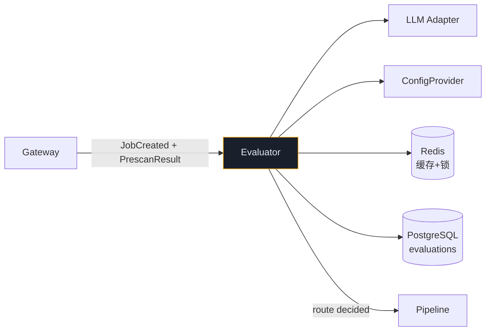

# Evaluator 模块详细设计

> **文档版本**: V1.1  
> **上游依赖**: TA V1.6 §3.2 | BRD V2.1 §12 | BA V1.1 §2.2  
> **模块定位**: 文档质量评估 + 路由决策 — 决定 PDF 走 AUTO / HYBRID / HUMAN_ALL  
> **设计原则**: 路由准确率最优先、缓存防穿透、评估可解释

### V1.1 修订说明

| 变更 ID | 级别 | 说明 | 来源 |
|---------|------|------|------|
| P0-3 | P0 | 评估失败降级策略：LLM API 异常→HUMAN_ALL | Qwen3 |
| P0-4 | P0 | 补充 evaluate_page_lightweight 完整定义 | Kimi |
| P0-5 | P0 | all_blank 预筛直接降级（对齐 BA BR-25） | Qwen3 |
| P1-E1 | P1 | 采样特征加权：按图片密度/OCR率分层 | Gemini |
| P1-E2 | P1 | Redis 锁续约（extend_lock 每 30s） | Gemini |
| P1-E3 | P1 | 方差+熵值双重检查强制 HYBRID | Gemini |
| P1-E4 | P1 | 故障恢复强制读 DB | Qwen3 |
| P1-E5 | P1 | 采样过滤目录页 | Kimi |
| P1-E6 | P1 | 缓存键增加 revision | Kimi |
| P1-E7 | P1 | Prompt 版本存入 Evaluation 报告 | DeepSeek |
| P1-E8 | P1 | Job 级连续 Fallback 熔断信号 | Gemini |
| P1-E9 | P1 | all_blank 直接降级逻辑（代码层） | Qwen3 |

---

## 1. 模块职责边界

### 1.1 职责范围

| 职责 | 说明 | 对齐 |
|------|------|------|
| **采样策略** | ≤40 页全量，>40 页按策略抽样（含空白页排除） | TA §3.2 |
| **多维评分** | LLM 评估采样页 → 维度得分 → 加权聚合 → C_doc | TA §3.2 |
| **路由决策** | C_doc 与 {A, B, PV} 阈值比较 + 方差强制 HYBRID | TA §3.2 |
| **双层缓存** | file_hash + config_version → Redis(快) + DB(持久) | TA §3.2 |
| **分布式锁** | 相同 file_hash 并发评估防穿透 | TA §3.2 |
| **HYBRID 页级评估** | 复用文档级采样 + Qwen 低成本补充 | V1.6:P1-5/P1-7 |
| **评估报告** | 可解释结构化输出（预筛/维度/路由/理由） | V1.6:P1-11 |
| **预筛规则配置化** | Config 模块热更新的 PrescanRuleConfig | V1.6:P1-6 |

### 1.2 不负责的事

| 不做 | 归属 |
|------|------|
| 预筛执行 | Gateway（Prescanner） |
| LLM 调用/熔断 | LLM Adapter |
| 页面处理 | Pipeline |

### 1.3 依赖



---

## 2. 目录结构

```
app/
├── evaluator/
│   ├── __init__.py
│   ├── evaluator.py            # 主入口：缓存→采样→评分→路由
│   ├── sampler.py              # 采样策略（特征加权+目录页过滤）  [V1.1]
│   ├── scorer.py               # 多维度评分 + 加权聚合
│   ├── router.py               # 路由决策（A/B/PV 阈值）+ 降级守卫  [V1.1]
│   ├── cache.py                # 双层缓存（Redis+DB）+ 分布式锁 + 续约  [V1.1]
│   ├── variance_detector.py    # 采样得分方差+熵值检测  [V1.1]
│   ├── hybrid_evaluator.py     # HYBRID 页级评估（复用+Qwen补充）
│   ├── eval_report.py          # 评估报告可解释结构化
│   ├── fallback_monitor.py     # [V1.1] Job 级连续 Fallback 熔断信号
│   ├── schemas.py              # Evaluation, Score, SamplingInfo
│   ├── repository.py           # evaluations 表 CRUD
│   └── constants.py
```

---

## 3. 类图

```mermaid
classDiagram
    class EvaluatorService {
        -cache: EvalCache
        -sampler: Sampler
        -scorer: Scorer
        -router: RouteDecider
        -llm: LLMService
        -prompt: PromptEngine
        -variance: VarianceDetector
        -repo: EvalRepository
        -fallback_monitor: FallbackMonitor
        +evaluate(job, prescan) Evaluation
        -_evaluate_inner(job, prescan, profile) Evaluation
    }

    class EvalCache {
        -redis: Redis
        -db: EvalRepository
        +get(file_hash, config_version, revision?) Evaluation?
        +get_from_db(file_hash, config_version) Evaluation?
        +put(evaluation) void
        +lock(cache_key, timeout) AsyncContextManager
        -_extend_lock_loop(lock_key, interval) void
    }

    class Sampler {
        +FULL_THRESHOLD: 40
        +select_pages(total, blanks, threshold, page_features?) list~int~
        -_stratified_sample(total, blanks) list~int~
        -_feature_weighted_sample(effective, page_features, sample_size) list~int~
        -_is_toc_page(page_no, features) bool
    }

    class Scorer {
        +DIMENSIONS: list~str~
        +aggregate(llm_scores) dict
        +compute_c_doc(dimensions, weights, penalty) float
    }

    class RouteDecider {
        +decide(c_doc, thresholds, variance_forced, prescan?) tuple
        -_build_reason(c_doc, thresholds, route, extra?) str
        -_check_prescan_guard(prescan) tuple?
    }

    class VarianceDetector {
        +check(page_scores, threshold?) tuple~float_bool~
        -_compute_entropy(scores) float
    }

    class HybridEvaluator {
        +evaluate_pages(job, evaluation) dict
        +evaluate_page_lightweight(file_path, page_no, profile) float
    }

    class FallbackMonitor {
        +CONSECUTIVE_THRESHOLD: int
        +on_page_fallback(job_id, page_no) void
        +should_suspend(job_id) bool
        +reset(job_id) void
    }

    class EvalReport {
        +build(evaluation, prescan) EvaluationReport
    }

    EvaluatorService --> EvalCache
    EvaluatorService --> Sampler
    EvaluatorService --> Scorer
    EvaluatorService --> RouteDecider
    EvaluatorService --> VarianceDetector
    EvaluatorService --> HybridEvaluator
    EvaluatorService --> FallbackMonitor
    EvaluatorService --> EvalReport
```



---

## 4. 核心时序图

```mermaid
sequenceDiagram
    autonumber
    participant GW as Gateway
    participant ES as EvaluatorService
    participant Cache as EvalCache
    participant Redis
    participant DB as PostgreSQL
    participant Pool as ProcessPool
    participant LLM as LLM Adapter
    participant Router as RouteDecider

    GW->>+ES: evaluate(job, prescan)

    rect rgb(25, 30, 45)
    Note over ES: [V1.1 P0-5] Step 0: Prescan Guard — all_blank 直接降级
    alt prescan.all_blank == true
        ES->>DB: INSERT INTO evaluations (route=HUMAN_ALL, degrade_reason=prescan_reject)
        ES-->>GW: Evaluation{route=HUMAN_ALL, degrade_reason="prescan_reject"}
    end
    end

    rect rgb(30, 40, 60)
    Note over ES,DB: Step 1: 双层缓存查询
    ES->>+Cache: get(file_hash, config_version)
    Cache->>Redis: GET eval:{hash}:{ver}
    alt Redis 命中
        Redis-->>Cache: cached
        Cache-->>ES: Evaluation
        ES-->>GW: Evaluation (cached)
    else Redis miss
        Cache->>DB: SELECT FROM evaluations WHERE hash+ver
        alt DB 命中
            DB-->>Cache: row
            Cache->>Redis: SETEX (TTL 可配置，默认 24h)
            Cache-->>ES: Evaluation
        else DB miss
            Cache-->>-ES: None
        end
    end
    end

    rect rgb(40, 30, 50)
    Note over ES,LLM: Step 2: 分布式锁内评估 [V1.1] 锁续约
    ES->>Redis: SETNX lock:eval:{hash}:{ver} (300s TTL)
    Note over ES: [V1.1 P1-E2] 启动后台续约协程(每30s PEXPIRE)
    Note over ES: Double-check after lock
    ES->>Redis: GET eval:{hash}:{ver}
    alt 锁内再次命中
        ES-->>GW: Evaluation (race winner)
    end

    Note over ES: [V1.1 P1-E1/E5] 特征加权采样 + 目录页过滤
    ES->>ES: sampler.select_pages(total, blanks, 40, page_features)

    ES->>+Pool: render_pages_batch(file, sample_pages)
    Pool-->>-ES: screenshots[]

    rect rgb(50, 30, 30)
    Note over ES,LLM: [V1.1 P0-3] LLM 调用 + 失败降级
    ES->>+LLM: evaluate_document(screenshots, features, prompt)
    alt LLM 成功
        LLM-->>-ES: Score[]
    else LLM 超时/熔断/异常
        Note over ES: 捕获异常 → route=HUMAN_ALL,<br/>degrade_reason=eval_failed
        ES->>DB: INSERT evaluations (route=HUMAN_ALL, degrade_reason)
        ES-->>GW: Evaluation{route=HUMAN_ALL, degrade_reason="eval_failed"}
    end
    end

    ES->>ES: scorer.aggregate(scores) → dimension_scores
    ES->>ES: scorer.compute_c_doc(dims, weights, penalty)
    Note over ES: [V1.1 P1-E3] 方差+熵值双重检查
    ES->>ES: variance_detector.check(page_scores)
    ES->>+Router: decide(c_doc, thresholds, variance_forced)
    Router-->>-ES: (route, degrade_reason)
    end

    rect rgb(30, 50, 40)
    Note over ES,Redis: Step 3: 先写 DB 再写 Redis [V1.1 P1-E7] 含 prompt_version
    ES->>DB: INSERT INTO evaluations (含 prompt_version)
    ES->>Redis: SETEX eval:{hash}:{ver} TTL
    ES->>Redis: DEL lock:eval:{hash}:{ver}
    end

    ES-->>-GW: Evaluation{route=HYBRID, c_doc=0.72}
```



---

## 5. 组件详细规格

### 5.1 EvaluatorService — 主入口

```python
class EvaluatorService:
    """
    [V1.1] 变更：
    - P0-3: LLM 异常时降级 HUMAN_ALL（不再抛异常卡死 Job）
    - P0-5: all_blank 预筛直接降级（对齐 BA BR-25）
    - P1-E2: 分布式锁续约（后台协程每 30s PEXPIRE）
    - P1-E4: 故障恢复时 get_from_db 强制读 DB
    - P1-E7: prompt_version 存入 Evaluation
    """

    async def evaluate(self, job: PDFJob, prescan: PrescanResult) -> Evaluation:
        profile = config.get_profile(job.frozen_config_version)

        # [V1.1 P0-5] Prescan Guard: all_blank 直接降级
        if prescan.all_blank:
            return await self._create_degraded_evaluation(
                job, prescan, profile,
                route="HUMAN_ALL", degrade_reason="prescan_reject")

        # [V1.1 P1-E6] 缓存键包含 revision（同文件不同修订版重新评估）
        cache_key = f"{job.file_hash}:{job.frozen_config_version}"
        if job.file_revision:
            cache_key += f":{job.file_revision}"

        # 1. 缓存查询
        cached = await self._cache.get(cache_key)
        if cached:
            return cached

        # 2. 分布式锁内评估 [V1.1 P1-E2 锁续约]
        async with self._cache.lock(cache_key, timeout=300) as lock_ctx:
            cached = await self._cache.get(cache_key)
            if cached:
                return cached

            try:
                return await self._evaluate_inner(job, prescan, profile, cache_key)
            except (LLMCircuitOpenError, LLMTimeoutError, Exception) as e:
                # [V1.1 P0-3] 评估失败降级：不让 Job 卡死
                logger.error("eval_failed_degrade",
                    job_id=str(job.job_id), error=str(e))
                metrics.eval_degrade_total.labels(reason="eval_failed").inc()
                return await self._create_degraded_evaluation(
                    job, prescan, profile,
                    route="HUMAN_ALL", degrade_reason=f"eval_failed:{type(e).__name__}")

    async def _evaluate_inner(
        self, job: PDFJob, prescan: PrescanResult,
        profile: ThresholdProfile, cache_key: str
    ) -> Evaluation:
        # 3. 采样+截图 [V1.1 P1-E1 特征加权 + P1-E5 目录页过滤]
        page_features = prescan.page_features if hasattr(prescan, 'page_features') else None
        sample_pages = self._sampler.select_pages(
            job.total_pages, prescan.blank_pages,
            threshold=40, page_features=page_features)
        screenshots = await asyncio.get_event_loop().run_in_executor(
            process_pool, render_pages_batch, job.file_path, sample_pages)
        features = [extract_quick_features(job.file_path, p) for p in sample_pages]

        # 4. LLM 评估（异常由上层 P0-3 捕获）
        llm_scores = await self._llm.evaluate_document(
            screenshots=screenshots, features=features,
            prompt=self._prompt.get_eval_prompt(profile))

        # 5. 聚合+路由 [V1.1 P1-E3 方差+熵值]
        dimension_scores = self._scorer.aggregate(llm_scores)
        c_doc = self._scorer.compute_c_doc(
            dimension_scores, profile.weights, prescan.total_penalty)
        page_scores = [s.overall for s in llm_scores]
        variance, variance_forced = self._variance.check(
            page_scores,
            threshold=profile.prescan_rules.get("score_variance_threshold"))
        route, degrade_reason = self._router.decide(
            c_doc, profile.thresholds, variance_forced)

        # 6. 构建+持久化 [V1.1 P1-E7 prompt_version]
        evaluation = Evaluation(
            file_hash=job.file_hash,
            config_version=job.frozen_config_version,
            file_revision=getattr(job, 'file_revision', None),
            doc_confidence=c_doc, route=route,
            degrade_reason=degrade_reason,
            dimension_scores=dimension_scores,
            weights_snapshot=profile.weights,
            sampling=SamplingInfo(pages=sample_pages, variance=variance),
            prescan=prescan,
            model_used=self._llm.current_model_name,
            prompt_version=self._prompt.get_version("eval_document"),
            page_evaluations={str(p): s.overall
                for p, s in zip(sample_pages, llm_scores)},
        )
        await self._repo.insert(evaluation)
        await self._cache.put(cache_key, evaluation)
        return evaluation

    async def _create_degraded_evaluation(
        self, job, prescan, profile, route, degrade_reason
    ) -> Evaluation:
        """创建降级评估结果（P0-3/P0-5 共用）"""
        evaluation = Evaluation(
            file_hash=job.file_hash,
            config_version=job.frozen_config_version,
            doc_confidence=0.0, route=route,
            degrade_reason=degrade_reason,
            dimension_scores={},
            weights_snapshot=profile.weights,
            sampling=SamplingInfo(pages=[], variance=0.0),
            prescan=prescan,
            model_used=None,
            prompt_version=None,
            page_evaluations={},
        )
        await self._repo.insert(evaluation)
        return evaluation
```

### 5.2 RouteDecider — 路由决策

```python
class RouteDecider:
    """
    路由决策矩阵：
    ┌─────────────────────────────┬──────────┐
    │ 条件                         │ 路由      │
    ├─────────────────────────────┼──────────┤
    │ c_doc ≥ A(0.90)             │ AUTO     │
    │ B(0.40) ≤ c_doc < A        │ HYBRID   │
    │ c_doc < B(0.40)             │ HUMAN_ALL│
    │ variance_forced = true      │ HYBRID   │
    └─────────────────────────────┴──────────┘
    不变式 INV-01: B < PV < A (由 Config 模块保证)
    """

    def decide(
        self, c_doc: float, thresholds: dict, variance_forced: bool
    ) -> tuple[str, str | None]:
        A = thresholds.get("A", 0.90)
        B = thresholds.get("B", 0.40)

        if variance_forced and c_doc >= B:
            route = "HYBRID"
            reason = self._build_reason(c_doc, thresholds, route,
                                         extra="variance_forced")
            return route, reason

        if c_doc >= A:
            return "AUTO", None
        elif c_doc >= B:
            return "HYBRID", self._build_reason(c_doc, thresholds, "HYBRID")
        else:
            return "HUMAN_ALL", self._build_reason(c_doc, thresholds, "HUMAN_ALL")

    def _build_reason(self, c_doc, thresholds, route, extra=None) -> str:
        parts = [f"C_doc={c_doc:.3f}"]
        parts.append(f"A={thresholds.get('A', 0.90)}")
        parts.append(f"B={thresholds.get('B', 0.40)}")
        parts.append(f"→ {route}")
        if extra:
            parts.append(f"({extra})")
        return ", ".join(parts)
```

### 5.3 Sampler — 采样策略

```python
class Sampler:
    """
    [V1.1] 变更：
    - P1-E1: 特征加权采样（按图片密度/OCR率分层），避免复杂页集中在未采样区
    - P1-E5: 过滤目录页（目录页被采中会拉低评分导致误判 HUMAN_ALL）
    """

    FULL_THRESHOLD = 40
    TOC_KEYWORDS = {"目录", "contents", "table of contents", "index"}

    def select_pages(
        self, total: int, blank_pages: list[int],
        threshold: int = None, page_features: dict | None = None,
    ) -> list[int]:
        threshold = threshold or self.FULL_THRESHOLD
        effective = [p for p in range(1, total + 1) if p not in (blank_pages or [])]

        # [V1.1 P1-E5] 过滤目录页
        if page_features:
            effective = [p for p in effective
                         if not self._is_toc_page(p, page_features)]

        if len(effective) <= threshold:
            return effective

        # [V1.1 P1-E1] 特征加权采样
        if page_features:
            return self._feature_weighted_sample(effective, page_features, threshold)

        # Fallback: 原始分层抽样
        return self._stratified_sample(effective, threshold)

    def _feature_weighted_sample(
        self, effective: list[int], page_features: dict, sample_size: int
    ) -> list[int]:
        """
        按特征复杂度分层：
        - 高复杂度（图片密度 > 5 或 OCR 率 < 0.5）：权重 3
        - 中复杂度：权重 2
        - 低复杂度：权重 1
        各层按比例抽样，确保首尾各 2 页必选。
        """
        head = effective[:2]
        tail = effective[-2:]
        middle = [p for p in effective if p not in head and p not in tail]

        high, med, low = [], [], []
        for p in middle:
            feat = page_features.get(p, {})
            img_density = feat.get("image_count", 0)
            ocr_rate = feat.get("ocr_rate", 1.0)
            if img_density > 5 or ocr_rate < 0.5:
                high.append(p)
            elif img_density > 2 or ocr_rate < 0.8:
                med.append(p)
            else:
                low.append(p)

        remaining = sample_size - len(head) - len(tail)
        total_weight = len(high) * 3 + len(med) * 2 + len(low) * 1
        if total_weight == 0:
            return sorted(set(head + tail))

        def pick(pool, weight):
            n = max(1, int(remaining * len(pool) * weight / total_weight))
            return random.sample(pool, min(n, len(pool)))

        selected = head + tail + pick(high, 3) + pick(med, 2) + pick(low, 1)
        return sorted(set(selected))[:sample_size]

    def _stratified_sample(self, effective: list[int], sample_size: int) -> list[int]:
        """原始分层抽样（首尾各 2 页 + 中间均匀）"""
        head = effective[:2]
        tail = effective[-2:]
        middle_pool = effective[2:-2]
        remaining = sample_size - len(head) - len(tail)
        if remaining > 0 and middle_pool:
            step = max(1, len(middle_pool) // remaining)
            middle = middle_pool[::step][:remaining]
        else:
            middle = []
        return sorted(set(head + middle + tail))

    def _is_toc_page(self, page_no: int, page_features: dict) -> bool:
        """检测目录页：文字含目录关键词 + 图片数 = 0"""
        feat = page_features.get(page_no, {})
        text_hint = feat.get("text_hint", "").lower()
        return (feat.get("image_count", 0) == 0 and
                any(kw in text_hint for kw in self.TOC_KEYWORDS))
```

### 5.4 HybridEvaluator — HYBRID 页级评估

```python
class HybridEvaluator:
    """
    HYBRID 模式页级评估（V1.6:P1-5/P1-7）：
    - 已采样页：复用文档级得分（零 LLM 成本）
    - 未采样页：Qwen 低成本模型评估（Gemini 40% 成本）
    """

    async def evaluate_pages(
        self, job: PDFJob, evaluation: Evaluation
    ) -> dict[int, float]:
        sampled_scores = evaluation.page_evaluations or {}
        profile = config.get_profile(job.frozen_config_version)
        results = {}

        for page_no in range(1, job.total_pages + 1):
            if page_no in (evaluation.prescan.blank_pages or []):
                continue
            if str(page_no) in sampled_scores:
                results[page_no] = sampled_scores[str(page_no)]
            else:
                score = await self.evaluate_page_lightweight(
                    job.file_path, page_no, profile)
                results[page_no] = score

        return results

    async def evaluate_page_lightweight(
        self, file_path: str, page_no: int, profile: ThresholdProfile
    ) -> float:
        """
        [V1.1 P0-4] 轻量页级评估 — 完整定义

        模型：Qwen 标准模型（成本约 Gemini 的 40%）
        输入：单页截图 150 DPI + 快速特征（OCR 率、图片数、文本密度）
        输出：0.0~1.0 置信度分数
        超时：单页 30s
        错误：超时/异常 → 返回 0.5（中性分，不影响路由倾向）

        Prompt 模板：
        ---
        You are evaluating a single page from a product catalog PDF.
        Rate the page's suitability for automated SKU extraction on a 0.0-1.0 scale.
        Consider: text clarity, image quality, layout structure, table regularity.
        Respond with ONLY a JSON: {"score": 0.XX, "reason": "brief explanation"}
        ---
        """
        try:
            screenshot = await asyncio.get_event_loop().run_in_executor(
                process_pool, render_single_page, file_path, page_no, 150)  # 150 DPI
            features = extract_quick_features(file_path, page_no)

            result = await asyncio.wait_for(
                self._llm.evaluate_single_page(
                    screenshot=screenshot,
                    features=features,
                    prompt=self._prompt.get_eval_prompt(profile, variant="lightweight"),
                    model_override="QWEN_STANDARD",
                ),
                timeout=30.0,
            )
            return result.score
        except (asyncio.TimeoutError, Exception) as e:
            logger.warning("lightweight_eval_failed",
                page_no=page_no, error=str(e))
            return 0.5  # 中性分：不会倾向 AUTO 也不会倾向 HUMAN
```

### 5.5 FallbackMonitor — Job 级连续 Fallback 熔断

```python
class FallbackMonitor:
    """
    [V1.1 P1-E8] Job 级连续 Fallback 熔断信号

    Pipeline 连续 N 页触发 Fallback → 暂停 Job → 剩余页强制 HUMAN_PAGE。
    由 Pipeline Orchestrator 调用 on_page_fallback()，通过 should_suspend() 查询。
    """

    CONSECUTIVE_THRESHOLD = 3  # 连续 3 页 Fallback 即触发

    def __init__(self):
        self._counters: dict[str, int] = {}  # job_id → consecutive count

    def on_page_fallback(self, job_id: str, page_no: int):
        """Pipeline 每次页面 Fallback 时调用"""
        self._counters[job_id] = self._counters.get(job_id, 0) + 1
        if self._counters[job_id] >= self.CONSECUTIVE_THRESHOLD:
            logger.warning("job_fallback_threshold_reached",
                job_id=job_id, consecutive=self._counters[job_id])
            metrics.eval_job_suspended_total.inc()

    def on_page_success(self, job_id: str):
        """Pipeline 页面成功处理时重置计数"""
        self._counters[job_id] = 0

    def should_suspend(self, job_id: str) -> bool:
        return self._counters.get(job_id, 0) >= self.CONSECUTIVE_THRESHOLD

    def reset(self, job_id: str):
        self._counters.pop(job_id, None)
```

---

## 6. 错误处理

| 场景 | 处理 | 降级 |
|------|------|------|
| [V1.1 P0-5] all_blank 预筛 | 直接降级，不进入 LLM 评估 | route=HUMAN_ALL, reason=prescan_reject |
| [V1.1 P0-3] LLM 评估超时/异常 | 捕获所有异常，创建降级 Evaluation | route=HUMAN_ALL, reason=eval_failed:{ExceptionType} |
| LLM 全熔断 | 捕获 LLMCircuitOpenError | route=HUMAN_ALL, reason=eval_failed:LLMCircuitOpenError |
| Redis 缓存不可用 | 跳过缓存直接 DB | 日志 WARNING |
| [V1.1 P1-E4] 故障恢复 | get_from_db 强制读 DB，忽略 Redis | 确保数据一致性 |
| 分布式锁超时 | [V1.1 P1-E2] 续约协程避免提前释放 | 续约失败则释放锁，重试一次 |
| 采样页过少(<3) | 全量评估 | — |
| [V1.1 P1-E8] 连续 Fallback | Pipeline 调用 FallbackMonitor | 通知 Orchestrator 挂起 Job |

---

## 7. Prometheus 指标

```python
eval_cache_total = Counter("eval_cache_total", "Cache hits/misses", ["result"])
eval_duration_seconds = Histogram("eval_duration_seconds", "Evaluation time")
eval_route_total = Counter("eval_route_total", "Route decisions", ["route"])
eval_c_doc = Histogram("eval_c_doc", "C_doc distribution", buckets=[0.1,0.2,0.3,0.4,0.5,0.6,0.7,0.8,0.9,1.0])
eval_variance_forced_total = Counter("eval_variance_forced_total", "Variance-forced HYBRID")
# [V1.1] 新增
eval_degrade_total = Counter("eval_degrade_total", "Degraded evaluations", ["reason"])
eval_lock_renewed_total = Counter("eval_lock_renewed_total", "Lock renewal count")
eval_toc_filtered_total = Counter("eval_toc_filtered_total", "TOC pages filtered from sampling")
eval_job_suspended_total = Counter("eval_job_suspended_total", "Jobs suspended by FallbackMonitor")
eval_lightweight_duration = Histogram("eval_lightweight_duration", "Lightweight page eval time")
```

---

## 8. 交付清单

| 文件 | 行数(估) | 优先级 | V1.1 变更 |
|------|---------|--------|----------|
| `evaluator.py` | ~280 | P0 | +80: 降级逻辑 / prescan guard / cache_key revision |
| `sampler.py` | ~150 | P0 | +70: 特征加权采样 / 目录页过滤 |
| `scorer.py` | ~100 | P0 | — |
| `router.py` | ~80 | P0 | — |
| `cache.py` | ~160 | P0 | +40: 锁续约 / get_from_db / TTL 可配置 |
| `variance_detector.py` | ~60 | P0 | +20: 熵值计算 / 阈值配置化 |
| `hybrid_evaluator.py` | ~140 | P1 | +60: evaluate_page_lightweight 完整实现 |
| `fallback_monitor.py` | ~50 | P1 | 🆕 新增 |
| `eval_report.py` | ~80 | P1 | +20: prompt_version 字段 |
| `schemas.py` | ~100 | P0 | +20: file_revision / degrade fields |
| `repository.py` | ~80 | P0 | — |
| `constants.py` | ~40 | P0 | +10: 新增配置项 |
| **总计** | **~1320** | — | **+370（V1.0: 950 → V1.1: 1320）** |
