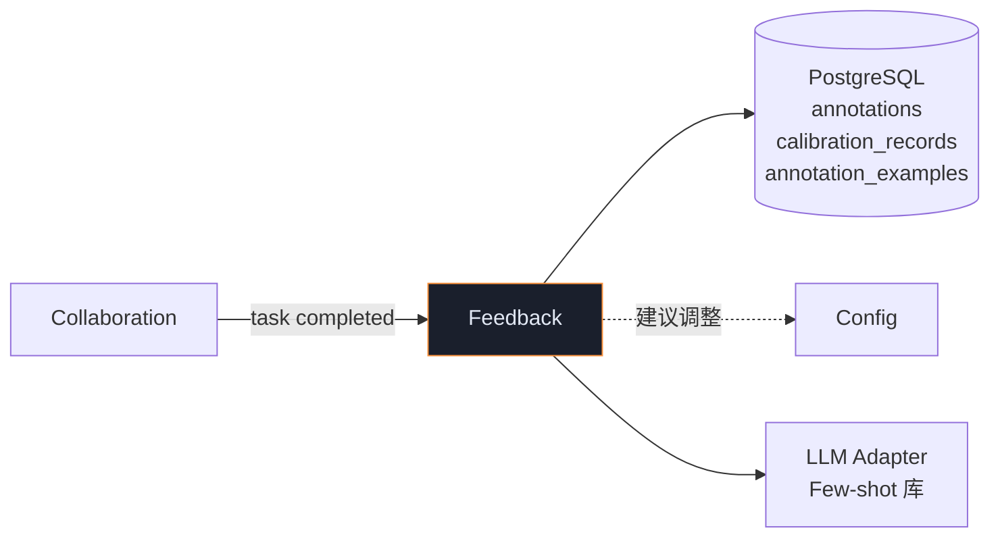
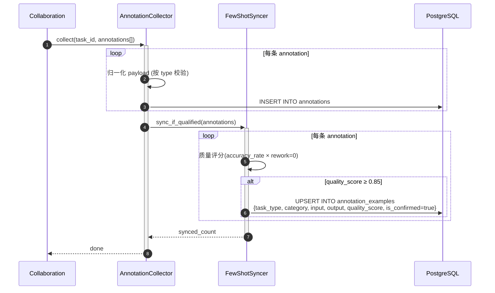

# Feedback 模块详细设计

> **文档版本**: V1.1  
> **上游依赖**: TA V1.6 §3.8 | BA V1.1 §4.8 | BRD V2.1 §11  
> **模块定位**: 闭环反馈 — 标注采集 → 阈值校准 → 属性升级  
> **设计原则**: 数据驱动自动校准、升级需人工确认、不破坏在途 Job

### V1.1 修订说明

| 变更 ID | 级别 | 说明 | 来源 |
|---------|------|------|------|
| P0-1 | P0 | 校准安全护栏：±10% 限幅 + 样本量门槛 + 异常检测 | Gemini |
| P1-FC1 | P1 | Few-shot 入库双人共识（≥2 名高分标注员一致） | Gemini |
| P1-FC2 | P1 | 校准触发最小样本量动态策略 | ChatGPT |
| P1-FC3 | P1 | 审批与 Config 联动细节 | DeepSeek |
| P1-FC4 | P1 | 校准审批 SLA（48h 未审批自动提醒） | Kimi |

---

## 1. 模块职责边界

| 职责 | 说明 | 对齐 |
|------|------|------|
| **标注采集** | 人工完成后结构化记录写入 annotations 表（8种类型） | V1.6:P0-4, BA §4.8 |
| **Few-shot 同步** | 优质标注样本同步至 annotation_examples 表 | T36 |
| **校准触发** | 每日 03:00 检查近 7 天标注量 > 50 → 自动校准 | TA §3.8 |
| **校准引擎** | AI 输出 vs 人工修正偏差分析 → 建议阈值调整 | V1.6:P1-2 |
| **属性升级** | 品类内同一非标属性确认 ≥20 次 → 建议纳入 required_fields | BR-21, V1.6:P0-4 |

### 8 种 Annotation 类型

| 类型 | 说明 |
|------|------|
| PAGE_TYPE_CORRECTION | 页面分类修正 |
| TEXT_ROLE_CORRECTION | 文本角色修正 |
| IMAGE_ROLE_CORRECTION | 图片角色修正 |
| SKU_ATTRIBUTE_CORRECTION | SKU 属性修正 |
| BINDING_CORRECTION | 绑定关系修正 |
| CUSTOM_ATTR_CONFIRM | 非标属性确认 |
| NEW_TYPE_REPORT | 新类型上报 |
| LAYOUT_CORRECTION | 版面类型修正 |

### 依赖



---

## 2. 目录结构

```
app/
├── feedback/
│   ├── __init__.py
│   ├── annotation_collector.py     # 标注采集 + 归一化
│   ├── few_shot_syncer.py          # 优质样本 → annotation_examples
│   ├── calibration_engine.py       # 偏差分析 + 阈值建议
│   ├── attr_promotion_checker.py   # 非标属性升级检查
│   ├── schemas.py
│   ├── repository.py
│   └── constants.py
```

---

## 3. 核心时序图

### 3.1 标注采集 + Few-shot 同步



### 3.2 校准 + 属性升级（定时任务）

```mermaid
sequenceDiagram
    autonumber
    participant Cron as APScheduler
    participant CE as CalibrationEngine
    participant APC as AttrPromotionChecker
    participant DB as PostgreSQL
    participant CFG as Config Module

    rect rgb(30, 40, 60)
    Note over Cron,CE: 每日 03:00 — 阈值校准
    Cron->>+CE: check_and_calibrate()
    CE->>DB: SELECT COUNT(*) FROM annotations<br/>WHERE annotated_at > now()-7d
    alt count < 50
        CE-->>Cron: skip (数据不足)
    else count ≥ 50
        CE->>DB: SELECT type, payload<br/>FROM annotations WHERE annotated_at > now()-7d
        CE->>CE: 偏差分析：<br/>AI page_type vs 人工修正 → confusion matrix<br/>AI confidence 分布 vs 实际准确率
        CE->>CE: 建议：B 上调 0.05 / A 下调 0.03
        CE->>DB: INSERT INTO calibration_records<br/>{analysis, suggestion, status='PENDING'}
        Note over CE: 建议需人工审批后<br/>通过 Config API 生效
    end
    CE-->>-Cron: done
    end

    rect rgb(40, 30, 50)
    Note over Cron,APC: 每日 02:00 — 属性升级
    Cron->>+APC: check_promotions()
    APC->>DB: SELECT payload->>'attr_name' AS attr,<br/>category, COUNT(*)<br/>FROM annotations<br/>WHERE type='CUSTOM_ATTR_CONFIRM'<br/>GROUP BY attr, category<br/>HAVING COUNT(*) >= 20
    loop 每个候选属性
        APC->>DB: INSERT INTO calibration_records<br/>{type='ATTR_PROMOTION', suggestion, status='PENDING'}
        Note over APC: 运营审批后：<br/>Config.category_schema.required_fields += attr
    end
    APC-->>-Cron: candidates_count
    end
```



---

## 4. 组件详细规格

### 4.1 CalibrationEngine — 偏差分析

```python
class CalibrationEngine:
    """
    [V1.1] 变更：
    - P0-1: 校准安全护栏
      ① 单次阈值变动不得超过 ±10%（硬限制）
      ② 样本量 < MIN_SAMPLES 且标注员数 < MIN_ANNOTATORS 时不触发
      ③ 标注分布偏移（KL 散度 > 阈值）时报警而非自动建议
    - P1-FC2: MIN_SAMPLES 可配置（从 Config 读取）
    - P1-FC3: 审批与 Config 联动：建议生成后自动推送到运营后台
    - P1-FC4: 审批 SLA — PENDING 超 48h 自动提醒运营
    """

    ANALYSIS_WINDOW_DAYS = 7
    MAX_THRESHOLD_DRIFT = 0.10      # [V1.1 P0-1] ±10% 限幅
    MIN_ANNOTATORS = 3              # [V1.1 P0-1] 最少标注员数
    KL_DIVERGENCE_THRESHOLD = 0.5   # [V1.1 P0-1] 分布偏移报警阈值
    APPROVAL_SLA_HOURS = 48         # [V1.1 P1-FC4] 审批超时提醒

    async def check_and_calibrate(self):
        # [V1.1 P1-FC2] MIN_SAMPLES 从 Config 动态读取
        min_samples = config.get_value("calibration_min_samples", default=50)

        cutoff = datetime.utcnow() - timedelta(days=self.ANALYSIS_WINDOW_DAYS)
        count = await self._repo.count_recent_annotations(cutoff)
        if count < min_samples:
            return

        # [V1.1 P0-1] 最少标注员数检查
        annotator_count = await self._repo.count_distinct_annotators(cutoff)
        if annotator_count < self.MIN_ANNOTATORS:
            logger.info("calibration_skipped_few_annotators",
                count=annotator_count, min=self.MIN_ANNOTATORS)
            return

        annotations = await self._repo.get_recent_annotations(cutoff)
        suggestions = []

        # 1. 页面分类偏差
        page_corrections = [a for a in annotations if a.type == "PAGE_TYPE_CORRECTION"]
        if page_corrections:
            confusion = self._build_confusion_matrix(page_corrections)
            accuracy = self._calc_accuracy(confusion)
            if accuracy < 0.85:
                suggestions.append({
                    "action": "review_classify_prompt",
                    "accuracy": accuracy, "confusion": confusion})

        # 2. 置信度校准
        sku_corrections = [a for a in annotations if a.type == "SKU_ATTRIBUTE_CORRECTION"]
        if sku_corrections:
            bias = self._analyze_confidence_bias(sku_corrections)

            # [V1.1 P0-1] 安全护栏：限幅 + 异常检测
            if abs(bias.threshold_drift) > self.MAX_THRESHOLD_DRIFT:
                logger.warning("calibration_drift_clamped",
                    raw_drift=bias.threshold_drift,
                    clamped=self.MAX_THRESHOLD_DRIFT)
                bias.threshold_drift = max(-self.MAX_THRESHOLD_DRIFT,
                    min(self.MAX_THRESHOLD_DRIFT, bias.threshold_drift))

            # [V1.1 P0-1] KL 散度异常检测
            kl_div = self._compute_kl_divergence(sku_corrections)
            if kl_div > self.KL_DIVERGENCE_THRESHOLD:
                logger.error("calibration_distribution_anomaly",
                    kl_divergence=kl_div, threshold=self.KL_DIVERGENCE_THRESHOLD)
                metrics.calibration_anomaly_total.inc()
                # 报警但不生成建议
                return

            if abs(bias.threshold_drift) > 0.02:
                suggestions.append({
                    "action": "adjust_thresholds",
                    "current_B": bias.current_B,
                    "suggested_B": bias.current_B + bias.threshold_drift,
                    "drift_clamped": abs(bias.threshold_drift) >= self.MAX_THRESHOLD_DRIFT,
                })

        if not suggestions:
            return

        # 3. 记录建议（需人工审批）
        record = CalibrationRecord(
            analysis_window=f"{cutoff.date()} ~ {date.today()}",
            sample_count=count,
            annotator_count=annotator_count,
            suggestions=suggestions,
            status="PENDING",
        )
        await self._repo.save_calibration(record)
        metrics.calibration_triggered_total.inc()

        # [V1.1 P1-FC3] 推送到运营后台审批队列
        await self._notify_ops_approval(record)

    async def check_approval_sla(self):
        """
        [V1.1 P1-FC4] 定时检查：PENDING 超 48h 自动提醒运营
        """
        stale = await self._repo.get_stale_pending_calibrations(
            self.APPROVAL_SLA_HOURS)
        for record in stale:
            await self._notifier.send(
                channel="ops",
                message=f"⚠️ 校准建议 #{record.id} 已超 {self.APPROVAL_SLA_HOURS}h 未审批",
                level="WARNING")
            metrics.calibration_approval_reminder_total.inc()

    async def _notify_ops_approval(self, record):
        """[V1.1 P1-FC3] 推送审批通知到运营后台"""
        await self._notifier.send(
            channel="ops",
            message=f"📊 新校准建议 #{record.id}：{len(record.suggestions)} 条变更待审批",
            level="INFO",
            action_url=f"/admin/calibration/{record.id}/review")

    def _compute_kl_divergence(self, corrections) -> float:
        """[V1.1 P0-1] 计算标注分布与 AI 预测分布的 KL 散度"""
        from collections import Counter
        import math
        ai_dist = Counter(c.payload.get("ai_confidence_bucket") for c in corrections)
        human_dist = Counter(c.payload.get("corrected_confidence_bucket") for c in corrections)
        total = sum(ai_dist.values()) or 1
        kl = 0.0
        for key in set(ai_dist) | set(human_dist):
            p = (ai_dist.get(key, 0) + 1) / (total + len(ai_dist))
            q = (human_dist.get(key, 0) + 1) / (total + len(human_dist))
            kl += p * math.log(p / q)
        return kl

    def _build_confusion_matrix(self, corrections):
        matrix = {}
        for c in corrections:
            ai = c.payload.get("ai_page_type")
            human = c.payload.get("corrected_page_type")
            key = (ai, human)
            matrix[key] = matrix.get(key, 0) + 1
        return matrix
```

### 4.2 AttrPromotionChecker — 属性升级

```python
class AttrPromotionChecker:
    PROMOTION_THRESHOLD = 20  # 同品类同属性确认 ≥20 次

    async def check_promotions(self) -> list[dict]:
        candidates = await self._repo.get_promotion_candidates(
            self.PROMOTION_THRESHOLD)
        
        results = []
        for c in candidates:
            record = CalibrationRecord(
                type="ATTR_PROMOTION",
                suggestions={
                    "category": c.category,
                    "attr_name": c.attr_name,
                    "confirm_count": c.count,
                    "action": f"Add '{c.attr_name}' to {c.category}.required_fields",
                },
                status="PENDING",
            )
            await self._repo.save_calibration(record)
            results.append(record)
        
        return results
```

### 4.3 FewShotSyncer

```python
class FewShotSyncer:
    """
    [V1.1 P1-FC1] Few-shot 入库双人共识：
    同一类型+同一品类的样本需 ≥2 名高分标注员达成一致方可入库。
    防止单个错误标注污染 Few-shot 库。
    """

    QUALITY_THRESHOLD = 0.85
    MIN_CONSENSUS_COUNT = 2  # [V1.1 P1-FC1]

    async def sync_if_qualified(self, annotations: list, task: HumanTask):
        annotator_profile = await self._profiler.get_profile(task.assigned_to)
        base_quality = annotator_profile.accuracy_rate

        for ann in annotations:
            quality = base_quality * (1.0 if task.rework_count == 0 else 0.7)
            if quality < self.QUALITY_THRESHOLD:
                continue

            # [V1.1 P1-FC1] 双人共识检查
            consensus_key = f"{ann.type}:{ann.payload.get('category', 'default')}"
            consensus_count = await self._repo.count_consensus(
                consensus_key,
                output_hash=self._hash_output(ann.payload),
                min_quality=self.QUALITY_THRESHOLD)

            if consensus_count + 1 >= self.MIN_CONSENSUS_COUNT:
                await self._repo.upsert_example(
                    task_type=ann.type,
                    category=ann.payload.get("category"),
                    input_context=ann.payload.get("input_context", ""),
                    output_json=ann.payload,
                    quality_score=quality,
                    is_confirmed=True,
                    consensus_count=consensus_count + 1,
                )
                metrics.few_shot_synced_total.inc()
            else:
                # 记录候选（等待第二人确认）
                await self._repo.save_consensus_candidate(
                    consensus_key=consensus_key,
                    output_hash=self._hash_output(ann.payload),
                    annotator_id=task.assigned_to,
                    quality_score=quality,
                    payload=ann.payload)

    def _hash_output(self, payload: dict) -> str:
        """对输出内容做哈希（忽略元数据字段），用于共识匹配"""
        import hashlib
        canonical = json.dumps(
            {k: v for k, v in sorted(payload.items())
             if k not in ("annotator", "timestamp", "task_id")},
            ensure_ascii=False)
        return hashlib.sha256(canonical.encode()).hexdigest()[:16]
```

---

## 5. 定时任务

| 任务 | 时间 | 锁 | 说明 | V1.1 变更 |
|------|------|-----|------|----------|
| 属性升级检查 | 02:00 | Redis lock | 非标属性频次统计 | — |
| 阈值校准 | 03:00 | Redis lock | 偏差分析 + 建议 | P0-1 安全护栏 |
| 审批超时提醒 | 06:00 | Redis lock | [V1.1 P1-FC4] PENDING >48h 提醒 | 🆕 |

---

## 6. Prometheus 指标

```python
annotation_collected_total = Counter("annotation_collected_total", "", ["type"])
few_shot_synced_total = Counter("few_shot_synced_total", "")
calibration_triggered_total = Counter("calibration_triggered_total", "")
attr_promotion_candidate_total = Counter("attr_promotion_candidate_total", "", ["category"])
# [V1.1] 新增
calibration_anomaly_total = Counter("calibration_anomaly_total", "KL divergence exceeded")
calibration_drift_clamped_total = Counter("calibration_drift_clamped_total", "Drift clamped to ±10%")
calibration_approval_reminder_total = Counter("calibration_approval_reminder_total", "")
few_shot_consensus_pending_total = Counter("few_shot_consensus_pending_total", "Awaiting 2nd consensus")
```

---

## 7. 交付清单

| 文件 | 行数(估) | 优先级 | V1.1 变更 |
|------|---------|--------|----------|
| `annotation_collector.py` | ~100 | P0 | — |
| `few_shot_syncer.py` | ~130 | P0 | +50: 双人共识 |
| `calibration_engine.py` | ~350 | P1 | +150: 安全护栏/KL散度/审批联动/SLA |
| `attr_promotion_checker.py` | ~80 | P1 | — |
| `schemas.py` | ~80 | P0 | +20: ConsensusCandidate |
| `repository.py` | ~110 | P0 | +30: consensus 表 CRUD |
| `constants.py` | ~30 | P0 | +10 |
| **总计** | **~880** | — | **+260（V1.0: 620 → V1.1: 880）** |
