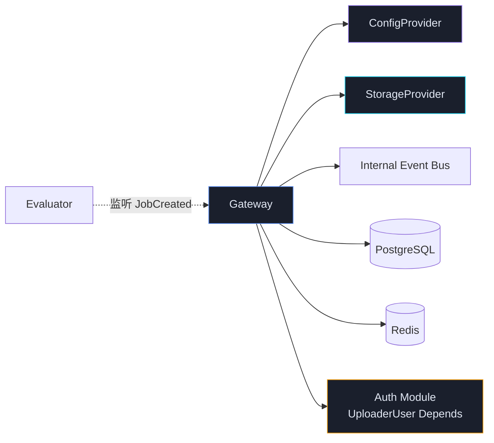
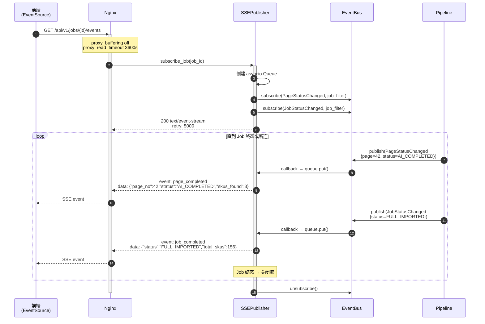
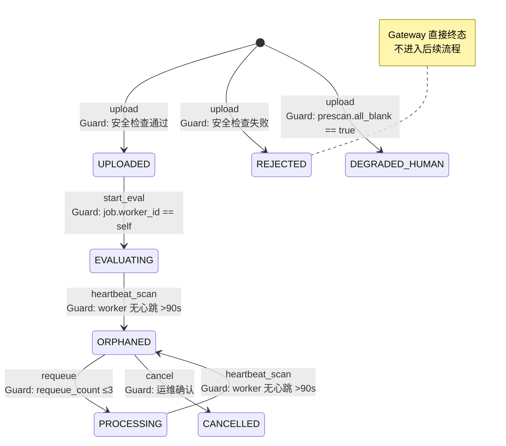

# Gateway 模块详细设计

> **文档版本**: V1.2
> **上游依赖**: TA V1.6 §3.1 + §2.4 + §2.5 + §2.6 | BRD V2.1 | BA V1.1 | OpenAPI V1.7
> **模块定位**: 系统入口层，承接文件上传 → 安全检查 → Job 创建 → Worker 心跳全链路
> **设计原则**: 防御性编程（不信任任何外部输入）、先落库再发事件（Outbox）、快速失败
>
> **V1.1 修订** (评审来源: Kimi 2.5 / Qwen3 / ChatGPT 5.2 / GLM-5 / DeepSeek)
> - [C1] 二阶段阈值明确化：上传允许 16GB，Job 创建 pages≤1000
> - [C2] 补齐 Job Affinity 路由机制（Nginx + Redis 映射）
> - [C3] merchant_id 从 JWT 推导，request body 移除
> - [C5] OrphanScanner 锁 TTL 延长至 10min + watchdog
> - [C7] 错误码三分类：VALIDATION / SECURITY / PRESCAN
> - [D1] PDFSecurityChecker 增加 doc.get_js() 全面检测
> - [D3] JobFactory 事务边界优化：先移动文件再落库
> - [G1] tus 目录改 /data/tus-uploads
> - [G2] Worker ID 支持环境变量注入
> - [G4] Prescanner fitz.open() 上下文管理器
> - [G6] 文件移动前磁盘空间检查
> - [C6] SSE 契约化：事件枚举 + 心跳 + 背压

---

## 1. 模块职责边界

### 1.1 职责范围

| 职责 | 说明 | 对齐 |
|------|------|------|
| **tus 文件上传** | 接收前端 tus 协议分片上传，管理临时文件生命周期 | UI/UX §8.7 |
| **文件校验** | 类型、大小、页数前置校验 | TA §3.1 validator |
| **PDF 安全检查** | JS 注入、加密、PDF 炸弹检测（进程隔离 + 超时） | TA §3.1 pdf_security |
| **规则预筛** | 全空白检测、OCR 率/图片率扣分（热配置） | TA §3.1 prescanner, V1.6:P1-6 |
| **Job 创建** | 冻结配置、绑定 worker_id、落库、发事件 | TA §3.1 job_factory |
| **Worker 心跳** | 30s 定时上报至 Redis，TTL 90s | TA T52 |
| **孤儿扫描** | 检测无心跳 Worker 的未完成 Job → ORPHANED | TA T52 |
| **孤儿重提** | 自动或手动将 ORPHANED Job 迁移到存活实例 | TA T52 |
| **Job 查询** | 用户侧 5 态映射、友好错误消息、操作提示 | TA T54 |
| **Job 取消** | 任意非终态 → CANCELLED，清理资源 | TA §2.6 |
| **SSE 推送** | Job 进度事件流（Nginx 透传，1h 超时） | TA V1.6:P1-15 |
| **健康检查** | PG + Redis + 磁盘 + LLM 熔断器状态 | TA §6 |

### 1.2 不负责的事

| 不做 | 归属 |
|------|------|
| 文档评估 / 路由决策 | Evaluator 模块 |
| 页面解析 / SKU 提取 | Pipeline 模块 |
| 人工任务分配 / 锁 | Collaboration 模块 |
| 配置 CRUD / 版本管理 | Config 模块 |
| LLM 调用 / 熔断 | LLM Adapter |

### 1.3 模块依赖



---

## 2. 目录结构

```
app/
├── gateway/
│   ├── __init__.py
│   ├── router.py              # FastAPI Router 定义（API 入口）
│   ├── dependencies.py        # FastAPI 依赖注入（认证、限流、DB session）
│   │
│   ├── upload/                # tus 上传子模块
│   │   ├── __init__.py
│   │   ├── tus_handler.py     # tus 协议处理器（POST/PATCH/HEAD/DELETE）
│   │   ├── tus_store.py       # 上传状态存储（Redis 元数据 + 磁盘分片）
│   │   └── tus_schemas.py     # tus 请求/响应 Header Schema
│   │
│   ├── validator.py           # 文件校验（类型、大小、页数）
│   ├── pdf_security.py        # PDF 安全检查（进程隔离）
│   ├── prescanner.py          # 规则预筛（热配置）
│   │
│   ├── job_factory.py         # Job 创建编排（校验→安全→预筛→冻结→落库→事件）
│   ├── job_queries.py         # Job 查询（用户态映射、列表、详情）
│   ├── job_cancel.py          # Job 取消 + 资源清理
│   │
│   ├── heartbeat.py           # Worker 心跳上报
│   ├── orphan_scanner.py      # 孤儿扫描 + 自动重提
│   ├── checkpoint.py          # Checkpoint 读写（DB 持久 + Redis 加速）
│   │
│   ├── sse.py                 # SSE 推送（Job 事件流 + Dashboard 事件流）
│   ├── health.py              # 健康检查（PG/Redis/Disk/LLM）
│   │
│   ├── schemas.py             # Pydantic Request/Response Schema
│   ├── events.py              # Gateway 发出的领域事件定义
│   ├── repository.py          # 数据访问层（pdf_jobs 表 CRUD）
│   ├── exceptions.py          # Gateway 专属异常
│   └── constants.py           # 常量（状态映射、错误消息、限制值）
│
├── shared/
│   ├── db.py                  # AsyncSession 工厂
│   ├── redis.py               # Redis 连接池
│   ├── event_bus.py           # asyncio Event Bus
│   ├── process_pool.py        # ProcessPoolExecutor（CPU 密集隔离）
│   └── protocols.py           # 全模块 Protocol 定义（TA §2.4）
```

---

## 3. 类图

```mermaid
classDiagram
    class GatewayRouter {
        +create_upload() 201
        +upload_chunk() 204
        +get_upload_offset() 200
        +cancel_upload() 204
        +create_job() 201
        +list_jobs() 200
        +get_job() 200
        +get_job_pages() 200
        +get_job_skus() 200
        +get_job_result() 200
        +get_job_progress() 200
        +subscribe_job_events() SSE
        +get_job_evaluation() 200
        +cancel_job() 200
        +requeue_job() 200
        +health_check() 200
    }

    class TusHandler {
        -tus_store: TusStore
        -validator: FileValidator
        +handle_creation(headers) str
        +handle_patch(upload_id, offset, chunk) int
        +handle_head(upload_id) int
        +handle_delete(upload_id) void
        -_validate_metadata(metadata) dict
        -_finalize_upload(upload_id) str
    }

    class TusStore {
        -redis: Redis
        -upload_dir: Path
        +create(length, metadata) str
        +append(upload_id, offset, data) int
        +get_offset(upload_id) int
        +get_metadata(upload_id) dict
        +delete(upload_id) void
        +get_file_path(upload_id) Path
        +cleanup_expired() int
    }

    class FileValidator {
        +MAX_PAGES: 1000
        +ALLOWED_MIME: set
        +validate(file_path) ValidationResult
        -_check_mime(path) str
    }

    class PDFSecurityChecker {
        +MAX_PARSE_TIMEOUT: 30
        +MAX_OBJECT_COUNT: 500000
        +check(file_path) SecurityResult
        -_parse_metadata(path) PDFMetadata
        -_check_javascript(doc) list
        -_check_encryption(doc) bool
        -_check_object_count(doc) int
    }

    class Prescanner {
        -config_provider: ConfigProvider
        +scan(file_path, rules) PrescanResult
        -_detect_blank_pages(doc, threshold) list
        -_compute_ocr_rate(doc) float
        -_compute_image_rate(doc) float
        -_apply_penalties(metrics, rules) list
    }

    class JobFactory {
        -repository: JobRepository
        -validator: FileValidator
        -security: PDFSecurityChecker
        -prescanner: Prescanner
        -config: ConfigProvider
        -storage: StorageProvider
        -event_bus: EventBus
        +create_job(request, jwt_claims) PDFJob
        -_freeze_config(category) ThresholdProfile
        -_assign_worker_id() str
        -_move_to_job_dir(upload_path, job_id) str
    }

    class JobQueries {
        -repository: JobRepository
        +get_for_user(job_id) JobUserView
        +list_jobs(filters) PaginatedResult
        -_map_user_status(internal) str
        -_get_error_message(reason) str
        -_get_action_hint(job) str
    }

    class JobCanceller {
        -repository: JobRepository
        -storage: StorageProvider
        -event_bus: EventBus
        +cancel(job_id) PDFJob
        -_cleanup_files(job) void
        -_cancel_pending_tasks(job_id) int
    }

    class WorkerHeartbeat {
        +HEARTBEAT_INTERVAL: 30
        +HEARTBEAT_TTL: 90
        -redis: Redis
        -worker_id: str
        +start() void
        +report() void
        +stop() void
    }

    class OrphanScanner {
        +MAX_REQUEUE_ATTEMPTS: 3
        +REQUEUE_COOLDOWN: 300
        -redis: Redis
        -repository: JobRepository
        -event_bus: EventBus
        +scan() list~OrphanJob~
        +auto_requeue(job_id) bool
        +manual_requeue(job_id, target_worker) PDFJob
        -_get_alive_workers() set
    }

    class CheckpointManager {
        +CHECKPOINT_INTERVAL: 10
        +save(job_id, page_no, skus) void
        +get_latest(job_id) Checkpoint
        +get_progress(job_id) dict
    }

    class SSEPublisher {
        -event_bus: EventBus
        +subscribe_job(job_id) AsyncGenerator
        +subscribe_dashboard() AsyncGenerator
        -_format_event(type, data) str
    }

    class HealthChecker {
        +check() HealthResponse
        -_check_db() ComponentHealth
        -_check_redis() ComponentHealth
        -_check_disk() DiskHealth
        -_check_llm() LLMHealth
    }

    class JobRepository {
        -session: AsyncSession
        +save(job) void
        +get(job_id) PDFJob
        +update_status(job_id, status, **kwargs) void
        +list(filters, pagination) tuple
        +count_by_status() dict
        +get_orphaned_jobs(active_workers) list
    }

    GatewayRouter --> TusHandler
    GatewayRouter --> JobFactory
    GatewayRouter --> JobQueries
    GatewayRouter --> JobCanceller
    GatewayRouter --> SSEPublisher
    GatewayRouter --> HealthChecker

    TusHandler --> TusStore
    TusHandler --> FileValidator

    JobFactory --> FileValidator
    JobFactory --> PDFSecurityChecker
    JobFactory --> Prescanner
    JobFactory --> JobRepository

    JobQueries --> JobRepository
    JobCanceller --> JobRepository

    OrphanScanner --> JobRepository
    OrphanScanner --> CheckpointManager
```



---

## 4. 核心时序图

### 4.1 文件上传 → Job 创建（主流程）


### 4.2 Worker 心跳 + 孤儿检测

```mermaid
sequenceDiagram
    autonumber
    participant Worker as Worker 实例
    participant Redis
    participant Scanner as OrphanScanner<br/>(APScheduler 60s)
    participant DB as PostgreSQL
    participant EB as EventBus

    rect rgb(30, 40, 60)
    Note over Worker,Redis: 正常心跳（30s 周期）
    loop 每 30 秒
        Worker->>Redis: SETEX worker:heartbeat:{id} 90 {timestamp}
    end
    end

    rect rgb(60, 30, 30)
    Note over Scanner,EB: Worker A 宕机后...

    Scanner->>Redis: SCAN worker:heartbeat:*
    Note over Scanner: 发现 Worker A 无心跳

    Scanner->>DB: SELECT * FROM pdf_jobs<br/>WHERE status IN ('EVALUATING','PROCESSING')<br/>AND worker_id NOT IN (alive_set)
    DB-->>Scanner: [Job-X (worker_id=A)]

    Scanner->>DB: UPDATE pdf_jobs SET status='ORPHANED'<br/>WHERE job_id='X'
    Scanner->>DB: INSERT INTO state_transitions<br/>(PROCESSING → ORPHANED, trigger=heartbeat_scan)
    Scanner->>EB: publish(JobOrphaned{job_id=X})

    Note over Scanner: 检查重提次数
    Scanner->>Redis: INCR orphan:requeue_count:X
    Redis-->>Scanner: 1 (≤3)

    Note over Scanner: 5 分钟冷却后自动重提
    Scanner->>Scanner: schedule(_auto_requeue, delay=300s)
    
    Note over Scanner: 5 分钟后...
    Scanner->>DB: SELECT * FROM pdf_jobs WHERE job_id='X'
    alt 仍为 ORPHANED
        Scanner->>Redis: SCAN worker:heartbeat:*
        Redis-->>Scanner: [Worker-B, Worker-C]
        Scanner->>DB: UPDATE pdf_jobs<br/>SET worker_id='B', status='PROCESSING'
        Scanner->>DB: INSERT INTO state_transitions<br/>(ORPHANED → PROCESSING, trigger=auto_requeue)
        Scanner->>EB: publish(JobRequeued{job_id=X, resume_from=checkpoint})
    end
    end
```



### 4.3 SSE 事件推送



**[C6] SSE 事件契约**：

| 事件 type | payload 关键字段 | 触发时机 |
|-----------|-----------------|---------|
| `heartbeat` | `{ts}` | 每 30s 服务端主动发送，防中间链路静默断开 |
| `page_completed` | `{page_no, status, skus_found, confidence}` | 单页处理完成 |
| `pages_batch_update` | `{pages: [{page_no, status}]}` | [Q9] 批量页面状态变更（≤50 页/事件） |
| `job_completed` | `{status, total_skus, completion_source}` | Job 进入终态 |
| `job_failed` | `{error_code, message, action_hint}` | Job 失败 |
| `human_needed` | `{page_no, reason}` | 单页降级为人工 |
| `sla_escalated` | `{job_id, sla_level, escalation_reason}` | [Q4] SLA 升级通知 |
| `lock_conflict` | `{task_id, locked_by, locked_at}` | [Q5] 标注员领取冲突 |
| `task_assigned` | `{task_id, assigned_to}` | [Q7] 任务分配通知 |
| `config_updated` | `{profile_id, version}` | [Q6] 配置变更通知（仅 dashboard） |

**Nginx 必需配置**：

```nginx
# [C6] SSE 透传
proxy_buffering off;
proxy_read_timeout 3600s;
proxy_set_header Cache-Control no-cache;
proxy_set_header Connection '';
proxy_http_version 1.1;
```

**背压策略**：每个 SSE 连接的 asyncio.Queue `maxsize=100`，溢出时丢弃最旧事件并记录 `gateway_sse_queue_overflow_total` 指标。

### 4.4 [C2] Job Affinity 路由机制

> **问题**：多实例部署时，`/jobs/{id}/*` 请求可能被 Nginx 路由到非 owning instance，
> 导致本地文件不可用、SSE 订阅失效、取消操作失败。  
> **方案**：Nginx 按 job_id 查询 Redis 路由映射，proxy_pass 到 owning instance。

```
┌─────────┐     ┌─────────┐     ┌──────────────────┐     ┌────────────┐
│  Client  │────▶│  Nginx  │────▶│  Redis Lookup    │────▶│  Worker-N  │
│          │     │         │     │  job_worker:{id}  │     │ (owning)   │
└─────────┘     └─────────┘     └──────────────────┘     └────────────┘
```

**Redis 映射写入**（JobFactory Step 7）：

```python
# 创建 Job 时写入路由映射
await redis.set(f"job_worker:{job.job_id}", job.worker_id, ex=86400*7)
```

**Nginx 路由配置**：

```nginx
# [C2] Job Affinity — 按 job_id 路由到 owning instance
location ~ ^/api/v1/jobs/(?<job_id>[^/]+) {
    set $backend "";
    
    # 查询 Redis 获取 worker_id → upstream 地址
    access_by_lua_block {
        local redis = require "resty.redis"
        local red = redis:new()
        red:connect("redis-host", 6379)
        local worker, err = red:get("job_worker:" .. ngx.var.job_id)
        if worker and worker ~= ngx.null then
            ngx.var.backend = "http://" .. worker .. ":8000"
        else
            -- fallback: 随机路由（查询类 API 可从 DB 获取）
            ngx.var.backend = "http://gateway-upstream"
        end
        red:set_keepalive(10000, 100)
    }
    
    proxy_pass $backend;
    proxy_set_header X-Job-Id $job_id;
}
```

**路由覆盖范围**：

| 路径模式 | 需要路由 | 原因 |
|---------|---------|------|
| `POST /jobs` | 否 | 任意实例可创建 |
| `GET /jobs` (列表) | 否 | 从 DB 查询 |
| `GET /jobs/{id}` | 是 | 本地 checkpoint + 文件 |
| `GET /jobs/{id}/events` | 是 | SSE 必须连到 owning instance |
| `POST /jobs/{id}/cancel` | 是 | 需要访问本地进程 |
| `POST /jobs/{id}/requeue` | 是 | 需要迁移到新 worker |
| `GET /jobs/{id}/progress` | 是 | Redis checkpoint 优先本地 |
| `GET /jobs/{id}/evaluation` | 否 | 从 DB 查询 |

---

## 5. 组件详细规格

### 5.1 TusHandler — tus 协议处理器

**核心职责**：实现 tus 1.0.0 协议的 Creation + Checksum 扩展。

```python
# tus_handler.py

class TusHandler:
    """
    tus 1.0.0 协议处理器。
    支持扩展：Creation, Checksum (sha1), Termination
    分片大小：8MB（前端控制）
    并发分片：3（前端控制，服务端串行写入同一文件）
    """

    SUPPORTED_VERSION = "1.0.0"
    MAX_UPLOAD_SIZE = 16 * 1024 * 1024 * 1024  # 16GB

    def __init__(self, store: TusStore, validator: FileValidator):
        self._store = store
        self._validator = validator

    async def handle_creation(
        self, upload_length: int, metadata: dict[str, str]
    ) -> str:
        """
        POST /uploads — 创建上传会话
        
        校验：
        - Upload-Length ≤ 16GB
        - metadata 含 filename, filetype
        - filetype = application/pdf
        
        返回：upload_id (upl_{nanoid})
        """
        if upload_length > self.MAX_UPLOAD_SIZE:
            raise BusinessError("File exceeds 16GB limit", "UPLOAD_TOO_LARGE")
        
        filename = metadata.get("filename", "")
        if not filename.lower().endswith(".pdf"):
            raise BusinessError("Only PDF files accepted", "INVALID_FILE_TYPE")
        
        upload_id = self._store.create(upload_length, metadata)
        return upload_id

    async def handle_patch(
        self, upload_id: str, offset: int, chunk: bytes,
        checksum: str | None = None
    ) -> tuple[int, bool]:
        """
        PATCH /uploads/{id} — 写入分片
        
        校验：
        - offset == 当前 stored offset（否则 409）
        - checksum 如有则 sha1 校验（否则 460）
        
        返回：(new_offset, is_complete)
        """
        current_offset = await self._store.get_offset(upload_id)
        if offset != current_offset:
            raise ImportConflictError(
                f"Offset mismatch: expected {current_offset}, got {offset}",
                "OFFSET_MISMATCH"
            )

        if checksum:
            self._verify_checksum(chunk, checksum)

        new_offset = await self._store.append(upload_id, offset, chunk)
        metadata = await self._store.get_metadata(upload_id)
        is_complete = new_offset >= metadata["upload_length"]

        if is_complete:
            await self._finalize_upload(upload_id)

        return new_offset, is_complete

    async def _finalize_upload(self, upload_id: str):
        """
        分片合并 + 临时文件就绪标记。
        Job 创建时由 JobFactory 读取此文件。
        """
        file_path = self._store.get_file_path(upload_id)
        # 标记上传完成（Redis 状态 → COMPLETE）
        await self._store.mark_complete(upload_id)
        logger.info("upload_finalized",
                     upload_id=upload_id, size=file_path.stat().st_size)

    def _verify_checksum(self, chunk: bytes, checksum_header: str):
        """tus checksum 扩展：sha1 {base64}"""
        algo, expected = checksum_header.split(" ", 1)
        if algo != "sha1":
            raise BusinessError(f"Unsupported checksum: {algo}", "CHECKSUM_UNSUPPORTED")
        actual = base64.b64encode(hashlib.sha1(chunk).digest()).decode()
        if actual != expected:
            raise BusinessError("Checksum mismatch", "CHECKSUM_FAILED")
```

**TusStore 存储策略**：

| 数据 | 存储位置 | TTL | 说明 |
|------|---------|-----|------|
| 上传元数据 (length, offset, filename, status) | Redis Hash `tus:{id}` | 24h | 断点续传查询 |
| 分片文件 | 磁盘 `/data/tus-uploads/{id}` | — | [G1] 直接追加写入，避免 tmpfs OOM |
| 过期清理 | APScheduler 每 1h | — | 清理超时未完成的上传（默认 6h）|

### 5.2 FileValidator — 文件校验

```python
# validator.py

class FileValidator:
    """
    前置校验（快速失败，不进 ProcessPool）
    
    [C1] 二阶段阈值设计：
    - 上传阶段（tus）: 允许最大 16GB（TusHandler.MAX_UPLOAD_SIZE）
    - Job 创建阶段（本组件）: pages≤1000（对齐 BRD FR-1.1 + UI/UX）
    - 文件大小不再在此层拦截（tus 层已限 16GB），仅做页数和格式校验
    """

    MAX_PAGES = 1000              # [C1] 对齐 BRD FR-1.1 + UI/UX（原 2000）
    ALLOWED_MIMES = {"application/pdf"}

    async def validate(self, file_path: Path) -> ValidationResult:
        errors = []

        # 1. MIME 类型（magic bytes，不信任扩展名）
        mime = self._check_mime(file_path)
        if mime not in self.ALLOWED_MIMES:
            errors.append(ValidationError("INVALID_MIME", f"Got {mime}"))

        # 2. 页数（快速读取，不渲染）[C1] 文件大小由 tus 层限制，此处不再校验
        if not errors:
            with fitz.open(str(file_path)) as doc:   # [G4] 上下文管理器
                page_count = doc.page_count
            if page_count > self.MAX_PAGES:
                errors.append(ValidationError("PAGE_COUNT_EXCEEDED",
                    f"{page_count} > {self.MAX_PAGES}"))
            if page_count == 0:
                errors.append(ValidationError("EMPTY_PDF", "No pages"))

        file_size_mb = file_path.stat().st_size / (1024 * 1024)

        return ValidationResult(
            valid=len(errors) == 0,
            errors=errors,
            file_size_mb=file_size_mb,
            page_count=page_count if not errors else None,
            mime_type=mime,
        )

    def _check_mime(self, path: Path) -> str:
        """读取前 8 字节判断 magic bytes"""
        with open(path, "rb") as f:
            header = f.read(8)
        if header[:5] == b"%PDF-":
            return "application/pdf"
        return "application/octet-stream"
```

### 5.3 PDFSecurityChecker — 安全检查

```python
# pdf_security.py

class PDFSecurityChecker:
    """
    PDF 安全检查。进程隔离执行（ProcessPoolExecutor），防止：
    - PDF 炸弹（Zip Bomb / 递归嵌套）→ OOM
    - 恶意 JavaScript → 前端 XSS
    - 加密 PDF → 无法解析
    
    超时 30s 硬切，进程级隔离。
    """

    MAX_PARSE_TIMEOUT = 30       # 秒
    MAX_OBJECT_COUNT = 500_000   # 对象数上限

    def __init__(self, process_pool: ProcessPoolExecutor):
        self._pool = process_pool

    async def check(self, file_path: str) -> SecurityResult:
        try:
            result = await asyncio.wait_for(
                asyncio.get_event_loop().run_in_executor(
                    self._pool, self._parse_and_check, file_path
                ),
                timeout=self.MAX_PARSE_TIMEOUT,
            )
        except asyncio.TimeoutError:
            raise PDFRejectedError("PDF parse timeout (suspected bomb)",
                                    "PARSE_TIMEOUT")
        except Exception as e:
            raise PDFRejectedError(f"PDF parse failed: {e}",
                                    "PARSE_FAILED")
        return result

    @staticmethod
    def _parse_and_check(file_path: str) -> SecurityResult:
        """在子进程中执行（与主进程内存隔离）"""
        import fitz
        import resource  # [L1] 子进程内存限制
        
        # [L1] 限制子进程内存（512MB hard limit）
        resource.setrlimit(resource.RLIMIT_AS, (512 * 1024 * 1024, 512 * 1024 * 1024))
        
        issues = []

        doc = fitz.open(file_path)

        # 1. 加密检测
        if doc.is_encrypted:
            issues.append("encrypted_pdf")

        # 2. 对象数检测（PDF 炸弹）
        # xref 表长度近似 PDF 内部对象总数
        if len(doc.xref_object(0, compressed=True)) > 500_000:
            issues.append("object_count_exceeded")

        # 3. JavaScript 注入检测 — [D1] 增加全面检测
        # 3a. 文档级/页面级 OpenAction JS（doc.get_js 覆盖 Catalog/Names/OpenAction）
        doc_js = doc.get_js()
        if doc_js:
            issues.append("javascript_embedded")

        # 3b. Widget 注解级 JS（表单事件脚本）
        if "javascript_embedded" not in issues:
            for page_no in range(min(doc.page_count, 50)):  # 抽查前 50 页
                page = doc[page_no]
                for annot in page.annots() or []:
                    if annot.type[0] == fitz.PDF_ANNOT_WIDGET:
                        xref = annot.xref
                        obj_str = doc.xref_object(xref)
                        if "/JS" in obj_str or "/JavaScript" in obj_str:
                            issues.append("javascript_embedded")
                            break
                if "javascript_embedded" in issues:
                    break

        doc.close()

        return SecurityResult(
            safe=len(issues) == 0,
            security_issues=issues,
        )
```

### 5.4 Prescanner — 规则预筛

```python
# prescanner.py

class Prescanner:
    """
    规则预筛（V1.6:P1-6 配置化）
    
    输出标准化 PrescanResult，用于：
    - 全空白 → 直接降级 DEGRADED_HUMAN
    - penalties → 传给 Evaluator 作为评估输入
    - raw_metrics → 写入 processing_trace（可解释性）
    """

    def __init__(self, config: ConfigProvider):
        self._config = config

    async def scan(
        self, file_path: str, rules: PrescanRuleConfig
    ) -> PrescanResult:
        with fitz.open(file_path) as doc:   # [G4] 上下文管理器防泄漏
            total = doc.page_count

            # 1. 空白页检测
            blank_pages = self._detect_blank_pages(doc, rules.min_text_chars_for_blank)
            all_blank = len(blank_pages) == total

            # 2. OCR 率计算（非空白页的文本覆盖度）
            non_blank = [i for i in range(total) if (i+1) not in blank_pages]
            ocr_rate = self._compute_ocr_rate(doc, non_blank) if non_blank else 0.0

            # 3. 图片率计算
            image_count = self._count_images(doc, non_blank)

        # 4. 计算扣分
        raw_metrics = {
            "total_pages": total,
            "blank_page_count": len(blank_pages),
            "blank_rate": len(blank_pages) / total if total > 0 else 1.0,
            "ocr_rate": ocr_rate,
            "image_count": image_count,
        }

        penalties = self._apply_penalties(raw_metrics, rules)
        total_penalty = sum(p["weight"] for p in penalties)

        return PrescanResult(
            all_blank=all_blank,
            blank_pages=blank_pages,
            penalties=penalties,
            total_penalty=total_penalty,
            raw_metrics=raw_metrics,
        )

    def _detect_blank_pages(
        self, doc, min_chars: int
    ) -> list[int]:
        """BR-02: 文本字符 < min_chars → 空白页"""
        blanks = []
        for i in range(doc.page_count):
            text = doc[i].get_text("text").strip()
            if len(text) < min_chars:
                blanks.append(i + 1)  # 1-indexed
        return blanks

    def _apply_penalties(
        self, metrics: dict, rules: PrescanRuleConfig
    ) -> list[dict]:
        penalties = []
        if metrics["ocr_rate"] < rules.ocr_rate_penalty_threshold:
            penalties.append({
                "rule": "ocr_rate_low",
                "weight": rules.ocr_rate_penalty_weight,
                "reason": f"OCR提取率={metrics['ocr_rate']:.2f}"
                          f"<{rules.ocr_rate_penalty_threshold}",
            })
        if metrics["image_count"] == 0:
            penalties.append({
                "rule": "no_images",
                "weight": rules.no_images_penalty_weight,
                "reason": "文档无图片",
            })
        return penalties
```

### 5.5 JobFactory — Job 创建编排

```python
# job_factory.py

class JobFactory:
    """
    Job 创建编排器。严格顺序执行：
    校验 → 安全检查 → 冻结配置 → 预筛 → 移动文件 → 落库 → 发事件
    
    [D3] 事务边界优化：先移动文件再落库，落库失败则回滚文件。
    [C3] merchant_id 从 JWT claims 推导，不接受客户端传入。
    
    任何一步失败立即短路，不会半成品入库。
    """

    def __init__(
        self,
        validator: FileValidator,
        security: PDFSecurityChecker,
        prescanner: Prescanner,
        config: ConfigProvider,
        storage: StorageProvider,
        repository: JobRepository,
        event_bus: EventBus,
    ):
        self._validator = validator
        self._security = security
        self._prescanner = prescanner
        self._config = config
        self._storage = storage
        self._repo = repository
        self._eb = event_bus

    async def create_job(
        self, request: CreateJobRequest, jwt_claims: JWTClaims
    ) -> PDFJob:
        """
        [C3] merchant_id 从 jwt_claims.merchant_id 获取，
        若 jwt_claims.role == 'uploader' 且 request.impersonate_merchant_id 有值，
        则使用代操作商户 ID（需审计日志）。
        """
        # [C3] 信任边界：merchant_id 由服务端推导
        merchant_id = jwt_claims.merchant_id
        if (request.impersonate_merchant_id 
            and jwt_claims.role in ("uploader", "admin")):
            merchant_id = request.impersonate_merchant_id
            logger.warning("merchant_impersonation",
                operator=jwt_claims.user_id,
                original_merchant=jwt_claims.merchant_id,
                impersonated_merchant=merchant_id)

        file_path = self._get_upload_path(request.upload_id)

        # === Step 1: 文件校验 ===
        validation = await self._validator.validate(file_path)
        if not validation.valid:
            raise ValidationFailedError(
                validation.errors[0].message,
                validation.errors[0].code,
                context={"errors": [e.dict() for e in validation.errors]},
            )

        # === Step 2: 安全检查（进程隔离）===
        security = await self._security.check(str(file_path))
        if not security.safe:
            raise SecurityRejectedError(
                USER_ERROR_MESSAGES.get(
                    f"security:{security.security_issues[0]}",
                    "PDF 安全检查未通过"
                ),
                f"SECURITY_{security.security_issues[0].upper()}",
                context={"security_issues": security.security_issues},
            )

        # === Step 3: 冻结配置 ===
        profile = self._config.get_active_profile(request.category)

        # === Step 4: 规则预筛 ===
        prescan = await self._prescanner.scan(str(file_path), profile.prescan_rules)

        # === Step 5: 组装 Job ===
        file_hash = await compute_sha256_async(file_path)
        job = PDFJob(
            job_id=uuid4(),
            source_file=request.filename,
            file_hash=file_hash,
            merchant_id=merchant_id,       # [C3] 服务端推导
            category=request.category,
            industry=request.industry,
            uploaded_by=jwt_claims.user_id, # [C3] 从 JWT 获取
            total_pages=validation.page_count,
            frozen_config_version=profile.version,
            worker_id=self._assign_worker_id(),
            output_base_url=f"file:///data/jobs/",
            status="UPLOADED",
        )

        # 预筛降级判定
        if prescan.all_blank:
            job.status = "DEGRADED_HUMAN"
            job.degrade_reason = "prescan_reject"

        job.output_base_url = f"file:///data/jobs/{job.job_id}/"
        job.blank_pages = prescan.blank_pages

        # === Step 6: [D3] 先移动文件（可回滚）===
        job_dir = Path(f"/data/jobs/{job.job_id}")
        
        # [G6] 磁盘空间检查
        disk = shutil.disk_usage(job_dir.parent)
        file_size = file_path.stat().st_size
        if disk.free < file_size * 2:  # 保留 2x 余量
            raise StorageError(
                "磁盘空间不足", "DISK_FULL",
                context={"free_mb": disk.free // (1024*1024),
                         "need_mb": file_size * 2 // (1024*1024)})
        
        job_dir.mkdir(parents=True, exist_ok=True)
        dest_path = job_dir / "source.pdf"
        shutil.move(str(file_path), str(dest_path))

        # === Step 7: 落库（Outbox 模式）===
        try:
            async with self._repo.transaction():
                await self._repo.save(job)
                await self._repo.record_transition(
                    entity_type="job",
                    entity_id=str(job.job_id),
                    from_status=None,
                    to_status=job.status,
                    trigger="upload",
                )
                # [C2] 写入 job→worker 路由映射（供 Nginx 查询）
                await self._repo.set_job_worker_mapping(
                    str(job.job_id), job.worker_id)
        except Exception:
            # [D3] 落库失败 → 回滚已移动的文件
            if dest_path.exists():
                dest_path.unlink(missing_ok=True)
            if job_dir.exists() and not any(job_dir.iterdir()):
                job_dir.rmdir()
            raise

        # === Step 8: 发事件 ===
        await self._eb.publish(JobCreated(
            job_id=str(job.job_id),
            prescan=prescan,
            route_hint="HUMAN_ALL" if prescan.all_blank else None,
        ))

        logger.info("job_created",
            job_id=str(job.job_id),
            merchant=merchant_id,
            pages=validation.page_count,
            status=job.status,
            prescan_blank=len(prescan.blank_pages),
            prescan_penalty=prescan.total_penalty,
        )

        return job

    def _assign_worker_id(self) -> str:
        """
        [G2] 实例标识：优先使用 WORKER_ID 环境变量（K8s StatefulSet），
        fallback 到 hostname。
        """
        return os.environ.get("WORKER_ID", socket.gethostname())
```

### 5.6 JobQueries — 用户侧状态映射

```python
# job_queries.py

# TA T54: 内部 12 状态 → 用户 5 状态
USER_STATUS_MAP = {
    "UPLOADED": "processing",
    "EVALUATING": "processing",
    "EVALUATED": "processing",
    "PROCESSING": "processing",
    "PARTIAL_FAILED": "partial_success",
    "PARTIAL_IMPORTED": "partial_success",
    "FULL_IMPORTED": "completed",
    "DEGRADED_HUMAN": "needs_manual",
    "REJECTED": "failed",
    "EVAL_FAILED": "failed",
    "ORPHANED": "failed",
    "CANCELLED": "failed",
}

USER_ERROR_MESSAGES = {
    "prescan_reject": "该 PDF 大部分页面为空白或无法识别，建议上传清晰版本",
    "security:javascript_embedded": "PDF 包含不安全的脚本内容，请使用"打印为 PDF"功能重新生成",
    "security:encrypted_pdf": "PDF 已加密，请先解除密码保护后重新上传",
    "eval_failed": "AI 评估异常，已转交人工处理",
    "scan_quality_low": "第 {page} 页扫描模糊（分辨率不足），建议重新扫描后上传",
}

ACTION_HINTS = {
    "processing": "请等待，正在处理中",
    "partial_success": "部分页面需要人工检查",
    "completed": "处理完成，可下载结果",
    "needs_manual": "已转交人工处理，请等待",
    "failed": "处理失败，请检查并重新上传",
}

class JobQueries:
    async def get_for_user(self, job_id: str) -> JobUserView:
        """面向用户的 Job 查询（友好状态 + 错误 + 提示）"""
        job = await self._repo.get(job_id)
        if not job:
            raise ResourceNotFoundError("Job not found", "JOB_NOT_FOUND")

        user_status = USER_STATUS_MAP.get(job.status, "processing")
        progress = await self._checkpoint.get_progress(str(job.job_id))

        return JobUserView(
            **job.to_dict(),
            user_status=user_status,
            error_message=self._get_error_message(job),
            action_hint=ACTION_HINTS.get(user_status, ""),
            progress_percent=self._calc_progress(job, progress),
        )

    def _get_error_message(self, job) -> str | None:
        if not job.degrade_reason:
            return None
        template = USER_ERROR_MESSAGES.get(job.degrade_reason, "")
        return template.format(page="N/A")  # 具体页码从 pages 表查
```

---

## 6. 状态机守卫

Gateway 负责触发的状态转换及其守卫条件：



### 状态转换权限矩阵

| 转换 | 触发者 | 守卫 | 副作用 |
|------|--------|------|--------|
| → UPLOADED | JobFactory | 安全+校验通过 | 冻结配置、发 JobCreated |
| → REJECTED | JobFactory | 安全/校验失败 | 返回 400 |
| → DEGRADED_HUMAN | JobFactory | prescan_reject | 发 JobCreated(hint=HUMAN_ALL) |
| PROCESSING → ORPHANED | OrphanScanner | heartbeat 超时 | 发 JobOrphaned |
| ORPHANED → PROCESSING | OrphanScanner / 运维 | requeue_count ≤ 3 | 从 Checkpoint 恢复 |
| 任意 → CANCELLED | JobCanceller | 非终态 | 清理文件 + 取消 Tasks |

---

## 7. 错误处理矩阵

> [C7] 错误码三分类：`VALIDATION_*`（格式/页数）、`SECURITY_*`（安全拦截）、`PRESCAN_*`（业务降级）

| 场景 | 异常类 | HTTP | error_code | 用户消息 | 重试 |
|------|--------|------|------------|---------|------|
| **─ 校验类（VALIDATION）─** | | | | | |
| PDF 非法 MIME | ValidationFailedError | 400 | INVALID_MIME | "仅支持 PDF 格式" | 否 |
| 页数超 1000 | ValidationFailedError | 400 | PAGE_COUNT_EXCEEDED | "页数超过 1000 限制" | 否 |
| 空 PDF（0 页） | ValidationFailedError | 400 | EMPTY_PDF | "PDF 文件无内容" | 否 |
| **─ 安全类（SECURITY）─** | | | | | |
| PDF 已加密 | SecurityRejectedError | 400 | SECURITY_ENCRYPTED_PDF | "请先解除密码保护" | 否 |
| 含 JavaScript | SecurityRejectedError | 400 | SECURITY_JAVASCRIPT_EMBEDDED | "PDF 包含不安全内容" | 否 |
| 解析超时 | SecurityRejectedError | 400 | SECURITY_PARSE_TIMEOUT | "PDF 结构异常" | 否 |
| 对象数超限 | SecurityRejectedError | 400 | SECURITY_OBJECT_COUNT_EXCEEDED | "PDF 结构异常" | 否 |
| **─ 预筛类（PRESCAN）─** | | | | | |
| 全空白页 | — | **不拒绝** | — | — | — |
| *(注：全空白走 DEGRADED_HUMAN，不返回 400)* | | | | | |
| **─ tus 类 ─** | | | | | |
| upload_id 不存在 | BusinessError | 404 | UPLOAD_NOT_FOUND | "上传会话已过期" | 否 |
| offset 不匹配 | ImportConflictError | 409 | OFFSET_MISMATCH | — | 是(HEAD) |
| checksum 失败 | BusinessError | 460 | CHECKSUM_FAILED | "分片校验失败" | 是(重传该片) |
| **─ Job 操作类 ─** | | | | | |
| Job 非 ORPHANED | BusinessError | 409 | JOB_NOT_ORPHANED | — | 否 |
| 重提超限 | BusinessError | 429 | REQUEUE_LIMIT | "24h 内已重提 3 次" | 否 |
| Job 已终态取消 | BusinessError | 409 | JOB_TERMINAL | "Job 已完成/取消" | 否 |
| **─ 基础设施类 ─** | | | | | |
| DB 不可用 | DatabaseError | 503 | DB_UNAVAILABLE | "服务暂时不可用" | 3次 |
| Redis 不可用 | InfrastructureError | 503 | REDIS_UNAVAILABLE | "服务暂时不可用" | 3次 |
| 磁盘空间不足 | StorageError | 503 | DISK_FULL | "系统存储空间不足" | 否 |

---

## 8. 定时任务

| 任务 | 调度 | 分布式锁 | 说明 |
|------|------|---------|------|
| Worker 心跳上报 | 每 30s | 无需（每实例独立） | SETEX worker:heartbeat:{id} 90 |
| 孤儿 Job 扫描 | 每 60s | Redis 锁 `orphan_scan_lock`（TTL=10min + 看门狗续期）| [C5] TTL 必须大于扫描执行时间，防止双主 |
| tus 过期清理 | 每 1h | Redis 锁 `tus_cleanup_lock` | [Q1] 清理 6h 未完成的上传（原 24h） |

---

## 9. Prometheus 指标（Gateway 范围）

```python
# 请求级
gateway_request_total = Counter(
    "gateway_request_total",
    "Total Gateway requests",
    ["method", "endpoint", "status_code"],
)
gateway_request_duration_seconds = Histogram(
    "gateway_request_duration_seconds",
    "Request latency",
    ["method", "endpoint"],
    buckets=[0.01, 0.05, 0.1, 0.25, 0.5, 1, 2.5, 5, 10, 30],
)

# Job 级
gateway_job_created_total = Counter(
    "gateway_job_created_total", "Jobs created", ["status"]
)  # status: UPLOADED, REJECTED, DEGRADED_HUMAN

gateway_job_cancelled_total = Counter(
    "gateway_job_cancelled_total", "Jobs cancelled"
)

# 安全检查
gateway_security_check_duration = Histogram(
    "gateway_security_check_duration_seconds",
    "PDF security check time",
    buckets=[0.1, 0.5, 1, 5, 10, 30],
)
gateway_security_rejected_total = Counter(
    "gateway_security_rejected_total",
    "PDFs rejected by security",
    ["reason"],  # encrypted_pdf, javascript_embedded, parse_timeout, ...
)

# tus 上传
gateway_upload_active = Gauge(
    "gateway_upload_active", "Active tus uploads"
)
gateway_upload_bytes_total = Counter(
    "gateway_upload_bytes_total", "Total bytes uploaded"
)

# 心跳/孤儿
gateway_heartbeat_reported = Counter(
    "gateway_heartbeat_reported_total", "Heartbeats sent"
)
gateway_orphan_detected_total = Counter(
    "gateway_orphan_detected_total", "Orphan jobs detected"
)
gateway_orphan_requeued_total = Counter(
    "gateway_orphan_requeued_total", "Orphan jobs requeued",
    ["method"],  # auto, manual
)

# SSE
gateway_sse_active_connections = Gauge(
    "gateway_sse_active_connections", "Active SSE connections"
)
```

---

## 10. 配置项

```python
# constants.py

class GatewayConfig(BaseSettings):
    """Gateway 模块配置（环境变量覆盖）"""
    model_config = SettingsConfigDict(env_prefix="GW_")

    # tus 上传
    tus_upload_dir: str = "/data/tus-uploads"  # [G1] 避免 tmpfs OOM
    tus_max_size_gb: int = 16
    tus_expiry_hours: int = 6                  # [Q1] 缩短清理窗口（原 24h）
    tus_chunk_timeout_sec: int = 60

    # 文件校验 — [C1] 二阶段阈值
    # 文件大小由 tus 层限制（16GB），此处不再校验
    max_pages: int = 1000                      # [C1] 对齐 BRD FR-1.1（原 2000）

    # 安全检查
    security_parse_timeout_sec: int = 30
    security_max_object_count: int = 500_000   # [G5] 可通过环境变量覆盖
    security_sample_pages: int = 50
    security_memory_limit_mb: int = 512        # [L1] 子进程内存上限

    # Worker ID — [G2]
    worker_id: str | None = None               # 优先使用，fallback hostname

    # 心跳
    heartbeat_interval_sec: int = 30
    heartbeat_ttl_sec: int = 90

    # 孤儿扫描
    orphan_scan_interval_sec: int = 60
    orphan_scan_lock_ttl_sec: int = 600        # [C5] 锁 TTL 10min（原无明确值）
    orphan_requeue_max: int = 3
    orphan_requeue_cooldown_sec: int = 300

    # SSE
    sse_keepalive_sec: int = 30
    sse_max_connections: int = 1000
    sse_per_merchant_max: int = 50             # [G3] 单商户连接数上限
    sse_queue_maxsize: int = 100               # [C6] 背压阈值

    # Job 数据目录
    job_data_dir: str = "/data/jobs"
```

---

## 11. 测试策略

### 11.1 单元测试

| 组件 | 测试重点 | Mock 对象 |
|------|---------|----------|
| FileValidator | MIME 检测（真 PDF / 伪装 PNG）、大小边界、页数边界 | 无 |
| PDFSecurityChecker | JS 注入样本、加密 PDF、超大对象数、超时 | ProcessPool（mock timeout） |
| Prescanner | 全空白 PDF、OCR 率边界、扣分计算 | ConfigProvider |
| JobFactory | 完整流程编排、各阶段失败短路、事件发送验证 | 全部依赖 |
| JobQueries | 12→5 状态映射、错误消息模板 | Repository |
| TusHandler | offset 匹配/不匹配、checksum 校验 | TusStore |

### 11.2 集成测试

| 场景 | 验证点 |
|------|--------|
| 上传 → 创建 Job → SSE 收到 JobCreated | 端到端链路通 |
| 上传加密 PDF → 400 ENCRYPTED_PDF | 安全检查生效 |
| 上传 300 页 PDF → 正常创建 | 大文件不超时 |
| 停掉 Worker → 60s 后检测到 ORPHANED → 自动重提 | 孤儿恢复链路 |
| 并发 3 个 PATCH 同一 upload_id | tus offset 冲突正确返回 409 |

### 11.3 测试数据

```
tests/fixtures/
├── valid_10pages.pdf          # 正常 10 页 PDF
├── valid_500pages.pdf         # 大页数 PDF
├── encrypted.pdf              # 加密 PDF
├── javascript_embedded.pdf    # 含 JS 的 PDF
├── all_blank.pdf              # 全空白 PDF
├── zip_bomb.pdf               # PDF 炸弹（超大对象数）
├── not_a_pdf.png              # 非 PDF 文件
└── mixed_content.pdf          # 混合内容（部分空白 + 部分正常）
```

---

## 12. 交付清单

| 文件 | 行数(估) | 优先级 | 说明 |
|------|---------|--------|------|
| `router.py` | ~700 | P0 | 全部 API 端点注册 (V1.2: +图片服务、页面详情) |
| `upload/tus_handler.py` | ~200 | P0 | tus 协议核心 |
| `upload/tus_store.py` | ~150 | P0 | Redis + 磁盘存储 |
| `validator.py` | ~80 | P0 | 文件校验 |
| `pdf_security.py` | ~120 | P0 | 安全检查 |
| `prescanner.py` | ~150 | P0 | 规则预筛 |
| `job_factory.py` | ~200 | P0 | Job 创建编排 |
| `job_queries.py` | ~150 | P0 | 查询 + 状态映射 |
| `job_cancel.py` | ~60 | P1 | 取消 + 清理 |
| `heartbeat.py` | ~80 | P0 | Worker 心跳 |
| `orphan_scanner.py` | ~150 | P0 | 孤儿扫描+重提 |
| `checkpoint.py` | ~100 | P0 | Checkpoint 管理 |
| `sse.py` | ~120 | P1 | SSE 推送 |
| `health.py` | ~80 | P1 | 健康检查 |
| `repository.py` | ~200 | P0 | 数据访问层 |
| `schemas.py` | ~250 | P0 | Pydantic Schema |
| `events.py` | ~50 | P0 | 领域事件 |
| `exceptions.py` | ~40 | P0 | 异常定义 |
| `constants.py` | ~60 | P0 | 配置 + 常量 |
| **总计** | **~2540** | — | — |
