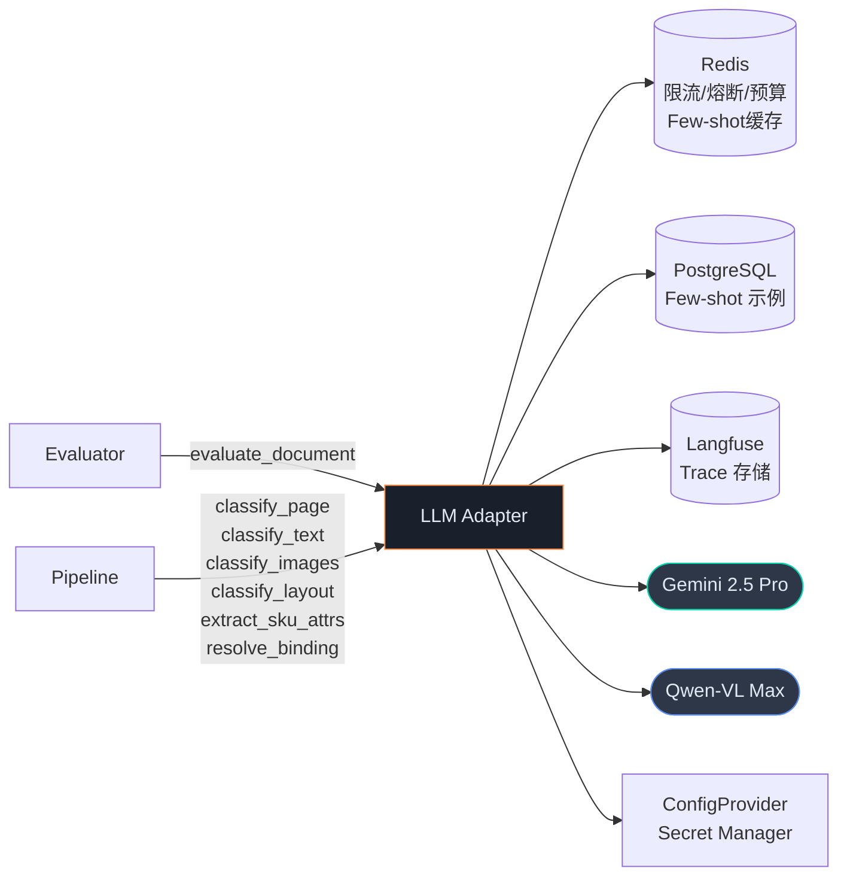
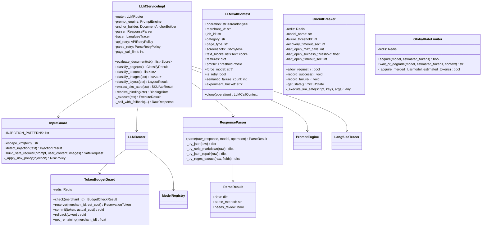
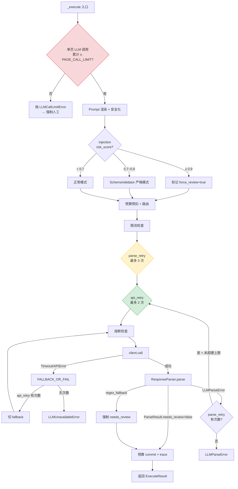

# LLM Adapter 模块详细设计

> **文档版本**: V1.2  
> **上游依赖**: TA V1.6 §3.4 + §2.4 + §2.5 | BRD V2.1 §12 (Token 预算) | BA V1.1  
> **模块定位**: 防腐层 — 隔离大模型供应商差异，提供统一调用接口 + 熔断 + 限流 + Prompt 管理 + 响应修复 + 可观测  
> **设计原则**: 模型无关性（T60）、快速降级（宁可转人工也不卡住）、全链路可追踪  
> **V1.1→V1.2 变更摘要**（来源：六方模型交叉评审 — ChatGPT 5.2 / Kimi 2.5 / Gemini 3 / QWen3 / DeepSeek / GLM-5）:
> - **P0×2**: 熔断器 HALF_OPEN 探测 +1 边界修复; regex_fallback 强制 `needs_review` 防伪成功
> - **P1×7**: HALF_OPEN 超时兜底; Redis 不可用本地降级; `force_model` 预算校验; 预算 reserve→commit/rollback; 注入 risk_score 分级响应; 单页 LLM 调用硬上限; Few-shot quality_score 过滤
> - **P2×9**: QPM+TPM 合并 Lua 失败不记数; ctx 不可变语义; 脱敏增加手机号/身份证; 预算整数存储; MAX_IMAGES 降级截断标记; A/B 分桶 Job 级一致性; resolve_binding 调用时机; 语义失败计数上下文; 密钥轮换文档

---

## 1. 模块职责边界

### 1.1 职责范围

| 职责 | 说明 | 对齐 |
|------|------|------|
| **统一调用接口** | 屏蔽 Gemini / Qwen API 差异，提供 7 个业务方法 | TA §2.4 LLMService Protocol |
| **动态模型路由** | 按 operation × 页面类型 × 复杂度选择模型，预算超限强制降级，**语义失败计数影响路由** `[V1.2:C10/G1]` | TA Q1 LLMRouter |
| **熔断器** | 主力模型连续失败 → fallback → 全熔断 → 渐进恢复。Redis Lua 原子操作，跨实例同步；**HALF_OPEN 超时兜底 + Redis 不可用本地降级** `[V1.2:C3/C4]` | TA T42 |
| **全局限流** | Redis Lua 原子 QPM/TPM 限流，**合并 Lua 脚本失败不记数** `[V1.2:C8]` | TA D5 |
| **Prompt 管理** | 版本化模板 + A/B 分桶（**Job 级一致性**）`[V1.2:C16]` + Shadow Mode + Few-shot 自动加载（**quality_score 过滤**）`[V1.2:C13]` | TA T31/T36 |
| **Document-Anchoring** | 文本坐标 + 截图融合，降低幻觉 | TA T33 |
| **输入防注入** | XML 转义 + source 标记 + 指令强化 + Prompt Injection 检测 + **risk_score 分级响应** `[V1.2:C7]` | TA InputGuard |
| **响应修复** | 4 级 fallback；**regex_fallback 强制 `needs_review`，防止伪成功入库** `[V1.2:C2]` | TA T45↑ |
| **Langfuse 追踪** | Prompt/Response/Latency/Token/Cost 全链路上报，**脱敏增加手机号/身份证** `[V1.2:C12]` | TA T71 |
| **Structured Outputs** | Gemini response_mime_type=application/json 强制 JSON | TA G2 |
| **Token 预算** | 每日/每商户 Token 配额守卫，**reserve→commit/rollback 机制** `[V1.2:C6]`，**整数存储** `[V1.2:C14]` | BRD §12 ¥22/份 |

**采样策略边界声明** `[V1.1:P0-C1]`：LLM Adapter **不负责** PDF 采样策略。`evaluate_document` 方法接收的 screenshots 应由调用方（Evaluator 模块）按 BRD FR-1.2 规则预筛后传入。

### 1.2 不负责的事

| 不做 | 归属 |
|------|------|
| PDF 解析 / OCR | Pipeline（ParserAdapter） |
| 路由决策（AUTO/HYBRID/HUMAN_ALL） | Evaluator |
| SKU 校验规则 | Pipeline（ConsistencyValidator） |
| 标注数据管理 | Collaboration / Feedback |
| 页面采样策略 | Evaluator |
| 语义质量监控（连续校验失败） | Pipeline — 通过 `semantic_failure_count` 传入上下文 `[V1.2:G1]` |

### 1.3 模块依赖



---

## 2. 目录结构

```
app/
├── llm_adapter/
│   ├── __init__.py
│   ├── service.py             # LLMService 实现（统一入口，7 业务方法 + 单页硬上限）[V1.2: C10]
│   │
│   ├── client/
│   │   ├── __init__.py
│   │   ├── base.py            # BaseLLMClient ABC
│   │   ├── gemini_client.py   # Gemini 2.5 Pro 适配
│   │   ├── qwen_client.py     # Qwen-VL Max 适配
│   │   └── model_registry.py  # 模型注册表（含定价元数据）
│   │
│   ├── router.py              # 动态模型路由（含语义失败感知）[V1.2: G1]
│   ├── circuit_breaker.py     # 熔断器（+1 修复 + HALF_OPEN 超时 + Redis 降级）[V1.2: C1/C3/C4]
│   ├── rate_limiter.py        # Redis Lua 合并 QPM+TPM 限流 [V1.2: C8]
│   ├── budget_guard.py        # Token 预算守卫（reserve→commit/rollback + 整数存储）[V1.2: C6/C14]
│   │
│   ├── prompt/
│   │   ├── __init__.py
│   │   ├── engine.py          # PromptEngine（quality_score 过滤 + Job 级分桶）[V1.2: C13/C16]
│   │   ├── anchor_builder.py  # Document-Anchoring 构建器
│   │   ├── input_guard.py     # 防注入（分级响应）[V1.2: C7]
│   │   └── templates/
│   │       ├── v1/            # 默认模板（7 个 .j2）
│   │       ├── v2/            # A/B 测试版本
│   │       └── shared/        # system_instructions / output_format / safety_wrapper
│   │
│   ├── parser/
│   │   ├── __init__.py
│   │   ├── response_parser.py # 4 级 fallback（regex 强制 needs_review）[V1.2: C2]
│   │   └── schema_validator.py# Schema 校验 + 异常值检测
│   │
│   ├── observability/
│   │   ├── __init__.py
│   │   ├── langfuse_tracer.py # Langfuse 追踪（脱敏增强）[V1.2: C12]
│   │   ├── metrics.py         # Prometheus 指标
│   │   └── cost_tracker.py    # Token 成本归因
│   │
│   ├── retry.py               # 分层重试 + 单页硬上限 [V1.2: C10]
│   ├── schemas.py             # 请求/响应 DTO
│   ├── exceptions.py          # LLM 专属异常
│   └── constants.py           # 配置
```

---

## 3. 类图



---

## 4. 核心时序图

### 4.1 LLM 调用主流程（V1.2：含预算预扣 + 单页硬上限 + 分级注入响应）

```mermaid
sequenceDiagram
    autonumber
    participant Caller as Pipeline / Evaluator
    participant Svc as LLMServiceImpl
    participant Guard as InputGuard
    participant PE as PromptEngine
    participant Router as LLMRouter
    participant Budget as TokenBudgetGuard
    participant RL as GlobalRateLimiter
    participant CB as CircuitBreaker
    participant Client as BaseLLMClient
    participant Parser as ResponseParser
    participant Tracer as LangfuseTracer
    participant Redis

    Caller->>+Svc: classify_page(ctx: LLMCallContext)
    Note over Svc: ctx.operation="classify_page" (构造时固定)

    rect rgb(30, 40, 60)
    Note over Svc,Guard: Step 1: Prompt 渲染 + 输入安全化 + 分级注入响应 [V1.2:C7]
    Svc->>PE: get_prompt("classify_page", ctx.profile, ctx.experiment_bucket, ...)
    PE-->>Svc: rendered_prompt
    Svc->>Guard: build_safe_request(prompt, user_content, images)
    Guard->>Guard: detect_injection(user_content)
    
    alt risk_score ≥ 0.9（高风险）[V1.2:C7]
        Guard-->>Svc: SafeRequest{injection_flags, risk_policy=FORCE_REVIEW}
        Note over Svc: 继续处理，但结果强制 needs_review=true
    else risk_score 0.7~0.9（中风险）
        Guard-->>Svc: SafeRequest{injection_flags, risk_policy=STRICT_SCHEMA}
        Note over Svc: SchemaValidator 开启 anomaly 严格模式
    else risk_score < 0.7（低/无风险）
        Guard-->>Svc: SafeRequest{injection_flags=[], risk_policy=NORMAL}
    end
    end

    rect rgb(40, 30, 50)
    Note over Svc,Budget: Step 2: 预算预扣 + 动态路由 [V1.2:C5/C6]
    Svc->>+Router: select_model(ctx)
    Router->>Budget: check(merchant_id)
    Budget-->>Router: BudgetCheckResult{ok, remaining}
    
    alt ctx.force_model 指定 [V1.2:C5]
        Router->>Router: 仍检查预算 → 超限则标记 budget_override
    end
    
    alt ctx.semantic_failure_count ≥ 5 [V1.2:G1]
        Router->>Router: 强制降级 → QWEN_STANDARD 或 HUMAN
    end
    
    Router-->>-Svc: route, model_config

    Svc->>Client: estimate_tokens(prompt, images)
    Client-->>Svc: est_tokens=2000
    Svc->>Budget: reserve(merchant_id, est_cost)
    Budget->>Redis: INCRBY pdf_sku:budget:reserve:...
    Budget-->>Svc: ReservationToken
    end

    rect rgb(30, 50, 40)
    Note over Svc,Client: Step 3: 限流 + 调用（含单页硬上限）[V1.2:C10]
    Svc->>RL: acquire(model, est_tokens)
    RL->>Redis: EVALSHA merged_rate_limit.lua
    RL-->>Svc: acquired / degraded

    Note over Svc: parse_retry(max=3) → api_retry(max=2)
    Note over Svc: 单页累计 LLM 调用 ≤ PAGE_CALL_LIMIT(6) [V1.2:C10]

    Svc->>CB: allow_request()
    CB->>Redis: EVALSHA circuit_breaker.lua
    alt Redis 不可用 [V1.2:C4]
        CB->>CB: 本地缓存降级（非 OPEN 则允许）
    end

    Svc->>Client: call(prompt, images, gen_config)
    Client-->>Svc: RawResponse
    Svc->>CB: record_success()
    end

    rect rgb(40, 40, 30)
    Note over Svc,Parser: Step 4: 响应解析 [V1.2:C2]
    Svc->>Parser: parse(raw_text, model, operation)
    Parser-->>Svc: ParseResult{data, parse_method, needs_review}
    
    alt parse_method == "regex_fallback" [V1.2:C2]
        Note over Svc: 强制 needs_review=true（防伪成功入库）
    end
    end

    rect rgb(50, 30, 40)
    Note over Svc,Budget: Step 5: 预算提交 + 可观测 [V1.2:C6]
    Svc->>Budget: commit(token, actual_cost)
    Budget->>Redis: INCRBY actual - DECRBY reserve_diff
    Svc->>Tracer: trace_call(...)
    end

    Svc-->>-Caller: ExecuteResult{data, model_used, was_downgraded,<br/>budget_remaining, needs_review, downgrade_reason}
```



### 4.2 熔断器状态机（V1.2：+1 修复 + HALF_OPEN 超时 + Redis 降级）

```mermaid
stateDiagram-v2
    [*] --> CLOSED

    CLOSED --> OPEN : Redis Lua 原子：连续失败 ≥ threshold(5)
    CLOSED --> CLOSED : 成功 → reset failure_count

    OPEN --> HALF_OPEN : recovery_timeout(60s) 到期
    OPEN --> OPEN : 全实例拒绝

    HALF_OPEN --> CLOSED : 3 次试探中 ≥2 次成功（首次计入）[V1.2:C1]
    HALF_OPEN --> OPEN : 3 次试探中 <2 次成功
    HALF_OPEN --> OPEN : HALF_OPEN 超时(30s)未决 → 强制 OPEN [V1.2:C3]

    note right of CLOSED : 正常状态
    note right of OPEN : 熔断状态<br/>Redis 不可用时:<br/>本地缓存+默认拒绝 [V1.2:C4]
    note left of HALF_OPEN : 渐进放量<br/>首次进入即计数(calls=1)<br/>超时 30s 强制回退
```

### 4.3 分层重试 + 单页硬上限 `[V1.2:C10]`



**硬上限原则** `[V1.2:C10]`：单页面所有 operation 的 LLM 调用累计不超过 `PAGE_CALL_LIMIT`（默认 6）。由调用方（Pipeline）在 `LLMCallContext.page_call_counter` 中传入当前页已消耗次数，LLM Adapter 在每次 `_execute` 前检查。超限直接抛 `LLMCallLimitError` → 上层降级人工。

---

## 5. 组件详细规格

### 5.1 LLMCallContext — 统一调用上下文 `[V1.2:C11/C16/G1]`

```python
# schemas.py

@dataclass(frozen=False)
class LLMCallContext:
    """
    统一调用上下文。
    
    [V1.2 变更]:
    - operation 在构造时固定，业务方法通过 clone() 生成新 ctx [C11]
    - 新增 semantic_failure_count（Pipeline 传入语义失败计数）[G1]
    - 新增 experiment_bucket（Job 级 A/B 分桶标识）[C16]
    - 新增 page_call_counter（当前页已消耗 LLM 调用次数）[C10]
    """
    operation: str                          # 构造时固定，不可后续覆写
    merchant_id: str | None = None
    job_id: str | None = None
    category: str | None = None
    page_type: str | None = None
    page_number: int | None = None

    # 输入数据
    screenshots: list[bytes] | None = None
    text_blocks: list[TextBlock] | None = None
    features: dict | None = None
    images: list[ProcessedImage] | None = None

    # 配置
    profile: ThresholdProfile | None = None
    force_model: str | None = None
    is_retry: bool = False

    # [V1.2 新增]
    semantic_failure_count: int = 0         # Pipeline 传入：连续 INV-06 校验失败次数 [G1]
    experiment_bucket: str | None = None    # Job 级 A/B 分桶（如 "v1" 或 "v2"）[C16]
    page_call_counter: int = 0              # 当前页已消耗的 LLM 调用次数 [C10]

    def clone(self, operation: str) -> "LLMCallContext":
        """创建新 ctx，operation 固定为指定值 [V1.2:C11]"""
        import copy
        new_ctx = copy.copy(self)
        object.__setattr__(new_ctx, "operation", operation)
        return new_ctx
```

### 5.2 LLMServiceImpl — 统一入口 `[V1.2:C2/C5/C6/C7/C10]`

```python
# service.py

class LLMServiceImpl:
    """
    LLMService Protocol 实现。
    
    [V1.2 变更]:
    - 单页 LLM 调用硬上限（PAGE_CALL_LIMIT）[C10]
    - force_model 不再绕过预算检查 [C5]
    - 预算 reserve→commit/rollback [C6]
    - regex_fallback 强制 needs_review [C2]
    - 注入 risk_score 分级响应 [C7]
    """

    PAGE_CALL_LIMIT = 6  # 单页面所有 operation 累计 LLM 调用上限 [V1.2:C10]

    def __init__(
        self,
        router: LLMRouter,
        registry: ModelRegistry,
        rate_limiter: GlobalRateLimiter,
        prompt_engine: PromptEngine,
        anchor_builder: DocumentAnchorBuilder,
        input_guard: InputGuard,
        parser: ResponseParser,
        tracer: LangfuseTracer,
        api_retry: APIRetryPolicy,
        parse_retry: ParseRetryPolicy,
    ):
        self._router = router
        self._registry = registry
        self._limiter = rate_limiter
        self._prompt = prompt_engine
        self._anchor = anchor_builder
        self._guard = input_guard
        self._parser = parser
        self._tracer = tracer
        self._api_retry = api_retry
        self._parse_retry = parse_retry
        self._current_model: str = "gemini-2.5-pro"

    @property
    def current_model_name(self) -> str:
        return self._current_model

    # ── 7 个业务方法 ──

    async def evaluate_document(self, ctx: LLMCallContext) -> list[Score]:
        assert ctx.operation == "eval_document"
        result = await self._execute(ctx)
        return [Score(**s) for s in result.data.get("scores", [])]

    async def classify_page(self, ctx: LLMCallContext) -> ClassifyResult:
        assert ctx.operation == "classify_page"
        result = await self._execute(ctx)
        return ClassifyResult(**result.data)

    async def classify_text(self, ctx: LLMCallContext) -> list[str]:
        assert ctx.operation == "classify_text"
        result = await self._execute(ctx)
        return result.data.get("roles", [])

    async def classify_images(self, ctx: LLMCallContext) -> list[str]:
        assert ctx.operation == "classify_images"
        result = await self._execute(ctx)
        return result.data.get("roles", [])

    async def classify_layout(self, ctx: LLMCallContext) -> LayoutResult:
        assert ctx.operation == "classify_layout"
        result = await self._execute(ctx)
        return LayoutResult(**result.data)

    async def extract_sku_attrs(self, ctx: LLMCallContext) -> SKUAttrResult:
        assert ctx.operation == "extract_sku_attrs"
        result = await self._execute(ctx)
        return SKUAttrResult(**result.data)

    async def resolve_binding(self, ctx: LLMCallContext) -> BindingHints:
        """
        SKU-图片绑定歧义仲裁。
        调用时机 [V1.2:C17]：Pipeline 的 ImageBinder topK 候选中
        top1 与 top2 置信度差 < 0.15 时触发。
        """
        assert ctx.operation == "resolve_binding"
        result = await self._execute(ctx)
        return BindingHints(**result.data)

    # ── 核心执行引擎 ──

    async def _execute(self, ctx: LLMCallContext) -> ExecuteResult:
        """
        V1.2 执行流：
        0. 单页硬上限检查 [C10]
        1. Prompt 渲染
        2. 输入安全化 + 注入分级响应 [C7]
        3. 预算预扣 + 动态路由 [C5/C6]
        4. 限流 + 分层重试
        5. 响应解析（regex → needs_review）[C2]
        6. 预算提交 + 可观测
        """
        start_time = time.monotonic()
        was_downgraded = False
        downgrade_reason: str | None = None
        reservation: ReservationToken | None = None

        # 0. 单页硬上限 [V1.2:C10]
        if ctx.page_call_counter >= self.PAGE_CALL_LIMIT:
            raise LLMCallLimitError(
                f"Page call limit ({self.PAGE_CALL_LIMIT}) exceeded",
                "PAGE_CALL_LIMIT",
            )

        # 1. Prompt 渲染
        anchored_text = ""
        if ctx.text_blocks:
            anchored_text = self._anchor.build(ctx.text_blocks, ctx.features)

        prompt = await self._prompt.get_prompt(
            ctx.operation, ctx.profile,
            experiment_bucket=ctx.experiment_bucket,  # [V1.2:C16]
            anchored_text=anchored_text,
            features=ctx.features or {},
            text_blocks=ctx.text_blocks,
            image_count=len(ctx.images) if ctx.images else 0,
        )

        # 2. 安全化 + 注入分级 [V1.2:C7]
        images = self._collect_images(ctx)
        safe_req = self._guard.build_safe_request(prompt, anchored_text, images)
        force_review = safe_req.risk_policy == RiskPolicy.FORCE_REVIEW

        # 3. 预算预扣 + 路由 [V1.2:C5/C6]
        budget_result = await self._router.budget_guard.check(ctx.merchant_id)

        # force_model 不再绕过预算 [V1.2:C5]
        budget_override = False
        if ctx.force_model and not budget_result.ok:
            budget_override = True
            logger.warning("force_model_budget_override",
                model=ctx.force_model, merchant=ctx.merchant_id)

        route = self._router.select_model(
            operation=ctx.operation,
            page_type=ctx.page_type or "C",
            features=ctx.features or {},
            budget_ok=budget_result.ok or budget_override,
            semantic_failure_count=ctx.semantic_failure_count,  # [V1.2:G1]
            force_model=ctx.force_model,
        )

        if route in ("RULE_ENGINE", "SKIP"):
            return ExecuteResult(
                data={"skipped": True, "route": route},
                model_used=route, was_downgraded=False,
                budget_remaining=budget_result.remaining,
                needs_review=False,
            )

        model_config = self._router.get_config(route)
        client = self._registry.get(model_config.model)

        # Token 预估 + 预算预扣 [V1.2:C6]
        est_tokens = client.estimate_tokens(safe_req.prompt, safe_req.images)
        est_cost = self._estimate_cost(client.model_name, est_tokens)

        reservation = await self._router.budget_guard.reserve(
            ctx.merchant_id, est_cost)

        try:
            # 4. 限流
            actual_model = await self._limiter.wait_or_degrade(
                model_config.model, est_tokens, ctx.__dict__)
            if actual_model != model_config.model:
                was_downgraded = True
                downgrade_reason = "rate_limit"
                client = self._registry.get(actual_model)
            self._current_model = actual_model

            # 5. 分层重试
            raw_response = None
            parse_result = None

            async def _parse_attempt():
                nonlocal raw_response, was_downgraded, downgrade_reason
                raw_response = await self._api_retry.execute(
                    self._call_with_fallback,
                    client=client, safe_req=safe_req,
                    model_config=model_config,
                )
                if raw_response.was_fallback:
                    was_downgraded = True
                    downgrade_reason = downgrade_reason or "api_fallback"
                if raw_response.images_truncated:  # [V1.2:C15]
                    logger.warning("images_truncated_on_fallback",
                        model=raw_response.model,
                        original=len(safe_req.images or []),
                        used=raw_response.images_used)

                return self._parser.parse(
                    raw_response.text, raw_response.model,
                    ctx.operation,
                    strict_anomaly=safe_req.risk_policy == RiskPolicy.STRICT_SCHEMA,
                )

            parse_result = await self._parse_retry.execute(_parse_attempt)

            # regex_fallback 强制 needs_review [V1.2:C2]
            needs_review = (
                force_review or
                parse_result.needs_review or
                parse_result.parse_method == "regex_fallback"
            )

            elapsed = time.monotonic() - start_time

            # 6. 预算提交 [V1.2:C6]
            actual_cost = raw_response.cost_usd
            await self._router.budget_guard.commit(reservation, actual_cost)
            reservation = None  # 已提交，不需回滚

            # 可观测
            self._tracer.trace_call(
                operation=ctx.operation,
                model=raw_response.model,
                prompt=safe_req.prompt,
                response=raw_response.text,
                latency_sec=elapsed,
                tokens=raw_response.tokens,
                metadata={
                    "merchant_id": ctx.merchant_id,
                    "job_id": ctx.job_id,
                    "category": ctx.category,
                    "route": route,
                    "was_downgraded": was_downgraded,
                    "downgrade_reason": downgrade_reason,
                    "injection_flags": safe_req.injection_flags,
                    "risk_policy": safe_req.risk_policy.value,
                    "is_retry": ctx.is_retry,
                    "parse_method": parse_result.parse_method,
                    "needs_review": needs_review,
                    "budget_override": budget_override,
                    "semantic_failure_count": ctx.semantic_failure_count,
                    "images_truncated": raw_response.images_truncated,
                },
            )

            return ExecuteResult(
                data=parse_result.data,
                model_used=raw_response.model,
                was_downgraded=was_downgraded,
                downgrade_reason=downgrade_reason,
                budget_remaining=budget_result.remaining - actual_cost,
                needs_review=needs_review,
                parse_method=parse_result.parse_method,
            )

        except Exception:
            # 预算回滚 [V1.2:C6]
            if reservation:
                await self._router.budget_guard.rollback(reservation)
            raise

    async def _call_with_fallback(
        self, client: BaseLLMClient, safe_req: SafeRequest,
        model_config: LLMConfig,
    ) -> RawResponse:
        """
        主模型 → fallback → 全熔断。
        [V1.2:C15] 降级时检查 MAX_IMAGES 截断。
        """
        cb = client.circuit_breaker

        if not await cb.allow_request():
            fallback = self._registry.get_fallback(client.model_name)
            if fallback and await fallback.circuit_breaker.allow_request():
                self._current_model = fallback.model_name
                images = safe_req.images
                truncated = False
                images_used = len(images) if images else 0
                # [V1.2:C15] 检查图片截断
                if images and len(images) > fallback.MAX_IMAGES:
                    truncated = True
                    images_used = fallback.MAX_IMAGES
                resp = await fallback.call(
                    safe_req.prompt, images, self._build_gen_config(fallback))
                resp.was_fallback = True
                resp.images_truncated = truncated
                resp.images_used = images_used
                return resp
            raise LLMCircuitOpenError("All models unavailable", "CIRCUIT_OPEN")

        try:
            result = await client.call(
                safe_req.prompt, safe_req.images,
                self._build_gen_config(client))
            await cb.record_success()
            result.was_fallback = False
            result.images_truncated = False
            result.images_used = len(safe_req.images) if safe_req.images else 0
            return result
        except (TimeoutError, APIError) as e:
            await cb.record_failure()
            fallback = self._registry.get_fallback(client.model_name)
            if fallback:
                try:
                    self._current_model = fallback.model_name
                    images = safe_req.images
                    truncated = False
                    images_used = len(images) if images else 0
                    if images and len(images) > fallback.MAX_IMAGES:
                        truncated = True
                        images_used = fallback.MAX_IMAGES
                    result = await fallback.call(
                        safe_req.prompt, images,
                        self._build_gen_config(fallback))
                    result.was_fallback = True
                    result.images_truncated = truncated
                    result.images_used = images_used
                    return result
                except (TimeoutError, APIError):
                    await fallback.circuit_breaker.record_failure()
            raise LLMUnavailableError(str(e), "LLM_CALL_FAILED")

    def _build_gen_config(self, client: BaseLLMClient) -> dict:
        config = {}
        if client.supports_structured_output():
            config["response_mime_type"] = "application/json"
        return config

    def _collect_images(self, ctx: LLMCallContext) -> list[bytes]:
        result = []
        if ctx.screenshots:
            result.extend(ctx.screenshots)
        if ctx.images:
            result.extend([img.thumbnail for img in ctx.images])
        return result

    def _estimate_cost(self, model: str, est_tokens: int) -> float:
        pricing = self._registry.get_pricing(model)
        # 粗估：假设输入输出各占一半
        return est_tokens * (pricing.input_rate + pricing.output_rate) / 2 / 1_000_000
```

### 5.3 LLMRouter — 动态模型路由 `[V1.2:C5/G1]`

```python
# router.py

class LLMRouter:
    """
    [V1.2 变更]:
    - select_model 增加 semantic_failure_count 参数 [G1]
    - select_model 增加 force_model 参数（仍受预算约束）[C5]
    """

    # operation → { (page_type, complexity): route }
    ROUTING_TABLE: dict[str, dict[tuple[str, str], str]] = {
        "classify_page": {
            ("A", "any"):     "RULE_ENGINE",
            ("D", "any"):     "SKIP",
            ("B", "simple"):  "QWEN_STANDARD",
            ("C", "simple"):  "QWEN_STANDARD",
            ("B", "complex"): "GEMINI_PRO",
            ("C", "complex"): "GEMINI_PRO",
        },
        "extract_sku_attrs": {
            ("A", "simple"):  "QWEN_STANDARD",
            ("A", "complex"): "GEMINI_PRO",
            ("B", "simple"):  "QWEN_STANDARD",
            ("C", "simple"):  "QWEN_STANDARD",
            ("B", "complex"): "GEMINI_PRO",
            ("C", "complex"): "GEMINI_PRO",
            ("D", "any"):     "SKIP",
        },
        "eval_document": {
            ("any", "any"):   "GEMINI_PRO",
        },
        "resolve_binding": {
            ("any", "any"):   "QWEN_STANDARD",
        },
    }

    DEFAULT_ROUTES = {
        "simple":  "QWEN_STANDARD",
        "complex": "GEMINI_PRO",
    }

    MODEL_CONFIGS = {
        "GEMINI_PRO":    LLMConfig(model="gemini-2.5-pro",
                                    max_tokens=8192, temperature=0.2),
        "QWEN_STANDARD": LLMConfig(model="qwen-vl-max",
                                    max_tokens=4096, temperature=0.1),
    }

    SEMANTIC_FAILURE_THRESHOLD = 5  # [V1.2:G1]

    def __init__(self, budget_guard: TokenBudgetGuard, registry: ModelRegistry):
        self.budget_guard = budget_guard
        self._registry = registry

    def select_model(
        self, operation: str, page_type: str, features: dict,
        budget_ok: bool,
        semantic_failure_count: int = 0,  # [V1.2:G1]
        force_model: str | None = None,   # [V1.2:C5]
    ) -> str:

        # 语义失败强制降级 [V1.2:G1]
        if semantic_failure_count >= self.SEMANTIC_FAILURE_THRESHOLD:
            logger.warning("semantic_degrade",
                count=semantic_failure_count, operation=operation)
            metrics.llm_semantic_degrade_total.inc()
            return "QWEN_STANDARD"

        # force_model（受预算约束）[V1.2:C5]
        if force_model:
            target = self._resolve_force_model(force_model)
            if not budget_ok and target == "GEMINI_PRO":
                target = "QWEN_STANDARD"
                metrics.llm_budget_downgrade_total.inc()
            return target

        complexity = self._assess_complexity(features)

        # 查找路由表
        op_table = self.ROUTING_TABLE.get(operation, {})
        route = (
            op_table.get((page_type, complexity))
            or op_table.get((page_type, "any"))
            or op_table.get(("any", "any"))
            or self.DEFAULT_ROUTES.get(complexity, "GEMINI_PRO")
        )

        # 预算降级
        if not budget_ok and route == "GEMINI_PRO":
            route = "QWEN_STANDARD"
            metrics.llm_budget_downgrade_total.inc()

        metrics.llm_route_total.labels(
            operation=operation, page_type=page_type,
            complexity=complexity, route=route,
        ).inc()

        return route

    def _resolve_force_model(self, force_model: str) -> str:
        """将 force_model 字符串映射到路由表的 route key"""
        if "gemini" in force_model.lower():
            return "GEMINI_PRO"
        return "QWEN_STANDARD"

    def get_config(self, route: str) -> LLMConfig | None:
        return self.MODEL_CONFIGS.get(route)

    def _assess_complexity(self, features: dict) -> str:
        score = 0
        if features.get("has_fragmented_images", False):
            score += 2
        if features.get("ocr_ratio", 0) > 0.3:
            score += 2
        if features.get("multi_column", False):
            score += 1
        if features.get("text_block_count", 0) > 20:
            score += 1
        return "complex" if score >= 3 else "simple"
```

### 5.4 CircuitBreaker — Redis Lua `[V1.2:C1/C3/C4]`

```python
# circuit_breaker.py

class CircuitBreaker:
    """
    三态熔断器（V1.2 修订）：
    - [C1] HALF_OPEN +1 修复：OPEN→HALF_OPEN 转换时将首次试探计入 calls=1
    - [C3] HALF_OPEN 超时：试探请求在 30s 内未全部完成则强制回退 OPEN
    - [C4] Redis 不可用时本地降级：默认按本地缓存状态决策，OPEN 则拒绝
    """

    KEY_PREFIX = "pdf_sku:circuit"

    # ── Lua 脚本（V1.2 修订） ──

    ALLOW_REQUEST_LUA = """
    local key = KEYS[1]
    local recovery_timeout = tonumber(ARGV[1])
    local half_open_max = tonumber(ARGV[2])
    local now = tonumber(ARGV[3])
    local half_open_timeout = tonumber(ARGV[4])

    local state = tonumber(redis.call('HGET', key, 'state') or 0)

    if state == 0 then  -- CLOSED
        return 1

    elseif state == 2 then  -- OPEN
        local open_since = tonumber(redis.call('HGET', key, 'open_since') or 0)
        if (now - open_since) >= recovery_timeout then
            -- 转 HALF_OPEN，首次试探计入 calls=1 [V1.2:C1 修复]
            redis.call('HSET', key,
                'state', 1,
                'half_open_calls', 1,
                'half_open_success', 0,
                'half_open_since', now)
            return 1
        end
        return 0

    elseif state == 1 then  -- HALF_OPEN
        -- [V1.2:C3] HALF_OPEN 超时检查
        local ho_since = tonumber(redis.call('HGET', key, 'half_open_since') or 0)
        if (now - ho_since) >= half_open_timeout then
            -- 超时未决 → 强制 OPEN
            redis.call('HSET', key,
                'state', 2,
                'open_since', now,
                'half_open_calls', 0,
                'half_open_success', 0)
            return 0
        end

        local calls = tonumber(redis.call('HGET', key, 'half_open_calls') or 0)
        if calls < half_open_max then
            redis.call('HINCRBY', key, 'half_open_calls', 1)
            return 1
        end
        return 0
    end
    return 0
    """

    RECORD_SUCCESS_LUA = """
    local key = KEYS[1]
    local success_threshold = tonumber(ARGV[1])
    local state = tonumber(redis.call('HGET', key, 'state') or 0)

    if state == 1 then  -- HALF_OPEN
        local success = redis.call('HINCRBY', key, 'half_open_success', 1)
        if tonumber(success) >= success_threshold then
            redis.call('HSET', key,
                'state', 0, 'failure_count', 0,
                'half_open_calls', 0, 'half_open_success', 0)
            return 0  -- CLOSED
        end
        return 1  -- still HALF_OPEN
    elseif state == 0 then
        redis.call('HSET', key, 'failure_count', 0)
        return 0
    end
    return tonumber(state)
    """

    RECORD_FAILURE_LUA = """
    local key = KEYS[1]
    local threshold = tonumber(ARGV[1])
    local now = tonumber(ARGV[2])
    local half_open_max = tonumber(ARGV[3])
    local success_threshold = tonumber(ARGV[4])
    local state = tonumber(redis.call('HGET', key, 'state') or 0)

    if state == 1 then  -- HALF_OPEN
        local calls = tonumber(redis.call('HGET', key, 'half_open_calls') or 0)
        local success = tonumber(redis.call('HGET', key, 'half_open_success') or 0)
        if calls >= half_open_max and success < success_threshold then
            redis.call('HSET', key,
                'state', 2, 'open_since', now,
                'half_open_calls', 0, 'half_open_success', 0)
            return 2  -- OPEN
        end
        return 1

    elseif state == 0 then  -- CLOSED
        local failures = redis.call('HINCRBY', key, 'failure_count', 1)
        if tonumber(failures) >= threshold then
            redis.call('HSET', key, 'state', 2, 'open_since', now)
            return 2  -- OPEN
        end
        return 0
    end
    return tonumber(state)
    """

    def __init__(
        self,
        model_name: str,
        redis: Redis,
        failure_threshold: int = 5,
        recovery_timeout_sec: int = 60,
        half_open_max_calls: int = 3,
        half_open_success_threshold: int = 2,
        half_open_timeout_sec: int = 30,  # [V1.2:C3]
    ):
        self._model = model_name
        self._redis = redis
        self._key = f"{self.KEY_PREFIX}:{model_name}"
        self._failure_threshold = failure_threshold
        self._recovery_timeout = recovery_timeout_sec
        self._half_open_max = half_open_max_calls
        self._success_threshold = half_open_success_threshold
        self._half_open_timeout = half_open_timeout_sec

        self._sha_allow: str | None = None
        self._sha_success: str | None = None
        self._sha_failure: str | None = None

        # 本地只读缓存
        self._local_state: CircuitState = CircuitState.CLOSED
        self._local_cache_time: float = 0
        self._local_cache_ttl: float = 3.0

    async def _ensure_scripts(self):
        if self._sha_allow is None:
            self._sha_allow = await self._redis.script_load(
                self.ALLOW_REQUEST_LUA)
            self._sha_success = await self._redis.script_load(
                self.RECORD_SUCCESS_LUA)
            self._sha_failure = await self._redis.script_load(
                self.RECORD_FAILURE_LUA)

    async def allow_request(self) -> bool:
        # 本地缓存快速路径（仅 CLOSED 时走缓存）
        if (time.monotonic() - self._local_cache_time < self._local_cache_ttl
                and self._local_state == CircuitState.CLOSED):
            return True

        # [V1.2:C4] Redis 不可用时本地降级
        try:
            await self._ensure_scripts()
            now = int(time.time())
            result = await self._redis.evalsha(
                self._sha_allow, 1, self._key,
                self._recovery_timeout,
                self._half_open_max,
                now,
                self._half_open_timeout,  # [V1.2:C3]
            )
            allowed = int(result) == 1
            # 异步刷新本地缓存（单次，非每次都触发）
            self._schedule_refresh_if_needed()
            return allowed

        except (ConnectionError, TimeoutError, OSError) as e:
            # [V1.2:C4] Redis 不可用 → 本地缓存降级
            logger.warning("circuit_redis_unavailable",
                model=self._model, error=str(e)[:100])
            metrics.llm_circuit_redis_fallback_total.labels(
                model=self._model).inc()
            return self._local_state != CircuitState.OPEN

    async def record_success(self):
        try:
            await self._ensure_scripts()
            new_state = int(await self._redis.evalsha(
                self._sha_success, 1, self._key,
                self._success_threshold))

            if new_state == CircuitState.CLOSED:
                logger.info("circuit_closed", model=self._model)
            self._local_state = CircuitState(new_state)
            self._local_cache_time = time.monotonic()
            metrics.llm_circuit_state.labels(model=self._model).set(new_state)

        except (ConnectionError, TimeoutError, OSError):
            logger.warning("circuit_record_success_redis_fail", model=self._model)

    async def record_failure(self):
        try:
            await self._ensure_scripts()
            now = int(time.time())
            new_state = int(await self._redis.evalsha(
                self._sha_failure, 1, self._key,
                self._failure_threshold, now,
                self._half_open_max, self._success_threshold))

            if new_state == CircuitState.OPEN:
                logger.error("circuit_opened", model=self._model)
            self._local_state = CircuitState(new_state)
            self._local_cache_time = time.monotonic()
            metrics.llm_circuit_state.labels(model=self._model).set(new_state)

        except (ConnectionError, TimeoutError, OSError):
            logger.warning("circuit_record_failure_redis_fail", model=self._model)
            # Redis 不可用时本地计数器兜底
            self._local_failure_count = getattr(
                self, '_local_failure_count', 0) + 1
            if self._local_failure_count >= self._failure_threshold:
                self._local_state = CircuitState.OPEN

    def _schedule_refresh_if_needed(self):
        """仅在缓存过期时触发异步刷新（避免高 QPS 下 task 风暴）"""
        if time.monotonic() - self._local_cache_time >= self._local_cache_ttl:
            asyncio.create_task(self._do_refresh())

    async def _do_refresh(self):
        try:
            state = await self._redis.hget(self._key, "state")
            self._local_state = CircuitState(int(state or 0))
            self._local_cache_time = time.monotonic()
        except Exception:
            logger.warning("circuit_refresh_failed", model=self._model)
```

### 5.5 GlobalRateLimiter — 合并 Lua `[V1.2:C8]`

```python
# rate_limiter.py

class GlobalRateLimiter:
    """
    [V1.2 变更]:
    - QPM + TPM 合并到同一 Lua 脚本，任一维度超限则全部不记数 [C8]
    - 分钟分桶 key（epoch_minute），窗口对齐自然分钟
    """

    KEY_PREFIX = "pdf_sku:rate"

    RATE_LIMITS = {
        "gemini-2.5-pro": {"qpm": 60, "tpm": 2_000_000},
        "qwen-vl-max":    {"qpm": 100, "tpm": 5_000_000},
    }

    FALLBACK_MAP = {
        "gemini-2.5-pro": "qwen-vl-max",
    }

    # [V1.2:C8] 合并 QPM+TPM Lua — 任一超限则全部不提交
    MERGED_RATE_LIMIT_LUA = """
    local qpm_key = KEYS[1]
    local tpm_key = KEYS[2]
    local qpm_limit = tonumber(ARGV[1])
    local tpm_limit = tonumber(ARGV[2])
    local tokens = tonumber(ARGV[3])
    local ttl = tonumber(ARGV[4])

    -- 先读当前值（不修改）
    local qpm_cur = tonumber(redis.call('GET', qpm_key) or '0')
    local tpm_cur = tonumber(redis.call('GET', tpm_key) or '0')

    -- 预检：任一维度将超限 → 全部不记数，返回 0
    if (qpm_cur + 1) > qpm_limit then
        return 0
    end
    if tokens > 0 and (tpm_cur + tokens) > tpm_limit then
        return 0
    end

    -- 两维度都通过 → 原子提交
    local new_qpm = redis.call('INCR', qpm_key)
    if new_qpm == 1 then redis.call('EXPIRE', qpm_key, ttl) end

    if tokens > 0 then
        local new_tpm = redis.call('INCRBY', tpm_key, tokens)
        if new_tpm == tokens then redis.call('EXPIRE', tpm_key, ttl) end
    end

    return 1
    """

    def __init__(self, redis: Redis):
        self._redis = redis
        self._sha_merged: str | None = None

    async def _ensure_scripts(self):
        if self._sha_merged is None:
            self._sha_merged = await self._redis.script_load(
                self.MERGED_RATE_LIMIT_LUA)

    async def acquire(self, model: str, estimated_tokens: int = 0) -> bool:
        await self._ensure_scripts()
        limits = self.RATE_LIMITS.get(model, {"qpm": 30, "tpm": 1_000_000})

        # [V1.2:C8] 分钟分桶
        epoch_min = int(time.time()) // 60
        qpm_key = f"{self.KEY_PREFIX}:{model}:qpm:{epoch_min}"
        tpm_key = f"{self.KEY_PREFIX}:{model}:tpm:{epoch_min}"

        result = await self._redis.evalsha(
            self._sha_merged, 2, qpm_key, tpm_key,
            limits["qpm"], limits["tpm"], estimated_tokens, 120)  # TTL 120s（当前分钟+容错）

        if int(result) == 0:
            metrics.llm_rate_limited_total.labels(model=model).inc()
            return False
        return True

    async def wait_or_degrade(
        self, model: str, estimated_tokens: int, context: dict
    ) -> str:
        if await self.acquire(model, estimated_tokens):
            return model

        fallback = self.FALLBACK_MAP.get(model)
        if fallback and await self.acquire(fallback, estimated_tokens):
            metrics.llm_rate_downgrade_total.labels(
                from_model=model, to_model=fallback).inc()
            return fallback

        # 短暂等待（随机抖动，避免雪崩）
        await asyncio.sleep(random.uniform(1.0, 3.0))
        if await self.acquire(model, estimated_tokens):
            return model

        raise LLMUnavailableError("All models rate limited", "RATE_LIMITED")
```

### 5.6 ResponseParser — regex_fallback 强制 needs_review `[V1.2:C2]`

```python
# parser/response_parser.py

@dataclass
class ParseResult:
    """[V1.2] 解析结果，携带 parse_method 和 needs_review 标记"""
    data: dict
    parse_method: str
    needs_review: bool = False

class ResponseParser:
    """
    4 级 fallback 响应解析链（V1.2 修订）：
    1. json.loads — 直接解析
    2. strip markdown + json.loads — 去 ```json 标记
    3. json_repair — AST 级修复
    4. regex extract — 正则提取（**强制 needs_review，防伪成功**）[V1.2:C2]
    """

    def __init__(self, schema_validator: SchemaValidator):
        self._validator = schema_validator

    def parse(
        self, raw_response: str, model: str,
        operation: str, strict_anomaly: bool = False,
    ) -> ParseResult:
        metrics.llm_response_length.labels(model=model).observe(
            len(raw_response))

        result = None
        method = "unknown"

        # Level 1: 直接 JSON
        try:
            result = json.loads(raw_response)
            method = "json_direct"
        except json.JSONDecodeError:
            pass

        # Level 2: 去 Markdown 标记
        if result is None:
            cleaned = re.sub(r"```(?:json)?\s*", "", raw_response)
            cleaned = re.sub(r"```\s*$", "", cleaned).strip()
            try:
                result = json.loads(cleaned)
                method = "strip_markdown"
            except json.JSONDecodeError:
                pass

        # Level 3: json_repair AST 修复
        if result is None:
            try:
                repaired = json_repair.repair_json(
                    raw_response, return_objects=True)
                if isinstance(repaired, dict):
                    result = repaired
                    method = "json_repair"
                elif isinstance(repaired, list) and repaired:
                    result = repaired[0] if isinstance(
                        repaired[0], dict) else {"items": repaired}
                    method = "json_repair_list"
            except Exception:
                pass

        # Level 4: 正则提取 [V1.2:C2 — 强制 needs_review]
        if result is None:
            result = self._regex_extract(raw_response, operation)
            if result:
                method = "regex_fallback"

        if result is None:
            metrics.llm_parse_failure_total.labels(model=model).inc()
            raise LLMParseError(
                "Cannot parse LLM response after 4 attempts",
                "LLM_PARSE_FAILED",
                context={"raw_preview": raw_response[:500]},
            )

        metrics.llm_parse_method_total.labels(
            model=model, method=method).inc()

        # Schema 校验（regex_fallback 强制严格模式）[V1.2:C2]
        is_regex = method == "regex_fallback"
        result = self._validator.validate(result, operation)

        # 异常值检测（中风险注入时强制严格检查）[V1.2:C7]
        anomaly_flags = self._validator.check_anomalies(
            result, operation,
            strict=strict_anomaly or is_regex)

        return ParseResult(
            data=result,
            parse_method=method,
            needs_review=is_regex or len(anomaly_flags) > 0,
        )

    def _regex_extract(self, raw: str, operation: str) -> dict | None:
        """按 operation 动态选择字段列表"""
        FIELDS_BY_OP = {
            "classify_page": ["page_type", "confidence"],
            "classify_layout": ["layout_type", "confidence"],
            "extract_sku_attrs": ["sku_count"],
            "_default": ["page_type", "confidence", "validity", "sku_count"],
        }
        fields = FIELDS_BY_OP.get(operation, FIELDS_BY_OP["_default"])

        extracted = {}
        for field in fields:
            match = re.search(
                rf'"{field}"\s*:\s*"?([^",\}}\]]+)"?', raw)
            if match:
                extracted[field] = match.group(1).strip()
        return extracted if extracted else None
```

### 5.7 InputGuard — 分级响应 `[V1.2:C7]`

```python
# prompt/input_guard.py

class RiskPolicy(Enum):
    """注入风险策略 [V1.2:C7]"""
    NORMAL = "normal"               # 无风险 / 低风险
    STRICT_SCHEMA = "strict_schema" # 中风险 → 开启严格 Schema 校验
    FORCE_REVIEW = "force_review"   # 高风险 → 结果强制人工审核

@dataclass
class SafeRequest:
    prompt: str
    images: list[bytes] | None
    injection_flags: list[str]
    risk_policy: RiskPolicy  # [V1.2:C7]

class InputGuard:
    """
    [V1.2 变更]:
    - 注入检测结果分级响应（NORMAL / STRICT_SCHEMA / FORCE_REVIEW）[C7]
    - 高风险不阻断 Pipeline，但强制 needs_review，防错误结果入库
    """

    INJECTION_PATTERNS = [
        (r"(?i)ignore\s+(all\s+)?(previous|above|prior)\s+(instructions?|rules?|prompts?)",
         "ignore_instructions", 0.9),
        (r"(?i)system\s*prompt|system\s*message|system\s*instruction",
         "system_prompt_ref", 0.7),
        (r"(?i)override\s+(all\s+)?(rules?|settings?|constraints?)",
         "override_rules", 0.8),
        (r"(?i)you\s+are\s+(now|actually)\s+",
         "identity_override", 0.8),
        (r"(?i)(set|change|modify)\s+(all\s+)?(price|cost|confidence)\s*(to|=)\s*",
         "value_manipulation", 0.9),
        (r"(?i)disregard|forget\s+(everything|all)",
         "disregard_context", 0.8),
        (r"(?i)output\s+(only|just)\s*(true|false|yes|no|1|0)",
         "force_output", 0.6),
    ]

    # [V1.2:C7] 风险分级阈值
    HIGH_RISK_THRESHOLD = 0.9
    MEDIUM_RISK_THRESHOLD = 0.7

    @staticmethod
    def escape_xml(text: str) -> str:
        return (text.replace("&", "&amp;").replace("<", "&lt;")
                .replace(">", "&gt;").replace('"', "&quot;")
                .replace("'", "&apos;"))

    @classmethod
    def detect_injection(cls, text: str) -> InjectionResult:
        matched = []
        max_score = 0.0
        for pattern, label, score in cls.INJECTION_PATTERNS:
            if re.search(pattern, text):
                matched.append(label)
                max_score = max(max_score, score)
        return InjectionResult(
            is_suspicious=len(matched) > 0,
            matched_patterns=matched,
            risk_score=max_score,
        )

    @classmethod
    def _apply_risk_policy(cls, injection: InjectionResult) -> RiskPolicy:
        """[V1.2:C7] 根据 risk_score 决定策略"""
        if injection.risk_score >= cls.HIGH_RISK_THRESHOLD:
            return RiskPolicy.FORCE_REVIEW
        elif injection.risk_score >= cls.MEDIUM_RISK_THRESHOLD:
            return RiskPolicy.STRICT_SCHEMA
        return RiskPolicy.NORMAL

    @classmethod
    def build_safe_request(
        cls, prompt: str, user_content: str | None,
        images: list[bytes] | None
    ) -> SafeRequest:
        injection_flags = []
        risk_policy = RiskPolicy.NORMAL

        if user_content:
            injection = cls.detect_injection(user_content)
            if injection.is_suspicious:
                injection_flags = injection.matched_patterns
                risk_policy = cls._apply_risk_policy(injection)
                logger.warning("prompt_injection_detected",
                    patterns=injection.matched_patterns,
                    risk_score=injection.risk_score,
                    risk_policy=risk_policy.value)
                metrics.llm_injection_detected_total.labels(
                    policy=risk_policy.value).inc()

        return SafeRequest(
            prompt=prompt,
            images=images,
            injection_flags=injection_flags,
            risk_policy=risk_policy,
        )
```

### 5.8 PromptEngine — quality_score 过滤 + Job 级分桶 `[V1.2:C13/C16]`

```python
# prompt/engine.py

class PromptEngine:
    """
    [V1.2 变更]:
    - Few-shot 加载增加 quality_score >= 0.85 过滤 [C13]
    - A/B 分桶优先使用 experiment_bucket（Job 级固定）[C16]
    """

    KEY_PREFIX = "pdf_sku:fewshot"
    MIN_QUALITY_SCORE = 0.85  # [V1.2:C13]

    def __init__(
        self, templates_dir: str, async_db_factory,
        redis: Redis, default_version: str = "v1"
    ):
        self._env = jinja2.Environment(
            loader=jinja2.FileSystemLoader(templates_dir),
            undefined=jinja2.StrictUndefined,
        )
        self._async_db = async_db_factory
        self._redis = redis
        self._default_version = default_version
        self._cache_ttl = 300

    async def get_prompt(
        self, template_name: str, profile: ThresholdProfile = None,
        experiment_bucket: str | None = None,  # [V1.2:C16]
        **kwargs
    ) -> str:
        # [V1.2:C16] 优先使用 Job 级分桶
        version = self._select_version(
            template_name, profile, experiment_bucket)
        path = f"{version}/{template_name}.j2"
        template = self._env.get_template(path)

        category = profile.category if profile else None
        few_shot = await self._load_few_shot(template_name, category)

        return template.render(
            few_shot_examples=few_shot,
            profile=profile,
            **kwargs,
        )

    def _select_version(
        self, template_name: str, profile: ThresholdProfile | None,
        experiment_bucket: str | None = None,
    ) -> str:
        # [V1.2:C16] Job 级分桶优先
        if experiment_bucket:
            return experiment_bucket
        if profile and profile.prompt_experiment:
            return profile.prompt_experiment.get(
                template_name, self._default_version)
        return self._default_version

    async def _load_few_shot(
        self, template_name: str, category: str | None,
        limit: int = 3
    ) -> list[dict]:
        cache_key = f"{self.KEY_PREFIX}:{template_name}:{category or 'all'}"

        cached = await self._redis.get(cache_key)
        if cached:
            return json.loads(cached)

        # [V1.2:C13] 增加 quality_score 最低阈值
        async with self._async_db() as session:
            stmt = select(
                AnnotationExample.input_context,
                AnnotationExample.output_json,
            ).where(
                AnnotationExample.task_type == template_name,
                AnnotationExample.is_confirmed == True,
                AnnotationExample.quality_score >= self.MIN_QUALITY_SCORE,  # [V1.2:C13]
            )
            if category:
                stmt = stmt.where(AnnotationExample.category == category)
            stmt = stmt.order_by(
                AnnotationExample.quality_score.desc()
            ).limit(limit)

            result = await session.execute(stmt)
            rows = result.fetchall()

        examples = [
            {"input": row.input_context, "output": row.output_json}
            for row in rows
        ]

        await self._redis.setex(
            cache_key, self._cache_ttl, json.dumps(examples))
        return examples
```

### 5.9 TokenBudgetGuard — reserve→commit/rollback + 整数存储 `[V1.2:C6/C14]`

```python
# budget_guard.py

@dataclass
class ReservationToken:
    """预算预扣令牌 [V1.2:C6]"""
    merchant_id: str | None
    est_cost_micro: int          # 微美元（1 USD = 1,000,000 micro）
    daily_key: str
    merchant_key: str | None
    created_at: float

@dataclass
class BudgetCheckResult:
    ok: bool
    remaining: float  # USD
    daily_used: float
    merchant_used: float | None

class TokenBudgetGuard:
    """
    Token 预算守卫（V1.2 重构）。
    [C6]  reserve→commit/rollback 三阶段协议
    [C14] 改用微美元整数存储（1 USD = 1,000,000 micro），避免浮点精度漂移
    """

    KEY_PREFIX = "pdf_sku:budget"
    DAILY_BUDGET_MICRO = 500_000_000         # $500 = 500M micro
    PER_MERCHANT_BUDGET_MICRO = 50_000_000   # $50 = 50M micro

    def __init__(self, redis: Redis):
        self._redis = redis

    def _to_micro(self, usd: float) -> int:
        return int(usd * 1_000_000)

    def _to_usd(self, micro: int) -> float:
        return micro / 1_000_000

    async def check(self, merchant_id: str | None) -> BudgetCheckResult:
        today = date.today().isoformat()
        daily_key = f"{self.KEY_PREFIX}:daily:{today}"
        daily_micro = int(await self._redis.get(daily_key) or 0)

        merchant_micro = None
        if merchant_id:
            m_key = f"{self.KEY_PREFIX}:merchant:{merchant_id}:{today}"
            merchant_micro = int(await self._redis.get(m_key) or 0)

        ok = (daily_micro < self.DAILY_BUDGET_MICRO and
              (merchant_micro is None or
               merchant_micro < self.PER_MERCHANT_BUDGET_MICRO))

        return BudgetCheckResult(
            ok=ok,
            remaining=self._to_usd(self.DAILY_BUDGET_MICRO - daily_micro),
            daily_used=self._to_usd(daily_micro),
            merchant_used=self._to_usd(merchant_micro) if merchant_micro else None,
        )

    async def reserve(
        self, merchant_id: str | None, est_cost_usd: float
    ) -> ReservationToken:
        """[V1.2:C6] 预扣预算"""
        today = date.today().isoformat()
        est_micro = self._to_micro(est_cost_usd)

        daily_key = f"{self.KEY_PREFIX}:daily:{today}"
        merchant_key = (f"{self.KEY_PREFIX}:merchant:{merchant_id}:{today}"
                        if merchant_id else None)

        pipe = self._redis.pipeline()
        pipe.incrby(daily_key, est_micro)
        pipe.expire(daily_key, 86400 * 2)
        if merchant_key:
            pipe.incrby(merchant_key, est_micro)
            pipe.expire(merchant_key, 86400 * 2)
        await pipe.execute()

        return ReservationToken(
            merchant_id=merchant_id,
            est_cost_micro=est_micro,
            daily_key=daily_key,
            merchant_key=merchant_key,
            created_at=time.monotonic(),
        )

    async def commit(
        self, token: ReservationToken, actual_cost_usd: float
    ):
        """[V1.2:C6] 提交实际消耗，修正预扣差额"""
        actual_micro = self._to_micro(actual_cost_usd)
        diff = actual_micro - token.est_cost_micro

        if diff == 0:
            return

        pipe = self._redis.pipeline()
        pipe.incrby(token.daily_key, diff)  # 正数补扣，负数回退
        if token.merchant_key:
            pipe.incrby(token.merchant_key, diff)
        await pipe.execute()

    async def rollback(self, token: ReservationToken):
        """[V1.2:C6] 调用失败时回滚预扣"""
        pipe = self._redis.pipeline()
        pipe.decrby(token.daily_key, token.est_cost_micro)
        if token.merchant_key:
            pipe.decrby(token.merchant_key, token.est_cost_micro)
        await pipe.execute()
```

### 5.10 LangfuseTracer — 脱敏增强 `[V1.2:C12]`

```python
# observability/langfuse_tracer.py

class LangfuseTracer:
    """
    [V1.2:C12] 脱敏正则增加手机号、身份证号
    """

    PROMPT_MAX_LENGTH = 2000
    RESPONSE_MAX_LENGTH = 2000

    REDACT_PATTERNS = [
        (r"(?i)(api[_-]?key|secret|password|token)\s*[:=]\s*\S+",
         "[REDACTED]"),
        (r"\b\d{13,19}\b", "[CARD_REDACTED]"),
        # [V1.2:C12] 国内手机号
        (r"\b1[3-9]\d{9}\b", "[PHONE_REDACTED]"),
        # [V1.2:C12] 身份证号（18 位）
        (r"\b\d{17}[\dXx]\b", "[ID_REDACTED]"),
    ]

    def __init__(self, enabled: bool = True):
        self._enabled = enabled
        self._langfuse = Langfuse() if enabled else None
        self._cost_tracker = CostTracker()

    def _sanitize(self, text: str, max_len: int) -> str:
        truncated = text[:max_len]
        for pattern, replacement in self.REDACT_PATTERNS:
            truncated = re.sub(pattern, replacement, truncated)
        return truncated

    def trace_call(
        self, operation: str, model: str, prompt: str,
        response: str, latency_sec: float,
        tokens: TokenUsage, metadata: dict,
    ):
        if not self._enabled or not self._langfuse:
            return

        try:
            trace = self._langfuse.trace(
                name=f"llm_{operation}",
                metadata={k: v for k, v in metadata.items()},
            )
            trace.generation(
                name=operation, model=model,
                input=self._sanitize(prompt, self.PROMPT_MAX_LENGTH),
                output=self._sanitize(response, self.RESPONSE_MAX_LENGTH),
                usage={"input": tokens.input, "output": tokens.output,
                        "total": tokens.total},
                metadata={"latency_sec": latency_sec},
            )
        except Exception:
            logger.warning("langfuse_trace_failed", operation=operation)

        metrics.llm_api_call_total.labels(
            model=model, operation=operation, status="success").inc()
        metrics.llm_api_latency_seconds.labels(
            model=model, operation=operation).observe(latency_sec)
        metrics.llm_tokens_consumed_total.labels(
            model=model, operation=operation).inc(tokens.total)

    def flush(self):
        if self._langfuse:
            try:
                self._langfuse.flush()
            except Exception:
                pass
```

### 5.11 分层重试策略

```python
# retry.py

class APIRetryPolicy:
    """API 层重试（TimeoutError / APIError only, max=2）"""

    MAX_RETRIES = 2
    BASE_DELAY = 1.0
    MAX_DELAY = 15.0
    JITTER = 0.5
    RETRYABLE = (TimeoutError, asyncio.TimeoutError)

    async def execute(self, fn, *args, **kwargs):
        last_error = None
        for attempt in range(self.MAX_RETRIES + 1):
            try:
                return await fn(*args, **kwargs)
            except self.RETRYABLE as e:
                last_error = e
                if attempt < self.MAX_RETRIES:
                    delay = self._get_delay(attempt)
                    logger.warning("api_retry",
                        attempt=attempt + 1, delay=delay)
                    await asyncio.sleep(delay)
                else:
                    raise
            except (LLMUnavailableError, LLMCircuitOpenError):
                raise
        raise last_error

    def _get_delay(self, attempt: int) -> float:
        delay = min(self.BASE_DELAY * (2 ** attempt), self.MAX_DELAY)
        jitter = random.uniform(-self.JITTER, self.JITTER) * delay
        return max(0.1, delay + jitter)


class ParseRetryPolicy:
    """解析层重试（LLMParseError only, max=3）"""

    MAX_RETRIES = 3
    BASE_DELAY = 0.5

    async def execute(self, fn, *args, **kwargs):
        last_error = None
        for attempt in range(self.MAX_RETRIES + 1):
            try:
                return await fn(*args, **kwargs)
            except LLMParseError as e:
                last_error = e
                if attempt < self.MAX_RETRIES:
                    logger.warning("parse_retry", attempt=attempt + 1)
                    await asyncio.sleep(self.BASE_DELAY * (attempt + 1))
                else:
                    raise
            except (LLMUnavailableError, LLMCircuitOpenError):
                raise
        raise last_error
```

### 5.12 DocumentAnchorBuilder

```python
# prompt/anchor_builder.py （无 V1.2 变更）

class DocumentAnchorBuilder:
    MAX_BLOCKS = 50

    def build(self, text_blocks: list[TextBlock], features=None) -> str:
        sorted_blocks = sorted(
            text_blocks, key=lambda b: (b.bbox[1], b.bbox[0]))
        anchored = []
        for block in sorted_blocks[:self.MAX_BLOCKS]:
            safe_text = InputGuard.escape_xml(block.text.strip())
            if not safe_text:
                continue
            anchored.append(
                f"<text y='{block.bbox[1]:.0f}' x='{block.bbox[0]:.0f}'>"
                f"{safe_text}</text>")
        return "\n".join(anchored)
```

---

## 6. 数据流 — 请求/响应 DTO

```python
# schemas.py

class LLMConfig(BaseModel):
    model: str
    max_tokens: int = 8192
    temperature: float = 0.2

class TokenUsage(BaseModel):
    input: int
    output: int
    total: int

class RawResponse(BaseModel):
    text: str
    tokens: TokenUsage
    latency_sec: float
    model: str
    cost_usd: float = 0.0
    was_fallback: bool = False
    images_truncated: bool = False      # [V1.2:C15]
    images_used: int = 0                # [V1.2:C15]

class ExecuteResult(BaseModel):
    """V1.2 — 增加 needs_review / downgrade_reason / parse_method"""
    data: dict
    model_used: str
    was_downgraded: bool = False
    downgrade_reason: str | None = None     # rate_limit / budget / api_fallback / semantic [V1.2]
    budget_remaining: float = 0.0
    needs_review: bool = False              # [V1.2:C2/C7]
    parse_method: str | None = None         # [V1.2]

class Score(BaseModel):
    dimension: str
    score: float
    overall: float
    evidence: str | None = None

class ClassifyResult(BaseModel):
    page_type: str
    confidence: float
    layout_type: str | None = None
    evidence: str | None = None

class LayoutResult(BaseModel):
    layout_type: str
    grid_pattern: str | None = None
    confidence: float = 0.0

class SKUAttrResult(BaseModel):
    skus: list[dict]
    extraction_method: str
    raw_token_count: int = 0

class BindingHints(BaseModel):
    """SKU-图片绑定歧义仲裁结果。
    调用时机 [V1.2:C17]：ImageBinder topK 中 top1/top2 置信度差 < 0.15 时触发。
    """
    bindings: list[dict]
    reasoning: str | None = None
```

---

## 7. 错误处理矩阵

| 场景 | 异常类 | 重试层 | 降级目标 | 指标 |
|------|--------|--------|---------|------|
| Gemini API 超时 | TimeoutError | api_retry: 2次 | → Qwen fallback | llm_api_call_total{status=timeout} |
| Gemini 5xx | APIError | api_retry: 2次 | → Qwen fallback | llm_api_call_total{status=error} |
| Qwen 也失败 | LLMUnavailableError | 不重试 | → DEGRADED_HUMAN | llm_api_call_total{status=fallback_failed} |
| 熔断器 OPEN | LLMCircuitOpenError | 不重试 | → DEGRADED_HUMAN | llm_circuit_state=2 |
| QPM/TPM 限流 | — | wait + 降级 | → Qwen 降级 | llm_rate_limited_total |
| JSON 解析失败 | LLMParseError | parse_retry: 3次 | → 人工审核 | llm_parse_failure_total |
| regex_fallback "成功" | — | — | **强制 needs_review** `[V1.2:C2]` | llm_parse_method{regex_fallback} |
| Token 预算超限 | — | — | 路由降级 Qwen | llm_budget_downgrade_total |
| **单页调用超硬上限** | **LLMCallLimitError** `[V1.2:C10]` | **不重试** | **→ DEGRADED_HUMAN** | llm_call_limit_total |
| Langfuse 不可用 | — | — | 不影响业务 | 日志 WARNING |
| Injection risk≥0.9 | — `[V1.2:C7]` | — | **needs_review=true** | llm_injection_detected{force_review} |
| **Redis 不可用** | — `[V1.2:C4]` | — | **本地缓存降级** | llm_circuit_redis_fallback_total |
| **预算预扣后调用失败** | — `[V1.2:C6]` | — | **rollback 释放预扣** | — |

---

## 8. Prometheus 指标

```python
# observability/metrics.py

# 调用级
llm_api_call_total = Counter(
    "llm_api_call_total", "LLM API calls",
    ["model", "operation", "status"])
llm_api_latency_seconds = Histogram(
    "llm_api_latency_seconds", "LLM call latency",
    ["model", "operation"],
    buckets=[0.5, 1, 2, 5, 10, 30, 60, 120])
llm_tokens_consumed_total = Counter(
    "llm_tokens_consumed_total", "Tokens consumed",
    ["model", "operation"])

# 熔断器
llm_circuit_state = Gauge(
    "llm_circuit_state", "Circuit state (0=closed,1=half,2=open)",
    ["model"])
llm_circuit_redis_fallback_total = Counter(
    "llm_circuit_redis_fallback_total", "Redis unavailable fallbacks",  # [V1.2:C4]
    ["model"])

# 限流
llm_rate_limited_total = Counter(
    "llm_rate_limited_total", "Rate limited requests",
    ["model"])
llm_rate_downgrade_total = Counter(
    "llm_rate_downgrade_total", "Rate limit downgrades",
    ["from_model", "to_model"])

# 预算
llm_budget_downgrade_total = Counter(
    "llm_budget_downgrade_total", "Budget-forced downgrades")
llm_cost_usd_daily = Gauge(
    "llm_cost_usd_daily", "Daily cumulative LLM cost USD")

# 解析
llm_parse_method_total = Counter(
    "llm_parse_method_total", "Parse method used",
    ["model", "method"])
llm_parse_failure_total = Counter(
    "llm_parse_failure_total", "Parse failures",
    ["model"])
llm_response_length = Histogram(
    "llm_response_length_chars", "Raw response length",
    ["model"], buckets=[100, 500, 1000, 2000, 5000, 10000])

# 路由
llm_route_total = Counter(
    "llm_route_total", "Model route decisions",
    ["operation", "page_type", "complexity", "route"])
llm_semantic_degrade_total = Counter(
    "llm_semantic_degrade_total", "Semantic failure degradations")  # [V1.2:G1]

# 安全
llm_injection_detected_total = Counter(
    "llm_injection_detected_total", "Injection detections",
    ["policy"])  # [V1.2:C7] label: normal/strict_schema/force_review

# 硬上限 [V1.2:C10]
llm_call_limit_total = Counter(
    "llm_call_limit_total", "Page call limit exceeded")

# Token 预估误差 [V1.2]
llm_token_estimation_error = Histogram(
    "llm_token_estimation_error", "Estimated - Actual tokens",
    buckets=[-1000, -500, -100, 0, 100, 500, 1000, 5000])
```

---

## 9. 配置项

```python
# constants.py

class LLMAdapterConfig(BaseSettings):
    model_config = SettingsConfigDict(
        env_prefix="LLM_",
        json_schema_extra={"sensitive_fields": [
            "gemini_api_key", "qwen_api_key", "langfuse_secret_key",
        ]},
    )

    # 模型 API（生产环境通过 Secret Manager 注入）
    # 密钥轮换：通过 Secret Manager 热更新，不需重启服务 [V1.2:C18]
    gemini_api_key: SecretStr = SecretStr("")
    gemini_model: str = "gemini-2.5-pro"
    gemini_timeout_sec: int = 120
    gemini_max_images: int = 16

    qwen_api_key: SecretStr = SecretStr("")
    qwen_model: str = "qwen-vl-max"
    qwen_timeout_sec: int = 90
    qwen_max_images: int = 8

    # 熔断器 [V1.2:C1/C3/C4]
    circuit_failure_threshold: int = 5
    circuit_recovery_timeout_sec: int = 60
    circuit_half_open_max_calls: int = 3
    circuit_half_open_success_threshold: int = 2
    circuit_half_open_timeout_sec: int = 30      # [V1.2:C3]

    # 限流
    gemini_qpm: int = 60
    gemini_tpm: int = 2_000_000
    qwen_qpm: int = 100
    qwen_tpm: int = 5_000_000

    # Token 预算（整数存储）[V1.2:C14]
    daily_budget_usd: float = 500.0
    per_merchant_budget_usd: float = 50.0

    # Prompt
    templates_dir: str = "/app/prompts"
    default_prompt_version: str = "v1"
    few_shot_cache_ttl_sec: int = 300
    few_shot_limit: int = 3
    few_shot_min_quality: float = 0.85          # [V1.2:C13]

    # 分层重试
    api_retry_max: int = 2
    api_retry_base_delay: float = 1.0
    api_retry_max_delay: float = 15.0
    parse_retry_max: int = 3
    parse_retry_base_delay: float = 0.5

    # 硬上限 [V1.2:C10]
    page_call_limit: int = 6

    # 语义失败阈值 [V1.2:G1]
    semantic_failure_threshold: int = 5

    # 注入风险阈值 [V1.2:C7]
    injection_high_risk_threshold: float = 0.9
    injection_medium_risk_threshold: float = 0.7

    # Langfuse
    langfuse_enabled: bool = True
    langfuse_public_key: str = ""
    langfuse_secret_key: SecretStr = SecretStr("")
    langfuse_host: str = "http://localhost:3100"

    # Anchor
    anchor_max_blocks: int = 50

    # Structured Outputs
    force_json_output: bool = True

    # 定价（$/1M tokens）
    pricing_gemini_input: float = 1.25
    pricing_gemini_output: float = 10.0
    pricing_qwen_input: float = 0.80
    pricing_qwen_output: float = 4.0
```

---

## 10. Redis Key 命名规范

| Key 模式 | 组件 | TTL | V1.2 变更 |
|----------|------|-----|----------|
| `pdf_sku:rate:{model}:qpm:{epoch_min}` | GlobalRateLimiter | 120s | [C8] 分钟分桶 |
| `pdf_sku:rate:{model}:tpm:{epoch_min}` | GlobalRateLimiter | 120s | [C8] 分钟分桶 |
| `pdf_sku:budget:daily:{date}` | TokenBudgetGuard | 2d | [C14] 整数(micro) |
| `pdf_sku:budget:merchant:{id}:{date}` | TokenBudgetGuard | 2d | [C14] 整数(micro) |
| `pdf_sku:circuit:{model}` | CircuitBreaker | 7d | [C1/C3] +half_open_since |
| `pdf_sku:fewshot:{template}:{category}` | PromptEngine | 300s | — |

---

## 11. Prompt 模板目录结构

```
templates/
├── v1/
│   ├── eval_document.j2
│   ├── classify_page.j2
│   ├── classify_text.j2
│   ├── classify_images.j2
│   ├── classify_layout.j2
│   ├── extract_sku_attrs.j2
│   └── resolve_binding.j2
├── v2/                         # A/B 测试版本
│   └── classify_page.j2
├── shared/
│   ├── system_instructions.j2
│   ├── output_format.j2
│   └── safety_wrapper.j2      # 防注入指令强化
└── experiment.yaml             # A/B 实验元数据
```

**experiment.yaml** 补充说明 `[V1.2:C16]`：

```yaml
experiments:
  - name: classify_page_v2
    template: classify_page
    control_version: v1
    experiment_version: v2
    traffic_pct: 10
    start_date: "2026-03-01"
    end_date: "2026-03-15"
    evaluation_metric: page_classification_accuracy
    status: planned
    winner: null
    # [V1.2:C16] Job 级分桶逻辑：
    # 由 Evaluator 在 Job 创建时根据 hash(job_id) % 100 < traffic_pct
    # 决定 experiment_bucket，写入 ThresholdProfile，
    # 同一 Job 内所有页面使用相同版本。
```

---

## 12. 测试策略

### 12.1 单元测试

| 组件 | 测试重点 | V1.2 新增 |
|------|---------|----------|
| CircuitBreaker | 全状态路径 + 渐进放量 | **+1 修复验证**（OPEN→HALF_OPEN calls=1）; **HALF_OPEN 超时 30s→OPEN**; **Redis 不可用本地降级** |
| GlobalRateLimiter | QPM/TPM 超限 | **合并 Lua 失败不记数**; 分钟分桶边界 |
| ResponseParser | 4 级 fallback | **regex_fallback → needs_review=true** |
| InputGuard | 7 种 Injection 模式 | **分级响应：FORCE_REVIEW / STRICT_SCHEMA / NORMAL** |
| TokenBudgetGuard | 配额超限 | **reserve→commit/rollback 三阶段**; **整数存储精度** |
| PromptEngine | 版本选择 + A/B | **quality_score ≥ 0.85 过滤**; **experiment_bucket 优先** |
| LLMRouter | 路由矩阵 | **semantic_failure_count ≥ 5 降级**; **force_model 受预算约束** |
| LLMServiceImpl | _execute 流程 | **单页硬上限检查**; **预算预扣+回滚** |

### 12.2 集成测试 `[V1.2 新增场景]`

| 场景 | 验证点 |
|------|--------|
| Gemini 正常调用 → 返回 ClassifyResult | 端到端链路通 |
| Gemini 超时 → api_retry → fallback Qwen → 成功 | API 层降级 |
| 连续 5 失败 → OPEN → 60s → HALF_OPEN → 3 试探(首次计入) 2 成功 → CLOSED | **+1 修复验证** |
| QPM=60 → 降级 Qwen | 限流降级 |
| 非 JSON → strip_markdown → 成功 | 响应修复 |
| Langfuse 不可用 → 业务不受影响 | 可观测降级 |
| Gemini 限流 → Qwen → Qwen 熔断 → 全不可用 | `LLMUnavailableError` |
| **HALF_OPEN 30s 内试探未完成 → 强制 OPEN** | **[C3] 超时兜底** |
| **Redis 网络分区 → 熔断器本地缓存降级 → 恢复后自动同步** | **[C4] Redis 降级** |
| **regex 解析"成功" → needs_review=true → 上层标记人工审核** | **[C2] 防伪成功** |
| **单页累计 7 次 LLM 调用 → LLMCallLimitError** | **[C10] 硬上限** |
| **预算预扣 → 调用失败 → rollback 释放预扣** | **[C6] 预算回滚** |
| **PDF 含 "ignore instructions" → risk_score=0.9 → force_review** | **[C7] 高风险注入** |
| **QPM+TPM 合并 Lua：QPM 通过但 TPM 超限 → 两者都不记数** | **[C8] 合并限流** |
| A 类 classify_page → RULE_ENGINE; extract_sku_attrs → QWEN | 路由 operation 区分 |
| **连续 5 页 INV-06 → semantic_failure_count=5 → 降级 QWEN** | **[G1] 语义失败** |
| **Gemini(16 图) → 降级 Qwen(8 图) → images_truncated=true** | **[C15] 截断标记** |

### 12.3 性能基准

| 组件 | 基准目标 | V1.2 变更 |
|------|---------|----------|
| LLMRouter.select_model | < 1ms | +semantic_failure_count 检查 |
| InputGuard.build_safe_request | < 5ms | +分级响应逻辑 |
| CircuitBreaker.allow_request | < 3ms (Redis) / < 0.1ms (本地降级) | +Redis 降级路径 |
| TokenBudgetGuard.reserve | < 5ms | 新增预扣操作 |
| 端到端 _execute overhead | < 50ms（不含 LLM） | 含预扣+提交 |

---

## 13. 交付清单

| 文件 | 行数(估) | 优先级 | V1.2 变更 |
|------|---------|--------|----------|
| `service.py` | ~400 | P0 | +硬上限 + force_model 预算 + reserve/commit + 注入分级 + 截断标记 |
| `client/base.py` | ~40 | P0 | — |
| `client/gemini_client.py` | ~130 | P0 | — |
| `client/qwen_client.py` | ~130 | P0 | — |
| `client/model_registry.py` | ~80 | P0 | — |
| `router.py` | ~150 | P0 | +semantic_failure_count + force_model 预算约束 |
| `circuit_breaker.py` | ~220 | P0 | **Lua +1 修复 + HALF_OPEN 超时 + Redis 降级** |
| `rate_limiter.py` | ~100 | P0 | **合并 Lua + 分钟分桶** |
| `budget_guard.py` | ~130 | P0 | **reserve/commit/rollback + 整数存储** |
| `prompt/engine.py` | ~130 | P0 | +quality_score 过滤 + experiment_bucket |
| `prompt/anchor_builder.py` | ~50 | P0 | — |
| `prompt/input_guard.py` | ~130 | P0 | **分级响应 (RiskPolicy)** |
| `parser/response_parser.py` | ~150 | P0 | **ParseResult + regex needs_review** |
| `parser/schema_validator.py` | ~100 | P1 | +strict 模式 |
| `observability/langfuse_tracer.py` | ~100 | P1 | +手机号/身份证脱敏 |
| `observability/metrics.py` | ~80 | P1 | +5 个新指标 |
| `observability/cost_tracker.py` | ~60 | P1 | — |
| `retry.py` | ~100 | P0 | — |
| `schemas.py` | ~120 | P0 | +RawResponse.images_truncated + ExecuteResult.needs_review |
| `exceptions.py` | ~35 | P0 | +LLMCallLimitError |
| `constants.py` | ~90 | P0 | +硬上限 + 语义阈值 + 注入阈值 + quality_score |
| `templates/v1/*.j2` (×7) | ~350 | P0 | — |
| `templates/experiment.yaml` | ~25 | P1 | +Job 级分桶说明 |
| **总计** | **~2900** | — | 较 V1.1 增加 ~260 行 |

---

## 附录 A：V1.1→V1.2 变更追踪

| # | 优先级 | 变更 | 位置 | 评审来源 |
|---|--------|------|------|---------|
| C1 | **P0** | HALF_OPEN +1 边界修复：OPEN→HALF_OPEN 时 calls 置 1 | §5.4 Lua | ChatGPT 5.2 |
| C2 | **P0** | regex_fallback 强制 needs_review，防伪成功入库 | §5.6 ResponseParser | ChatGPT 5.2 |
| C3 | P1 | HALF_OPEN 超时 30s → 强制 OPEN | §5.4 Lua + Config | Kimi 2.5 + GLM-5 |
| C4 | P1 | Redis 不可用时熔断器本地缓存降级 | §5.4 allow_request | Kimi 2.5 |
| C5 | P1 | force_model 不再绕过预算检查 | §5.2 _execute + §5.3 Router | Kimi 2.5 |
| C6 | P1 | 预算 reserve→commit/rollback 三阶段 | §5.9 BudgetGuard + §5.2 | ChatGPT 5.2 |
| C7 | P1 | 注入 risk_score 分级响应（NORMAL/STRICT/FORCE_REVIEW） | §5.7 InputGuard + §5.2 | ChatGPT 5.2 + QWen3 |
| C8 | P2 | QPM+TPM 合并 Lua，失败不记数 | §5.5 RateLimiter | ChatGPT 5.2 |
| C10 | P1 | 单页 LLM 调用硬上限（PAGE_CALL_LIMIT=6） | §5.2 _execute | ChatGPT 5.2 |
| C11 | P2 | ctx.operation 构造时固定 + clone() | §5.1 LLMCallContext | ChatGPT 5.2 |
| C12 | P2 | 脱敏增加手机号/身份证正则 | §5.10 LangfuseTracer | Kimi 2.5 |
| C13 | P1 | Few-shot 加载增加 quality_score ≥ 0.85 过滤 | §5.8 PromptEngine | QWen3 |
| C14 | P2 | 预算整数存储（微美元），避免浮点精度漂移 | §5.9 BudgetGuard | GLM-5 |
| C15 | P2 | MAX_IMAGES 降级截断标记（images_truncated） | §5.2 _call_with_fallback | GLM-5 |
| C16 | P2 | A/B 分桶 Job 级一致性（experiment_bucket） | §5.8 PromptEngine | DeepSeek |
| C17 | P2 | resolve_binding 调用时机文档（topK 差 < 0.15） | §5.2 + §6 | GLM-5 |
| G1 | P1 | 语义失败计数影响路由（semantic_failure_count） | §5.1 + §5.3 Router | Gemini 3 |
| C18 | P2 | 密钥轮换运维说明 | §9 Config 注释 | QWen3 |

**各评审方贡献统计：**

| 评审方 | 被采纳数 | P0 | P1 | P2 |
|--------|---------|----|----|-----|
| ChatGPT 5.2 | 6 | 2 | 2 | 2 |
| Kimi 2.5 | 3 | 0 | 2 | 1 |
| GLM-5 | 3 | 0 | 0 | 3 |
| QWen3 | 2 | 0 | 1 | 1 |
| DeepSeek | 1 | 0 | 0 | 1 |
| Gemini 3 | 1 | 0 | 1 | 0 |
| **合计** | **18** | **2** | **7** | **9** |
