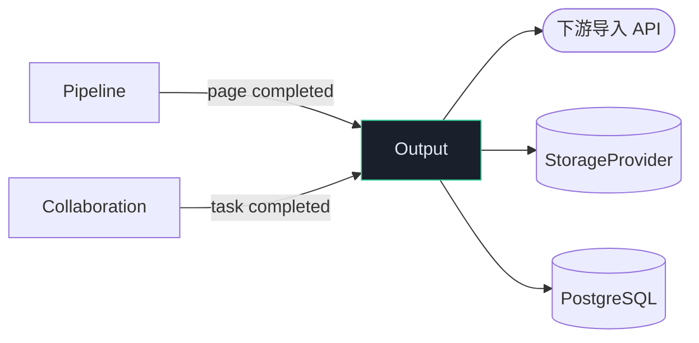
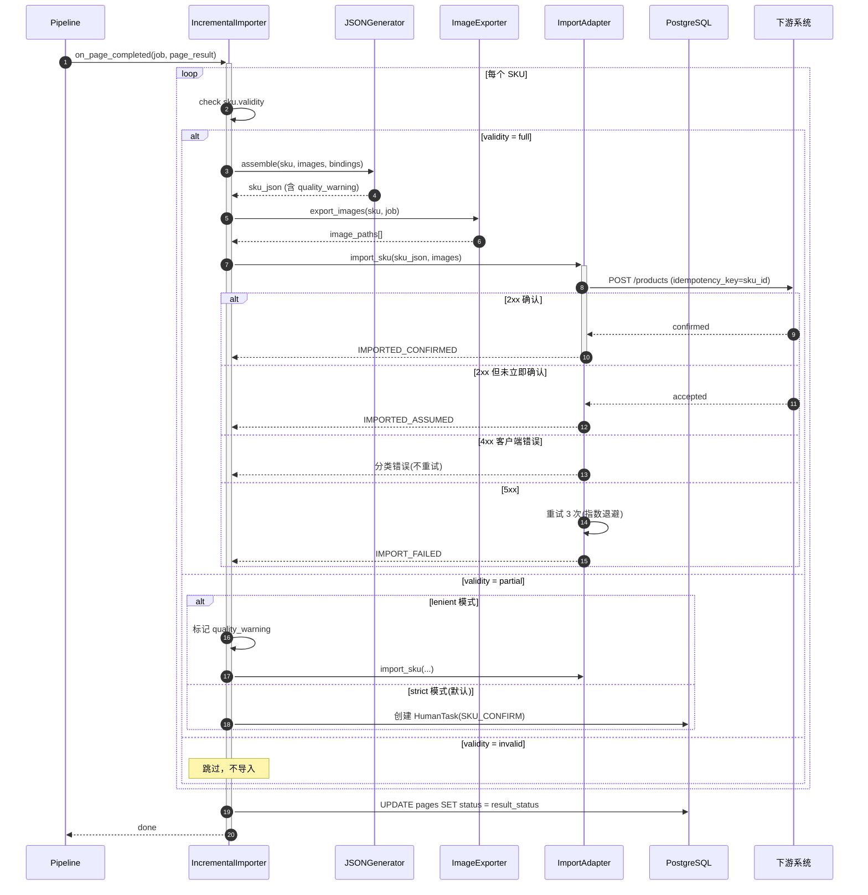

# Output 模块详细设计

> **文档版本**: V1.1  
> **上游依赖**: TA V1.6 §3.7 | BA V1.1 §4.4a | BRD V2.1 §8  
> **模块定位**: 导出层 — JSON 组装 + 图片导出 + 增量导入 + 对账轮询  
> **设计原则**: 页面级增量（不等整份 PDF）、幂等导入、终态完整性

### V1.1 修订说明

| 变更 ID | 级别 | 说明 | 来源 |
|---------|------|------|------|
| P0-2 | P0 | I5 降级方案 + ImportAdapter 版本适配层 | Qwen3+Kimi |
| P1-O1 | P1 | Upsert 语义：跨页属性修正→冲正已导入数据 | Gemini |
| P1-O2 | P1 | 背压机制：IMPORT_FAILED 比例高时 Pipeline 降速 | Gemini |
| P1-O3 | P1 | /ops/recovery 手动恢复接口 | Gemini |
| P1-O4 | P1 | 幂等键增加 revision | Qwen3 |
| P1-O5 | P1 | 4xx 错误精细分类 | Qwen3 |
| P1-O6 | P1 | ImageExporter 返回 URI 而非路径 | Kimi |
| P1-O7 | P1 | completion_snapshot Schema 定义 | Kimi |
| P1-O8 | P1 | 终态判定并发保护（条件 UPDATE） | DeepSeek |
| P1-O9 | P1 | 429 退避策略改为 30s/60s/120s | GLM-5 |
| P1-O10 | P1 | asyncio.create_task 异常捕获回调 | GLM-5 |

---

## 1. 模块职责边界

| 职责 | 说明 | 对齐 |
|------|------|------|
| **JSON 组装** | SKU + Images + Bindings → 结构化 JSON | TA §3.7 |
| **图片导出** | 图片文件写入 Storage + 路径管理 | TA §3.7 |
| **增量导入** | 每页完成即导入下游系统（strict/lenient 模式） | T35, V1.6:P1-14 |
| **Import Adapter** | 适配下游 API（幂等键=sku_id，4xx 分类） | TA §3.7 |
| **对账轮询** | IMPORTED_ASSUMED 确认 + IMPORT_FAILED 滞留检测 | V1.6:P1-9/P1-17 |
| **Job 终态判定** | 所有有效页面达终态 → FULL_IMPORTED | V1.6:P1-17 |
| **quality_warning** | 低分辨率/歧义绑定标记，下游自行决策 | T78/T84 |

### 依赖



---

## 2. 目录结构

```
app/
├── output/
│   ├── __init__.py
│   ├── json_generator.py           # 结构化 JSON 组装
│   ├── image_exporter.py           # 图片导出 → URI（非路径）  [V1.1]
│   ├── path_normalizer.py          # 路径拼接规范化
│   ├── incremental_importer.py     # 页面级增量导入 + 背压 + 异常回调  [V1.1]
│   ├── import_adapter.py           # 下游 API 适配（幂等+重试+版本适配层）  [V1.1]
│   ├── reconciliation_poller.py    # 对账轮询 + Job 终态判定 + I5 降级  [V1.1]
│   ├── backpressure.py             # [V1.1] 背压信号：IMPORT_FAILED 比例监控
│   ├── schemas.py                  # [V1.1] + completion_snapshot Schema
│   ├── repository.py
│   └── constants.py
```

---

## 3. 核心时序图

### 3.1 页面级增量导入



### 3.2 对账轮询 + Job 终态

```mermaid
sequenceDiagram
    autonumber
    participant Cron as APScheduler(30min)
    participant RP as ReconciliationPoller
    participant IA as ImportAdapter
    participant DB as PostgreSQL

    Cron->>+RP: reconcile()

    rect rgb(30, 40, 60)
    Note over RP: 1. IMPORTED_ASSUMED 确认
    RP->>DB: SELECT * FROM pages WHERE status='IMPORTED_ASSUMED'
    loop 每个 assumed 页
        RP->>IA: check_import_status(job_id, page)
        alt 已确认
            RP->>DB: UPDATE status='IMPORTED_CONFIRMED'
        end
    end
    end

    rect rgb(40, 30, 50)
    Note over RP: 2. IMPORT_FAILED 滞留检测(>24h)
    RP->>DB: SELECT * FROM pages<br/>WHERE status='IMPORT_FAILED'<br/>AND updated_at < now()-24h
    loop 每个滞留页
        RP->>DB: UPDATE status='SKIPPED'
        RP->>RP: metrics.import_stale_skipped_total++
    end
    end

    rect rgb(30, 50, 40)
    Note over RP: 3. Job 终态判定
    RP->>DB: SELECT jobs WHERE status IN (PROCESSING, PARTIAL_IMPORTED, DEGRADED_HUMAN)
    loop 每个活跃 Job
        RP->>DB: 查询该 Job 所有有效页面状态
        alt 全部 IMPORTED_CONFIRMED 或 IMPORTED_ASSUMED
            RP->>DB: UPDATE job SET status='FULL_IMPORTED'<br/>+ completion_snapshot
        end
    end
    end

    RP-->>-Cron: done
```



---

## 4. 组件详细规格

### 4.1 IncrementalImporter

```python
class IncrementalImporter:
    """
    页面级增量导入（T35）：
    - full validity → 立即导入
    - partial + lenient → 标记 warning 后导入
    - partial + strict → 创建人工确认任务
    - invalid → 跳过

    [V1.1] 变更：
    - P1-O1: Upsert 语义（跨页属性修正→UPDATE_REQ 冲正已导入数据）
    - P1-O2: 背压检查（IMPORT_FAILED 比例 >20% 时通知 Pipeline 降速）
    - P1-O6: ImageExporter 返回 URI 而非文件路径（为 OSS 迁移做准备）
    - P1-O10: asyncio.create_task 注册异常回调（不静默丢失）
    """

    async def on_page_completed(self, job: PDFJob, result: PageResult):
        profile = config.get_profile(job.frozen_config_version)

        # [V1.1 P1-O2] 背压检查
        if self._backpressure.is_throttled(job.job_id):
            logger.warning("import_throttled", job_id=str(job.job_id))
            await asyncio.sleep(self._backpressure.delay_seconds)

        for sku in (result.skus or []):
            if sku.validity == "full":
                task = asyncio.create_task(self._import_safe(sku, job, result))
                task.add_done_callback(self._on_import_done)  # [V1.1 P1-O10]
            elif sku.validity == "partial":
                if profile.sku_validity_mode == "lenient":
                    sku.quality_warning = "partial_sku_lenient_import"
                    task = asyncio.create_task(self._import_safe(sku, job, result))
                    task.add_done_callback(self._on_import_done)
                else:
                    await self._collab.create_task(
                        job_id=str(job.job_id), page_number=sku.page_number,
                        task_type="SKU_CONFIRM",
                        context={"sku": sku.to_dict()})
            # invalid → skip

    async def _import_safe(self, sku, job, result):
        try:
            json_payload = self._json_gen.assemble(sku, result.images, result.bindings)
            # [V1.1 P1-O6] ImageExporter 返回 URI 而非路径
            image_uris = await self._img_export.export_to_uri(sku, job)
            import_result = await self._adapter.import_sku(
                json_payload, image_uris,
                revision=sku.revision)  # [V1.1 P1-O4]

            status = ("IMPORTED_CONFIRMED" if import_result.confirmed
                      else "IMPORTED_ASSUMED")
            await self._repo.update_page_status(sku.page_id, status)
            # [V1.1 P1-O2] 背压：成功时重置计数
            self._backpressure.on_success(job.job_id)
        except ImportDataError as e:
            # [V1.1 P1-O5] 4xx 数据错误 → 不重试，直接失败
            logger.error("import_data_error", sku_id=sku.sku_id, error=str(e))
            await self._repo.update_page_status(sku.page_id, "IMPORT_FAILED")
            self._backpressure.on_failure(job.job_id)
        except Exception as e:
            logger.error("import_failed", sku_id=sku.sku_id, error=str(e))
            await self._repo.update_page_status(sku.page_id, "IMPORT_FAILED")
            self._backpressure.on_failure(job.job_id)

    def _on_import_done(self, task: asyncio.Task):
        """[V1.1 P1-O10] Fire-and-forget 任务异常回调"""
        if task.cancelled():
            return
        exc = task.exception()
        if exc:
            logger.error("import_task_unhandled", error=str(exc), exc_info=exc)
            metrics.import_unhandled_error_total.inc()

    async def on_cross_page_correction(self, job: PDFJob, corrected_attr: dict):
        """
        [V1.1 P1-O1] Upsert 语义：跨页属性修正 → 冲正已导入数据

        当 Pipeline/Collaboration 发现跨页全局属性（如品牌/系列名）需修正时，
        对已导入的 SKU 发起 UPDATE_REQ。
        """
        affected_skus = await self._repo.get_imported_skus_by_job(job.job_id)
        for sku in affected_skus:
            if sku.needs_correction(corrected_attr):
                update_payload = sku.build_correction_payload(corrected_attr)
                await self._adapter.upsert_sku(
                    update_payload, revision=sku.revision + 1)
                await self._repo.update_sku_revision(sku.sku_id, sku.revision + 1)
                metrics.import_upsert_total.inc()
```

### 4.1.1 BackpressureMonitor — 背压信号

```python
class BackpressureMonitor:
    """
    [V1.1 P1-O2] 背压机制：当 IMPORT_FAILED 比例超阈值时通知 Pipeline 降速

    - 统计最近 N 次导入的失败比例
    - 比例 >20% → is_throttled=True → Pipeline Semaphore 缩减
    """

    WINDOW_SIZE = 50
    FAILURE_THRESHOLD = 0.20
    THROTTLE_DELAY = 5.0  # 秒

    def __init__(self):
        self._windows: dict[str, deque] = {}

    def on_success(self, job_id: str):
        self._record(job_id, True)

    def on_failure(self, job_id: str):
        self._record(job_id, False)

    def _record(self, job_id: str, success: bool):
        if job_id not in self._windows:
            self._windows[job_id] = deque(maxlen=self.WINDOW_SIZE)
        self._windows[job_id].append(success)

    def is_throttled(self, job_id: str) -> bool:
        window = self._windows.get(job_id)
        if not window or len(window) < 10:
            return False
        failure_rate = 1.0 - (sum(window) / len(window))
        return failure_rate > self.FAILURE_THRESHOLD

    @property
    def delay_seconds(self) -> float:
        return self.THROTTLE_DELAY
```

### 4.2 ImportAdapter — 幂等 + 4xx 分类 + 版本适配层

```python
class ImportAdapter:
    """
    下游 API 适配层：

    [V1.1] 变更：
    - P0-2: 版本适配层 — 支持 V1/V2 API 并行，I5 不成立时降级
    - P1-O4: 幂等键 = f"{sku_id}_v{revision}"（AI 重试不覆盖旧结果）
    - P1-O5: 4xx 精细分类：400→数据错误(不重试) / 409→CAS重试 / 429→长退避
    - P1-O9: 429 退避改为 30s/60s/120s（V1.0 仅 5s/10s/20s 远不够）
    """

    MAX_RETRIES = 3
    TIMEOUT = 30
    BACKOFF_429 = [30, 60, 120]          # [V1.1 P1-O9] 限流退避
    BACKOFF_5XX = [2, 4, 8]              # 服务端错误退避
    MAX_BACKOFF = 300                     # 5min 硬上限

    def __init__(self, api_config: dict):
        self._import_url = api_config["import_url"]
        self._check_url = api_config.get("check_url")  # [P0-2] 可能不存在
        self._api_version = api_config.get("api_version", "v1")
        self._i5_supported = api_config.get("i5_check_status", True)

    async def import_sku(
        self, payload: dict, image_uris: list[str], revision: int = 1
    ) -> ImportResult:
        # [V1.1 P1-O4] 幂等键包含 revision
        idempotency_key = f"{payload['sku_id']}_v{revision}"

        for attempt in range(self.MAX_RETRIES + 1):
            try:
                resp = await self._http.post(
                    self._import_url,
                    json={**payload, "image_uris": image_uris},
                    headers={
                        "Idempotency-Key": idempotency_key,
                        "X-API-Version": self._api_version,
                    },
                    timeout=self.TIMEOUT,
                )
                if resp.status_code in (200, 201):
                    return ImportResult(confirmed=True)
                elif resp.status_code == 202:
                    return ImportResult(confirmed=False)  # IMPORTED_ASSUMED
                elif resp.status_code == 409:
                    if attempt < self.MAX_RETRIES:
                        await asyncio.sleep(min(1 * (2 ** attempt), self.MAX_BACKOFF))
                        continue
                elif resp.status_code == 429:
                    # [V1.1 P1-O9] 限流退避 30s/60s/120s
                    delay = (self.BACKOFF_429[attempt]
                             if attempt < len(self.BACKOFF_429)
                             else self.MAX_BACKOFF)
                    await asyncio.sleep(delay)
                    continue
                elif 400 <= resp.status_code < 500:
                    raise ImportDataError(f"4xx: {resp.status_code}", resp.text)
                else:
                    if attempt < self.MAX_RETRIES:
                        delay = (self.BACKOFF_5XX[attempt]
                                 if attempt < len(self.BACKOFF_5XX)
                                 else self.MAX_BACKOFF)
                        await asyncio.sleep(delay)
                        continue
                    raise ImportServerError(f"5xx: {resp.status_code}")
            except (TimeoutError, ConnectionError) as e:
                if attempt < self.MAX_RETRIES:
                    await asyncio.sleep(self.BACKOFF_5XX[min(attempt, 2)])
                    continue
                raise

        raise ImportServerError("Max retries exceeded")

    async def upsert_sku(self, payload: dict, revision: int) -> ImportResult:
        """[V1.1 P1-O1] Upsert 语义：冲正已导入的 SKU 属性"""
        idempotency_key = f"{payload['sku_id']}_v{revision}"
        resp = await self._http.put(
            f"{self._import_url}/{payload['sku_id']}",
            json=payload,
            headers={"Idempotency-Key": idempotency_key},
            timeout=self.TIMEOUT,
        )
        if resp.status_code in (200, 201):
            return ImportResult(confirmed=True)
        raise ImportServerError(f"Upsert failed: {resp.status_code}")

    async def check_status(self, job_id: str, page_number: int) -> bool:
        """
        [V1.1 P0-2] I5 降级方案：
        - I5 成立：调用 check_url 批量查询
        - I5 不成立：返回 None（由 ReconciliationPoller 走降级逻辑）
        """
        if not self._i5_supported or not self._check_url:
            return None  # 降级信号

        try:
            resp = await self._http.get(
                f"{self._check_url}?job_id={job_id}&page={page_number}",
                timeout=10)
            if resp.status_code == 200:
                return resp.json().get("confirmed", False)
            return None
        except Exception:
            return None
```

### 4.3 ReconciliationPoller — 对账

```python
class ReconciliationPoller:
    """
    [V1.1] 变更：
    - P0-2: I5 降级 — check_status 返回 None 时走 ASSUMED 超时自动确认
    - P1-O7: completion_snapshot Schema 明确定义
    - P1-O8: 终态判定并发保护（条件 UPDATE 避免重复触发）
    """

    ASSUMED_INTERVAL = 30 * 60      # 30min
    FAILED_STALE_THRESHOLD = 86400  # 24h（可通过 Config 覆盖）
    ASSUMED_AUTO_CONFIRM_SEC = 86400  # [V1.1 P0-2] I5 降级：24h 自动确认

    async def reconcile(self):
        # 1. IMPORTED_ASSUMED → 确认
        assumed = await self._repo.get_pages_by_status("IMPORTED_ASSUMED")
        for page in assumed:
            confirmed = await self._adapter.check_status(page.job_id, page.page_number)
            if confirmed is True:
                await self._repo.update_page_status(page.id, "IMPORTED_CONFIRMED")
                metrics.reconcile_confirmed_total.inc()
            elif confirmed is None:
                # [V1.1 P0-2] I5 不成立降级：ASSUMED 超 24h 自动确认
                age = (datetime.utcnow() - page.updated_at).total_seconds()
                if age > self.ASSUMED_AUTO_CONFIRM_SEC:
                    await self._repo.update_page_status(
                        page.id, "IMPORTED_CONFIRMED",
                        trigger="assumed_auto_confirm_i5_degraded")
                    metrics.reconcile_auto_confirmed_total.inc()
                    logger.info("assumed_auto_confirmed",
                        page_id=page.id, age_hours=age / 3600)

        # 2. IMPORT_FAILED 滞留（>24h）→ SKIPPED
        stale = await self._repo.get_stale_failed(self.FAILED_STALE_THRESHOLD)
        for page in stale:
            await self._repo.update_page_status(page.id, "SKIPPED",
                                                 trigger="stale_import_timeout")
            metrics.import_stale_skipped_total.inc()

        # 3. Job 终态判定
        await self._check_job_completion()

    async def _check_job_completion(self):
        active_jobs = await self._repo.get_active_jobs()
        for job in active_jobs:
            page_statuses = await self._repo.get_effective_page_statuses(job.job_id)
            terminal = {"IMPORTED_CONFIRMED", "IMPORTED_ASSUMED", "SKIPPED"}
            if all(p.status in terminal for p in page_statuses):
                snapshot = self._build_completion_snapshot(page_statuses, job)
                # [V1.1 P1-O8] 并发保护：条件 UPDATE 避免重复触发
                updated = await self._repo.update_job_status_conditional(
                    job.job_id,
                    expected_status_not_in=["FULL_IMPORTED"],
                    new_status="FULL_IMPORTED",
                    extra={"completion_snapshot": snapshot})
                if updated:
                    metrics.job_full_imported_total.inc()

    def _build_completion_snapshot(self, page_statuses, job) -> dict:
        """
        [V1.1 P1-O7] completion_snapshot Schema:
        {
            "snapshot_at": "2025-02-15T12:00:00Z",
            "total_pages": 50,
            "effective_pages": 48,
            "status_distribution": {
                "IMPORTED_CONFIRMED": 45,
                "IMPORTED_ASSUMED": 2,
                "SKIPPED": 1
            },
            "assumed_count": 2,
            "skipped_count": 1,
            "confirmed_count": 45,
            "i5_degraded": false,
            "evidence": {
                "first_import_at": "...",
                "last_import_at": "...",
                "total_skus_imported": 230
            }
        }
        """
        from collections import Counter
        dist = Counter(p.status for p in page_statuses)
        return {
            "snapshot_at": datetime.utcnow().isoformat(),
            "total_pages": job.total_pages,
            "effective_pages": len(page_statuses),
            "status_distribution": dict(dist),
            "assumed_count": dist.get("IMPORTED_ASSUMED", 0),
            "skipped_count": dist.get("SKIPPED", 0),
            "confirmed_count": dist.get("IMPORTED_CONFIRMED", 0),
            "i5_degraded": not self._adapter._i5_supported,
            "evidence": {
                "first_import_at": min(
                    (p.updated_at for p in page_statuses), default=None),
                "last_import_at": max(
                    (p.updated_at for p in page_statuses), default=None),
            },
        }
```

---

## 5. Prometheus 指标

```python
sku_import_total = Counter("sku_import_total", "", ["status", "validity"])
import_duration_seconds = Histogram("import_duration_seconds", "")
import_stale_skipped_total = Counter("import_stale_skipped_total", "")
import_adapter_error_total = Counter("import_adapter_error_total", "", ["status_code"])
reconcile_confirmed_total = Counter("reconcile_confirmed_total", "")
# [V1.1] 新增
import_upsert_total = Counter("import_upsert_total", "Upsert corrections")
import_unhandled_error_total = Counter("import_unhandled_error_total", "Unhandled async task errors")
import_backpressure_throttled_total = Counter("import_backpressure_throttled_total", "")
reconcile_auto_confirmed_total = Counter("reconcile_auto_confirmed_total", "I5 degraded auto-confirm")
job_full_imported_total = Counter("job_full_imported_total", "")
```

---

## 6. 交付清单

| 文件 | 行数(估) | 优先级 | V1.1 变更 |
|------|---------|--------|----------|
| `incremental_importer.py` | ~250 | P0 | +100: 背压/异常回调/upsert/URI |
| `import_adapter.py` | ~200 | P0 | +80: 版本适配层/revision幂等/429退避/upsert |
| `json_generator.py` | ~100 | P0 | — |
| `image_exporter.py` | ~100 | P0 | +20: 返回 URI 而非路径 |
| `path_normalizer.py` | ~40 | P0 | — |
| `reconciliation_poller.py` | ~280 | P0 | +100: I5降级/snapshot Schema/并发保护 |
| `backpressure.py` | ~60 | P1 | 🆕 新增 |
| `schemas.py` | ~100 | P0 | +40: CompletionSnapshot / ImportResult |
| `repository.py` | ~100 | P0 | +20: update_job_status_conditional |
| `constants.py` | ~30 | P0 | +10: 新增配置项 |
| **总计** | **~1260** | — | **+430（V1.0: 830 → V1.1: 1260）** |
