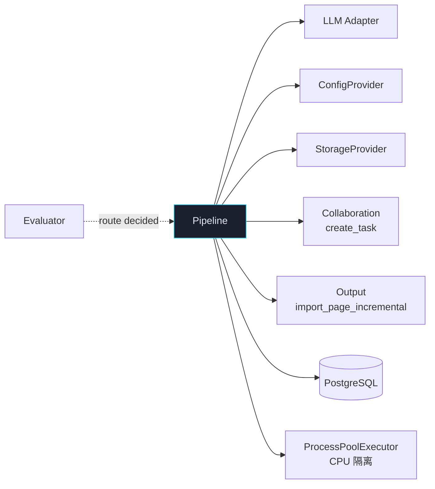
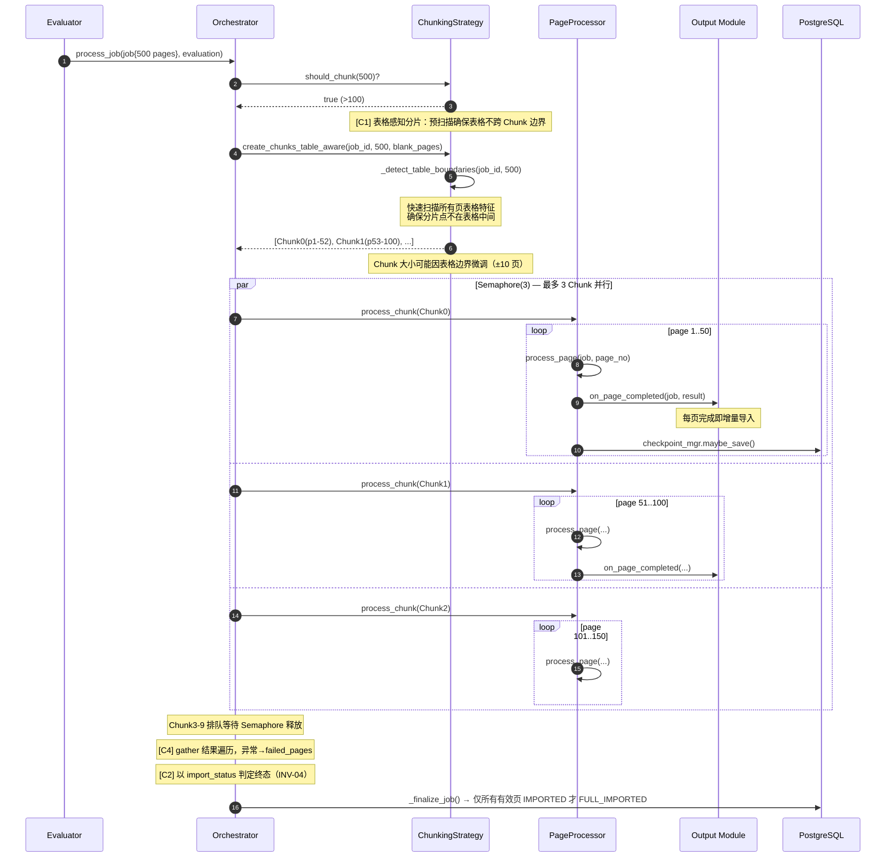
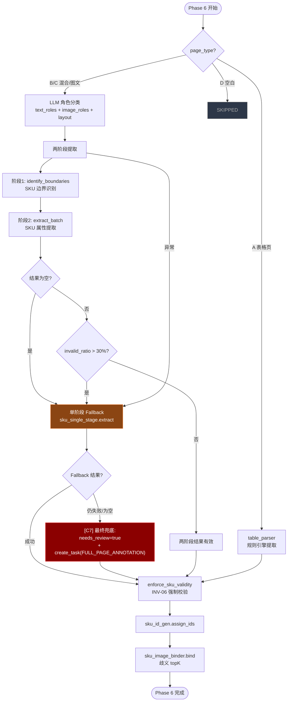

# Pipeline 模块详细设计

> **文档版本**: V1.2
> **上游依赖**: TA V1.6 §3.3 + §2.4 + §2.5 | BRD V2.1 | BA V1.1 §4
> **模块定位**: 系统核心 — 9 阶段处理链 + Semaphore 并行编排，承接单页解析→分类→SKU提取→绑定→校验→导出
> **设计原则**: 路由准确率 > SKU 召回率 > 图片质量 > 人工成本 > 速度（BRD §1.4）

### V1.1 修订说明

基于六家模型评审（ChatGPT 5.2 / Kimi 2.5 / Qwen3 / GLM-5 / DeepSeek / Gemini）合并去重后的 40 项意见，本版本落实 P0×8 + P1×10 项修改：

| 编号 | 变更 | 来源 | 级别 |
|------|------|------|------|
| C1 | 表格感知分片 + CrossPageMerger guard，解决 Chunk 并行与 lookback 冲突 | ChatGPT+Kimi | P0 |
| C2 | `_finalize_job()` 以 import_status 为准，对齐 INV-04 | ChatGPT | P0 |
| C3 | 增量导入幂等保护（import_dedup 去重表） | ChatGPT | P0 |
| C4 | `asyncio.gather` 结果遍历，异常不吞 | ChatGPT | P0 |
| C5 | Checkpoint 与导入时序修正：导入成功后才保存 Checkpoint | Kimi | P0 |
| C6 | SKU validity 移除 `partial`，对齐 BRD valid/invalid 语义 | Kimi | P0 |
| C7 | Phase 6 最终兜底：单阶段 Fallback 仍失败 → needs_review + 人工任务 | Qwen3 | P0 |
| C8 | INV 运行时校验：补充 INV-01/02/07/11 断言 | Qwen3 | P0 |
| C9 | 进程池 max_tasks_per_child + PaddleOCR 预热 | ChatGPT+Kimi+Qwen3 | P1 |
| C10 | PDFExtractor fallback 异常记录日志+metrics | GLM-5 | P1 |
| C11 | 图片去重与绑定顺序：先去重再绑定 | Kimi | P1 |
| C12 | SKU ID 排序键对齐 BA/TA + 跨解析器坐标归一化 | ChatGPT+DeepSeek | P1 |
| C13 | LLM 调用 MAX_LLM_CALLS_PER_PAGE 硬上限 | Kimi | P1 |
| C14 | 一致性校验 RULES 显式定义 | GLM-5 | P1 |
| C15 | `_infer_method` 补实现（binding_method） | DeepSeek | P1 |
| C16 | Phase 6 最终兜底的 fallback_reason/trace 落库 | ChatGPT | P1 |
| C17 | 碎图光栅化超时控制 | Qwen3+DeepSeek | P1 |
| C18 | CrossPageMerger DB 查询超时 + 合并原子性元数据 | Qwen3+DeepSeek | P1 |

### V1.2 修订说明 (2026-02-21)

| 编号 | 变更 | 说明 |
|------|------|------|
| P1 | 统一并行处理 | 删除串行/分片双模式，所有 Job 统一使用 Semaphore 并行（PIPELINE_CONCURRENCY 环境变量，默认 5） |
| P2 | CrossPageMerger 并发安全 | cache_page/find_continuation 改为 async def + per-job asyncio.Lock；前页未缓存时优雅降级返回 None |
| P3 | Orchestrator 简化 | 删除 _process_sequential/_process_chunked，新增 _process_parallel；每页独立 DB session；finalize/error 用新 session |
| P4 | ChunkingStrategy 解耦 | Orchestrator 不再依赖 ChunkingStrategy（保留模块但不使用） |

---

## 1. 模块职责边界

### 1.1 职责范围

| 职责 | 说明 | 对齐 |
|------|------|------|
| **PDF 解析** | 多库兜底（pdfplumber→PyMuPDF→PaddleOCR），输出 ParsedPageIR | TA T26 |
| **图片预处理** | 碎图检测+光栅化、质量评估、去重（按角色） | TA T78, V1.6:P1-12 |
| **特征提取** | 结构化特征向量（文本密度/图片率/表格数/OCR率） | TA §3.3 |
| **跨页表格** | 检测+回溯合并（上限10页），Chunk 边界 overlap | TA G1 |
| **页面分类** | A/B/C/D 四类 + Document-Anchoring Prompt | TA T33 |
| **角色分类** | 文本角色、图片角色、版面类型（LLM 调用） | TA §2.4 |
| **SKU 提取** | 两阶段（边界识别→属性提取）+ 单阶段 Fallback | TA T27/T72 |
| **SKU-图片绑定** | 版面分档距离阈值 + 歧义 topK 候选 | TA T29/T84 |
| **一致性校验** | 规则可配置（品类 schema），SKU 有效性强制校验 | TA T28/T55, V1.6:P1-8 |
| **SKU ID 生成** | 坐标归一化 + 双键排序：`{hash8}_p{page}_{seq}` | TA §3.3 |
| **Checkpoint** | 每 10 页持久化进度（DB+Redis），支持故障恢复 | TA T52 |
| **增量导出** | 每页完成即触发 Output 模块增量导入 | TA T35 |
| **Semaphore 并行** | 所有页面统一并行处理（Semaphore 控制并发数，默认 5），每页独立 DB session | TA G1, V1.2:P1 |

### 1.2 不负责的事

| 不做 | 归属 |
|------|------|
| 文件上传、安全检查 | Gateway |
| 文档级评估、路由决策 | Evaluator |
| LLM 调用、熔断、限流 | LLM Adapter |
| 人工任务分配与锁 | Collaboration |
| 下游系统导入、对账 | Output |

### 1.3 模块依赖



---

## 2. 目录结构

```
app/
├── pipeline/
│   ├── __init__.py
│   ├── orchestrator.py             # 顶层编排（分片/串行/单页分发）
│   ├── page_processor.py           # 单页 9 阶段处理链
│   ├── chunking.py                 # 大 PDF 分片策略
│   │
│   ├── extractors/                 # 阶段 1-3
│   │   ├── __init__.py
│   │   ├── pdf_extractor.py        # 多库兜底（pdfplumber/PyMuPDF/PaddleOCR）
│   │   ├── feature_extractor.py    # 结构化特征向量
│   │   └── image_processor.py      # 碎图检测 + 光栅化 + 质量评估
│   │
│   ├── classifiers/                # 阶段 5（LLM 调用）
│   │   ├── __init__.py
│   │   ├── page_classifier.py      # 页面类型 A/B/C/D
│   │   ├── text_classifier.py      # 文本角色分类
│   │   ├── image_classifier.py     # 图片角色分类
│   │   └── layout_classifier.py    # 版面类型 L1-L4
│   │
│   ├── sku/                        # 阶段 6
│   │   ├── __init__.py
│   │   ├── sku_list_extractor.py   # 阶段1: SKU 边界识别
│   │   ├── sku_attr_extractor.py   # 阶段2: SKU 属性提取
│   │   ├── sku_single_stage.py     # 单阶段 Fallback
│   │   ├── sku_id_gen.py           # SKU ID 生成
│   │   ├── sku_image_binder.py     # SKU-图片绑定（歧义 topK）
│   │   └── sku_exporter.py         # SKU validity 模式导出
│   │
│   ├── table/                      # 阶段 4
│   │   ├── __init__.py
│   │   ├── table_parser.py         # 表格解析 + A 类页直提取
│   │   └── cross_page_merger.py    # 跨页表格检测 + 拼接
│   │
│   ├── validators/                 # 阶段 7-8
│   │   ├── __init__.py
│   │   ├── consistency_validator.py# 结构一致性校验
│   │   └── image_dedup.py          # 图片去重（按角色分策略）
│   │
│   ├── ir.py                       # ParsedPageIR + TextBlock + ImageBlock + TableBlock
│   ├── schemas.py                  # PageResult, SKUResult, BindingResult
│   ├── events.py                   # Pipeline 领域事件
│   ├── repository.py               # pages/skus/images 表 CRUD
│   └── constants.py                # 配置 + 阈值常量
```

---

## 3. 类图

```mermaid
classDiagram
    class Orchestrator {
        -page_processor: PageProcessor
        -db_session_factory: Callable
        -checkpoint: CheckpointManager
        -output: SKUImporter
        +process_job(db, job, evaluation) void
        -_process_parallel(job, pages, file_path) void
    }

    class PageProcessor {
        -extractor: PDFExtractor
        -img_processor: ImageProcessor
        -feature_extractor: FeatureExtractor
        -cross_page: CrossPageMerger
        -page_classifier: PageClassifier
        -text_classifier: TextClassifier
        -image_classifier: ImageClassifier
        -layout_classifier: LayoutClassifier
        -sku_list: SKUListExtractor
        -sku_attr: SKUAttrExtractor
        -sku_single: SKUSingleStage
        -sku_id_gen: SKUIdGenerator
        -binder: SKUImageBinder
        -dedup: ImageDedup
        -validator: ConsistencyValidator
        -exporter: SKUExporter
        +process_page(job, page_no, attempt) PageResult
    }

    class PDFExtractor {
        -paddle_ocr: PaddleOCR
        +extract(file_path, page_no) ParsedPageIR
        -_extract_pdfplumber(path, page) ParsedPageIR
        -_extract_pymupdf(path, page) ParsedPageIR
        -_extract_paddleocr(screenshot) ParsedPageIR
    }

    class ImageProcessor {
        +is_fragmented(img) bool
        +rasterize_region(file, page, bbox) ImageBlock
        +assess_quality(img) ImageQuality
    }

    class FeatureExtractor {
        +extract(raw) FeatureVector
    }

    class CrossPageMerger {
        +MAX_LOOKBACK: 10
        +QUERY_TIMEOUT_SEC: 5
        +find_continuation(job_id, page, raw) TableContinuation
        +merge(source, current) list~TableBlock~
        -is_continuation(prev, current) bool
        -_query_completed_pages_only(job_id, page, lookback) list
    }

    class SKUListExtractor {
        +identify_boundaries(text, roles, screenshot, profile) list~SKUBoundary~
    }

    class SKUAttrExtractor {
        +extract_batch(boundaries, raw, profile) list~SKUResult~
    }

    class SKUSingleStage {
        +extract(raw, text_roles, profile) list~SKUResult~
    }

    class SKUImageBinder {
        +DISTANCE_THRESHOLDS: dict
        +AMBIGUITY_GAP: float
        +bind(skus, images, layout, profile) list~BindingResult~
        -_bbox_distance(a, b) float
        -_infer_method(sku, img, layout) str
        -_resolve_conflicts(candidates) list
    }

    class ConsistencyValidator {
        +RULES: list~ValidationRule~
        +validate(page_type, skus, images, profile) ValidationResult
        +enforce_sku_validity(skus, profile) list~SKUResult~
        +assert_invariants(job, profile) void
    }

    class ImageDedup {
        +dedup_by_role(images, roles, job_id) DedupReport
    }

    class ChunkingStrategy {
        +CHUNK_SIZE: 50
        +MAX_PARALLEL: 3
        +should_chunk(total_pages) bool
        +create_chunks(total, blanks) list~PageChunk~
        +create_chunks_table_aware(job_id, total, blanks) list~PageChunk~
        -_detect_table_boundaries(job_id, total) list~TableBoundary~
        -_is_in_middle_of_table(page, boundaries) bool
    }

    Orchestrator --> PageProcessor

    PageProcessor --> PDFExtractor
    PageProcessor --> ImageProcessor
    PageProcessor --> FeatureExtractor
    PageProcessor --> CrossPageMerger
    PageProcessor --> SKUListExtractor
    PageProcessor --> SKUAttrExtractor
    PageProcessor --> SKUSingleStage
    PageProcessor --> SKUImageBinder
    PageProcessor --> ConsistencyValidator
    PageProcessor --> ImageDedup
```



---

## 4. 核心时序图

### 4.1 单页 9 阶段处理链

```mermaid
sequenceDiagram
    autonumber
    participant Orch as Orchestrator
    participant PP as PageProcessor
    participant Pool as ProcessPool
    participant Ext as PDFExtractor
    participant ImgP as ImageProcessor
    participant Feat as FeatureExtractor
    participant XPage as CrossPageMerger
    participant LLM as LLM Adapter
    participant SKU2 as TwoStageExtractor
    participant SKU1 as SingleStageFallback
    participant Bind as SKUImageBinder
    participant Val as ConsistencyValidator
    participant Dedup as ImageDedup
    participant DB as PostgreSQL

    Orch->>+PP: process_page(job, page_no=42, attempt=1)

    rect rgb(30, 40, 60)
    Note over PP,Ext: Phase 1: PDF 解析（CPU 密集→进程池）
    PP->>+Pool: run_in_executor(extract, file, 42)
    Pool->>Ext: pdfplumber → text_coverage > 0.1?
    alt pdfplumber 失败/低覆盖
        Ext->>Ext: PyMuPDF fallback
        alt 仍低覆盖
            Ext->>Ext: PaddleOCR（中文扫描件）
        end
    end
    Ext-->>Pool: ParsedPageIR
    Pool-->>-PP: raw
    end

    rect rgb(40, 30, 50)
    Note over PP,ImgP: Phase 2: 图片预处理
    loop 每张图片
        PP->>ImgP: is_fragmented(img)?
        alt 碎图
            PP->>Pool: rasterize_region(file, page, bbox)
            Pool-->>PP: 光栅化图片
        end
        PP->>ImgP: assess_quality(img)
        ImgP-->>PP: ImageQuality(short_edge, warning)
    end
    end

    Note over PP,Feat: Phase 3: 特征提取
    PP->>Feat: extract(raw)
    Feat-->>PP: FeatureVector

    Note over PP,XPage: Phase 4: 跨页表格检测
    PP->>+XPage: find_continuation(job_id, 42, raw)
    XPage->>DB: 查询前 N 页状态
    alt 检测到续表
        XPage-->>PP: TableContinuation(source_tables)
        PP->>XPage: merge(source, current)
    else 无续表
        XPage-->>-PP: None
    end

    rect rgb(30, 50, 40)
    Note over PP,LLM: Phase 5: 页面分类（LLM）
    PP->>Pool: render_page(file, 42)
    Pool-->>PP: screenshot
    PP->>LLM: classify_page(screenshot, anchored_text, features)
    LLM-->>PP: ClassifyResult{page_type=B, confidence=0.92}

    alt page_type=D 且 confidence 足够
        PP-->>Orch: PageResult(SKIPPED)
    end
    end

    rect rgb(50, 30, 40)
    Note over PP,SKU1: Phase 6: SKU 提取
    alt page_type=A（结构化表格）
        PP->>PP: table_parser.parse_and_extract(tables)
    else page_type=B/C
        PP->>LLM: classify_text / classify_images / classify_layout
        LLM-->>PP: roles[], LayoutResult

        PP->>+SKU2: identify_boundaries + extract_batch
        alt 两阶段成功 且 invalid_ratio ≤ 30%
            SKU2-->>-PP: skus[]
        else 为空 或 invalid_ratio > 30% 或 异常
            PP->>SKU1: extract(raw, text_roles)
            SKU1-->>PP: skus[]（fallback）
        end
    end

    PP->>Val: enforce_sku_validity(skus)
    Val-->>PP: skus[]（validity 标记）
    PP->>PP: sku_id_gen.assign_ids(skus)
    PP->>Bind: bind(skus, images, layout)
    Bind-->>PP: bindings[]（含歧义 topK）
    PP->>DB: persist_bindings(bindings)
    end

    Note over PP,Dedup: Phase 7: 图片去重
    PP->>Dedup: dedup_by_role(images, roles, job_id)
    Dedup-->>PP: DedupReport

    Note over PP,Val: Phase 8: 一致性校验
    PP->>Val: validate(page_type, skus, images, profile)
    Val-->>PP: ValidationResult

    Note over PP: Phase 9: Checkpoint + 导出
    PP->>DB: checkpoint_mgr.maybe_save(job, 42, skus)
    PP->>PP: sku_exporter.export(skus, job)

    PP-->>-Orch: PageResult{skus, images, bindings, validation}
```



### 4.2 大 PDF 分片并行



### 4.3 两阶段 SKU 提取 + Fallback 决策



---

## 5. 组件详细规格

### 5.1 Orchestrator — 顶层编排

```python
# orchestrator.py

class Orchestrator:
    """
    Job 级处理编排：
    - ≤100 页：串行逐页处理
    - >100 页：分片并行（50页/Chunk × 3并发）
    
    监听 Evaluator 路由决策后触发。
    每页完成即增量导入 + 发事件。
    
    [C4] gather 结果必须遍历，异常不吞
    [C5] 导入成功后才保存 Checkpoint
    [C2] 终态以 import_status 为准（INV-04）
    """

    def __init__(
        self,
        page_processor: PageProcessor,
        chunking: ChunkingStrategy,
        checkpoint: CheckpointManager,
        output: SKUImporter,
        collab: TaskManager,
        event_bus: EventBus,
        repository: PipelineRepository,
    ):
        self._pp = page_processor
        self._chunking = chunking
        self._ckpt = checkpoint
        self._output = output
        self._collab = collab
        self._eb = event_bus
        self._repo = repository

    async def process_job(self, job: PDFJob, evaluation: Evaluation):
        """入口：根据页数决定串行/分片"""
        await self._repo.update_job_status(job.job_id, "PROCESSING")
        
        # [C8] INV 运行时断言（启动时校验一次）
        profile = self._pp._config.get_profile(job.frozen_config_version)
        self._assert_invariants(job, profile)
        
        try:
            if self._chunking.should_chunk(job.total_pages):
                await self._process_chunked(job, evaluation)
            else:
                await self._process_sequential(job, evaluation)
            
            # 全部完成 → 判断终态
            await self._finalize_job(job)
        except Exception as e:
            logger.error("job_processing_failed", job_id=str(job.job_id), error=str(e))
            await self._repo.update_job_status(
                job.job_id, "PARTIAL_FAILED", degrade_reason=str(e))

    # ──────────────────────────────────────────
    # [C8] INV 运行时断言
    # ──────────────────────────────────────────
    def _assert_invariants(self, job: PDFJob, profile):
        """启动时校验业务不变式，不满足则 fail-fast"""
        # INV-01: B < PV < A
        t = profile.classification_thresholds
        assert t.B_threshold < t.PV_threshold < t.A_threshold, (
            f"INV-01 violated: B({t.B_threshold}) < PV({t.PV_threshold}) < A({t.A_threshold})")
        # INV-02: ΣWi = 1.0
        w = profile.confidence_weights
        assert abs(sum(w.values()) - 1.0) < 0.001, (
            f"INV-02 violated: sum(weights)={sum(w.values())}")
        # INV-09: frozen_config_version 一致
        assert job.frozen_config_version is not None, "INV-09: frozen_config_version is null"
        # INV-11: route=AUTO ⇒ degrade_reason=null
        if job.route == "AUTO":
            assert job.degrade_reason is None, (
                f"INV-11 violated: route=AUTO but degrade_reason={job.degrade_reason}")

    async def _process_sequential(self, job: PDFJob, evaluation: Evaluation):
        non_blank = [p for p in range(1, job.total_pages + 1)
                     if p not in (evaluation.prescan.blank_pages or [])]
        
        for page_no in non_blank:
            result = await self._process_single_page(job, page_no)
            await self._on_page_done(job, page_no, result)

    async def _process_chunked(self, job: PDFJob, evaluation: Evaluation):
        # [C1] 表格感知分片：确保表格不跨 Chunk 边界
        chunks = await self._chunking.create_chunks_table_aware(
            str(job.job_id), job.total_pages,
            evaluation.prescan.blank_pages or [])
        semaphore = asyncio.Semaphore(self._chunking.MAX_PARALLEL)

        async def process_chunk(chunk: PageChunk):
            async with semaphore:
                for page_no in chunk.pages:
                    result = await self._process_single_page(job, page_no)
                    await self._on_page_done(job, page_no, result)

        # [C4] gather 结果必须遍历，异常不吞
        results = await asyncio.gather(
            *[process_chunk(c) for c in chunks],
            return_exceptions=True,
        )
        
        # [C4] 扫描 gather 结果：任何 Exception → 记录失败页 + job 降级
        failed_chunks = []
        for i, r in enumerate(results):
            if isinstance(r, Exception):
                logger.error("chunk_failed", chunk_id=i, error=str(r))
                failed_chunks.append(i)
                metrics.pipeline_chunk_failure_total.labels(reason=type(r).__name__).inc()
        
        if failed_chunks:
            logger.error("job_has_failed_chunks",
                job_id=str(job.job_id), failed_chunks=failed_chunks)
            # 失败的 Chunk 中未处理的页标记为 AI_FAILED
            for chunk_id in failed_chunks:
                chunk = chunks[chunk_id]
                for page_no in chunk.pages:
                    page_status = await self._repo.get_page_status(job.job_id, page_no)
                    if page_status and page_status.status == "PENDING":
                        await self._repo.save_page_result(
                            job.job_id, page_no,
                            PageResult(status="AI_FAILED", error=f"chunk_{chunk_id}_failed"))

    async def _process_single_page(self, job: PDFJob, page_no: int) -> PageResult:
        """单页处理 + 异常降级"""
        try:
            await self._eb.publish(PageStatusChanged(
                job_id=str(job.job_id), page_no=page_no, status="AI_PROCESSING"))
            
            result = await self._pp.process_page(job, page_no, attempt_no=1)
            return result
        except LLMCircuitOpenError:
            # LLM 全熔断 → 创建人工任务
            return await self._degrade_to_human(job, page_no, "llm_circuit_open")
        except Exception as e:
            logger.error("page_failed", page=page_no, error=str(e))
            return PageResult(
                status="AI_FAILED", page_type=None,
                error=str(e), needs_review=True)

    async def _on_page_done(self, job: PDFJob, page_no: int, result: PageResult):
        """
        每页完成后：落库→增量导入→事件→Checkpoint→人工任务（如需）
        
        [C5] 导入成功后才保存 Checkpoint（防止恢复时跳过未导入页）
        [C3] 增量导入必须幂等（import_dedup 去重表）
        """
        # Step 1: 先持久化页面结果
        await self._repo.save_page_result(job.job_id, page_no, result)
        
        # Step 2: 增量导入（带重试）
        # [C3] Output.import_page_incremental 内部必须做幂等保护：
        #   查询 import_dedup(job_id, page_no, attempt_no) 去重表
        #   已导入则跳过，未导入则执行导入并写入去重记录
        import_success = False
        if result.status in ("AI_COMPLETED", "SKIPPED"):
            for attempt in range(3):
                try:
                    await self._output.import_page_incremental(job, result)
                    import_success = True
                    break
                except Exception as e:
                    logger.warning("import_retry",
                        page=page_no, attempt=attempt, error=str(e))
                    await asyncio.sleep(2 ** attempt)
            
            if not import_success:
                # [C5] 导入失败：标记 IMPORT_FAILED，不更新 Checkpoint
                await self._repo.update_page_status(
                    job.job_id, page_no, "IMPORT_FAILED")
                logger.error("import_failed_after_retries", page=page_no)
                return  # 不执行 Checkpoint，故障恢复时从该页重试
        
        # Step 3: 人工任务
        if result.needs_review or result.status == "AI_FAILED":
            task_type = self._determine_task_type(result)
            await self._collab.create_task(
                job_id=str(job.job_id), page_number=page_no,
                task_type=task_type,
                context={"ai_result": result.to_dict()})
        
        # Step 4: 事件发布
        await self._eb.publish(PageStatusChanged(
            job_id=str(job.job_id), page_no=page_no,
            status=result.status, skus_found=len(result.skus or [])))
        
        # Step 5: [C5] 导入成功后才保存 Checkpoint
        await self._ckpt.maybe_save(
            str(job.job_id), page_no, len(result.skus or []))

    async def _degrade_to_human(
        self, job: PDFJob, page_no: int, reason: str
    ) -> PageResult:
        await self._collab.create_task(
            job_id=str(job.job_id), page_number=page_no,
            task_type="FULL_PAGE_ANNOTATION",
            context={"degrade_reason": reason})
        return PageResult(
            status="HUMAN_QUEUED", page_type=None,
            needs_review=True, degrade_reason=reason)

    async def _finalize_job(self, job: PDFJob):
        """
        [C2] 终态判定以 import_status 为准（对齐 INV-04 / BR-29）：
        - FULL_IMPORTED: 所有有效页 import_status ∈ {IMPORTED_CONFIRMED, IMPORTED_ASSUMED}
        - PARTIAL_FAILED: 存在 AI_FAILED 或 IMPORT_FAILED
        - PROCESSING: 存在 HUMAN_QUEUED/HUMAN_PROCESSING（等 Collaboration 完成）
        """
        pages = await self._repo.get_all_page_statuses(job.job_id)
        
        failed = [p for p in pages
                  if p.status in ("AI_FAILED", "IMPORT_FAILED")]
        human_pending = [p for p in pages
                         if p.status in ("HUMAN_QUEUED", "HUMAN_PROCESSING")]
        imported = [p for p in pages
                    if p.status in ("IMPORTED_CONFIRMED", "IMPORTED_ASSUMED")]
        skipped = [p for p in pages if p.status == "SKIPPED"]
        
        total_valid = len(pages) - len(skipped)  # 有效页（非 SKIPPED）
        
        if failed:
            await self._repo.update_job_status(job.job_id, "PARTIAL_FAILED")
        elif human_pending:
            # 等 Collaboration 完成后再转终态
            pass
        elif len(imported) >= total_valid and total_valid > 0:
            # [C2] 所有有效页已导入 → FULL_IMPORTED
            await self._repo.update_job_status(job.job_id, "FULL_IMPORTED")
        else:
            # 仍有页面未到终态
            logger.warning("finalize_incomplete",
                job_id=str(job.job_id),
                imported=len(imported), total_valid=total_valid)
```

### 5.2 PageProcessor — 单页 9 阶段处理链

```python
# page_processor.py

class PageProcessor:
    """
    单页处理核心。严格按 Phase 1-9 顺序执行。
    任何 Phase 异常上抛由 Orchestrator 捕获处理。
    
    [C11] Phase 7 去重在 Phase 6 绑定之前执行
    [C13] LLM 调用硬上限 MAX_LLM_CALLS_PER_PAGE
    [C17] 碎图光栅化超时控制
    """

    MAX_LLM_CALLS_PER_PAGE = 6  # [C13] 硬上限，含分类+提取+fallback

    def __init__(self, **deps):
        # 注入全部子组件（见类图）
        self._extractor = deps["pdf_extractor"]
        self._img_proc = deps["image_processor"]
        self._feat = deps["feature_extractor"]
        self._xpage = deps["cross_page_merger"]
        self._llm = deps["llm_adapter"]
        self._prompt = deps["prompt_engine"]
        self._sku_list = deps["sku_list_extractor"]
        self._sku_attr = deps["sku_attr_extractor"]
        self._sku_single = deps["sku_single_stage"]
        self._sku_id = deps["sku_id_gen"]
        self._binder = deps["sku_image_binder"]
        self._dedup = deps["image_dedup"]
        self._validator = deps["consistency_validator"]
        self._exporter = deps["sku_exporter"]
        self._config = deps["config_provider"]
        self._pool = deps["process_pool"]

    async def process_page(
        self, job: PDFJob, page_no: int, attempt_no: int
    ) -> PageResult:
        profile = self._config.get_profile(job.frozen_config_version)
        loop = asyncio.get_event_loop()

        # ═══ Phase 1: PDF 解析（CPU 密集→进程池） ═══
        raw: ParsedPageIR = await loop.run_in_executor(
            self._pool, self._extractor.extract, job.file_path, page_no)

        # ═══ Phase 2: 图片预处理 ═══
        # [C17] 碎图光栅化增加超时控制（30s）
        processed_images = []
        for img in raw.images:
            if self._img_proc.is_fragmented(img):
                try:
                    img = await asyncio.wait_for(
                        loop.run_in_executor(
                            self._pool, self._img_proc.rasterize_region,
                            job.file_path, page_no, img.bbox),
                        timeout=30.0)  # [C17] 30s 超时
                    img.is_fragmented = True
                except asyncio.TimeoutError:
                    logger.warning("rasterize_timeout", page=page_no, bbox=img.bbox)
                    img.quality = ImageQuality(quality_warning="rasterize_timeout")
                    metrics.image_rasterize_timeout_total.inc()
            img.quality = self._img_proc.assess_quality(img)
            processed_images.append(img)

        # ═══ Phase 3: 特征提取 ═══
        features = self._feat.extract(raw)

        # ═══ Phase 4: 跨页表格检测 ═══
        # [C18] DB 查询超时 5s + 仅查询已完成页（Chunk 并行安全）
        continuation = await self._xpage.find_continuation(
            job_id=str(job.job_id), current_page=page_no, raw=raw)
        if continuation:
            raw.tables = self._xpage.merge(continuation.source_tables, raw.tables)

        # ═══ Phase 5: 页面分类 ═══
        screenshot = await loop.run_in_executor(
            self._pool, render_page, job.file_path, page_no)
        anchored = self._prompt.anchor_builder.build(raw.text_blocks, features)
        cls_result = await self._llm.classify_page(
            screenshot=screenshot, anchored_text=anchored,
            features=features.to_prompt_context(),
            prompt=self._prompt.get_prompt("classify_page", profile))
        
        page_type = cls_result.page_type
        needs_review = cls_result.confidence < profile.classification_thresholds.page_type_min_confidence

        # D 类页面（空白/目录）→ 跳过
        if page_type == "D" and not needs_review:
            return PageResult(status="SKIPPED", page_type="D")

        # ═══ Phase 6: SKU 提取（含去重前置 [C11]） ═══
        skus, bindings = await self._extract_skus(
            job, page_no, page_type, raw, processed_images,
            features, screenshot, profile)

        # ═══ Phase 7（原 Phase 8）: 一致性校验 ═══
        validation = self._validator.validate(
            page_type, skus, processed_images, profile)

        # ═══ Phase 8（原 Phase 9）: 导出 ═══
        export = await self._exporter.export(skus, job, profile)

        return PageResult(
            status="AI_COMPLETED",
            page_type=page_type,
            needs_review=needs_review or validation.has_errors,
            skus=skus,
            images=processed_images,
            bindings=bindings,
            export_results=export,
            validation=validation,
            classification_confidence=cls_result.confidence,
            # [C16] trace 字段落库
            extraction_method=self._last_extraction_method,
            fallback_reason=self._last_fallback_reason,
        )

    async def _extract_skus(
        self, job, page_no, page_type, raw, images,
        features, screenshot, profile
    ) -> tuple[list, list]:
        """
        Phase 6 核心：按页面类型选策略 + 两阶段/单阶段 Fallback
        
        [C11] 先去重再绑定（去重后的 deliverable 列表用于绑定）
        [C13] LLM 调用计数硬上限
        """
        self._last_extraction_method = None
        self._last_fallback_reason = None

        if page_type == "A":
            self._last_extraction_method = "table_rule"
            skus = await self._exporter.table_parser.parse_and_extract(
                raw.tables, profile)
            skus = self._validator.enforce_sku_validity(skus, profile)
            # [C12] SKU ID 坐标归一化后排序：bbox_y1 为主键，同 y 补 bbox_x1
            skus = self._sku_id.assign_ids(skus, job.file_hash[:8], page_no,
                                            raw.metadata.page_height)
            return skus, []

        # B/C 类：LLM 角色分类 + 两阶段提取
        # [C13] LLM 调用计数
        llm_calls = 0

        text_roles = await self._llm.classify_text(
            raw.text_blocks, screenshot, profile)
        llm_calls += 1

        image_roles = await self._llm.classify_images(
            images, screenshot, profile)
        llm_calls += 1

        layout = await self._llm.classify_layout(
            screenshot, features, profile)
        llm_calls += 1

        # 设置图片角色
        for img, role in zip(images, image_roles):
            img.role = role

        # [C11] 先执行图片去重，再用去重后列表绑定
        dedup = self._dedup.dedup_by_role(images, image_roles, str(job.job_id))

        # 两阶段 + Fallback
        # [C7] 增加最终兜底（单阶段仍失败→needs_review）
        skus = await self._two_stage_with_fallback(
            raw, text_roles, screenshot, profile, page_no,
            llm_calls_used=llm_calls)

        # [C6] enforce_sku_validity 对齐 BRD valid/invalid 语义
        skus = self._validator.enforce_sku_validity(skus, profile)
        # [C12] SKU ID 坐标归一化 + bbox_y1 主排序 + bbox_x1 次排序
        skus = self._sku_id.assign_ids(
            skus, job.file_hash[:8], page_no, raw.metadata.page_height)

        # [C11] 绑定使用去重后的 deliverable 列表
        deliverable = [img for img, r in zip(images, image_roles)
                       if r in DELIVERABLE_ROLES and not getattr(img, 'is_duplicate', False)]
        bindings = self._binder.bind(skus, deliverable, layout, profile)
        await self._persist_bindings(bindings, str(job.job_id), page_no)

        return skus, bindings

    async def _two_stage_with_fallback(
        self, raw, text_roles, screenshot, profile, page_no,
        llm_calls_used: int = 0
    ) -> list:
        """
        两阶段提取 + 失败率/异常时回退单阶段
        [C7] 增加最终兜底：单阶段仍失败/为空 → needs_review + 人工任务
        [C13] 尊重 MAX_LLM_CALLS_PER_PAGE 硬上限
        """
        remaining = self.MAX_LLM_CALLS_PER_PAGE - llm_calls_used

        try:
            if remaining >= 2:
                # 两阶段需要 2 次 LLM 调用
                boundaries = await self._sku_list.identify_boundaries(
                    raw.text_blocks, text_roles, screenshot, profile)
                skus = await self._sku_attr.extract_batch(boundaries, raw, profile)

                if not skus:
                    logger.warning("two_stage_empty", page=page_no)
                    metrics.sku_extraction_fallback_total.labels(
                        reason="empty_result").inc()
                    self._last_fallback_reason = "two_stage_empty"
                    return await self._single_stage_or_final_fallback(
                        raw, text_roles, profile, page_no)

                invalid_ratio = sum(1 for s in skus if s.validity == "invalid") / len(skus)
                if invalid_ratio > 0.3:
                    logger.warning("two_stage_high_invalid",
                        page=page_no, ratio=invalid_ratio)
                    metrics.sku_extraction_fallback_total.labels(
                        reason="invalid_ratio_high").inc()
                    self._last_fallback_reason = f"invalid_ratio={invalid_ratio:.2f}"
                    return await self._single_stage_or_final_fallback(
                        raw, text_roles, profile, page_no)

                self._last_extraction_method = "two_stage"
                return skus
            else:
                # [C13] LLM 预算不足，直接走单阶段
                logger.info("llm_budget_skip_two_stage", page=page_no, remaining=remaining)
                self._last_fallback_reason = "llm_budget_exhausted"
                return await self._single_stage_or_final_fallback(
                    raw, text_roles, profile, page_no)

        except Exception as e:
            logger.warning("two_stage_exception", page=page_no, error=str(e))
            metrics.sku_extraction_fallback_total.labels(
                reason="exception").inc()
            self._last_fallback_reason = f"exception:{type(e).__name__}"
            return await self._single_stage_or_final_fallback(
                raw, text_roles, profile, page_no)

    async def _single_stage_or_final_fallback(
        self, raw, text_roles, profile, page_no
    ) -> list:
        """
        [C7] 单阶段提取 + 最终兜底。
        如果单阶段也失败/为空，不抛异常，而是返回空列表 + 标记 needs_review。
        Orchestrator 会根据 needs_review 创建人工任务。
        """
        try:
            skus = await self._sku_single.extract(raw, text_roles, profile)
            if skus:
                self._last_extraction_method = "single_stage"
                return skus
            # 单阶段返回空 → 最终兜底
            logger.warning("single_stage_empty", page=page_no)
            metrics.sku_extraction_fallback_total.labels(
                reason="single_stage_empty").inc()
        except Exception as e:
            logger.warning("single_stage_exception", page=page_no, error=str(e))
            metrics.sku_extraction_fallback_total.labels(
                reason="single_stage_exception").inc()

        # [C7] 最终兜底：返回空 SKU，PageResult.needs_review=true
        # Orchestrator._on_page_done 会创建 FULL_PAGE_ANNOTATION 人工任务
        self._last_extraction_method = "final_fallback"
        self._last_fallback_reason = "all_extraction_failed"
        return []  # 空 SKU，needs_review 由 validation.has_errors 或外层判断触发
```

### 5.3 PDFExtractor — 多库兜底

```python
# extractors/pdf_extractor.py

class PDFExtractor:
    """
    多库兜底策略（TA T26）：
    1. pdfplumber（擅长表格+文本坐标）→ text_coverage > 0.1 则采纳
    2. PyMuPDF（擅长图片+渲染）→ 同上
    3. PaddleOCR（中文扫描件 SOTA 95%+）→ 最终兜底
    
    在 ProcessPoolExecutor 中执行（CPU 密集）。
    """

    TEXT_COVERAGE_THRESHOLD = 0.1

    def __init__(self):
        from paddleocr import PaddleOCR
        self._paddle = PaddleOCR(use_angle_cls=True, lang="ch", show_log=False)

    def extract(self, file_path: str, page_no: int) -> ParsedPageIR:
        # Level 1: pdfplumber
        try:
            result = self._extract_pdfplumber(file_path, page_no)
            if result.text_coverage > self.TEXT_COVERAGE_THRESHOLD:
                result.parser_backend = "pdfplumber"
                metrics.pipeline_parser_used_total.labels(backend="pdfplumber").inc()
                return result
        except Exception as e:
            # [C10] 不静默吞异常，记录日志+指标
            logger.debug("pdfplumber_failed", page=page_no, error=str(e))
            metrics.pipeline_parser_failure_total.labels(backend="pdfplumber").inc()

        # Level 2: PyMuPDF
        try:
            result = self._extract_pymupdf(file_path, page_no)
            if result.text_coverage > self.TEXT_COVERAGE_THRESHOLD:
                result.parser_backend = "pymupdf"
                metrics.pipeline_parser_used_total.labels(backend="pymupdf").inc()
                return result
        except Exception as e:
            # [C10] 不静默吞异常
            logger.debug("pymupdf_failed", page=page_no, error=str(e))
            metrics.pipeline_parser_failure_total.labels(backend="pymupdf").inc()

        # Level 3: PaddleOCR
        screenshot = self._render_page(file_path, page_no, dpi=300)
        result = self._extract_paddleocr(screenshot, page_no)
        result.parser_backend = "paddleocr"
        metrics.pipeline_parser_used_total.labels(backend="paddleocr").inc()
        return result

    def _extract_pdfplumber(self, path: str, page_no: int) -> ParsedPageIR:
        import pdfplumber
        with pdfplumber.open(path) as pdf:
            page = pdf.pages[page_no - 1]
            text_blocks = self._plumber_text_blocks(page)
            tables = self._plumber_tables(page)
            images = self._plumber_images(page)
            raw_text = page.extract_text() or ""
            metadata = PageMetadata(
                page_width=float(page.width),
                page_height=float(page.height))
        return ParsedPageIR(
            page_no=page_no, text_blocks=text_blocks, tables=tables,
            images=images, raw_text=raw_text, metadata=metadata,
            reading_order=list(range(len(text_blocks))),
            text_coverage=len(raw_text) / max(1, page.width * page.height),
        )

    def _extract_paddleocr(self, screenshot: bytes, page_no: int) -> ParsedPageIR:
        import numpy as np
        from PIL import Image
        img = Image.open(io.BytesIO(screenshot))
        ocr_result = self._paddle.ocr(np.array(img), cls=True)
        text_blocks = [
            TextBlock(
                content=line[1][0],
                bbox=self._flatten_bbox(line[0]),
                confidence=line[1][1],
                block_type="paragraph",
            )
            for line in (ocr_result[0] or [])
        ]
        raw_text = " ".join(b.content for b in text_blocks)
        return ParsedPageIR(
            page_no=page_no, text_blocks=text_blocks, tables=[], images=[],
            raw_text=raw_text,
            metadata=PageMetadata(
                page_width=float(img.width), page_height=float(img.height),
                ocr_confidence=sum(b.confidence for b in text_blocks) / max(1, len(text_blocks))),
            reading_order=list(range(len(text_blocks))),
            text_coverage=len(raw_text) / max(1, img.width * img.height),
        )
```

### 5.4 SKUImageBinder — 绑定歧义 topK

```python
# sku/sku_image_binder.py

class SKUImageBinder:
    """
    SKU-图片绑定策略（TA T29/T84）：
    - 按版面类型选距离阈值（L1~L4）
    - 歧义判定：top1-top2 < AMBIGUITY_GAP(0.2) → 不落绑定，携带 topK=3 候选
    - 原则：宁可不绑也别错绑（BRD §1.4 优先级）
    - [C15] binding_method 推断逻辑（BA 要求可解释性）
    """

    DISTANCE_THRESHOLDS = {
        "L1": 200,  # 单列 — 较大容差
        "L2": 100,  # 网格 — 严格对齐
        "L3": 150,  # 双列 — 中等
        "L4": 80,   # 密集 — 最严格
    }
    AMBIGUITY_GAP = 0.2
    TOP_K = 3

    def bind(self, skus, images, layout, profile=None) -> list[BindingResult]:
        threshold = self.DISTANCE_THRESHOLDS.get(
            layout.layout_type, 150)
        results = []

        for sku in skus:
            candidates = []
            for img in images:
                dist = self._bbox_distance(sku.source_bbox, img.bbox)
                if dist <= threshold:
                    conf = 1.0 - (dist / threshold)
                    candidates.append(BindingCandidate(
                        image_id=img.image_id,
                        confidence=conf,
                        method=self._infer_method(sku, img, layout),
                    ))
            candidates.sort(key=lambda c: c.confidence, reverse=True)

            if not candidates:
                results.append(BindingResult(
                    sku_id=sku.sku_id, image_id=None,
                    confidence=0.0, is_ambiguous=False, candidates=[]))
            elif (len(candidates) == 1 or
                  candidates[0].confidence - candidates[1].confidence >= self.AMBIGUITY_GAP):
                # 明确绑定
                results.append(BindingResult(
                    sku_id=sku.sku_id,
                    image_id=candidates[0].image_id,
                    confidence=candidates[0].confidence,
                    is_ambiguous=False,
                    candidates=[]))
            else:
                # 歧义：不落绑定，topK 交人工
                results.append(BindingResult(
                    sku_id=sku.sku_id, image_id=None,
                    confidence=candidates[0].confidence,
                    is_ambiguous=True,
                    candidates=candidates[:self.TOP_K]))
                metrics.binding_ambiguity_total.labels(
                    layout_type=layout.layout_type).inc()

        return results

    def _infer_method(self, sku, img, layout) -> str:
        """
        [C15] 推断绑定方法（BA 要求 binding_method 字段可解释）
        
        Returns:
            str: spatial_proximity | grid_alignment | vertical_stack | reading_order
        """
        sku_cx = (sku.source_bbox[0] + sku.source_bbox[2]) / 2
        sku_cy = (sku.source_bbox[1] + sku.source_bbox[3]) / 2
        img_cx = (img.bbox[0] + img.bbox[2]) / 2
        img_cy = (img.bbox[1] + img.bbox[3]) / 2
        
        dx = abs(sku_cx - img_cx)
        dy = abs(sku_cy - img_cy)
        
        if layout.layout_type == "L2":
            # 网格布局：x/y 对齐为主
            return "grid_alignment"
        elif dx < 50 and dy > 100:
            # 同列、纵向距离大：垂直堆叠（图上文下）
            return "vertical_stack"
        elif dy < 50 and dx > 100:
            # 同行、横向距离大：阅读序
            return "reading_order"
        else:
            return "spatial_proximity"
```

### 5.5 ChunkingStrategy — 分片并行

```python
# chunking.py

class ChunkingStrategy:
    """
    大 PDF 分片（TA G1）：
    - >100 页自动分片
    - 50 页/Chunk（因表格边界微调 ±10 页）
    - Chunk 间 Pipeline 并行（Semaphore 限制 3 并发）
    
    [C1] 表格感知分片：预扫描确保表格不跨 Chunk 边界
         同时 CrossPageMerger 查询加 status=AI_COMPLETED guard 作为防御兜底
    """

    CHUNK_SIZE = 50
    MAX_PARALLEL = 3
    THRESHOLD = 100   # >100 页才分片
    MAX_ADJUST = 10   # 表格边界调整最大偏移量

    def should_chunk(self, total_pages: int) -> bool:
        return total_pages > self.THRESHOLD

    def create_chunks(
        self, total_pages: int, blank_pages: list[int]
    ) -> list[PageChunk]:
        """V1.0 遗留：简单等分，不感知表格边界"""
        effective = [p for p in range(1, total_pages + 1) if p not in blank_pages]
        chunks = []
        for i in range(0, len(effective), self.CHUNK_SIZE):
            pages = effective[i:i + self.CHUNK_SIZE]
            has_next = i + self.CHUNK_SIZE < len(effective)
            chunks.append(PageChunk(
                chunk_id=i // self.CHUNK_SIZE,
                pages=pages,
                boundary_overlap=1 if has_next else 0,
            ))
        return chunks

    async def create_chunks_table_aware(
        self, job_id: str, total_pages: int, blank_pages: list[int]
    ) -> list[PageChunk]:
        """
        [C1] V1.1 新增：表格感知分片
        先快速扫描所有页面的表格特征（不提取内容，仅检测表格存在性），
        确保分片点不落在表格中间。
        
        策略：
        1. 按 CHUNK_SIZE 预切分片点
        2. 对每个分片点检查：该页是否在表格中间
        3. 如果是，向后推移直到找到非表格页（最多 MAX_ADJUST 页）
        """
        table_boundaries = await self._detect_table_boundaries(job_id, total_pages)
        effective = [p for p in range(1, total_pages + 1) if p not in blank_pages]

        if not effective:
            return []

        chunks = []
        start = 0

        while start < len(effective):
            # 预期分片点
            end = min(start + self.CHUNK_SIZE, len(effective))

            # 如果未到末尾，检查分片点是否在表格中间
            if end < len(effective):
                boundary_page = effective[end - 1]
                adjust = 0
                while (adjust < self.MAX_ADJUST and
                       end + adjust < len(effective) and
                       self._is_in_middle_of_table(
                           effective[end + adjust - 1], table_boundaries)):
                    adjust += 1
                end = end + adjust  # 推移到表格结束

            pages = effective[start:end]
            chunks.append(PageChunk(
                chunk_id=len(chunks),
                pages=pages,
                boundary_overlap=0,  # 表格感知后不需要 overlap
            ))
            start = end

        return chunks

    async def _detect_table_boundaries(
        self, job_id: str, total_pages: int
    ) -> list[tuple[int, int]]:
        """
        快速扫描检测跨页表格范围（返回 [(start_page, end_page), ...]）。
        基于 Prescanner 已有的页面特征（表格密度/续表标志）判断。
        不做内容提取，仅检测存在性。
        """
        # 实现依赖 DB 中 Prescanner 写入的 page_features
        # 或对每页做轻量级表格存在性检测
        return []  # V1.1：具体实现在编码阶段

    def _is_in_middle_of_table(
        self, page: int, boundaries: list[tuple[int, int]]
    ) -> bool:
        """检查 page 是否在某个跨页表格的中间（非首页也非末页）"""
        for start, end in boundaries:
            if start < page < end:
                return True
        return False
```

---

### 5.6 ConsistencyValidator — SKU 有效性 + 一致性规则

```python
# validators/consistency_validator.py

class ConsistencyValidator:
    """
    一致性校验（TA T28/T55, V1.6:P1-8）：
    - [C6] enforce_sku_validity 对齐 BRD §3.8 语义（移除 partial，仅 valid/invalid）
    - [C14] RULES 显式定义，每条规则包含名称/条件/严重度/动作
    - [C8] assert_invariants 运行时 INV 校验
    """

    # [C14] 显式规则定义
    RULES: list[dict] = [
        {
            "name": "sku_without_image",
            "condition": "SKU 未绑定任何图片（且非 A 类表格页）",
            "severity": "warning",
            "action": "needs_review=true",
        },
        {
            "name": "image_without_sku",
            "condition": "可交付角色图片未绑定任何 SKU",
            "severity": "info",
            "action": "log_warning",
        },
        {
            "name": "duplicate_model_in_page",
            "condition": "同一页面存在重复的 model 或 product_name",
            "severity": "warning",
            "action": "needs_review=true",
        },
        {
            "name": "price_format_invalid",
            "condition": "price 字段存在但格式不合法（非数值/非合理范围）",
            "severity": "error",
            "action": "sku.validity='invalid'",
        },
        {
            "name": "all_skus_invalid",
            "condition": "页面所有 SKU 校验为 invalid",
            "severity": "error",
            "action": "needs_review=true",
        },
    ]

    def enforce_sku_validity(self, skus: list, profile) -> list:
        """
        [C6] 对齐 BRD §3.8 SKU 有效性定义：
        
        - valid: 必要条件（型号 OR 产品名称）+ 至少一个规格属性
        - valid + quality_warning: 有身份但无规格属性
        - invalid: 无身份标识
        - PENDING_CONFIRMATION: 含非标属性（需人工确认）
        
        注意：BRD 无 'partial' 状态，V1.0 的 partial 已移除。
        """
        for sku in skus:
            has_identity = bool(
                sku.attributes.get('model') or sku.attributes.get('product_name'))
            has_spec = any(
                sku.attributes.get(f) for f in ('size', 'material', 'color', 'price'))
            
            if has_identity and has_spec:
                sku.validity = 'valid'
                sku.status = 'IMPORT_READY'
            elif has_identity:
                # 有身份无规格：可导入但标记质量警告（BRD 允许）
                sku.validity = 'valid'
                sku.status = 'IMPORT_READY'
                sku.quality_warning = 'missing_specifications'
            else:
                # 无身份标识：无效
                sku.validity = 'invalid'
                sku.status = 'REJECTED'
            
            # 非标属性 → 需人工确认
            if getattr(sku, 'custom_attributes', None):
                sku.status = 'PENDING_CONFIRMATION'
            
            # 确保所有属性 key 始终存在（INV-12）
            for key in profile.required_attribute_keys:
                if key not in sku.attributes:
                    sku.attributes[key] = None
        
        return skus

    def validate(self, page_type, skus, images, profile) -> ValidationResult:
        """执行 RULES 列表，返回校验结果"""
        triggered = []
        for rule in self.RULES:
            if self._evaluate_rule(rule, page_type, skus, images, profile):
                triggered.append(rule["name"])
                metrics.consistency_rule_triggered_total.labels(
                    rule_name=rule["name"]).inc()
        
        has_errors = any(
            r["severity"] == "error"
            for r in self.RULES if r["name"] in triggered)
        
        return ValidationResult(
            triggered_rules=triggered,
            has_errors=has_errors,
            needs_review=has_errors or any(
                r["severity"] == "warning"
                for r in self.RULES if r["name"] in triggered),
        )
```

### 5.7 CrossPageMerger — 跨页表格检测与合并

```python
# table/cross_page_merger.py

class CrossPageMerger:
    """
    跨页表格检测 + 拼接（TA G1）：
    - 最大回溯 MAX_LOOKBACK=10 页
    - [C1/C18] 仅查询已完成页（status=AI_COMPLETED guard）
    - [C18] DB 查询超时 5s，超时则跳过合并
    - [C18] 合并元数据记录：此表从第X页延续至第Y页
    """

    MAX_LOOKBACK = 10
    QUERY_TIMEOUT_SEC = 5

    async def find_continuation(
        self, job_id: str, current_page: int, raw: ParsedPageIR
    ) -> Optional[TableContinuation]:
        """
        查找当前页是否是前序页表格的续表。
        
        [C1] Chunk 并行安全：仅查询 status=AI_COMPLETED 的前序页。
        如果前序页尚未完成（仍在另一 Chunk 处理中），不做跨页合并，
        打指标 cross_page_deferred_total，后续重试可补齐。
        """
        if not raw.tables:
            return None
        
        try:
            # [C18] DB 查询超时 5s
            prev_pages = await asyncio.wait_for(
                self._query_completed_pages_only(
                    job_id, current_page, self.MAX_LOOKBACK),
                timeout=self.QUERY_TIMEOUT_SEC)
        except asyncio.TimeoutError:
            logger.warning("cross_page_query_timeout",
                job_id=job_id, page=current_page)
            return None
        
        if not prev_pages:
            return None
        
        for prev in reversed(prev_pages):
            if self._is_continuation(prev.last_table, raw.tables[0]):
                metrics.cross_page_merge_total.inc()
                return TableContinuation(
                    source_page=prev.page_no,
                    target_page=current_page,
                    source_tables=prev.tables,
                    # [C18] 合并元数据
                    merge_metadata={
                        "from_page": prev.page_no,
                        "to_page": current_page,
                        "table_header_hash": self._table_header_hash(prev.last_table),
                    },
                )
        
        return None

    async def _query_completed_pages_only(
        self, job_id: str, current_page: int, lookback: int
    ) -> list:
        """
        [C1] 仅查询 status=AI_COMPLETED 的前序页。
        Chunk 并行时，前序页可能尚在处理中，此时不返回，
        避免读取不完整数据。
        """
        start_page = max(1, current_page - lookback)
        return await self._repo.get_pages_in_range(
            job_id, start_page, current_page - 1,
            status_filter=["AI_COMPLETED"])
```

---

## 6. 状态机守卫（Page 状态）

Pipeline 负责触发的 Page 状态转换：

| From | To | Trigger | Guard | Side Effect |
|------|----|---------|-------|-------------|
| PENDING | AI_PROCESSING | process_page 开始 | — | 发 PageStatusChanged |
| AI_PROCESSING | AI_COMPLETED | Phase 9 成功 | — | 增量导入 + Checkpoint |
| AI_PROCESSING | AI_FAILED | 任何 Phase 异常 | — | 记录错误原因 |
| AI_PROCESSING | SKIPPED | page_type=D | confidence ≥ 阈值 | — |
| AI_PROCESSING | HUMAN_QUEUED | needs_review=true | — | 创建 HumanTask |
| AI_PROCESSING | HUMAN_QUEUED | LLM 全熔断 | circuit=OPEN | 降级人工 |
| AI_COMPLETED | IMPORT_FAILED | [C5] 增量导入失败 | 重试 3 次仍失败 | 不更新 Checkpoint |
| IMPORT_FAILED | AI_COMPLETED | [C5] 故障恢复重试成功 | — | 重新导入 + Checkpoint |

---

## 7. 错误处理矩阵

| 场景 | 异常类 | 处理 | 降级 |
|------|--------|------|------|
| PDF 解析全部失败 | StorageError | 页面标记 AI_FAILED | 创建 FULL_PAGE_ANNOTATION |
| LLM 分类超时 | TimeoutError | 由 LLM Adapter 重试 | fallback 模型 |
| LLM 全熔断 | LLMCircuitOpenError | 不重试 | 创建人工任务 |
| 两阶段 SKU 为空 | — | 自动 fallback 单阶段 | — |
| invalid_ratio > 30% | — | 自动 fallback 单阶段 | — |
| [C7] 单阶段 Fallback 仍失败 | — | 返回空 SKU + needs_review | 创建 FULL_PAGE_ANNOTATION |
| 跨页合并失败 | — | 跳过合并，当页独立处理 | — |
| 图片光栅化失败 | — | 跳过该图片 | quality_warning |
| [C17] 碎图光栅化超时 | TimeoutError | 跳过光栅化，保留原图 | quality_warning="rasterize_timeout" |
| 一致性校验触发 | — | needs_review=true | 创建人工任务 |
| Checkpoint 写入失败 | DatabaseError | 日志警告，不阻断 | — |
| [C5] 增量导入失败 | Exception | 重试 3 次，仍失败→IMPORT_FAILED | 不更新 Checkpoint，恢复时重试 |
| [C3] 重复导入（幂等） | — | import_dedup 表查重，已存在则跳过 | — |
| [C4] Chunk 并行异常 | Exception | gather 结果遍历，失败 Chunk 页标记 AI_FAILED | job 降级 PARTIAL_FAILED |
| [C8] INV 断言失败 | AssertionError | fail-fast，job 立即失败 | 记录违反的 INV 编号 |

---

## 8. Prometheus 指标（Pipeline 范围）

```python
# Page 处理
pipeline_page_processed_total = Counter(
    "pipeline_page_processed_total", "Pages processed",
    ["page_type", "status"],
)
pipeline_page_duration_seconds = Histogram(
    "pipeline_page_duration_seconds", "Per-page processing time",
    ["page_type"],
    buckets=[1, 2, 5, 10, 20, 30, 60, 120],
)
pipeline_phase_duration_seconds = Histogram(
    "pipeline_phase_duration_seconds", "Per-phase time",
    ["phase"],  # parse, img_preprocess, classify, sku_extract, bind, validate
)

# [C4] Chunk 并行
pipeline_chunk_failure_total = Counter(
    "pipeline_chunk_failure_total", "Failed chunks in parallel processing",
    ["reason"],
)

# 解析器
pipeline_parser_used_total = Counter(
    "pipeline_parser_used_total", "Parser backend used",
    ["backend"],  # pdfplumber, pymupdf, paddleocr
)
# [C10] 解析器失败统计
pipeline_parser_failure_total = Counter(
    "pipeline_parser_failure_total", "Parser backend failures",
    ["backend"],
)

# SKU 提取
sku_extracted_total = Counter(
    "sku_extracted_total", "SKUs extracted",
    ["validity", "method"],  # two_stage, single_stage, table_rule, final_fallback
)
sku_extraction_fallback_total = Counter(
    "sku_extraction_fallback_total", "Two-stage fallback events",
    ["reason"],  # empty_result, invalid_ratio_high, exception, single_stage_empty, single_stage_exception, llm_budget_exhausted
)

# 绑定
binding_ambiguity_total = Counter(
    "binding_ambiguity_total", "Ambiguous bindings",
    ["layout_type"],
)

# 去重
image_dedup_removed_total = Counter(
    "image_dedup_removed_total", "Deduplicated images",
    ["role", "scope"],  # global, page
)

# [C17] 碎图光栅化
image_rasterize_timeout_total = Counter(
    "image_rasterize_timeout_total", "Rasterization timeouts",
)

# 一致性
consistency_rule_triggered_total = Counter(
    "consistency_rule_triggered_total", "Validation rules triggered",
    ["rule_name"],
)

# [C18] 跨页表格
cross_page_merge_total = Counter(
    "cross_page_merge_total", "Cross-page table merges",
)
cross_page_deferred_total = Counter(
    "cross_page_deferred_total", "Cross-page merges deferred (prev page not ready)",
)

# [C5] 导入
import_retry_total = Counter(
    "import_retry_total", "Import retry attempts",
)
import_failed_total = Counter(
    "import_failed_total", "Import failures after all retries",
)
```

---

## 9. 配置项

```python
class PipelineConfig(BaseSettings):
    model_config = SettingsConfigDict(env_prefix="PIPE_")

    # 进程池
    process_pool_workers: int = 2
    process_pool_max_tasks: int = 500       # [C9] 提高默认值（50→500），减少 PaddleOCR 冷启动
    process_pool_max_tasks_per_child: int = 500  # [C9] 子进程处理上限后重启（防内存泄漏）

    # 分片
    chunk_size: int = 50
    chunk_threshold: int = 100
    max_parallel_chunks: int = 3
    chunk_table_adjust_max: int = 10        # [C1] 表格边界调整最大偏移量

    # 解析
    text_coverage_threshold: float = 0.1
    ocr_dpi: int = 300

    # 跨页
    cross_page_max_lookback: int = 10
    cross_page_query_timeout_sec: int = 5   # [C18] DB 查询超时

    # SKU 提取
    two_stage_invalid_threshold: float = 0.3
    max_llm_calls_per_page: int = 6         # [C13] LLM 调用硬上限

    # 绑定
    ambiguity_gap: float = 0.2
    binding_top_k: int = 3

    # Checkpoint
    checkpoint_interval: int = 10

    # 图片
    min_image_short_edge: int = 640
    rasterize_timeout_sec: int = 30         # [C17] 碎图光栅化超时

    # 导入
    import_max_retries: int = 3             # [C5] 增量导入重试次数

    # 分类
    page_type_min_confidence: float = 0.7   # [GLM-5] 默认值显式定义
```

---

## 10. 测试策略

### 10.1 单元测试

| 组件 | 测试重点 |
|------|---------|
| PDFExtractor | 三级 fallback：正常 PDF、无文本 PDF、扫描件；[C10] 各级失败有日志+指标 |
| ImageProcessor | 碎图判定边界、质量分级；[C17] 光栅化超时返回 quality_warning |
| CrossPageMerger | 续表检测、lookback 上限、[C18] 仅查已完成页 guard、DB 超时 5s |
| SKUImageBinder | L1-L4 距离阈值、歧义判定、topK 排序；[C15] _infer_method 四种返回值 |
| ConsistencyValidator | 各规则触发/不触发、[C6] enforce_sku_validity 对齐 BRD valid/invalid（无 partial）、[C8] INV 断言 |
| ImageDedup | LOGO 全局去重 vs PRODUCT_MAIN 同页去重；[C11] 去重后 is_duplicate 标记正确 |
| ChunkingStrategy | 分片数正确、空白页跳过；[C1] 表格感知分片不在表格中间切分 |
| TwoStageWithFallback | 正常→成功、为空→fallback、异常→fallback；[C7] 最终兜底返回空列表 |
| SKUIdGenerator | [C12] bbox_y1 主排序 + bbox_x1 次排序、跨解析器坐标归一化 |

### 10.2 集成测试

| 场景 | 验证点 |
|------|--------|
| 10 页正常 PDF → 串行处理 → FULL_IMPORTED | 端到端 |
| 200 页 PDF → 分片 4 Chunk → 并行完成 | 分片链路 |
| A 类表格页 → 规则引擎提取（无 LLM） | 路由正确 |
| B 类复杂页 → 两阶段失败 → 单阶段 fallback | Fallback |
| [C7] 两阶段+单阶段均失败 → needs_review → 人工任务 | 最终兜底 |
| 跨页表格（3 页续表）→ 合并后提取 | 跨页合并 |
| [C1] 跨页表格跨 Chunk 边界 → 表格感知分片不切断 | 表格感知 |
| 绑定歧义 → topK 候选 → 人工任务创建 | 歧义链路 |
| [C4] Chunk 并行中一个 Chunk 异常 → 其余正常 → PARTIAL_FAILED | gather 异常处理 |
| [C5] 增量导入失败 → IMPORT_FAILED → 不更新 Checkpoint | 时序竞态 |
| [C2] 全部页导入成功 → FULL_IMPORTED；有 IMPORT_FAILED → PARTIAL_FAILED | 终态判定 |
| [C3] 同一页重复导入（orphan requeue）→ 幂等跳过 | 幂等保护 |
| [C8] INV-01 违反 → fail-fast | INV 断言 |

---

## 11. 交付清单

| 文件 | 行数(估) | 优先级 | V1.1 变更 |
|------|---------|--------|-----------|
| `orchestrator.py` | ~350 | P0 | [C2/C3/C4/C5/C8] 重写 |
| `page_processor.py` | ~400 | P0 | [C6/C7/C11/C12/C13/C16/C17] 重写 |
| `chunking.py` | ~120 | P0 | [C1] 表格感知分片 |
| `extractors/pdf_extractor.py` | ~260 | P0 | [C10] 异常日志 |
| `extractors/image_processor.py` | ~130 | P0 | [C17] 光栅化超时 |
| `extractors/feature_extractor.py` | ~80 | P0 | — |
| `classifiers/*.py` (×4) | ~200 | P0 | — |
| `sku/sku_list_extractor.py` | ~120 | P0 | — |
| `sku/sku_attr_extractor.py` | ~150 | P0 | — |
| `sku/sku_single_stage.py` | ~100 | P0 | — |
| `sku/sku_id_gen.py` | ~80 | P0 | [C12] 坐标归一化排序 |
| `sku/sku_image_binder.py` | ~180 | P0 | [C15] _infer_method |
| `sku/sku_exporter.py` | ~80 | P1 | — |
| `table/table_parser.py` | ~120 | P0 | — |
| `table/cross_page_merger.py` | ~140 | P0 | [C1/C18] guard + 超时 + 元数据 |
| `validators/consistency_validator.py` | ~200 | P0 | [C6/C8/C14] 重写 |
| `validators/image_dedup.py` | ~80 | P0 | — |
| `ir.py` | ~60 | P0 | — |
| `schemas.py` | ~120 | P0 | [C16] extraction_method/fallback_reason 字段 |
| `repository.py` | ~180 | P0 | [C3] import_dedup 表 |
| `events.py` | ~40 | P0 | — |
| `constants.py` | ~70 | P0 | [C9/C13/C17/C18] 新配置项 |
| **总计** | **~3340** | — | **+570 行** |
