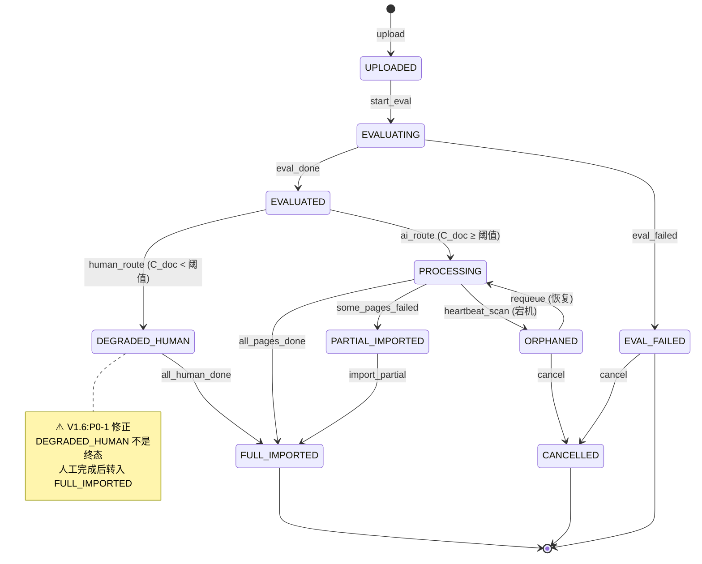
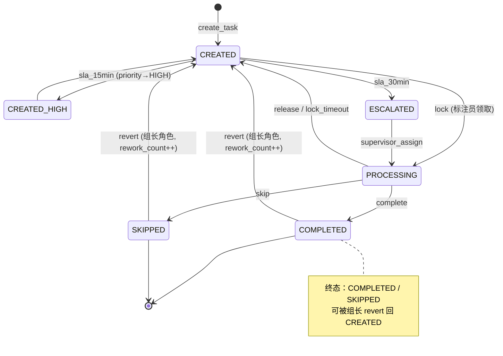
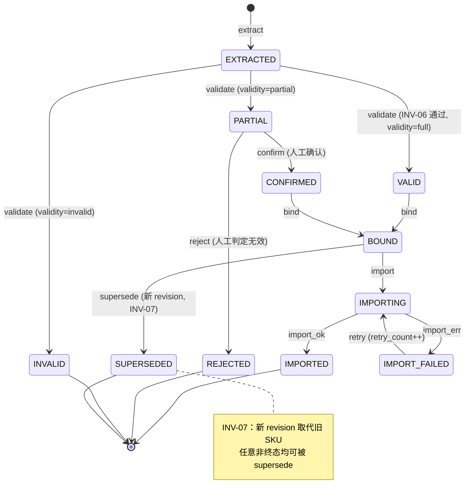
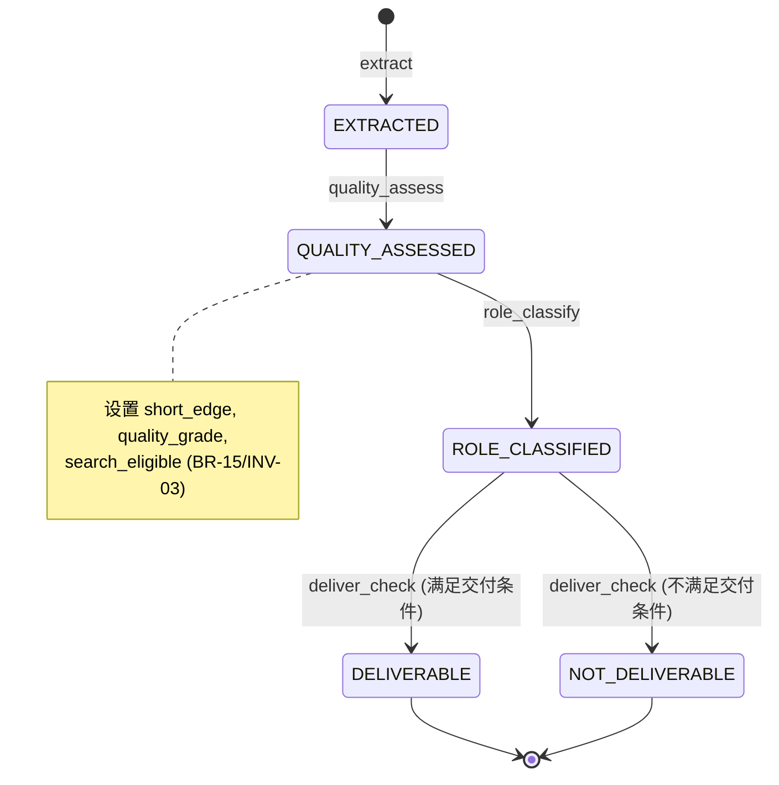
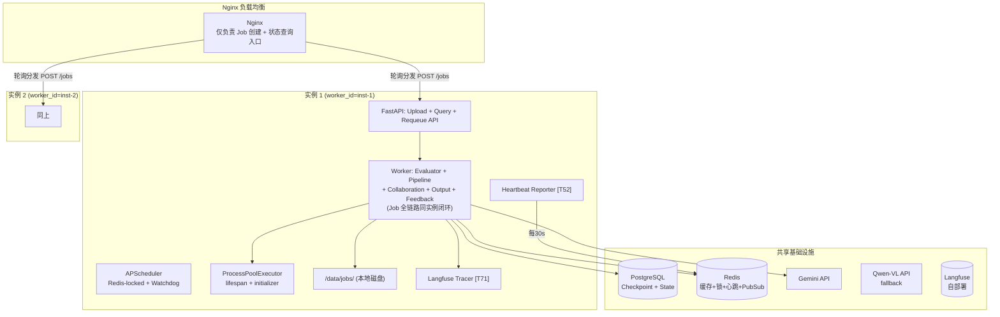
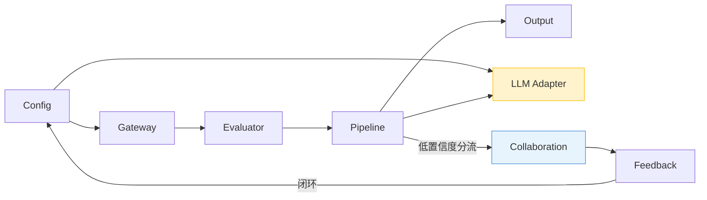

# PDF 自动分类与 SKU 提取系统 — 技术架构文档

> **文档版本**: V1.6  
> **基线输入**: BRD V2.1 + 业务架构 V1.1  
> **文档目的**: 定义系统的技术架构、模块划分、数据存储、接口协议和部署方案，指导开发实施  
> **架构阶段**: V1（行业开拓期，预计 3-6 个月）  
> **自包含性**: V1.6 为完全独立可读文档，所有技术细节均已内联展开，无需查阅 V1.2 或更早版本。  
> **V1.5→V1.6 变更**: 综合 Cross Review + ChatGPT5.2 + Gemini3 + Kimi2.5 四份交叉审查反馈（34 项），修正 BRD/BA 一致性缺口。主要变更：  
> - **P0×8**：DEGRADED_HUMAN 终态修正；新增 images/sku_image_bindings/annotations/threshold_profiles/calibration_records 5 张表；新增 SKU/Image 状态机；不变式工程化；解析器许可证合规 Gate  
> - **P1×18**：页级评估数据复用；预筛配置化+可解释；Fallback SKU 强制校验；对账轮询强化；Route/Status 一致性；评估报告可解释性；图片去重显性化；StorageProvider→OSS 优先级提升等  
> - **P2×8**：BR/INV 编号交叉引用；ParsedPageIR 覆盖度；Shadow Mode；不变式自动审计等  
> **变更记录**: 见附录 A（V1.0→V1.3 修订）、附录 B（V1.3→V1.5 修订）、附录 C（V1.5→V1.6 修订）

---

## 1. 架构总览

### 1.1 架构约束（源自 BRD）

| 约束 | 内容 | 影响 |
|------|------|------|
| A1 | 分析程序与导入程序运行在同一进程空间 | V1 采用单体架构，模块内通信为函数调用 |
| A2 | 图片以本地文件系统路径交付 | 文件 I/O 无需网络传输，output_base_url = `file:///` |
| A3 | 水平扩展通过多实例 + 负载均衡 | 每个实例独立处理一份 PDF，实例间无状态共享 |
| **A2+A3 闭环** | **Job Affinity：Job 全链路在同一实例内完成** | LB 仅负责 Job 创建入口分发，处理链路不经过 LB。见 ADR-08 |
| 技术栈 | Python 生态为主（PDF 解析库、ML 库） | pdfplumber + PyMuPDF + PaddleOCR |
| 大模型 | V1 主力 Gemini 2.5 Pro，Qwen-VL Max 作为 fallback | 统一适配层屏蔽模型差异，含熔断器 |

**下游系统假设验证计划** `[T82:ChatGPT]`：

BRD I1-I5 假设一旦不满足会产生连锁影响，技术架构必须逐项验证并准备适配策略：

| 假设 | 验证方法 | 不满足时的适配策略 |
|------|---------|-------------------|
| I1: 下游接口幂等 | 对接联调时同一 sku_id 重复调用，验证无副作用 | 若不幂等：本系统增加已导入 sku_id 去重表，调用前查重 |
| I2: 下游接受 sku_id 格式 | 联调时验证 `{hash8}_p{page}_{seq}` 格式被接受 | 若不接受：增加 ID 映射层，生成下游兼容格式 |
| I3: 导入 API 可用且稳定 | 灰度期间监控 import_adapter 的 4xx/5xx 率 | 若不稳定：扩大重试窗口 + IMPORTED_ASSUMED 比例监控 |
| I4: 支持分批导入 | 验证单次调用 SKU 数限制，确认分批接口语义 | 若不支持：Output 模块改为按 Job 整批提交 |
| I5: 支持按 job_id 查询 | 对账轮询依赖此能力，联调时验证 | 若不支持：改用 sku_id 逐条查询，增加轮询并发 |

**设计原则（源自 BRD §1.4 决策优先级）** `[V1.6:P2-4]`：

> **路由准确率 > SKU 召回率 > 图片质量 > 人工成本 > 速度**
>
> 此优先级指导所有架构权衡：宁可多转人工（降低成本效率）也不错判路由（损害数据质量）；宁可保留低质量图片（quality_warning）也不丢失图片（降低召回）。对应 BA BR-24。

V1 采用**模块化单体（Modular Monolith）** 架构：

- 单进程部署，模块间通过函数调用 + 事件总线通信
- 模块边界按 DDD 限界上下文划分，每个模块有独立的数据访问层
- 数据库共享（单 PostgreSQL 实例），但每个模块仅访问自己的表
- 预留模块拆分接缝：模块间通过接口（Protocol/ABC）交互，不直接依赖实现。**见 §2.4 模块公开接口定义** `[T51]`
- **可靠性原则**：所有关键状态变更**先落库再发事件**（Outbox 模式），asyncio Event Bus 仅做进程内加速通知，DB 轮询作为兜底消费（**自适应退避策略**）`[T83:ChatGPT]`。见 ADR-09
- **CPU 隔离**：PDF 解析等 CPU 密集操作通过 `ProcessPoolExecutor` 隔离，绑定 FastAPI lifespan 管理生命周期，含**进程预热机制** `[T74:GLM-5]`。见 ADR-10
- **定时任务**：APScheduler 每任务执行前获取 Redis 分布式锁（含**看门狗续期**）`[T75:GLM-5]`，确保多实例不重复。见 ADR-12
- **异常处理**：三层异常体系（Business / Infrastructure / Retryable），见 §2.5 `[T56]`

```mermaid
graph TB
    subgraph APP["PDF Processing Application"]
        direction TB
        subgraph BIZ["业务模块层"]
            direction LR
            GW["Gateway<br/>Module"]
            EV["Evaluator<br/>Module"]
            PL["Pipeline<br/>Module"]
            CO["Collaboration<br/>Module"]
            AU["Auth<br/>Module"]
        end

        EB["Internal Event Bus (asyncio, 加速通知)<br/>⚠ 非持久化：关键状态以 DB 为准，事件丢失可重放<br/>兜底轮询：自适应退避 &#91;T83&#93;"]

        subgraph SVC["服务模块层"]
            direction LR
            OU["Output<br/>Module"]
            FB["Feedback<br/>Module"]
            CF["Config<br/>Module"]
            LA["LLM<br/>Adapter"]
        end

        subgraph INFRA["Shared Infrastructure"]
            direction LR
            PG["PostgreSQL"]
            RD["Redis"]
            FS["Local FS"]
            PP["ProcessPool"]
            LG["Logging"]
            MT["Metrics"]
            SC["Scheduler<br/>(Watchdog-locked)"]
            LF["Langfuse<br/>(LLM Trace) &#91;T71&#93;"]
        end

        GW & EV & PL & CO --- EB
        EB --- OU & FB & CF & LA
    end

    style APP fill:#f9f9f9,stroke:#333
    style BIZ fill:#e8f4fd,stroke:#4a90d9
    style EB fill:#fff3cd,stroke:#ffc107
    style SVC fill:#e8f8e8,stroke:#28a745
    style INFRA fill:#f0f0f0,stroke:#6c757d
```



### 1.3 技术栈选型

| 层次 | 技术选型 | 选型理由 |
|------|---------|---------|
| **语言** | Python 3.11+ | PDF 解析生态最成熟 |
| **Web 框架** | FastAPI | 异步支持、自动 OpenAPI 文档、类型提示原生支持 |
| **ORM** | SQLAlchemy 2.0 | 成熟稳定，支持异步 |
| **认证** | python-jose (JWT) + pbkdf2_hmac | JWT Bearer Token + RBAC 三角色（uploader/annotator/admin） |
| **数据库** | PostgreSQL 15+ | JSONB、成熟并发控制、LISTEN/NOTIFY |
| **缓存/锁** | Redis | 评估缓存 + 进度上报 + 分布式锁(含看门狗) + 配置广播(PubSub) |
| **PDF 解析** | pdfplumber（主）+ PyMuPDF/fitz（辅）+ PaddleOCR（OCR 兜底） | pdfplumber 擅长表格；PyMuPDF 擅长图片；PaddleOCR 中文 SOTA `[T26]` |
| **大模型** | Gemini 2.5 Pro（主力）+ Qwen-VL Max（fallback） | 含熔断器防雪崩 `[T42]`；Prompt 遵循模型无关性原则 `[T60]` |
| **LLM 可观测** | Langfuse（自部署） | Prompt/Response 全链路追踪 + 成本归因 `[T71:Kimi3]` |
| **CPU 隔离** | ProcessPoolExecutor (lifespan + initializer 预热) | 绑定生命周期 + PaddleOCR 模型预加载 `[T37+T74]` |
| **定时任务** | APScheduler + Redis 分布式锁(看门狗) | 多实例仅一个执行，长任务自动续期 `[T38+T75]` |
| **前端** | React + Ant Design | 团队熟悉度 |
| **监控** | Prometheus + Grafana | 行业标准 |
| **日志** | structlog → stdout → ELK/Loki | 结构化日志，request_id 贯穿 |

---

## 2. 模块划分（限界上下文）

### 2.1 上下文映射图


### 2.2 模块职责矩阵

| 模块 | 核心职责 | 拥有的实体 | V1.3 关键变更 |
|------|---------|-----------|--------------|
| **Gateway** | 文件接收、安全检查、预筛、Job 创建（含 worker_id）、**心跳上报、孤儿任务重提** | PDFJob | T52 心跳+重提 |
| **Evaluator** | 采样、评估、路由、缓存 | Evaluation | — |
| **Pipeline** | 解析(PaddleOCR)、分类、两阶段SKU(含fallback)、绑定(歧义topK)、校验(规则可配置) | Page, SKU, **Image, SKUImageBinding** `[V1.6]` | T72,T74,T78,T84 |
| **Collaboration** | 任务管理(**智能派单**)、状态+审计、锁+心跳、**回退/撤销、SLA自动升级** | HumanTask, **Annotation** `[V1.6]` | T73,T76,T79 |
| **Output** | JSON 生成、图片导出、增量导入、对账 | — | T78 quality_warning |
| **Feedback** | 标注采集、校准、属性升级 | **CalibrationRecord** `[V1.6:P1-2]` | — |
| **Config** | 阈值/关键词/正则(**品类schema**)、**版本回溯**、PubSub广播 | **ThresholdProfile** `[V1.6:P1-1]` | T55,T81 |
| **LLM Adapter** | 模型适配+熔断、Prompt(版本化+A/B+Few-shot+Anchoring)、防注入、**json_repair解析、Langfuse追踪** | — | T45↑,T71 |
| **Auth** | JWT 签发/验证、密码哈希（pbkdf2_hmac）、RBAC 三角色权限（UploaderUser/AnnotatorUser/AdminUser） | User | V1.2 新增 |

### 2.3 模块间通信协议

| 通信类型 | 实现方式 | 使用场景 | 可靠性保障 |
|---------|---------|---------|-----------|
| **同步调用** | 函数调用（Protocol 接口 §2.4） | Pipeline 内部流水线 | 异常上抛（三层体系 §2.5） |
| **状态驱动** | DB 状态变更 + Event Bus 通知 | Job/Page 状态流转 | **先落库（Outbox），事件仅加速** |
| **DB 轮询兜底** | **自适应退避**扫描待处理记录 `[T83:ChatGPT]` | Event Bus 消息丢失时兜底 | 幂等消费 |
| **配置广播** | Redis PubSub `[T39]` | 配置热更新 | 订阅失败兜底轮询 |

**自适应退避轮询** `[T83:ChatGPT → D3:DeepSeek 简化]`：

> **并发安全**：移除 Redis 分布式锁前置，**所有实例同时执行 poll**，利用 `UPDATE ... FOR UPDATE SKIP LOCKED` 天然实现负载均衡。实例越多，分发能力线性提升。
> **死信保护**：超过 `MAX_RETRIES` 的页面标记为 `DEAD_LETTER`，不再轮询 `[D2:DeepSeek]`。

```python
# 替代固定 30s 轮询，按状态分档退避
POLL_INTERVALS = {
    # 关键状态：短轮询（用户等待中）
    'AI_COMPLETED': 5,       # 5s —— 即将导入，用户等待结果
    'IMPORT_FAILED': 10,     # 10s —— 需要快速重试
    # 常规状态：中等轮询
    'AI_PROCESSING': 30,     # 30s —— 正在处理，无需频繁检查
    'PENDING': 30,
    # 长耗时状态：指数退避（按记录停留时长选择间隔）
    'HUMAN_QUEUED': (30, 60, 120, 300),   # 30s → 60s → 120s → 5min
    'HUMAN_PROCESSING': (60, 120, 300),
}

MAX_PAGE_RETRIES = 5  # [D2] 超过此次数进入死信

async def adaptive_poll():
    """
    自适应退避轮询器。
    [D3:DeepSeek] 无需 Redis 锁——所有实例同时执行，DB SKIP LOCKED 天然负载均衡。
    通过 APScheduler 每 5s 触发（无需分布式锁）。
    """
    my_worker_id = get_current_worker_id()
    
    for status, interval in POLL_INTERVALS.items():
        min_interval = interval[0] if isinstance(interval, tuple) else interval
        
        # DB 乐观 Claim：SKIP LOCKED 确保多实例不冲突
        claimed = await db.fetch(text("""
            UPDATE pages SET worker_id = :wid, claimed_at = now()
            WHERE page_id IN (
                SELECT page_id FROM pages
                WHERE status = :status
                  AND worker_id IS NULL
                  AND retry_count < :max_retries
                  AND updated_at < now() - make_interval(secs => :interval)
                ORDER BY updated_at ASC
                LIMIT 20
                FOR UPDATE SKIP LOCKED
            )
            RETURNING *
        """), {"wid": my_worker_id, "status": status,
               "interval": min_interval, "max_retries": MAX_PAGE_RETRIES})
        
        for page in claimed:
            await dispatch_work(page)
    
    # [D2] 死信标记：超过重试次数的页面不再轮询
    await db.execute(text("""
        UPDATE pages SET status = 'DEAD_LETTER'
        WHERE retry_count >= :max_retries
          AND status NOT IN ('IMPORTED_CONFIRMED','IMPORTED_ASSUMED','SKIPPED','DEAD_LETTER')
    """), {"max_retries": MAX_PAGE_RETRIES})
```

**状态转换审计日志 + Outbox**：

```python
# Outbox 模式示例：状态变更先落库
async def transition_page_status(page_id: str, new_status: str, trigger: str = None, **kwargs):
    """所有状态变更通过此方法，确保先落库再通知"""
    old_status = await db.fetch_val(select(pages.c.status).where(pages.c.id == page_id))
    
    # 1. 先落库（持久化）
    await db.execute(
        update(pages).where(pages.c.id == page_id)
        .values(status=new_status, updated_at=datetime.utcnow(), **kwargs)
    )
    
    # 2. 审计日志 [T46:DeepSeek]
    await db.execute(insert(state_transitions).values(
        entity_type='page', entity_id=page_id,
        from_status=old_status, to_status=new_status,
        trigger=trigger, timestamp=datetime.utcnow(),
    ))
    
    # 3. 再发事件（加速通知，丢失可接受）
    try:
        await event_bus.publish(PageStatusChanged(page_id=page_id, status=new_status))
    except Exception:
        logger.warning("Event publish failed, DB poller will pick up", page_id=page_id)

# 兜底轮询器（定时任务，每 30s 执行）
async def poll_pending_work():
    """扫描 DB 中待处理的记录，补偿事件丢失"""
    stale_pages = await db.fetch(
        select(pages).where(
            pages.c.status == 'AI_COMPLETED',
            pages.c.updated_at < datetime.utcnow() - timedelta(seconds=60)
        )
    )
    for page in stale_pages:
        await output_module.trigger_import(page)
```

### 2.4 模块公开接口定义（Protocol 契约）`[T51]`

每个模块仅通过 Protocol 接口暴露能力，调用方不直接依赖实现类。

```python
from typing import Protocol, runtime_checkable

# === Gateway 模块出站接口 ===
@runtime_checkable
class JobCreator(Protocol):
    async def create_job(self, file_path: str, merchant_id: str, category: str | None) -> PDFJob: ...
    async def requeue_job(self, job_id: str, new_worker_id: str) -> PDFJob: ...

# === Evaluator 模块出站接口 ===
@runtime_checkable
class DocumentEvaluator(Protocol):
    async def evaluate(self, job: PDFJob, prescan: PrescanResult) -> Evaluation: ...

# === Pipeline 模块出站接口 ===
@runtime_checkable
class PageProcessor(Protocol):
    async def process_page(self, job: PDFJob, page_no: int, attempt_no: int) -> PageResult: ...

# === Collaboration 模块出站接口 ===
@runtime_checkable
class TaskManager(Protocol):
    async def create_task(self, job_id: str, page_number: int, task_type: str, context: dict) -> HumanTask: ...
    async def complete_task(self, task_id: str, result: dict, operator: str) -> HumanTask: ...
    async def revert_task(self, task_id: str, operator: str, reason: str) -> HumanTask: ...

# === Output 模块出站接口 ===
@runtime_checkable
class SKUImporter(Protocol):
    async def import_sku(self, sku: SKU, job: PDFJob) -> ImportResult: ...
    async def import_page_incremental(self, job: PDFJob, page_result: PageResult) -> list[ImportResult]: ...

# === Config 模块出站接口 ===
@runtime_checkable
class ConfigProvider(Protocol):
    def get_profile(self, version: str) -> ThresholdProfile: ...
    def get_active_profile(self, category: str | None) -> ThresholdProfile: ...
    def get_category_schema(self, category: str) -> CategorySchema: ...

# === LLM Adapter 出站接口 ===
# 按实际调用场景拆分为细粒度方法（与 §3.3/§3.2 实际调用对齐）
@runtime_checkable
class LLMService(Protocol):
    # 文档评估（Evaluator 模块调用）
    async def evaluate_document(self, screenshots: list[bytes], features: list[str],
                                prompt: str) -> list[Score]: ...
    # 页面分类（Pipeline.classifiers 调用）
    async def classify_page(self, screenshot: bytes, anchored_text: str,
                            features: str, prompt: str) -> ClassifyResult: ...
    # 文本角色分类（Pipeline.classifiers 调用）
    async def classify_text(self, text_blocks: list[TextBlock], screenshot: bytes,
                            profile: ThresholdProfile) -> list[str]: ...
    # 图片角色分类（Pipeline.classifiers 调用）
    async def classify_images(self, images: list[ProcessedImage], screenshot: bytes,
                              profile: ThresholdProfile) -> list[str]: ...
    # 版面类型分类（Pipeline.classifiers 调用）
    async def classify_layout(self, screenshot: bytes, features: str,
                              profile: ThresholdProfile) -> LayoutResult: ...
    # SKU 属性提取（Pipeline.sku 调用）
    async def extract_sku_attrs(self, context: str, prompt: str) -> SKUAttrResult: ...

# === Feedback 模块出站接口 ===
@runtime_checkable
class FeedbackCollector(Protocol):
    async def submit_annotation(self, annotation: Annotation) -> None: ...
    async def check_calibration_trigger(self) -> bool: ...

# === 解析器适配层（V1.5 接缝预留）`[C1:ChatGPT5.2]` ===
@runtime_checkable
class ParserAdapter(Protocol):
    """解析器统一接口：V1 包装为 LegacyParserAdapter，V2 可插入 Docling/MinerU"""
    async def parse_page(self, file_path: str, page_no: int) -> 'ParsedPageIR': ...
    def get_backend_name(self) -> str: ...  # "legacy" | "docling" | "mineru"

# === 存储抽象层（V1.5 接缝预留）`[D4:DeepSeek]` ===
@runtime_checkable
class StorageProvider(Protocol):
    """V1 实现 LocalStorageProvider，V1.5 替换为 OSSStorageProvider"""

# === Auth 模块出站接口 ===
# FastAPI Depends 依赖注入，不走 Protocol 而是通过 HTTPBearer + JWT 校验
# UploaderUser: 上传员角色（Gateway create_job 等）
# AnnotatorUser: 标注员角色（Collaboration task 操作等）
# AdminUser: 管理员角色（用户管理、配置管理等）
# 实现: auth/security.py (JWT create/verify, pbkdf2_hmac)
#        auth/dependencies.py (get_current_user, require_role)
#        auth/router.py (9 endpoints: login, register, me, users CRUD)
    async def read_file(self, relative_path: str) -> bytes: ...
    async def write_file(self, relative_path: str, data: bytes) -> None: ...
    def get_url(self, relative_path: str) -> str: ...  # V1: file:///  V1.5: oss://
    async def delete_file(self, relative_path: str) -> None: ...
    async def exists(self, relative_path: str) -> bool: ...
```

**模块依赖矩阵**：

| 调用方 ↓ \ 被调方 → | Gateway | Evaluator | Pipeline | Collab | Output | Config | LLM | Feedback | Parser | Storage |
|---------------------|---------|-----------|----------|--------|--------|--------|-----|----------|--------|---------|
| **Gateway** | — | ✅ | — | — | — | ✅ | — | — | — | ✅ |
| **Evaluator** | — | — | — | — | — | ✅ | ✅ | — | ✅ | — |
| **Pipeline** | — | — | — | ✅ | ✅ | ✅ | ✅ | — | ✅ | ✅ |
| **Collaboration** | — | — | ✅(retry) | — | ✅ | — | — | — | — | — |
| **Output** | — | — | — | — | — | ✅ | — | ✅ | — | ✅ |
| **Feedback** | — | — | — | — | — | ✅ | — | — | — | — |

**核心 DTO**：

```python
from pydantic import BaseModel

class PageResult(BaseModel):
    status: str             # COMPLETED | SKIPPED | NEEDS_REVIEW | FAILED
    page_type: str
    needs_review: bool
    skus: list['SKUResult']
    images: list['ImageResult']
    bindings: list['BindingResult']
    export_results: list['ExportResult']
    validation: 'ValidationResult'

class SKUResult(BaseModel):
    sku_id: str
    attributes: dict
    validity: str           # full | partial | invalid
    source_bbox: list[float]
    confidence: float

class BindingResult(BaseModel):
    sku_id: str
    image_id: str | None    # None 表示歧义未绑定 [T84]
    binding_confidence: float
    candidates: list['BindingCandidate'] | None  # 歧义时携带 topK [T84]

class BindingCandidate(BaseModel):
    image_id: str
    confidence: float
    reason: str             # "bbox_nearest" | "semantic_match" | "same_column"

# === 解析器中间表示（IR）`[C1:ChatGPT5.2]` ===
class ParsedPageIR(BaseModel):
    """统一中间表示：解耦解析器与Pipeline，为V2多后端并存做准备"""
    parser_backend: str         # "legacy" | "docling" | "mineru"
    page_no: int
    text_blocks: list['TextBlock']
    tables: list['TableBlock']
    images: list['ImageBlock']
    reading_order: list[int]    # block 索引的阅读顺序
    raw_text: str               # 全页文本（拼接后）
    metadata: 'PageMetadata'

class TextBlock(BaseModel):
    content: str
    bbox: list[float]           # [x0, y0, x1, y1] normalized
    confidence: float           # 解析置信度
    block_type: str             # "paragraph" | "heading" | "list_item" | "caption"

class TableBlock(BaseModel):
    cells: list[list[str]]      # 二维表格内容
    bbox: list[float]
    row_count: int
    col_count: int
    confidence: float
    is_cross_page: bool = False
    header_rows: list[list[str]] | None = None  # [V1.6:P2-5] 跨页表格继承表头（BR-17）

class ImageBlock(BaseModel):
    image_data: bytes | None    # None 时通过 storage_path 延迟加载
    storage_path: str | None
    bbox: list[float]
    width: int
    height: int
    caption: str | None = None
    is_fragmented: bool = False  # [V1.6:P2-5] 碎图标记（BR-16）

class PageMetadata(BaseModel):
    page_width: float
    page_height: float
    ocr_confidence: float | None = None  # [V1.6:P2-5] 整页 OCR 置信度
```

### 2.5 异常处理规范 `[T56]`

```python
# === 三层异常体系 ===

class PDFProcessingError(Exception):
    """所有业务异常的基类"""
    def __init__(self, message: str, error_code: str, context: dict = None):
        self.error_code = error_code
        self.context = context or {}
        super().__init__(message)

# --- 第一层：业务异常（不重试，直接返回/降级） ---
class BusinessError(PDFProcessingError):
    """业务规则违反（如 PDF 超过页数限制、安全检查不通过）"""
    pass

class PDFRejectedError(BusinessError): ...          # 安全/格式不通过
class SKUValidityError(BusinessError): ...           # SKU 校验失败
class ConfigNotFoundError(BusinessError): ...        # 配置版本不存在

# --- 第二层：基础设施异常（可重试） ---
class InfrastructureError(PDFProcessingError):
    """外部依赖失败（DB/Redis/LLM API）"""
    pass

class LLMUnavailableError(InfrastructureError): ... # LLM API 不可用
class LLMCircuitOpenError(InfrastructureError): ... # 熔断器打开
class DatabaseError(InfrastructureError): ...        # DB 连接/查询失败
class StorageError(InfrastructureError): ...         # 文件系统读写失败

# --- 第三层：可重试异常（明确重试策略） ---
class RetryableError(PDFProcessingError):
    """明确需要重试的异常"""
    def __init__(self, message, error_code, max_retries: int = 3, **kwargs):
        self.max_retries = max_retries
        super().__init__(message, error_code, **kwargs)

class LLMParseError(RetryableError): ...             # LLM 响应解析失败（换 Prompt 重试）
class ImportConflictError(RetryableError): ...       # 导入冲突（乐观锁重试）

# === 异常处理策略表 ===
# 每个异常明确：谁 catch、怎么处理、重试几次、降级到哪里
EXCEPTION_STRATEGY = {
    # 异常类                    捕获位置                  处理方式             重试次数   降级目标
    'PDFRejectedError':       ('Gateway.validator',      '拒绝上传，返回400',    0,       None),
    'SKUValidityError':       ('Pipeline.validator',     '标记 invalid',        0,       '人工审核'),
    'ConfigNotFoundError':    ('Config.get_profile',     '返回400',             0,       None),
    'LLMUnavailableError':    ('LLMAdapter.client',      'fallback模型',        0,       'DEGRADED_HUMAN'),
    'LLMCircuitOpenError':    ('LLMAdapter.client',      '直接降级',            0,       'DEGRADED_HUMAN'),
    'DatabaseError':          ('各模块DB操作',            '记录日志+告警',        3,       '阻塞等待恢复'),
    'StorageError':           ('Pipeline/Output',        '记录日志+告警',        2,       'ORPHANED'),
    'LLMParseError':          ('LLMAdapter.parser',      '换Prompt模板重试',     3,       '人工审核'),
    'ImportConflictError':    ('Output.import_adapter',  '乐观锁CAS重试',       5,       '记录冲突+人工'),
}

# === 全局异常处理器 ===
@app.exception_handler(PDFProcessingError)
async def handle_pdf_error(request: Request, exc: PDFProcessingError):
    status_map = {
        BusinessError: 400,
        InfrastructureError: 503,
        RetryableError: 409,
    }
    status = next(
        (code for cls, code in status_map.items() if isinstance(exc, cls)), 500
    )
    return JSONResponse(status_code=status, content={
        "error_code": exc.error_code,
        "message": str(exc),
        "context": exc.context,
    })
```

### 2.6 状态机完整定义 `[#7 修复]`

#### Job 状态机



**Job 状态转换完整表**：

| From | To | Trigger | Guard | Side Effect |
|------|----|---------|-------|-------------|
| — | UPLOADED | upload | 安全检查通过 | 创建 Job + 冻结配置 |
| UPLOADED | EVALUATING | start_eval | — | 启动采样评估 |
| EVALUATING | EVALUATED | eval_done | — | 记录路由决策 |
| EVALUATING | EVAL_FAILED | eval_failed | 评估异常 | 记录错误原因 |
| EVALUATED | PROCESSING | ai_route | C_doc ≥ 阈值 | 启动逐页处理 |
| EVALUATED | DEGRADED_HUMAN | human_route | C_doc < 阈值 | 创建全文人工任务 |
| DEGRADED_HUMAN | FULL_IMPORTED | all_human_done | 所有非 BLANK/SKIPPED 页面达到 IMPORTED_* `[V1.6:P0-1]` | 标记 completion_source='human_all' |
| PROCESSING | FULL_IMPORTED | all_pages_done | 所有页面成功 | 触发对账 |
| PROCESSING | PARTIAL_IMPORTED | some_pages_failed | 部分页面失败 | 失败页转人工 |
| PROCESSING | ORPHANED | heartbeat_scan | Worker 心跳超时 | 标记孤儿 |
| PARTIAL_IMPORTED | FULL_IMPORTED | import_partial | 人工补齐后全部成功 | — |
| ORPHANED | PROCESSING | requeue | 运维手动重提 | 从 Checkpoint 恢复 |
| ORPHANED | CANCELLED | cancel | 运维放弃 | 清理文件 |
| EVAL_FAILED | CANCELLED | cancel | — | — |
| 任意非终态 | CANCELLED | cancel | 用户/运维取消 | 清理资源 |

**终态**：FULL_IMPORTED, CANCELLED, EVAL_FAILED

> ⚠️ `[V1.6:P0-1]` **DEGRADED_HUMAN 不是终态**（V1.5 修正）。降级为全人工的 Job 在所有人工页面完成后应转入 FULL_IMPORTED，对齐 BA §5.1 附录 A.1。

#### HumanTask 状态机



**HumanTask 状态转换完整表**：

| From | To | Trigger | Guard | Side Effect |
|------|----|---------|-------|-------------|
| — | CREATED | create_task | Pipeline 低置信度 | 智能派单尝试分配 |
| CREATED | CREATED(HIGH) | sla_15min | 未分配超 15min | priority → HIGH |
| CREATED | ESCALATED | sla_30min | 未分配超 30min | 通知主管 |
| ESCALATED | PROCESSING | supervisor_assign | 主管手动分配 | — |
| CREATED | PROCESSING | lock | 标注员领取 | 设置 locked_by + locked_at |
| PROCESSING | COMPLETED | complete | 提交结果 | 记录 annotation + 触发 Output |
| PROCESSING | SKIPPED | skip | 标记不可处理 | 记录原因 |
| PROCESSING | CREATED | release | 主动释放 / 锁超时 | 清空 locked_by |
| COMPLETED | CREATED | revert | 组长角色 + 提供 reason | 清空结果 + rework_count++ |
| SKIPPED | CREATED | revert | 组长角色 + 提供 reason | 清空结果 + rework_count++ |

**终态**：COMPLETED, SKIPPED（可被组长 revert 回 CREATED）

#### Page 状态补充 `[V1.5]`

Page 状态较多（见 §4.2 pages 表注释），V1.5 新增：

| 新状态 | 触发条件 | 说明 |
|--------|---------|------|
| `DEAD_LETTER` | `retry_count ≥ MAX_RETRIES(5)` | 超过重试次数，不再轮询，需人工介入 `[D2:DeepSeek]` |

运维可通过 `POST /ops/pages/{page_id}/retry` 重置 retry_count 并恢复状态。

#### SKU 状态机 `[V1.6:P0-5]`

对齐 BA §5.3 SKU 生命周期。V1.5 skus 表有 `status` 字段但无转换定义，V1.6 补齐：



**SKU 状态转换完整表**：

| From | To | Trigger | Guard | Side Effect |
|------|----|---------|-------|-------------|
| — | EXTRACTED | extract | Pipeline SKU 提取完成 | — |
| EXTRACTED | VALID | validate | INV-06 校验通过（validity=full） | — |
| EXTRACTED | PARTIAL | validate | validity=partial | 创建 HumanTask(SKU_CONFIRM) |
| EXTRACTED | INVALID | validate | validity=invalid | 终态 |
| PARTIAL | CONFIRMED | confirm | 人工确认通过 | 更新 attributes |
| PARTIAL | REJECTED | reject | 人工判定无效 | 终态 |
| VALID/CONFIRMED | BOUND | bind | 绑定完成 | 写入 sku_image_bindings |
| BOUND | IMPORTING | import | 调用导入接口 | — |
| IMPORTING | IMPORTED | import_ok | 导入成功 | 终态 |
| IMPORTING | IMPORT_FAILED | import_err | 导入失败 | 可重试 |
| IMPORT_FAILED | IMPORTING | retry | 重试 | retry_count++ |
| 任意非终态 | SUPERSEDED | supersede | 新 revision 取代（INV-07 保证） | 终态 |

#### Image 状态机 `[V1.6:P0-6]`

对齐 BA §5.5 Image 生命周期。V1.5 无 images 表（V1.6 新增，见 §4.2），状态机定义如下：



**Image 状态转换完整表**：

| From | To | Trigger | Guard | Side Effect |
|------|----|---------|-------|-------------|
| — | EXTRACTED | extract | Pipeline 图片提取完成 | 写入 images 表 |
| EXTRACTED | QUALITY_ASSESSED | quality_assess | 分辨率/短边/碎图评估完成 | 设置 short_edge, quality_grade, search_eligible (BR-15/INV-03) |
| QUALITY_ASSESSED | ROLE_CLASSIFIED | role_classify | 角色分类完成 | 设置 role |
| ROLE_CLASSIFIED | DELIVERABLE | deliver_check | 满足交付条件 | — |
| ROLE_CLASSIFIED | NOT_DELIVERABLE | deliver_check | 不满足交付条件 | — |

---

## 3. 核心模块技术设计

### 3.1 Gateway 模块

（文件目录结构新增 heartbeat.py）

```
gateway/
├── api.py              # FastAPI 路由
├── validator.py        # 文件校验
├── pdf_security.py     # PDF 结构安全检查
├── prescanner.py       # 规则预筛
├── job_factory.py      # PDFJob 创建 + 配置冻结 + worker_id
├── heartbeat.py        # Worker 心跳上报 [T52]
└── schemas.py
```

**Worker 心跳 + 孤儿任务扫描** `[T52:Kimi3+ChatGPT]`：

```python
class WorkerHeartbeat:
    """Worker 定期上报心跳，运维可检测宕机实例"""
    HEARTBEAT_KEY = "worker:heartbeat:{worker_id}"
    HEARTBEAT_INTERVAL = 30  # 秒
    HEARTBEAT_TTL = 90       # 3 倍间隔
    
    async def report(self, worker_id: str):
        """定时上报心跳（在 lifespan 中启动后台任务）"""
        await redis.setex(self.HEARTBEAT_KEY.format(worker_id=worker_id),
                          self.HEARTBEAT_TTL, datetime.utcnow().isoformat())
    
    async def scan_orphan_jobs(self):
        """定时任务：扫描无心跳 Worker 的未完成 Job"""
        active_workers = set()
        async for key in redis.scan_iter("worker:heartbeat:*"):
            active_workers.add(key.split(":")[-1])
        
        orphan_jobs = await db.fetch(
            select(pdf_jobs).where(
                pdf_jobs.c.status.in_(['EVALUATING', 'PROCESSING']),
                ~pdf_jobs.c.worker_id.in_(active_workers) if active_workers else True,
            )
        )
        for job in orphan_jobs:
            logger.warning("orphan_job_detected", job_id=job.job_id, worker_id=job.worker_id)
            await transition_job_status(job.job_id, 'ORPHANED', trigger='heartbeat_scan')
            
            # [D6:DeepSeek] 自动重提（带冷却期+次数限制）
            requeue_count = await redis.incr(f"orphan:requeue_count:{job.job_id}")
            await redis.expire(f"orphan:requeue_count:{job.job_id}", 86400)  # 24h 窗口
            
            if requeue_count <= 3:
                # 冷却 5 分钟后自动重提
                asyncio.get_event_loop().call_later(
                    300,  # 5min
                    lambda jid=job.job_id: asyncio.create_task(
                        self._auto_requeue(jid)
                    )
                )
                logger.info("orphan_auto_requeue_scheduled", job_id=job.job_id,
                           attempt=requeue_count, delay_sec=300)
            else:
                # 24h 内超过 3 次：放弃，标记 CANCELLED
                await transition_job_status(job.job_id, 'CANCELLED',
                    trigger='orphan_max_retries')
                logger.error("orphan_max_retries_exceeded", job_id=job.job_id)
    
    async def _auto_requeue(self, job_id: str):
        """自动重提到任意存活实例"""
        job = await repo.get_job(job_id)
        if job.status != 'ORPHANED':
            return  # 已被手动处理
        alive_workers = await self._get_alive_workers()
        if alive_workers:
            await requeue_job(job_id, random.choice(alive_workers))

# Requeue API: 运维一键重提孤儿任务
async def requeue_job(job_id: str, new_worker_id: str) -> PDFJob:
    """将孤儿 Job 迁移到新实例（重新从 Checkpoint 恢复或从头开始）"""
    job = await repo.get_job(job_id)
    if job.status != 'ORPHANED':
        raise BusinessError("Job not in ORPHANED status", "JOB_NOT_ORPHANED")
    
    # 尝试从 Checkpoint 恢复
    checkpoint = await checkpoint_mgr.get_latest(job_id)
    if checkpoint:
        resume_from = checkpoint['last_completed_page'] + 1
        logger.info("resuming_from_checkpoint", job_id=job_id, page=resume_from)
    else:
        resume_from = 1
    
    await db.execute(update(pdf_jobs).where(pdf_jobs.c.job_id == job_id).values(
        worker_id=new_worker_id, status='PROCESSING',
    ))
    await event_bus.publish(JobRequeued(job_id=job_id, resume_from=resume_from))
    return await repo.get_job(job_id)
```

**Checkpoint 机制** `[T52:Kimi3]`：

> **持久化策略**：Checkpoint 同时写 DB（`pdf_jobs.checkpoint_page`）和 Redis（加速读取）。恢复时 DB 优先、Redis 次之，避免"实例宕机 + Redis 宕机 = 从头重跑"。

```python
class CheckpointManager:
    """每处理 N 页保存状态，支持故障恢复。DB 为持久层，Redis 为加速层。"""
    CHECKPOINT_INTERVAL = 10  # 每 10 页保存一次
    
    async def maybe_save(self, job_id: str, page_no: int, completed_skus: int):
        if page_no % self.CHECKPOINT_INTERVAL == 0:
            # 持久层：写 DB（保证不丢）
            await db.execute(
                update(pdf_jobs).where(pdf_jobs.c.job_id == job_id).values(
                    checkpoint_page=page_no,
                    checkpoint_skus=completed_skus,
                    checkpoint_at=datetime.utcnow(),
                )
            )
            # 加速层：写 Redis（快速读取）
            await redis.hset(f"checkpoint:{job_id}", mapping={
                'last_completed_page': page_no,
                'completed_skus': completed_skus,
                'timestamp': datetime.utcnow().isoformat(),
            })
            await redis.expire(f"checkpoint:{job_id}", 86400 * 7)
    
    async def get_latest(self, job_id: str) -> dict | None:
        """
        恢复时：强制从 DB 读取（可靠来源）[D1:DeepSeek]
        Redis 仅用于前端实时进度展示，不参与故障恢复。
        原因：Redis 异步复制滞后可能导致 checkpoint 比 DB 旧。
        """
        # 恢复场景：始终读 DB（低频操作，延迟可接受）
        job = await db.fetch_one(
            select(pdf_jobs.c.checkpoint_page, pdf_jobs.c.checkpoint_skus)
            .where(pdf_jobs.c.job_id == job_id)
        )
        if job and job.checkpoint_page and job.checkpoint_page > 0:
            return {
                'last_completed_page': job.checkpoint_page,
                'completed_skus': job.checkpoint_skus or 0,
            }
        return None
    
    async def get_progress(self, job_id: str) -> dict | None:
        """进度查询（前端用）：Redis 优先（快），DB 兜底"""
        data = await redis.hgetall(f"checkpoint:{job_id}")
        if data:
            return dict(data)
        return await self.get_latest(job_id)
```

**PDF 安全检查、关键流程**（V1.5 增强：）

> `[G4:Gemini3+DeepSeek]` 增加解析超时和资源限制，防止 PDF 炸弹（Zip Bomb / 递归嵌套）导致 OOM。

```python
class PDFSecurityChecker:
    """V1.5 增强：超时 + 资源限制 + 递归深度检测"""
    MAX_PARSE_TIMEOUT = 30       # 秒：单页解析超时
    MAX_FILE_SIZE_MB = 200       # MB：上传文件大小限制
    MAX_PAGES = 2000             # 页数上限
    MAX_OBJECT_COUNT = 500_000   # PDF 对象数上限（防递归炸弹）
    
    async def check(self, file_path: str) -> SecurityResult:
        # 1. 文件大小检查
        if os.path.getsize(file_path) > self.MAX_FILE_SIZE_MB * 1024 * 1024:
            raise PDFRejectedError("File too large", "FILE_SIZE_EXCEEDED")
        
        # 2. 进程隔离解析（超时保护）
        try:
            result = await asyncio.wait_for(
                asyncio.get_event_loop().run_in_executor(
                    process_pool, self._parse_metadata, file_path),
                timeout=self.MAX_PARSE_TIMEOUT)
        except asyncio.TimeoutError:
            raise PDFRejectedError("PDF parse timeout", "PARSE_TIMEOUT")
        
        # 3. 递归/嵌套深度检查
        if result.object_count > self.MAX_OBJECT_COUNT:
            raise PDFRejectedError("Suspected PDF bomb", "OBJECT_COUNT_EXCEEDED")
        if result.total_pages > self.MAX_PAGES:
            raise PDFRejectedError("Too many pages", "PAGE_COUNT_EXCEEDED")
        
        # 4. 恶意内容检查（JavaScript、外部链接等）
        doc = fitz.open(file_path)
        issues = []
        for page in doc:
            for annot in page.annots() or []:
                if annot.type[0] == fitz.PDF_ANNOT_WIDGET:
                    if "/JS" in str(annot.info):
                        issues.append("javascript_embedded")
        if doc.is_encrypted:
            issues.append("encrypted_pdf")
        doc.close()
        if issues:
            result.security_issues = issues
            result.safe = False
        return result
```

**关键流程（Job 创建）**：

```python
import socket

async def create_job(file: UploadFile, category: str | None, merchant_id: str) -> PDFJob:
    # 1. 文件校验 + 安全检查
    file_hash = compute_sha256(file)
    security = await pdf_security.check(file.path)
    if not security.safe:
        return PDFJob(status=REJECTED, degrade_reason=f"security:{security.issues}")
    
    total_pages = count_pages(file)
    if total_pages > 2000:
        return PDFJob(status=REJECTED, degrade_reason="PAGE_COUNT_EXCEEDED")
    
    # 2. 冻结配置
    profile = config_module.get_active_profile(category)
    frozen_config_version = profile.version
    
    # 3. 创建 Job（含 worker_id 标识实例）[T44:DeepSeek]
    job = PDFJob(
        job_id=uuid4(),
        file_hash=file_hash,
        total_pages=total_pages,
        frozen_config_version=frozen_config_version,
        output_base_url=f"file:///data/jobs/{job.job_id}/",
        worker_id=socket.gethostname(),  # 实例标识，便于故障定位
        status=UPLOADED,
    )
    
    # 4. 规则预筛
    prescan_result = prescanner.scan(file, profile.prescan_rules)
    if prescan_result.all_blank:
        job.status = DEGRADED_HUMAN
        job.degrade_reason = "prescan_reject"
    
    # 5. 先落库，再发事件（Outbox 模式）
    await repo.save(job)
    await event_bus.publish(JobCreated(job_id=job.job_id, prescan=prescan_result))
    return job
```

### 3.2 Evaluator 模块

```
evaluator/
├── sampler.py          # 采样策略（全量 / 抽样）
├── scorer.py           # 多维度评分 + 加权计算
├── router.py           # 路由决策（A/B/PV 阈值比较）
├── cache.py            # 双层缓存（DB 优先 + Redis 加速 + 分布式锁防穿透）
├── variance_detector.py # 采样得分方差检测
├── prescan_config.py   # [V1.6:P1-6] 预筛规则配置化（热更新）
└── eval_report.py      # [V1.6:P1-11] 评估报告可解释性结构化输出
```

**预筛规则配置化** `[V1.6:P1-6]`：

> 预筛规则从硬编码改为 Config 模块的 `PrescanRuleConfig` 管理，支持热更新。预筛输出标准化为结构化 payload，出现在评估报告 / processing_trace 中（对齐 BRD P1 可解释评估报告诉求、BA §2.2 预筛流程）。

```python
class PrescanRuleConfig(BaseModel):
    """预筛规则配置：运营可通过 Config API 热更新，无需修改代码 [V1.6:P1-6]"""
    all_blank_reject: bool = True                     # BR-25: all_blank → 直接降级
    ocr_rate_penalty_threshold: float = 0.1           # OCR 提取率低于此值触发扣分
    ocr_rate_penalty_weight: float = 0.15             # OCR 低分扣减权重
    no_images_penalty_weight: float = 0.10            # 无图片扣减权重（仅扣分不拒绝，BA 修订）
    min_text_chars_for_blank: int = 10                # BR-02: 空白页判定阈值

class PrescanResult(BaseModel):
    """预筛输出标准化 [V1.6:P1-6] —— 对齐 BA degrade_reason 语义"""
    all_blank: bool
    blank_pages: list[int]
    penalties: list[dict]         # [{"rule": "ocr_rate_low", "weight": 0.15, "reason": "OCR提取率=0.05<0.1"}]
    total_penalty: float          # ΣWi × penalty
    raw_metrics: dict             # {"ocr_rate": 0.05, "image_count": 0, "text_char_count": 42}
```

**评估数据复用（HYBRID 模式）** `[V1.6:P1-5]`：

> BRD 明确 HYBRID 下页级评估应**复用文档级阶段已提取的文本/图片/特征**，避免重复调用 LLM（对齐 BA §2.2 "页级评估可利用文档级评估阶段已获取的解析数据"）。

```python
async def evaluate_hybrid_pages(job: PDFJob, evaluation: Evaluation) -> dict[int, float]:
    """HYBRID 模式页级评估：优先复用文档级采样数据，仅对未采样页调用 LLM [V1.6:P1-5]"""
    # 文档级采样页的得分已存入 evaluations.page_evaluations JSONB
    sampled_scores = evaluation.page_evaluations or {}  # {page_no: score}
    
    page_results = {}
    profile = config_module.get_profile(job.frozen_config_version)
    
    for page_no in range(1, job.total_pages + 1):
        if page_no in evaluation.prescan.blank_pages:
            continue
        if str(page_no) in sampled_scores:
            # 复用文档级已评估的采样页得分（零 LLM 成本）
            page_results[page_no] = sampled_scores[str(page_no)]
        else:
            # 未采样页：调用低成本模型评估 [V1.6:P1-7]
            score = await llm_adapter.evaluate_page_lightweight(
                job.file_path, page_no, profile,
                model_override='QWEN_STANDARD'  # 页级评估用低成本模型
            )
            page_results[page_no] = score
    
    return page_results
```

**HYBRID 页级评估成本控制** `[V1.6:P1-7]`：
> HYBRID 比例高时（如 50% PDF 处于此区间），逐页 Gemini Pro 评估可能突破 ¥22/份预算（BRD §12）。策略：(1) 复用文档级数据减少调用数；(2) 未采样页使用 Qwen 标准模型（成本约 Gemini 40%），页级评估对准确率要求低于文档级。

**评估报告可解释性** `[V1.6:P1-11]`：

```python
class EvaluationReport(BaseModel):
    """评估报告：供产品/运营通过 GET /api/v1/jobs/{job_id}/evaluation 查看 [V1.6:P1-11]"""
    job_id: str
    # 预筛命中项
    prescan_penalties: list[dict]     # [{"rule": "ocr_rate_low", "weight": 0.15, "reason": "..."}]
    # 各维度得分
    dimension_scores: dict            # {"layout_quality": 0.85, "text_readability": 0.72, ...}
    weights_snapshot: dict            # {"layout_quality": 0.25, "text_readability": 0.20, ...}
    # 路由决策理由
    c_doc: float
    thresholds: dict                  # {"A": 0.90, "B": 0.40, "PV": 0.70}
    route: str                        # "AUTO" | "HYBRID" | "HUMAN_ALL"
    route_reason: str                 # "C_doc=0.72, A=0.90, B=0.40 → HYBRID"
    degrade_reason: str | None
    # 采样信息
    sampling: dict                    # {"pages": [1,5,10,...], "variance": 0.03}
    model_used: str
```

**评分流水线（含缓存一致性保障）**：

```python
async def evaluate(job: PDFJob, prescan: PrescanResult) -> Evaluation:
    profile = config_module.get_profile(job.frozen_config_version)
    cache_key = f"{job.file_hash}:{job.frozen_config_version}"
    
    # === 1. 双层缓存查询：Redis 快查 → DB 持久层 ===
    cached = await redis.get(cache_key)
    if cached:
        return deserialize(cached)
    db_result = await db.fetch_one(
        select(evaluations).where(
            evaluations.c.file_hash == job.file_hash,
            evaluations.c.config_version == job.frozen_config_version))
    if db_result:
        await redis.setex(cache_key, 86400, serialize(db_result))
        return db_result
    
    # === 2. 缓存未命中：分布式锁防并发评估 ===
    async with redis_lock(f"lock:eval:{cache_key}", timeout=300):
        cached = await redis.get(cache_key)
        if cached:
            return deserialize(cached)
        
        # === 3. 采样 + 截图（CPU 密集用进程池） ===
        sample_pages = sampler.select_pages(
            total=job.total_pages, blank_pages=prescan.blank_pages, threshold=40)
        loop = asyncio.get_event_loop()
        screenshots = await loop.run_in_executor(
            process_pool, render_pages_batch, job.file_path, sample_pages)
        features = [extract_quick_features(job.file_path, p) for p in sample_pages]
        
        # === 4. 大模型评估 ===
        llm_scores = await llm_adapter.evaluate_document(
            screenshots=screenshots, features=features,
            prompt=prompt_engine.get_eval_prompt(profile))
        
        # === 5. 置信度 + 方差 + 路由 ===
        dimension_scores = scorer.aggregate(llm_scores)
        c_doc = sum(profile.weights[dim] * dimension_scores[dim] for dim in DIMENSIONS) - prescan.penalty
        c_doc = max(0.0, min(1.0, c_doc))
        
        page_scores = [s.overall for s in llm_scores]
        variance = statistics.variance(page_scores) if len(page_scores) > 1 else 0.0
        variance_forced = variance > profile.prescan_rules.score_variance_threshold
        
        route, degrade_reason = router.decide(
            c_doc=c_doc, thresholds=profile.thresholds, variance_forced=variance_forced)
        
        # === 6. 先写 DB，再写 Redis（Outbox 模式） ===
        evaluation = Evaluation(
            file_hash=job.file_hash, config_version=job.frozen_config_version,
            doc_confidence=c_doc, route=route, degrade_reason=degrade_reason,
            dimension_scores=dimension_scores, weights_snapshot=profile.weights,
            sampling=SamplingInfo(pages=sample_pages, variance=variance),
            prescan=prescan, model_used=llm_adapter.current_model_name,
            prompt_version=prompt_engine.get_version("eval_document"),
        )
        await db.insert(evaluation)
        await redis.setex(cache_key, 86400, serialize(evaluation))
        return evaluation
```

### 3.3 Pipeline 模块

```
pipeline/
├── orchestrator.py         # 单页处理编排（ProcessPoolExecutor 调度）
├── extractors/
│   ├── pdf_extractor.py    # 文本/图片/表格提取（多库 + PaddleOCR）[T26]
│   ├── feature_extractor.py # 结构化特征向量
│   └── image_processor.py  # 碎图检测 + 光栅化 + 质量评估 + 去重
├── classifiers/
│   ├── page_classifier.py  # 页面类型分类（A/B/C/D）
│   ├── text_classifier.py  # 文本角色分类
│   ├── image_classifier.py # 图片角色分类
│   └── layout_classifier.py # 版面类型分类
├── sku/
│   ├── sku_list_extractor.py   # 阶段1: SKU 边界识别 [T27]
│   ├── sku_attr_extractor.py   # 阶段2: SKU 属性提取 [T27]
│   ├── sku_single_stage.py     # 单阶段 Fallback [T72:Kimi3]
│   ├── sku_id_gen.py           # SKU ID 生成（坐标归一化 + 双键排序）
│   ├── sku_exporter.py         # SKU validity 模式导出
│   └── sku_image_binder.py     # SKU-图片绑定（版面分档 + 歧义 topK）[T84]
├── validators/
│   └── consistency_validator.py # 结构一致性校验（规则可配置）[T28+T55]
└── table/
    ├── table_parser.py     # 表格解析
    └── cross_page_merger.py # 跨页表格检测 + 拼接
```

**进程池生命周期 + 预热** `[T37:DeepSeek + T74:GLM-5]`：

```python
from contextlib import asynccontextmanager
from concurrent.futures import ProcessPoolExecutor

process_pool: ProcessPoolExecutor = None

def _init_worker():
    """进程池 worker 初始化器：预加载 PaddleOCR 模型，消除冷启动延迟"""
    global _paddle_ocr
    from paddleocr import PaddleOCR
    _paddle_ocr = PaddleOCR(use_angle_cls=True, lang='ch', show_log=False)

@asynccontextmanager
async def lifespan(app: FastAPI):
    global process_pool
    process_pool = ProcessPoolExecutor(
        max_workers=2,
        max_tasks_per_child=50,
        initializer=_init_worker,  # [T74] 预热：子进程启动时即加载模型
    )
    # 启动后台任务
    asyncio.create_task(config_broadcaster.subscribe_loop())
    asyncio.create_task(heartbeat.report_loop())
    yield
    process_pool.shutdown(wait=True, cancel_futures=False)

app = FastAPI(lifespan=lifespan)
```

**单页处理编排**（标注 V1.6 差异点）：

**大 PDF 分片预处理（Chunking）** `[G1:Gemini3]`：

> 1000 页 PDF 按 20s/页串行处理需 5.5 小时，严重影响 SLA。分片后 Chunk 间可 Pipeline 并行，每 Chunk 完成即触发增量导入。

```python
CHUNK_SIZE = 50  # 页/Chunk
MAX_PARALLEL_CHUNKS = 3  # 同实例最多并行 Chunk 数（受内存限制）

class ChunkingStrategy:
    """大 PDF 分片：>100 页自动分片，Chunk 间 Pipeline 并行"""
    
    def should_chunk(self, total_pages: int) -> bool:
        return total_pages > CHUNK_SIZE * 2  # >100 页才分片
    
    def create_chunks(self, total_pages: int, blank_pages: list[int]) -> list['PageChunk']:
        effective_pages = [p for p in range(1, total_pages + 1) if p not in blank_pages]
        chunks = []
        for i in range(0, len(effective_pages), CHUNK_SIZE):
            chunk_pages = effective_pages[i:i + CHUNK_SIZE]
            chunks.append(PageChunk(
                chunk_id=i // CHUNK_SIZE,
                pages=chunk_pages,
                # 跨页表格检测：Chunk 边界页需要与下一 Chunk 首页对比
                boundary_overlap=1 if i + CHUNK_SIZE < len(effective_pages) else 0,
            ))
        return chunks

async def process_job_chunked(job: PDFJob, evaluation: Evaluation):
    """分片并行处理：Chunk 内串行，Chunk 间并行，每 Chunk 完成即增量导入"""
    strategy = ChunkingStrategy()
    
    if not strategy.should_chunk(job.total_pages):
        # 小 PDF：沿用原有串行逻辑
        await process_job_sequential(job, evaluation)
        return
    
    chunks = strategy.create_chunks(job.total_pages, evaluation.prescan.blank_pages)
    semaphore = asyncio.Semaphore(MAX_PARALLEL_CHUNKS)
    
    async def process_chunk(chunk: PageChunk):
        async with semaphore:
            for page_no in chunk.pages:
                result = await process_page(job, page_no, attempt_no=1)
                # 每页完成即触发增量导入 [T35]
                await incremental_importer.on_page_completed(job, result)
                await checkpoint_mgr.maybe_save(job.job_id, page_no, ...)
    
    await asyncio.gather(*[process_chunk(c) for c in chunks])
```

```python
async def process_page(job: PDFJob, page_no: int, attempt_no: int) -> PageResult:
    profile = config_module.get_profile(job.frozen_config_version)
    loop = asyncio.get_event_loop()
    
    # === Phase 1: 解析（CPU 密集，进程池隔离） ===
    raw = await loop.run_in_executor(process_pool, pdf_extractor.extract, job.file_path, page_no)
    
    # === Phase 2: 图片预处理 ===
    processed_images = []
    for img in raw.images:
        if image_processor.is_fragmented(img):
            img = await loop.run_in_executor(
                process_pool, image_processor.rasterize_region, job.file_path, page_no, img.bbox
            )
            img.is_fragmented = True
        img.quality = image_processor.assess_quality(img)
        processed_images.append(img)
    
    # === Phase 3: 特征提取 ===
    features = feature_extractor.extract(raw)
    
    # === Phase 4: 跨页表格检测（含边界回溯） ===
    table_continuation = await cross_page_merger.find_continuation(
        job_id=job.job_id, current_page=page_no, raw=raw
    )
    if table_continuation:
        raw.tables = cross_page_merger.merge(table_continuation.source_tables, raw.tables)
    
    # === Phase 5: 页面分类（Document-Anchoring Prompt）[T33:Kimi] ===
    screenshot = await loop.run_in_executor(process_pool, render_page, job.file_path, page_no)
    anchored_context = anchor_builder.build(raw.text_blocks, features)
    cls_result = await llm_adapter.classify_page(
        screenshot=screenshot,
        anchored_text=anchored_context,
        features=features.to_prompt_context(),
        prompt=prompt_engine.get_prompt("classify_page", profile=profile)
    )
    page_type = cls_result.page_type
    needs_review = cls_result.confidence < profile.classification_thresholds.page_type_min_confidence
    
    # Phase 6: 两阶段 SKU 提取 + 单阶段 Fallback [T72:Kimi3]
    if page_type == PageType.D and not needs_review:
        return PageResult(status=SKIPPED, page_type=PageType.D)
    
    skus = []
    if page_type == PageType.A:
        skus = await table_parser.parse_and_extract(raw.tables, profile)
    else:
        text_roles = await llm_adapter.classify_text(raw.text_blocks, screenshot, profile)
        image_roles = await llm_adapter.classify_images(processed_images, screenshot, profile)
        layout = await llm_adapter.classify_layout(screenshot, features, profile)
        
        # 两阶段提取，失败率过高或结果为空时自动回退单阶段
        try:
            sku_boundaries = await sku_list_extractor.identify_boundaries(
                raw.text_blocks, text_roles, screenshot, profile)
            skus = await sku_attr_extractor.extract_batch(sku_boundaries, raw, profile)
            
            # [T72] 失败率检查：结果为空或无效 SKU > 30% 时回退
            if not skus:
                logger.warning("two_stage_empty_result_fallback", page=page_no)
                skus = await sku_single_stage.extract(raw, text_roles, profile)
            else:
                invalid_ratio = sum(1 for s in skus if s.validity == 'invalid') / len(skus)
                if invalid_ratio > 0.3:
                    logger.warning("two_stage_fallback", page=page_no, invalid_ratio=invalid_ratio)
                    skus = await sku_single_stage.extract(raw, text_roles, profile)
        except Exception:
            logger.warning("two_stage_failed_fallback", page=page_no)
            skus = await sku_single_stage.extract(raw, text_roles, profile)
        
        # [V1.6:P1-8] Fallback SKU 强制校验：无论两阶段还是单阶段，所有 SKU 必须经过
        # ConsistencyValidator + INV-06 校验后才可标记 validity=full（对齐 BA INV-06）
        skus = consistency_validator.enforce_sku_validity(skus, profile)  # BR-11 / INV-06
        
        # SKU ID + 绑定
        page_height = raw.metadata.page_height
        skus = sku_id_gen.assign_ids(skus, job.file_hash[:8], page_no, page_height)
        
        # [T84:ChatGPT] 绑定歧义输出 topK
        deliverable_images = [img for img, role in zip(processed_images, image_roles) if role in DELIVERABLE_ROLES]
        bindings = sku_image_binder.bind(skus, deliverable_images, layout, profile)
        
        # [V1.6:P0-3] 绑定结果持久化到 sku_image_bindings 表
        await persist_bindings(bindings, job.job_id, page_no)
    
    # Phase 7: 图片去重（按角色区分）[V1.6:P1-12]
    # BR-28: LOGO/DECORATION 全局哈希去重；PRODUCT_MAIN 等可交付角色仅同页去重
    dedup_report = image_dedup.dedup_by_role(processed_images, image_roles, job.job_id)
    # Phase 8: 一致性校验（规则可配置）
    validation = consistency_validator.validate(page_type, skus, processed_images, profile)
    
    # Phase 9: Checkpoint + 导出
    await checkpoint_mgr.maybe_save(job.job_id, page_no, len(skus))
    export_results = await sku_exporter.export(skus, job, profile)
    
    return PageResult(
        page_type=page_type, needs_review=needs_review or validation.has_errors,
        skus=skus, images=processed_images, bindings=bindings,
        export_results=export_results, validation=validation,
    )
```

**绑定歧义输出（宁可不绑也别错绑）** `[T84:ChatGPT]`：

```python
class SKUImageBinder:
    """绑定策略：歧义时不落最终绑定，携带 topK 候选交人工"""
    
    DISTANCE_THRESHOLDS = {
        LayoutType.L1: 200, LayoutType.L2: 100, LayoutType.L3: 150, LayoutType.L4: 80,
    }
    AMBIGUITY_GAP = 0.2  # top1 和 top2 的 confidence 差值 < 0.2 视为歧义
    
    def bind(self, skus, images, layout, profile) -> list[BindingResult]:
        threshold = self.DISTANCE_THRESHOLDS.get(layout.layout_type, 150)
        results = []
        
        for sku in skus:
            candidates = []
            for img in images:
                distance = self._bbox_distance(sku.source_bbox, img.bbox)
                if distance <= threshold:
                    confidence = 1.0 - (distance / threshold)
                    candidates.append(BindingCandidate(
                        image_id=img.image_id, confidence=confidence,
                        reason=self._determine_reason(sku, img, layout)
                    ))
            
            candidates.sort(key=lambda c: c.confidence, reverse=True)
            
            if not candidates:
                results.append(BindingResult(sku_id=sku.sku_id, image_id=None,
                    binding_confidence=0.0, candidates=None))
            elif len(candidates) == 1 or (candidates[0].confidence - candidates[1].confidence) >= self.AMBIGUITY_GAP:
                # 明确绑定
                results.append(BindingResult(sku_id=sku.sku_id, image_id=candidates[0].image_id,
                    binding_confidence=candidates[0].confidence, candidates=None))
            else:
                # 歧义：不落最终绑定，携带 topK 交人工
                results.append(BindingResult(sku_id=sku.sku_id, image_id=None,
                    binding_confidence=candidates[0].confidence,
                    candidates=candidates[:3]))  # topK=3
        
        return results
```

**图片质量容差模式** `[T78:GLM-5]`：

```python
class ImageProcessor:
    def assess_quality(self, img: Image) -> ImageQuality:
        quality = ImageQuality(
            short_edge=min(img.width, img.height),
            dpi_estimated=...,
            is_blurry=...,
        )
        # [T78] 容差模式：不阻断，仅标记警告
        if quality.short_edge < 640:
            quality.quality_warning = "low_resolution"  # 下游可选择是否采用
        return quality

class ImageDedup:
    """图片去重（按角色区分）[V1.6:P1-12] —— 对齐 BA §4.5 / BR-28"""
    
    def dedup_by_role(self, images: list, roles: list[str], job_id: str) -> dict:
        dedup_report = {"kept": [], "removed": [], "decisions": []}
        seen_global = {}    # LOGO/DECORATION 全局哈希去重
        seen_page = {}      # 可交付角色仅同页去重
        
        for img, role in zip(images, roles):
            img_hash = img.image_hash
            if role in ('LOGO', 'DECORATION'):
                # BR-28: LOGO/DECORATION 全局哈希去重
                if img_hash in seen_global:
                    img.is_duplicate = True
                    dedup_report["removed"].append(img.image_id)
                    dedup_report["decisions"].append({
                        "image_id": img.image_id, "role": role,
                        "action": "removed", "reason": "global_hash_dup"
                    })
                else:
                    seen_global[img_hash] = img.image_id
                    dedup_report["kept"].append(img.image_id)
            else:
                # 可交付角色（PRODUCT_MAIN/DETAIL/SCENE/SIZE_CHART）：仅同页完全相同 hash 去重
                page_key = f"{img.page_number}:{img_hash}"
                if page_key in seen_page:
                    img.is_duplicate = True
                    dedup_report["removed"].append(img.image_id)
                else:
                    seen_page[page_key] = img.image_id
                    dedup_report["kept"].append(img.image_id)
        
        return dedup_report
```

**一致性校验（规则可配置化）** `[T55:ChatGPT]`：

```python
class ConsistencyValidator:
    """校验规则从 profile 加载，支持热更新"""
    
    def validate(self, page_type, skus, images, profile) -> ValidationResult:
        # 从品类 schema 获取该品类的校验规则
        category_schema = config_module.get_category_schema(profile.category)
        rules = category_schema.validation_rules if category_schema else self.DEFAULT_RULES
        
        ctx = ValidationContext(page_type=page_type, skus=skus, images=images)
        errors = [rule.name for rule in rules if rule.check(ctx)]
        multiplier = 0.7 if errors else 1.0
        return ValidationResult(has_errors=bool(errors), errors=errors, confidence_multiplier=multiplier)
    
    def enforce_sku_validity(self, skus: list, profile) -> list:
        """[V1.6:P0-7/P1-8] SKU 有效性强制校验（INV-06）
        
        无论两阶段还是单阶段 Fallback，所有 SKU 必须通过此校验。
        对齐 BA §4.4: (model OR product_name) AND (size OR material OR color OR price)
        """
        for sku in skus:
            has_identity = bool(sku.attributes.get('model') or sku.attributes.get('product_name'))
            has_spec = any(sku.attributes.get(f) for f in ('size', 'material', 'color', 'price'))
            
            if has_identity and has_spec:
                sku.validity = 'full'      # INV-06 满足
            elif has_identity or has_spec:
                sku.validity = 'partial'
            else:
                sku.validity = 'invalid'
            
            # INV-12: 所有属性 key 始终存在，缺失为 null（BR-14）
            for key in profile.get_required_keys():
                if key not in sku.attributes:
                    sku.attributes[key] = None
        
        return skus
```

**结构一致性校验层** `[T28:ChatGPT]`：

```python
class ConsistencyValidator:
    """在 process_page 末尾执行硬规则校验，拦截明显错误"""
    
    RULES = [
        ("sku_count_abnormal", lambda ctx: len(ctx.skus) > 50),
        ("sku_no_model_but_has_price", lambda ctx: any(
            not s.attributes.get("model") and s.attributes.get("price") for s in ctx.skus
        )),
        ("main_image_too_small", lambda ctx: sum(
            1 for img in ctx.images if img.role == "PRODUCT_MAIN" and img.quality.short_edge < 640
        ) / max(len([i for i in ctx.images if i.role == "PRODUCT_MAIN"]), 1) > 0.5),
        ("multi_currency_detected", lambda ctx: len(set(
            s.attributes.get("currency") for s in ctx.skus if s.attributes.get("currency")
        )) > 1),
        ("table_page_missing_fields", lambda ctx: (
            ctx.page_type == "A" and
            sum(1 for s in ctx.skus if s.validity == "invalid") / max(len(ctx.skus), 1) > 0.5
        )),
    ]
    
    def validate(self, page_type, skus, images, profile) -> ValidationResult:
        ctx = ValidationContext(page_type=page_type, skus=skus, images=images)
        errors = [name for name, check in self.RULES if check(ctx)]
        
        multiplier = 0.7 if errors else 1.0  # 命中规则则降低置信度
        return ValidationResult(
            has_errors=bool(errors), errors=errors, confidence_multiplier=multiplier
        )
```

**图片绑定（版面分档策略）** `[T29:ChatGPT+Kimi]`：

```python
class SKUImageBinder:
    """根据版面类型选择绑定策略"""
    
    # 不同版面的 bbox 距离阈值
    DISTANCE_THRESHOLDS = {
        LayoutType.L1: 200,   # 单列：较大容差
        LayoutType.L2: 100,   # 网格：严格对齐
        LayoutType.L3: 150,   # 双列：中等
        LayoutType.L4: 80,    # 密集：最严格
    }
    
    def bind(self, skus, images, layout, profile=None) -> list[SKUImageBinding]:
        threshold = self.DISTANCE_THRESHOLDS.get(layout.layout_type, 150)
        candidates = []
        
        for sku in skus:
            for img in images:
                distance = self._bbox_distance(sku.source_bbox, img.bbox)
                if distance <= threshold:
                    confidence = 1.0 - (distance / threshold)
                    candidates.append(BindingCandidate(sku=sku, image=img, confidence=confidence))
        
        # 冲突解决：同一图片绑定多 SKU 时取最高置信度
        return self._resolve_conflicts(candidates)
    
    def _resolve_conflicts(self, candidates):
        by_image = {}
        for c in candidates:
            key = c.image.image_id
            if key not in by_image or c.confidence > by_image[key].confidence:
                by_image[key] = c
        return [SKUImageBinding(sku_id=c.sku.sku_id, image_id=c.image.image_id,
                                binding_confidence=c.confidence) for c in by_image.values()]
```

**PDF 多库兜底策略（PaddleOCR 替代 Tesseract）** `[T26:Qwen3+GLM-5]`：

```python
class PDFExtractor:
    """多库兜底：pdfplumber → PyMuPDF → PaddleOCR（中文 SOTA）"""
    
    def __init__(self):
        from paddleocr import PaddleOCR
        self._paddle = PaddleOCR(use_angle_cls=True, lang='ch', show_log=False)
    
    def extract(self, file_path: str, page_no: int) -> RawPageData:
        # 1. pdfplumber 优先（擅长表格、文本坐标）
        try:
            result = self._extract_pdfplumber(file_path, page_no)
            if result.text_coverage > 0.1:
                return result
        except Exception:
            pass
        
        # 2. PyMuPDF 兜底（擅长图片、渲染）
        try:
            result = self._extract_pymupdf(file_path, page_no)
            if result.text_coverage > 0.1:
                return result
        except Exception:
            pass
        
        # 3. PaddleOCR 最终兜底（中文扫描件 SOTA）
        screenshot = self._render_page_pymupdf(file_path, page_no, dpi=300)
        result = self._extract_paddleocr(screenshot)
        return result
    
    def _extract_paddleocr(self, screenshot: bytes) -> RawPageData:
        """PaddleOCR: 中文识别准确率 95%+，含版面分析"""
        ocr_result = self._paddle.ocr(screenshot, cls=True)
        text_blocks = [
            TextBlock(text=line[1][0], bbox=line[0], confidence=line[1][1])
            for line in ocr_result[0]
        ]
        return RawPageData(text_blocks=text_blocks, images=[], tables=[], text_coverage=...)
```

**跨页表格边界回溯**（回溯上限可配置，默认 10 页）：

```python
class CrossPageMerger:
    MAX_LOOKBACK = 10  # 可配置，默认 10 页

    async def find_continuation(self, job_id, current_page, raw):
        if current_page <= 1 or not raw.tables:
            return None
        for lookback in range(1, min(self.MAX_LOOKBACK + 1, current_page)):
            prev_no = current_page - lookback
            prev_page = await repo.get_page(job_id, prev_no)
            if prev_page is None:
                continue
            if prev_page.status in ('BLANK', 'SKIPPED'):
                continue
            if self.is_continuation(prev_page, raw):
                source_tables = prev_page.tables
                if prev_page.table_continuation_from:
                    ancestor = await repo.get_page(job_id, prev_page.table_continuation_from)
                    if ancestor:
                        source_tables = ancestor.tables
                return TableContinuation(source_page=prev_no, source_tables=source_tables)
            break
        return None
```

### 3.4 LLM Adapter 模块（防腐层）

```
llm_adapter/
├── client.py           # LLM Client + Fallback + 熔断器 [T42]
├── prompt_engine.py    # Prompt（版本化+A/B+Few-shot+Anchoring）
├── anchor_builder.py   # Document-Anchoring [T33]
├── response_parser.py  # json_repair 优先 + 正则兜底 [T45↑:GLM-5]
├── input_guard.py      # 防注入
├── retry.py            # 指数退避重试
├── langfuse_tracer.py  # Langfuse 全链路追踪 [T71:Kimi3]
└── prompts/
```

**Langfuse 集成** `[T71:Kimi3 + GLM-5]`：

**LLM 动态路由策略** `[Q1:Qwen3]`：

> 当前设计仅在熔断时切换模型。动态路由按页面复杂度分级调用，在不降低质量的前提下节省 30-40% Token 成本。

```python
class LLMRouter:
    """基于页面特征的动态模型路由（替代固定"主力+fallback"策略）"""
    
    # 路由策略表（按 page_type × complexity 分级）
    ROUTING_TABLE = {
        # A类表格页：规则引擎直接解析，不调 LLM
        ('A', 'any'):     'RULE_ENGINE',
        # D类空白/目录页：跳过
        ('D', 'any'):     'SKIP',
        # B/C类简单页（文本清晰、结构规整）：Qwen 标准模型（成本低）
        ('B', 'simple'):  'QWEN_STANDARD',
        ('C', 'simple'):  'QWEN_STANDARD',
        # B/C类复杂页（碎图多、混排、OCR）：Gemini Pro（质量高）
        ('B', 'complex'): 'GEMINI_PRO',
        ('C', 'complex'): 'GEMINI_PRO',
    }
    
    MODEL_CONFIGS = {
        'GEMINI_PRO':     LLMConfig(model='gemini-2.5-pro', max_tokens=8192, temperature=0.2),
        'QWEN_STANDARD':  LLMConfig(model='qwen-vl-max', max_tokens=4096, temperature=0.1),
        'RULE_ENGINE':    None,  # 不调用 LLM
        'SKIP':           None,
    }
    
    def select_model(self, page_type: str, features: dict, budget_ok: bool) -> str:
        """选择模型：页面特征 → 路由表 → 预算检查 → 最终模型"""
        complexity = self._assess_complexity(features)
        route_key = (page_type, complexity)
        route = self.ROUTING_TABLE.get(route_key,
                self.ROUTING_TABLE.get((page_type, 'any'), 'GEMINI_PRO'))
        
        # 预算超限时强制降级
        if not budget_ok and route == 'GEMINI_PRO':
            route = 'QWEN_STANDARD'
        
        return route
    
    def _assess_complexity(self, features: dict) -> str:
        """页面复杂度评估：基于特征向量"""
        score = 0
        if features.get('has_fragmented_images', False): score += 2
        if features.get('ocr_ratio', 0) > 0.3: score += 2
        if features.get('multi_column', False): score += 1
        if features.get('text_block_count', 0) > 20: score += 1
        return 'complex' if score >= 3 else 'simple'
```

```python
from langfuse import Langfuse
from langfuse.decorators import observe

langfuse = Langfuse()  # 从环境变量读取配置

class LLMClient:
    """V1.3: 所有 LLM 调用自动上报 Langfuse"""
    
    @observe(name="llm_call")
    async def call(self, prompt: str, images: list[bytes] = None, **kwargs) -> LLMResponse:
        # [D5b] Langfuse metadata 强制携带商户+品类信息
        metadata = {
            'merchant_id': kwargs.get('merchant_id'),
            'category': kwargs.get('category'),
            'job_id': kwargs.get('job_id'),
        }
        
        # [Q1] 动态路由选择模型
        model = self.router.select_model(
            kwargs.get('page_type', 'C'), kwargs.get('features', {}),
            budget_ok=self.budget_guard.check(kwargs.get('merchant_id')))
        if model in ('RULE_ENGINE', 'SKIP'):
            return LLMResponse(skipped=True, route=model)
        
        # [D5] 全局 QPM 限流
        actual_model = await self.rate_limiter.wait_or_degrade(
            self.MODEL_CONFIGS[model].model, kwargs)
        
        sanitized = self.guard.build_safe_request(prompt, images)
        
        # [G2:Gemini3] Structured Outputs：强制 JSON 格式输出
        generation_config = {"response_mime_type": "application/json"}
        
        # Langfuse 自动记录：prompt、response、latency、token、cost
        
        # 熔断器检查
        if self._circuit_state == self.OPEN:
            if datetime.utcnow() - self._circuit_open_since > self._circuit_recovery_timeout:
                self._circuit_state = self.HALF_OPEN
                logger.info("Circuit half-open, attempting recovery")
            else:
                raise LLMCircuitOpenError("All models unavailable, circuit breaker open")
        
        # Primary → Fallback 降级
        if self._consecutive_failures >= 3 and self.fallback:
            result = await self._call_with_circuit(self.fallback, "fallback", sanitized, generation_config)
            return result
        
        try:
            result = await self._call_with_circuit(self.primary, actual_model, sanitized, generation_config)
            self._consecutive_failures = 0
            if self._circuit_state == self.HALF_OPEN:
                self._circuit_state = self.CLOSED
                self._circuit_failure_count = 0
                logger.info("Circuit breaker closed, recovered")
            return result
        except (TimeoutError, APIError):
            self._consecutive_failures += 1
            if self.fallback:
                try:
                    return await self._call_with_circuit(self.fallback, "fallback", sanitized, generation_config)
                except (TimeoutError, APIError):
                    self._trip_circuit()
                    raise
            self._trip_circuit()
            raise
    
    # 熔断器状态同步到 Redis（集群可视化）[GLM-5]
    def _update_circuit_state(self, new_state: str):
        self._circuit_state = new_state
        redis.set("llm:circuit_state", new_state)  # Grafana 可读
        metrics.llm_circuit_state.labels(model="primary").set(
            {"closed": 0, "half_open": 1, "open": 2}[new_state])
```

**全局 QPM 令牌桶限流** `[D5:DeepSeek]`：

> 当前 TokenBudgetGuard 是每日配额（粗粒度），缺少 QPM 级实时限流。多实例同时调 Gemini 可能触发供应商 429。

```python
class GlobalRateLimiter:
    """Redis 令牌桶：跨实例全局限流，匹配供应商 QPM 配额"""
    
    RATE_LIMITS = {
        'gemini-2.5-pro': {'qpm': 60, 'tpm': 2_000_000},
        'qwen-vl-max':    {'qpm': 100, 'tpm': 5_000_000},
    }
    
    async def acquire(self, model: str, estimated_tokens: int = 0) -> bool:
        """尝试获取令牌，失败则应降级或排队"""
        limits = self.RATE_LIMITS.get(model, {'qpm': 30, 'tpm': 1_000_000})
        key_qpm = f"rate:{model}:qpm"
        key_tpm = f"rate:{model}:tpm"
        
        # QPM 检查（滑动窗口 60s）
        current_qpm = await redis.incr(key_qpm)
        if current_qpm == 1:
            await redis.expire(key_qpm, 60)
        if current_qpm > limits['qpm']:
            metrics.llm_rate_limited_total.labels(model=model).inc()
            return False
        
        # TPM 检查（滑动窗口 60s）
        if estimated_tokens > 0:
            current_tpm = await redis.incrby(key_tpm, estimated_tokens)
            if current_tpm == estimated_tokens:
                await redis.expire(key_tpm, 60)
            if current_tpm > limits['tpm']:
                return False
        
        return True
    
    async def wait_or_degrade(self, model: str, context: dict) -> str:
        """限流时的降级策略：等待 or 降级模型 or 转人工"""
        if await self.acquire(model):
            return model
        # 降级到次级模型
        fallback = {'gemini-2.5-pro': 'qwen-vl-max'}.get(model)
        if fallback and await self.acquire(fallback):
            return fallback
        # 全部限流：短暂等待后重试
        await asyncio.sleep(2)
        if await self.acquire(model):
            return model
        raise LLMUnavailableError("All models rate limited", "RATE_LIMITED")
```

**响应解析（json_repair 优先）** `[T45↑:GLM-5]`：

```python
import json_repair  # pip install json-repair

class ResponseParser:
    def parse(self, raw_response: str, model: str) -> dict:
        # 1. 直接 JSON 解析
        try:
            return json.loads(raw_response)
        except json.JSONDecodeError:
            pass
        
        # 2. json_repair AST 修复（比正则更可靠）[GLM-5]
        try:
            repaired = json_repair.repair_json(raw_response, return_objects=True)
            if isinstance(repaired, dict):
                logger.info("json_repair_succeeded")
                return repaired
        except Exception:
            pass
        
        # 3. 去 markdown 标记
        cleaned = re.sub(r'```json\s*', '', raw_response)
        cleaned = re.sub(r'```\s*$', '', cleaned)
        try:
            return json.loads(cleaned)
        except json.JSONDecodeError:
            pass
        
        # 4. 正则提取关键字段（最终兜底）
        result = {}
        for field in ['page_type', 'confidence', 'validity']:
            match = re.search(rf'"{field}"\s*:\s*"?([^",\}}]+)"?', raw_response)
            if match:
                result[field] = match.group(1).strip()
        if result:
            logger.warning("regex_fallback_applied", fields=list(result.keys()))
            return result
        
        raise LLMParseError("Cannot parse LLM response", "LLM_PARSE_FAILED")
```

**Document-Anchoring 构建器** `[T33:Kimi]`：

```python
class DocumentAnchorBuilder:
    """将 PDF 文本层坐标与截图融合，降低大模型幻觉"""
    
    def build(self, text_blocks: list[TextBlock], features) -> str:
        """构建带坐标标记的锚定文本（送入 Prompt）"""
        sorted_blocks = sorted(text_blocks, key=lambda b: (b.bbox[1], b.bbox[0]))
        anchored = []
        for block in sorted_blocks[:50]:  # 最多 50 个文本块，控制 token
            anchored.append(
                f"<text y='{block.bbox[1]:.0f}' x='{block.bbox[0]:.0f}'>"
                f"{InputGuard.escape_xml(block.text)}</text>"
            )
        return "\n".join(anchored)
```

**Prompt Engine（版本化 + A/B 分桶 + Few-shot 自动加载）** `[T31:ChatGPT + T36:Kimi]`：

```python
class PromptEngine:
    """分层 Prompt 管理：基础模板 + 品类 A/B 分桶 + Few-shot 自动加载"""
    
    def __init__(self, prompts_dir: str = "/app/prompts"):
        self._current_version = "v1"
        self._env = jinja2.Environment(loader=jinja2.FileSystemLoader(prompts_dir))
    
    def get_prompt(self, template_name: str, profile: ThresholdProfile = None, **kwargs) -> str:
        # 1. 选择模板版本（支持 A/B 分桶）[T31]
        version = self._select_version(template_name, profile)
        path = f"{version}/{template_name}.j2"
        template = self._env.get_template(path)
        
        # 2. 加载 Few-shot 示例（从标注库）[T36]
        few_shot = self._load_few_shot(template_name, profile.category if profile else None)
        
        # 3. 渲染
        return template.render(few_shot_examples=few_shot, **kwargs)
    
    def _select_version(self, template_name: str, profile) -> str:
        """A/B 分桶：按 profile 随机或指定版本"""
        if profile and profile.prompt_experiment:
            return profile.prompt_experiment.get(template_name, self._current_version)
        return self._current_version
    
    def _load_few_shot(self, template_name: str, category: str = None, limit: int = 3) -> list:
        """从标注数据库加载已确认的高质量 few-shot 示例"""
        query = """
            SELECT input_context, output_json FROM annotation_examples
            WHERE task_type = %s AND is_confirmed = true
        """
        params = [template_name]
        if category:
            query += " AND category = %s"
            params.append(category)
        query += " ORDER BY quality_score DESC LIMIT %s"
        params.append(limit)
        return db.fetch_all(query, params)
    
    def get_version(self, template_name: str) -> str:
        return f"{self._current_version}/{template_name}"
```

**输入防注入** `[InputGuard]`：

```python
class InputGuard:
    """防 Prompt 注入：XML 标签隔离 + 图片 metadata source 标记 + 指令强化"""
    
    @staticmethod
    def escape_xml(text: str) -> str:
        """转义用户输入中的 XML 特殊字符，防止注入"""
        return (text
            .replace("&", "&amp;")
            .replace("<", "&lt;")
            .replace(">", "&gt;")
            .replace('"', "&quot;")
            .replace("'", "&apos;"))
    
    def build_safe_request(self, prompt: str, images: list[bytes] = None) -> dict:
        """构建安全请求：文本用 XML 标签隔离，图片标记 source=user_upload"""
        request = {"prompt": prompt}
        if images:
            request["images"] = [
                {"data": img, "metadata": {"source": "user_upload"}} for img in images
            ]
        return request
```

### 3.5 Collaboration 模块

```
collaboration/
├── task_manager.py     # 任务创建、智能派单 [T79]
├── state_machine.py    # 状态机 + 审计日志 + 回退 [T76]
├── lock_manager.py     # 锁 + 心跳 + 超时
├── timeout_scanner.py  # 超时扫描 + SLA 自动升级 [T73]
├── dispatch.py         # 标注员能力画像 + 派单算法 [T79:Qwen3]
├── api.py              # REST API + 多租户过滤
└── schemas.py
```

**锁权威来源** `[V1.6:P1-18]`：

> 锁操作**先写 DB**（`human_tasks.locked_by` + `locked_at`），Redis 仅作为加速查询层。实例重启时以 DB 状态为准。BA §5.4 HumanTask 状态机要求 `IN_PROGRESS ⇒ locked_by ≠ null`（INV-08），DB 是此不变式的唯一权威来源。

**HumanTask 上下文增强** `[V1.6:P1-4]`：

> BR-19 要求人工上下文 = 前后各 1 页 + **文档级全局属性**。V1.5 仅含前后页截图+文本，缺 doc_global_attributes。V1.6 补齐：

```python
async def create_task(self, job_id, page_number, task_type, context) -> HumanTask:
    # [V1.6:P1-4] 构建完整上下文（对齐 BR-19）
    doc_attrs = await self._extract_doc_global_attributes(job_id)
    enriched_context = {
        **context,
        "prev_page_screenshot": await self._get_screenshot(job_id, page_number - 1),
        "next_page_screenshot": await self._get_screenshot(job_id, page_number + 1),
        "doc_global_attributes": doc_attrs,  # 首页/封面提取的品牌、材质、系列等
    }
    # ... 创建任务逻辑
```

**标注员能力画像 + 智能派单** `[T79:Qwen3]`：

```python
class AnnotatorProfiler:
    """基于历史数据构建标注员能力画像"""
    
    async def get_profile(self, annotator_id: str) -> AnnotatorProfile:
        thirty_days_ago = datetime.utcnow() - timedelta(days=30)
        stats = await db.fetch_one(
            select(
                human_tasks.c.assigned_to,
                func.count().label('total_tasks'),
                func.avg(func.extract('EPOCH', human_tasks.c.completed_at - human_tasks.c.assigned_at)
                ).label('avg_duration_sec'),
                (func.sum(case((human_tasks.c.rework_count == 0, 1), else_=0)).cast(Float)
                 / func.count()
                ).label('accuracy_rate'),
            ).where(
                human_tasks.c.assigned_to == annotator_id,
                human_tasks.c.status == 'COMPLETED',
                human_tasks.c.completed_at > thirty_days_ago,
            ).group_by(human_tasks.c.assigned_to)
        )
        return AnnotatorProfile(
            annotator_id=annotator_id,
            avg_duration_sec=stats.avg_duration_sec if stats else 300,
            accuracy_rate=stats.accuracy_rate if stats else 0.8,
            total_tasks=stats.total_tasks if stats else 0,
        )

class SmartDispatcher:
    """按任务难度匹配最优标注员"""
    
    async def assign(self, task: HumanTask) -> str | None:
        """返回最优标注员 ID，无合适人选返回 None（进入公共队列）"""
        task_difficulty = task.context.get('page_confidence', 0.5)
        available = await self._get_available_annotators()
        
        scored = []
        for ann in available:
            profile = await self.profiler.get_profile(ann.id)
            # 难任务（低置信度）分配给高准确率标注员
            if task_difficulty < 0.5 and profile.accuracy_rate < 0.85:
                continue
            # 负载均衡：当前任务数越少分数越高
            load_score = 1.0 - (ann.current_tasks / 10)
            quality_score = profile.accuracy_rate
            score = quality_score * 0.6 + load_score * 0.4
            scored.append((ann.id, score))
        
        if not scored:
            return None
        scored.sort(key=lambda x: x[1], reverse=True)
        return scored[0][0]
```

**任务回退/撤销** `[T76:GLM-5]`：

```python
# 在状态机中增加 REVERTED 转换路径
REVERTABLE_STATES = {'COMPLETED', 'SKIPPED'}

async def revert_task(task_id: str, operator: str, reason: str) -> HumanTask:
    """组长角色撤销已完成/已跳过的任务"""
    task = await repo.get_task(task_id)
    if task.status not in REVERTABLE_STATES:
        raise BusinessError(f"Cannot revert from {task.status}", "TASK_NOT_REVERTABLE")
    
    await transition_task_status(task_id, 'CREATED', trigger='revert', operator=operator)
    logger.info("task_reverted", task_id=task_id, from_status=task.status, reason=reason)
    return await repo.get_task(task_id)
```

**SLA 四级熔断** `[T73:Kimi3 → Q2:Qwen3 增强]`：

```python
SLA_POLICY = {
    # Level 1: 15min 未分配 → 提升优先级
    'NORMAL': {'timeout_min': 15, 'action': 'PRIORITY_BOOST', 'next': 'HIGH'},
    # Level 2: 30min 未分配 → 通知主管
    'HIGH':   {'timeout_min': 30, 'action': 'ESCALATE_TO_SUPERVISOR', 'next': 'CRITICAL'},
    # Level 3: 2h 未处理 → 自动质量检查（AI 结果是否可接受）
    'CRITICAL': {'timeout_min': 120, 'action': 'AUTO_QUALITY_CHECK', 'next': 'AUTO_RESOLVE'},
    # Level 4: 3h 未解决 → 接受部分结果 + 路由到备用标注池
    'AUTO_RESOLVE': {'timeout_min': 180, 'action': 'PARTIAL_ACCEPTANCE', 'next': None},
}

async def scan_sla_escalation():
    """定时任务：四级 SLA 熔断"""
    for level, policy in SLA_POLICY.items():
        stale_tasks = await db.fetch(
            select(human_tasks).where(
                human_tasks.c.status == 'CREATED',
                human_tasks.c.priority == level,
                human_tasks.c.created_at < now() - timedelta(minutes=policy['timeout_min']),
            )
        )
        for task in stale_tasks:
            if policy['action'] == 'PRIORITY_BOOST':
                await db.execute(update(human_tasks)
                    .where(human_tasks.c.task_id == task.task_id)
                    .values(priority=policy['next']))
                logger.warning("sla_priority_boost", task_id=task.task_id)
            
            elif policy['action'] == 'ESCALATE_TO_SUPERVISOR':
                await transition_task_status(task.task_id, 'ESCALATED', trigger='sla_timeout')
                logger.warning("sla_escalated", task_id=task.task_id)
            
            elif policy['action'] == 'AUTO_QUALITY_CHECK':
                # 检查 AI 原始结果是否可接受（confidence > 0.6）
                ai_result = task.context.get('ai_result')
                if ai_result and ai_result.get('confidence', 0) > 0.6:
                    await complete_task(task.task_id, result=ai_result, operator='AUTO_SLA')
                    logger.info("sla_auto_accepted", task_id=task.task_id)
                else:
                    await db.execute(update(human_tasks)
                        .where(human_tasks.c.task_id == task.task_id)
                        .values(priority='AUTO_RESOLVE'))
            
            elif policy['action'] == 'PARTIAL_ACCEPTANCE':
                # 最终兜底：标记为部分完成，不阻塞 Job
                await transition_task_status(task.task_id, 'SKIPPED',
                    trigger='sla_auto_resolve')
                logger.error("sla_auto_resolve_skip", task_id=task.task_id)
```

### 3.6 Config 模块

```
config/
├── profile_manager.py      # ThresholdProfile CRUD + 乐观锁 + 版本回溯 [T81]
├── category_schema.py      # 品类级 SKU 属性 schema [T55]
├── keyword_registry.py
├── regex_registry.py
├── hot_reload.py           # Redis PubSub 广播
└── api.py
```

**品类差异化 Schema** `[T55:Kimi3+ChatGPT]`：

```python
class CategorySchema(BaseModel):
    """品类级 SKU 属性定义，支持按品类差异化校验"""
    category: str                         # "electronics" | "apparel" | "furniture"
    required_fields: list[str]            # 该品类必填属性，如 ["model", "price"]
    optional_fields: list[str]            # 可选属性
    validation_rules: list['ValidationRule']  # 品类级校验规则（声明式）
    parent_category: str | None = None    # 属性继承（子品类继承父品类规则）

class ValidationRule(BaseModel):
    """声明式校验规则（禁止 eval，使用策略模式匹配执行）"""
    name: str
    rule_type: str          # "required_field" | "range_check" | "regex_match" | "max_count" | "custom_fn"
    params: dict            # 规则参数，按 rule_type 不同
    severity: str           # "error" | "warning"

    def check(self, ctx: 'ValidationContext') -> bool:
        """策略模式执行校验（无 eval，安全可控）"""
        checker = RULE_CHECKERS.get(self.rule_type)
        if not checker:
            return False
        return checker(ctx, self.params)

# 规则执行器注册表（安全：不执行任意字符串）
RULE_CHECKERS = {
    'required_field': lambda ctx, p: not all(
        s.attributes.get(p['field']) for s in ctx.skus
    ),
    'range_check': lambda ctx, p: not all(
        p.get('min', 0) <= float(s.attributes.get(p['field'], 0)) <= p.get('max', 999999)
        for s in ctx.skus if s.attributes.get(p['field'])
    ),
    'regex_match': lambda ctx, p: not all(
        re.match(p['pattern'], str(s.attributes.get(p['field'], '')))
        for s in ctx.skus if s.attributes.get(p['field'])
    ),
    'max_count': lambda ctx, p: len(ctx.skus) > p.get('max', 200),
}

# 示例配置（运营可通过 API 维护，无需写代码）
ELECTRONICS_SCHEMA = CategorySchema(
    category="electronics",
    required_fields=["model", "price", "brand"],
    optional_fields=["voltage", "power", "certification"],
    validation_rules=[
        ValidationRule(name="must_have_model", rule_type="required_field",
                       params={"field": "model"}, severity="error"),
        ValidationRule(name="price_range_check", rule_type="range_check",
                       params={"field": "price", "min": 0.01, "max": 999999}, severity="warning"),
        ValidationRule(name="sku_count_limit", rule_type="max_count",
                       params={"max": 200}, severity="error"),
    ],
)
```

**配置版本回溯** `[T81:Qwen3]`：

```python
class ProfileManager:
    async def update_profile(self, profile_id, new_data, expected_version):
        """更新配置：乐观锁 + 不变式校验 + 保存前一版本引用"""
        current = await repo.get_profile(profile_id)
        if current.version != expected_version:
            raise ImportConflictError("Config version conflict", "CONFIG_CONFLICT")
        
        # [V1.6:P0-7] 不变式校验（INV-01 + INV-02）
        thresholds = new_data.get('thresholds', {})
        B, PV, A = thresholds.get('B', 0), thresholds.get('PV', 0), thresholds.get('A', 0)
        if not (B < PV < A):
            raise BusinessError(
                f"INV-01 violated: B({B}) < PV({PV}) < A({A}) must hold",
                "INVARIANT_VIOLATION_INV01")
        
        weights = new_data.get('confidence_weights', {})
        weight_sum = sum(weights.values())
        if abs(weight_sum - 1.0) > 0.001:
            raise BusinessError(
                f"INV-02 violated: ΣWi={weight_sum:.4f}, must equal 1.0",
                "INVARIANT_VIOLATION_INV02")
        
        new_version = f"v{int(current.version[1:]) + 1}"
        new_profile = ThresholdProfile(
            **new_data, version=new_version, previous_version=current.version
        )
        # [V1.6:P1-1] 写入 threshold_profiles 持久化表（替代纯代码级配置）
        await repo.save(new_profile)
        await config_broadcaster.publish_change(profile_id, new_version)
        return new_profile
    
    async def rollback_profile(self, profile_id):
        """一键回退到上一版本"""
        current = await repo.get_active_profile(profile_id)
        if not current.previous_version:
            raise BusinessError("No previous version", "NO_ROLLBACK_TARGET")
        previous = await repo.get_profile_by_version(current.previous_version)
        # 将 previous 设为活跃版本（不删除 current，保留审计链）
        await repo.set_active(profile_id, previous.version)
        await config_broadcaster.publish_change(profile_id, previous.version)
```

### 3.7 Output 模块

```
output/
├── json_generator.py       # 结构化 JSON 组装
├── image_exporter.py       # 图片文件写入 + 路径管理
├── path_normalizer.py      # 路径拼接规范化
├── import_adapter.py       # 产品导入接口适配层 + 页面级增量导入 [T35]
└── reconciliation_poller.py # IMPORTED_ASSUMED 后台对账
```

**页面级增量导入** `[T35:Kimi]`：

```python
class IncrementalImporter:
    """页面处理完成即触发导入，不等待整份 PDF"""
    
    async def on_page_completed(self, job: PDFJob, page_result: PageResult):
        profile = config_module.get_profile(job.frozen_config_version)
        for sku in page_result.skus:
            # [V1.6:P1-14] strict/lenient 模式完整分支（对齐 BA §4.4a）
            if sku.validity == 'full':
                asyncio.create_task(self._import_sku_safe(sku, job))
            elif sku.validity == 'partial':
                if profile.sku_validity_mode == 'lenient':
                    # lenient 模式：partial SKU 可导入，标记 quality_warning
                    sku.quality_warning = 'partial_sku_lenient_import'
                    asyncio.create_task(self._import_sku_safe(sku, job))
                else:
                    # strict 模式（默认）：partial SKU 不导入，仅创建人工确认任务
                    await task_manager.create_task(
                        job_id=job.job_id, page_number=sku.page_number,
                        task_type='SKU_CONFIRM', context={'sku': sku.dict()})
    
    async def _import_sku_safe(self, sku: SKU, job: PDFJob):
        """独立协程导入单 SKU，失败不影响其他页面"""
        try:
            result = await import_adapter.import_sku(sku, job=job)
            await transition_page_status(sku.page_id,
                'IMPORTED_CONFIRMED' if result.confirmed else 'IMPORTED_ASSUMED')
        except Exception as e:
            logger.error("incremental_import_failed", sku_id=sku.sku_id, error=str(e))
            await transition_page_status(sku.page_id, 'IMPORT_FAILED')
```

V1.3 变更：输出 JSON 新增 `quality_warning` 字段 `[T78]` 和 `binding_candidates` `[T84]`，下游可据此决定是否采用低质量图片或将歧义绑定转人工。

**Import Adapter（含幂等键 + 4xx 分类）**：幂等键为 `sku_id`（不含 attempt_no/revision），确保重试安全。

**对账轮询器（强化版）** `[V1.6:P1-9]`：

> V1.5 仅扫描 IMPORTED_ASSUMED。V1.6 同时扫描长期滞留的 `IMPORT_FAILED`（对齐 BA INV-04 终态完整性要求）。

```python
class ReconciliationPoller:
    """每 30 分钟对账 + 长期滞留检测 [V1.6:P1-9]"""
    
    ASSUMED_CHECK_INTERVAL = 30 * 60    # 30min 检查 IMPORTED_ASSUMED
    FAILED_STALE_THRESHOLD = 24 * 3600  # 24h 未解决视为滞留
    
    async def reconcile(self):
        # 1. 原有逻辑：IMPORTED_ASSUMED 确认最终状态
        assumed_pages = await db.fetch(
            select(pages).where(pages.c.status == 'IMPORTED_ASSUMED'))
        for page in assumed_pages:
            confirmed = await import_adapter.check_import_status(page.job_id, page.page_number)
            if confirmed:
                await transition_page_status(page.id, 'IMPORTED_CONFIRMED')
        
        # 2. [V1.6:P1-9] 新增：长期滞留 IMPORT_FAILED 处理
        stale_failed = await db.fetch(
            select(pages).where(
                pages.c.status == 'IMPORT_FAILED',
                pages.c.updated_at < now() - timedelta(seconds=self.FAILED_STALE_THRESHOLD)))
        for page in stale_failed:
            logger.error("import_failed_stale", page_id=page.id,
                        stale_hours=(now() - page.updated_at).total_seconds() / 3600)
            # SLA 四级熔断（Q2）：标记 SKIPPED + 通知运维
            await transition_page_status(page.id, 'SKIPPED', trigger='stale_import_timeout')
            metrics.import_stale_skipped_total.inc()
        
        # 3. [V1.6:P1-17] FULL_IMPORTED 判定以页面级导入状态集合驱动
        await self._check_job_completion()
    
    async def _check_job_completion(self):
        """[V1.6:P1-17] 检查是否所有有效页面已达终态，驱动 Job → FULL_IMPORTED"""
        active_jobs = await db.fetch(
            select(pdf_jobs).where(pdf_jobs.c.status.in_(
                ['PROCESSING', 'PARTIAL_IMPORTED', 'DEGRADED_HUMAN'])))
        for job in active_jobs:
            page_statuses = await db.fetch(
                select(pages.c.status).where(
                    pages.c.job_id == job.job_id,
                    ~pages.c.status.in_(['BLANK', 'SKIPPED'])))
            all_imported = all(
                p.status in ('IMPORTED_CONFIRMED', 'IMPORTED_ASSUMED') for p in page_statuses)
            if all_imported and page_statuses:
                # INV-04 Guard：所有有效页面已导入
                # [V1.6:P1-17] 保存证据链
                snapshot = {
                    "page_states": {str(p.page_number): p.status for p in page_statuses},
                    "assumed_count": sum(1 for p in page_statuses if p.status == 'IMPORTED_ASSUMED'),
                    "confirmed_count": sum(1 for p in page_statuses if p.status == 'IMPORTED_CONFIRMED'),
                    "completion_source": job.route,
                    "timestamp": datetime.utcnow().isoformat(),
                }
                await transition_job_status(
                    job.job_id, 'FULL_IMPORTED', trigger='reconcile_all_imported',
                    extra={"completion_snapshot": snapshot})
```

### 3.8 Feedback 模块

```
feedback/
├── annotation_collector.py    # 标注数据采集 + 归一化
├── calibration_engine.py      # 阈值自动校准（统计 P/R 偏移）
└── attr_promotion_checker.py  # 非标属性升级检查（频率 > 阈值 → 建议纳入标准属性）
```

**核心流程**：

1. **标注采集**：人工完成 HumanTask 后，结构化标注记录写入 `annotations` 表（8 种类型，BA §4.8），优质样本同步至 `annotation_examples` 表（few-shot 库） `[V1.6:P0-4]`
2. **校准触发**：每日 03:00 定时任务检查近 7 天 `annotations` 表中的标注量，若 > 50 条触发自动校准
3. **校准引擎**：统计 AI 输出 vs 人工修正的偏差分布，建议调整 C_doc 阈值 / 路由阈值（需人工确认后生效）。校准结果写入 `calibration_records` 表 `[V1.6:P1-2]`
4. **属性升级**：每日 02:00 扫描 `annotations` 表中 `CUSTOM_ATTR_CONFIRM` 类型的频次，品类内同一非标属性被确认 ≥20 次 → 建议纳入该品类 `CategorySchema.required_fields`（BR-21）`[V1.6:P0-4]`

### 3.9 Auth 模块 `[V1.2 新增]`

```
auth/
├── security.py        # JWT 创建/验证（python-jose）、密码哈希（pbkdf2_hmac）
├── dependencies.py    # FastAPI Depends: get_current_user, UploaderUser, AnnotatorUser, AdminUser
├── router.py          # 9 个认证端点
└── schemas.py         # Pydantic 请求/响应模型
```

**认证方案**：

- **JWT Bearer Token**：HTTPBearer 方案，Token 含 `sub`（user_id）、`role`、`exp`，默认有效期 24h
- **密码存储**：`hashlib.pbkdf2_hmac('sha256', ...)` + 随机 salt
- **环境变量**：`JWT_SECRET_KEY`（必需，生产环境使用强密钥）

**RBAC 权限模型**：

| 角色 | 标识 | 权限范围 |
|------|------|---------|
| 上传员 | `uploader` | 上传 PDF、查看 Job/SKU、下载结果 |
| 标注员 | `annotator` | 领取/完成/跳过人工任务、提交标注 |
| 管理员 | `admin` | 用户 CRUD、配置管理、全局查看 |

**依赖注入模式**：

```python
# Gateway 路由 — 需要上传员身份
@router.post("/jobs")
async def create_job(user: UploaderUser, ...): ...

# Collaboration 路由 — 需要标注员身份
@router.post("/tasks/{task_id}/complete")
async def complete_task(user: AnnotatorUser, ...): ...

# Auth 管理路由 — 需要管理员身份
@router.get("/auth/users")
async def list_users(user: AdminUser, ...): ...
```

**数据模型**：`users` 表（见 DDL §3.1 第 18 项），主键 `user_id` UUID，`username` 唯一约束，`role` 索引。

---

## 4. 数据存储设计

### 4.1 数据库选型与分区策略

（新增 Langfuse 行）

| 存储 | 技术 | 存储内容 | 生命周期 |
|------|------|---------|---------|
| **主库** | PostgreSQL 15 | PDFJob, Page, SKU, **Image, SKUImageBinding, Annotation** `[V1.6]`, HumanTask, StateTransition, AnnotatorProfile, **ThresholdProfile, CalibrationRecord** `[V1.6]`, **User** `[V1.2]` | 永久 |
| **评估缓存** | Redis | Evaluation 加速层 | TTL 24h |
| **进度/锁/心跳** | Redis | 处理进度、分布式锁、Worker 心跳、Checkpoint | TTL 短期 |
| **配置广播** | Redis PubSub | 配置变更通知 | 即时 |
| **LLM Trace** | Langfuse（自部署 PG） | Prompt/Response/Latency/Cost `[T71]` | 90 天 |
| **文件存储** | 本地文件系统（V1） | PDF 原件、截图、图片、Trace Bundle | 30 天清理 |

### 4.2 核心表结构

```sql
-- ========================================
-- PDFJob: 处理作业主表
-- ========================================
CREATE TABLE pdf_jobs (
    job_id              UUID PRIMARY KEY DEFAULT gen_random_uuid(),
    source_file         TEXT NOT NULL,
    file_hash           TEXT NOT NULL,
    merchant_id         TEXT NOT NULL,
    category            TEXT,
    industry            TEXT,
    uploaded_by         TEXT NOT NULL,
    uploaded_at         TIMESTAMPTZ NOT NULL DEFAULT now(),
    
    -- 状态与路由
    -- status 合法值: UPLOADED | EVALUATING | EVAL_FAILED | EVALUATED | PROCESSING
    --   | PARTIAL_FAILED | PARTIAL_IMPORTED | DEGRADED_HUMAN | FULL_IMPORTED
    --   | REJECTED | ORPHANED | CANCELLED  （V1.3 新增 ORPHANED/CANCELLED）
    status              TEXT NOT NULL DEFAULT 'UPLOADED',
    route               TEXT,           -- AUTO | HYBRID | HUMAN_ALL
    degrade_reason      TEXT,
    
    -- 配置冻结
    frozen_config_version TEXT,
    
    -- 实例标识 [T44:DeepSeek]
    worker_id           TEXT,
    
    -- Checkpoint [T52:V1.3]
    checkpoint_page     INT DEFAULT 0,
    checkpoint_skus     INT DEFAULT 0,
    checkpoint_at       TIMESTAMPTZ,
    
    -- 输出
    output_base_url     TEXT,
    completion_source   TEXT,
    
    -- 文档属性
    total_pages         INT NOT NULL,
    blank_pages         INT[] DEFAULT '{}',
    ai_pages            INT[] DEFAULT '{}',
    human_pages         INT[] DEFAULT '{}',
    skipped_pages       INT[] DEFAULT '{}',
    failed_pages        INT[] DEFAULT '{}',
    
    -- 统计
    total_skus          INT DEFAULT 0,
    total_images        INT DEFAULT 0,
    
    -- 追踪
    processing_trace    JSONB,
    token_consumption   JSONB DEFAULT '{"eval_tokens":0,"process_tokens":0,"total_api_calls":0}',
    
    -- 时间线
    eval_started_at     TIMESTAMPTZ,
    eval_completed_at   TIMESTAMPTZ,
    process_started_at  TIMESTAMPTZ,
    process_completed_at TIMESTAMPTZ,
    parse_time_ms       INT,
    
    created_at          TIMESTAMPTZ NOT NULL DEFAULT now(),
    updated_at          TIMESTAMPTZ NOT NULL DEFAULT now()
);

CREATE INDEX idx_jobs_status ON pdf_jobs(status);
CREATE INDEX idx_jobs_merchant ON pdf_jobs(merchant_id);
CREATE INDEX idx_jobs_file_hash ON pdf_jobs(file_hash);
CREATE INDEX idx_jobs_worker ON pdf_jobs(worker_id);

-- ========================================
-- Evaluation: 置信度评估结果
-- ========================================
CREATE TABLE evaluations (
    id                  SERIAL PRIMARY KEY,
    file_hash           TEXT NOT NULL,
    config_version      TEXT NOT NULL,
    doc_confidence      REAL NOT NULL,
    route               TEXT NOT NULL,
    degrade_reason      TEXT,
    dimension_scores    JSONB NOT NULL,
    weights_snapshot    JSONB NOT NULL,
    prescan             JSONB NOT NULL,
    sampling            JSONB NOT NULL,
    page_evaluations    JSONB,
    model_used          TEXT NOT NULL,
    prompt_version      TEXT,
    evaluated_at        TIMESTAMPTZ NOT NULL DEFAULT now(),
    UNIQUE(file_hash, config_version)
);

-- ========================================
-- Page: 页面处理记录
-- ========================================
CREATE TABLE pages (
    id                  SERIAL PRIMARY KEY,
    job_id              UUID NOT NULL REFERENCES pdf_jobs(job_id),
    page_number         INT NOT NULL,
    attempt_no          INT NOT NULL DEFAULT 1,
    
    -- status 合法值: PENDING | BLANK | AI_QUEUED | AI_PROCESSING | AI_COMPLETED
    --   | AI_FAILED | HUMAN_QUEUED | HUMAN_PROCESSING | HUMAN_COMPLETED
    --   | IMPORTED_CONFIRMED | IMPORTED_ASSUMED | IMPORT_FAILED | SKIPPED
    --   | DEAD_LETTER  (V1.5 新增：超过重试次数不再轮询 [D2])
    status              TEXT NOT NULL DEFAULT 'PENDING',
    worker_id           TEXT,           -- [T83:V1.3] claim 锁：处理该页的实例
    claimed_at          TIMESTAMPTZ,    -- [T83:V1.3] claim 时间
    retry_count         INT DEFAULT 0,  -- [D2:V1.5] 失败重试计数，≥MAX_RETRIES→DEAD_LETTER
    processed_by        TEXT,
    import_confirmation TEXT DEFAULT 'not_imported',
    page_confidence     REAL,
    
    -- 分类
    page_type           TEXT,
    layout_type         TEXT,
    classification_confidence REAL,
    needs_review        BOOLEAN DEFAULT false,
    
    -- 跨页表格追踪
    table_continuation_from INT,
    
    -- 校验结果 [T28:ChatGPT]
    validation_errors   TEXT[],
    
    -- 解析器信息 [C1:V1.5]
    parser_backend      TEXT DEFAULT 'legacy',  -- "legacy" | "docling" | "mineru"
    
    -- 特征
    features            JSONB,
    product_description JSONB,
    screenshot_path     TEXT,
    -- [G4+Q4:V1.5] 耗时拆分：支撑成本优化决策
    parse_time_ms       INT,            -- PDF 解析耗时
    ocr_time_ms         INT,            -- OCR 处理耗时（非 OCR 页面为 0）
    llm_time_ms         INT,            -- LLM 调用耗时
    llm_model_used      TEXT,           -- [Q1:V1.5] 实际使用的模型
    
    created_at          TIMESTAMPTZ NOT NULL DEFAULT now(),
    updated_at          TIMESTAMPTZ NOT NULL DEFAULT now(),
    
    UNIQUE(job_id, page_number, attempt_no)
);

CREATE INDEX idx_pages_job_status ON pages(job_id, status);
CREATE INDEX idx_pages_poll ON pages(status, updated_at);
CREATE INDEX idx_pages_claim ON pages(status, worker_id) WHERE worker_id IS NULL;
CREATE INDEX idx_pages_dead_letter ON pages(status) WHERE status = 'DEAD_LETTER';  -- [D2:V1.5]

-- ========================================
-- SKU: 商品单元
-- ========================================
CREATE TABLE skus (
    id                  SERIAL PRIMARY KEY,
    sku_id              TEXT NOT NULL,
    job_id              UUID NOT NULL REFERENCES pdf_jobs(job_id),
    page_number         INT NOT NULL,
    attempt_no          INT NOT NULL DEFAULT 1,
    revision            INT NOT NULL DEFAULT 1,
    validity            TEXT NOT NULL,
    superseded          BOOLEAN DEFAULT false,
    attributes          JSONB NOT NULL,
    custom_attributes   JSONB DEFAULT '[]',
    source_text         TEXT,
    source_bbox         INT[],
    attribute_source    TEXT DEFAULT 'sku_direct',
    import_status       TEXT DEFAULT 'pending',
    status              TEXT NOT NULL DEFAULT 'EXTRACTED',
    created_at          TIMESTAMPTZ NOT NULL DEFAULT now(),
    updated_at          TIMESTAMPTZ NOT NULL DEFAULT now()
);

CREATE INDEX idx_skus_job ON skus(job_id);
CREATE INDEX idx_skus_status ON skus(status);
CREATE UNIQUE INDEX idx_skus_active ON skus(sku_id) WHERE superseded = false;

-- ========================================
-- HumanTask: 人工任务
-- ========================================
CREATE TABLE human_tasks (
    task_id             UUID PRIMARY KEY DEFAULT gen_random_uuid(),
    job_id              UUID NOT NULL REFERENCES pdf_jobs(job_id),
    page_number         INT NOT NULL,
    task_type           TEXT NOT NULL,
    status              TEXT NOT NULL DEFAULT 'CREATED',
    priority            TEXT DEFAULT 'NORMAL',    -- [T73:V1.3] NORMAL | HIGH | URGENT
    assigned_to         TEXT,
    locked_by           TEXT,
    locked_at           TIMESTAMPTZ,
    rework_count        INT DEFAULT 0,            -- [T79:V1.3] 返工次数
    context             JSONB NOT NULL,
    created_at          TIMESTAMPTZ NOT NULL DEFAULT now(),
    assigned_at         TIMESTAMPTZ,
    completed_at        TIMESTAMPTZ,
    timeout_at          TIMESTAMPTZ NOT NULL,
    result              JSONB
);

CREATE INDEX idx_tasks_status ON human_tasks(status);
CREATE INDEX idx_tasks_job ON human_tasks(job_id);
CREATE INDEX idx_tasks_assigned ON human_tasks(assigned_to, status);
CREATE INDEX idx_tasks_stale_lock ON human_tasks(status, locked_at);
CREATE INDEX idx_tasks_priority ON human_tasks(status, priority, created_at);  -- [T73:V1.3]

-- ========================================
-- StateTransition: 状态转换审计日志 [T46]
-- ========================================
CREATE TABLE state_transitions (
    id                  BIGSERIAL PRIMARY KEY,
    entity_type         TEXT NOT NULL,   -- 'job' | 'page' | 'sku' | 'task'
    entity_id           TEXT NOT NULL,
    from_status         TEXT,
    to_status           TEXT NOT NULL,
    trigger             TEXT,
    operator            TEXT,
    timestamp           TIMESTAMPTZ NOT NULL DEFAULT now()
);

CREATE INDEX idx_st_entity ON state_transitions(entity_type, entity_id);
CREATE INDEX idx_st_time ON state_transitions(timestamp);

-- ========================================
-- AnnotationExample: Few-shot 示例库 [T36]
-- ========================================
CREATE TABLE annotation_examples (
    id                  SERIAL PRIMARY KEY,
    task_type           TEXT NOT NULL,
    category            TEXT,
    input_context       TEXT,
    output_json         JSONB NOT NULL,
    quality_score       REAL DEFAULT 0.5,
    is_confirmed        BOOLEAN DEFAULT false,
    created_at          TIMESTAMPTZ NOT NULL DEFAULT now()
);

CREATE INDEX idx_examples_task ON annotation_examples(task_type, is_confirmed);

-- ========================================
-- AnnotatorProfile: 标注员能力画像 [T79:V1.3]
-- ========================================
CREATE TABLE annotator_profiles (
    annotator_id    TEXT PRIMARY KEY,
    avg_duration_sec REAL DEFAULT 300,
    accuracy_rate   REAL DEFAULT 0.8,
    total_tasks     INT DEFAULT 0,
    specialties     TEXT[],
    updated_at      TIMESTAMPTZ NOT NULL DEFAULT now()
);

-- ========================================
-- EvalReport: 离线评测报告 [T49:V1.3]
-- ========================================
CREATE TABLE eval_reports (
    id                  SERIAL PRIMARY KEY,
    golden_set_id       TEXT NOT NULL,
    config_version      TEXT NOT NULL,
    sku_precision       REAL,
    sku_recall          REAL,
    sku_f1              REAL,
    binding_accuracy    REAL,
    human_intervention_rate REAL,
    report_data         JSONB NOT NULL,   -- 完整报告（含按品类/页面类型分层）
    created_at          TIMESTAMPTZ NOT NULL DEFAULT now()
);
```

**V1.6 新增表（5 张）** `[V1.6:P0-2/P0-3/P0-4/P1-1/P1-2]`：

```sql
-- ========================================
-- Images: 图片实体 [V1.6:P0-2] 对齐 BA §4.5
-- ========================================
CREATE TABLE images (
    id              SERIAL PRIMARY KEY,
    image_id        TEXT NOT NULL,           -- "img_{hash8}_{page}_{seq}"
    job_id          UUID NOT NULL REFERENCES pdf_jobs(job_id),
    page_number     INT NOT NULL,
    role            TEXT,                    -- PRODUCT_MAIN|DETAIL|SCENE|LOGO|DECORATION|SIZE_CHART (BA §5.5)
    bbox            INT[4],                 -- [x1, y1, x2, y2]
    extracted_path  TEXT NOT NULL,           -- 相对路径（根为 output_base_url）
    format          TEXT DEFAULT 'jpg',
    -- 质量 (BR-15 / INV-03)
    resolution      INT[2],                 -- [宽, 高]
    short_edge      INT,
    quality_grade   TEXT,                   -- HIGH | LOW_QUALITY
    file_size_kb    INT,
    search_eligible BOOLEAN,               -- BR-15: 短边≥640 → true; INV-03: search_eligible=true ⇒ short_edge≥640
    is_fragmented   BOOLEAN DEFAULT false,  -- 碎图光栅化结果 (BR-16)
    -- 去重 (BR-28)
    image_hash      TEXT,                   -- 内容哈希
    is_duplicate    BOOLEAN DEFAULT false,
    dedup_kept_version TEXT,                -- 被保留版本的 image_id
    -- 状态 (BA §5.5 状态机)
    status          TEXT DEFAULT 'EXTRACTED', -- EXTRACTED|QUALITY_ASSESSED|ROLE_CLASSIFIED|DELIVERABLE|NOT_DELIVERABLE
    -- 解析器 [V1.5]
    parser_backend  TEXT DEFAULT 'legacy',
    created_at      TIMESTAMPTZ NOT NULL DEFAULT now()
);
CREATE INDEX idx_images_job ON images(job_id, page_number);
CREATE INDEX idx_images_role ON images(job_id, role) WHERE role IN ('PRODUCT_MAIN','DETAIL','SIZE_CHART');
CREATE INDEX idx_images_search ON images(search_eligible) WHERE search_eligible = true;
-- INV-03 约束：search_eligible=true 的图片 short_edge 必须 ≥ 640
ALTER TABLE images ADD CONSTRAINT chk_search_eligible
    CHECK (search_eligible = false OR short_edge >= 640);

-- ========================================
-- SKUImageBindings: N:M 绑定关系 [V1.6:P0-3] 对齐 BA §4.6
-- ========================================
CREATE TABLE sku_image_bindings (
    id                  SERIAL PRIMARY KEY,
    sku_id              TEXT NOT NULL,
    image_id            TEXT NOT NULL,
    job_id              UUID NOT NULL REFERENCES pdf_jobs(job_id),
    image_role          TEXT,
    binding_method      TEXT,               -- spatial_proximity|grid_alignment|id_matching|page_inheritance
    binding_confidence  REAL,
    is_ambiguous        BOOLEAN DEFAULT false,  -- ADR-14: top1-top2 < AMBIGUITY_GAP(0.2)
    rank                INT DEFAULT 1,          -- topK 排名（歧义时 rank>1 为候选）
    created_at          TIMESTAMPTZ NOT NULL DEFAULT now(),
    UNIQUE(sku_id, image_id)
);
CREATE INDEX idx_bindings_job ON sku_image_bindings(job_id);
CREATE INDEX idx_bindings_ambiguous ON sku_image_bindings(is_ambiguous) WHERE is_ambiguous = true;

-- ========================================
-- Annotations: 人工标注记录 [V1.6:P0-4] 对齐 BA §4.8
-- ========================================
CREATE TABLE annotations (
    annotation_id   UUID PRIMARY KEY DEFAULT gen_random_uuid(),
    task_id         UUID REFERENCES human_tasks(task_id),
    job_id          UUID NOT NULL REFERENCES pdf_jobs(job_id),
    page_number     INT NOT NULL,
    annotator       TEXT NOT NULL,
    -- 8 种类型 (BA §4.8): PAGE_TYPE_CORRECTION | TEXT_ROLE_CORRECTION | IMAGE_ROLE_CORRECTION
    --   | SKU_ATTRIBUTE_CORRECTION | BINDING_CORRECTION | CUSTOM_ATTR_CONFIRM
    --   | NEW_TYPE_REPORT | LAYOUT_CORRECTION
    type            TEXT NOT NULL,
    payload         JSONB NOT NULL,          -- 按 type 区分的结构化内容（见 BA §4.8 Payload Schema）
    annotated_at    TIMESTAMPTZ NOT NULL DEFAULT now()
);
CREATE INDEX idx_annotations_type ON annotations(type, annotated_at);
CREATE INDEX idx_annotations_job ON annotations(job_id);
-- BR-21: 非标属性频次统计依赖此索引
CREATE INDEX idx_annotations_custom_attr ON annotations(type)
    WHERE type = 'CUSTOM_ATTR_CONFIRM';

-- ========================================
-- ThresholdProfiles: 阈值配置持久化 [V1.6:P1-1] 对齐 BA §4.9
-- ========================================
CREATE TABLE threshold_profiles (
    id              SERIAL PRIMARY KEY,
    profile_id      TEXT NOT NULL,           -- "furniture_v1" | "global_default"
    version         TEXT NOT NULL,
    previous_version TEXT,                   -- 版本回溯链 [T81]
    category        TEXT,                    -- 品类（null=全局）
    industry        TEXT,
    thresholds      JSONB NOT NULL,          -- {A, B, PV} — INV-01: B < PV < A
    confidence_weights JSONB NOT NULL,       -- {W1..W6} — INV-02: ΣWi = 1.0
    prescan_rules   JSONB NOT NULL,          -- PrescanRuleConfig [V1.6:P1-6]
    classification_thresholds JSONB NOT NULL,
    sku_validity_mode TEXT DEFAULT 'strict', -- [V1.6:P1-14] 'strict' | 'lenient'
    is_active       BOOLEAN DEFAULT true,
    effective_from  TIMESTAMPTZ NOT NULL DEFAULT now(),
    created_by      TEXT,
    change_reason   TEXT,
    UNIQUE(profile_id, version)
);

-- ========================================
-- CalibrationRecords: 校准快照 [V1.6:P1-2] 对齐 BA §3.2 / §2.5 闭环
-- ========================================
CREATE TABLE calibration_records (
    calibration_id  UUID PRIMARY KEY DEFAULT gen_random_uuid(),
    profile_id      TEXT NOT NULL,
    period_start    TIMESTAMPTZ NOT NULL,
    period_end      TIMESTAMPTZ NOT NULL,
    sample_count    INT NOT NULL,
    -- 统计
    ai_correction_rate  REAL,               -- AI 结果被人工修正的比例
    human_could_be_ai_rate REAL,            -- 人工处理中实际可 AI 处理的比例
    route_accuracy  REAL,                   -- 路由正确率（路由准确率为第一优先级 BR-24）
    suggested_adjustments JSONB,            -- {A: +0.02, PV: -0.03, ...}
    applied         BOOLEAN DEFAULT false,
    applied_at      TIMESTAMPTZ,
    created_at      TIMESTAMPTZ NOT NULL DEFAULT now()
);
```

### 4.3 文件系统目录结构

```
/data/jobs/{job_id}/
├── source/
│   └── catalog.pdf                    # 原始 PDF
├── screenshots/
│   ├── page_001.png                   # 页面截图
│   └── ...
├── images/
│   ├── img_a1b2c3d4_p01_001.jpg      # 提取的产品图片
│   └── ...
├── tmp/                               # 中间文件（OCR 临时图、光栅化）
│   └── ...                            # 处理完成后可清理
├── traces/                            # Page trace bundle [T30↑]
│   ├── page_001_trace.json            # LLM request/response（脱敏）+ 中间产物
│   └── ...
└── output/
    └── result.json                    # 最终输出 JSON（含 quality_warning + binding_candidates）

/data/eval/{run_id}/                   # [T49:V1.3] 离线评测隔离目录
├── golden_set/                        # golden set 输入
├── pipeline_output/                   # 评测 Pipeline 输出
└── report.json                        # 评测报告
```

---

## 5. API 设计

### 5.1 外部 API（RESTful）

```yaml
# === Job 管理 ===
POST   /api/v1/jobs                    # 上传 PDF，创建 Job
GET    /api/v1/jobs/{job_id}           # 查询 Job 状态（含 user_status 映射 [T54]）
GET    /api/v1/jobs/{job_id}/pages     # 查询所有页面状态
GET    /api/v1/jobs/{job_id}/skus      # 查询提取的 SKU 列表
GET    /api/v1/jobs/{job_id}/result    # 下载最终 JSON（含 quality_warning + binding_candidates）
GET    /api/v1/jobs/{job_id}/progress  # 查询处理进度（NFR-18）
GET    /api/v1/jobs/{job_id}/events    # SSE 实时进度推送 [T61]
GET    /api/v1/jobs/{job_id}/evaluation # [V1.6:P1-11] 评估报告（可解释性）
POST   /api/v1/jobs/{job_id}/cancel    # 取消
POST   /api/v1/jobs/{job_id}/requeue   # 孤儿任务重提 [T52]（仅运维角色）

# === 人工任务 ===
GET    /api/v1/tasks                   # 任务列表（自动追加 merchant_id 过滤 [T43]）
GET    /api/v1/tasks/{task_id}         # 任务详情（含上下文 + binding_candidates）
POST   /api/v1/tasks/{task_id}/lock    # 领取任务
POST   /api/v1/tasks/{task_id}/heartbeat  # 锁续期
POST   /api/v1/tasks/{task_id}/complete   # 提交结果
POST   /api/v1/tasks/{task_id}/retry   # 强制 AI 重试
POST   /api/v1/tasks/{task_id}/skip    # 标记不可处理
POST   /api/v1/tasks/{task_id}/release # 释放锁
POST   /api/v1/tasks/{task_id}/revert  # 撤销已完成任务 [T76]（仅组长角色）

# === 标注 ===
POST   /api/v1/annotations             # 提交标注

# === 配置管理 ===
GET    /api/v1/config/profiles          # 查看所有配置
GET    /api/v1/config/profiles/{id}     # 查看指定配置（返回 expected_version 用于乐观锁）
PUT    /api/v1/config/profiles/{id}     # 更新配置（乐观锁 + PubSub 广播）
POST   /api/v1/config/reload            # 手动触发缓存刷新

# === 监控 ===
GET    /api/v1/metrics                  # Prometheus 指标
GET    /api/v1/health                   # 健康检查（含磁盘容量）

# === 认证与用户管理 [V1.2 新增] ===
POST   /api/v1/auth/login               # 登录，返回 JWT access_token
POST   /api/v1/auth/register            # 注册新用户（仅 admin）
GET    /api/v1/auth/me                   # 获取当前用户信息
PATCH  /api/v1/auth/me                   # 修改当前用户 display_name
POST   /api/v1/auth/change-password      # 修改密码（需 old_password）
GET    /api/v1/auth/users                # 用户列表（仅 admin）
POST   /api/v1/auth/users                # 创建用户（仅 admin，同 register）
PATCH  /api/v1/auth/users/{user_id}      # 修改用户信息（仅 admin）
PATCH  /api/v1/auth/users/{user_id}/status # 启用/禁用用户（仅 admin）
```

**用户侧状态映射** `[T54:Kimi3+Qwen3+ChatGPT]`：

```python
# 内部 12 状态 → 用户 5 状态
USER_STATUS_MAP = {
    'UPLOADED': 'processing',
    'EVALUATING': 'processing',
    'EVALUATED': 'processing',
    'PROCESSING': 'processing',
    'PARTIAL_FAILED': 'partial_success',
    'PARTIAL_IMPORTED': 'partial_success',
    'FULL_IMPORTED': 'completed',
    'DEGRADED_HUMAN': 'needs_manual',
    'REJECTED': 'failed',
    'EVAL_FAILED': 'failed',
    'ORPHANED': 'failed',
}

# 友好错误消息（含页码+具体原因）
USER_ERROR_MESSAGES = {
    'prescan_reject': '该 PDF 大部分页面为空白或无法识别，建议上传清晰版本',
    'security:javascript_embedded': 'PDF 包含不安全的脚本内容，请使用"打印为 PDF"功能重新生成',
    'security:encrypted_pdf': 'PDF 已加密，请先解除密码保护后重新上传',
    'eval_failed': 'AI 评估异常，已转交人工处理',
    'scan_quality_low': '第 {page} 页扫描模糊（分辨率不足），建议重新扫描后上传',
}

async def get_job_for_user(job_id: str) -> dict:
    """面向用户的 Job 查询（友好状态 + 错误消息）"""
    job = await repo.get_job(job_id)
    return {
        "job_id": job.job_id,
        "user_status": USER_STATUS_MAP.get(job.status, 'processing'),
        "progress_percent": await get_progress(job.job_id),
        "error_message": USER_ERROR_MESSAGES.get(job.degrade_reason, '').format(page=...),
        "action_hint": _get_action_hint(job),  # "请等待" | "可下载" | "请检查并重新上传"
        "completed_skus": job.total_skus,
        "total_pages": job.total_pages,
    }

# [V1.6:P1-10] Route/Status/degrade_reason 端到端一致性 Guard
async def validate_route_status_consistency(job: PDFJob):
    """INV-11 运行时断言：route=AUTO ⇒ degrade_reason=null"""
    if job.route == 'AUTO' and job.degrade_reason is not None:
        metrics.route_status_mismatch_total.inc()
        logger.error("INV-11_violated", job_id=job.job_id,
                     route=job.route, degrade_reason=job.degrade_reason)
    if job.route == 'HUMAN_ALL' and job.degrade_reason is None:
        metrics.route_status_mismatch_total.inc()
        logger.error("route_human_no_reason", job_id=job.job_id)
```

**处理进度协议（NFR-18 补完）** `[V1.6:P1-15]`：

```python
# GET /api/v1/jobs/{job_id}/progress 响应结构
class ProgressResponse(BaseModel):
    job_id: str
    total_pages: int
    completed_pages: int
    current_phase: str          # "evaluating" | "processing" | "importing" | "human_pending"
    phase_detail: str | None    # "正在处理第 42/100 页"
    estimated_remaining_sec: int | None
    page_breakdown: dict        # {"ai_completed": 35, "human_pending": 7, "importing": 3, ...}

# SSE 事件类型（GET /api/v1/jobs/{job_id}/events）
SSE_EVENT_TYPES = {
    'page_started':   '{"page_no": 42, "phase": "ai_processing"}',
    'page_completed': '{"page_no": 42, "status": "AI_COMPLETED", "skus_found": 3}',
    'job_completed':  '{"status": "FULL_IMPORTED", "total_skus": 156}',
    'job_failed':     '{"status": "EVAL_FAILED", "reason": "llm_timeout"}',
    'human_needed':   '{"page_no": 15, "task_type": "PAGE_REVIEW"}',
}
```

### 5.2 运营后台 API `[T59:Kimi3]`

```yaml
# === 运营仪表盘 ===
GET    /api/v1/ops/dashboard            # 今日处理量/待处理队列/质量趋势
GET    /api/v1/ops/annotators           # 标注员列表 + 能力画像 [T79]
GET    /api/v1/ops/annotators/{id}/stats # 单人详细统计

# === 批量操作 ===
POST   /api/v1/ops/jobs/batch-retry     # 批量重试失败 Job
POST   /api/v1/ops/tasks/batch-skip     # 批量跳过指定任务
POST   /api/v1/ops/tasks/batch-reassign # 批量重新分配

# === 配置审计 ===
GET    /api/v1/ops/config/audit-log     # 配置变更历史
POST   /api/v1/ops/config/rollback/{id} # 配置回退 [T81]

# === 评测 ===
POST   /api/v1/ops/eval/run             # 触发离线评测 [T49]
GET    /api/v1/ops/eval/reports          # 评测报告列表
GET    /api/v1/ops/eval/reports/{id}     # 评测报告详情
```

---

## 6. 可观测性设计

### 6.1 Prometheus 指标

（完整指标集，含 V1.6 新增）

```yaml
# === 路由分布 ===
pdf_route_decision_total:
  type: counter
  labels: [route, category, degrade_reason]

pdf_degrade_total:
  type: counter
  labels: [degrade_reason, category]
  alert: degrade_reason="eval_failed" rate > 0.1/min 持续 5min → 通知研发

# === 处理耗时 ===
pdf_page_process_duration_seconds:
  type: histogram
  labels: [page_type, processed_by]

pdf_job_total_duration_seconds:
  type: histogram
  labels: [route]

# === LLM 调用 ===
llm_api_call_total:
  type: counter
  labels: [model, operation, status]  # gemini/qwen, classify_page, success/error/fallback/circuit_open

llm_api_latency_seconds:
  type: histogram
  labels: [model, operation]

llm_tokens_consumed_total:
  type: counter
  labels: [model, operation]

llm_circuit_state:                      # [T42:DeepSeek]
  type: gauge
  labels: [model]                       # 0=closed, 1=half_open, 2=open
  alert: value=2 持续 1min → 紧急

# === SKU 提取 ===
sku_extracted_total:
  type: counter
  labels: [validity, category]

sku_import_total:
  type: counter
  labels: [status, confirmation, error_category]

# === 一致性校验 [T28:ChatGPT] ===
consistency_validation_total:
  type: counter
  labels: [rule_name, triggered]        # sku_count_abnormal/true, multi_currency_detected/false

# === 人工任务 ===
human_task_queue_length:
  type: gauge
  labels: [task_type, status]
  alert: status="CREATED" 且 gauge > 100 持续 30min → 通知运营

human_task_duration_seconds:
  type: histogram
  labels: [task_type, action]

human_task_escalated_total:             # [DeepSeek 建议]
  type: counter
  labels: [task_type]

# === 缓存 ===
eval_cache_total:
  type: counter
  labels: [result]                      # hit_redis | hit_db | miss

# === 配置 ===
config_version_in_use:
  type: gauge
  labels: [config_version]

# === 系统健康 ===
pdf_job_active_count:
  type: gauge
  labels: [status]

disk_usage_ratio:
  type: gauge
  labels: [instance]
  alert: > 0.75 → 警告, > 0.85 → 紧急   # [DeepSeek 建议细化]

db_connection_pool_usage:               # [DeepSeek 建议]
  type: gauge
  alert: > 0.90 → 紧急

llm_error_rate:                         # [DeepSeek 建议]
  type: gauge
  labels: [model]
  alert: > 0.05 持续 5min → 紧急
```

**V1.6 新增指标**：

```yaml
# === 业务指标 [T49] ===
sku_extraction_accuracy:
  type: gauge
  labels: [category, validity]
  description: "SKU 提取准确率（基于 golden set 评测）"

image_binding_accuracy:
  type: gauge
  labels: [layout_type]
  description: "图片绑定准确率"

human_intervention_rate:
  type: gauge
  labels: [category]
  description: "人工干预率 = human_pages / total_pages"

cost_per_document:
  type: histogram
  labels: [category, route]
  description: "单份 PDF 处理成本（USD）"

# === LLM 成本归因 [T50+T71] ===
llm_cost_usd_total:
  type: counter
  labels: [model, operation, merchant_id]
  description: "LLM 费用累计（通过 Langfuse 同步）"
  alert: daily_sum > budget_threshold → 告警

# === 两阶段 SKU fallback [T72] ===
sku_extraction_fallback_total:
  type: counter
  labels: [reason]  # invalid_ratio_high | exception
  description: "两阶段回退单阶段次数"

# === 绑定歧义 [T84] ===
binding_ambiguity_total:
  type: counter
  labels: [layout_type]
  description: "绑定歧义（topK 未落最终绑定）次数"

# === 孤儿任务 [T52] ===
orphan_job_detected_total:
  type: counter
  description: "检测到的孤儿 Job 数量"
  alert: > 0 → 通知运维

# === 标注员效率 [T79] ===
annotator_task_duration_seconds:
  type: histogram
  labels: [annotator_id, task_type]

# === V1.6 新增指标 ===

# [V1.6:P1-16] 评估失败可观测性
eval_failed_total:
  type: counter
  labels: [model, error_code, region]
  description: "评估失败次数（按模型/错误码/地域分布）"
  alert: rate(1h) > 5 → 检查 LLM 服务状态

eval_degraded_human_ratio:
  type: gauge
  labels: [category]
  description: "因评估失败导致的降级比例 = eval_failed / total_evaluated"
  alert: > 0.15 → 与演进触发矩阵（§9.1 人工率>25%）联动

# [V1.6:P1-10] Route/Status 一致性
route_status_mismatch_total:
  type: counter
  description: "Route/Status/degrade_reason 语义不一致次数（INV-11 违反等）"
  alert: > 0 → 立即告警

# [V1.6:P0-7] 不变式违反
invariant_violation_total:
  type: counter
  labels: [invariant_id]
  description: "业务不变式违反次数（INV-01~12）"
  alert: > 0 → 立即告警

# [V1.6:P1-9] 导入滞留
import_stale_skipped_total:
  type: counter
  description: "因长期滞留 IMPORT_FAILED 被自动 SKIPPED 的页面数"

# [V1.6:P2-3] SKU 属性字段填充率（NFR-14）
sku_field_fill_rate:
  type: gauge
  labels: [field, category]
  description: "SKU 各属性字段的非 null 比例"
```

### 6.2 结构化日志 + Page Trace Bundle 规范 `[T30↑:ChatGPT]`

**Page Trace Bundle 规范**：

| 规则 | 说明 |
|------|------|
| **必存条件** | 页面处理失败(AI_FAILED)、需人工审核(needs_review=true)、一致性校验命中错误 |
| **采样存储** | 正常完成页面 10% 随机采样 |
| **脱敏规则** | LLM Response 截断 500 字符；价格/手机号/身份证号用 `***` 替换；图片不存储原始字节仅存 hash |
| **文件命名** | `/data/jobs/{job_id}/traces/page_{page:03d}_trace.json` |
| **保留期** | 与 Job 一致（30 天），失败页面延长至 90 天 |
| **回放命令** | `python -m pipeline.replay --trace /path/to/trace.json --mock-llm` |
| **分类决策详情** | `[V1.6:P2-2]` 新增 `classification_detail` 字段：特征值+各维度得分+阈值+最终判定理由（NFR-13） |

```python
async def save_page_trace(job_id, page_no, trace_data, page_status, needs_review):
    """按规范决定是否存储 Trace"""
    should_save = (
        page_status in ('AI_FAILED', 'IMPORT_FAILED') or
        needs_review or
        trace_data.get('validation_errors') or
        random.random() < 0.10  # 正常页 10% 采样
    )
    if not should_save:
        return
    
    sanitized = _sanitize_trace(trace_data)  # 脱敏
    trace_path = f"/data/jobs/{job_id}/traces/page_{page_no:03d}_trace.json"
    async with aiofiles.open(trace_path, "w") as f:
        await f.write(json.dumps(sanitized, ensure_ascii=False, indent=2))
```

### 6.3 处理进度上报（NFR-18）

前端通过 `GET /api/v1/jobs/{job_id}/progress` 轮询（≤2s 间隔），后端从 Redis Checkpoint 读取实时进度：

```python
async def get_job_progress(job_id: str) -> dict:
    """NFR-18: 前端进度查询（Redis 优先，DB 兜底）"""
    # 1. Redis 快速读取（毫秒级）
    data = await redis.hgetall(f"checkpoint:{job_id}")
    if data:
        return {
            "job_id": job_id,
            "completed_pages": int(data.get("last_completed_page", 0)),
            "total_pages": int(data.get("total_pages", 0)),
            "completed_skus": int(data.get("completed_skus", 0)),
            "percent": round(int(data.get("last_completed_page", 0)) / max(int(data.get("total_pages", 1)), 1) * 100, 1),
            "status": data.get("status", "PROCESSING"),
        }
    
    # 2. DB 兜底（Redis 不可用时）
    job = await db.fetch_one(
        select(pdf_jobs.c.checkpoint_page, pdf_jobs.c.total_pages, pdf_jobs.c.status)
        .where(pdf_jobs.c.job_id == job_id)
    )
    if job:
        return {
            "job_id": job_id,
            "completed_pages": job.checkpoint_page or 0,
            "total_pages": job.total_pages,
            "percent": round((job.checkpoint_page or 0) / max(job.total_pages, 1) * 100, 1),
            "status": job.status,
        }
    return None
```

### 6.4 业务指标体系 + 离线评测 Runner `[T49:ChatGPT]`

**评测环境隔离策略**：

| 关注点 | 策略 | 说明 |
|-------|------|------|
| **LLM 调用** | **VCR.py 回放模式（默认）** + 可选真调模式 | 默认从 fixture 回放（零成本、确定性）；`--live` 参数切换为真调 LLM 并录制新 fixture |
| **数据库** | 独立 schema `eval_*` | 评测结果写 `eval_reports` / `eval_page_results` 表，不污染生产数据 |
| **文件系统** | `/data/eval/{run_id}/` 独立目录 | 评测产物与生产隔离，run 结束后可选清理 |
| **成本估算** | 100 页 golden set × 真调一次 ≈ ¥7.5 | 日常用 VCR 回放；Prompt 重大变更时真调一次更新 fixture |

```python
class OfflineEvalRunner:
    """离线评测 Runner：基于 golden set 自动生成回归报告"""
    
    def __init__(self, mode: str = 'replay'):
        """
        mode: 'replay'（VCR.py 回放，默认）| 'live'（真调 LLM + 录制）| 'live_no_record'
        """
        self.mode = mode
        if mode == 'replay':
            self.llm_adapter = VCRReplayAdapter(fixture_dir='tests/fixtures/llm/')
        elif mode == 'live':
            self.llm_adapter = RecordingAdapter(fixture_dir='tests/fixtures/llm/')
        else:
            self.llm_adapter = get_default_llm_adapter()
    
    async def run(self, golden_set_id: str, config_version: str) -> EvalReport:
        """
        评测流程：
        1. 加载 golden set（标注好的 PDF + SKU + 绑定）
        2. 用指定配置版本重新跑 Pipeline
        3. 对比 golden 标注 vs Pipeline 输出
        4. 生成报告
        """
        golden = await self._load_golden_set(golden_set_id)
        results = []
        
        for sample in golden.samples:
            output = await pipeline.process_page(
                job=sample.mock_job, page_no=sample.page_no, attempt_no=1
            )
            comparison = self._compare(sample.expected, output)
            results.append(comparison)
        
        report = EvalReport(
            golden_set_id=golden_set_id,
            config_version=config_version,
            timestamp=datetime.utcnow(),
            # 路由指标
            route_confusion_matrix=self._compute_route_matrix(results),
            c_doc_distribution=self._compute_cdoc_dist(results),
            # SKU 提取指标
            sku_precision=self._compute_precision(results),
            sku_recall=self._compute_recall(results),
            sku_f1=self._compute_f1(results),
            # 绑定指标
            binding_accuracy=self._compute_binding_accuracy(results),
            binding_ambiguity_rate=self._compute_ambiguity_rate(results),
            # 解析器结构保真度子指标 [C2:ChatGPT5.2]
            # —— 独立于 SKU F1，用于定位"解析变差"还是"LLM 变差"
            structural_fidelity=StructuralFidelity(
                reading_order_accuracy=self._compute_reading_order(results),
                table_fidelity=self._compute_table_fidelity(results),
                cross_page_table_recall=self._compute_cross_page_recall(results),
                image_text_alignment=self._compute_img_text_align(results),
                ocr_char_accuracy=self._compute_ocr_accuracy(results),
            ),
            # LLM 路由分布 [Q1:V1.5]
            llm_route_distribution=self._compute_route_dist(results),  # 各模型调用占比
            # 人工干预指标
            human_intervention_rate=self._compute_human_rate(results),
            # 按品类/页面类型分层
            by_category=self._group_by(results, 'category'),
            by_page_type=self._group_by(results, 'page_type'),
        )
        
        await self._save_report(report)
        return report
```

---

## 7. 部署架构

### 7.1 V1 部署拓扑（Job Affinity）



### 7.2 实例规格

| 资源 | 规格 | 说明 |
|------|------|------|
| CPU | 4 核 | ProcessPoolExecutor 2 核 + FastAPI 主进程 2 核 |
| 内存 | 8 GB | PDF 处理峰值 2-3GB + PaddleOCR 模型 500MB（预热常驻）|
| 磁盘 | 100 GB SSD | >75% 警告，>85% 紧急自动清理 tmp/ |
| 实例数 | 5-8（开拓期） | 详见 §7.4 容量规划 |

### 7.3 定时任务汇总（Redis 分布式锁 + 看门狗）`[T38+T75]`

**看门狗续期** `[T75:GLM-5]`：

```python
async def run_scheduled_task_with_watchdog(task_name: str, ttl: int, func):
    """带看门狗的定时任务执行器：长任务自动续期锁"""
    lock_key = f"scheduler:lock:{task_name}"
    acquired = await redis.set(lock_key, socket.gethostname(), nx=True, ex=ttl)
    if not acquired:
        return
    
    # 启动看门狗：每 ttl/3 秒续期一次
    watchdog_running = True
    async def watchdog():
        while watchdog_running:
            await asyncio.sleep(ttl // 3)
            if watchdog_running:
                await redis.expire(lock_key, ttl)
    
    watchdog_task = asyncio.create_task(watchdog())
    try:
        await func()
    finally:
        watchdog_running = False
        watchdog_task.cancel()
        await redis.delete(lock_key)
```

| 任务 | 频率 | 锁 TTL | 模块 | V1.5 变更 |
|------|------|--------|------|----------|
| `scan_stale_locks` | 5 min | 4 min | Collaboration | — |
| `adaptive_poll` | 5 sec | **无需锁** | Core | [D3] 全实例 poll + DB SKIP LOCKED |
| `reconcile_assumed_imports` | 30 min | 25 min | Output | — |
| `check_custom_attr_promotion` | 每日 02:00 | 1 hour | Feedback | — |
| `check_auto_calibration` | 每日 03:00 | 1 hour | Feedback | — |
| `cleanup_old_jobs` | 每日 04:00 | 2 hours + 看门狗 | Core | [T75] 看门狗 |
| `scan_orphan_jobs` | 10 min | 8 min | Gateway | [T52] 新增 |
| `scan_sla_escalation` | 5 min | 4 min | Collaboration | [T73] 新增 |
| `update_annotator_profiles` | 每日 01:00 | 1 hour | Collaboration | [T79] 新增 |
| `invariant_audit` | 每日 05:00 | 1 hour | Core | `[V1.6:P2-7]` SQL 扫描 INV-03/04/10/11 违反记录 |

### 7.4 容量规划模型 `[T58:ChatGPT]`

**单实例吞吐基准**（按 PDF 类型分档）`[T58↑:ChatGPT]`：

| PDF 类型 | 页均处理时间 | 单实例日吞吐(8h) | 瓶颈 |
|---------|------------|-----------------|------|
| 文本型（B/C 类为主） | ~15s/页 | ~25 份(100页/份) | LLM API 延迟 |
| 表格型（A 类为主） | ~20s/页 | ~18 份 | 表格解析 + LLM |
| 扫描件（OCR 兜底） | ~30s/页 | ~12 份 | PaddleOCR CPU |
| 混合型 | ~20s/页 | ~20 份 | 综合 |

**三档资源配置表**：

| 日处理量 | 实例数 | PG 规格 | Redis | LLM 月预算(估) | 说明 |
|---------|--------|---------|-------|---------------|------|
| 100 份/天 | 5 | 4C8G 单实例 | 2G 单实例 | ¥15K-45K | 开拓期 |
| 500 份/天 | 12-15 | 8C16G + 只读副本 `[T80]` | 4G 主从 | ¥75K-225K | 需 PG 读写分离 |
| 1000 份/天 | 25-30 | 16C32G + 读写分离 | 8G 集群 | ¥150K-450K | 需 V1.5 消息队列 |

**存储增长模型**：

| 存储项 | 日增量(100份) | 30 天稳态 | 说明 |
|-------|-------------|----------|------|
| PDF 原件 | ~500MB | ~15GB | 30 天清理 |
| 截图+图片 | ~2GB | ~60GB | 30 天清理 |
| DB 数据 | ~100MB | 持续增长 | 含 state_transitions |
| Trace Bundle | ~200MB | ~6GB | 10%采样+失败必存 |

---

## 8. 关键技术决策记录（ADR）

**ADR 摘要表** `[D7:DeepSeek]`：

| ADR | 标题 | 核心结论 | 状态 |
|-----|------|---------|------|
| 01 | 架构风格 | 模块化单体（Modular Monolith） | 生效 |
| 02 | PDF 解析库选型 | pdfplumber(主) + PyMuPDF(辅) + PaddleOCR(OCR) | 生效 |
| 03 | 大模型选型 | Gemini 2.5 Pro(主) + Qwen-VL Max(fallback) | 生效 |
| 04 | SKU ID 生成策略 | 坐标归一化 + 双键排序，格式 `{hash8}_p{page}_{seq}` | 生效 |
| 05 | 页面级增量导入 | 每页完成即推送，不等待整份 PDF | 生效 |
| 06 | 评估缓存策略 | file_hash + config_version 双键，DB 优先 + Redis 加速 | 生效 |
| 07 | 人工协作模型 | 任务锁 + 心跳 + 超时自动释放 | 生效 |
| 08 | Job Affinity | Job 全链路同一实例，LB 仅分发创建入口 | 生效（**技术债务**，V1.5 通过 StorageProvider 解除） |
| 09 | 可靠性保障 | Outbox 模式 + 自适应退避轮询 | 生效（V1.5 改为全实例 poll） |
| 10 | CPU 隔离 | ProcessPoolExecutor + lifespan + initializer 预热 | 生效 |
| 11 | 配置冻结 | Job 创建时快照配置版本，全生命周期不变 | 生效 |
| 12 | 定时任务互斥 | Redis 分布式锁 + 看门狗续期 | 生效（见锁安全等级分类） |
| 13 | 大模型供应商策略 | Prompt 模型无关性 + 季度评测 + 版本锁定 | 生效 |
| 14 | 绑定歧义输出 | 宁可不绑也别错绑（AMBIGUITY_GAP=0.2） | 生效 |
| **15** | **LLM 动态路由** | 按页面复杂度分级调用不同模型 `[Q1:Qwen3]` | **V1.5 新增** |
| **16** | **解析器可插拔** | ParserAdapter 接缝 + 统一 IR `[C1:ChatGPT5.2]` | **V1.5 新增** |

### ADR-01: V1 采用模块化单体而非微服务

- **背景**：V1 目标是快速验证业务闭环，团队 3-5 人
- **决策**：模块化单体，模块间 Protocol 接口预留拆分接缝
- **后果**：开发部署简单，牺牲独立扩展能力；V2 可沿接缝拆分

### ADR-02: LLM 调用使用防腐层而非直接调用

- **背景**：大模型 API 格式各异，切换模型成本高
- **决策**：统一 LLMClient 封装，含 Fallback + 熔断器 `[T42:DeepSeek]`
- **后果**：切换模型仅需新增 adapter；额外维护熔断器状态

### ADR-03: 状态机用 transitions 库实现而非手写 if-else

- **背景**：Job / Page / SKU / HumanTask 均有复杂状态流转
- **决策**：声明式 transitions + 审计日志 `[T46:DeepSeek]`
- **后果**：状态转换可追溯、可测试、可回放

### ADR-04: 评估缓存采用 DB+Redis 双层而非单 Redis

- **背景**：评估结果需持久化（用于复用与审计），Redis 存在丢失风险
- **决策**：DB 为持久层（先写），Redis 为加速层（后写），分布式锁防穿透
- **后果**：缓存命中延迟 < 5ms（Redis），不命中约 50ms（DB 回填 Redis）

### ADR-05: 配置冻结用 frozen_config_version 字段

- **背景**：处理中途配置变更会导致同一 PDF 的不同页面用不同规则
- **决策**：Job 创建时冻结配置版本号，处理全程使用冻结版本
- **后果**：保证一致性；配置更新不影响进行中 Job

### ADR-06: SKU ID 的 seq 基于空间位置排序

- **背景**：重跑同一 PDF 需要生成一致的 SKU ID
- **决策**：`{pdf_hash_8}_p{page:02d}_{seq:03d}`，seq 基于归一化坐标双键排序（y1, x1）`[T34:Kimi + T41:DeepSeek]`
- **后果**：跨提取后端（pdfplumber/PyMuPDF）坐标系一致；同 y 时从左到右确定性排序

### ADR-07: 导入确认采用双轨终态

- **背景**：下游导入接口可能不返回同步确认
- **决策**：双轨终态 `IMPORTED_CONFIRMED` | `IMPORTED_ASSUMED`，后台对账轮询修正
- **后果**：不阻塞主流程；最终一致性通过对账保证

### ADR-08: Job Affinity — A2+A3 路径可达性闭环

- **背景**：A2 约束（本地文件路径交付）+ A3 约束（多实例部署）存在冲突
- **决策**：LB 仅分发 Job 创建请求，后续全链路（评估→处理→导入）在同一实例闭环完成
- **限制**：Job 不可跨实例迁移（实例故障需手动重新提交）
- **解除时机**：V2 引入对象存储后，A2 约束解除，Job Affinity 可放松
- **V1.2 增强**：Job 表增加 `worker_id` 字段标识处理实例 `[T44:DeepSeek]`
- **V1.5 增强**：补充 Checkpoint 机制(DB+Redis) + Worker 心跳 + 孤儿自动重提 `[T52+D6]`

### ADR-09: 关键状态先落库再发事件（Outbox 模式）

- **背景**：进程内 Event Bus 消息可能丢失
- **决策**：所有关键状态变更先写 DB，Event Bus 仅加速通知；DB 轮询每 30s 兜底
- **后果**：消息丢失不影响正确性，牺牲少量延迟（最多 30s）
- **V1.5 增强**：轮询从"单实例锁+固定30s"改为"全实例 poll + DB SKIP LOCKED + 自适应退避 + 死信保护" `[T83+D3+D2]`

### ADR-10: CPU 密集任务使用 ProcessPoolExecutor

- **背景**：PDF 解析、OCR、截图渲染为 CPU 密集型，会阻塞 asyncio 事件循环
- **决策**：`ProcessPoolExecutor(max_workers=2, max_tasks_per_child=50)` 隔离 CPU 任务
- **V1.2 增强**：绑定 FastAPI lifespan 管理生命周期；`max_tasks_per_child=50` 防止子进程内存泄漏 `[T37:DeepSeek]`
- **V1.5 增强**：增加 `initializer` 参数预热 PaddleOCR `[T74]`
- **后果**：事件循环不被阻塞；进程池优雅退出

### ADR-11: 图片去重哈希算法选型

- **背景**：V1.1 使用 image_hash 但未明确算法，MD5 无法感知视觉相似 `[DeepSeek]`
- **决策**：V1 使用 MD5（精确匹配去重），满足 BR-28 "同 hash 去重" 要求
- **演进方向**：V2 引入 pHash（感知哈希）用于视觉相似去重，存储为 bigint 支持汉明距离查询

### ADR-12: 定时任务分布式锁 `[T38:DeepSeek]`

- **背景**：APScheduler 在每个实例独立运行，多实例会重复执行同一定时任务
- **决策**：每个定时任务执行前通过 Redis `SET NX EX` 获取分布式锁，仅一个实例执行
- **V1.5 增强**：增加看门狗续期 `[T75]`；补充锁安全等级分类 `[D9:DeepSeek]`
- **后果**：避免重复执行导致的状态错乱；锁自动过期防死锁

**ADR-12 补充：锁安全等级分类** `[D9:DeepSeek]`：

| 安全等级 | 场景 | 实现 | 容忍重复执行？ |
|---------|------|------|-------------|
| **严格互斥** | 配置版本更新 | DB 乐观锁（version CAS） | ❌ |
| **尽力互斥** | 定时任务（scan_stale_locks 等） | Redis SET NX + 看门狗 | ✅ 幂等设计 |
| **无需互斥** | adaptive_poll | DB SKIP LOCKED（全实例 poll） | ✅ claim 机制保证 |
| **读写分离** | Checkpoint 读 | 恢复读 DB / 进度读 Redis | N/A |

> ⚠️ 当前采用**单实例 Redis 锁**（非 Redlock），在 Redis 主从切换时可能短暂丢锁。所有锁保护的场景均依赖幂等设计容忍，严格互斥场景使用 DB 层保障。

### ADR-13: 大模型供应商策略 `[T60:Kimi3+ChatGPT]`

- **背景**：V1 重度依赖 Gemini API，Prompt 模板可能包含模型特有格式，切换成本不可预知
- **决策**：
  1. **Prompt 模型无关性原则**：Prompt 模板禁止使用模型特有功能（如 Gemini 的 `tool_use` 特殊语法），仅使用通用指令格式
  2. **多模型评估基准**：每季度用 golden set 评测 Gemini/Qwen/Claude/GPT-4o，记录准确率与成本对比
  3. **开源依赖版本锁定**：PaddleOCR、json_repair 等 pin 到具体版本，CI 中运行兼容性测试
  4. **"自建 vs API" 交叉分析**：当月均 LLM 成本 > ¥100K 时，启动本地模型蒸馏评估（Qwen-VL 7B）
- **后果**：切换模型只需新增 adapter + 跑评测对比；版本升级有 CI 兜底

### ADR-14: 绑定歧义输出策略 `[T84:ChatGPT]`

- **背景**：SKU-图片绑定存在歧义（top1/top2 置信度接近），错误绑定导致商品图片错误，后果严重
- **决策**：**宁可不绑也别错绑**——当 top1-top2 confidence 差值 < 0.2 时，不落最终绑定，输出 topK 候选交人工确认
- **量化标准**：AMBIGUITY_GAP = 0.2（可通过 profile 调整）
- **后果**：错绑率下降（以人工量上升为代价），歧义率可通过 `binding_ambiguity_total` 指标监控

### ADR-15: LLM 动态路由策略 `[Q1:Qwen3]`

- **背景**：所有页面统一调用 Gemini Pro 导致成本高（D 类空白页、A 类表格页不需要 LLM）
- **决策**：按页面类型 × 复杂度分级路由——A 类走规则引擎、D 类跳过、简单 B/C 用 Qwen 标准、复杂 B/C 用 Gemini Pro
- **量化目标**：Token 成本降低 30-40%，质量不降（核心品类 F1 不低于基线）
- **回滚**：路由表可配置，异常时一键切回"全部 Gemini Pro"模式
- **后果**：需维护路由表，增加页面复杂度评估逻辑；通过 Langfuse 按模型对比质量

### ADR-16: 解析器可插拔架构 `[C1:ChatGPT5.2]`

- **背景**：V1 直接耦合 pdfplumber/PyMuPDF/PaddleOCR 输出格式，换解析器等于重写 Pipeline
- **决策**：引入 `ParserAdapter` Protocol + `ParsedPageIR` 统一中间表示。V1.5 将现有链路包装为 `LegacyParserAdapter`，V2 可插入 Docling/MinerU 而不改 Pipeline
- **许可证约束** `[C3:ChatGPT5.2]`：**MinerU 是 AGPL-3.0**，若产品闭源交付，只能隔离为独立服务或不选；Docling 是 MIT 许可（安全）
- **后果**：增加一层薄抽象（IR），运行时无额外开销；为 V2 多后端并存路由预留接缝

---

## 9. 演进路线（V1 → V2）

### 9.1 V1 → V1.5 中间步骤

**V1.5 架构演进触发矩阵** `[Q3:Qwen3]`：

> V1.5 不是按时间触发，而是按业务指标组合条件触发。避免过早升级（浪费）或过晚升级（瓶颈）。

| 维度 | V1 阈值（当前） | V1.5 启动条件 | 测量方式 |
|------|---------------|-------------|---------|
| **吞吐量** | 100 份/天 | 持续 >300 份/天超过 2 周 | `Prometheus: job_completed_total rate(1d)` |
| **成本效率** | ¥22/份（含人工） | >¥15/份 且 LLM 占比 >60% | `Langfuse: cost_per_doc` |
| **人工率** | ≤35% | 持续 >25% 超过 1 周 | `Prometheus: human_intervention_rate` |
| **单实例瓶颈** | 25 份/天 | 经常性 >80% CPU 利用率 | `Prometheus: node_cpu_seconds_total` |
| **团队能力** | 2 全栈 + 1 运维 | 增加 1 名 SRE | 人员配置评审 |
| **技术债务** | 5 项活跃债务 | >3 项 P0 债务未解除 | §9.3 技术债务表 |

**启动决策**：≥3 个维度同时触发 → 启动 V1.5 架构升级项目。

| 步骤 | 内容 | 目的 |
|------|------|------|
| 引入消息队列 | Celery + Redis Broker 替代 DB 轮询 | 降低延迟，为微服务铺路 |
| 存储抽象层 | `StorageProvider` 接口 → `OSSStorageProvider` 替换 | **解除 Job Affinity**（ADR-08 核心约束） |
| 解析器多后端 | `ParserAdapter` → Docling/MinerU 插入（ADR-16） | 提升 C_doc 达标率 |
| 标注数据管道 | Annotation → 训练数据自动导出 | V2 小模型蒸馏准备 |
| MLflow 集成 | 模型版本管理 + 离线评估 | Prompt 版本和小模型管理 |

### 9.2 V2 演进方向

**开源解析器许可证风险矩阵** `[C3:ChatGPT5.2]`：

| 解析器 | 许可证 | SZWEGO 可用性 | 备注 |
|--------|--------|-------------|------|
| **Docling** | MIT | ✅ 安全，可自由集成 | 推荐首选 |
| **MinerU** | **AGPL-3.0** | ⚠️ **必须隔离为独立服务** | 若产品闭源交付，不可直接集成到代码库 |
| **Unstructured** | Apache-2.0 | ✅ 安全 | 功能偏通用，PDF 专业度不如前两者 |
| **GROBID** | Apache-2.0 | ✅ 安全 | 偏学术论文，适用面窄 |
| **pdfplumber** | MIT | ✅ 当前在用 | — |
| **PyMuPDF** | AGPL-3.0 | ⚠️ 需购买商业许可或隔离 | V1 已在用，需确认合规 |

> **P0 Gate**：任何新解析器引入前，必须通过法务评审许可证兼容性。AGPL 组件必须部署为独立进程/容器。

| 方向 | 说明 | 技术储备 |
|------|------|---------|
| **Docling/MinerU Markdown 解析** | PDF → Markdown Table → LLM，Token 减少 50%，表格理解提升 | `[GLM-5+Qwen3]` V1 可做影子模式(Shadow Mode)对比 `[V1.6:P2-6]`：同一 PDF 双链路跑（legacy vs docling），对比 C_doc、分类准确率、SKU 召回、绑定准确率，差异超阈值告警。避免"升级带来隐性回归" |
| **PaddleOCR PP-Structure** | 版面分析区域类型(text/title/table/figure)，降低 LLM Token | `[GLM-5]` V1 已集成 PaddleOCR 基础能力 |
| **LayoutLMv3 / LayoutXLM** | 本地轻量分类器替代 LLM（置信度 > 0.9 直接返回） | `[GLM-5+ChatGPT]` V1 标注数据持续积累 |
| **OLMOCR 7B 本地兜底** | 三级熔断链 Gemini→Qwen→OLMOCR，离线推理成本极低 | `[Kimi3]` 需 GPU 实例 |
| **Donut / Nougat** | 端到端文档理解模型 | 需大量训练数据 |
| **CLIP embedding 绑定** | 视觉语义绑定解决 bbox 歧义 | `[Kimi3]` 仅用于歧义场景 |
| **Unstructured partition** | 统一 PageIR(Title/Text/Table/List)增强阅读顺序 | `[ChatGPT]` V2 结构层 |
| **微服务拆分** | 沿 Protocol 接缝拆分 | V1.5 消息队列就绪后 |

### 9.3 技术债务追踪表


| 债务 | 来源 | 约束说明 | 解除条件 | 业务影响 `[Q5]` | Prometheus 指标 | 预计时机 |
|------|------|---------|---------|----------------|----------------|---------|
| Job Affinity（不可跨实例迁移） | ADR-08 | A2 本地文件路径约束 | 引入对象存储（V1.5 存储抽象层） | 单实例吞吐上限+资产丢失 | `job_processing_duration` | V1.5 |
| DB 轮询替代消息队列 | ADR-09 | 30s 延迟上限 | Celery + Redis Broker | 延迟影响用户体验 | `poll_stale_duration` | V1.5 |
| 进程池而非独立 Worker | ADR-10 | 单实例 CPU 瓶颈 | 微服务拆分 | CPU 争用影响并发 | `process_pool_utilization` | V2 |
| MD5 精确哈希（非感知哈希） | ADR-11 | 无法识别视觉相似图片 | pHash + 汉明距离索引 | 近似重复图片无法去重 | `image_dedup_total` | V2 |
| APScheduler + Redis 锁 | ADR-12 | 锁粒度粗（任务级） | Celery Beat 统一调度 | 极端情况重复执行 | `lock_acquisition_failures` | V1.5 |
| ~~Checkpoint 仅存 Redis~~ | ~~T52~~ | **已解除**：V1.5 DB+Redis 双写，恢复强制读 DB | — | — | — | — |
| 单阶段 SKU fallback 质量 | T72 | fallback 准确率可能低于两阶段 | golden set 量化对比 | 人工修正率↑15% | `sku_fallback_ratio` | V1.5 评测 |
| 标注员画像冷启动 | T79 | 新标注员无画像 | 冷启动默认画像 + 逐步学习 | 派单效率降低 | `annotator_accuracy_rate` | V1.5 |
| 本地文件系统 Job Affinity | ADR-08 | 实例绑定，宕机需重提 | **StorageProvider 抽象已定义** `[D4]`，**V1.6 实施 OSS** `[V1.6:P1-13]` | 单实例吞吐上限+资产丢失 | `job_processing_duration` | **V1.6** |
| 声明式规则引擎有限 | T55 | 仅支持 4 种 rule_type | 按需扩展 RULE_CHECKERS | 品类扩展受限 | — | 持续 |
| 单实例 Redis 锁非严格互斥 | D9 | 主从切换可能短暂丢锁 | 升级 Redlock 或 PG 咨询锁 | 极端情况重复执行 | `lock_acquisition_failures` | V2 |
| PyMuPDF AGPL 合规 | C3 | 当前直接集成，闭源产品需确认 | 法务评审 + 商业许可或隔离部署 + CI 许可证扫描 `[V1.6:P0-8]` | **法律风险（P0）** | — | **V1.6 确认** |
| 数据模型不完整 | V1.6 | BA 10 实体中 4 个未建表 | **V1.6 新增 5 张表** `[V1.6:P0-2/3/4,P1-1/2]` | BR-15/28/INV-03 无法满足 | — | **V1.6 已解除** |
| SKU/Image 状态机缺失 | V1.6 | 仅覆盖 Job+HumanTask 2 组 | **V1.6 新增 SKU+Image 状态机** `[V1.6:P0-5/6]` | partial SKU 确认流/图片生命周期无定义 | — | **V1.6 已解除** |

---

## 10. 安全设计

| 维度 | V1 实现 | V1.3 变更 |
|------|---------|----------|
| **PDF 结构安全** | `PDFSecurityChecker` | — |
| **Prompt 注入防护** | `InputGuard` | — |
| **LLM 响应安全** | `ResponseParser` json_repair 优先 | T45↑ |
| **多租户隔离** | 中间件级 merchant_id 强制注入 | — |
| **Document-Anchoring** | 文本坐标锚定降低幻觉 | — |
| **API 认证** | JWT Bearer | — |
| **配置安全** | 乐观锁 + PubSub + **版本回溯** | T81 |
| **数据脱敏** | Trace 脱敏规则白名单 `[T30↑]` | T30↑ 规范化 |
| **供应商风险** | Prompt 模型无关性 + 版本锁定 + 兼容 CI | T60 ADR-13 |

---

## 11. 测试与部署策略

### 11.1 测试策略 `[T57:Kimi3+Qwen3]`

| 层次 | 覆盖范围 | 工具 | 要求 |
|------|---------|------|------|
| **单元测试** | 状态机、SKU ID、去重、校验规则、异常层次、自适应退避 | pytest | 核心行覆盖率 ≥ 80% |
| **集成测试** | DB/Redis/分布式锁/看门狗/Checkpoint/Langfuse | pytest + TestContainers | 模拟真实依赖 |
| **LLM Mock 测试** | VCR.py 录制回放真实响应 fixture `[Kimi3]` | VCR.py | Prompt 变更前必跑 |
| **端到端测试** | golden set 评测 → 回归报告 `[T49]` | OfflineEvalRunner | 阈值/Prompt/解析器变更前必跑 |
| **解析器 A/B** | 同一 golden set 对比 pdfplumber vs MinerU/Docling `[Qwen3]` | OfflineEvalRunner | 季度评估 |
| **准确率门禁** | F1 < 0.7 或人工率 > 40% 阻止合并 | CI/CD hook | PR 级别 |
| **许可证合规** | 依赖扫描：AGPL 组件阻止合并 `[V1.6:P0-8]` | `pip-licenses --fail-on=AGPL` | PR 级别 |
| **不变式回归** | INV-01~12 正向+违反用例全部通过 `[V1.6:P0-7]` | pytest | PR 级别 |

**PDF 样本版本管理** `[T57↑:Kimi3]`：DVC (Data Version Control) 管理样本元数据，实际文件存共享存储。

### 11.2 PDF 测试样本集

| 样本类型 | 数量 | 验证要点 |
|---------|------|---------|
| 纯表格 PDF（A 类） | 10 | 表格解析准确率、跨页拼接 |
| 图文混排（B/C 类） | 10 | SKU 边界识别、图片绑定 |
| 纯扫描件 | 5 | PaddleOCR 兜底路径 |
| 恶意 PDF（JS/加密） | 3 | 安全检查拦截 |
| 超大 PDF（500+ 页） | 2 | 内存稳定性、增量导入 |
| 空白/噪声 PDF | 3 | 预筛降级路径 |

### 11.3 QA 回归用例矩阵 `[T85:ChatGPT]`

| 维度 | 取值 | 组合数 |
|------|------|-------|
| 页面类型 | A / B / C / D | 4 |
| 版面 | L1 / L2 / L3 / L4 | 4 |
| 跨页表格 | 有 / 无 | 2 |
| 碎图 | 有 / 无 | 2 |
| OCR 路径 | 文本型 / 扫描件 | 2 |
| 导入终态 | CONFIRMED / ASSUMED | 2 |

理论组合 4×4×2×2×2×2 = 256 种，实际有效组合约 40-60 种（排除不合理组合如 D 类+跨页表格）。

**准出标准**：每个有效组合至少 1 个 golden 样本通过；整体 F1 ≥ 0.7 且人工率 ≤ 40%。

### 11.4 部署策略

| 阶段 | 方案 | 说明 |
|------|------|------|
| **灰度发布** | K8s 流量分割（或 LB 权重） | 新版本先承接 10% 流量，观察错误率 |
| **回滚** | 镜像版本回退 | 配置版本通过 frozen_config_version 不受影响 |
| **混沌测试**（预发环境） | 模拟 Redis 宕机、LLM 超时、磁盘写满 | 验证降级策略、熔断器、告警有效性 |

---

## 12. 成本分析 `[T50]`

### 12.1 单份 PDF 成本拆解

> **假设基线**：100 页 PDF，页均 ~2K 输入 tokens + ~1K 输出 tokens = 3K tokens/页。
> Gemini 2.5 Pro 定价：输入 ¥0.01/K tokens，输出 ¥0.04/K tokens（2025Q1 价格）。
> 页均 LLM 耗时约 3-8s（含网络延迟），与 §7.4 的 15-30s/页一致（含解析+特征+LLM+校验全流程）。

| 成本项 | 计算方式 | 100 页 PDF 估算 | 占比 |
|--------|---------|----------------|------|
| **LLM 输入** | 2K tokens × ¥0.01/K × 100 页 | ¥2.0 | ~16% |
| **LLM 输出** | 1K tokens × ¥0.04/K × 100 页 | ¥4.0 | ~32% |
| **LLM fallback** | 10% 降级至 Qwen，单价约 Gemini 的 60% | ¥0.4 | ~3% |
| **基础设施分摊** | 实例月租 ¥3K / 600 份·月 | ¥5.0 | ~40% |
| **PaddleOCR CPU** | 仅扫描件需要，约 20% 页面触发 | ¥1.0 | ~8% |
| **合计（纯 AI）** | | **¥12.4/份** | |
| **人工干预** | 假设 20% 页面转人工，人均 ¥0.5/页 | ¥10.0 | （另计） |
| **合计（含人工）** | | **¥22.4/份** | |

### 12.2 ROI 对比

| 方案 | 单份成本 | 月成本(100份/天) | 人力需求 |
|------|---------|-----------------|---------|
| **纯人工** | ¥50-80/份 | ¥150K-240K | 10-15 人 |
| **V1 AI + 人工** | ¥22/份 | ¥66K | 2-3 人 |
| **V2 本地模型** | ¥8-12/份（预估） | ¥24K-36K | 1-2 人 |

**ROI**：V1 相比纯人工节省 **56%-73%** 成本，月均节省 ¥84K-174K。

### 12.3 Token 配额熔断 `[T50↑:GLM-5]`

```python
class TokenBudgetGuard:
    """防止 Token 成本失控"""
    
    DAILY_GLOBAL_LIMIT = 50_000_000    # 全局日限额（token）
    DAILY_MERCHANT_LIMIT = 5_000_000   # 单商户日限额
    
    async def check_budget(self, merchant_id: str, estimated_tokens: int) -> bool:
        """调用 LLM 前检查配额"""
        global_used = int(await redis.get("token:daily:global") or 0)
        merchant_used = int(await redis.get(f"token:daily:{merchant_id}") or 0)
        
        if global_used + estimated_tokens > self.DAILY_GLOBAL_LIMIT:
            logger.error("global_token_budget_exceeded", used=global_used)
            metrics.token_budget_exceeded.labels(scope="global").inc()
            return False  # 触发降级：转人工
        
        if merchant_used + estimated_tokens > self.DAILY_MERCHANT_LIMIT:
            logger.warning("merchant_token_budget_exceeded", merchant_id=merchant_id)
            metrics.token_budget_exceeded.labels(scope="merchant").inc()
            return False
        
        return True
    
    async def record_usage(self, merchant_id: str, actual_tokens: int):
        pipe = redis.pipeline()
        pipe.incrby("token:daily:global", actual_tokens)
        pipe.incrby(f"token:daily:{merchant_id}", actual_tokens)
        pipe.expire("token:daily:global", 86400)
        pipe.expire(f"token:daily:{merchant_id}", 86400)
        await pipe.execute()
```

### 12.4 成本优化路线图

| 阶段 | 措施 | 预期节省 |
|------|------|---------|
| V1.3 | Token 配额熔断 + Langfuse 成本归因 | 防止异常支出 |
| V1.5 | PP-Structure 规则先验减少 LLM 调用 20-30% | ¥3-9K/月 |
| V2 | Docling Markdown 输入减少 Token 50% | ¥15-45K/月 |
| V2+ | 本地 7B 模型处理简单页面 | ¥30-90K/月 |

---

## 13. 运维手册（Runbook）`[T52]`

### 13.1 故障场景与恢复流程

#### 场景 1: 实例宕机（Job 卡住）

| 步骤 | 操作 | 说明 |
|------|------|------|
| **发现** | `orphan_job_detected_total` 告警 或 运维巡检 | scan_orphan_jobs 每 10min 扫描 |
| **确认** | 检查 `worker:heartbeat:{worker_id}` 是否过期 | TTL 90s，过期 = 宕机 |
| **恢复** | `POST /api/v1/jobs/{job_id}/requeue` 指定新 worker_id | 有 Checkpoint 则从断点恢复 |
| **验证** | 确认 Job 状态变为 PROCESSING，新实例开始处理 | 检查日志 `resuming_from_checkpoint` |
| **善后** | 清理宕机实例的 `/data/jobs/` 残留文件 | 下次 cleanup_old_jobs 自动处理 |

#### 场景 2: Redis 宕机

| 影响范围 | 行为 | 恢复后动作 |
|---------|------|-----------|
| 评估缓存 | 缓存未命中，回退 DB 查询（延迟 ↑ 50ms） | Redis 恢复后自动回填 |
| 分布式锁 | 锁失效，定时任务可能重复执行一次 | 幂等设计保证正确性 |
| 进度上报 | 前端无法获取实时进度 | 可通过 DB 查询降级获取 |
| 配置广播 | PubSub 中断，配置更新延迟（等下次轮询） | 手动 POST /config/reload |
| Checkpoint | 断点数据丢失，故障恢复从头开始 | 可接受（V1.5 改为 DB 持久化） |
| Worker 心跳 | 孤儿任务检测失效 | Redis 恢复后下个扫描周期恢复 |

#### 场景 3: LLM API 全面不可用

| 步骤 | 操作 |
|------|------|
| **自动** | 熔断器 OPEN → `llm_circuit_state=2` 告警 |
| **影响** | 新 Job 自动降级为 DEGRADED_HUMAN（全人工处理） |
| **监控** | Langfuse 仪表盘查看错误率和恢复趋势 |
| **恢复** | API 恢复后，熔断器 5 分钟后自动进入 HALF_OPEN → 试探 → CLOSED |
| **积压** | 对 DEGRADED_HUMAN 的 Job 不自动重跑，人工决定是否重提 |

#### 场景 4: 磁盘写满

| 步骤 | 操作 |
|------|------|
| **>75%** | `disk_usage_ratio` 警告告警 |
| **>85%** | 紧急自动清理：已完成 Job 的 tmp/ 目录；>30 天的 traces/ |
| **>95%** | 新 Job 创建拒绝（返回 503），运维手动清理 |

#### 场景 5: PostgreSQL 主从切换

| 步骤 | 操作 |
|------|------|
| **检测** | `db_connection_pool_usage` 告警 或连接超时 |
| **自动** | SQLAlchemy 连接池自动重连（pool_pre_ping=True） |
| **验证** | 检查 `adaptive_poll` 是否恢复正常执行 |

#### 场景 6: LLM 部分超时（非全面不可用）

> 最高频故障：部分请求 timeout 导致页面处理卡住，但未触发熔断器（错误率未达阈值）。

| 步骤 | 操作 |
|------|------|
| **发现** | `llm_request_duration_seconds` P99 > 30s；个别页面 PROCESSING 超 5min |
| **确认** | Langfuse → 按 latency 排序，确认是 timeout 而非 4xx/5xx |
| **应对** | 1. 检查 LLM 供应商状态页面 2. 如持续 > 10min，手动降低并发（环境变量 `LLM_MAX_CONCURRENT=2`） |
| **降级** | 若 > 30min 不恢复，手动触发熔断器：`redis-cli SET llm:circuit_state open`；自动降级到 fallback 模型 |
| **恢复** | 供应商恢复后，`redis-cli DEL llm:circuit_state`；熔断器自动进入 HALF_OPEN |

#### 场景 7: 单个 Job 处理时间异常长（长尾 Job）

> 常见于 200+ 页 PDF 或大量扫描件页面。

| 步骤 | 操作 |
|------|------|
| **发现** | `job_processing_duration_seconds` > 30min 告警；或用户投诉"一直在处理" |
| **诊断** | 查 Checkpoint：`redis-cli HGETALL checkpoint:{job_id}` 看当前进度 |
| **情况 A** | Checkpoint 在推进（页码在增长）→ 正常但慢，通知用户预计完成时间 |
| **情况 B** | Checkpoint 停滞（同一页码 > 10min）→ 该页可能卡在 LLM/OCR |
| **处理 B** | 1. 检查该页 Trace Bundle 2. 如页面异常，手动标记 NEEDS_REVIEW 跳过 3. Job 继续处理后续页面 |

#### 场景 8: 人工任务积压无人处理

| 步骤 | 操作 |
|------|------|
| **发现** | `human_task_queue_length` > 100 告警 或 ESCALATED 数量 > 10 |
| **确认** | 检查在线标注员数量和当前负载 |
| **短期** | 1. 通知运营主管安排人手 2. 对低优先级任务批量 SKIP（`POST /ops/tasks/batch-skip`） |
| **中期** | 分析积压原因：若是质量问题导致大量转人工 → 检查 Prompt/阈值配置 |
| **预防** | 设置 `human_task_queue_length` 三级告警：50（注意）、100（严重）、200（紧急） |

### 13.2 日志查询 SOP `[T67]`

```bash
# 按 job_id 追踪全链路日志
grep "job_id=<JOB_ID>" /var/log/app/*.log | sort -t' ' -k1

# 查看指定页面的 Trace Bundle
cat /data/jobs/<JOB_ID>/traces/page_<PAGE>_trace.json | python -m json.tool

# 通过 API 获取 Trace（若已启用 T67 API）
curl http://localhost:8000/api/v1/jobs/<JOB_ID>/traces/<PAGE>

# Langfuse 查询（按 job_id 过滤）
# 访问 Langfuse UI → Traces → Filter by metadata.job_id = <JOB_ID>
```

---

## 14. 交付规划 `[T53]`

### 14.1 模块依赖关键路径



**关键路径**：Config → LLM Adapter → Pipeline → Output → Evaluator（集成测试）

**阻塞项**：LLM Adapter 必须最先可用（所有分类/提取依赖它）

### 14.2 三档 MVP 裁剪方案

| 时间 | 范围 | 包含 | 不包含 |
|------|------|------|--------|
| **2 个月** | 最小可用 | Gateway + Pipeline(单阶段SKU) + Output + LLM Adapter(无熔断) + 基础 Config | Evaluator缓存、Collaboration、Feedback、智能派单、Langfuse、Checkpoint |
| **4 个月** | 核心完整 | + Evaluator + Collaboration(基础) + 两阶段SKU + 熔断器 + 基础监控 | 智能派单、Langfuse、离线评测Runner、SLA升级、品类schema |
| **6 个月** | 全量 V1.3 | 全部 36 项修订 | V1.5/V2 方向 |

### 14.3 技术风险清单

| 风险 | 概率 | 影响 | 应对预案 |
|------|------|------|---------|
| **LLM 输出质量不达标**（F1 < 0.6） | 中 | 高 | Prompt 迭代 + 增加 few-shot + 人工比例临时提升至 50% |
| **PaddleOCR 中文识别率不足** | 低 | 中 | 切换到 MinerU Docker 部署做 A/B 对比 |
| **下游导入接口不满足假设** | 中 | 高 | I1-I5 验证 Checklist（§1.1），提前联调 |
| **团队 Python 异步编程学习曲线** | 中 | 中 | 前两周安排 FastAPI + asyncio 培训 |
| **大模型 API 限流** | 中 | 中 | 并发控制 + 队列化 + fallback 降级 |

### 14.4 技术债务 CI 量化 `[T53↑:Qwen3]`

```yaml
# CI/CD pipeline 中的技术债务检查
tech_debt_check:
  rules:
    - name: "TODO/FIXME 计数"
      threshold: 50           # 超过 50 个 TODO 阻止合并
      command: "grep -r 'TODO\|FIXME' src/ | wc -l"
    - name: "单元测试覆盖率"
      threshold: 80           # 核心模块低于 80% 阻止合并
      command: "pytest --cov=pipeline --cov-report=term | tail -1"
    - name: "类型注解覆盖率"
      threshold: 70
      command: "mypy src/ --txt-report - | grep 'typed' | awk '{print $NF}'"
```

---

## 15. 下游系统对接验证 `[T82:ChatGPT]`

### 15.1 验证 Checklist

| # | 假设 | 验证方法 | 验证时机 | 负责人 | 不满足时升级路径 | 最晚决策时间 | 状态 |
|---|------|---------|---------|--------|----------------|-------------|------|
| I1 | 下游接口幂等 | 同一 sku_id 调用 3 次，验证仅生效 1 次 | 联调第 1 周 | 后端 | **开发自行适配**（增加去重表） | MVP 前 2 周 | ⬜ |
| I2 | sku_id 格式接受 | 发送 `abc12345_p01_001` 格式，验证无报错 | 联调第 1 周 | 后端 | **开发自行适配**（增加 ID 映射层） | MVP 前 2 周 | ⬜ |
| I3 | 导入 API 可用性 | 灰度期间监控 4xx/5xx 率 < 1% | 灰度第 1 周 | 运维 | **需产品决策**：降低灰度比例 or 暂停灰度 | 灰度第 2 周 | ⬜ |
| I4 | 支持分批导入 | 单次 100 SKU 批量调用 | 联调第 2 周 | 后端 | **需 CTO 介入**：推动下游改造 or 我方改整批提交 | MVP 前 1 周 | ⬜ |
| I5 | 按 job_id 查询 | 对账轮询验证返回正确状态 | 联调第 2 周 | 后端 | **需产品决策**：改用 sku_id 逐条查询（性能下降） | MVP 前 1 周 | ⬜ |

**决策升级原则**：

- **开发自行适配**：适配方案已在 §1.1 预案中，工作量 < 2 人天，开发直接执行
- **需产品决策**：涉及功能降级或用户体验变化，产品经理 24h 内响应
- **需 CTO 介入**：涉及跨团队协调或架构变更，CTO 48h 内拉会决策
- **阻塞 MVP**：若 I4 不满足且下游无法改造，需评估是否可以接受单条导入（吞吐降 10 倍）

### 15.2 不满足时的适配方案

（见 §1.1 下游假设验证计划表）

---

## 附录 A：修订历史与来源追溯

### V1.0 → V1.1 修订（25 项）

基于 5 份评审反馈（GLM-4.7、Gemini 3、ChatGPT、Qwen3、Kimi 2.5）整合：

| # | 修订内容 | 优先级 | 章节 |
|---|---------|--------|------|
| T1 | Job Affinity（A2+A3 闭环）约束说明 + 部署拓扑 + ADR-08 | P0 | §1.1, §7.1, §8 |
| T2 | Outbox 模式（先落库再发事件）+ ADR-09 | P0 | §1.2, §2.3, §8 |
| T3 | HumanTask.context JSONB 结构定义 | P0 | §4.2 |
| T4 | LockManager 超时释放 + 心跳续期 + SLA 分级 | P1 | §3.5 |
| T5 | 跨页表格回溯跳过 BLANK/SKIPPED | P1 | §3.3 |
| T6 | 图片去重按角色差异化 | P1 | §3.3 |
| T7 | Progress API 端点 | P1 | §5.1, §6.3 |
| T8 | ProcessPoolExecutor 隔离 + ADR-10 | P1 | §1.2, §3.3, §8 |
| T9 | Prompt 版本化（v1/v2 目录） | P1 | §3.4 |
| T10 | 路径拼接规范化 PathNormalizer | P1 | §3.7 |
| T11 | 导入幂等键 + 4xx 分类 | P1 | §3.7 |
| T12 | LLM fallback 降级策略 | P1 | §3.4 |
| T13 | Page/SKU 状态机完整 transitions | P1 | §3.5 |
| T14 | SKU ID assign_ids bbox_y1 排序 | P1 | §3.3 |
| T15 | 评估缓存一致性（DB 优先 + Redis 加速 + 分布式锁） | P1 | §3.2 |
| T16 | SKU validity strict/lenient 导出 | P1 | §3.3 |
| T17 | 多模态 Prompt 注入防护 | P1 | §3.4 |
| T18 | 非标属性升级检测（定时任务） | P2 | §3.8 |
| T19 | 磁盘容量监控告警 | P2 | §7.2 |
| T20 | IMPORTED_ASSUMED 对账轮询 | P2 | §3.7 |
| T21 | Cancel API + degrade 计数器 | P2 | §5.1, §6.1 |
| T22 | NFR→指标→告警映射 | P2 | §6.2 |
| T23 | PDF 结构安全检查 | P2 | §3.1 |
| T24 | 校准闭环自动触发 | P2 | §3.8 |
| T25 | 配置乐观锁 + tmp/ 目录 + SKU status 枚举注释 | P2 | §3.6, §4.3, §4.2 |

### V1.1 → V1.2 修订（23 项）

基于 6 份评审反馈整合，每项标注来源：

| # | 修订内容 | 优先级 | 来源 | 章节 |
|---|---------|--------|------|------|
| **T26** | PaddleOCR 替代 Tesseract 作为 OCR 兜底层 | P1 | Qwen3 + GLM-5 | §1.3, §3.3 |
| **T27** | SKU 抽取两阶段（先识别边界，再提取属性），Prompt 拆分 | P1 | ChatGPT 5.2 | §3.3 |
| **T28** | 结构一致性校验层 ConsistencyValidator（硬规则拦截） | P1 | ChatGPT 5.2 | §3.3, §6.1 |
| **T29** | 图片绑定 bbox 距离阈值按版面类型分档 + 冲突解决 | P1 | ChatGPT 5.2 + Kimi 2.5-think | §3.3 |
| **T30** | Page trace bundle（LLM req/resp 脱敏存储） | P2 | ChatGPT 5.2 | §4.3, §6.2 |
| **T31** | Prompt A/B 按品类 profile 分桶 | P2 | ChatGPT 5.2 | §3.4 |
| **T32** | V2 演进路线补充：PaddleOCR PP-Structure + LayoutLMv3 | P2 | GLM-5 | §9.2 |
| **T33** | Document-Anchoring Prompt（文本坐标锚定降低幻觉） | P1 | Kimi 2.5-fast | §3.3, §3.4 |
| **T34** | SKU ID 坐标系归一化（page_height 参数，统一左上角原点） | P1 | Kimi 2.5-fast | §3.3 |
| **T35** | 页面级增量导入（AI_COMPLETED 即触发，不等整 PDF） | P2 | Kimi 2.5-fast | §3.7 |
| **T36** | Few-shot 示例自动加载（从标注库按品类优先匹配） | P2 | Kimi 2.5-think | §3.4, §4.2 |
| **T37** | 进程池 lifespan 管理（FastAPI 绑定 + max_tasks_per_child） | **P0** | DeepSeek | §1.2, §3.3, ADR-10 |
| **T38** | 定时任务分布式锁（Redis SET NX EX）+ ADR-12 | **P0** | DeepSeek | §1.2, §7.3, §8 |
| **T39** | 配置热更新 Redis PubSub 广播（替代各实例独立文件监听） | P1 | DeepSeek | §1.3, §3.6 |
| **T40** | DB 索引优化：pages (status, updated_at)、human_tasks (status, locked_at) | P1 | DeepSeek | §4.2 |
| **T41** | SKU ID 辅助排序键 bbox_x1（同 y 时从左到右） | P1 | DeepSeek | §3.3, ADR-06 |
| **T42** | LLM 熔断器（CLOSED→OPEN→HALF_OPEN，primary+fallback 双层防雪崩） | P1 | DeepSeek | §3.4, §6.1, ADR-02 |
| **T43** | API 多租户强制过滤中间件（merchant_id 自动注入） | P1 | DeepSeek | §5.1, §10 |
| **T44** | worker_id 字段（pdf_jobs 表标识处理实例，便于故障定位） | P1 | DeepSeek | §3.1, §4.2, §7.1, ADR-08 |
| **T45** | Prompt 自修复解析器（JSON 失败→去 markdown→正则提取） | P2 | DeepSeek | §3.4 |
| **T46** | 状态转换审计日志表 state_transitions | P2 | DeepSeek | §2.3, §4.2, ADR-03 |
| **T47** | 测试策略章节（单元/集成/E2E/灰度/混沌） | P2 | DeepSeek | §11（新增） |
| **T48** | V1.5 中间演进步骤 + 技术债务追踪表 | P2 | DeepSeek | §9.1, §9.3（新增） |

### V1.2 → V1.3 修订（36 项）

基于 **七角色视角分析** + **四模型评审**（Kimi3-think、GLM-5、Qwen3、ChatGPT 5.2）整合：

**P0（6 项）**：

| # | 修订内容 | 来源 | 章节 |
|---|---------|------|------|
| **T49** | 业务指标体系 + 离线评测 Runner（golden set → 回归报告 → 路由 confusion matrix / C_doc / F1 / 人工率）| 自研 + ChatGPT | §6.4 |
| **T50** | 成本模型与 ROI + Token 配额熔断（单日/单商户阈值 + 自动降级）+ 按 merchant_id 成本分摊 | 自研 + Kimi3 + GLM-5 + Qwen3 | §12 |
| **T51** | 模块间 Protocol 契约（8 模块 Protocol/ABC 定义 + DTO + 依赖矩阵）| 自研 | §2.4 |
| **T52** | 故障恢复 Runbook + Checkpoint 机制 + 孤儿任务心跳扫描 + 一键重提 API + 链接失效处理 | 自研 + Kimi3 + ChatGPT | §3.1, §13 |
| **T53** | MVP 裁剪与交付风险（关键路径 + 三档裁剪 + 风险清单 + 技术债务 CI 量化）| 自研 + Qwen3 | §14 |
| **T82** | 下游假设验证 Checklist（BRD I1-I5 逐项验证 + 不满足时适配策略）| ChatGPT | §1.1, §15 |

**P1（13 项）**：

| # | 修订内容 | 来源 | 章节 |
|---|---------|------|------|
| **T54** | 用户侧状态映射（12→5 状态 + 友好错误消息含页码原因 + 降级原因可解释）| 自研 + Kimi3 + Qwen3 + ChatGPT | §5.1 |
| **T55** | 品类差异化 schema（品类级属性定义 + 校验规则可配置热更新 + 品类自动发现）| 自研 + Kimi3 + ChatGPT | §3.6, §3.3 |
| **T56** | 异常层次与处理约定（Business/Infrastructure/Retryable 三层 + 全局处理器）| 自研 | §2.5 |
| **T57** | LLM 测试策略（VCR.py + 金标准集 + DVC 样本管理 + 准确率门禁 + 解析器 A/B）| 自研 + Kimi3 + Qwen3 | §11.1 |
| **T58** | 容量规划模型（按 PDF 类型分档吞吐 + 三档资源配置 + 存储增长模型）| 自研 + ChatGPT | §7.4 |
| **T59** | 运营后台 API（仪表盘 + 批量操作 + 审计 + 评测触发）| 自研 + Kimi3 | §5.2 |
| **T60** | 技术锁定风险评估 ADR-13（Prompt 模型无关性 + 多模型基准 + 版本锁定 + 成本交叉分析）| 自研 + Kimi3 + ChatGPT | §8 ADR-13 |
| **T71** | Langfuse 集成（替代本地 Trace + 熔断器状态集群可视化 + 成本归因）| Kimi3 + GLM-5 | §1.3, §3.4, §6.1 |
| **T74** | 进程池预热机制（ProcessPoolExecutor initializer 预加载 PaddleOCR）| GLM-5 | §3.3 |
| **T75** | 分布式锁看门狗续期（后台协程每 ttl/3 自动续期，防长任务锁过期）| GLM-5 | §7.3 |
| **T79** | 标注员能力画像 + 智能派单（历史准确率/速度建模 + 任务难度匹配 + 负载均衡）| Qwen3 | §3.5 |
| **T83** | Outbox 轮询自适应退避（关键状态 5s / 常规 30s / 长耗时指数退避 30→300s）| ChatGPT | §2.3 |
| **T84** | 绑定歧义输出契约（topK 候选 + confidence + reason，歧义不落最终绑定）+ ADR-14 | ChatGPT | §3.3, §8 |

**P2（17 项）**：

| # | 修订内容 | 来源 | 章节 |
|---|---------|------|------|
| **T61** | SSE 实时进度推送 | 自研+Kimi3+GLM-5+Qwen3 | §5.1 |
| **T62** | 结果在线预览 + 用户反馈入口 | 自研+Qwen3 | §5.1 |
| **T63** | 多语言 OCR 路由 | 自研 | §3.3 |
| **T64** | 本地开发环境（DevContainer + docker-compose + Mock LLM） | 自研+Kimi3 | — |
| **T65** | 性能测试基准（Locust/k6 + LLM 限流模拟） | 自研 | §11 |
| **T66** | 竞态条件清单 + 一致性自检 + HumanTask 全流程自动化测试 | 自研+Qwen3 | §11 |
| **T67** | 日志查询 SOP + Trace 访问 API | 自研 | §13.2 |
| **T68** | 标注效率工具（AI 预填充 + 键盘快捷键 + 聚类批量确认 + 上下文截断摘要） | 自研+Kimi3+GLM-5 | §3.5 |
| **T69** | 品类知识库运营闭环（属性字典 + 新品类上线 SOP + 属性继承） | 自研 | §3.8 |
| **T70** | GDPR 与数据治理（数据分级 + Presidio PII 检测 + 删除请求流程） | 自研+Kimi3+Qwen3 | §10 |
| **T72** | 两阶段 SKU 提取 fallback（invalid_ratio > 30% 自动回退单阶段） | Kimi3 | §3.3 |
| **T73** | HumanTask SLA 自动升级（15min→HIGH / 30min→ESCALATED） | Kimi3 | §3.5, §7.3 |
| **T76** | 任务回退/撤销功能（组长角色 REVERTED 状态转换） | GLM-5 | §3.5 |
| **T77** | PaddleOCR 模型外挂（PVC 挂载，不打入镜像） | GLM-5 | §7.2 |
| **T78** | 图片质量容差模式（quality_warning 而非阻断） | GLM-5 | §3.3 |
| **T80** | PostgreSQL 读写分离预案（500+份/天配套方案） | Qwen3 | §7.4 |
| **T81** | 配置版本回溯 rollback（previous_version 引用链） | Qwen3 | §3.6 |
| **T85** | QA 回归用例矩阵（页面类型×版面×跨页×碎图×OCR×终态，~60 有效组合） | ChatGPT | §11.3 |
| **T30↑** | Page Trace Bundle 规范化（必存条件 / 10%采样 / 脱敏白名单 / 回放命令） | ChatGPT | §6.2 |

### 来源标记说明

| 缩写 | 全称 | 评审轮次 |
|------|------|---------|
| 自研 | 七角色视角分析 | 第 3 轮 |
| Kimi3 | Kimi3-think | 第 3 轮（行业对标） |
| GLM-5 | 智谱 GLM-5 | 第 3 轮（工程细节） |
| Qwen3 | 通义千问 Qwen3 | 第 3 轮（运营+测试） |
| ChatGPT | ChatGPT 5.2 | 第 3 轮（可验收性） |

---

### 修订统计

| 版本 | P0 | P1 | P2 | 合计 | 主要变更 |
|------|----|----|----|----|---------|
| V1.0 | — | — | — | — | 初始版本 |
| V1.1 | 3 | 14 | 8 | 25 | 技术设计补全（Outbox、状态机、缓存） |
| V1.2 | 2 | 11 | 10 | 23 | 工程增强（PaddleOCR、熔断器、分布式锁） |
| V1.3 | 6 | 13 | 17 | 36 | 视角补全+行业对标（评测闭环、成本模型、Protocol、Runbook、交付规划） |
| **V1.5** | **2** | **6** | **10** | **18** | **四轮架构评审整合（并发简化、解析器接缝、LLM 路由、死信、分片）** |
| **V1.6** | **8** | **18** | **8** | **34** | **BRD/BA 一致性修正（数据模型补全、状态机修复、不变式工程化、合规 Gate）** |
| **累计** | **21** | **62** | **53** | **136** | |

---

## 附录 B：V1.3 → V1.5 修订历史（四轮架构评审整合）

> **评审来源**：Gemini 3、Qwen3、ChatGPT 5.2、DeepSeek  
> **评审方法**：四模型独立评审 → 交叉比对去重 → 按 V1 约束过滤过度设计 → 合并优先级

### P0：修正 V1.3 修复（2 项）

| # | 修订内容 | 来源 | 章节 | 修正原因 |
|---|---------|------|------|---------|
| **D1** | Checkpoint 恢复强制读 DB，Redis 仅供进度展示 | DeepSeek | §3.1 | Redis 异步复制滞后可能导致恢复到旧 checkpoint |
| **D3** | adaptive_poll 移除 Redis 分布式锁，全实例直接 poll + DB SKIP LOCKED | DeepSeek | §2.3, §7.3 | 更简洁，扩展性更好（实例越多分发越快），减少 Redis 依赖 |

### P1：新增设计（6 项）

| # | 修订内容 | 来源 | 章节 | 价值 |
|---|---------|------|------|------|
| **G1** | 大 PDF 分片预处理（ChunkingStrategy，>100 页按 50 页分 Chunk，Chunk 间并行） | Gemini 3 | §3.3 | 1000 页 PDF 处理时间从 5.5h 降至 ~2h |
| **Q1** | LLM 动态路由（按页面类型×复杂度分级调用不同模型）+ ADR-15 | Qwen3 | §3.4, §8 | Token 成本降低 30-40% |
| **C1** | ParserAdapter 接缝 + ParsedPageIR DTO（统一中间表示）+ ADR-16 | ChatGPT 5.2 | §2.4, §8 | V2 多后端并存的架构接缝 |
| **D2** | 死信队列机制（retry_count + DEAD_LETTER 状态） | DeepSeek | §2.3, §4.2, §2.6 | 避免失败页面无限重试消耗资源 |
| **D4** | StorageProvider 抽象层（Protocol + LocalStorageProvider V1 实现） | DeepSeek | §2.4 | ADR-08 债务清理从"重构"降为"配置变更" |
| **D5** | 全局 LLM QPM 令牌桶限流（Redis 滑动窗口，跨实例） | DeepSeek | §3.4 | 防止多实例同时调 LLM 触发供应商 429 |

### P2：增强现有（10 项）

| # | 修订内容 | 来源 | 章节 | 价值 |
|---|---------|------|------|------|
| **C2** | EvalRunner 增加结构保真度子指标（reading_order / table_fidelity / cross_page_recall） | ChatGPT 5.2 | §6.4 | 定位"解析变差"还是"LLM 变差" |
| **C3** | 开源许可证风险矩阵（MinerU AGPL / Docling MIT / PyMuPDF AGPL） | ChatGPT 5.2 | §9.2, §8 ADR-16 | 规避法律风险 |
| **G2** | Gemini JSON Mode / Structured Outputs 强制约束 | Gemini 3 | §3.4 | 从源头减少 LLMParseError |
| **Q2** | SLA 四级熔断（NORMAL→HIGH→CRITICAL→AUTO_RESOLVE） | Qwen3 | §3.5 | 保证 99.9% 任务 4h 内完成 |
| **Q3** | 架构演进触发矩阵（6 维量化 V1.5 启动条件） | Qwen3 | §9.1 | 避免过早/过晚架构升级 |
| **D6** | 孤儿任务自动重提（5min 冷却 + 24h 内≤3 次 + 超限 CANCELLED） | DeepSeek | §3.1 | 减少运维手动介入 |
| **D7** | ADR 摘要表（16 条 ADR 一页纵览） | DeepSeek | §8 | 新成员快速上手 |
| **D9** | Redis 锁安全等级分类（严格/尽力/无需/读写分离四级 + 风险声明） | DeepSeek | §8 ADR-12 | 明确不同场景的一致性要求 |
| **G4+Q4** | PDF 安全增强（超时+资源限制+递归检测）+ 页级耗时拆分（parse/ocr/llm 三项） | Gemini3 + Qwen3 + DeepSeek | §3.1, §4.2 | 防 PDF 炸弹 + 成本归因 |
| **Q5+D5b** | 技术债务量化（业务影响+Prometheus 指标）+ Langfuse 成本归因加 category 维度 | Qwen3 + DeepSeek | §9.3, §3.4 | 债务可度量 + 精细化成本运营 |

### 四轮评审中被明确拒绝的建议

| 来源 | 建议 | 拒绝原因 |
|------|------|---------|
| Qwen3 | 有状态分片架构（Stateful Sharding） | 违反 ADR-01/08，V1 100 份/天远未触及 Job Affinity 瓶颈 |
| Qwen3 | WAL 日志持久化 | DB 本身就是 WAL 引擎，应用级 WAL 重复建设 |
| Qwen3 | OPA 策略引擎（ABAC+RBAC） | V1 标注员 2-3 人，middleware merchant_id 隔离已够用 |
| Qwen3 | MinerU 立即作为 P0 | §9.2 已分析：V1 做 Shadow Mode 对比是正确策略 |
| DeepSeek | ProcessPoolExecutor 动态扩缩容 | DeepSeek 自己也推荐固定 worker + 水平扩展（现方案） |
| Gemini 3 | LB Cookie Persistence 路由 | Job Affinity 不依赖 LB 路由（ADR-08 已明确） |

---

*文档结束 — 技术架构文档 V1.6，累计整合 136 项修订（21 P0 + 62 P1 + 53 P2），覆盖七角色视角 + 四轮架构评审 + BRD/BA 一致性交叉审查*

---

## 附录 C：V1.5 → V1.6 修订历史（BRD/BA 一致性交叉审查）

> **审查来源**：Cross Review（自审）+ ChatGPT 5.2 + Gemini 3 + Kimi 2.5  
> **审查方法**：BRD 12 FR + 18 NFR + BA 30 BR + 12 INV + 5 状态机 → 逐条在 TA 中寻找对应实现 → 四份审查去重合并

### P0：MUST FIX（8 项）

| # | 修订内容 | 来源 | 章节 |
|---|---------|------|------|
| **P0-1** | DEGRADED_HUMAN 终态修正：增加 →FULL_IMPORTED 转换 | Cross | §2.6 |
| **P0-2** | 新增 images 表（BA §4.5 Image 实体，支撑 BR-15/28/INV-03） | Cross | §4.2 |
| **P0-3** | 新增 sku_image_bindings 表（BA §4.6 N:M 绑定，ADR-14 topK 持久化） | Cross | §4.2 |
| **P0-4** | 新增 annotations 表（BA §4.8 8 种标注类型，校准闭环数据基础） | Cross | §4.2, §3.8 |
| **P0-5** | 新增 SKU 状态机（BA §5.3 生命周期：EXTRACTED→VALID/PARTIAL→BOUND→IMPORTED） | Cross | §2.6 |
| **P0-6** | 新增 Image 状态机（BA §5.5 生命周期：EXTRACTED→QUALITY_ASSESSED→DELIVERABLE） | Cross | §2.6 |
| **P0-7** | 业务不变式工程化（INV-01~12 校验代码+CI 回归+定时审计） | Cross+GPT+Kimi | §3.3, §3.6, §3.7, §6.1, §7.3, §11 |
| **P0-8** | 解析器许可证合规 Gate（PyMuPDF AGPL P0 债务+CI 依赖扫描） | Cross+GPT+Gemini | §9.3, §11 |

### P1：SHOULD FIX（18 项）

| # | 修订内容 | 来源 | 章节 |
|---|---------|------|------|
| **P1-1** | threshold_profiles 表持久化 | Cross | §4.2 |
| **P1-2** | calibration_records 表持久化 | Cross | §4.2 |
| **P1-3** | BR-13 共享属性 attribute_source 标记逻辑 | Cross | §3.3 |
| **P1-4** | BR-19 HumanTask context 增加 doc_global_attributes | Cross | §3.5 |
| **P1-5** | HYBRID 页级评估复用文档级数据通路 | GPT+Kimi | §3.2 |
| **P1-6** | 预筛规则配置化 + PrescanResult 可解释输出 | GPT+Kimi | §3.2 |
| **P1-7** | HYBRID 页级评估成本控制（低成本模型+复用） | Kimi | §3.2, §12 |
| **P1-8** | Fallback SKU 单阶段强制 INV-06 校验 | Kimi | §3.3 |
| **P1-9** | 对账轮询器强化（IMPORT_FAILED 滞留检测+SLA 熔断） | GPT+Kimi | §3.7 |
| **P1-10** | Route/Status/degrade_reason 端到端一致性 Guard | GPT | §5.1, §6.1 |
| **P1-11** | 评估报告可解释性（EvaluationReport DTO+API） | GPT | §3.2, §5.1 |
| **P1-12** | 图片去重规则显性化（BA §4.5 按角色区分 ImageDedup） | Kimi | §3.3 |
| **P1-13** | StorageProvider → OSS 优先级提升至 V1.6 | Gemini+Kimi | §9.3 |
| **P1-14** | SKU strict/lenient 模式完整分支 | Cross+Kimi | §3.7 |
| **P1-15** | NFR-18 处理进度上报协议补完（ProgressResponse+SSE 事件类型） | Cross | §5.1 |
| **P1-16** | eval_failed 可观测性增强（按模型/错误码/地域分布） | GPT | §6.1 |
| **P1-17** | FULL_IMPORTED 证据链保存（completion_snapshot） | GPT | §3.7 |
| **P1-18** | 锁权威来源明确化（DB 优先，Redis 仅加速） | GPT | §3.5 |

### P2：NICE TO HAVE（8 项）

| # | 修订内容 | 来源 | 章节 |
|---|---------|------|------|
| **P2-1** | BR/INV 编号在 TA 代码中交叉引用 | Cross | 全文档 |
| **P2-2** | NFR-13 分类决策过程详情（classification_detail in Trace） | Cross | §6.2 |
| **P2-3** | NFR-14 SKU 属性字段填充率指标 | Cross | §6.1 |
| **P2-4** | BR-24 决策优先级在 §1.1 显式声明 | Cross+GPT | §1.1 |
| **P2-5** | ParsedPageIR 覆盖度（跨页表头/碎图标记/OCR 置信度） | GPT+Gemini | §2.4 |
| **P2-6** | Shadow Mode 影子验证机制详化 | GPT | §9.2 |
| **P2-7** | 不变式线上自动审计定时任务 | GPT | §7.3 |
| **P2-8** | 品类级 sku_validity_mode 配置 | Kimi | §4.2 |

### 来源标记说明

| 缩写 | 全称 | 审查特长 |
|------|------|---------|
| Cross | Cross Review（自审） | 结构化逐条对照，数据模型/状态机系统性缺口发现 |
| GPT | ChatGPT 5.2 | 不变式工程化闭环、可观测性、端到端一致性 |
| Gemini | Gemini 3 | 宏观架构确认、扩展瓶颈识别 |
| Kimi | Kimi 2.5 | 成本风险分析、Fallback 校验、SLA 保障 |
