# PDF 自动分类与 SKU 提取系统 — 业务架构文档

> **文档版本**: V1.1  
> **基线输入**: BRD V2.1 评审修订稿  
> **文档目的**: 从业务视角定义系统的流程、对象、数据结构和状态机，作为技术架构设计和领域建模的输入  
> **V1.1 变更摘要**:
> - P0: Route/Status 解耦（degrade_reason）、预筛规则修正（no_images 不直接拒绝）、SKU validity 输出契约表、导入确认双轨终态、新增§9 业务不变式、新增§10 异常降级矩阵
> - P1: Page attempt 版本控制、分类 needs_review 独立标记、Annotation payload 结构化、配置版本冻结、人工上下文增加文档级全局属性、SKU ID seq 基于空间位置、PDFJob output_base_url、HumanTask 并发锁定、预筛规则配置化
> - P2: 采样得分方差检测、图片去重按角色区分、ESCALATED 降级策略明确

---

## 1. 业务架构总览

### 1.1 系统定位

本系统是 SZWEGO 平台的**内部工具系统**，将商家上传的产品目录 PDF 自动转化为结构化商品数据（SKU 属性 + 商品图片），通过产品导入接口入库。系统核心价值是用 AI 替代人工完成 PDF → 商品数据的结构化工作，同时保留人工兜底能力。

### 1.2 业务架构分层

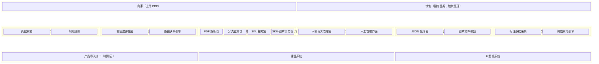

### 1.3 业务角色与系统交互

| 角色 | 系统触点 | 核心动作 |
|------|---------|---------|
| 商家 | 上传入口（间接） | 上传 PDF，指定/继承品类标签 |
| 销售 | 上传入口 | 代商家上传 PDF，选择品类，触发处理 |
| 运营 | 人工管理界面 | 处理低置信度页面、确认非标属性、纠正 AI 结果、标注反馈 |
| 研发 | 配置后台 | 维护阈值配置、关键词库、正则规则、权重参数 |
| 下游系统 | API 接口 | 消费结构化 JSON + 图片文件 |

---

## 2. 核心业务流程

### 2.1 L1 主流程（端到端）

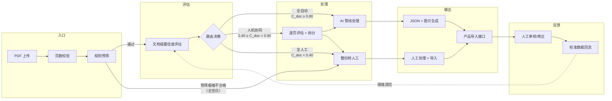

### 2.2 L2 预处理评估子流程

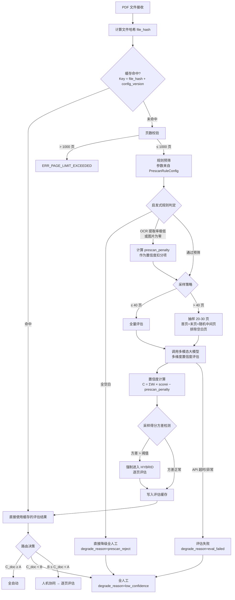

### 2.3 L2 AI 处理管线子流程（单页粒度）

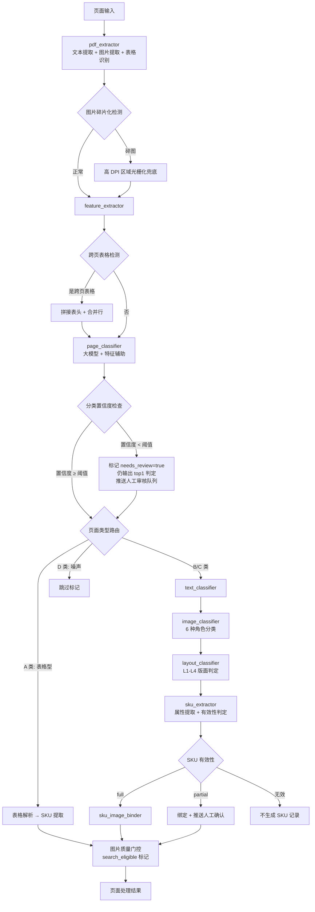

### 2.4 L2 人机协同子流程

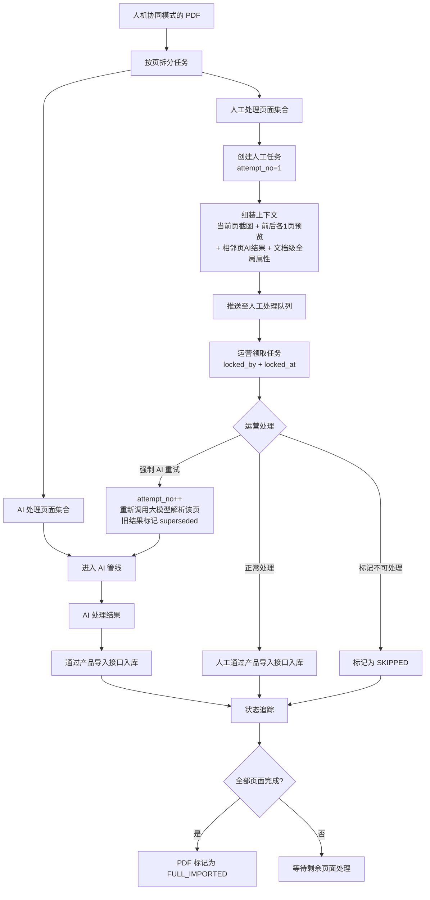

### 2.5 L2 校准反馈闭环

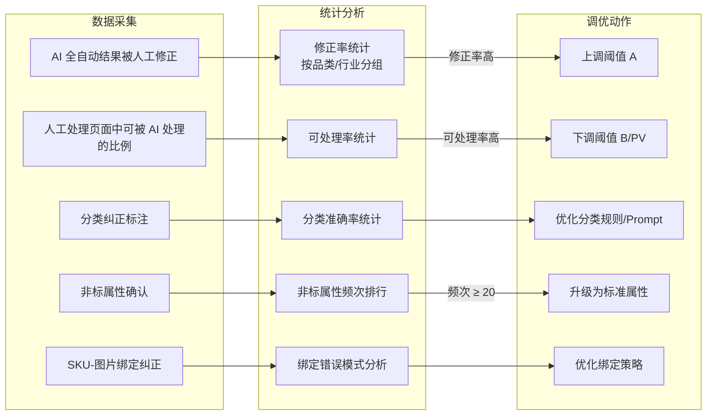

---

## 3. 运行对象实体模型

### 3.1 实体关系总览

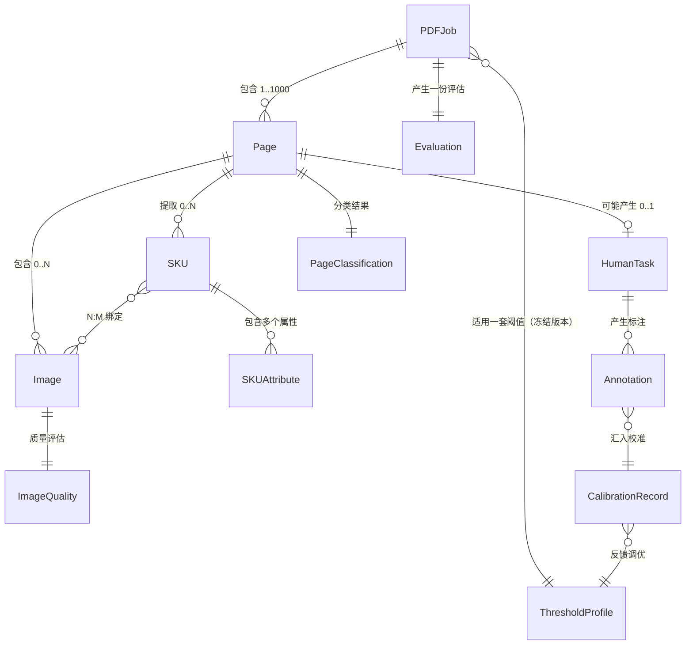

### 3.2 核心实体清单

| 实体 | 业务含义 | 生命周期 | 唯一标识 |
|------|---------|---------|---------|
| **PDFJob** | 一次 PDF 处理作业，系统的顶层聚合根 | 从上传到全部导入完成 | `job_id`（UUID） |
| **Page** | PDF 中的单一页面，处理的最小调度单元 | 随 PDFJob 创建，独立完成 | `job_id + page_number + attempt_no` |
| **Evaluation** | 一次置信度评估的完整结果 | 随 PDFJob 创建，可缓存复用 | `file_hash + config_version` |
| **SKU** | 从页面中提取的一个商品单元 | 从提取到导入下游 | `sku_id`（`{pdf_hash_8}_{page}_{seq}`） |
| **Image** | 从页面中提取的一张图片 | 从提取到导入下游 | `image_id`（`img_{pdf_hash_8}_{page}_{seq}`） |
| **SKUImageBinding** | SKU 与 Image 之间的 N:M 绑定关系 | 随 SKU/Image 创建 | `sku_id + image_id` |
| **HumanTask** | 分配给运营的人工处理任务 | 从创建到完成/超时/跳过 | `task_id`（UUID） |
| **Annotation** | 运营的标注/纠正记录 | 持久化，用于校准 | `annotation_id` |
| **ThresholdProfile** | 一套阈值配置（含品类/行业差异化） | 长期有效，版本化管理 | `profile_id + version` |
| **CalibrationRecord** | 一次阈值校准的统计快照 | 定期生成 | `calibration_id + timestamp` |

---

## 4. 数据结构定义

### 4.1 PDFJob（PDF 处理作业）

```yaml
PDFJob:
  # === 身份标识 ===
  job_id:             string    # UUID，主键
  source_file:        string    # 原始文件名
  file_hash:          string    # "sha256:{hash}"，用于去重和缓存
  
  # === 业务上下文 ===
  merchant_id:        string    # 商家 ID
  category:           string?   # 品类标签（上传时指定，可为 null）
  industry:           string?   # 行业标签（可为 null）
  uploaded_by:        string    # 上传人（销售/商家）
  uploaded_at:        datetime  # 上传时间
  
  # === 文档属性 ===
  total_pages:        int       # 总页数
  blank_pages:        int[]     # 空白页页码列表
  
  # === 处理状态 ===
  status:             PDFJobStatus    # 见状态机 §5.1
  route:              RouteDecision   # AUTO | HYBRID | HUMAN_ALL（纯业务路由）
  degrade_reason:     DegradeReason?  # 降级原因（仅当非正常路由时有值）
  #   eval_failed       — 评估阶段 API 异常
  #   prescan_reject    — 预筛阶段极端不合格（全空白）
  #   low_confidence    — 评估完成但置信度 < B
  #   null              — 正常路由（无降级）
  
  # === 配置冻结 ===
  frozen_config_version: string  # Job 创建时快照的配置版本，生命周期内不变
  
  # === 输出上下文 ===
  output_base_url:    string    # 输出文件的根路径前缀
  #   V1 本地: "file:///data/jobs/{job_id}/"
  #   未来 OSS: "https://oss.bucket/jobs/{job_id}/"
  
  # === 处理追踪 ===
  processing_trace:
    model_used:       string    # "gemini-2.5-pro"
    threshold_profile: string   # "furniture_v1" 或 "global_default"
    config_version:   string    # 配置版本号
    evaluator_version: string   # 评估器版本
  
  # === 完成确认 ===
  completion_source:  CompletionSource?
  #   downstream_confirmed — 下游接口回执确认（I5 成立）
  #   local_assumed        — 仅本系统调用成功（HTTP 200），I5 不可用时的降级
  
  # === 统计 ===
  ai_pages:           int[]     # AI 处理的页码列表
  human_pages:        int[]     # 人工处理的页码列表
  skipped_pages:      int[]     # 跳过的页码列表（D 类 + 空白页）
  failed_pages:       int[]     # 处理失败的页码列表
  total_skus:         int       # 提取的 SKU 总数
  total_images:       int       # 提取的图片总数
  
  # === 时间线 ===
  eval_started_at:    datetime?
  eval_completed_at:  datetime?
  process_started_at: datetime?
  process_completed_at: datetime?
  parse_time_ms:      int?      # AI 管线处理总耗时
  
  # === 成本追踪 ===
  token_consumption:
    eval_tokens:      int       # 评估阶段消耗
    process_tokens:   int       # 处理阶段消耗
    total_api_calls:  int       # API 调用总次数
```

### 4.2 Evaluation（置信度评估）

```yaml
Evaluation:
  # === 缓存键 ===
  file_hash:          string
  config_version:     string
  
  # === 文档级结果 ===
  doc_confidence:     float     # C_doc ∈ [0, 1]
  route:              RouteDecision
  degrade_reason:     DegradeReason?
  
  # === 各维度得分 ===
  dimension_scores:
    structure_score:    float   # [0, 1] 结构复杂度（反向）
    text_readability:   float   # [0, 1] 文本可读性
    table_quality:      float   # [0, 1] 表格规范度
    image_deliverable:  float   # [0, 1] 图片可交付性
    semantic_product:   float   # [0, 1] 产品语义可识别性
    decision_certainty: float   # [0, 1] 决策确定性
  
  # === 权重快照 ===
  weights_snapshot:
    W1: 0.20
    W2: 0.20
    W3: 0.15
    W4: 0.15
    W5: 0.15
    W6: 0.15
  
  # === 预筛结果 ===
  prescan:
    passed:             boolean
    prescan_penalty:    float   # [0, 1] 预筛扣分项（通过时为 0）
    penalty_reasons:    string[]  # ["ocr_rate_low", "no_images"] 等
    #   all_blank → 直接降级，不进入大模型评估
    #   ocr_rate_low / no_images → 扣分项，仍进入大模型评估
  
  # === 采样信息 ===
  sampling:
    strategy:           string  # "full" | "sampled"
    total_pages:        int
    sampled_pages:      int[]   # 实际评估的页码
    blank_pages_found:  int[]   # 检测到的空白页
    score_variance:     float   # 采样页得分方差（方差 > 阈值 → 强制 HYBRID）
    variance_forced_hybrid: boolean  # 是否因方差过大强制进入 HYBRID
  
  # === 页级评估（仅 HYBRID 模式） ===
  page_evaluations:     PageEvaluation[]?
  
  # === 元信息 ===
  evaluated_at:         datetime
  model_used:           string
  cached:               boolean   # 是否来自缓存

PageEvaluation:
  page_number:          int
  page_confidence:      float     # C_page ∈ [0, 1]
  assigned_to:          string    # "ai" | "human"
```

### 4.3 Page（页面）

```yaml
Page:
  # === 身份标识 ===
  job_id:             string    # 所属 PDFJob
  page_number:        int       # 页码（1-based）
  attempt_no:         int       # 处理尝试次数（初始 1，每次"强制 AI 重试"+1）
  
  # === 状态 ===
  status:             PageStatus      # 见状态机 §5.2
  processed_by:       string          # "ai" | "human" | "skipped"
  
  # === 导入确认 ===
  import_confirmation: ImportConfirmation
  #   downstream_confirmed — 下游回执确认
  #   local_assumed        — 本系统 HTTP 200 但无回执
  #   not_imported         — 尚未导入
  
  # === 页面级置信度 ===
  page_confidence:    float?    # C_page（仅 HYBRID 模式有值）
  
  # === 分类结果 ===
  classification:
    page_type:        PageType        # A | B | C | D
    layout_type:      LayoutType?     # L1 | L2 | L3 | L4（D 类为 null）
    classification_confidence: float  # 分类置信度（内部使用）
    needs_review:     boolean         # 分类置信度低于阈值时为 true
    #   needs_review=true 时：仍输出 top1 判定（不强制归 D），
    #   同时推送至人工审核队列。避免将"不确定"与"噪声"混淆。
  
  # === 解析产物 ===
  text_blocks:        TextBlock[]     # 提取的文本块
  images:             Image[]         # 提取的图片
  tables:             Table[]         # 识别的表格
  
  # === 特征向量 ===
  features:
    text_density:     float           # 文本面积占比
    image_ratio:      float           # 图片面积占比
    keyword_hits:     int             # 关键词命中数
    table_cell_count: int             # 表格单元格数
    has_price_column: boolean         # 是否含价格列
  
  # === 共享属性（页面级） ===
  product_description:
    attributes:       map<string, string>  # 如 {"brand": "XX", "material": "304不锈钢"}
    source:           "page_level"
  
  # === 页面截图 ===
  screenshot_path:    string          # 相对路径
  
  # === 处理耗时 ===
  process_time_ms:    int?
```

### 4.4 SKU（商品单元）

```yaml
SKU:
  # === 身份标识 ===
  sku_id:             string    # "{pdf_hash_8}_{page}_{seq}" 如 "a1b2c3d4_p03_001"
  #   seq 基于 bbox_y1 坐标从上到下排序生成，确保同一 PDF 重跑结果一致
  job_id:             string    # 所属 PDFJob
  page_number:        int       # 来源页码
  attempt_no:         int       # 所属 Page 的 attempt 版本
  revision:           int       # SKU 自身修订版本（AI 重试时 +1，旧版本标记 superseded）
  
  # === 有效性 ===
  validity:           string    # "full" | "partial" | "invalid"
  
  # === 标准属性（key 始终存在，缺失值为 null） ===
  attributes:
    model:            string?   # 型号
    product_name:     string?   # 产品名称
    size:             string?   # 尺寸
    material:         string?   # 材质
    color:            string?   # 颜色
    price:                      # 价格
      value:          float?
      currency:       string?   # "CNY" | "USD" | ...
    weight:           string?   # 重量
    packaging:        string?   # 包装信息
    brand:            string?   # 品牌
    moq:              int?      # 最小起订量
  
  # === 非标属性 ===
  custom_attributes:  CustomAttribute[]
  
  # === 提取溯源 ===
  source_text:        string    # 原始文本块内容
  source_bbox:        int[4]    # [x1, y1, x2, y2] 坐标
  attribute_source:   string    # "sku_direct"（SKU 独立提取）
  
  # === 图片绑定 ===
  bound_images:       SKUImageBinding[]
  
  # === 状态 ===
  status:             SKUStatus # 见状态机 §5.3
  superseded:         boolean   # 是否已被新 revision 取代
  import_status:      string?   # "pending" | "imported" | "failed"

CustomAttribute:
  name:               string    # 属性名
  value:              string    # 属性值
  status:             string    # "pending_confirmation" | "confirmed" | "rejected"
  confirmed_name:     string?   # 人工确认后的标准属性名
  confirmed_value:    string?   # 人工确认后的标准属性值
```

### 4.4a SKU Validity 输出契约表

不同 `sku_validity_mode` 下，各有效性等级的行为差异：

| validity | strict 模式 | lenient 模式 | 是否创建 HumanTask | 导入行为 |
|----------|-----------|------------|-------------------|---------|
| **full** | 输出 JSON + 导入 | 输出 JSON + 导入 | 否 | 正常导入 |
| **partial** | 输出 JSON，**不导入**，等待人工确认 | 输出 JSON + 导入（标记 `validity: partial`，缺失字段为 null） | 是（SKU_CONFIRM） | strict: 确认后导入；lenient: 直接导入 |
| **invalid** | 不输出（仅写入 debug 日志） | 不输出（仅写入 debug 日志） | 否 | 不导入 |

**下游契约**：产品导入接口需能接受 `validity: partial` 的 SKU（lenient 模式下），缺失字段以 `null` 传入。

### 4.5 Image（图片）

```yaml
Image:
  # === 身份标识 ===
  image_id:           string    # "img_{pdf_hash_8}_{page}_{seq}"
  job_id:             string
  page_number:        int       # 来源页码
  
  # === 角色分类 ===
  role:               ImageRole # PRODUCT_MAIN | DETAIL | SCENE | LOGO | DECORATION | SIZE_CHART
  
  # === 空间信息 ===
  bbox:               int[4]    # 在页面中的位置 [x1, y1, x2, y2]
  
  # === 文件输出 ===
  extracted_path:     string    # 相对路径，如 "images/img_003.jpg"
  format:             string    # "jpg" | "png"
  
  # === 质量评估 ===
  quality:
    resolution:       int[2]    # [宽, 高] 像素
    short_edge:       int       # 短边像素值
    quality_grade:    QualityGrade  # HIGH | LOW_QUALITY
    file_size_kb:     int
    search_eligible:  boolean   # 短边 ≥ 640px
    is_fragmented:    boolean   # 是否为碎图光栅化结果
  
  # === 去重 ===
  image_hash:         string    # 图片内容哈希（用于 PDF 内去重）
  is_duplicate:       boolean   # 是否重复图片
  dedup_kept_version: string?   # 去重保留策略："largest" 表示保留短边最大版本
  #   去重按角色区分：
  #     LOGO / DECORATION — 同 hash 仅保留一份
  #     PRODUCT_MAIN / DETAIL / SCENE / SIZE_CHART — 即使视觉相似，
  #       不同页面的实例各自保留（可能对应不同 SKU），仅完全相同 hash 去重
  
  # === 绑定 ===
  bound_sku_ids:      string[]  # 绑定的 SKU ID 列表
```

### 4.6 SKUImageBinding（SKU-图片绑定关系）

```yaml
SKUImageBinding:
  sku_id:             string
  image_id:           string
  image_role:         ImageRole
  binding_method:     BindingMethod   # spatial_proximity | grid_alignment | id_matching | page_inheritance
  binding_confidence: float           # [0, 1]
```

### 4.7 HumanTask（人工任务）

```yaml
HumanTask:
  # === 身份标识 ===
  task_id:            string    # UUID
  job_id:             string    # 所属 PDFJob
  page_number:        int       # 对应页码
  
  # === 任务类型 ===
  task_type:          HumanTaskType
  # PAGE_PROCESS     — 整页人工处理（低置信度页面）
  # SKU_CONFIRM      — partial SKU 确认
  # ATTRIBUTE_CONFIRM — 非标属性确认
  # BINDING_CONFIRM  — SKU-图片绑定确认
  # CLASSIFICATION_REVIEW — 低置信度分类审核（needs_review=true）
  
  # === 上下文 ===
  context:
    page_screenshot:       string   # 当前页截图相对路径
    prev_page_screenshot:  string?  # 前一页截图
    next_page_screenshot:  string?  # 后一页截图
    adjacent_ai_results:   string?  # 相邻页 AI 解析摘要
    doc_global_attributes: map<string, string>?
    #   文档级 AI 提取的全局共性属性（如品牌、材质等在文档开头出现一次的信息），
    #   供运营参考，避免因上下文窗口仅 ±1 页而遗漏关键信息
  
  # === 状态 ===
  status:             HumanTaskStatus   # 见状态机 §5.4
  assigned_to:        string?           # 分配给哪个运营
  
  # === 并发锁定 ===
  locked_by:          string?           # 当前锁定人（运营开始处理时加锁）
  locked_at:          datetime?         # 锁定时间
  #   锁定规则：运营领取任务时写入 locked_by + locked_at，
  #   完成/超时/放弃时释放。防止多人同时处理同一页面。
  
  # === 时间线 ===
  created_at:         datetime
  assigned_at:        datetime?
  completed_at:       datetime?
  timeout_at:         datetime          # 超时截止时间
  
  # === 结果 ===
  result:
    action:           string   # "processed" | "ai_retry" | "skipped"
    annotations:      Annotation[]
```

### 4.8 Annotation（标注记录）

```yaml
Annotation:
  annotation_id:      string    # UUID
  task_id:            string    # 所属 HumanTask
  job_id:             string
  page_number:        int
  annotator:          string    # 运营人员 ID
  annotated_at:       datetime
  
  # === 标注类型 ===
  type:               AnnotationType
  
  # === 结构化 Payload（按 type 区分 schema） ===
  # 每种 AnnotationType 有固定 schema，便于后期统计分析
  
  payload:            # 以下为各 type 对应的 schema 定义

# --- PAGE_TYPE_CORRECTION ---
PageTypeCorrectionPayload:
  original_type:      PageType        # 原始分类
  corrected_type:     PageType        # 纠正后分类
  original_confidence: float          # 原始置信度
  reason:             string?         # 纠正原因

# --- TEXT_ROLE_CORRECTION ---
TextRoleCorrectionPayload:
  text_block_id:      string          # 被纠正的文本块 ID
  original_role:      TextRole
  corrected_role:     TextRole
  text_preview:       string          # 文本块前 100 字符预览

# --- IMAGE_ROLE_CORRECTION ---
ImageRoleCorrectionPayload:
  image_id:           string
  original_role:      ImageRole
  corrected_role:     ImageRole

# --- LAYOUT_CORRECTION ---
LayoutCorrectionPayload:
  original_layout:    LayoutType
  corrected_layout:   LayoutType

# --- SKU_ATTRIBUTE_CORRECTION ---
SKUAttributeCorrectionPayload:
  sku_id:             string
  field_name:         string          # 被纠正的属性名
  original_value:     string?         # 原始值
  corrected_value:    string?         # 纠正后的值
  error_category:     string          # "ocr_misread" | "wrong_binding" | "missing_value" | "wrong_field"

# --- BINDING_CORRECTION ---
BindingCorrectionPayload:
  sku_id:             string
  added_image_ids:    string[]        # 新增绑定
  removed_image_ids:  string[]        # 移除绑定
  reason:             string?

# --- CUSTOM_ATTR_CONFIRM ---
CustomAttrConfirmPayload:
  attr_name:          string
  attr_value:         string
  action:             string          # "confirm" | "reject" | "rename"
  confirmed_name:     string?         # rename 时的标准属性名
  confirmed_value:    string?

# --- NEW_TYPE_REPORT ---
NewTypeReportPayload:
  dimension:          string          # "page_type" | "image_role" | "text_role" | "layout_type"
  suggested_name:     string          # 建议的新类型名
  example_description: string         # 示例描述
```

### 4.9 ThresholdProfile（阈值配置）

```yaml
ThresholdProfile:
  profile_id:         string    # 如 "furniture_v1" | "global_default"
  version:            string    # 配置版本号
  category:           string?   # 品类（null 表示全局默认）
  industry:           string?   # 行业
  
  # === 核心阈值 ===
  thresholds:
    A:                float     # 文档级-自动阈值（初始 0.90）
    B:                float     # 文档级-放弃阈值（初始 0.40）
    PV:               float     # 页级-自动阈值（初始 0.75）
  
  # === 置信度权重 ===
  confidence_weights:
    W1:               float     # structure_score 权重
    W2:               float     # text_readability 权重
    W3:               float     # table_quality 权重
    W4:               float     # image_deliverable 权重
    W5:               float     # semantic_product 权重
    W6:               float     # decision_certainty 权重
  
  # === 预筛规则配置 ===
  prescan_rules:
    ocr_rate_penalty_threshold:  float   # OCR 提取率低于此值时触发扣分（如 0.10）
    ocr_rate_penalty_weight:     float   # 扣分权重（如 0.3）
    no_images_penalty_weight:    float   # 图片为零时的扣分权重（如 0.15）
    all_blank_action:            string  # "direct_reject"（始终直接降级）
    score_variance_threshold:    float   # 采样得分方差阈值，超过则强制 HYBRID（如 0.15）
  
  # === 分类阈值 ===
  classification_thresholds:
    page_type_min_confidence:  float  # 页面分类最低置信度
    sku_validity_mode:         string # "strict" | "lenient"
  
  # === 元信息 ===
  effective_from:     datetime
  created_by:         string    # 修改人
  change_reason:      string    # 修改原因
```

---

## 5. 对象状态机

### 5.1 PDFJob 状态机

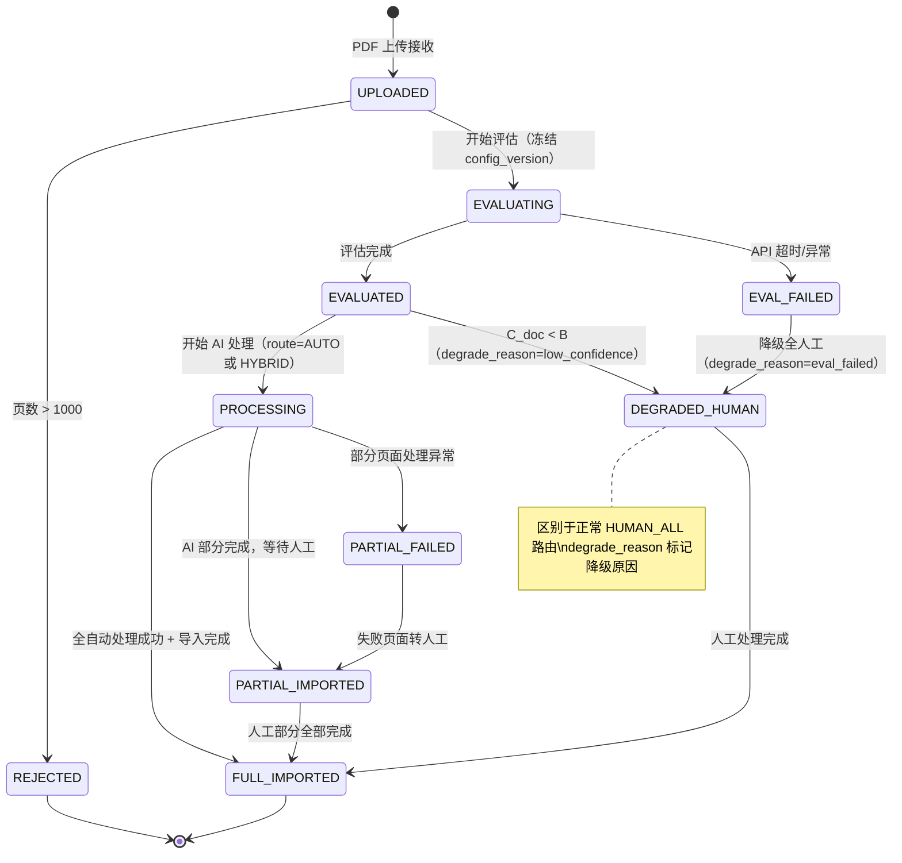

**状态说明**：

| 状态 | 含义 | 触发条件 | 允许的后续操作 |
|------|------|---------|--------------|
| `UPLOADED` | PDF 已上传，等待处理 | 文件上传完成 | 开始评估 |
| `REJECTED` | 拒绝处理（终态） | 页数 > 1000 | 无 |
| `EVALUATING` | 正在进行置信度评估 | 评估开始，同时冻结 config_version | 等待评估完成 |
| `EVAL_FAILED` | 评估过程失败 | API 超时/返回异常 | 自动降级 |
| `EVALUATED` | 评估完成，已确定路由 | 评估返回结果 | 开始处理 |
| `PROCESSING` | AI 管线正在处理 | 进入处理阶段 | 等待处理完成 |
| `PARTIAL_FAILED` | 部分页面处理失败 | 管线异常但未全部失败 | 失败页转人工 |
| `PARTIAL_IMPORTED` | AI 部分已导入，人工部分待处理 | AI 结果入库成功 | 等待人工完成 |
| `DEGRADED_HUMAN` | 整份 PDF 降级为全人工处理 | C_doc < B 或评估失败或预筛极端不合格 | 等待人工完成 |
| `FULL_IMPORTED` | 全部导入完成（终态） | 所有非 BLANK/SKIPPED 页面达到 IMPORTED | 无 |

> **Route vs Status 解耦**：`route` 字段仅记录业务路由决策（AUTO/HYBRID/HUMAN_ALL），`status` 中的 `DEGRADED_HUMAN` 表示因异常或低质量降级的人工处理，与正常路由的 HUMAN_ALL 区分。`degrade_reason` 进一步标记降级原因。

### 5.2 Page 状态机

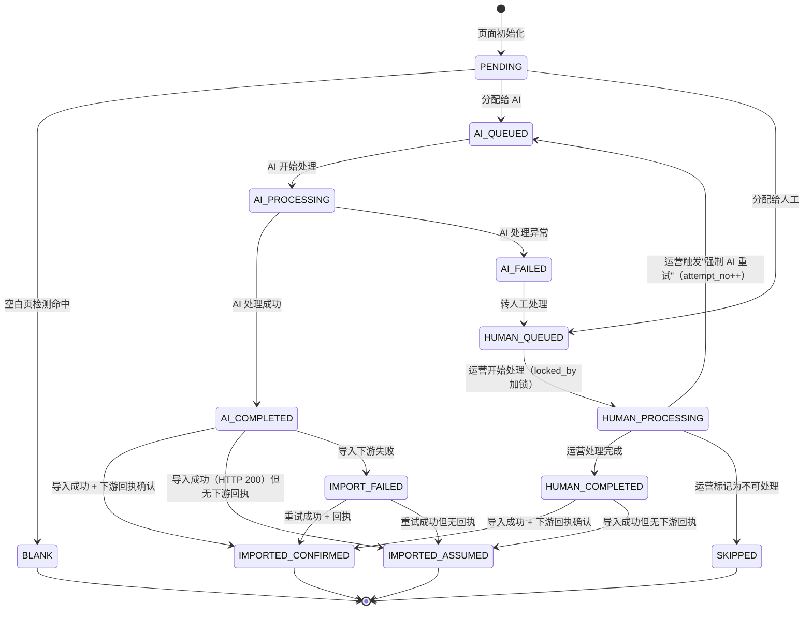

**状态说明**：

| 状态 | 含义 |
|------|------|
| `PENDING` | 页面已识别，等待分配 |
| `BLANK` | 空白页，跳过处理（终态） |
| `AI_QUEUED` | 已分配给 AI 管线，排队中 |
| `AI_PROCESSING` | AI 管线正在处理中 |
| `AI_COMPLETED` | AI 处理成功，等待导入 |
| `AI_FAILED` | AI 处理异常，待转人工 |
| `HUMAN_QUEUED` | 已分配给人工，排队中 |
| `HUMAN_PROCESSING` | 运营正在处理中（已加锁） |
| `HUMAN_COMPLETED` | 运营处理完成，等待导入 |
| `SKIPPED` | 跳过（D 类噪声页或不可处理，终态） |
| `IMPORTED_CONFIRMED` | 已导入 + 下游回执确认（终态，I5 成立时） |
| `IMPORTED_ASSUMED` | 已导入但无回执（终态，I5 不成立时的降级） |
| `IMPORT_FAILED` | 导入下游失败，待重试 |

### 5.3 SKU 状态机

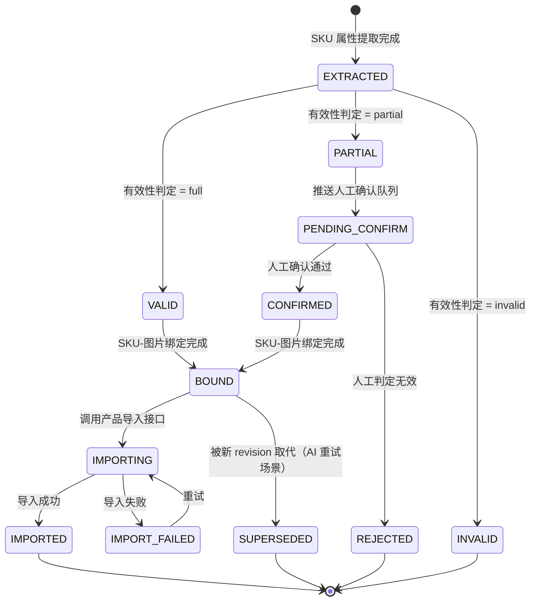

### 5.4 HumanTask 状态机

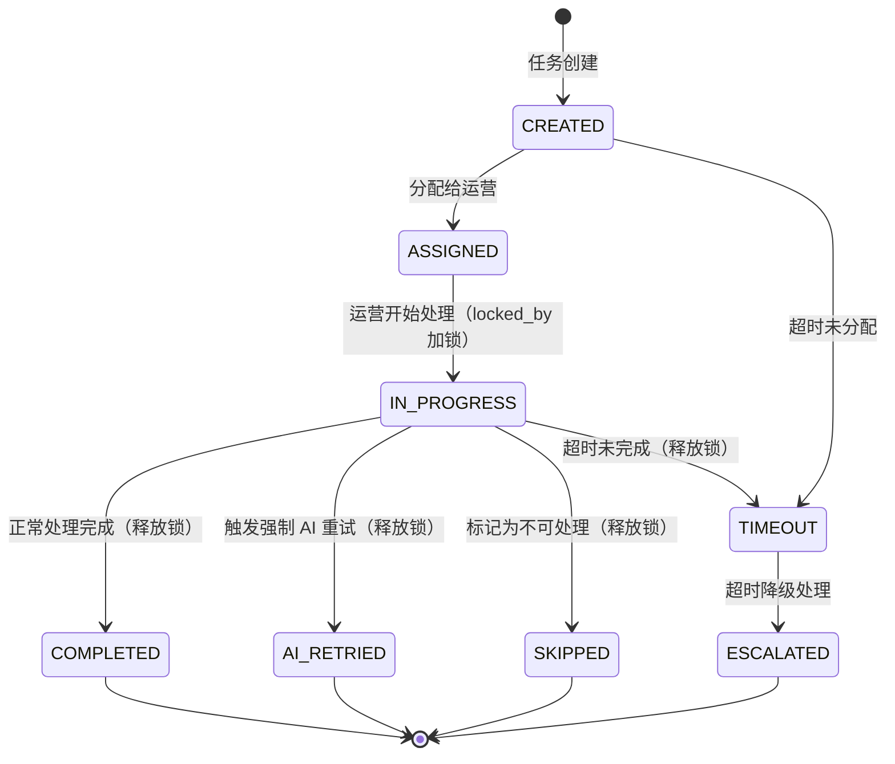

**状态说明**：

| 状态 | 含义 | 超时策略 |
|------|------|---------|
| `CREATED` | 任务已创建，待分配 | 超过 N 小时未分配 → TIMEOUT |
| `ASSIGNED` | 已分配给具体运营人员 | — |
| `IN_PROGRESS` | 运营正在处理中（已加锁，locked_by 非空） | 超过 M 小时未完成 → TIMEOUT |
| `COMPLETED` | 处理完成（终态） | — |
| `AI_RETRIED` | 运营触发 AI 重试（终态，原任务关闭，Page.attempt_no++） | — |
| `SKIPPED` | 不可处理（终态） | — |
| `TIMEOUT` | 超时 | 进入 ESCALATED |
| `ESCALATED` | 超时降级（终态）。默认策略：标记为 SKIPPED + 发送管理员通知。可通过配置切换为：重新入队 / 自动分配给管理员 | — |

### 5.5 Image 状态机

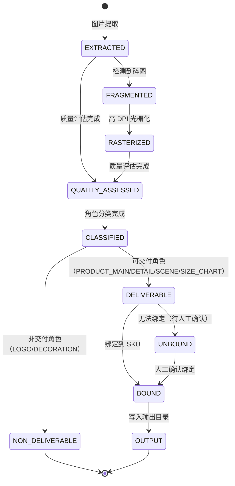

---

## 6. 枚举定义

### 6.1 核心枚举

```yaml
# === PDF 处理路由（纯业务语义，不含降级） ===
RouteDecision:
  - AUTO          # 全自动：C_doc ≥ A
  - HYBRID        # 人机协同：B ≤ C_doc < A
  - HUMAN_ALL     # 全人工：C_doc < B

# === 降级原因（与 route 解耦，标记非正常路由的原因） ===
DegradeReason:
  - eval_failed       # 评估阶段 API 超时/异常
  - prescan_reject    # 预筛阶段极端不合格（全空白）
  - low_confidence    # 评估完成但 C_doc < B
  - null              # 无降级（正常路由）

# === 导入确认方式 ===
CompletionSource:
  - downstream_confirmed   # 下游接口回执确认（I5 成立）
  - local_assumed          # 仅本系统 HTTP 200，无法确认（I5 不成立）

ImportConfirmation:
  - downstream_confirmed
  - local_assumed
  - not_imported           # 尚未导入

# === 页面类型 ===
PageType:
  - A             # 表格型
  - B             # 商品展示型
  - C             # 营销/品牌型
  - D             # 其他/噪声

# === 版面类型 ===
LayoutType:
  - L1            # 单品大图 + 描述
  - L2            # 多品网格排列
  - L3            # 图文混排（非对称）
  - L4            # 纯文本/纯表格

# === 文本角色 ===
TextRole:
  - SKU_BLOCK     # 商品属性文本
  - MARKETING     # 营销/品牌文本

# === 图片角色 ===
ImageRole:
  - PRODUCT_MAIN  # 产品主图 → 输出
  - DETAIL        # 产品细节图 → 输出
  - SCENE         # 场景图 → 输出
  - LOGO          # 品牌标识 → 不输出
  - DECORATION    # 装饰性图片 → 不输出
  - SIZE_CHART    # 尺码表/规格图 → 输出

# === 图片质量等级 ===
QualityGrade:
  - HIGH          # 短边 ≥ 640px
  - LOW_QUALITY   # 短边 < 640px

# === 绑定方法 ===
BindingMethod:
  - spatial_proximity   # 空间邻近（L1/L3）
  - grid_alignment      # 网格对齐（L2）
  - id_matching         # 编号匹配
  - page_inheritance    # 页面继承（单 SKU 页面）

# === SKU 有效性 ===
SKUValidity:
  - full          # 必要条件 + 充分条件均满足
  - partial       # 仅满足必要条件
  - invalid       # 不满足必要条件

# === 人工任务类型 ===
HumanTaskType:
  - PAGE_PROCESS          # 整页人工处理
  - SKU_CONFIRM           # partial SKU 确认
  - ATTRIBUTE_CONFIRM     # 非标属性确认
  - BINDING_CONFIRM       # 绑定关系确认
  - CLASSIFICATION_REVIEW # 分类审核（needs_review=true 触发）

# === 标注类型 ===
AnnotationType:
  - PAGE_TYPE_CORRECTION
  - TEXT_ROLE_CORRECTION
  - IMAGE_ROLE_CORRECTION
  - LAYOUT_CORRECTION
  - SKU_ATTRIBUTE_CORRECTION
  - BINDING_CORRECTION
  - CUSTOM_ATTR_CONFIRM
  - NEW_TYPE_REPORT

# === 预筛惩罚原因 ===
PrescanPenaltyReason:
  - ocr_rate_low        # OCR 文本提取率低（扣分项）
  - no_images           # 图片占比为零（扣分项）
  - all_blank           # 页面全空白（直接降级，不扣分）
```

---

## 7. 系统边界与外部接口

### 7.1 上下文边界图

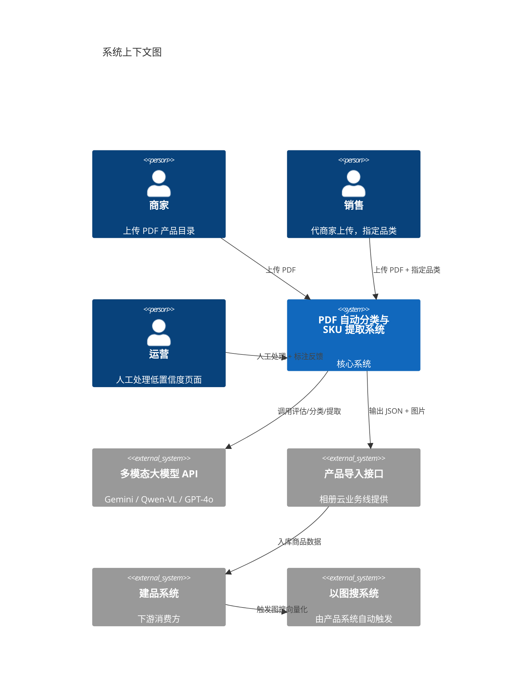

### 7.2 外部接口清单

| 接口方向 | 对端系统 | 接口类型 | 数据内容 | 协议假设 |
|---------|---------|---------|---------|---------|
| **入** | 上传入口 | 文件上传 | PDF 文件 + 品类/行业标签 | HTTP multipart |
| **出→入** | 多模态大模型 API | HTTP API | 页面截图 + Prompt → 评估/分类/提取结果 | REST JSON，需输入隔离防注入 |
| **出** | 产品导入接口 | HTTP API | 结构化 JSON + 图片文件（相对路径，根为 output_base_url） | 单 SKU 粒度、幂等、支持分批（I1-I5 假设） |
| **出** | 人工管理界面 | Web UI | 任务列表、页面截图、属性编辑、绑定确认 | 前端 SPA |
| **入** | 人工管理界面 | 用户操作 | 标注、纠正、确认、强制 AI 重试 | WebSocket/REST |
| **入** | 配置后台 | 管理 API | 阈值/权重/关键词/正则/预筛规则变更 | 支持热更新（Job 粒度冻结版本） |

### 7.3 本系统不涉及的边界

| 边界 | 说明 |
|------|------|
| 商品库写入 | 由产品导入接口负责 |
| 以图搜向量化 | 由产品系统入库后自动触发 |
| 商家通知 | 由上游业务系统负责 |
| 批量调度与重试 | 由上游任务系统负责 |
| ML 模型训练 | V2 规划，V1 阶段仅积累标注数据 |

---

## 8. 核心业务规则汇总

| 编号 | 业务规则 | 出处 |
|------|---------|------|
| BR-01 | 页数 > 1000 → 直接拒绝 | BRD §3.1 FR-1.1 |
| BR-02 | 空白页判定：可提取文本 < 10 字符 且 无嵌入图片 | BRD §3.1 |
| BR-03 | 采样策略：≤40 页全量，>40 页抽样 20-30 页 | BRD §3.1 |
| BR-04 | 置信度公式：C = ΣWi × scorei − prescan_penalty，各维度 [0,1]，权重和 = 1.0 | BRD §1.3.5 |
| BR-05 | 路由规则：C_doc ≥ A → AUTO，C_doc < B → HUMAN，其间 → HYBRID | BRD §1.3.1 |
| BR-06 | 评估失败 → 降级全人工（degrade_reason=eval_failed） | BRD §3.1 FR-1.4 |
| BR-07 | 缓存 Key = file_hash + config_version | BRD §3.1 FR-1.7 |
| BR-08 | 品类信息上传时指定，缺失用 global_default 兜底 | BRD §1.3.3 |
| BR-09 | V1 分类以大模型为主，feature_extractor 为辅助输入 | BRD §3.3/§3.4 |
| BR-10 | 分类低置信度 → 标记 needs_review=true + 仍输出 top1 判定 + 推送人工审核（不强制归 D） | BRD §3.4（BA 修订） |
| BR-11 | SKU 有效性：(型号 OR 产品名称) + 至少一个规格属性（尺寸/材质/颜色/价格） | BRD §3.8 |
| BR-12 | SKU ID = {pdf_hash_8}\_{page}\_{seq}，seq 基于 bbox_y1 坐标排序，不自动跨页合并 | BRD §3.8（BA 修订） |
| BR-13 | 共享属性仅放 product_description，不回填 SKU | BRD §3.8 |
| BR-14 | 属性缺失：key 始终存在，值为 null | BRD §3.8 |
| BR-15 | 图片短边 ≥ 640px → search_eligible = true | BRD §3.2 |
| BR-16 | 碎图检测 → 高 DPI 区域光栅化兜底 | BRD §3.2 FR-2.2 |
| BR-17 | 跨页表格自动继承首页表头 | BRD §3.2 FR-2.6 |
| BR-18 | 部分失败不回滚，已成功结果保留 | BRD §3.10 |
| BR-19 | 人工上下文窗口 = 前后各 1 页 + 文档级全局属性 | BRD §3.10 FR-10.4（BA 扩展） |
| BR-20 | 运营可触发"强制 AI 重试"，attempt_no++，旧结果标记 superseded | BRD §3.10 FR-10.6（BA 扩展） |
| BR-21 | 非标属性频次 ≥ 20 → 提示升级为标准属性 | BRD §3.12 |
| BR-22 | JSON 输出使用相对路径，根为 output_base_url | BRD §3.11（BA 扩展） |
| BR-23 | AI 与人工结果不在本系统合并，各自通过产品导入接口入库 | BRD §1.3.7 |
| BR-24 | 决策优先级：路由准确率 > SKU 召回率 > 图片质量 > 人工成本 > 速度 | BRD §1.4 |
| BR-25 | 预筛：all_blank → 直接降级；ocr_rate_low / no_images → 扣分项，仍进入大模型评估 | BA V1.1 新增 |
| BR-26 | 采样得分方差 > 阈值 → 强制进入 HYBRID 逐页评估 | BA V1.1 新增 |
| BR-27 | Job 创建时冻结 config_version，生命周期内不受热更新影响 | BA V1.1 新增 |
| BR-28 | 图片去重按角色区分：LOGO/DECORATION 同 hash 仅保留一份；可交付角色仅完全相同 hash 去重 | BA V1.1 新增 |
| BR-29 | FULL_IMPORTED 判定条件：所有非 BLANK/SKIPPED 页面达到 IMPORTED_CONFIRMED 或 IMPORTED_ASSUMED | BA V1.1 新增 |
| BR-30 | HumanTask 领取时加锁（locked_by + locked_at），防止并发处理冲突 | BA V1.1 新增 |

---

## 9. 业务不变式（Invariants）

系统在任何时刻都必须满足的刚性约束，违反则视为 bug：

| 编号 | 不变式 | 说明 |
|------|--------|------|
| INV-01 | `B < PV < A` | 三个阈值的有序性必须始终成立 |
| INV-02 | `ΣWi = 1.0` | 置信度权重之和恒等于 1.0 |
| INV-03 | `search_eligible=true ⇒ short_edge ≥ 640` | 搜索可用标记与分辨率的一致性 |
| INV-04 | `FULL_IMPORTED ⇒ ∀ page ∈ non_blank_non_skipped: page.status ∈ {IMPORTED_CONFIRMED, IMPORTED_ASSUMED}` | 终态完整性：PDFJob 完成时所有有效页面必须已导入 |
| INV-05 | `Page.attempt_no ≥ 1` | 每个页面至少有一次处理尝试 |
| INV-06 | `SKU.validity=full ⇒ (model ≠ null OR product_name ≠ null) AND (size ≠ null OR material ≠ null OR color ≠ null OR price ≠ null)` | SKU 有效性定义的形式化表达 |
| INV-07 | `SKU.superseded=true ⇒ ∃ SKU' where SKU'.page=SKU.page AND SKU'.revision > SKU.revision` | 被取代的 SKU 必须有更新版本存在 |
| INV-08 | `HumanTask.status=IN_PROGRESS ⇒ locked_by ≠ null` | 处理中的任务必须有锁 |
| INV-09 | `PDFJob.frozen_config_version = 创建时的 ThresholdProfile.version` | 配置冻结不可变 |
| INV-10 | `Evaluation.prescan.all_blank=true ⇒ route=HUMAN_ALL AND degrade_reason=prescan_reject` | 全空白必须降级 |
| INV-11 | `route=AUTO ⇒ degrade_reason=null` | 全自动路由不存在降级原因 |
| INV-12 | `JSON 输出中所有属性 key 始终存在，缺失值为 null` | 属性字段完整性 |

---

## 10. 异常与降级策略矩阵

各阶段的异常场景、默认策略和可配置项集中定义，确保研发/运维/产品对齐：

| 阶段 | 异常场景 | 默认策略 | 可配置项 | 安全备注 |
|------|---------|---------|---------|---------|
| **上传** | PDF 文件损坏/无法打开 | REJECTED | — | — |
| **上传** | 页数 > 1000 | REJECTED | 页数上限阈值 | — |
| **预筛** | 全空白 | 直接降级 DEGRADED_HUMAN（prescan_reject） | — | — |
| **预筛** | OCR 提取率极低 | 扣分项（prescan_penalty），仍进入大模型评估 | ocr_rate_penalty_threshold, weight | — |
| **预筛** | 图片为零 | 扣分项（prescan_penalty），仍进入大模型评估 | no_images_penalty_weight | 纯表格目录可能无图但可处理 |
| **评估** | LLM API 超时 | 降级 DEGRADED_HUMAN（eval_failed） | 超时时间、重试次数 | — |
| **评估** | LLM API 返回格式异常 | 降级 DEGRADED_HUMAN（eval_failed） | — | — |
| **评估** | 采样得分方差过大 | 强制进入 HYBRID | score_variance_threshold | — |
| **处理** | 单页 AI 处理异常 | 该页转人工，其他页继续，PDFJob → PARTIAL_FAILED | — | — |
| **处理** | 大模型返回 Prompt 注入内容 | 输入隔离（XML 标签包裹），异常结果丢弃 + 该页转人工 | — | 见 BRD §6 Prompt 注入风险 |
| **处理** | 碎图检测命中 | 高 DPI 区域光栅化兜底 | 光栅化 DPI 阈值 | — |
| **导入** | 产品导入接口 4xx | 不重试，标记 IMPORT_FAILED，等待人工排查 | — | — |
| **导入** | 产品导入接口 5xx | 指数退避重试（最多 3 次），仍失败则标记 IMPORT_FAILED | 重试次数、退避基数 | — |
| **导入** | I5 不满足（无回执/查询） | 使用 IMPORTED_ASSUMED 终态 | — | completion_source 标记 |
| **人工** | 任务超时未分配 | TIMEOUT → ESCALATED | 超时时间 N 小时 | — |
| **人工** | 任务超时未完成 | TIMEOUT → ESCALATED | 超时时间 M 小时 | — |
| **人工** | ESCALATED 降级 | 默认标记 SKIPPED + 通知管理员 | 可切换为：重新入队 / 自动分配管理员 | — |
| **人工** | 并发领取冲突 | locked_by 机制，后领取者被拒绝 | — | — |
| **存储** | 磁盘写满 | 当前 Job 标记 FAILED，告警通知运维 | 输出目录配额告警阈值 | — |
| **配置** | 阈值热更新时 Job 正在处理 | Job 使用 frozen_config_version，不受影响 | — | — |

---

## 附录 A. 对象状态转换事件矩阵

### A.1 PDFJob 状态转换

| 当前状态 | 事件 | 目标状态 | 触发条件 |
|---------|------|---------|---------|
| UPLOADED | page_check_failed | REJECTED | total_pages > 1000 |
| UPLOADED | eval_started | EVALUATING | 开始调用评估器（冻结 config_version） |
| EVALUATING | eval_completed | EVALUATED | 评估正常返回 |
| EVALUATING | eval_error | EVAL_FAILED | API 超时/异常 |
| EVAL_FAILED | auto_degrade | DEGRADED_HUMAN | 系统自动降级（degrade_reason=eval_failed） |
| EVALUATED | route_auto | PROCESSING | route = AUTO |
| EVALUATED | route_hybrid | PROCESSING | route = HYBRID |
| EVALUATED | route_human | DEGRADED_HUMAN | route = HUMAN_ALL（degrade_reason=low_confidence） |
| EVALUATED | prescan_reject | DEGRADED_HUMAN | 预筛极端不合格（degrade_reason=prescan_reject） |
| PROCESSING | all_pages_done | FULL_IMPORTED | 所有非 BLANK/SKIPPED 页面达到 IMPORTED_* |
| PROCESSING | ai_done_human_pending | PARTIAL_IMPORTED | AI 页面完成，人工页面待处理 |
| PROCESSING | page_error | PARTIAL_FAILED | 部分页面处理异常 |
| PARTIAL_FAILED | failed_to_human | PARTIAL_IMPORTED | 失败页面转入人工队列 |
| PARTIAL_IMPORTED | all_human_done | FULL_IMPORTED | 所有人工页面完成 |
| DEGRADED_HUMAN | all_human_done | FULL_IMPORTED | 所有页面人工完成 |

### A.2 Page 状态转换

| 当前状态 | 事件 | 目标状态 | 触发条件 |
|---------|------|---------|---------|
| PENDING | blank_detected | BLANK | 空白页判定命中 |
| PENDING | assign_ai | AI_QUEUED | C_page ≥ PV 或全自动模式 |
| PENDING | assign_human | HUMAN_QUEUED | C_page < PV 或全人工模式 |
| AI_QUEUED | start_process | AI_PROCESSING | AI 管线开始处理 |
| AI_PROCESSING | process_success | AI_COMPLETED | 处理正常完成 |
| AI_PROCESSING | process_error | AI_FAILED | 处理异常 |
| AI_FAILED | fallback_human | HUMAN_QUEUED | 转人工 |
| AI_COMPLETED | import_confirmed | IMPORTED_CONFIRMED | 导入成功 + 下游回执 |
| AI_COMPLETED | import_assumed | IMPORTED_ASSUMED | 导入成功但无回执 |
| AI_COMPLETED | import_error | IMPORT_FAILED | 导入下游失败 |
| IMPORT_FAILED | retry_confirmed | IMPORTED_CONFIRMED | 重试成功 + 回执 |
| IMPORT_FAILED | retry_assumed | IMPORTED_ASSUMED | 重试成功但无回执 |
| HUMAN_QUEUED | operator_start | HUMAN_PROCESSING | 运营开始处理（加锁） |
| HUMAN_PROCESSING | operator_done | HUMAN_COMPLETED | 运营处理完成（释放锁） |
| HUMAN_PROCESSING | force_ai_retry | AI_QUEUED | 运营触发 AI 重试（attempt_no++，释放锁） |
| HUMAN_PROCESSING | mark_skip | SKIPPED | 运营标记不可处理（释放锁） |
| HUMAN_COMPLETED | import_confirmed | IMPORTED_CONFIRMED | 导入成功 + 回执 |
| HUMAN_COMPLETED | import_assumed | IMPORTED_ASSUMED | 导入成功但无回执 |

---

*文档结束 — 业务架构文档 V1.1，整合 5 份评审反馈的 19 项修订*
