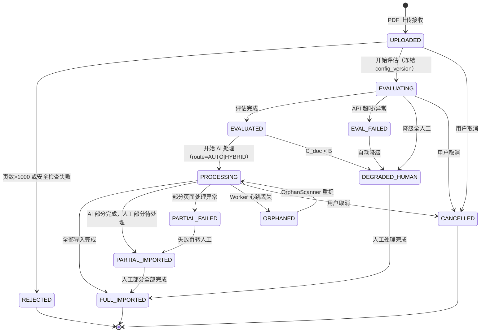
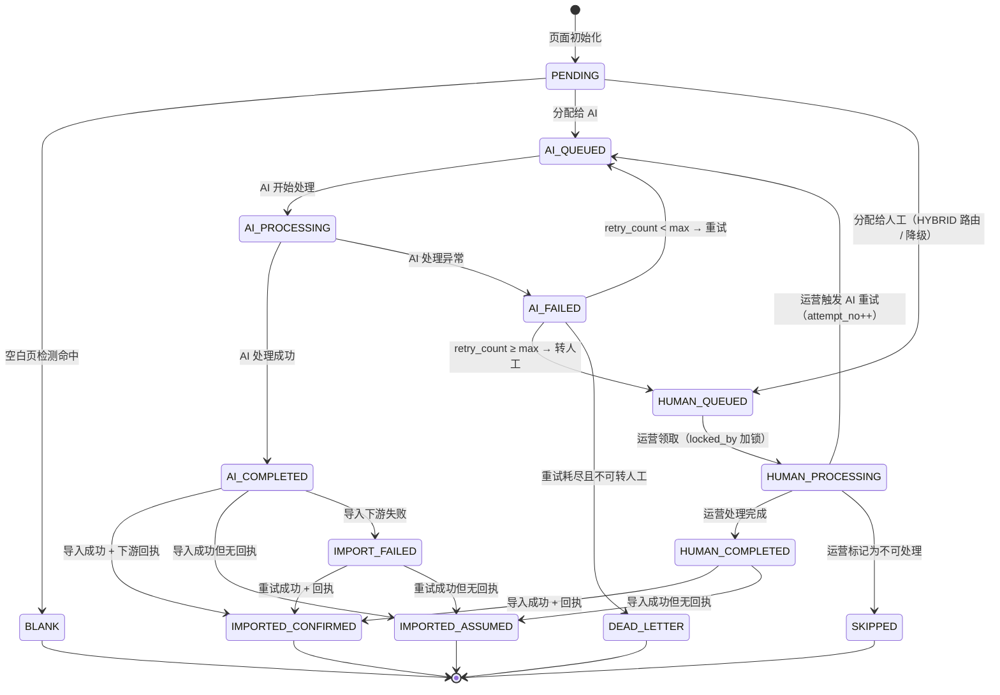
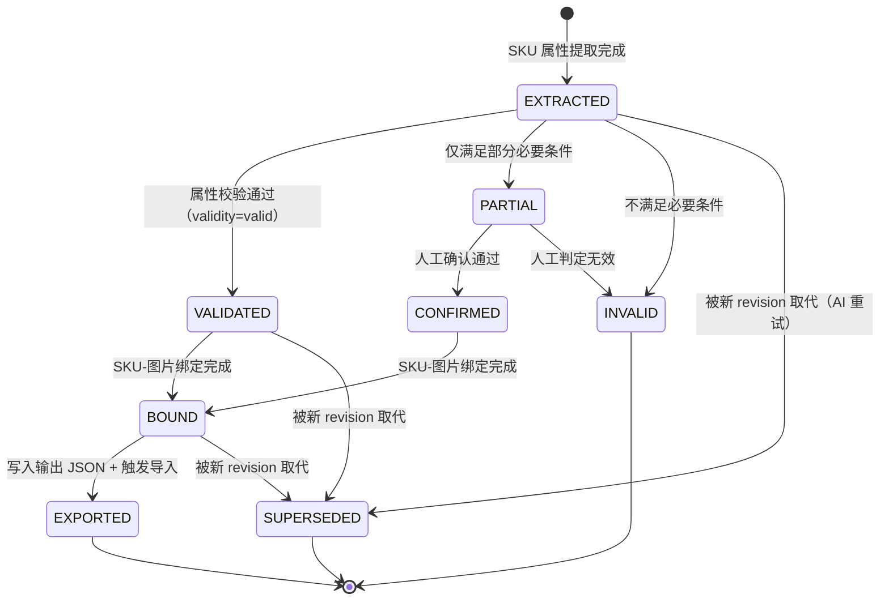
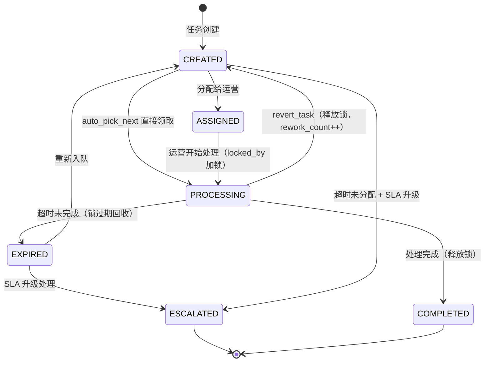
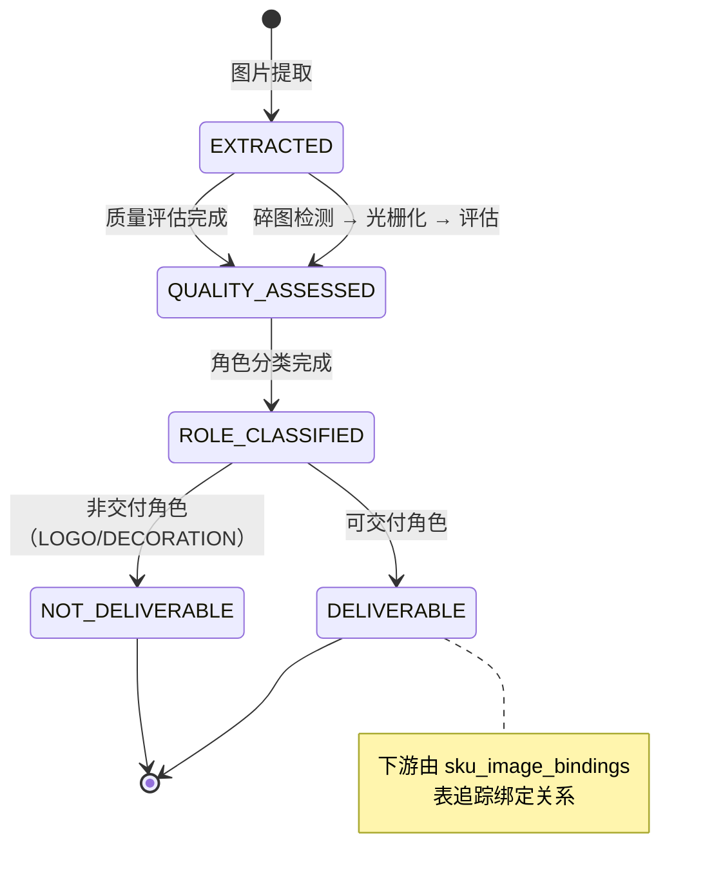

# PDF-SKU 系统数据字典与状态机定义

> **版本**: V1.0  
> **权威源**: DDL V1.2（17 表）· OpenAPI V2.0（53 端点 / 30 schemas）· 接口契约 V1.2 · 前端详设 V1.1 · BA V1.1  
> **定位**: 一站式开发参考，消除枚举、状态、字段定义的跨文档查阅痛点  
> **约定**: 所有枚举值均为**冻结版本**，变更需前后端+DB 同步发布

---

## 目录

| 章节 | 内容 |
|------|------|
| §1 状态机 | Job / Page / SKU / Task / Image 五大实体状态机（Mermaid + 转换表 + 写入方） |
| §2 枚举注册表 | 全系统 28 种枚举类型，一处定义 |
| §3 数据字典 | 17 张表逐字段说明（类型 / 约束 / 来源 / 业务含义） |
| §4 跨实体协调规则 | user_status 映射 / SSE 事件触发 / action_hint 生成 / 错误码 |
| §5 TypeScript 类型索引 | 前端类型与后端字段的映射对照 |

---

# §1 状态机

## 1.1 PDFJob 状态机

### 状态图



### 状态说明

| 状态 | user_status 映射 | 含义 | 终态 |
|------|----------------|------|------|
| `UPLOADED` | processing | PDF 已上传，等待处理 | — |
| `EVALUATING` | processing | 正在进行置信度评估 | — |
| `EVALUATED` | processing | 评估完成，已确定路由 | — |
| `PROCESSING` | processing | AI 管线正在处理 | — |
| `PARTIAL_FAILED` | partial_success | 部分页面处理异常 | — |
| `PARTIAL_IMPORTED` | partial_success | AI 部分已导入，人工部分待处理 | — |
| `FULL_IMPORTED` | completed | 全部导入完成 | ✅ |
| `DEGRADED_HUMAN` | needs_manual | 整份 PDF 降级为全人工 | — |
| `EVAL_FAILED` | failed | 评估过程失败 | — |
| `REJECTED` | failed | 拒绝处理（超页数/安全） | ✅ |
| `ORPHANED` | failed | Worker 丢失，等待重提 | — |
| `CANCELLED` | failed | 用户主动取消 | ✅ |

### 转换表（谁写谁触发）

| 转换 | 写入模块 | 触发条件 | SSE 事件 |
|------|---------|---------|---------|
| UPLOADED → EVALUATING | Gateway | Job 创建后 | — |
| UPLOADED → REJECTED | Gateway | 页数>1000 / 安全检查 | job_failed |
| EVALUATING → EVALUATED | Evaluator | 评估完成 | — |
| EVALUATING → EVAL_FAILED | Evaluator | API 超时/异常 | job_failed |
| EVALUATING → DEGRADED_HUMAN | Evaluator | 全降级 | human_needed |
| EVAL_FAILED → DEGRADED_HUMAN | Evaluator | 自动降级策略 | human_needed |
| EVALUATED → PROCESSING | Pipeline | 开始处理 | — |
| EVALUATED → DEGRADED_HUMAN | Pipeline | C_doc < B | human_needed |
| PROCESSING → FULL_IMPORTED | Pipeline/Output | 所有页导入完成 | job_completed |
| PROCESSING → PARTIAL_IMPORTED | Pipeline/Output | 部分页失败但已完成 | job_completed |
| PROCESSING → PARTIAL_FAILED | Pipeline | 部分页面异常 | — |
| PROCESSING → ORPHANED | Gateway | Worker 心跳丢失 | job_failed |
| PARTIAL_FAILED → PARTIAL_IMPORTED | Collaboration | 失败页转人工完成 | — |
| PARTIAL_IMPORTED → FULL_IMPORTED | Output | 人工部分全部导入 | job_completed |
| DEGRADED_HUMAN → FULL_IMPORTED | Output | 人工处理完成 | job_completed |
| ORPHANED → PROCESSING | Gateway | OrphanScanner 重提 | — |
| * → CANCELLED | API | 用户取消 | job_failed |

---

## 1.2 Page 状态机

### 状态图



### 状态说明

| 状态 | 含义 | 终态 |
|------|------|------|
| `PENDING` | 页面已识别，等待分配 | — |
| `BLANK` | 空白页，跳过处理 | ✅ |
| `AI_QUEUED` | 已分配给 AI 管线，排队中 | — |
| `AI_PROCESSING` | AI 管线正在处理 | — |
| `AI_COMPLETED` | AI 处理成功，等待导入 | — |
| `AI_FAILED` | AI 处理异常，待重试或转人工 | — |
| `HUMAN_QUEUED` | 已分配给人工，排队中 | — |
| `HUMAN_PROCESSING` | 运营正在处理（已加锁） | — |
| `HUMAN_COMPLETED` | 运营处理完成，等待导入 | — |
| `SKIPPED` | D 类噪声页或不可处理 | ✅ |
| `IMPORTED_CONFIRMED` | 已导入 + 下游回执确认 | ✅ |
| `IMPORTED_ASSUMED` | 已导入但无回执（降级确认） | ✅ |
| `IMPORT_FAILED` | 导入下游失败，待重试 | — |
| `DEAD_LETTER` | 重试耗尽，不可恢复 | ✅ |

### 转换表

| 转换 | 写入模块 | SSE 事件 |
|------|---------|---------|
| PENDING → BLANK | Pipeline (prescan) | pages_batch_update |
| PENDING → AI_QUEUED / AI_PROCESSING | Pipeline | — |
| AI_PROCESSING → AI_COMPLETED | Pipeline | page_completed |
| AI_PROCESSING → AI_FAILED | Pipeline | — |
| AI_FAILED → HUMAN_QUEUED | Pipeline | human_needed |
| AI_FAILED → DEAD_LETTER | Pipeline | — |
| AI_COMPLETED → IMPORTED_* | Output | page_completed |
| HUMAN_QUEUED → HUMAN_PROCESSING | Collaboration (auto_pick_next / 手动领取) | — |
| HUMAN_PROCESSING → HUMAN_COMPLETED | Collaboration (提交) | page_completed |
| HUMAN_COMPLETED → IMPORTED_* | Output | page_completed |
| * → DEAD_LETTER | Pipeline (重试耗尽) | — |

---

## 1.3 SKU 状态机

### 状态图



### 状态说明

| 状态 | 含义 | 终态 |
|------|------|------|
| `EXTRACTED` | SKU 属性提取完成，待校验 | — |
| `VALIDATED` | 属性校验通过 | — |
| `CONFIRMED` | 人工确认 partial SKU 有效 | — |
| `BOUND` | SKU-图片绑定完成 | — |
| `EXPORTED` | 写入输出 + 触发导入 | ✅ |
| `SUPERSEDED` | 被新 revision 取代 | ✅ |
| `PARTIAL` | 仅满足部分条件，待人工确认 | — |
| `INVALID` | 不满足必要条件 | ✅ |

### 转换表

| 转换 | 写入模块 |
|------|---------|
| EXTRACTED → VALIDATED | Pipeline (ConsistencyValidator) |
| EXTRACTED → PARTIAL / INVALID | Pipeline (ConsistencyValidator) |
| PARTIAL → CONFIRMED / INVALID | Collaboration (人工确认) |
| VALIDATED / CONFIRMED → BOUND | Pipeline (Binder) |
| BOUND → EXPORTED | Pipeline (Exporter) / Output |
| * → SUPERSEDED | Pipeline (AI 重试时设置 superseded=true) |

---

## 1.4 HumanTask 状态机

### 状态图



### 状态说明

| 状态 | 含义 | locked_by | 终态 |
|------|------|-----------|------|
| `CREATED` | 任务已创建，待分配 | null | — |
| `ASSIGNED` | 已分配给具体运营 | null | — |
| `PROCESSING` | 运营正在处理（已加锁） | **非 null**（INV-08） | — |
| `COMPLETED` | 处理完成 | null | ✅ |
| `EXPIRED` | 超时（锁过期回收 / 超时未分配） | null | — |
| `ESCALATED` | 超时降级（终态） | null | ✅ |

### 转换表

| 转换 | 写入模块 | 触发条件 | SSE 事件 |
|------|---------|---------|---------|
| → CREATED | Pipeline | needs_review=true / HYBRID 路由 | human_needed |
| CREATED → ASSIGNED | Collaboration (TaskDispatcher) | 手动分配 | — |
| CREATED → PROCESSING | Collaboration (auto_pick_next) | POST /tasks/next 原子领取 | — |
| ASSIGNED → PROCESSING | Collaboration | 运营开始处理 | — |
| PROCESSING → COMPLETED | Collaboration | POST /tasks/{id}/complete | page_completed |
| PROCESSING → EXPIRED | Collaboration (LockExpiryScanner) | 锁超时 15s 轮询 | — |
| PROCESSING → CREATED | Collaboration (RevertManager) | POST /tasks/{id}/revert | — |
| EXPIRED → ESCALATED | Collaboration (SLAEscalation) | SLA 升级策略 | sla_escalated |
| EXPIRED → CREATED | Collaboration | 重新入队策略 | — |
| CREATED → ESCALATED | Collaboration (SLAEscalation) | 超时未分配 | sla_escalated |

---

## 1.5 Image 状态机

### 状态图



### 状态说明

| 状态 | 含义 | 终态 |
|------|------|------|
| `EXTRACTED` | 从 PDF 提取完成 | — |
| `QUALITY_ASSESSED` | 质量评估完成（short_edge / quality_grade / search_eligible） | — |
| `ROLE_CLASSIFIED` | 角色分类完成（role 字段已填写） | — |
| `DELIVERABLE` | 可交付角色（PRODUCT_MAIN / DETAIL / SCENE / SIZE_CHART） | ✅ |
| `NOT_DELIVERABLE` | 非交付角色（LOGO / DECORATION） | ✅ |

---

# §2 枚举注册表

> 全系统 28 种枚举类型，按领域分组。每个枚举标注 DB 列名、API 字段名、前端类型名。

## 2.1 核心实体状态

| 枚举名 | 值 | DB 列 | API 字段 | 前端类型 |
|--------|---|-------|---------|---------|
| **JobInternalStatus** | UPLOADED · EVALUATING · EVAL_FAILED · EVALUATED · PROCESSING · PARTIAL_FAILED · PARTIAL_IMPORTED · DEGRADED_HUMAN · FULL_IMPORTED · REJECTED · ORPHANED · CANCELLED | pdf_jobs.status | Job.status | `JobInternalStatus` |
| **JobUserStatus** | processing · partial_success · completed · needs_manual · failed | pdf_jobs.user_status | Job.user_status | `JobUserStatus` |
| **PageStatus** | PENDING · BLANK · AI_QUEUED · AI_PROCESSING · AI_COMPLETED · AI_FAILED · HUMAN_QUEUED · HUMAN_PROCESSING · HUMAN_COMPLETED · IMPORTED_CONFIRMED · IMPORTED_ASSUMED · IMPORT_FAILED · SKIPPED · DEAD_LETTER | pages.status | PageInfo.status | `PageStatus` |
| **SKUStatus** | EXTRACTED · VALIDATED · CONFIRMED · BOUND · EXPORTED · SUPERSEDED · PARTIAL · INVALID | skus.status | SKU.status | `SKUStatus` |
| **TaskStatus** | CREATED · ASSIGNED · PROCESSING · COMPLETED · EXPIRED · ESCALATED | human_tasks.status | TaskDetail.status | `string` |
| **ImageStatus** | EXTRACTED · QUALITY_ASSESSED · ROLE_CLASSIFIED · DELIVERABLE · NOT_DELIVERABLE | images.status | — (内部) | — |
| **WorkerStatus** | ALIVE · SUSPECT · DEAD | worker_heartbeats.status | — (内部) | — |
| **CalibrationStatus** | PENDING · APPROVED · REJECTED · APPLIED | calibration_records.status | — | — |
| **UpgradeStatus** | pending · approved · rejected · applied | custom_attr_upgrades.status | upgrade.status | — |

## 2.2 路由与评估

| 枚举名 | 值 | DB 列 | 说明 |
|--------|---|-------|------|
| **RouteDecision** | AUTO · HYBRID · HUMAN_ALL | pdf_jobs.route, evaluations.route | AUTO: C_doc≥A · HYBRID: B≤C_doc<A · HUMAN_ALL: C_doc<B |
| **DegradeReason** | eval_failed · prescan_reject · low_confidence · budget_exhausted · circuit_open · null | pdf_jobs.degrade_reason | route=AUTO 时必须为 null（不变量） |
| **CompletionSource** | AI_ONLY · HUMAN_ONLY · HYBRID · DEGRADED_HUMAN | pdf_jobs.completion_source | Job 完成来源 |

## 2.3 页面分类

| 枚举名 | 值 | 说明 |
|--------|---|------|
| **PageType** | A · B · C · D | A=表格型 · B=商品展示型 · C=营销品牌型 · D=其他噪声 |
| **LayoutType** | L1 · L2 · L3 · L4 | L1=单品大图 · L2=多品网格 · L3=图文混排 · L4=纯文本/表格 |

## 2.4 图片与绑定

| 枚举名 | 值 | DB 列 | 说明 |
|--------|---|-------|------|
| **ImageRole** | PRODUCT_MAIN · DETAIL · SCENE · LOGO · DECORATION · SIZE_CHART | images.role, sku_image_bindings.image_role | 前四者为可交付 |
| **QualityGrade** | HIGH · LOW_QUALITY · UNASSESSED | images.quality_grade | HIGH: short_edge≥640 |
| **BindingMethod** | spatial_proximity · grid_alignment · id_matching · page_inheritance | sku_image_bindings.binding_method | L1/L3→spatial · L2→grid · 编号→id · 单SKU→page |

## 2.5 SKU 属性

| 枚举名 | 值 | DB 列 | 说明 |
|--------|---|-------|------|
| **SKUValidity** | valid · invalid | skus.validity | valid=必要+充分条件均满足 · invalid=不满足 |
| **AttributeSource** | AI_EXTRACTED · HUMAN_CORRECTED · CROSS_PAGE_MERGED · PROMOTED | skus.attribute_source | 属性来源追踪 |
| **ImportConfirmation** | confirmed · assumed · failed · pending | skus.import_confirmation | 导入确认 4 态 |

## 2.6 人工协作

| 枚举名 | 值 | DB 列 | 说明 |
|--------|---|-------|------|
| **TaskPriority** | NORMAL · HIGH · URGENT · CRITICAL · AUTO_RESOLVE | human_tasks.priority | SLA 优先级递增 |
| **SLALevel** | NORMAL · HIGH · CRITICAL · AUTO_RESOLVE | API: TaskDetail.sla_level | 前端展示用 |
| **HumanTaskType** | PAGE_PROCESS · SKU_CONFIRM · ATTRIBUTE_CONFIRM · BINDING_CONFIRM · CLASSIFICATION_REVIEW | human_tasks.task_type | 任务类型 |
| **AnnotationType** | PAGE_TYPE_CORRECTION · TEXT_ROLE_CORRECTION · IMAGE_ROLE_CORRECTION · SKU_ATTRIBUTE_CORRECTION · BINDING_CORRECTION · CUSTOM_ATTR_CONFIRM · NEW_TYPE_REPORT · LAYOUT_CORRECTION | annotations.type | 8 种标注类型 |

## 2.7 配置与阈值

| 枚举名 | 值 | DB 列 | 说明 |
|--------|---|-------|------|
| **SKUValidityMode** | strict · lenient | threshold_profiles.sku_validity_mode | 校验严格度 |
| **CalibrationType** | THRESHOLD · ATTR_PROMOTION | calibration_records.type | 校准类型 |

## 2.8 系统运维

| 枚举名 | 值 | API 字段 | 说明 |
|--------|---|---------|------|
| **HealthStatus** | healthy · degraded · unhealthy | HealthResponse.status | 服务健康状态 |
| **ComponentStatus** | ok · degraded · down · circuit_open | components.*.status | 组件健康状态 |
| **ErrorSeverity** | info · warning · error · critical | ErrorResponse.severity | 前端映射: info→toast · warning→toast · error→modal · critical→banner |

## 2.9 SSE 事件类型

| 枚举名 | 值 | 说明 |
|--------|---|------|
| **SSEEventType** | heartbeat · page_completed · pages_batch_update · job_completed · job_failed · human_needed · sla_escalated · sla_auto_resolve · sla_auto_accepted | 9 种 SSE 事件（§4.2 详述触发条件） |

---

# §3 数据字典

> 17 张表逐字段说明。字段格式: `字段名` 类型 [约束] — 业务含义

## 3.1 pdf_jobs — 处理作业主表

| 字段 | 类型 | 约束 | 枚举/说明 |
|------|------|------|----------|
| job_id | UUID | PK, DEFAULT gen_random_uuid() | — |
| source_file | TEXT | NOT NULL | 原始 PDF 文件名 |
| file_hash | TEXT | NOT NULL, IDX | SHA-256 文件哈希（评估缓存 key） |
| merchant_id | TEXT | NOT NULL, IDX | 商户 ID |
| category | TEXT | nullable | 品类标签 |
| industry | TEXT | nullable | 行业标签 |
| uploaded_by | TEXT | NOT NULL | 上传者标识 |
| uploaded_at | TIMESTAMPTZ | NOT NULL, DEFAULT now() | 上传时间 |
| status | TEXT | NOT NULL, DEFAULT 'UPLOADED', IDX | §2.1 JobInternalStatus（12 值） |
| user_status | TEXT | NOT NULL, DEFAULT 'processing', IDX | §2.1 JobUserStatus（5 值），每次 status 变更同步 |
| action_hint | TEXT | nullable | 前端操作提示文案 |
| route | TEXT | nullable | §2.2 RouteDecision（AUTO/HYBRID/HUMAN_ALL） |
| degrade_reason | TEXT | nullable | §2.2 DegradeReason, route=AUTO 时必须为 null |
| error_message | TEXT | nullable | 错误信息（EVAL_FAILED/REJECTED 时填写） |
| frozen_config_version | TEXT | nullable | 评估时冻结的配置版本号 |
| worker_id | TEXT | IDX | 当前处理的 Worker ID |
| checkpoint_page | INT | DEFAULT 0 | 断点续处理：最后完成的页码 |
| checkpoint_skus | INT | DEFAULT 0 | 断点续处理：已提取 SKU 数 |
| checkpoint_at | TIMESTAMPTZ | nullable | 最后 checkpoint 时间 |
| output_base_url | TEXT | nullable | 输出文件根 URL |
| completion_source | TEXT | nullable | §2.2 CompletionSource |
| total_pages | INT | NOT NULL | 总页数 |
| blank_pages | INT[] | DEFAULT '{}' | 空白页页码数组 |
| ai_pages | INT[] | DEFAULT '{}' | AI 处理页码数组 |
| human_pages | INT[] | DEFAULT '{}' | 人工处理页码数组 |
| skipped_pages | INT[] | DEFAULT '{}' | 跳过页码数组 |
| failed_pages | INT[] | DEFAULT '{}' | 失败页码数组 |
| total_skus | INT | DEFAULT 0 | 总 SKU 数 |
| total_images | INT | DEFAULT 0 | 总图片数 |
| processing_trace | JSONB | nullable | LLM 调用链路追踪 |
| token_consumption | JSONB | DEFAULT '{"eval_tokens":0,"process_tokens":0,"total_api_calls":0}' | Token 消耗统计 |
| eval_started_at | TIMESTAMPTZ | nullable | 评估开始时间 |
| eval_completed_at | TIMESTAMPTZ | nullable | 评估完成时间 |
| process_started_at | TIMESTAMPTZ | nullable | 处理开始时间 |
| process_completed_at | TIMESTAMPTZ | nullable | 处理完成时间 |
| parse_time_ms | INT | nullable | 解析耗时（毫秒） |
| created_at | TIMESTAMPTZ | NOT NULL, DEFAULT now(), IDX | 创建时间 |
| updated_at | TIMESTAMPTZ | NOT NULL, DEFAULT now() | 更新时间 |

**索引**: idx_jobs_status · idx_jobs_user_status · idx_jobs_merchant · idx_jobs_file_hash · idx_jobs_worker · idx_jobs_created

---

## 3.2 evaluations — 置信度评估结果

| 字段 | 类型 | 约束 | 枚举/说明 |
|------|------|------|----------|
| id | SERIAL | PK | — |
| file_hash | TEXT | NOT NULL, UNIQUE(file_hash, config_version) | 文件哈希 |
| config_version | TEXT | NOT NULL | 配置版本 |
| doc_confidence | REAL | NOT NULL | 文档置信度 0.0~1.0 |
| route | TEXT | NOT NULL | §2.2 RouteDecision |
| route_reason | TEXT | nullable | 路由决策原因说明 |
| degrade_reason | TEXT | nullable | §2.2 DegradeReason |
| dimension_scores | JSONB | NOT NULL | 各维度得分 {text_quality, image_quality, ...} |
| weights_snapshot | JSONB | NOT NULL | 使用的权重快照 |
| thresholds_used | JSONB | nullable | 使用的阈值快照 |
| prescan | JSONB | NOT NULL | 预筛结果（含 raw_metrics 子对象） |
| sampling | JSONB | NOT NULL | 采样信息 {sampled_pages, sample_ratio} |
| page_evaluations | JSONB | nullable | 逐页置信度 {"1": 0.85, "5": 0.72} |
| model_used | TEXT | NOT NULL | 使用的 LLM 模型标识 |
| prompt_version | TEXT | nullable | Prompt 模板版本号 |
| evaluated_at | TIMESTAMPTZ | NOT NULL, DEFAULT now() | 评估时间 |

---

## 3.3 pages — 页面处理记录

| 字段 | 类型 | 约束 | 枚举/说明 |
|------|------|------|----------|
| id | SERIAL | PK | — |
| job_id | UUID | NOT NULL, FK→pdf_jobs, UNIQUE(job_id, page_number, attempt_no) | 所属作业 |
| page_number | INT | NOT NULL | 页码（1-based） |
| attempt_no | INT | NOT NULL, DEFAULT 1 | 处理轮次（AI 重试时递增） |
| status | TEXT | NOT NULL, DEFAULT 'PENDING', IDX | §2.1 PageStatus（14 值） |
| worker_id | TEXT | nullable | 处理 Worker ID |
| claimed_at | TIMESTAMPTZ | nullable | Worker 领取时间 |
| retry_count | INT | DEFAULT 0 | 当前轮次内重试次数 |
| processed_by | TEXT | nullable | 最终处理者标识 |
| import_confirmation | TEXT | DEFAULT 'not_imported' | 导入确认状态 |
| page_confidence | REAL | nullable | 页面置信度 0.0~1.0 |
| page_type | TEXT | nullable | §2.3 PageType（A/B/C/D） |
| layout_type | TEXT | nullable | §2.3 LayoutType（L1/L2/L3/L4） |
| classification_confidence | REAL | nullable | 分类置信度 |
| needs_review | BOOLEAN | DEFAULT false | 是否需要人工审核 |
| table_continuation_from | INT | nullable | 跨页表格起始页码 |
| validation_errors | TEXT[] | nullable | 校验错误列表 |
| parser_backend | TEXT | DEFAULT 'legacy' | 解析器后端标识 |
| features | JSONB | nullable | 页面特征向量 |
| product_description | JSONB | nullable | 产品描述提取结果 |
| screenshot_path | TEXT | nullable | 页面截图路径 |
| parse_time_ms | INT | nullable | 解析耗时 |
| ocr_time_ms | INT | nullable | OCR 耗时 |
| llm_time_ms | INT | nullable | LLM 调用耗时 |
| llm_model_used | TEXT | nullable | 使用的 LLM 模型 |
| created_at | TIMESTAMPTZ | NOT NULL, DEFAULT now() | — |
| updated_at | TIMESTAMPTZ | NOT NULL, DEFAULT now() | — |

**索引**: idx_pages_job_status · idx_pages_poll · idx_pages_claim (partial) · idx_pages_dead_letter (partial)

---

## 3.4 skus — 商品单元

| 字段 | 类型 | 约束 | 枚举/说明 |
|------|------|------|----------|
| id | SERIAL | PK | — |
| sku_id | TEXT | NOT NULL, UNIQUE(active: superseded=false) | SKU 唯一标识 |
| job_id | UUID | NOT NULL, FK→pdf_jobs, IDX | 所属作业 |
| page_number | INT | NOT NULL | 来源页码 |
| attempt_no | INT | NOT NULL, DEFAULT 1 | 处理轮次 |
| revision | INT | NOT NULL, DEFAULT 1 | SKU 版本号（人工修正时递增） |
| validity | TEXT | NOT NULL | §2.5 SKUValidity（valid/invalid） |
| superseded | BOOLEAN | DEFAULT false | 是否被新 revision 取代 |
| attributes | JSONB | NOT NULL | 标准属性 {model, name, size, material, color, price} |
| custom_attributes | JSONB | DEFAULT '[]' | 非标属性 [{key, value}] |
| source_text | TEXT | nullable | 源文本 |
| source_bbox | INT[] | nullable | 源区域坐标 [x, y, w, h] |
| attribute_source | TEXT | DEFAULT 'AI_EXTRACTED', IDX | §2.5 AttributeSource |
| import_status | TEXT | DEFAULT 'pending' | 导入状态（旧字段，兼容） |
| import_confirmation | TEXT | DEFAULT 'pending', IDX | §2.5 ImportConfirmation（4 值） |
| status | TEXT | NOT NULL, DEFAULT 'EXTRACTED', IDX | §2.1 SKUStatus（8 值） |
| created_at | TIMESTAMPTZ | NOT NULL, DEFAULT now() | — |
| updated_at | TIMESTAMPTZ | NOT NULL, DEFAULT now() | — |

**索引**: idx_skus_job · idx_skus_status · idx_skus_active (partial unique) · idx_skus_attribute_source · idx_skus_import_confirmation

---

## 3.5 images — 图片实体

| 字段 | 类型 | 约束 | 枚举/说明 |
|------|------|------|----------|
| id | SERIAL | PK | — |
| image_id | TEXT | NOT NULL | URI 确定性生成：img_{hash}_p{page}_{seq} |
| job_id | UUID | NOT NULL, FK→pdf_jobs, IDX | 所属作业 |
| page_number | INT | NOT NULL | 来源页码 |
| role | TEXT | nullable | §2.4 ImageRole（6 值） |
| bbox | INT[4] | nullable | 图片在页面中的位置 [x, y, w, h] |
| extracted_path | TEXT | NOT NULL | 提取后的存储路径 |
| format | TEXT | DEFAULT 'jpg' | 图片格式 |
| resolution | INT[2] | nullable | [width, height] 像素 |
| short_edge | INT | nullable | 短边像素（INV-03 依据） |
| quality_grade | TEXT | nullable | §2.4 QualityGrade |
| file_size_kb | INT | nullable | 文件大小 KB |
| search_eligible | BOOLEAN | nullable | 图搜资格（INV-03: short_edge≥640） |
| is_fragmented | BOOLEAN | DEFAULT false | 是否为碎图（需光栅化） |
| image_hash | TEXT | nullable | 感知哈希 pHash（去重用） |
| is_duplicate | BOOLEAN | DEFAULT false | 是否为重复图片 |
| dedup_kept_version | TEXT | nullable | 去重保留的版本标识 |
| status | TEXT | DEFAULT 'EXTRACTED' | §2.1 ImageStatus（5 值） |
| parser_backend | TEXT | DEFAULT 'legacy' | 解析器后端标识 |
| created_at | TIMESTAMPTZ | NOT NULL, DEFAULT now() | — |

**索引**: idx_images_job · idx_images_role (partial) · idx_images_search (partial)  
**CHECK**: search_eligible=false OR short_edge>=640（INV-03）

---

## 3.6 sku_image_bindings — SKU-图片 N:M 绑定

| 字段 | 类型 | 约束 | 枚举/说明 |
|------|------|------|----------|
| id | SERIAL | PK | — |
| sku_id | TEXT | NOT NULL, UNIQUE(sku_id, image_id) | SKU 标识 |
| image_id | TEXT | NOT NULL | 图片标识 |
| job_id | UUID | NOT NULL, FK→pdf_jobs, IDX | 所属作业 |
| image_role | TEXT | nullable | §2.4 ImageRole |
| binding_method | TEXT | nullable | §2.4 BindingMethod（4 值） |
| binding_confidence | REAL | nullable | 绑定置信度 0.0~1.0 |
| is_ambiguous | BOOLEAN | DEFAULT false | top1-top2 差 < 0.2（IDX partial） |
| rank | INT | DEFAULT 1 | 绑定优先级排序 |
| revision | INT | DEFAULT 1 | 绑定版本（人工修正递增） |
| is_latest | BOOLEAN | DEFAULT true | 是否为最新版本（INV-09） |
| created_at | TIMESTAMPTZ | NOT NULL, DEFAULT now() | — |

**UNIQUE INDEX**: idx_binding_latest ON (sku_id, image_id) WHERE is_latest=true

---

## 3.7 human_tasks — 人工任务

| 字段 | 类型 | 约束 | 枚举/说明 |
|------|------|------|----------|
| task_id | UUID | PK, DEFAULT gen_random_uuid() | — |
| job_id | UUID | NOT NULL, FK→pdf_jobs, IDX | 所属作业 |
| page_number | INT | NOT NULL | 关联页码 |
| task_type | TEXT | NOT NULL | §2.6 HumanTaskType（5 值） |
| status | TEXT | NOT NULL, DEFAULT 'CREATED', IDX | §2.1 TaskStatus（6 值） |
| priority | TEXT | DEFAULT 'NORMAL' | §2.6 TaskPriority（5 值） |
| assigned_to | TEXT | nullable, IDX(+status) | 分配的运营人员 |
| locked_by | TEXT | nullable | 当前锁定者（INV-08: PROCESSING 时非 null） |
| locked_at | TIMESTAMPTZ | nullable, IDX(+status) | 加锁时间 |
| rework_count | INT | DEFAULT 0 | 返工次数 |
| context | JSONB | NOT NULL | 任务上下文（screenshot_url, ai_result, cross_page_table） |
| created_at | TIMESTAMPTZ | NOT NULL, DEFAULT now() | — |
| assigned_at | TIMESTAMPTZ | nullable | 分配时间 |
| completed_at | TIMESTAMPTZ | nullable | 完成时间 |
| timeout_at | TIMESTAMPTZ | NOT NULL | 超时时间 |
| result | JSONB | nullable | 完成结果（TaskCompletePayload） |

**索引**: idx_tasks_status · idx_tasks_job · idx_tasks_assigned · idx_tasks_stale_lock · idx_tasks_priority

---

## 3.8 annotations — 人工标注记录

| 字段 | 类型 | 约束 | 枚举/说明 |
|------|------|------|----------|
| annotation_id | UUID | PK, DEFAULT gen_random_uuid() | — |
| task_id | UUID | FK→human_tasks, **nullable**（独立标注无 task） | 关联任务 |
| job_id | UUID | NOT NULL, FK→pdf_jobs, IDX | 所属作业 |
| page_number | INT | NOT NULL | 关联页码 |
| annotator | TEXT | NOT NULL | 标注者 |
| type | TEXT | NOT NULL, IDX(+annotated_at) | §2.6 AnnotationType（8 值） |
| payload | JSONB | NOT NULL | 按 type 区分的结构化内容 |
| annotated_at | TIMESTAMPTZ | NOT NULL, DEFAULT now() | 标注时间 |

**Partial Index**: idx_annotations_custom_attr ON (type) WHERE type='CUSTOM_ATTR_CONFIRM'

---

## 3.9 state_transitions — 状态转换审计日志

| 字段 | 类型 | 约束 | 说明 |
|------|------|------|------|
| id | BIGSERIAL | PK | — |
| entity_type | TEXT | NOT NULL, IDX | 'job' / 'page' / 'sku' / 'task' |
| entity_id | TEXT | NOT NULL | 实体 ID |
| from_status | TEXT | nullable | 原状态（首次创建时为 null） |
| to_status | TEXT | NOT NULL | 目标状态 |
| trigger | TEXT | nullable | 触发原因 |
| operator | TEXT | nullable | 操作者 |
| timestamp | TIMESTAMPTZ | NOT NULL, DEFAULT now(), IDX | 转换时间 |

---

## 3.10 annotation_examples — Few-shot 示例库

| 字段 | 类型 | 约束 | 说明 |
|------|------|------|------|
| id | SERIAL | PK | — |
| task_type | TEXT | NOT NULL, IDX(+is_confirmed) | 任务类型 |
| category | TEXT | nullable | 品类 |
| input_context | TEXT | nullable | 输入上下文 |
| output_json | JSONB | NOT NULL | 期望输出 JSON |
| quality_score | REAL | DEFAULT 0.5 | 质量评分 0.0~1.0 |
| is_confirmed | BOOLEAN | DEFAULT false | 是否已人工确认 |
| created_at | TIMESTAMPTZ | NOT NULL, DEFAULT now() | — |

---

## 3.11 annotator_profiles — 标注员能力画像

| 字段 | 类型 | 约束 | 说明 |
|------|------|------|------|
| annotator_id | TEXT | PK | 标注员 ID |
| avg_duration_sec | REAL | DEFAULT 300 | 平均处理时间（秒） |
| accuracy_rate | REAL | DEFAULT 0.8 | 准确率 |
| total_tasks | INT | DEFAULT 0 | 累计任务数 |
| specialties | TEXT[] | nullable | 擅长品类 |
| updated_at | TIMESTAMPTZ | NOT NULL, DEFAULT now() | 最后更新时间 |

---

## 3.12 threshold_profiles — 阈值配置

| 字段 | 类型 | 约束 | 说明 |
|------|------|------|------|
| id | SERIAL | PK | — |
| profile_id | TEXT | NOT NULL, UNIQUE(profile_id, version) | 配置 ID |
| version | TEXT | NOT NULL | 版本号 |
| previous_version | TEXT | nullable | 上一版本（版本链） |
| category | TEXT | nullable | 适用品类 |
| industry | TEXT | nullable | 适用行业 |
| thresholds | JSONB | NOT NULL | {A, B, PV} 路由阈值（INV-01: B<PV<A） |
| confidence_weights | JSONB | NOT NULL | 维度权重（INV-02: ΣWi=1.0） |
| prescan_rules | JSONB | NOT NULL | 预筛规则 |
| classification_thresholds | JSONB | NOT NULL | 分类阈值 |
| sku_validity_mode | TEXT | DEFAULT 'strict' | §2.7 SKUValidityMode |
| is_active | BOOLEAN | DEFAULT true | 是否生效 |
| effective_from | TIMESTAMPTZ | NOT NULL, DEFAULT now() | 生效时间 |
| created_by | TEXT | nullable | 创建者 |
| change_reason | TEXT | nullable | 变更原因 |

---

## 3.13 calibration_records — 校准快照

| 字段 | 类型 | 约束 | 说明 |
|------|------|------|------|
| calibration_id | UUID | PK, DEFAULT gen_random_uuid() | — |
| profile_id | TEXT | NOT NULL | 关联的配置 ID |
| type | TEXT | DEFAULT 'THRESHOLD' | §2.7 CalibrationType |
| period_start | TIMESTAMPTZ | NOT NULL | 采样周期起始 |
| period_end | TIMESTAMPTZ | NOT NULL | 采样周期结束 |
| sample_count | INT | NOT NULL | 样本数量 |
| ai_correction_rate | REAL | nullable | AI 纠正率 |
| human_could_be_ai_rate | REAL | nullable | 人工可 AI 化比率 |
| route_accuracy | REAL | nullable | 路由准确率 |
| suggested_adjustments | JSONB | nullable | 建议调整 |
| status | TEXT | DEFAULT 'PENDING' | §2.1 CalibrationStatus |
| applied | BOOLEAN | DEFAULT false | 是否已应用 |
| applied_at | TIMESTAMPTZ | nullable | 应用时间 |
| created_at | TIMESTAMPTZ | NOT NULL, DEFAULT now() | — |

---

## 3.14 eval_reports — 离线评测报告

| 字段 | 类型 | 约束 | 说明 |
|------|------|------|------|
| id | SERIAL | PK | — |
| golden_set_id | TEXT | NOT NULL | 金标准集 ID |
| config_version | TEXT | NOT NULL | 配置版本 |
| sku_precision | REAL | nullable | SKU 准确率 |
| sku_recall | REAL | nullable | SKU 召回率 |
| sku_f1 | REAL | nullable | SKU F1 分数 |
| binding_accuracy | REAL | nullable | 绑定准确率 |
| human_intervention_rate | REAL | nullable | 人工介入率 |
| report_data | JSONB | NOT NULL | 完整报告数据 |
| created_at | TIMESTAMPTZ | NOT NULL, DEFAULT now() | — |

---

## 3.15 import_dedup — 增量导入幂等去重

| 字段 | 类型 | 约束 | 说明 |
|------|------|------|------|
| id | SERIAL | PK | — |
| dedup_key | TEXT | NOT NULL, UNIQUE | 格式: {sku_id}:{revision}:{attempt_no} |
| job_id | UUID | NOT NULL, IDX | 所属作业 |
| page_number | INT | NOT NULL | 来源页码 |
| import_status | TEXT | NOT NULL | 导入状态 |
| imported_at | TIMESTAMPTZ | NOT NULL, DEFAULT now() | 导入时间 |

---

## 3.16 custom_attr_upgrades — 非标属性升级建议

| 字段 | 类型 | 约束 | 说明 |
|------|------|------|------|
| upgrade_id | UUID | PK, DEFAULT gen_random_uuid() | — |
| attr_name | TEXT | NOT NULL | 属性名称 |
| suggested_type | TEXT | NOT NULL | 建议的标准化类型 |
| merchant_id | TEXT | nullable, IDX (partial) | 商户 ID（null=全局） |
| category | TEXT | nullable | 品类 |
| source_feedback_count | INT | NOT NULL, DEFAULT 0 | 反馈来源标注数 |
| sample_annotations | UUID[] | DEFAULT '{}' | 样本 annotation_id 列表 |
| status | TEXT | NOT NULL, DEFAULT 'pending', IDX | §2.1 UpgradeStatus（4 值） |
| reviewer | TEXT | nullable | 审核者 |
| review_comment | TEXT | nullable | 审核备注 |
| reviewed_at | TIMESTAMPTZ | nullable | 审核时间 |
| applied_config_version | TEXT | nullable | 应用后的配置版本 |
| created_at | TIMESTAMPTZ | NOT NULL, DEFAULT now() | — |

---

## 3.17 worker_heartbeats — Worker 心跳注册

| 字段 | 类型 | 约束 | 说明 |
|------|------|------|------|
| worker_id | TEXT | PK | Worker 唯一 ID |
| hostname | TEXT | NOT NULL | 主机名 |
| pod_ip | TEXT | nullable | Pod IP |
| started_at | TIMESTAMPTZ | NOT NULL, DEFAULT now() | 启动时间 |
| last_heartbeat | TIMESTAMPTZ | NOT NULL, DEFAULT now() | 最后心跳时间 |
| active_job_ids | UUID[] | DEFAULT '{}' | 当前处理中的 Job ID 列表 |
| status | TEXT | NOT NULL, DEFAULT 'ALIVE', IDX(+last_heartbeat) | §2.1 WorkerStatus |
| version | TEXT | nullable | 部署版本号 |

---

# §4 跨实体协调规则

## 4.1 user_status 映射规则

> **INV-10**: user_status = f(status)，每次 status 变更必须同步。

```
┌─────────────────────────────┐     ┌──────────────────┐
│    Internal Status (12)     │ ──→ │ User Status (5)  │
├─────────────────────────────┤     ├──────────────────┤
│ UPLOADED                    │     │                  │
│ EVALUATING                  │ ──→ │ processing       │
│ EVALUATED                   │     │                  │
│ PROCESSING                  │     │                  │
├─────────────────────────────┤     ├──────────────────┤
│ PARTIAL_IMPORTED            │ ──→ │ partial_success  │
│ PARTIAL_FAILED              │     │                  │
├─────────────────────────────┤     ├──────────────────┤
│ FULL_IMPORTED               │ ──→ │ completed        │
├─────────────────────────────┤     ├──────────────────┤
│ DEGRADED_HUMAN              │ ──→ │ needs_manual     │
├─────────────────────────────┤     ├──────────────────┤
│ EVAL_FAILED                 │     │                  │
│ REJECTED                    │ ──→ │ failed           │
│ ORPHANED                    │     │                  │
│ CANCELLED                   │     │                  │
└─────────────────────────────┘     └──────────────────┘
```

**action_hint 生成规则**：

| user_status | action_hint 模板 |
|------------|-----------------|
| processing | "等待处理中…" / "AI 处理中（第 {n}/{total} 页）" |
| partial_success | "部分完成，{k} 页待人工处理" |
| completed | "可下载结果" |
| needs_manual | "请检查标注队列（{k} 个任务）" |
| failed | "{error_message}" |

## 4.2 SSE 事件触发矩阵

| SSE 事件 | 触发时机 | 来源模块 | Payload | 前端消费 Store |
|---------|---------|---------|---------|--------------|
| `heartbeat` | 每 30s | Gateway | `{ ts }` | sseStore (failCountRef 重置) |
| `page_completed` | Page 到达 AI_COMPLETED / HUMAN_COMPLETED / IMPORTED_* | Pipeline/Output | SSEPageCompleted | jobStore, annotationStore |
| `pages_batch_update` | 批量状态变更（prescan 空白页批量标记） | Pipeline | `{ pages: [{page_no, status}] }` | jobStore |
| `job_completed` | Job 到达 FULL_IMPORTED / PARTIAL_IMPORTED | Pipeline/Output | SSEJobCompleted | jobStore, notificationStore (info) |
| `job_failed` | Job 到达 EVAL_FAILED / REJECTED / CANCELLED | Evaluator/Pipeline | SSEJobFailed | jobStore, notificationStore (urgent) |
| `human_needed` | 创建 HumanTask | Pipeline | SSEHumanNeeded | annotationStore, notificationStore (warning) |
| `sla_escalated` | Task priority 升级 | Collaboration | SSESlaEscalated | annotationStore, notificationStore (urgent) |
| `sla_auto_resolve` | 自动解决超时任务 | Collaboration | SSESlaEscalated | annotationStore |
| `sla_auto_accepted` | SLA 超时自动接受 | Collaboration | SSESlaEscalated | annotationStore |

**前端通知优先级映射**:

| 通知级别 | UI 行为 | 持续时间 | 触发事件 |
|---------|--------|---------|---------|
| urgent | 顶部 Banner + 震动 | 手动关闭 | job_failed, sla_escalated |
| warning | 右上角 Toast | 8s | human_needed |
| info | 右上角 Toast | 5s | job_completed |

## 4.3 错误码注册表

| 错误码 | HTTP | severity | 域 | 含义 |
|--------|------|---------|-----|------|
| FILE_SIZE_EXCEEDED | 413 | error | Gateway | 文件大小超限 |
| PAGE_COUNT_EXCEEDED | 413 | error | Gateway | 页数超过 1000 |
| SECURITY_JAVASCRIPT_EMBEDDED | 400 | error | Gateway | PDF 含嵌入 JS |
| SECURITY_ENCRYPTED_PDF | 400 | error | Gateway | 加密 PDF |
| FILE_HASH_DUPLICATE | 409 | warning | Gateway | 重复文件 |
| JOB_NOT_ORPHANED | 409 | warning | Gateway | 非孤儿状态不可重提 |
| TASK_ALREADY_LOCKED | 409 | warning | Collaboration | 任务已被他人锁定 |
| TASK_LOCK_EXPIRED | 409 | warning | Collaboration | 锁已过期 |
| TASK_NOT_REVERTABLE | 409 | warning | Collaboration | 任务不可回退 |
| ANNOTATION_VALIDATION_FAILED | 400 | error | Collaboration | 标注校验失败 |
| CONFIG_VERSION_CONFLICT | 409 | warning | Config | 配置版本冲突（乐观锁） |
| CONFIG_THRESHOLD_INVALID | 400 | error | Config | 阈值不满足 INV-01 |
| LLM_BUDGET_EXHAUSTED | 503 | critical | LLM | 预算耗尽 |
| LLM_CIRCUIT_OPEN | 503 | critical | LLM | 熔断器打开 |
| LLM_RATE_LIMITED | 429 | warning | LLM | 限流 |
| RATE_LIMITED | 429 | warning | 通用 | API 限流 |
| INTERNAL_ERROR | 500 | error | 通用 | 内部错误 |
| SERVICE_UNAVAILABLE | 503 | critical | 通用 | 服务不可用 |

**前端 severity → UI 映射**:

| severity | 展示方式 |
|---------|---------|
| info | 右下角 Toast，5s 自动消失 |
| warning | 右上角 Toast，8s 自动消失 |
| error | Modal 弹窗，需手动确认 |
| critical | 顶部 Banner，手动关闭 |

## 4.4 不变式清单

| ID | 不变式 | 强制层 | 责任模块 |
|----|--------|-------|---------|
| INV-01 | B < PV < A（路由阈值递增） | Config 写入时校验 | Config |
| INV-02 | ΣWi = 1.0（置信度权重和为 1） | Config 写入时校验 | Config |
| INV-03 | search_eligible=true ⇒ short_edge≥640 | DB CHECK 约束 | Pipeline |
| INV-04 | Job 终态由 import_status 驱动 | Pipeline _finalize_job() | Pipeline |
| INV-05 | page_type ∈ {A, B, C, D} | SchemaValidator | Pipeline |
| INV-06 | SKU validity ∈ {valid, invalid} | ConsistencyValidator | Pipeline |
| INV-07 | superseded=true 的 SKU 不参与导入 | Output WHERE 条件 | Output |
| INV-08 | HUMAN_PROCESSING ⇒ locked_by ≠ null | DB 为唯一权威 | Collaboration |
| INV-09 | binding is_latest 唯一约束 | DB UNIQUE INDEX | Pipeline/Collaboration |
| INV-10 | user_status = f(status)，每次 status 变更必须同步 | 应用层 + DB trigger fallback | Gateway |
| INV-11 | auto_pick_next 原子性：SELECT+UPDATE 同一事务 + SKIP LOCKED | DB 事务 | Collaboration |
| INV-12 | import_confirmation ∈ {confirmed, assumed, failed, pending} | 应用层校验 | Output |

---

# §5 TypeScript 类型索引

> 前端类型定义与后端字段/枚举的映射速查。完整类型代码见前端详设 V1.1 §9.2。

| 前端类型 | 后端表/Schema | 关键字段差异 |
|---------|-------------|------------|
| `Job` | pdf_jobs / API Job | 字段一一对应 |
| `JobDetail` | pdf_jobs / API JobDetail | 含时间线 + token_consumption |
| `JobInternalStatus` | pdf_jobs.status | 12 值 union type |
| `JobUserStatus` | pdf_jobs.user_status | 5 值 union type |
| `PageStatus` | pages.status | 14 值 union type |
| `PageType` | pages.page_type | 'A' \| 'B' \| 'C' \| 'D' |
| `LayoutType` | pages.layout_type | 'L1' \| 'L2' \| 'L3' \| 'L4' |
| `SKUStatus` | skus.status | 8 值 union type（含 PARTIAL / INVALID） |
| `SKU` | skus / API SKU | +images 嵌套数组 |
| `SKUImage` | images + sku_image_bindings / API SKUImage | 合并图片+绑定信息 |
| `TaskDetail` | human_tasks / API TaskDetail | +elements, +ambiguous_bindings |
| `AnnotationElement` | — (纯 API) | element_id + bbox(归一化) + ai_role |
| `AnnotationGroup` | — (前端) | 前端 annotationStore 分组，非 DB 实体 |
| `AmbiguousBinding` | sku_image_bindings WHERE is_ambiguous=true | +candidates 数组 |
| `CrossPageSKU` | — (API) | xsku_id + fragments |
| `Evaluation` | evaluations / API Evaluation | +route_reason, +prescan_result.raw_metrics |
| `ThresholdProfile` | threshold_profiles / API ThresholdProfile | — |
| `ImpactPreviewResult` | — (API 计算) | sample_period_days + current/predicted auto_rate |
| `PaginationMeta` | — (API) | page, size, total, total_pages |
| `ErrorResponse` | — (API) | code + message + severity |
| `AnnotationType` | annotations.type | 8 值 union type |
| `CreateAnnotationRequest` | annotations (写入) | task_id nullable |
| `TaskCompletePayload` | human_tasks.result (写入) | 元素-分组模型 |
| `SSEPageCompleted` | — (SSE) | page_no + status + confidence + sku_count |
| `SSEJobCompleted` | — (SSE) | +total_skus + duration_sec |
| `SSEJobFailed` | — (SSE) | error_code + error_message |
| `SSEHumanNeeded` | — (SSE) | task_count + priority |
| `SSESlaEscalated` | — (SSE) | task_id + sla_level + deadline |
| `SLALevel` | human_tasks.priority (映射) | 'NORMAL' \| 'HIGH' \| 'CRITICAL' \| 'AUTO_RESOLVE' |

---

# §6 Redis Key 字典

| Key 模式 | 类型 | TTL | 拥有模块 | 说明 |
|---------|------|-----|---------|------|
| `pdf_sku:eval:{file_hash}:{config_ver}` | String(JSON) | 24h | Evaluator | 评估结果缓存 |
| `pdf_sku:eval:lock:{file_hash}` | String | 120s | Evaluator | 评估分布式锁 |
| `pdf_sku:checkpoint:{job_id}` | String(JSON) | 7d | Pipeline | 处理进度快照 |
| `pdf_sku:heartbeat:{worker_id}` | String | 60s | Gateway | Worker 心跳（Redis 兜底） |
| `pdf_sku:rate:{model}:qpm:{epoch_min}` | String(int) | 120s | LLM Adapter | QPM 限流计数器 |
| `pdf_sku:rate:{model}:tpm:{epoch_min}` | String(int) | 120s | LLM Adapter | TPM 限流计数器 |
| `pdf_sku:budget:daily:{date}` | String(int) | 2d | LLM Adapter | 日预算（微美元） |
| `pdf_sku:budget:merchant:{id}:{date}` | String(int) | 2d | LLM Adapter | 商户预算 |
| `pdf_sku:circuit:{model}` | Hash | 7d | LLM Adapter | 熔断器状态 |
| `pdf_sku:fewshot:{template}:{category}` | String(JSON) | 300s | LLM Adapter | Few-shot 缓存 |
| `pdf_sku:config:version:{profile_id}` | String | ∞ | Config | 当前配置版本号 |
| `pdf_sku:config:channel` | PubSub | — | Config | 配置变更通道 |
| `pdf_sku:sse:{job_id}` | Stream | 1h | Gateway | SSE 事件流 |
| `pdf_sku:task:next:lock` | String | 5s | Collaboration | auto_pick_next 原子锁 |
