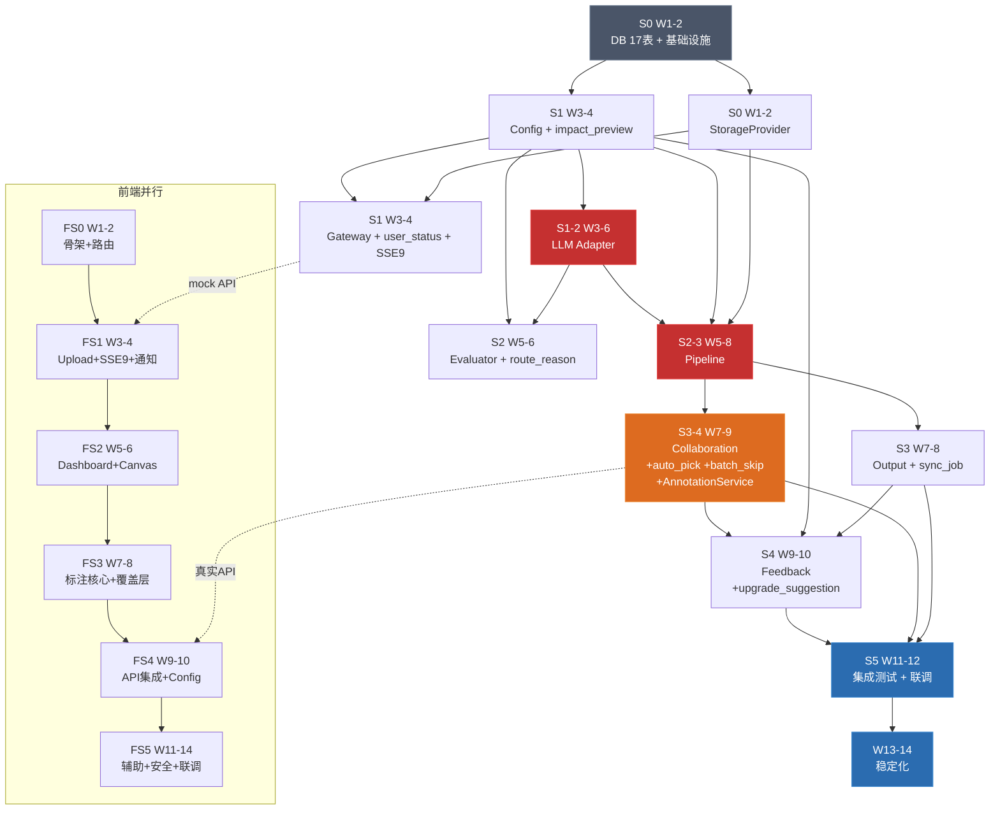

# PDF-SKU 系统实现排期

> **版本**: V1.2（对齐 OpenAPI V2.0 + 前端详设 V1.1 + 接口契约 V1.2）  
> **团队假设**: 3 名后端开发 + 1 名前端 + 1 名 QA  
> **Sprint 周期**: 2 周 / Sprint  
> **依据**: 各模块详设 V1.1/V1.2 + DDL V1.2（18 表）+ OpenAPI V2.1（62 端点）+ 前端详设 V1.1（31 评审修复 + 15 V2.0 对齐）

---

## V1.2 变更记录

| 变更项 | V1.0 | V1.2 | 增量原因 |
|--------|------|------|---------|
| DB 表数 | 15 | 18 | +custom_attr_upgrades, +worker_heartbeats, +users [V2.1] |
| Migration 数 | 8 | 13 | +009~013 V1.2 增量 |
| SSE 事件 | 7 | 9 | +heartbeat, +pages_batch_update |
| API 端点 | ~40 | 62 | +/tasks/next, +/annotations, +/ops/custom-attr-upgrades, +batch-skip, +/auth/* 9 端点 [V2.1] |
| 后端总人天 | 74d | 82d | +8d（+11%）：Gateway 双轨状态/SSE、Collaboration auto_pick/batch、Feedback 升级建议 |
| 前端总人天 | 50d | 64d | +14d（+28%）：31 评审修复 + 15 V2.0 对齐 |
| 后端并行周数 | 10 | 11 | +1 周缓冲吸收 V2.0 增量 |
| 前端并行周数 | 10 | 13 | 前端 S0~S5 六个 Sprint，与后端 S0 对齐起步 |

---

## 1. 模块工作量估算

### 1.1 后端

| # | 模块 | 设计行数 | 预估代码行数 | V1.0 人天 | V1.2 人天 | 增量说明 | 复杂度 | 前置依赖 |
|---|------|---------|------------|----------|----------|---------|--------|---------|
| 0 | **DB + 基础设施** | — | ~600 | 3d | **3.5d** | +3 表, +5 migration (+users) | 低 | — |
| 0.5 | **Auth [V2.1]** | — | ~500 | — | **1.5d** | User 模型 + JWT(python-jose) + 密码哈希 + RBAC + 9 个端点 | 低 | DB |
| 1 | **Config** | 429 | ~900 | 4d | **4.5d** | +impact_preview API | 中 | DB |
| 2 | **LLM Adapter** | 2900 | ~2900 | 12d | 12d | 无变更 | **高** | Config |
| 3 | **Gateway** | 1423 | ~2800 | 8d | **9.5d** | +user_status 同步, +SSE 9 事件, +worker_heartbeats | 中 | Config, Storage |
| 4 | **Evaluator** | 677 | ~1300 | 6d | **6.5d** | +route_reason/thresholds_used 输出 | 中 | Config, LLM Adapter |
| 5 | **Pipeline** | 1696 | ~3500 | 14d | 14d | 无结构变更 | **高** | LLM Adapter, Config, Storage, Parser |
| 6 | **Collaboration** | 605 | ~1500 | 6d | **8d** | +auto_pick_next, +batch_skip, +AnnotationService, +批量 API | 中高 | Pipeline (PageResult DTO) |
| 7 | **Output** | 555 | ~1200 | 5d | **5.5d** | +sync_job, +import_confirmation 4 态 | 中 | Pipeline (PageResult DTO) |
| 8 | **Feedback** | 415 | ~850 | 3d | **4d** | +submit_upgrade_suggestion, +custom_attr_upgrades | 低 | Config, Collaboration |
| 9 | **集成测试 + E2E** | — | ~2200 | 8d | **9d** | +auto_pick/batch 场景, +SSE 9 事件验证 | 高 | 全部模块 |
| 10 | **联调 + 修复** | — | — | 5d | **5.5d** | V2.0 增量缓冲 | — | 集成测试 |
| | **后端合计** | — | **~17750** | **74d** | **82d** | **+8d (+11%)** | | |

### 1.2 前端

| Sprint | 内容 | V1.0 人天 | V1.2 人天 | 增量说明 |
|--------|------|----------|----------|---------|
| FS0 | 骨架 + 路由 + Token + Auth + settingsStore | 3d | 3d | — |
| FS1 | Upload（tus + 回滚 + hashWorker 超时）+ SSE（9 事件 + 动态轮询）+ 通知三级 | 7d | **9d** | +SSE 2 新事件, +hashWorker 超时, +tus 回滚, +三级通知 |
| FS2 | Dashboard（双轨状态 + action_hint + 批量 API + 详情增强）| 6d | **8d** | +ActionHintBadge, +PrescanCard raw_metrics, +EvaluationCard |
| FS2 | Canvas 引擎（ResizeObserver + 离屏背景 + 坐标系修复）| 4d | **5d** | +D1/D2/D5 修复 |
| FS3 | 覆盖层（transform3d + 事件委托）+ 套索 + 快捷键 + 右栏编辑 + DOMPurify | 9d | **9d** | D3/D4 重构但不增加净工期 |
| FS3 | ContextMenu（3 种上下文）+ BatchActionFloater + 跨页合并 + SLA | 5d | **6d** | +A1/A5 新组件 |
| FS4 | 心跳降级 + 锁管理 + 预加载 + /tasks/next + POST /annotations | 4d | **5d** | +auto_pick, +annotation 独立端点 |
| FS4 | Config（ImpactPreview debounce + 审计日志 + 回滚）| 3d | **4d** | +B2 ImpactPreview 集成 |
| FS5 | 标注员 + 评测报告 + 运维页（custom-attr-upgrades）| 3d | **4d** | +B5 评测 API, +运维页 |
| FS5 | 新手引导 + 休息提醒 + skipSubmitConfirm + 安全加固 + ARIA + forced-colors | 3d | **4d** | +A3/A4/A6/G1~G4 |
| FS5 | 性能优化（longtask + SW 版本化 + 降级）+ 联调缓冲 | 3d | **7d** | +F1/F2/F3 + 联调增量 |
| | **前端合计** | **50d** | **64d** | **+14d (+28%)** |

### 1.3 总工时

| 角色 | V1.0 | V1.2 | 并行周数 |
|------|------|------|---------|
| 后端（3 人） | 74d → ~25 有效日 | 82d → ~28 有效日 | **11 周**（5.5 Sprint） |
| 前端（1 人） | 50d | 64d | **13 周**（6.5 Sprint） |
| QA（1 人） | 含在后端 Sprint | 含在后端 Sprint + 前端验收 | **13 周** |
| **总日历** | **12 周** | **14 周** | 前端为关键路径尾巴 |

---

## 2. 依赖关系图



---

## 3. Sprint 排期明细

### Sprint 0（第 1-2 周）— 基础设施

**目标**: DB 17 表建表 + 基础框架 + 横切组件 + 前端骨架同步启动

| 任务 | 负责人 | 人天 | 交付物 | V1.2 变更 |
|------|--------|------|--------|----------|
| PostgreSQL DDL 全量执行（Migration 001-008）+ Alembic | Dev-A | 1.5d | 15 张主表 + 索引 | — |
| **V1.2 增量 Migration（009-013）** | Dev-A | **0.5d** | +user_status/action_hint, +route_reason, +custom_attr_upgrades, +worker_heartbeats | **[V1.2]** |
| Redis 初始化 + Key 命名规范验证 | Dev-A | 0.5d | Redis 连接池 + Key 模板（+task:next:lock） | — |
| StorageProvider（LocalStorageProvider V1） | Dev-B | 1.5d | 文件读写 + 目录结构 | — |
| common 基础包：exceptions + schemas + DTO | Dev-B | 1.5d | 异常体系 + **V2.0 核心 DTO** | user_status/action_hint DTO |
| FastAPI 项目骨架 + 健康检查 + Dockerfile | Dev-C | 1.5d | 可启动的空壳服务 | — |
| Prometheus + Langfuse 接入桩 | Dev-C | 1.5d | 指标注册 + trace 桩 | — |
| **QA**: 测试框架搭建（pytest + testcontainers） | QA | 2d | conftest + DB fixture（17 表） | — |
| **前端 FS0**: 项目骨架 + 路由 + Token + Auth (Login/Register/RequireAuth/UserManage) + settingsStore (ProfileCard + ChangePasswordCard) | FE | 3d | 前端空壳可运行 | +settingsStore +authStore(persist) [V2.1] |

**Sprint 0 产出**: 后端项目骨架 + DB 18 表就绪 + Auth 模块可用 + 前端骨架可运行

---

### Sprint 1（第 3-4 周）— Config + Gateway + LLM Adapter 启动

**目标**: 配置中心上线 + 入口层可用（含 V2.0 双轨状态 + 9 种 SSE 事件）+ LLM Adapter 核心

| 任务 | 负责人 | 人天 | 交付物 | V1.2 变更 |
|------|--------|------|--------|----------|
| **Config 全量** | Dev-A | 4d | ProfileManager + PubSub + 热更新 | — |
| **Config: impact_preview API** | Dev-A | **0.5d** | GET /config/profiles/{id}/impact-preview | **[V1.2]** |
| **Gateway: TusHandler + Validator + Security** | Dev-B | 4d | 上传 + 校验 + 安全检查 | — |
| Gateway: Prescanner + JobFactory + **user_status 同步** | Dev-B | **3.5d** | 预筛 + Job 创建 + **compute_user_status()** | **[V1.2]** |
| Gateway: **SSE 9 事件** + OrphanScanner + **worker_heartbeats** | Dev-B | **2d** | 事件推送 9 种 + 孤儿检测 + 心跳表 | **[V1.2]** |
| **LLM Adapter: client 层** | Dev-C | 3d | 模型客户端 + 注册表 | — |
| **LLM Adapter: circuit_breaker + rate_limiter** | Dev-C | 3d | Redis Lua 熔断 + 限流 | — |
| LLM Adapter: budget_guard | Dev-C | 2d | 预算三阶段 | — |
| **QA**: Gateway API 测试 + Config API 测试 | QA | 3d | 上传/创建 Job/**user_status 验证**/配置 CRUD/**impact_preview** | **[V1.2]** |
| **前端 FS1**: Upload（tus + 回滚 + hashWorker）+ SSE 9 事件 + 通知三级 | FE | 9d | 上传 + SSE + 通知中心 | **[V1.2]** |

**Sprint 1 产出**: Config 可用（+impact_preview）/ Gateway 可接收 PDF + **双轨状态** + **SSE 9 事件** / LLM Adapter 底层就绪 / 前端 Upload+SSE 可用

---

### Sprint 2（第 5-6 周）— LLM Adapter 完成 + Evaluator + Pipeline 启动

**目标**: LLM 调用链路完整闭环 + 评估可用（含 route_reason）+ Pipeline 核心

| 任务 | 负责人 | 人天 | 交付物 | V1.2 变更 |
|------|--------|------|--------|----------|
| **LLM Adapter: prompt 层** | Dev-A | 3d | Prompt 渲染 + 防注入 | — |
| **LLM Adapter: parser + service** | Dev-A | 3d | 4 级 fallback + 分层重试 | — |
| LLM Adapter: observability | Dev-A | 1.5d | Langfuse + Prometheus | — |
| LLM Adapter 单元测试 | Dev-A | 1.5d | 熔断/限流/预算/解析 | — |
| **Evaluator 全量** | Dev-B | 5d | Sampler + Scorer + Router + Cache + 降级 | — |
| **Evaluator: +route_reason +thresholds_used +evaluated_at** | Dev-B | **0.5d** | Evaluation 输出增强 | **[V1.2]** |
| Evaluator 单元测试 | Dev-B | 1d | 采样/路由/缓存 | — |
| **Pipeline: parser 层** | Dev-C | 3d | PDF 解析 + 特征提取 | — |
| **Pipeline: classifier 层** | Dev-C | 3d | 4 个分类器对接 LLM | — |
| Pipeline: chunking + cross_page_merger | Dev-C | 2d | 分片 + 跨页表格 | — |
| **QA**: LLM Adapter 集成测试 | QA | 2d | 熔断降级/限流/重试 E2E | — |
| **前端 FS2**: Dashboard（双轨+action_hint+批量）+ Canvas 引擎 | FE | 13d | 看板 + Canvas 核心 | **[V1.2]** |

**Sprint 2 产出**: LLM Adapter 完整可用 / Evaluator 完整可用（+route_reason）/ Pipeline 解析+分类阶段可用 / 前端 Dashboard+Canvas 可用

---

### Sprint 3（第 7-8 周）— Pipeline 完成 + Output + Collaboration 启动

**目标**: Pipeline 全链路 + 增量导入 + 人工任务创建（含 auto_pick_next + AnnotationService）

| 任务 | 负责人 | 人天 | 交付物 | V1.2 变更 |
|------|--------|------|--------|----------|
| **Pipeline: SKU 提取** | Dev-A | 4d | 两阶段提取 + 校验 | — |
| **Pipeline: 绑定 + ID 生成 + 导出** | Dev-A | 2.5d | SKU-图片绑定 + 导出 | — |
| **Pipeline: orchestrator** | Dev-A | 2.5d | 编排器 + checkpoint + 终态 | — |
| Pipeline 单元测试 | Dev-A | 1d | 各阶段 + orchestrator | — |
| **Output 全量** | Dev-B | 5d | JSON 组装 + 增量导入 + 对账 + 终态 | — |
| **Output: +sync_job + import_confirmation 4 态** | Dev-B | **0.5d** | POST /jobs/{id}/sync + 确认状态扩展 | **[V1.2]** |
| Output: ImportAdapter + 背压 + recovery | Dev-B | 2d | 下游适配 + 降速 | — |
| Output 单元测试 | Dev-B | 1d | 幂等/对账/终态 | — |
| **Collaboration: LockManager + TaskDispatcher** | Dev-C | 3d | SKIP LOCKED + 智能派单 | — |
| **Collaboration: auto_pick_next (SKIP LOCKED 原子领取)** | Dev-C | **1d** | POST /tasks/next 实现 | **[V1.2]** |
| Collaboration: SLAMonitor + HeartbeatScanner | Dev-C | 2d | 超时升级 + 锁过期回收 | — |
| Collaboration: AnnotationHandler + RevertManager | Dev-C | 2d | 标注采集 + 回退 | — |
| **QA**: Pipeline 端到端测试 | QA | 3d | A/B/C/D 类页面全覆盖 | — |
| **前端 FS3**: 覆盖层+套索+快捷键+右栏+ContextMenu+BatchFloater | FE | 15d | 标注核心交互 | **[V1.2]** |

**Sprint 3 产出**: Pipeline 全链路完成 / Output 增量导入可用（+sync_job）/ Collaboration 任务分配+锁管理+**auto_pick_next** 可用 / 前端标注核心可用

---

### Sprint 4（第 9-10 周）— Collaboration 完成 + Feedback + 集成

**目标**: 人机协作闭环 + 反馈校准（含属性升级建议）+ 全链路集成

| 任务 | 负责人 | 人天 | 交付物 | V1.2 变更 |
|------|--------|------|--------|----------|
| **Collaboration: +batch_skip + batch_reassign + AnnotationService** | Dev-A | **2d** | POST /ops/tasks/batch-skip + POST /annotations | **[V1.2]** |
| Collaboration 集成测试 | Dev-A | 1.5d | 领取→标注→完成→回退→**auto_pick→batch_skip** | **[V1.2]** |
| **Feedback 全量** | Dev-A | 3d | CalibrationEngine + PromotionChecker + FewShotSync | — |
| **Feedback: +submit_upgrade_suggestion + custom_attr_upgrades** | Dev-A | **1d** | 升级建议写入 + /ops/custom-attr-upgrades | **[V1.2]** |
| **全链路集成测试** | Dev-B | 3d | 5 种端到端场景 + **双轨状态验证** | **[V1.2]** |
| 跨模块状态机验证 | Dev-B | 2d | Job/Page/SKU 终态一致性 + **INV-10~12** | **[V1.2]** |
| 定时任务全量部署 + 测试 | Dev-C | 2d | 10 个定时任务调度（含 PromotionChecker→custom_attr_upgrades）| **[V1.2]** |
| 性能基准测试 | Dev-C | 2d | 100 PDF/天模拟 | — |
| **QA**: 验收测试用例执行 | QA | 4d | BRD 功能覆盖 + **V2.0 53 端点覆盖** | **[V1.2]** |
| Bug 修复缓冲 | 全员 | 3d | — | — |
| **前端 FS4**: 心跳+锁+预加载+/tasks/next+/annotations+Config | FE | 9d | API 集成层 | **[V1.2]** |

**Sprint 4 产出**: Feedback 闭环（+属性升级建议）/ 全链路跑通 / **所有 V2.0 新端点集成** / 性能基准 / 前端 API 集成完成

---

### Sprint 5（第 11-12 周）— 稳定化 + 前端收尾

**目标**: 后端生产就绪 + 前端辅助功能 + 安全加固

| 任务 | 负责人 | 人天 | 交付物 | V1.2 变更 |
|------|--------|------|--------|----------|
| Bug 修复 + 边界场景 | 全员 | 5d | — | — |
| 运维文档 | Dev-A | 2d | 部署/回滚/监控告警/密钥轮换 | — |
| Grafana 大盘 + 告警规则 | Dev-B | 2d | **含 user_status 分布面板 + SSE 连接数** | **[V1.2]** |
| 灰度发布方案 + 回滚演练 | Dev-C | 2d | 发布 SOP | — |
| **QA**: 回归测试 + 压测 | QA | 4d | 测试报告 | — |
| 上线评审 | 全员 | 1d | Go/No-Go checklist | — |
| **前端 FS5a**: 标注员+评测报告+运维页+新手引导+休息提醒+设置 | FE | 8d | 辅助功能模块 | **[V1.2]** |
| **前端 FS5b**: 安全（DOMPurify+ARIA+forced-colors）+ 性能（longtask+SW） | FE | 4d | 安全+性能 | **[V1.2]** |

---

### Sprint 5 延长（第 13-14 周）— 前端联调 + 全端验收

**目标**: 前后端联调闭环 + 全端验收

| 任务 | 负责人 | 人天 | 交付物 |
|------|--------|------|--------|
| **前端 FS5c**: 前后端联调 + Bug 修复缓冲 | FE | 7d | 前端稳定 |
| 后端: 前端联调配合 + 生产环境 hotfix | Dev-A/B/C | 3d（轮值） | API 兼容性修复 |
| **QA**: 全端回归 + UAT | QA | 5d | 全端测试报告 |
| 全端上线评审 | 全员 | 1d | Go/No-Go |

---

## 4. 里程碑总览

```
Week  1  2  3  4  5  6  7  8  9  10  11  12  13  14
      ├──S0──┤  ├──S1──┤  ├──S2──┤  ├──S3──┤  ├──S4──┤  ├──S5──────────┤
后端  基础设施   Config   LLM完成  Pipeline  集成闭环  稳定+文档
                Gateway   Evaluator 完成     Feedback  Grafana
                LLM启动   Pipeline  Output   验收测试
                          启动     Collab
─────────────────────────────────────────────────────────────────────────
前端  骨架      Upload    Dashboard 标注核心  API集成   辅助+安全  联调
      (FS0)    SSE+通知  +Canvas   交互      Config   性能优化   验收
               (FS1)     (FS2)     (FS3)     (FS4)    (FS5a/b)  (FS5c)
```

| 里程碑 | 时间 | 验收标准 | V1.2 新增验收 |
|--------|------|---------|-------------|
| **M0**: 骨架就绪 | W2 末 | DB **18** 表就绪 + Auth 可用，前后端可启动 | +custom_attr_upgrades, +worker_heartbeats, +users [V2.1] |
| **M1**: 入口层就绪 | W4 末 | 可上传 PDF 并创建 Job | +**user_status 双轨** + **SSE 9 事件** + **impact_preview** |
| **M2**: AI 链路跑通 | W6 末 | PDF → 评估 → 分类 | +**route_reason** 输出可验证 |
| **M3**: 全链路跑通 | W8 末 | PDF → SKU 导入（含人工路径）| +**auto_pick_next** + **sync_job** |
| **M4**: 功能冻结 | W10 末 | 全部 BRD 功能覆盖 | +**AnnotationService** + **batch_skip** + **custom_attr_upgrades 审核** |
| **M5**: 后端生产就绪 | W12 末 | 监控/告警/回滚就绪 | +**user_status Grafana 面板** |
| **M6**: 全端上线 | **W14 末** | 前后端联调完成，灰度上线 | +前端 31 评审修复 + 15 V2.0 对齐 |

---

## 5. 风险与缓冲

| 风险 | 概率 | 影响 | 缓解措施 |
|------|------|------|---------|
| LLM API 配额不足或不稳定 | 高 | Pipeline 阻塞 | Sprint 2 即部署 mock LLM，真实 API 仅在集成测试阶段接入 |
| Pipeline 复杂度超预期 | 中 | Sprint 3 延期 | SKU 提取优先单阶段兜底，两阶段作为增量优化 |
| 下游导入接口未就绪 | 中 | Output 阻塞 | ImportAdapter 预留 mock 实现，对账轮询照常开发 |
| 跨页表格场景多样性 | 中 | 绑定准确率低 | V1 限定 lookback=10 页，复杂场景降级人工 |
| 团队对 Redis Lua 不熟悉 | 低 | 熔断/限流 bug | LLM Adapter 已提供完整 Lua 脚本，直接使用 |
| **[V1.2] 前端评审修复超预期** | **中** | **前端 FS5 延期** | **31 项评审 P0/P1 优先，P2 可降级到 V1.2 后续迭代** |
| **[V1.2] auto_pick_next 并发热点** | **中** | **标注任务领取冲突** | **SKIP LOCKED 原子性保证 + Redis 锁降级** |

---

## 6. 并行度分析

| Sprint | Dev-A | Dev-B | Dev-C | FE | QA | 利用率 |
|--------|-------|-------|-------|----|----|--------|
| S0 | DB + Redis + **Migration V1.2** | Storage + common + **V2.0 DTO** | 骨架 + 可观测 | **FS0: 骨架** | 测试框架 | 100% |
| S1 | Config + **impact_preview** | Gateway + **user_status** + **SSE 9** | LLM Adapter (底层) | **FS1: Upload+SSE** | GW + Config 测试 | 100% |
| S2 | LLM Adapter (上层) | Evaluator + **route_reason** | Pipeline (解析+分类) | **FS2: Dashboard+Canvas** | LLM 集成测试 | 100% |
| S3 | Pipeline (SKU+编排) | Output + **sync_job** | Collab + **auto_pick** | **FS3: 标注核心** | Pipeline E2E | 100% |
| S4 | **batch_skip** + Feedback + **upgrade** | 全链路集成 + **INV-10~12** | 定时任务+性能 | **FS4: API集成** | 验收测试 | 100% |
| S5 | 运维文档 | Grafana + **user_status面板** | 发布方案 | **FS5a/b: 辅助+安全** | 回归+压测 | 90% |
| S5+ | 联调配合（轮值） | — | — | **FS5c: 联调** | **全端 UAT** | 70% |

**关键路径**: DB → Config → LLM Adapter → Pipeline → 集成测试 → 后端稳定（W12）→ 前端联调（W14）

后端 3 人全程满载，QA 从 Sprint 1 持续介入。前端 Sprint 5 尾巴为整体关键路径，通过 W13-14 联调收尾吸收。

---

## 7. V1.0 → V1.2 变更追溯

| 文档 | V1.0 行数 | V1.2 行数 | 变更来源 |
|------|----------|----------|---------|
| DDL | 559 | 674 | +custom_attr_upgrades, +worker_heartbeats, +Migration 009-013 |
| 接口契约 | 367 | 470 | +auto_pick_next, +batch_skip, +AnnotationService, +upgrade_suggestion, +SSE 9 事件, +INV-10~12 |
| 排期 | 245 | **本文** | 后端 74d→82d, 前端 50d→64d, 12 周→14 周 |

**三份文档均基于同一权威源**: OpenAPI V2.0（53 端点 / 30 schemas）+ 前端详设 V1.1（31 评审修复）+ 后端详设 V1.1 + TA V1.6
