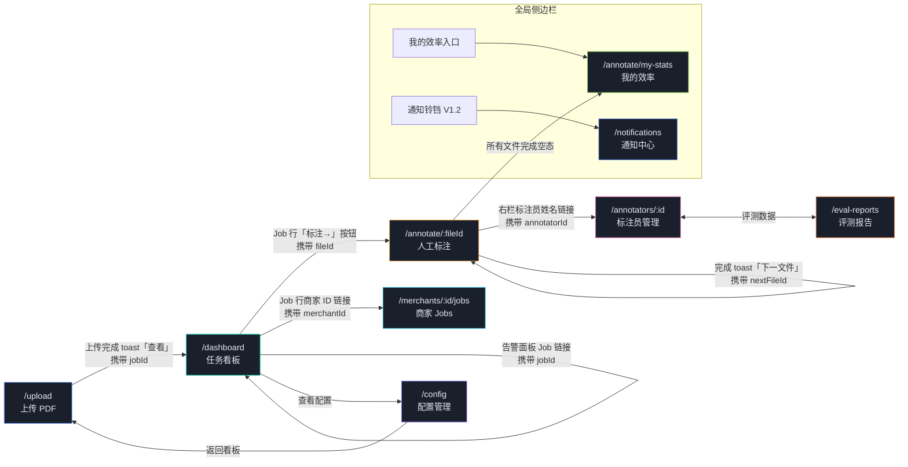
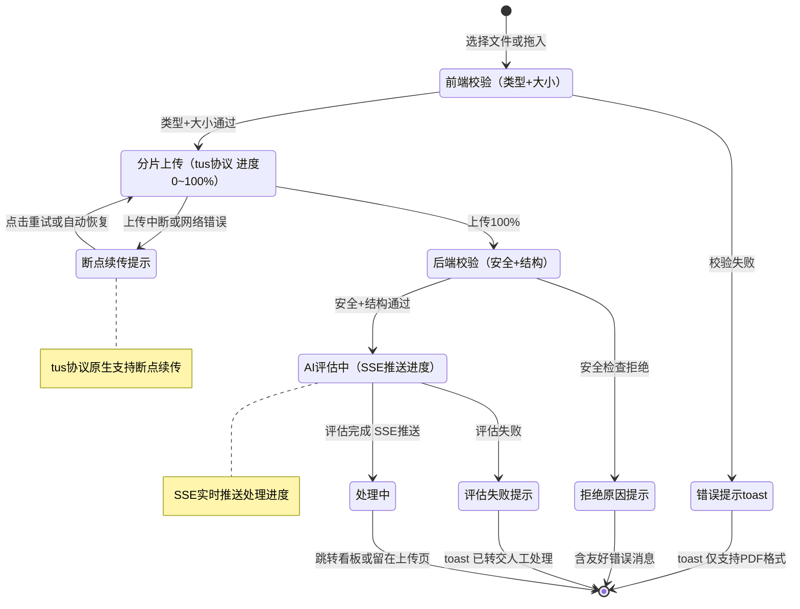

# PDF 分类与 SKU 提取系统 — UI/UX 规范文档

> **版本**: V1.3  
> **日期**: 2026-02-13  
> **对齐文档**: BRD V2.1 · BA V1.1 · TA V1.6  
> **适用范围**: 前端工程团队、交互设计、QA  
> **V1.3 变更**: 4 轮评审反馈合并（28 项去重），新增 §6.12 绑定歧义解决界面 / §6.13 SLA 熔断可视化 / §6.14 AI 辅助工具 / §9.6 性能自适应降级 / 附录F QA清单 / 附录G 性能预算，修订 §1.1/§2.1/§2.2/§3.2~3.4/§5.3/§5.6/§6.3~6.5/§6.10/§7.2/§7.3/§8.3~8.5/§10/§12/§15/附录E  
> **V1.2 变更**: 26 项用户×设计师双视角评审合并（6 ★★★ + 12 ★★☆ + 8 ★☆☆），新增 §2.7/§3.5/§3.6/§3.7/§5.7/§6.10/§6.11/§9.5/附录D/附录E，修改 §1.1/§2.1/§3.1~3.4/§5.3/§5.6/§6.3~6.5/§6.8/§12/§15.2/§16.3  
> **V1.1 变更**: 15 项评审修复，新增 §5.6/§6.8/§15/§16/附录B/附录C，修改 §4.2/§5.3/§6.3/§6.5/§6.6/§8

---

## 1. 信息架构

### 1.1 页面层级与路由定义

```
/                                     → 角色自适应首页 [V1.2 修订]
│                                       Operator/Admin → /dashboard
│                                       Annotator → /annotate
├── /upload                           → 上传 PDF（模块一）
├── /dashboard                        → 自动化任务看板（模块二）
│   └── /dashboard/:jobId             → Job 详情页（§5.6）[V1.1 补全]
├── /annotate                         → 人工标注工作台（模块三）
│   ├── /annotate/my-stats            → 标注员个人效率面板 [V1.1 新增]
│   ├── /annotate/history             → 标注历史回看 [V1.1 新增]
│   └── /annotate/:fileId             → 指定文件标注（自动选中该文件）
│       └── /annotate/:fileId/:pageNo → 指定页面标注（深度链接）
├── /merchants/:merchantId/jobs       → 商家维度 Job 汇总（§5.7）[V1.1 新增]
├── /config                           → 配置管理（§15）[V1.1 补全]
│   └── /config/:profileId            → 配置详情编辑
├── /annotators                       → 标注员管理（§16）[V1.1 补全]
│   └── /annotators/:id               → 标注员详情
├── /eval                             → 评测报告
│   └── /eval/:reportId               → 报告详情
├── /notifications                    → 通知中心 [V1.2 新增]
└── /settings                         → 系统设置
```

### 1.2 角色与权限矩阵

| 页面/功能 | 运营（Operator） | 标注员（Annotator） | 研发/运维（Admin） |
|-----------|:-:|:-:|:-:|
| 上传 PDF | ✓ | ✗ | ✓ |
| 任务看板 | ✓（只读） | ✗ | ✓ |
| Job 详情 | ✓ | ✗ | ✓ |
| 人工标注（领取/提交） | ✗ | ✓ | ✓ |
| 人工标注（批量重分配） | ✗ | ✗ | ✓ |
| 标注员个人面板 | ✗ | ✓（仅自己） | ✓ |
| 标注历史回看 | ✗ | ✓（仅自己） | ✓ |
| 撤销已完成任务 revert | ✗ | 仅组长 | ✓ |
| 配置管理（查看） | ✓ | ✗ | ✓ |
| 配置管理（编辑） | ✗ | ✗ | ✓ |
| 标注员管理 | ✓ | ✗ | ✓ |
| 评测报告 | ✓ | ✗ | ✓ |
| 触发评测 | ✗ | ✗ | ✓ |
| 孤儿 Job 重提 requeue | ✗ | ✗ | ✓ |
| 商家维度 Job 汇总 | ✓ | ✗ | ✓ |

> 对齐 BRD §2 角色定义。

### 1.3 模块间跳转关系



| 触发点 | 来源页 | 目标页 | 携带参数 |
|--------|--------|--------|----------|
| 上传完成 toast 中"查看" | /upload | /dashboard/:jobId | jobId |
| Job 行的"标注→"按钮 | /dashboard | /annotate/:fileId | fileId |
| Job 行的 Job ID 链接 | /dashboard | /dashboard/:jobId | jobId |
| Job 行的商家 ID 链接 | /dashboard | /merchants/:merchantId/jobs | merchantId |
| 标注完成 toast 中"下一文件" | /annotate | /annotate/:nextFileId | nextFileId |
| 告警条目中的 Job 链接 | /dashboard（告警面板） | /dashboard/:jobId | jobId |
| 标注员姓名链接 | /annotate（右栏） | /annotators/:id | annotatorId |
| 侧边栏"我的效率"入口 | 全局 | /annotate/my-stats | — |
| 侧边栏通知铃铛 | 全局 | /notifications | — | `[V1.2 新增]`
| 所有文件完成空态 | /annotate | /annotate/my-stats | — | `[V1.2 新增]`

---

## 2. 设计系统（Design Tokens）

### 2.1 颜色体系

#### 基础色板

| Token | 值 | 用途 |
|-------|-----|------|
| `--bg-root` | `#0B0D12` | 应用根背景 |

> **实现容差与 CI 校验** `[V1.3 新增]`：代码实现中色值允许 ΔE2000 ≤ 2.0 的微小偏差（如 #0C0F14 vs #0B0D12 属可接受范围），但语义色（success/error/warning/info）必须精确匹配。CI 流水线中应集成 `stylelint-design-token-validator`（或等效工具），在每次构建时校验 CSS 变量值是否与本文档 §2.1 一致。分组色池数组（§2.1 分组色）应作为共享常量（`shared/design-tokens.ts`）由前端和测试共同引用。
| `--bg-panel` | `#11141B` | 面板/卡片背景 |
| `--bg-panel-alt` | `#161A24` | 面板交替背景（缩略图、表格偶数行） |
| `--bg-hover` | `#1C2230` | 悬浮态背景 |
| `--bd-primary` | `#222938` | 主边框 |
| `--bd-secondary` | `#1A1F2C` | 次级边框（分割线、嵌套面板） |
| `--text-primary` | `#E2E8F4` | 主文本 |
| `--text-secondary` | `#7D8BA0` | 辅助文本（标签、说明文字） |
| `--text-muted` | `#5C6A82` | 弱化文本（占位符、时间戳）`[V1.2 修订：#4A5468→#5C6A82 提升对比度至 ≥ 3.2:1]` |

#### 对比度验证速查表 `[V1.2 新增]`

所有前景/背景组合需满足 WCAG 2.1 AA 标准：正文 ≥ 4.5:1，大字/粗体 ≥ 3:1。

| 前景 | 背景 | 对比度 | 达标 | 用途 |
|------|------|--------|:---:|------|
| `--text-primary` (#E2E8F4) | `--bg-panel` (#11141B) | 13.8:1 | ✓ | 主文本 |
| `--text-secondary` (#7D8BA0) | `--bg-panel` (#11141B) | 4.9:1 | ✓ | 辅助文本 |
| `--text-muted` (#5C6A82) | `--bg-panel` (#11141B) | 3.2:1 | ✓ (large) | 占位符（仅限 ≥12px 或粗体） |
| `--color-success` (#00D4AA) | `--bg-panel` (#11141B) | 8.5:1 | ✓ | Tag、状态 |
| `--color-warning` (#FFB547) | `--bg-panel` (#11141B) | 9.2:1 | ✓ | Tag、状态 |
| `--color-error` (#FF5A65) | `--bg-panel` (#11141B) | 5.4:1 | ✓ | Tag、状态 |
| `--color-info` (#5B8DEF) | `--bg-panel` (#11141B) | 5.1:1 | ✓ | Tag、状态 |
| nano 8px 文字 | 任何背景 | — | ⚠ | 仅限 Retina（devicePixelRatio ≥ 2）；非 Retina 降级至 micro 9px `[V1.2]` |

#### 语义色

| Token | 值 | 填充色（10%透明） | 语义 |
|-------|-----|-------------------|------|
| `--color-success` | `#00D4AA` | `rgba(0,212,170,0.10)` | 成功、全自动、完成、高置信度 |
| `--color-info` | `#5B8DEF` | `rgba(91,141,239,0.10)` | 信息、处理中、图片类元素 |
| `--color-warning` | `#FFB547` | `rgba(255,181,71,0.10)` | 警告、待处理、部分完成、人工队列 |
| `--color-error` | `#FF5A65` | `rgba(255,90,101,0.10)` | 错误、失败、无效、未分组 |
| `--color-purple` | `#A78BFA` | `rgba(167,139,250,0.10)` | 套索工具、营销内容 |
| `--color-pink` | `#F472B6` | — | 绑定工具、场景图 |
| `--color-cyan` | `#22D3EE` | — | 表格区域、细节图 |

#### 分组色（自动分配）

标注工作台中元素分组的颜色从以下 10 色池按序分配 `[V1.2 修订：优化色相间距 + 色盲安全]`：

```
#00D4AA → #5B8DEF → #FFB547 → #A78BFA → #F472B6
→ #22D3EE → #FF5A65 → #8BD346 → #FF8C42 → #C084FC
```

> V1.2 变更：原 `#86EFAC/#FCA5A5/#93C5FD` 三色与主池色系过近（绿-浅绿、红-浅红、蓝-浅蓝），替换为色相差异更大的 `#8BD346`（黄绿）、`#FF8C42`（橙色）、`#C084FC`（紫罗兰）。

超过 10 组时循环使用。分组色仅用于视觉区分，不携带语义。

**辅助区分手段** `[V1.2 新增]`：

颜色不是唯一的区分方式，同时使用以下辅助编码确保色盲用户可区分：

| 分组序号 | 颜色 | 编号标签 | 线型 |
|---------|------|---------|------|
| 1 | #00D4AA | ① | 实线 |
| 2 | #5B8DEF | ② | 实线 |
| 3 | #FFB547 | ③ | 虚线 |
| 4 | #A78BFA | ④ | 虚线 |
| 5 | #F472B6 | ⑤ | 点线 |
| 6 | #22D3EE | ⑥ | 点线 |
| 7 | #FF5A65 | ⑦ | 点划线 |
| 8 | #8BD346 | ⑧ | 点划线 |
| 9 | #FF8C42 | ⑨ | 双虚线 |
| 10 | #C084FC | ⑩ | 双虚线 |

编号标签显示在 GroupBoundingBox 顶部标签左侧。线型应用于 GroupBoundingBox 边框（选中态统一为实线 + 加粗）。色盲模式（设置项）下自动启用编号+线型辅助。

> **色盲验证要求**：上线前需使用 Sim Daltonism 或 Chromatic Vision Simulator 验证 Protanopia（红色盲）和 Deuteranopia（绿色盲）模式下所有分组可区分。**CI 自动化** `[V1.3 新增]`：在 CI 流水线中集成 Chromatic Vision Simulator 截图对比（如 `@axe-core/playwright` + 色盲模拟插件），对标注工作台核心页面自动生成 Protanopia/Deuteranopia 模拟截图并人工审查。特别关注分组 1（#00D4AA 绿）与分组 8（#8BD346 黄绿）的区分度。

### 2.2 字体系统

| Token | 字体栈 | 用途 |
|-------|--------|------|
| `--font-mono` | `'JetBrains Mono', 'SF Mono', 'Consolas', monospace` | ID、数值、状态码、坐标、置信度、代码 |
| `--font-sans` | `'DM Sans', 'Noto Sans SC', system-ui, sans-serif` | UI 文本、标签、按钮、说明 |

#### 字号规范

| 级别 | 大小 | 行高 | 字重 | 典型场景 |
|------|------|------|------|----------|
| display | 24px | 1.2 | 700 | 仪表盘核心指标数值 |
| title | 15px | 1.4 | 700 | 页面标题 |
| subtitle | 13px | 1.4 | 600 | 模块标题 |
| body | 12px | 1.5 | 400 | 表格内容、说明文字 |
| body-strong | 12px | 1.5 | 600 | 表格重点字段、导航项 |
| caption | 11px | 1.5 | 400 | 表格单元格 |
| label | 10px | 1.4 | 600 | Tag 标签、按钮文字、字段标签 |
| micro | 9px | 1.3 | 600 | Bbox 标注、缩略图页码、区域类型 |
| nano | 8px | 1.2 | 600 | 画布元素内联标注（IMG/TXT）、置信度 |

> **nano 字号 Retina 降级实现** `[V1.3 新增]`：
> ```css
> .text-nano {
>   font-size: 8px;
>   line-height: 1.2;
> }
> @media (-webkit-max-device-pixel-ratio: 1.5), (max-resolution: 144dpi) {
>   .text-nano { font-size: 9px; /* 降级为 micro */ }
> }
> ```
> 非 Retina 屏幕（devicePixelRatio < 1.5）自动升至 9px，确保可读性。

### 2.3 间距系统

基础单位 4px，所有间距为 4 的倍数。

| Token | 值 | 用途 |
|-------|-----|------|
| `--space-1` | 4px | 紧凑间距（Tag 内 padding、图标与文字间距） |
| `--space-2` | 8px | 小间距（面板内 padding、列表项间距） |
| `--space-3` | 12px | 中间距（卡片间距、工具栏 padding） |
| `--space-4` | 16px | 大间距（模块间距、页面 padding） |
| `--space-6` | 24px | 段落间距（模块标题与内容之间） |

### 2.4 圆角

| 级别 | 值 | 用途 |
|------|-----|------|
| `--radius-sm` | 3px | Tag、缩略图、小按钮 |
| `--radius-md` | 6px | 按钮、输入框、工具栏项 |
| `--radius-lg` | 8px | 卡片、面板、弹窗 |

### 2.5 阴影

| 级别 | 值 | 用途 |
|------|-----|------|
| `--shadow-canvas` | `0 4px 30px rgba(0,0,0,0.5)` | 画布投影（标注页面截图） |
| `--shadow-popup` | `0 8px 24px rgba(0,0,0,0.4)` | 弹窗、下拉菜单 |
| `--shadow-none` | `none` | 面板（使用边框替代阴影） |

### 2.6 动画

| 属性 | 值 | 用途 |
|------|-----|------|
| `--transition-fast` | `all 0.1s ease` | 悬浮态、按钮按下 |
| `--transition-normal` | `all 0.15s ease` | 面板展开、Tab 切换 |
| `--transition-progress` | `width 0.4s ease` | 进度条 |

### 2.7 微交互规范 `[V1.2 新增]`

标注工作台是高频操作工具，每次操作都需要即时、有意义的视觉反馈。

#### 额外 Timing Token

| Token | 值 | 用途 |
|-------|-----|------|
| `--transition-micro` | `all 0.08s ease-out` | 拖拽响应、即时反馈 |
| `--transition-bounce` | `all 0.3s cubic-bezier(0.34, 1.56, 0.64, 1)` | 弹性回弹（创建分组、拖放到位） |
| `--transition-slide` | `transform 0.25s ease-in-out` | 页面切换水平滑动 |

#### 微交互清单

| 交互场景 | 触发 | 视觉反馈 | 时长 |
|---------|------|---------|------|
| 套索绘制中 | 鼠标移动 | 虚线路径 + 实时显示"已框选 N 个元素"浮标 + 被捕获元素 8% 高亮闪烁 | 实时 |
| 套索闭合创建分组 | 鼠标松开 | 分组色从中心扩散涟漪（opacity 0.3→0，scale 1→2） | 0.3s bounce |
| 元素拖入分组 | 拖拽释放 | 拖拽 ghost（半透明缩略）+ 目标分组卡片边框高亮脉动 + 元素飞入动画 | 0.25s |
| 元素移出分组 | 点击 ✕ | 元素从当前位置飞向"未分组列表"区域的轨迹动画 | 0.2s |
| 提交成功 | API 200 | 底栏提交按钮 → 绿色 ✓ 图标 + 全屏微妙绿色闪烁（opacity 0.05→0） + 左栏缩略图状态点变色（scale 1→1.5→1） | 0.4s |
| 页面切换（前进） | 点击下一页 | 中栏画布内容水平左滑出 + 新页面从右侧滑入 | 0.25s slide |
| 页面切换（后退） | 点击上一页 | 中栏画布内容水平右滑出 + 新页面从左侧滑入 | 0.25s slide |
| 锁冲突 | API 409 | 当前缩略图水平震动（translateX ±3px × 3 次）→ 自动滚动到下一可用页 | 0.3s + 0.5s scroll |
| 热力图格子悬浮 | mouseenter | 格子 scale 1→1.3 + shadow 加深 + tooltip 出现 | 0.1s fast |
| 进度条增长 | SSE 推送 | 进度条宽度变化 + 前端添加从左到右的微光扫过效果（shimmer） | 0.4s progress |
| 分组卡片选中 | click | 左侧竖线从 0 高度展开到满高 + 背景色淡入 | 0.15s normal |
| 错误震动 | 校验失败 | 红色边框的表单字段水平震动 + shake 动画 | 0.3s |

#### prefers-reduced-motion 适配 `[V1.2 新增]`

```css
@media (prefers-reduced-motion: reduce) {
  * {
    animation-duration: 0.01ms !important;
    transition-duration: 0.01ms !important;
  }
  /* 保留进度条和状态变化的颜色变化，仅移除运动 */
}
```

尊重系统级减少动画设置。套索路径绘制、进度条颜色变化等功能性反馈保留，装饰性动画（涟漪、飞入、震动）禁用。

---

## 3. 组件库规范

### 3.1 基础组件

#### Focus 样式（全局）`[V1.2 新增]`

所有可交互元素（按钮、输入框、Tag、卡片、链接）的 focus 样式：

```css
:focus-visible {
  outline: none;
  box-shadow: 0 0 0 2px var(--color-info);
  border-radius: inherit;
}
```

仅在键盘导航（Tab）时显示 focus 环，鼠标点击不显示。

#### Tag（标签）

状态指示的核心组件，贯穿全系统。

| 属性 | 类型 | 说明 |
|------|------|------|
| `color` | Token | 标签色 |
| `active` | boolean | true=实填（文字变深色），false=描边+浅底 |
| `small` | boolean | true=紧凑模式（padding 1px 5px, font 9px） |
| `onClick` | function? | 有值时渲染为按钮，cursor=pointer |

使用场景：

| 场景 | color | active |
|------|-------|--------|
| Job 状态（已完成/处理中/待人工...） | 对应语义色 | true |
| 路由标签（全自动/人机协同/全人工） | 对应语义色 | true |
| 页面类型筛选（A/B/C/D） | 对应色 | 选中=true |
| 版面类型筛选（L1-L4） | info | 选中=true |
| 区域类型标注选择器 | 对应区域色 | 选中=true |
| SKU 完整度（完整/片段） | success/warning | true |
| 元素类型（IMG/TXT） | info/success | true, small |

#### Button（按钮）

| 变体 | 样式 | 场景 |
|------|------|------|
| `primary` | 实填 success 色，文字深色 | "✓ 提交标注"、"✓ 确认提交" |
| `default` | 透明底+边框，主文本色 | "上一页"、"下一页"、"跳过" |
| `danger` | error 浅底+error 文字 | "删除组"、"取消 Job" |
| `accent` | warning 浅底+warning 文字 | "AI 重处理" |
| `small` | 各变体的紧凑版 | 表格行内操作 |

#### ProgressBar（进度条）

| 属性 | 说明 |
|------|------|
| `value` | 0-100，百分比 |
| `height` | 默认 3px |
| `color` | 跟随当前状态语义色 |

进度条颜色随 Job 状态变化：PROCESSING → info，PARTIAL_IMPORTED → warning，FULL_IMPORTED → success。

#### MetricCard（指标卡片）

仪表盘专用，展示核心统计指标。

| 属性 | 说明 |
|------|------|
| `label` | 指标名（caption 字号） |
| `value` | 核心数值（display 字号） |
| `color` | 数值颜色 |
| `trend` | 趋势百分比，正数绿色 ↑，负数红色 ↓ |
| `sub` | 补充说明（micro 字号） |

#### Table 系列

Th（表头单元格）：背景 `rgba(0,0,0,0.2)`，字体 `--font-mono` 10px 600，内边距 8px 10px，底边框 `--bd-primary`。

Td（表格单元格）：字体 `--font-sans` 或 `--font-mono`（数值类），11px，内边距 8px 10px，底边框 `--bd-secondary`。

行悬浮：背景变为 `--bg-hover`。

### 3.2 业务组件

#### FileCard（文件卡片 — 标注工作台左栏）

```
┌──────────────────────────────────┐
│ ▎Spring_Catalog_2026.pdf         │  ← 文件名（body-strong, 单行截断）
│   ● 处理中   156页      待标 12  │  ← 状态点+标签+页数+待标注数
│   [========----]                 │  ← 进度条
└──────────────────────────────────┘
```

选中态：左侧 2px success 竖线，背景 `--bg-hover`。

#### PageThumbnail（页面缩略图 — 标注工作台左栏）

3 列网格排列，每个缩略图宽高比 3:4。

```
┌──────────┐
│  ●       │  ← 右上角 6px 状态色点
│  ╌╌╌╌    │
│  ╌╌╌     │  ← 仿真文本行（25%透明度灰线）
│  ╌╌╌╌╌   │
│ 15    B  │  ← 左：页码（micro），右：页面类型
└──────────┘
```

状态色点：AI_DONE=success，HUMAN_PENDING=warning，BLANK=muted。  
选中态：2px success 边框。

#### GroupCard（分组卡片 — 标注工作台右栏）

```
┌──────────────────────────────────────┐
│ ● SKU-001 不锈钢置物架    [✦ 完整]   │  ← 分组色点+名称+类型Tag
│    2 图  3 文   SS-304-SHELF         │  ← 元素统计+型号
│    ⚠ 1 张绑定待确认                   │  ← 绑定歧义指示（仅有歧义时显示）[V1.3]
└──────────────────────────────────────┘
```

选中态：左侧 3px 分组色竖线，背景 `--bg-hover`。

绑定歧义指示 `[V1.3 新增]`：当分组内存在 top1-top2 置信度差 < 0.2 的图片绑定时（对齐 ADR-14），显示 `⚠ N 张绑定待确认`（warning 色），点击展开歧义解决面板（§6.12）。

#### ElementOverlay（元素覆盖层 — 画布上）

| 状态 | 边框 | 填充 | 说明 |
|------|------|------|------|
| 默认（已分组） | 1px solid 分组色 55% | 无 | 与分组颜色一致 |
| 默认（未分组） | 1px solid muted 25% | 无 | 淡灰色，不干扰阅读 |
| 悬浮 | 1.5px solid 颜色 AA% | 颜色 8% | 轻微高亮 |
| 选中 | 2px solid 颜色 100% | 颜色 15% | 明显高亮 |

元素内联标注（右上角）：`IMG` 或 `TXT`，nano 字号，仅在 zoom > 50% 时可见。

#### GroupBoundingBox（分组外框 — 画布上）

将属于同一分组的所有元素用外接矩形包裹，外扩 4px。

| 状态 | 边框 | 标签 |
|------|------|------|
| 非选中 | 1.5px dashed 分组色 55% | 顶部：分组名 + "完整/片段" |
| 选中 | 2.5px solid 分组色 CC% | 顶部：分组名 + "完整SKU/SKU片段" |

标签仅在 zoom > 40% 时可见。

### 3.5 侧边栏（Sidebar）设计 `[V1.2 新增]`

全局常驻组件，宽 56px，固定左侧。所有页面共享。

```
┌────────┐
│   ◇    │  ← Logo 图标（16×16），点击 → 角色首页
│────────│
│  📤    │  ← 上传（/upload） — 仅 Operator/Admin 可见
│  📊    │  ← 看板（/dashboard） — 仅 Operator/Admin 可见
│  ✏️    │  ← 标注（/annotate） — 仅 Annotator/Admin 可见
│  📈    │  ← 我的效率（/annotate/my-stats） — 仅 Annotator 可见
│  👥    │  ← 标注员管理（/annotators） — 仅 Operator/Admin
│  ⚙️    │  ← 配置（/config） — 仅 Admin
│  📋    │  ← 评测（/eval） — 仅 Operator/Admin
│        │
│ ────── │  ← 分割线
│        │
│ [▓▓░░] │  ← 上传进度指示器（仅上传进行中可见）
│  2/5   │    显示：当前文件序号 / 总数 + 迷你进度条
│        │
│ ────── │
│  🔔 ●  │  ← 通知铃铛 + 未读红点 → /notifications [V1.2]
│  👤    │  ← 用户头像（20×20 圆形）+ 角色标签（micro 字号）
│  ⛭    │  ← 系统设置 → /settings
└────────┘
```

| 状态 | 样式 |
|------|------|
| 默认图标 | `--text-muted` 色，24×24 |
| 悬浮 | 背景 `--bg-hover`，图标色变 `--text-secondary` |
| 选中（当前页面） | 左侧 2px `--color-success` 竖线，图标色变 `--text-primary` |
| 角色不可见项 | 不渲染（非灰化） |

**UploadProgressIndicator**：全局 `uploadStore` 驱动。上传队列非空时出现在分割线下方。点击展开悬浮面板（右侧弹出 280px 宽），显示完整上传队列。

### 3.6 右键上下文菜单 `[V1.2 新增]`

标注工作台中的画布元素和分组卡片支持右键上下文菜单。菜单使用 `--bg-panel` 背景 + `--shadow-popup` 阴影 + `--radius-lg` 圆角。

#### 画布元素右键菜单

```
┌──────────────────────────────┐
│ 归入分组 →  │ 分组 1 (●)     │
│             │ 分组 2 (●)     │
│             │ ＋ 新建分组     │
│ ─────────────────────────── │
│ 角色 →      │ 产品主图       │
│             │ 细节图         │
│             │ 场景图         │
│             │ 装饰（不输出）  │
│ ─────────────────────────── │
│ 查看 AI 原始预测              │
│ 从分组移出                    │  ← 仅已归组元素
└──────────────────────────────┘
```

| 菜单项 | 操作 | 快捷键 |
|--------|------|--------|
| 归入分组 | 子菜单列出所有分组 + 新建选项 | — |
| 角色 | 子菜单列出对应类型（图片/文本）的角色枚举 | — |
| 查看 AI 原始预测 | 弹出 tooltip 显示 AI 原始 role + confidence | — |
| 从分组移出 | 元素移回未分组列表 | Delete |

#### 分组卡片右键菜单

```
┌──────────────────────────────┐
│ 编辑分组                      │
│ 在画布上高亮所有元素           │
│ ─────────────────────────── │
│ 切换为 SKU 片段               │  ← 或"切换为完整 SKU"
│ 关联到跨页 SKU →             │  ← 子菜单列出 XSKU 列表
│ ─────────────────────────── │
│ 合并到 →   │ 分组 2 (●)     │  ← 子菜单列出其他分组
│ ─────────────────────────── │
│ 🗑 删除分组                   │  ← danger 样式
└──────────────────────────────┘
```

### 3.7 拖拽交互规范 `[V1.2 新增]`

标注工作台支持以下拖拽操作。所有拖拽使用 HTML5 Drag and Drop API 或 `@dnd-kit/core`（推荐后者，更好的触摸支持和动画控制）。

#### 支持的拖拽场景

| 拖拽源 | 拖拽目标 | 操作 | 原替代方式 |
|--------|---------|------|-----------|
| 未分组元素（右栏列表项） | 分组卡片 | 元素归组 | 彩色小方块点击 |
| 已分组元素（右栏列表项） | 另一个分组卡片 | 元素换组 | 移出+归入 两步 |
| 已分组元素（右栏列表项） | "未分组"区域 | 元素脱组 | 点击 ✕ |
| 画布上的 ElementOverlay | 右栏分组卡片 | 直接归组 | 选中→右栏操作 |
| 分组卡片 | 另一个分组卡片 | 合并分组 | 无（新增） |

#### 拖拽视觉状态

| 状态 | 视觉效果 |
|------|---------|
| **可拖拽（idle）** | 元素/卡片左侧出现 `⠿` 拖拽手柄（grip），鼠标悬浮时 cursor=grab |
| **拖拽中（dragging）** | cursor=grabbing；源元素透明度降至 30%；拖拽 ghost = 源元素半透明缩略（50% opacity），跟随鼠标 |
| **悬浮目标（over valid target）** | 目标分组卡片边框变为对应分组色 + 脉动动画；卡片内出现"释放以归入"提示文字 |
| **悬浮无效目标** | cursor=not-allowed；无目标高亮 |
| **释放（dropped）** | 目标卡片闪烁确认（bounce 0.3s）；源列表中该元素消失（slide-out 0.2s）；目标分组统计数更新 |
| **取消（escape/回弹）** | 拖拽 ghost 回弹到源位置（0.2s ease-out） |

#### 画布→右栏跨区域拖拽

画布上的 ElementOverlay 可直接拖拽到右栏分组卡片：
1. 在 ElementOverlay 上 mousedown 并保持 > 200ms（区分点击选中 vs 拖拽意图）
2. 超过 200ms 后进入拖拽模式，画布上的元素开始跟随鼠标
3. 鼠标移出画布区域进入右栏时，拖拽 ghost 缩小至卡片尺寸
4. 释放到分组卡片上完成归组

**AC**：拖拽启动 < 50ms（mousedown 响应）；跨区域拖拽帧率 ≥ 55fps；释放到归组完成 < 100ms。

### 3.3 组件树结构 `[V1.2 修订]`

```
App
├── Sidebar (56px, 全局导航) [V1.2 补全 §3.5]
│   ├── NavIcon[] (角色感知可见性)
│   ├── UploadProgressIndicator (全局上传进度, 仅上传进行中可见)
│   └── NotificationBell (未读红点) [V1.2]
├── GlobalBanner (网络断线/系统公告)
├── UploadModule (/upload)
│   ├── ConfigSelector
│   ├── DropZone
│   ├── UploadQueue → UploadItem[] (由全局 uploadStore 驱动)
│   └── RecentUploadsTable
├── DashboardModule (/dashboard)
│   ├── MerchantSearchBar [V1.1]
│   ├── TimeRangeFilter [V1.2]
│   ├── MetricsRow → MetricCard[]
│   ├── ChartsRow → TrendChart + RouteChart (默认折叠) [V1.2]
│   ├── BatchActionBar (checkbox 选中后出现) [V1.2]
│   ├── JobTable → JobRow[] (含 checkbox, StatusTag, ProgressBar, MerchantLink)
│   └── BottomRow → HealthPanel + AlertPanel
├── JobDetailModule (/dashboard/:jobId) [V1.1]
│   ├── JobHeader (状态/路由/时间线/降级原因) [V1.3]
│   ├── ActionSuggestionBar [V1.2]
│   ├── PageHeatmap (页面置信度热力图, 8 状态) [V1.3]
│   ├── SKUResultList → SKUResultCard[] (含导入确认状态+对账按钮) [V1.3]
│   ├── RouteDecisionPanel (路由追溯, 默认折叠) [V1.2]
│   └── JobActions (取消/重试/下载)
├── AnnotationModule (/annotate)
│   ├── FilePageNav (左栏 220px)
│   │   ├── SLAStatusBar (SLA 倒计时) [V1.3]
│   │   ├── FileList → FileCard[]
│   │   └── PageGrid → PageThumbnail[] (虚拟滚动)
│   ├── CanvasPanel (中栏 弹性)
│   │   ├── ToolbarRow1 (工具+缩放) [V1.2 拆行]
│   │   ├── ToolbarRow2 (页面类型+版面类型+统计) [V1.2 拆行]
│   │   ├── AnnotationCanvas (Canvas + ElementOverlay[] + GroupBBox[])
│   │   ├── LassoSVG
│   │   ├── DragLayer (跨区域拖拽 ghost) [V1.2]
│   │   └── BottomBar
│   └── GroupPanel (右栏 260px, Tab 布局) [V1.2 Tab 化]
│       ├── Tab "编辑"
│       │   ├── GroupEditor (活动分组编辑)
│       │   │   ├── ElementList (支持拖拽排序) [V1.2]
│       │   │   ├── SKUAttributeForm
│       │   │   ├── PartialSKUTagger
│       │   │   └── BindingAmbiguityPanel (§6.12) [V1.3]
│       │   └── UngroupedList → UngroupedElement[] (支持拖拽归组) [V1.2]
│       ├── Tab "分组"
│       │   └── GroupList → GroupCard[] (支持右键菜单) [V1.2]
│       ├── Tab "跨页"
│       │   └── CrossPageMergePanel [V1.1]
│       └── Tab "AI 辅助" [V1.3]
│           ├── AIConfirmPanel (高置信度一键确认)
│           └── AttributeAutocomplete (SKU 属性补全推荐)
├── AnnotatorStatsModule (/annotate/my-stats) [V1.1]
│   └── OutcomeTracker (成果追踪) [V1.2]
├── NotificationCenter (/notifications) [V1.2]
├── ConfigModule (/config) [V1.1]
│   ├── ProfileList → ProfileCard[]
│   ├── ProfileEditor (乐观锁 + 影响预估) [V1.2]
│   └── KeywordManager (关键词库热更新) [V1.3]
├── AnnotatorManageModule (/annotators) [V1.1]
│   ├── AnnotatorTable → AnnotatorRow[]
│   └── AnnotatorDetail (能力画像+统计)
├── MerchantJobsModule (/merchants/:id/jobs) [V1.1, V1.2 补全 §5.7]
│   ├── MerchantSummary
│   └── MerchantJobTable
└── ContextMenuPortal [V1.2] (§3.6 右键菜单渲染层)
```

### 3.4 全局状态管理架构 `[V1.2 修订]`

使用 Zustand，按领域拆分 Store：

| Store | 职责 | 持久化 |
|-------|------|--------|
| `uploadStore` | 全局上传队列（跨路由保持）、分片进度、断点续传状态 | localStorage（uploadedChunks） |
| `jobStore` | Job 列表、筛选条件、排序状态、批量选中集合 `[V1.2]` | — |
| `annotationStore` | 当前标注页面的元素、分组、选中状态、工具模式 | — |
| `undoStore` | 操作栈（Undo/Redo），最大 30 步 `[V1.2 新增]` | — |
| `sseStore` | SSE 连接管理、断线重连状态 | — |
| `notificationStore` | 通知历史（最近 100 条）、未读计数 `[V1.2 新增]` | localStorage |
| `authStore` | 当前用户角色、标注员 ID | sessionStorage |

`uploadStore` 确保从 /upload 页面切换到 /dashboard 后上传不中断，侧边栏 `UploadProgressIndicator` 显示全局进度。

**undoStore 设计** `[V1.2 新增]`：

```typescript
interface UndoAction {
  type: 'CREATE_GROUP' | 'DELETE_GROUP' | 'MOVE_ELEMENT' | 'MODIFY_ATTRIBUTE'
       | 'CHANGE_PAGE_TYPE' | 'CHANGE_LAYOUT_TYPE' | 'CHANGE_SKU_TYPE';
  forward: () => void;   // redo 操作
  backward: () => void;  // undo 操作
  description: string;   // "创建分组 SKU-003" — 用于 tooltip
}
// undoStack: UndoAction[] (max 30), redoStack: UndoAction[] (max 30)
// 新操作推入 undoStack，清空 redoStack
// 切换页面时清空两个栈（操作栈是页面级的）
```

---

## 4. 模块一：上传 PDF

### 4.1 页面结构

```
┌──────────────────────────────────────────────────────────────────────┐
│  [配置选择区]                                                        │
│  ┌────────────┐  ┌────────────┐  ┌────────────┐                     │
│  │ ● 默认配置  │  │   高精度    │  │   高吞吐    │                     │
│  │ A≥0.85     │  │ A≥0.92     │  │ A≥0.75     │                     │
│  └────────────┘  └────────────┘  └────────────┘                     │
│                                                                      │
│  [拖拽上传区]                                                        │
│  ╔══════════════════════════════════════════════════════════════════╗ │
│  ║                         📄                                      ║ │
│  ║              拖拽 PDF 文件到此处                                  ║ │
│  ║     或点击选择文件 · 支持批量上传 · 单文件最大 16GB · 最多 1000 页  ║ │
│  ╚══════════════════════════════════════════════════════════════════╝ │
│                                                                      │
│  [上传队列]（上传后出现）                                              │
│  ┌──────────────────────────────────────────────────────────────────┐ │
│  │ 📄 Spring_Catalog.pdf    2.4 GB   [AI 评估中]                    │ │
│  │    [===========================--------]                         │ │
│  └──────────────────────────────────────────────────────────────────┘ │
│                                                                      │
│  [近期上传表格]                                                       │
│  文件 | 商家 | 页数 | 状态 | 进度 | 时间                               │
└──────────────────────────────────────────────────────────────────────┘
```

### 4.2 交互状态流转

#### 上传流程状态机



#### 大文件分片上传方案（tus 协议）`[V1.1 修订：对齐 TA]`

16GB 文件采用 [tus 协议](https://tus.io) 实现可恢复上传。选用 tus 而非自研分片接口，原因：TA §5.1 仅定义了 `POST /api/v1/jobs` 单接口，tus 协议可在 Gateway 层透明代理，无需修改核心 API 契约。

| 参数 | 值 | 说明 |
|------|-----|------|
| 分片大小 | 8MB | 平衡并发与内存 |
| 并发分片数 | 3 | 同时上传 3 个分片 |
| 断点续传 | tus 协议原生支持 | 刷新/断网后自动恢复，服务端记录 offset |
| 校验 | Upload-Checksum (sha1) | tus 扩展，每片校验 |
| 超时重试 | 3 次/片 | 单片上传超时 60s，指数退避重试 |
| 前端库 | `tus-js-client` | §14 技术选型 |

**上传-创建 Job 两阶段协议**：

```
阶段一：tus 上传（Gateway 层）
  POST   /api/v1/uploads          → 201 + Location: /api/v1/uploads/{upload_id}
  PATCH  /api/v1/uploads/{id}     → 逐片上传（tus 协议）
  HEAD   /api/v1/uploads/{id}     → 查询已上传 offset（断点续传）

阶段二：创建 Job（业务层，对齐 TA §5.1）
  POST   /api/v1/jobs             → body: { upload_id, profile_id }
                                  → 201 + { job_id }
                                  → 触发安全检查 + 评估
  GET    /api/v1/jobs/{id}/events → SSE 后续进度推送
```

> 此设计保持 TA §5.1 `POST /api/v1/jobs` 语义不变（创建 Job），tus 上传在 Gateway 层独立实现，后端只需新增 `/api/v1/uploads` 端点组。

上传队列每项的状态 Badge 变化：

| 前端状态 | Badge 文案 | Badge 色 | 进度条色 |
|----------|-----------|----------|----------|
| `queued` | 排队中 | muted | — |
| `uploading` | 上传中 xx% | info | info |
| `upload_paused` | 已暂停 | warning | warning |
| `upload_failed` | 上传失败 · 点击重试 | error | error |
| `validating` | 安全检查中 | info | info |
| `evaluating` | AI 评估中 | warning | warning |
| `processing` | 处理中 | success | success |
| `rejected` | 已拒绝 | error | error |

#### 验收标准（AC）`[V1.1 新增]`

| 场景 | AC |
|------|-----|
| 上传进度刷新 | 进度条更新频率 ≥ 1 次/秒；单片完成后 200ms 内刷新总进度 |
| 断点续传 | 刷新页面后 3s 内恢复上传（读取 tus offset）；网络恢复后 5s 内自动续传 |
| Hash 计算 | 16GB 文件 SHA1 计算 < 60s（Web Worker，不阻塞 UI） |
| 后台上传 | 从 /upload 切换到 /dashboard 后上传继续；侧边栏进度指示器 200ms 内出现 |

### 4.3 异常态与空态

| 场景 | 展示 |
|------|------|
| 未选择文件 | 仅显示拖拽区 + 配置选择 + 近期上传表格 |
| 上传队列为空 | 隐藏上传队列面板 |
| 近期上传为空 | 空态插画 + "暂无上传记录" |
| 拖入非 PDF 文件 | 拖拽区边框变 error 色，toast "仅支持 PDF 格式" |
| 文件超过 16GB | toast "文件超出 16GB 限制" |
| 网络断开 | 上传队列项显示 "网络中断 · 将在恢复后自动续传" |
| 服务端拒绝 | 展示 `USER_ERROR_MESSAGES` 中的友好文案（对齐 TA §5.1） |

### 4.4 配置选择交互

三档配置为单选卡片，选中态有主色边框 + 浅色背景。每张卡片展示配置名称、阈值摘要（A/B/PV 三个值）、适用说明。选中的配置 ID 作为 `POST /api/v1/jobs` 的 `profile_id` 参数传入。配置列表从 `GET /api/v1/config/profiles` 动态加载。

---

## 5. 模块二：自动化任务看板

### 5.1 页面结构

```
┌──────────────────────────────────────────────────────────────────────────┐
│  [指标行]                                                                │
│  ┌──────────┐ ┌──────────┐ ┌──────────┐ ┌──────────┐ ┌──────────┐      │
│  │今日处理PDF│ │提取 SKU   │ │人工队列   │ │全自动率   │ │SKU 准确率 │      │
│  └──────────┘ └──────────┘ └──────────┘ └──────────┘ └──────────┘      │
│                                                                          │
│  [图表行]                                                                │
│  ┌────────────────────────────────────┐ ┌───────────────────┐            │
│  │ 处理趋势（堆叠柱状图，14天）         │ │ 路由分布（环形图）  │            │
│  └────────────────────────────────────┘ └───────────────────┘            │
│                                                                          │
│  [Job 列表]                                                              │
│  [全部][处理中][已完成][部分导入][全人工][失败]  📅本周▾  🔍商家ID___       │
│  ☐ 文件 | 商家 | 页数 | 路由 | 状态 | 进度 | 待标注 | 操作               │
│  ┌─ 已选 3 项: [批量重试] [批量取消] [批量分配] [导出 CSV] ─┐ [V1.2]      │
│                                                                          │
│  [底部行]                                                                │
│  ┌───────────────────┐ ┌───────────────────┐                             │
│  │ 系统健康           │ │ 实时告警           │                             │
│  └───────────────────┘ └───────────────────┘                             │
└──────────────────────────────────────────────────────────────────────────┘
```

### 5.2 指标卡片 API 映射

| 指标 | API | 字段 |
|------|-----|------|
| 今日处理 PDF | `GET /api/v1/ops/dashboard` | `today_processed_count` |
| 提取 SKU | 同上 | `today_sku_count` |
| 人工队列 | 同上 | `pending_human_tasks` |
| 全自动率 | 同上 | `auto_route_ratio` |
| SKU 准确率 | `GET /api/v1/ops/eval/reports?latest=true` | `accuracy` |

轮询策略：每 30s 刷新一次，或使用 SSE `/api/v1/ops/dashboard/events` 推送。

### 5.3 Job 列表

#### 状态筛选 + 商家搜索 `[V1.1 新增商家搜索]`

筛选 Tag 组对应 Job 的 `user_status`：

| 筛选项 | 映射的内部状态 |
|--------|---------------|
| 全部 | 不过滤 |
| 处理中 | UPLOADED, EVALUATING, EVALUATED, PROCESSING |
| 已完成 | FULL_IMPORTED |
| 部分导入 | PARTIAL_FAILED, PARTIAL_IMPORTED |
| 全人工 | DEGRADED_HUMAN |
| 失败 | REJECTED, EVAL_FAILED |
| 已取消 | CANCELLED `[V1.3 新增：从"失败"拆出独立筛选]` |
| 孤儿任务 | ORPHANED `[V1.3 新增：对齐 TA §2.6 状态机]` |

**商家 ID 搜索框**（筛选 Tag 组右侧）：输入 `merchant_id` 前缀模糊搜索，回车后 API 携带 `?merchant_id={value}` 参数。商家 ID 单元格为可点击链接，跳转至 `/merchants/:merchantId/jobs`。

**时间范围筛选器** `[V1.2 新增]`（搜索框右侧）：下拉选择器，预设选项：最近 24 小时 / 本周 / 本月 / 自定义范围。映射为 API 参数 `?created_after={iso}&created_before={iso}`。

#### 批量操作 `[V1.2 新增]`

表格每行首列增加 checkbox。选中 ≥1 项时，表格上方浮现 `BatchActionBar`：

```
┌──────────────────────────────────────────────────────────────────────────┐
│ ☑ 已选 3 项    [批量重试]  [批量取消]  [批量分配→]  [导出 CSV]  [✕ 取消] │
└──────────────────────────────────────────────────────────────────────────┘
```

| 操作 | API | 条件 | 确认 |
|------|-----|------|------|
| 批量重试 | `POST /api/v1/ops/jobs/batch-retry` body: { job_ids } | 仅 FAILED/PARTIAL 状态 | 确认弹窗 |
| 批量取消 | `POST /api/v1/ops/jobs/batch-cancel` body: { job_ids } | 仅 PROCESSING 状态 | 确认弹窗（danger） |
| 批量分配 | `POST /api/v1/ops/tasks/batch-reassign` body: { job_ids, annotator_id } | 有 pending 人工任务 | 选择标注员下拉 → 确认 |
| 导出 CSV | 前端生成，含全部列 + 筛选条件 | 任何状态 | 直接下载 |

全选 checkbox（表头）：选中当前页全部 / 取消全选。跨页选中时提示"已选 N 项（仅当前页），切换页面后选择将清空"。

#### 表格列定义

| 列 | 数据源 | 字体 | 宽度 | 说明 |
|----|--------|------|------|------|
| ☐ | — | — | 32px | checkbox，全选/单选 `[V1.2]` |
| 文件名 | `filename` | sans | 弹性 | 超 22 字符截断+省略号 |
| 商家 ID | `merchant_id` | mono, muted | 100px | 可点击→商家 Jobs 页 `[V1.1]` |
| 页数 | `total_pages` | mono | 60px | |
| 路由 | `route` | Tag | 80px | AUTO/HYBRID/HUMAN_ALL |
| 状态 | `user_status` | Tag | 80px | 对应语义色 |
| 进度 | `progress_percent` | ProgressBar + mono | 120px | |
| 待标注 | `pending_human_count` | mono | 60px | >0 时 warning 色 |
| 操作 | — | Button | 80px | 有 pending 时显示"标注→" |

排序：默认按上传时间倒序。可点击列头切换。

### 5.4 系统健康

| 检查项 | API | 判定 |
|--------|-----|------|
| PostgreSQL | `GET /api/v1/health` → `db.status` | latency < 10ms = green |
| Redis | 同上 → `redis.status` | latency < 5ms = green |
| LLM Primary | 同上 → `llm_primary.status` | latency < 3s = green |
| LLM Fallback | 同上 → `llm_fallback.status` | available = green |
| 磁盘使用率 | 同上 → `disk.usage_percent` | < 75% = green, 75-90% = warning |

### 5.5 实时告警

告警来源：`GET /api/v1/ops/dashboard` → `alerts[]`。每条告警：左侧 3px 色条，消息文本，相对时间。Job ID 为可点击链接。

### 5.6 Job 详情页 `[V1.1 新增]`

路由：`/dashboard/:jobId`。运营人员最常访问的页面。

#### 页面结构

```
┌──────────────────────────────────────────────────────────────────────────┐
│  [Job 头部]                                                              │
│  JOB-abc123           Spring_Catalog_2026.pdf           M-38291          │
│  [处理中] 路由:人机协同  上传:09:12  评估完成:09:14  预计剩余:~8min       │
│  降级原因: 文档置信度 0.72 < A阈值 0.85 `[V1.3 新增：degrade_reason]`    │
│  [==========================--------------] 68%         [取消] [重试]     │
│                                                                          │
│  [操作建议条] `[V1.2 新增]`                                               │
│  💡 20 页待人工标注，当前 3 名标注员在线 → [分配任务]                       │
│  ── 或 ──                                                                │
│  💡 评估置信度偏低 (0.72)，建议使用高精度配置重试 → [高精度重试]             │
│  ── 或（已完成时）──                                                      │
│  💡 2 个 SKU 部分有效，请补全缺失字段 → [查看并补全]                        │
│                                                                          │
│  [页面热力图]                                                            │
│  ┌─┬─┬─┬─┬─┬─┬─┬─┬─┬─┬─┬─┬─┬─┬─┬─┬─┬─┬─┬─┐                          │
│  │█│█│█│▓│█│█│▒│█│█│░│█│▓│█│█│▒│█│▓│█│█│░│ ... (1行20页, 按页号排列)   │
│  └─┴─┴─┴─┴─┴─┴─┴─┴─┴─┴─┴─┴─┴─┴─┴─┴─┴─┴─┴─┘                          │
│  图例: █ AI完成(绿) ▓ 人工完成(蓝) ▒ 人工进行中(黄) ░ 待人工(橙) □ 空白   │
│        🔄 重试中(紫) 🔴 降级人工(红) `[V1.3 修订：6→8 状态对齐 BA §5.1]` │
│  悬浮显示: 页码 + 置信度 + 页面类型 + 耗时 + 导入状态(✓确认/~假设) [V1.3] │
│  点击跳转: → /annotate/:fileId/:pageNo                                   │
│                                                                          │
│  [SKU 提取结果] `[V1.3 修订：增加导入确认状态列]`                         │
│  ┌──────────────────────────────────────────────────────────────────────┐ │
│  │ 型号       │ 名称      │ 有效性   │ 状态     │ 导入确认 │ 绑定图 │ 页  │ │
│  │ SS-304-S.. │ 不锈钢..  │ ✓ 有效   │ 已导入   │ ✓ 确认  │ 3 张  │ P15 │ │
│  │ SS-304-H.. │ 不锈钢..  │ ▲ 部分   │ 待确认   │ ~ 假设  │ 2 张  │ P15 │ │
│  │ —          │ 装饰贴纸  │ ✗ 无效   │ 已拒绝   │ —      │ 1 张  │ P15 │ │
│  └──────────────────────────────────────────────────────────────────────┘ │
│  共 23 个 SKU · 有效 18 · 部分 3 · 无效 2 · 导入: 确认 12 / 假设 3       │
│  `[V1.3]` "假设"行显示 [触发对账] 按钮 → POST /api/v1/skus/{id}/reconcile │
│                                                                          │
│  [路由决策追溯] ▸ 展开查看详情 `[V1.2 修订：默认折叠]`                     │
│    展开后：五维度评估雷达图 + 阈值对比 `[V1.3 新增]`                       │
│    ┌───────────────────────────────────────────────────────────────────┐ │
│    │ [雷达图] 清晰度 0.88 ★     [阈值线] A=0.85 ─── B=0.40 ───      │ │
│    │          结构性 0.72        综合: 0.79 → 路由: 人机协同            │ │
│    │          文本量 0.91        对比同类: ▲ 清晰度+15%  ▼ 结构性-8%   │ │
│    │          可提取 0.85                                              │ │
│    │          页面数 0.60                                              │ │
│    └───────────────────────────────────────────────────────────────────┘ │
│    解析引擎: pdfplumber (Legacy) `[V1.3 新增：P2]`                       │
│  ┌──────────────────────────────────────────────────────────────────────┐ │
│  │ 文档级置信度: C_doc = 0.72                                           │ │
│  │ 阈值: A=0.85, B=0.40, PV=0.70 (配置: 默认)                          │ │
│  │ 路由判定: B ≤ 0.72 < A → 人机协同                                    │ │
│  │ 页级分布: AI处理 124页(79%) + 人工 20页(13%) + 空白 12页(8%)          │ │
│  │ 评估耗时: 2.3s · 采样页: [3, 15, 42, 88, 120] · 模型: gpt-4o-mini   │ │
│  └──────────────────────────────────────────────────────────────────────┘ │
│                                                                          │
│  [操作栏]                                                                │
│  [下载结果 JSON]  [重试失败页]  [取消 Job]  [查看评估报告]                  │
└──────────────────────────────────────────────────────────────────────────┘
```

#### API 映射

| 区域 | API |
|------|-----|
| Job 头部 | `GET /api/v1/jobs/{job_id}` → status, route, timestamps, **degrade_reason** `[V1.3]` |
| 进度 | `GET /api/v1/jobs/{job_id}/progress` → percent, phase, ETA |
| 操作建议 | 前端根据 Job status + pending_count + confidence 综合计算 `[V1.2]` |
| 页面热力图 | `GET /api/v1/jobs/{job_id}/pages` → 页面状态数组（含 **import_status**: CONFIRMED/ASSUMED）`[V1.3]` |
| SKU 列表 | `GET /api/v1/jobs/{job_id}/skus` → SKU 数组 |
| 路由追溯 | `GET /api/v1/jobs/{job_id}/evaluation` → 置信度、阈值、采样页、模型 |
| 下载结果 | `GET /api/v1/jobs/{job_id}/result` |
| 取消 | `POST /api/v1/jobs/{job_id}/cancel` |
| 重试 | `POST /api/v1/ops/jobs/batch-retry` body: { job_ids: [id] } |

#### 验收标准（AC）

| 场景 | AC |
|------|-----|
| 热力图加载 | 1000 页热力图渲染 < 500ms；悬浮 tooltip 出现 < 50ms |
| 实时更新 | SSE 推送 page_completed 后 1s 内热力图对应格子变色 |
| 跳转标注 | 点击热力图格子 → 标注工作台加载 < 2s（含页面截图加载） |

### 5.7 商家 Job 汇总页 `[V1.2 新增]`

路由：`/merchants/:merchantId/jobs`。运营人员按商家维度查看 PDF 处理概况。

#### 页面结构

```
┌──────────────────────────────────────────────────────────────────────────┐
│  ← 返回看板    商家 M-38291                                              │
│                                                                          │
│  [商家摘要]                                                              │
│  ┌──────────┐ ┌──────────┐ ┌──────────┐ ┌──────────┐                   │
│  │ 总 PDF 数 │ │ 总 SKU 数 │ │ 全自动率  │ │ 平均耗时  │                   │
│  │    47     │ │   1,203   │ │   72%    │ │  12 min  │                   │
│  └──────────┘ └──────────┘ └──────────┘ └──────────┘                   │
│                                                                          │
│  [Job 列表]（复用 §5.3 表格组件，预设 merchant_id 筛选）                   │
│  文件 | 页数 | 路由 | 状态 | 进度 | SKU 数 | 上传时间 | 操作              │
└──────────────────────────────────────────────────────────────────────────┘
```

#### API 映射

| 区域 | API |
|------|-----|
| 商家摘要 | `GET /api/v1/merchants/{merchant_id}/stats` → pdf_count, sku_count, auto_rate, avg_duration |
| Job 列表 | `GET /api/v1/jobs?merchant_id={id}&page={p}&size=20` |

面包屑导航：看板 > 商家 M-38291。点击"返回看板"回到 /dashboard 并保留之前的筛选状态。

---

## 6. 模块三：人工标注工作台

### 6.1 三栏布局 `[V1.2 修订]`

```
┌──────────┬─────────────────────────────────────────┬──────────────┐
│  左栏     │              中栏（画布）                │    右栏       │
│  220px    │              弹性                       │    260px      │
│           │                                        │  (≥1440px:   │
│ [文件列表] │  [工具栏 Row1] ▹选择 ⬡套索 ＋新建 │−%+│  320px)      │
│           │  [工具栏 Row2] 页面:A|B|C|D 版面:L1-L4  │              │
│ [页面缩略  │  P015/088         3组·18元素            │ [Tab bar]    │
│  图网格]   │                                        │ 编辑|分组|跨页 │
│  3列      │  [画布区域]                              │              │
│           │  可缩放 30%~300%                        │ [Tab 内容]    │
│           │  Alt+拖拽平移                           │              │
│           │  支持拖拽归组 [V1.2]                     │              │
│           │                                        │              │
│           │  [底栏] ←上一页 | 下一页→ | 跳过 | 提交   │ [快捷键提示]  │
└──────────┴─────────────────────────────────────────┴──────────────┘
```

> V1.2 变更：工具栏拆为两行减少拥挤；右栏改为 Tab 布局（编辑/分组/跨页）减少滚动；Desktop-L 下右栏扩展至 320px。

### 6.2 左栏：文件 → 页面导航

#### 文件列表

只显示有待标注任务的文件。API：`GET /api/v1/tasks?group_by=file`。每项展示：文件名、状态色点+标签、待标注数。选中态左侧 2px success 竖线。最大高度 180px，超出滚动。

#### 页面缩略图网格

API：`GET /api/v1/jobs/{job_id}/pages`。响应中每个 page 对象包含 `task_id` 字段（如有对应人工任务）或 `null`（无人工任务）。`[V1.1 修订：明确 page→task 映射]`

```json
{
  "pages": [
    { "page_no": 1, "status": "AI_DONE", "page_type": "B", "confidence": 0.92, "task_id": null },
    { "page_no": 15, "status": "HUMAN_PENDING", "page_type": "B", "confidence": 0.45, "task_id": "TSK-4823" },
    ...
  ]
}
```

3 列网格，宽高比 3:4。**1000 页虚拟滚动**：`react-virtuoso` 网格模式，仅渲染可视区 + 上下各 2 行。缩略图图片通过 `IntersectionObserver` 懒加载（120×160px），骨架屏占位。分页加载 100 页/批。

### 6.3 中栏：页面画布

#### 画布坐标系 `[V1.1 修订：归一化坐标]`

| 参数 | 值 | 说明 |
|------|-----|------|
| 画布容器 | 弹性宽 × 弹性高 | 容器自适应中栏尺寸 |
| 页面截图 | 保持原始宽高比 | 居中放置，等比缩放至容器内 |
| 缩放范围 | 30% ~ 300% | 滚轮缩放，基于鼠标位置 |
| 平移 | Alt + 拖拽 或 鼠标中键 | 无限平移 |
| 背景 | 点阵网格 20px 间距 | 30% 透明度 |

**坐标归一化规则**：

所有元素 bbox 使用 **归一化坐标 (0.0 ~ 1.0)**，表示相对于页面截图宽高的比例。前端根据实际渲染尺寸换算像素坐标：

```
pixel_x = normalized_x × rendered_width × zoom + pan_x
pixel_y = normalized_y × rendered_height × zoom + pan_y
```

后端 `GET /tasks/{task_id}` 返回的元素 bbox 格式：

```json
{
  "element_id": "e1",
  "type": "image",
  "bbox": { "x": 0.05, "y": 0.094, "w": 0.308, "h": 0.242 },
  "ai_role": "PRODUCT_MAIN",
  "confidence": 0.92
}
```

提交标注时，bbox 也使用归一化坐标。这样画布渲染尺寸的变化不影响数据一致性。

#### 工具栏 `[V1.2 修订：拆分双行 + 扩展快捷键]`

**Row 1（工具行）**：

| 区域 | 内容 |
|------|------|
| 左侧 | 页码指示：`P015 / 088` |
| 工具组 | ▹ 选择 [V] · ⬡ 套索 [L] · ＋ 新建分组 [G] |
| 右侧 | 缩放控件（−/百分比/+/适配 [Ctrl+0]）· Undo [Ctrl+Z] · Redo [Ctrl+Shift+Z] `[V1.2]` |

**Row 2（页面属性行）**：

| 区域 | 内容 |
|------|------|
| 左侧 | 页面类型：A│B│C│D（Tag 单选）· 版面类型：L1│L2│L3│L4（Tag 单选） |
| 右侧 | 统计："3 组 · 18 元素 · 5 未分组" `[V1.2 增加未分组数]` |

页面类型和版面类型默认由 AI 预填（从 task 上下文中获取），标注员可修改。修改后高亮显示"已修改"标记。

#### 快捷键总表 `[V1.2 修订：从 4 键扩展至 18 键]`

| 快捷键 | 操作 | 适用场景 |
|--------|------|---------|
| V | 切换选择工具 | 全局 |
| L | 切换套索工具 | 全局 |
| G | 新建空分组 | 全局 |
| Ctrl+Z | 撤销 `[V1.2]` | 标注操作 |
| Ctrl+Shift+Z | 重做 `[V1.2]` | 标注操作 |
| Ctrl+Enter | 提交标注 `[V1.2]` | 有分组时 |
| → 或 N | 下一页 `[V1.2]` | 全局 |
| ← 或 P | 上一页 `[V1.2]` | 全局 |
| S | 跳过当前页 `[V1.2]` | 全局 |
| Delete / Backspace | 删除选中分组 `[V1.2]` | 分组选中时 |
| Ctrl+Shift+0 | 缩放适配窗口 `[V1.3 修订：原 Ctrl+0 与浏览器冲突]` | 画布 |
| Ctrl+A | 全选未分组元素 `[V1.2]` | 全局 |
| Tab | 在右栏 Tab 间切换 `[V1.2]` | 右栏焦点 |
| 1~4 | 快速设置页面类型 A~D `[V1.2]` | 全局 |
| Shift+1~4 | 快速设置版面类型 L1~L4 `[V1.2]` | 全局 |
| Escape | 取消当前操作 / 取消套索 `[V1.2]` | 全局 |
| Space | 切换选中元素完整/片段 `[V1.2]` | 分组选中时 |
| ? | 快捷键帮助面板 | 全局 |

> 快捷键冲突处理：当焦点在输入框（SKU 属性表单、搜索框）内时，所有单键快捷键失效，仅 Ctrl 组合键生效。

#### 套索选区逻辑

1. 按下：开始记录路径点
2. 移动：实时绘制虚线路径（`--color-purple`，strokeDasharray="6,3"）
3. 松开：
   - 计算路径多边形
   - 元素中心点在多边形内的被捕获
   - 命中元素从原分组移除 → 创建新分组
   - 命中 < 1 个则取消

#### 底栏操作

| 按钮 | API | 说明 |
|------|-----|------|
| ← 上一页 / 下一页 → | 前端路由 | 切换前自动 release 当前 task 的 lock |
| 跳过 | `POST /tasks/{task_id}/skip` | |
| AI 重处理 | `POST /tasks/{task_id}/retry` | |
| ✓ 提交标注 | `POST /tasks/{task_id}/complete` | body 含完整标注数据（§6.5） |

#### 验收标准（AC）`[V1.1 新增]`

| 场景 | AC |
|------|-----|
| 页面截图加载 | 切换页面后截图渲染 < 1.5s（含网络请求） |
| 套索响应 | 套索闭合到分组创建 < 100ms；10 元素 pointInPoly < 5ms |
| 缩放流畅度 | 30% ↔ 300% 缩放过程帧率 ≥ 55fps |
| 元素悬浮 | 鼠标移入元素 → 高亮出现 < 50ms |

#### 多选交互模式 `[V1.2 新增]`

统一所有可选择区域的多选范式：

| 操作 | 效果 | 适用区域 |
|------|------|---------|
| 单击 | 选中该项，取消其他选中 | 画布元素、分组列表、未分组列表、Job 列表 |
| Ctrl + 单击 | 追加/取消选中该项 | 同上 |
| Shift + 单击 | 范围选中（从上次选中到当前） | 分组列表、未分组列表、Job 列表 |
| Ctrl + A | 全选当前区域 | 未分组元素列表、Job 列表当前页 |

选中多个元素后，工具栏出现"批量操作浮层"：`归入分组 →` | `创建新组` | `标记角色 →`（仅画布多选时显示）。

### 6.4 右栏：Tab 布局 `[V1.2 修订：Tab 化减少滚动]`

右栏顶部为三个 Tab：`编辑` | `分组` | `跨页`。选中 Tab 下方 2px 主色下划线。

#### Tab 1：编辑（选中分组时活跃）

**分组编辑器**（选中分组时显示）

从上到下：

1. **分组标题行**：分组色点 + 可编辑名称 + "删除组"按钮
2. **SKU 类型切换**：`✦ 完整 SKU` / `◧ SKU 片段` / `✗ 无效（不导入）`，三个 Tag 单选 `[V1.3 修订：增加无效态]`
   - 选择"✗ 无效"时，属性表单区域折叠，显示 warning 提示："标记为无效的 SKU 不会被导入，请确认原因"
   - 无效原因可选下拉：重复 / 非商品内容 / 信息不完整且无法补全 / 其他
3. **包含元素列表**：每项 Tag（IMG/TXT）+ 标签 + ✕移出。最高 100px 滚动
4. **SKU 属性表单**（仅 complete）：6 个字段（型号/名称/尺寸/材质/颜色/价格），缺失字段边框 error 色
5. **自定义属性** `[V1.1 新增]`：底部"＋添加自定义属性"按钮 → Key-Value 输入行，可多个
6. **SKU 片段标注**（仅 partial）：warning 背景 + 属性类型 Tag 多选 + **关联 SKU ID 下拉**（§6.8）

#### 未分组元素列表（Tab 1 底部）

折叠/展开控制。每个元素展示 Tag + 标签 + 置信度 + 彩色小方块（快速归入已有分组）+ 虚线★（创建新分组）。支持拖拽到分组卡片归组 `[V1.2 §3.7]`。

#### Tab 2：分组列表

所有分组按创建顺序排列。每项：分组编号标签 + 分组色点 + 名称 + 完整/片段 Tag + 图/文统计。`[V1.2 增加编号标签]`

- 点击分组卡片 → 自动切换到 Tab 1 "编辑"并加载该分组
- 右键分组卡片 → 弹出上下文菜单（§3.6）
- 支持拖拽合并分组（§3.7）

#### Tab 3：跨页 SKU 合并

内容即 §6.8 的跨页合并面板，从原右栏底部移至独立 Tab。

### 6.5 标注数据结构与校验 `[V1.1 修订：单一接口 + 校验矩阵]`

**提交方式**：标注数据合并到 `POST /tasks/{task_id}/complete` 的请求体中，单一接口保证原子性。不再拆分为 `POST /annotations` + `POST /tasks/{id}/complete` 两步。

**提交确认弹窗** `[V1.2 新增]`：

点击"✓ 提交标注"按钮后，弹出确认面板而非直接调用 API：

```
┌──────────────────────────────────────────────┐
│  确认提交标注                                  │
│                                              │
│  页面类型: B（商品展示）   版面类型: L3         │
│  导入模式: 严格模式 `[V1.3 新增]`              │
│                                              │
│  ✓ 分组: 3 个（2 完整 + 1 片段）              │
│  ✓ 元素: 已分组 13 / 总计 18                  │
│  ⚠ 未分组: 5 个                [查看详情]      │  ← >0 时 warning 色
│  ⚠ 无效 SKU: 1 个（将不导入）  `[V1.3]`       │
│  ✓ 跨页关联: 1 个 (XSKU-001)                  │
│  ⚠ 绑定歧义: 1 张待确认        `[V1.3]`       │  ← 有歧义时显示
│                                              │
│  ℹ 严格模式下 1 个"部分 SKU"需补全后才能导入   │  ← 仅 strict 模式 [V1.3]
│                                              │
│  [返回修改]              [确认提交 Ctrl+Enter] │
└──────────────────────────────────────────────┘
```

未分组元素 > 0 时，"查看详情"链接点击后高亮画布上所有未分组元素（脉动 2 次）。确认面板可通过 Escape 关闭（等同"返回修改"）。

如果用户在设置中开启"跳过提交确认"，则直接提交不弹窗。

请求体：

```json
{
  "task_id": "TSK-4823",
  "page_type": "B",
  "layout_type": "L3",
  "groups": [
    {
      "group_id": "g1",
      "label": "SKU-001 不锈钢置物架",
      "sku_type": "complete",
      "elements": [
        { "element_id": "e1", "type": "image", "bbox": { "x": 0.05, "y": 0.094, "w": 0.308, "h": 0.242 }, "ai_role": "PRODUCT_MAIN" },
        { "element_id": "e2", "type": "text", "bbox": { "x": 0.383, "y": 0.094, "w": 0.55, "h": 0.034 }, "ai_role": "SKU_TITLE" }
      ],
      "sku_attributes": {
        "model": "SS-304-SHELF", "name": "不锈钢置物架",
        "size": "60×40cm", "material": "304不锈钢", "color": "银色", "price": "59.9"
      },
      "custom_attributes": [
        { "key": "MOQ", "value": "50" }
      ],
      "cross_page_sku_id": null
    },
    {
      "group_id": "g4",
      "label": "跨页图片片段",
      "sku_type": "partial",
      "elements": [{ "element_id": "e12", "type": "image", "bbox": { "x": 0.05, "y": 0.688, "w": 0.308, "h": 0.227 } }],
      "partial_contains": ["image"],
      "cross_page_sku_id": "XSKU-001"
    }
  ],
  "ungrouped_elements": ["e6", "e11", "e15", "e16", "e17"],
  "feedback": {
    "page_type_modified": false,
    "layout_type_modified": false,
    "new_image_role_observed": false,
    "new_text_role_observed": false,
    "notes": ""
  }
}
```

**校验职责矩阵** `[V1.1 新增]`：

| 校验规则 | 前端 | 后端 | 校验失败行为 |
|----------|:----:|:----:|-------------|
| page_type 和 layout_type 不为空 | ✓ | ✓ | 前端：提交按钮禁用 + 提示 |
| 同一元素不属于多个分组 | ✓（状态管理保证） | ✓ | 后端返回 400 |
| 完整 SKU 的 model 或 name 至少填一个 | ✓ | ✓ | 前端：红色边框 + 提示"缺少型号或名称" |
| ungrouped 与 groups.elements 无交集 | ✓（自动计算） | ✓ | 后端返回 400 |
| bbox 归一化值在 0.0~1.0 范围内 | ✓ | ✓ | 后端返回 400 |
| 片段类型的 partial_contains 至少选一项 | ✓ | ✓ | 前端：提示"请选择片段包含的属性类型" |
| elements 不为空（非空分组） | ✓（自动删除空分组） | ✓ | 后端忽略空分组 |
| cross_page_sku_id 格式合法 | — | ✓ | 后端返回 400 |

### 6.6 多人并发标注 `[V1.1 修订：扩展并发矩阵]`

#### 任务锁机制

当标注员进入某页面时，前端调用 `POST /api/v1/tasks/{task_id}/lock`。

| 场景 | 处理 |
|------|------|
| 锁成功 | 正常进入标注界面 |
| 锁已被占（409） | 提示"该任务已被 [姓名] 领取"，自动跳转下一个可用 task |
| 锁超时 | 前端每 30s 心跳续期，60s 无心跳自动释放 |
| 主动释放 | 跳过/切换页面/离开时调用 release |

#### 心跳机制

```
[进入标注页面] → lock → 成功
                        │
          ┌──────────── 每 30s ──────────────┐
          │                                    │
          ▼                                    │
   POST /tasks/{id}/heartbeat ────────────────┘
          │
   [提交/跳过/离开] → complete/skip/release → 停止心跳
```

前端用 `setInterval(30000)` 实现，组件卸载时 `clearInterval` + 调用 `release`。

#### 并发场景行为矩阵 `[V1.1 新增]`

| 场景 | 预期行为 | 验证方式 |
|------|---------|---------|
| A 标注 P15，B 同时 lock P15 | B 收到 409 + A 姓名；B 自动跳转 P16 | 双浏览器手工测试 |
| A 网络断开 60s，锁超时释放 | B 可领取 P15；A 恢复后提交 → 409"任务已被重新分配" | 网络模拟工具 |
| A 和 B 同时提交 P15（竞态） | 后端幂等：第一个 complete 成功，第二个 409 | 并发请求脚本 |
| A 标注中，组长 revert A 的另一个已完成页 | A 当前页不受影响；回到列表时被 revert 页变回 CREATED | SSE 推送 + UI 刷新 |
| A 标注 P15，SSE 推送 P16 完成 | 左栏 P16 状态点绿色更新，不干扰 A 操作 | SSE 模拟 |
| A 长时间未操作（>30min），心跳仍在 | 锁保持有效，不会超时释放 | 定时器精度测试 |
| Tab 切到后台（visibility=hidden） | 心跳使用 `setInterval`（浏览器会降频但不完全停止），辅以 `visibilitychange` 事件恢复时立即补发一次心跳 | 切 Tab 测试 |

**AC**：心跳间隔偏差 < 2s；Tab 切回后 1s 内补发心跳。

### 6.7 异常态与空态 `[V1.2 修订：引导性增强]`

| 场景 | 展示 | 引导操作 `[V1.2]` |
|------|------|---------|
| 未选择文件 | 中栏+右栏空态 | 左栏第一个文件自动选中 + 脉动边框引导；无文件时显示"暂无待标注文件，请等待任务分配" |
| 选择文件但未选页面 | 中栏空态：📄 插画 + 提示 | 自动定位到第一个 HUMAN_PENDING 页面 `[V1.2]` |
| 页面无元素（空白页） | 画布显示页面截图但无覆盖层 | 中栏浮动按钮 "[跳过此页 → 下一页]"（而非仅底栏通用跳过） `[V1.2]` |
| AI 预提取结果为空 | 画布显示页面截图 | 自动激活套索工具 + 中栏顶部提示"请用套索工具手动框选元素" `[V1.2]` |
| 所有文件标注完成 | 左栏："所有待标注文件已完成 ✓" | 增加"[查看我的标注统计 →]"链接到 /annotate/my-stats `[V1.2]` |
| 网络断开 | 顶部全局 banner | "网络连接中断，标注结果将在恢复后提交"；心跳失败不触发锁释放提示 |
| 提交失败 | toast → 通知中心 `[V1.2]` | "提交失败：[原因]，请重试" + 保留当前标注状态；写入 notificationStore |
| 任务被 revert | 重新进入时提示 | "此任务已被组长撤回，原因：[reason]。修正建议：[suggestion]" `[V1.2 增加建议]` |
| 锁冲突 | 当前缩略图震动 `[V1.2]` | "[姓名] 正在处理此页面" + 自动平滑滚动到下一可用页面 |

### 6.8 跨页 SKU 合并流程 `[V1.1 新增]`

#### 场景说明

一个 SKU 的信息可能分散在多个页面（如 P15 有产品图，P16 有属性表格）。标注员需要将不同页面的片段关联到同一个 SKU。

#### 交互设计

**右栏底部新增"跨页 SKU 合并面板"**：

```
┌──────────────────────────────────────┐
│ 跨页 SKU 合并                         │
│                                      │
│ 当前文件已标记的 SKU 片段:             │
│ ┌────────────────────────────────┐   │
│ │ XSKU-001  P15: 图片×1          │   │
│ │           P16: 型号+尺寸+价格   │   │
│ │           [→ 查看] [合并为完整]  │   │
│ ├────────────────────────────────┤   │
│ │ XSKU-002  P22: 图片×2          │   │
│ │           (等待更多片段)         │   │
│ └────────────────────────────────┘   │
│                                      │
│ [＋ 创建新跨页 SKU]                   │
└──────────────────────────────────────┘
```

#### 数据模型

每个跨页 SKU 有一个 `cross_page_sku_id`（格式 `XSKU-{序号}`），由前端在当前文件范围内生成。标注员在标记片段时，从右栏的跨页 SKU 列表中选择要关联的 `XSKU` ID，或创建新的。

提交标注时，片段的 `cross_page_sku_id` 字段携带此 ID。后端在所有页面标注完成后，根据相同 `cross_page_sku_id` 自动合并片段为完整 SKU。

#### 操作流程 `[V1.2 修订：支持回溯标记]`

**正向标记**（标注时预判跨页）：
1. **P15 标注**：标注员发现只有产品图没有属性 → 创建分组 → 选择"◧ SKU 片段" → `partial_contains: ["image"]` → 点击"＋创建新跨页 SKU" → 生成 XSKU-001 → 提交
2. **P16 标注**：标注员发现属性表格属于 P15 的产品 → 创建分组 → "◧ SKU 片段" → `partial_contains: ["model", "size", "price"]` → 从跨页 SKU 列表选择 XSKU-001 → 提交
3. **合并**：后端检测到 XSKU-001 的所有片段已覆盖必要属性 → 自动合并为完整 SKU

**回溯标记**（后来才发现跨页）`[V1.2 新增]`：

标注员在 P16 才意识到 P15 有关联内容，但 P15 已提交：
1. **P16 标注**：创建分组 → "◧ SKU 片段" → 点击"＋创建新跨页 SKU" → 生成 XSKU-002
2. **关联已提交页**：跨页合并面板中，XSKU-002 显示"回溯关联"按钮 → 点击后弹出已提交页面列表 → 选择 P15 → 弹出 P15 画布预览弹窗（只读）→ 选择 P15 中的目标分组 → 系统自动为 P15 的分组追加 `cross_page_sku_id = XSKU-002`
3. **API**：`POST /api/v1/jobs/{job_id}/cross-page-skus/{xsku_id}/link` body: { source_task_id, source_group_id } → 修改已提交任务的分组关联

**跨页预览** `[V1.2 新增]`：

跨页合并面板中每个 XSKU 条目的"→ 查看"按钮，点击后弹出 400×500px 弹窗：
- 显示该 XSKU 关联的所有页面缩略图
- 每页下方标注该片段包含的属性类型
- 高亮画布中对应分组的位置
- 可在弹窗中确认/取消关联

#### API

| 操作 | API | 说明 |
|------|-----|------|
| 查询文件内所有跨页 SKU | `GET /api/v1/jobs/{job_id}/cross-page-skus` | 返回 XSKU 列表 + 每个的片段来源页 |
| 提交时携带 | `cross_page_sku_id` 字段 | 在 §6.5 的 groups[].cross_page_sku_id |
| 回溯关联已提交页 | `POST /api/v1/jobs/{job_id}/cross-page-skus/{xsku_id}/link` | body: { source_task_id, source_group_id } `[V1.2 新增]` |

### 6.9 新手引导 `[V1.1 新增]`

首次进入标注工作台时（`localStorage` 标记 `annotation_onboarded`），自动弹出 5 步引导遮罩：

| 步骤 | 高亮区域 | 说明文字 |
|------|---------|---------|
| 1 | 左栏文件列表 | "从这里选择待标注的 PDF 文件" |
| 2 | 左栏页面网格 | "点击页面缩略图进入标注" |
| 3 | 中栏工具栏套索按钮 | "使用套索工具框选元素，自动创建分组" |
| 4 | 右栏分组编辑器 | "在这里编辑分组信息和 SKU 属性" |
| 5 | 底栏提交按钮 | "完成标注后点击提交" |

可通过 `?` 键随时呼出快捷键面板。引导可在设置中重置。

### 6.10 Undo/Redo 操作栈 `[V1.2 新增]`

标注工作台支持最多 30 步撤销/重做，由 `undoStore`（§3.4）驱动。

#### 支持撤销的操作类型

| 操作 | 撤销效果 | 重做效果 |
|------|---------|---------|
| 套索创建分组 | 分组删除，元素回到未分组 | 分组重建，元素重新归组 |
| 手动创建空分组 | 分组删除 | 分组重建 |
| 删除分组 | 分组恢复（含所有元素和 SKU 属性） | 分组再次删除 |
| 元素归入分组 | 元素回到未分组（或回到原分组） | 元素重新归入 |
| 元素移出分组 | 元素回到分组 | 元素再次移出 |
| 修改 SKU 属性字段 | 字段恢复为修改前值 | 字段恢复为修改后值 |
| 修改页面类型 | 恢复原类型 | 恢复修改后类型 |
| 修改版面类型 | 恢复原类型 | 恢复修改后类型 |
| 切换 SKU 完整/片段 | 恢复原类型 | 恢复切换后类型 |
| 拖拽归组 | 元素回到原位 | 元素重新归组 |
| 合并分组 | 拆回原两个分组 | 重新合并 |

#### 行为规则

- **Ctrl+Z** 执行 undo，**Ctrl+Shift+Z** 执行 redo
- 新操作推入 undoStack 时清空 redoStack
- 切换页面（上/下一页）时清空操作栈（操作栈是页面级）
- 提交后清空操作栈
- 工具栏 Row1 显示 Undo/Redo 按钮，灰化状态表示栈为空
- **跨页关联操作不可撤销** `[V1.3 新增]`：跨页 SKU 的 link/unlink 操作（§6.8）涉及已提交的其他页面数据，不纳入本页操作栈。执行前弹出确认 toast："跨页关联操作无法撤销，是否确认？" [确认] [取消]

#### AC

| 场景 | AC |
|------|-----|
| 撤销响应 | Ctrl+Z 到 UI 更新 < 50ms |
| 连续撤销 | 快速按 Ctrl+Z × 10 次，全部正确回退，无卡顿 |
| 删除分组后撤销 | 分组恢复完整（含元素、SKU 属性、自定义属性、跨页关联） |
| 属性修改撤销 | 表单字段值正确回退，光标位置不变 |

### 6.11 画布拖拽归组 `[V1.2 新增]`

画布上的 ElementOverlay 支持直接拖拽到右栏分组卡片。这是 §3.7 拖拽规范在标注工作台的具体应用。

#### 交互流程

1. 在 ElementOverlay 上 mousedown 并保持 > 200ms → 进入拖拽模式（200ms 内松开视为点击选中）
2. 画布上出现半透明 ghost（跟随鼠标），源元素透明度降至 30%
3. 鼠标移出画布进入右栏 → ghost 缩小至 32×32 图标 + Tag（IMG/TXT）
4. 悬浮在分组卡片上 → 卡片高亮 + "释放以归入 [分组名]"
5. 释放 → 元素归入该分组（触发 Undo 操作记录）
6. 如果在空白区域释放 → 取消拖拽，ghost 回弹

#### 多选拖拽

按住 Ctrl 点击多个元素 → 全部选中 → 拖拽任一选中元素 → ghost 显示"3 个元素" → 释放到分组 → 全部归入。

**AC**：拖拽启动延迟精确 200ms（±20ms）；帧率 ≥ 55fps；跨区域拖拽时无滚动条跳动。

### 6.12 绑定歧义解决界面 `[V1.3 新增]`

**需求来源**：TA ADR-14（"宁可不绑也别错绑"）、BA §4.6 SKUImageBinding。

#### 场景

当 AI 图文绑定模块检测到某张图片的 top1 候选与 top2 候选置信度差 < 0.2 时，该绑定被标记为"歧义"，需要人工确认。歧义信息通过 `GET /api/v1/tasks/{task_id}` 响应中的 `ambiguous_bindings[]` 字段传递。

#### 交互设计

右栏 → Tab "编辑" → 分组编辑器底部，当分组内存在歧义绑定时，自动展开 `BindingAmbiguityPanel`：

```
┌──────────────────────────────────────┐
│ 🔍 绑定待确认（1 张图片）             │
│ ────────────────────────────────── │
│                                      │
│ 图片 e3 (产品主图)                    │
│ ┌────────────────────────────────┐  │
│ │ AI 推荐: img_003.jpg           │  │
│ │ 置信度: 85%                    │  │
│ │ [缩略图 96×96]    ◉ 选择此图   │  │
│ ├────────────────────────────────┤  │
│ │ 候选 2: img_004.jpg            │  │
│ │ 置信度: 82%  (差距仅 3%)       │  │
│ │ [缩略图 96×96]    ○ 选择此图   │  │
│ ├────────────────────────────────┤  │
│ │ 候选 3: img_005.jpg            │  │
│ │ 置信度: 79%                    │  │
│ │ [缩略图 96×96]    ○ 选择此图   │  │
│ └────────────────────────────────┘  │
│                                      │
│ [保持未绑定（安全）]  [确认选择]       │
│                                      │
│ ℹ 置信度接近时，建议人工确认以避免     │
│   错误绑定影响商品展示                 │
└──────────────────────────────────────┘
```

#### 操作规则

| 操作 | 效果 |
|------|------|
| 选择某候选 → 确认选择 | 该图片绑定到所选候选，歧义标记消除 |
| 保持未绑定 | 图片不绑定到任何 SKU（对齐 ADR-14 "宁可不绑"），标注完成时该图不输出 |
| 不操作直接提交 | 前端校验警告："存在 N 张未确认的歧义绑定"，可强制提交（AI 推荐自动采用）或返回确认 |

#### 数据模型

```json
{
  "ambiguous_bindings": [
    {
      "element_id": "e3",
      "candidates": [
        { "image_uri": "img_003.jpg", "confidence": 0.85, "rank": 1 },
        { "image_uri": "img_004.jpg", "confidence": 0.82, "rank": 2 },
        { "image_uri": "img_005.jpg", "confidence": 0.79, "rank": 3 }
      ],
      "resolved": false,
      "selected_rank": null
    }
  ]
}
```

提交时，已解决的歧义通过 groups[].elements[].binding_resolution 字段传递：`{ "selected_uri": "img_003.jpg" }` 或 `{ "unbound": true }`。

**AC**：候选缩略图加载 < 500ms；选择到确认 < 50ms；歧义面板展开/折叠动画 0.15s。

### 6.13 SLA 熔断可视化 `[V1.3 新增]`

**需求来源**：BA §5.4 SLA 四级策略、TA §3.5。

#### 场景

人工任务有 SLA 时间约束：15min → HIGH（提升优先级）、30min → ESCALATED（通知主管）、2h → AUTO_RESOLVE（自动质检）、3h → 自动接受部分结果。标注员需要直观感知时间压力。

#### 交互设计

**左栏顶部新增 SLA 状态条**（FilePageNav 组件内，FileList 上方）：

```
正常（剩余 > 15min）:
┌──────────────────────────────────┐
│ ⏱ 当前任务 12:34                  │  ← 绿色，已用时间
│ [=====-----------] 正常            │  ← 进度条（绿色，基于 15min）
└──────────────────────────────────┘

警告（剩余 < 15min，SLA=HIGH）:
┌──────────────────────────────────┐
│ ⚡ 优先级已提升  距超时 08:21      │  ← 黄色脉动
│ [============----] 注意            │  ← 进度条（黄色）
└──────────────────────────────────┘

紧急（> 30min，SLA=ESCALATED）:
┌──────────────────────────────────┐
│ 🔥 已通知主管  距自动接受 1:28:39  │  ← 红色脉动
│ [================] 紧急            │  ← 进度条（红色）
└──────────────────────────────────┘

自动解决（> 2h，SLA=AUTO_RESOLVE）:
┌──────────────────────────────────┐
│ ⏳ AI 结果质检中，将在 00:58:21   │  ← 红色常亮
│   后自动接受                       │
│ [================] 自动接受中      │
└──────────────────────────────────┘
```

#### 数据源

从 `GET /api/v1/tasks/{task_id}` 响应中获取 `sla_deadline`（ISO 时间戳）和 `sla_level`（NORMAL/HIGH/CRITICAL/AUTO_RESOLVE）。前端倒计时使用 `requestAnimationFrame` 实现秒级更新，不额外发请求。

SLA 升级事件通过 SSE `sla_escalated` 事件推送：

| SSE 事件 | UI 响应 |
|----------|---------|
| `sla_escalated` (HIGH) | SLA 条变黄 + 缩略图 ⚡ 图标 |
| `sla_escalated` (CRITICAL) | SLA 条变红 + 通知中心紧急通知 + 左栏状态点变红 |
| `sla_auto_resolve` | SLA 条显示"AI 结果质检中" + toast "该任务即将自动接受 AI 结果" |
| `sla_auto_accepted` | 任务状态变为 PARTIAL_IMPORTED + toast "AI 结果已自动接受" + 锁定标注 |

**AC**：SLA 条渲染 < 50ms；倒计时每秒更新无帧丢失；SSE 事件到 UI 更新 < 1s。

### 6.14 AI 辅助标注工具 `[V1.3 新增]`

**需求来源**：BRD 设计原则"人工成本"优化、反馈 2 "人工效率工具缺失"。

右栏第四个 Tab "AI 辅助"，提供三类效率工具：

#### AI 一键确认

当页面所有分组的 AI 预标注置信度 ≥ 配置阈值 PV 时，Tab 上显示绿色徽标。

```
┌──────────────────────────────────────┐
│ ✨ AI 建议可信度高                     │
│                                      │
│ 3 个分组均置信度 ≥ 0.85               │
│ AI 已完成: 页面类型 B, 版面 L2        │
│            3 完整 SKU, 0 片段         │
│                                      │
│ [一键确认 AI 结果 → 提交]              │  ← primary 按钮
│ [查看详情后再提交]                     │  ← default 按钮
└──────────────────────────────────────┘
```

"一键确认"等同于自动触发提交确认弹窗（§6.5）并预填所有 AI 结果。标注员仍需点击"确认提交"完成最终提交。

#### 批量应用相同标注

当连续页面版面结构相似（如 L2 网格页），标注员可：
1. 完成一页标注 → 提交
2. 下一页弹出提示："此页版面与上一页相似（L2），是否复制分组结构？"
3. 确认后：自动创建与上一页相同数量的空分组 + 预填页面/版面类型
4. 标注员只需调整每个分组的具体元素和 SKU 属性

#### SKU 属性补全推荐

SKU 属性表单（§6.4）中，当标注员输入型号或名称时，基于历史标注数据推荐：

- 型号自动补全（前缀匹配已有型号库）
- 材质/颜色从已标注同系列 SKU 中推荐
- 价格范围从同商家历史数据中提示

API：`GET /api/v1/annotations/suggest?merchant_id={m}&field={f}&prefix={p}` → 返回候选列表。

推荐以下拉列表形式出现在输入框下方，最多 5 条，可通过 ↑↓ 方向键选择、Enter 确认。

---

## 7. 页面级交互状态机

### 7.1 Job 状态 → UI 映射

对齐 TA §2.6 Job 状态机（12 内部状态 → 5 用户状态）。

| 用户状态 | 内部状态 | 看板显示 | Job 详情页显示 | 可用操作 |
|----------|---------|---------|---------------|---------|
| processing | UPLOADED, EVALUATING, EVALUATED, PROCESSING | 蓝色进度条 + 百分比 | 进度条 + 阶段文字 + ETA | 取消 |
| partial_success | PARTIAL_FAILED, PARTIAL_IMPORTED | 黄色进度条 + "部分页面需人工" | 热力图显示失败页 | 标注→、重试失败页 |
| completed | FULL_IMPORTED | 绿色 100% + "已完成" | 全部绿色 + SKU 统计 | 查看结果、下载 JSON |
| needs_manual | DEGRADED_HUMAN | "全人工" 黄色 Tag | 全部橙色 + 路由原因 | 标注→ |
| failed | REJECTED, EVAL_FAILED, ORPHANED, CANCELLED | 红色 Tag + 错误消息 | 错误详情 + 建议 | 重新上传、requeue（Admin） |

### 7.2 HumanTask 状态 → 标注工作台映射 `[V1.3 修订]`

| 状态 | 页面缩略图 | 标注工作台行为 |
|------|-----------|---------------|
| CREATED | 灰色空心点 | 未分配，待系统或运营分配 |
| ASSIGNED | 黄色状态点 `[V1.3 新增]` | 已分配给标注员但未领取；点击进入后自动 lock |
| CREATED(HIGH) | 黄色状态点 + ⚡ | SLA 升级为 HIGH 优先级；优先展示在列表顶部；⚡为黄色 `[V1.3]` |
| ESCALATED | 红色状态点 + ⚡ `[V1.3 修订：红色⚡区分 HIGH]` | SLA 升级为 ESCALATED；标注员列表中高亮提醒 + 通知中心紧急通知 |
| PROCESSING | 蓝色状态点 + 🔒 | 当前标注员可编辑；其他人看到"已锁定"（见锁定态规格） |
| COMPLETED | 绿色状态点 ✓ | 可查看但不可编辑（除非组长 revert） |
| SKIPPED | 灰色状态点 — | 标记为不可处理 |
| AI_RETRIED | 蓝色状态点 + 🔄 `[V1.3 新增]` | 强制 AI 重试中，标注员等待 |
| TIMEOUT | 红色状态点 + ⏰ `[V1.3 新增]` | SLA 超时，已触发自动质检/自动接受 |

**锁定态完整视觉规格** `[V1.3 新增]`：

当页面处于 PROCESSING 状态且被其他标注员锁定时：

```
┌──────────────────────────────────┐
│ 页面缩略图                        │
│ ┌────────────────────────────┐  │
│ │                            │  │
│ │      半透明遮罩(40%)        │  │
│ │      🔒                    │  │
│ │   "[张三] 正在处理"         │  │
│ │                            │  │
│ └────────────────────────────┘  │
│ P015  蓝色点 🔒                  │
└──────────────────────────────────┘
```

| 属性 | 值 |
|------|-----|
| 遮罩 | `background: rgba(11, 13, 18, 0.4)` |
| 锁图标 | 24×24，居中，`--text-muted` 色 |
| 锁定人名 | micro 字号，`--text-secondary`，居中 |
| hover | cursor: not-allowed；tooltip "由 [张三] 于 HH:MM 锁定" |
| click | 震动动画（§2.7 锁冲突）→ 自动滚到下一可用页 |

### 7.3 SKU 状态 → UI 映射 `[V1.3 修订]`

| SKU 状态 | 右栏/Job详情显示 | 颜色 | 说明 |
|----------|-----------------|------|------|
| EXTRACTED | "已提取" | info | AI 提取完成 |
| VALID | "有效" | success | 校验通过 |
| PARTIAL | "部分有效" + 缺失字段高亮 | warning | strict 模式不导入，lenient 模式标记导入 |
| INVALID | "无效" + 原因标签 | error | 不导入；原因：重复/非商品/信息不全 `[V1.3]` |
| CONFIRMED | "已确认" ✓ | success | 人工确认通过 |
| BOUND | "已绑定" | success | 图文绑定完成 |
| IMPORTED_CONFIRMED | "已导入 ✓" 实线边框 | success + 锁定 | 下游系统确认收到 `[V1.3 拆分]` |
| IMPORTED_ASSUMED | "已导入 ~" 虚线边框 | success(淡) + 锁定 | 超时未确认，假设成功 `[V1.3 拆分]` |

> V1.3 变更：原 `IMPORTED` 单一状态拆分为 `IMPORTED_CONFIRMED`（下游确认）和 `IMPORTED_ASSUMED`（超时假设）。UI 通过实线/虚线边框 + ✓/~ 符号双重区分，对齐 BA §4.4a 双轨导入策略和 TA INV-04 对账机制。Job 详情页 SKU 列表中，ASSUMED 状态的行额外显示 `[触发对账]` 按钮。

---

## 8. API 映射表 `[V1.1 修订]`

### 8.1 模块一（上传 PDF）→ API

| UI 操作 | HTTP 方法 | 端点 | 说明 |
|---------|-----------|------|------|
| 配置列表 | GET | `/api/v1/config/profiles` | |
| 初始化上传 | POST | `/api/v1/uploads` | tus 协议，返回 upload_id `[V1.1]` |
| 分片上传 | PATCH | `/api/v1/uploads/{upload_id}` | tus 协议 `[V1.1]` |
| 查询上传进度 | HEAD | `/api/v1/uploads/{upload_id}` | 断点续传用 `[V1.1]` |
| 创建 Job | POST | `/api/v1/jobs` | body: { upload_id, profile_id } |
| SSE 实时推送 | GET | `/api/v1/jobs/{job_id}/events` | EventSource |
| 取消 | POST | `/api/v1/jobs/{job_id}/cancel` | |
| 近期上传 | GET | `/api/v1/jobs?sort=-created_at&limit=10` | |

### 8.2 模块二（任务看板）→ API

| UI 操作 | HTTP 方法 | 端点 |
|---------|-----------|------|
| 加载指标 | GET | `/api/v1/ops/dashboard` |
| Job 列表 | GET | `/api/v1/jobs?status={f}&merchant_id={m}&page={p}&size=20` |
| Job 详情 | GET | `/api/v1/jobs/{job_id}` |
| 页面列表 | GET | `/api/v1/jobs/{job_id}/pages` |
| SKU 列表 | GET | `/api/v1/jobs/{job_id}/skus` |
| 路由评估报告 | GET | `/api/v1/jobs/{job_id}/evaluation` |
| 下载结果 | GET | `/api/v1/jobs/{job_id}/result` |
| 系统健康 | GET | `/api/v1/health` |
| 批量重试 | POST | `/api/v1/ops/jobs/batch-retry` |
| 批量取消 | POST | `/api/v1/ops/jobs/batch-cancel` | `[V1.2 新增]`
| 商家统计 | GET | `/api/v1/merchants/{merchant_id}/stats` | `[V1.2 新增]`

### 8.3 模块三（人工标注）→ API `[V1.1 修订]`

| UI 操作 | HTTP 方法 | 端点 | 说明 |
|---------|-----------|------|------|
| 待标注文件列表 | GET | `/api/v1/tasks?group_by=file` | 聚合为文件维度 |
| 页面列表（含 task_id） | GET | `/api/v1/jobs/{job_id}/pages` | 每页含 task_id 字段 `[V1.1]` |
| 页面截图 | GET | `/api/v1/jobs/{job_id}/pages/{page_no}/screenshot` | PNG |
| 任务详情（含元素） | GET | `/api/v1/tasks/{task_id}` | 含 AI 预提取元素 + 上下文 |
| 领取任务 | POST | `/api/v1/tasks/{task_id}/lock` | |
| 心跳续期 | POST | `/api/v1/tasks/{task_id}/heartbeat` | 每 30s |
| 释放锁 | POST | `/api/v1/tasks/{task_id}/release` | 离开页面时 |
| **提交标注+完成** | **POST** | **`/api/v1/tasks/{task_id}/complete`** | **body 含完整标注数据（§6.5）** `[V1.1 合并]` |
| 跳过任务 | POST | `/api/v1/tasks/{task_id}/skip` | |
| AI 重试 | POST | `/api/v1/tasks/{task_id}/retry` | |
| 撤销（组长） | POST | `/api/v1/tasks/{task_id}/revert` | 需 reason 参数 |
| 跨页 SKU 列表 | GET | `/api/v1/jobs/{job_id}/cross-page-skus` | `[V1.1 新增]` |
| 跨页回溯关联 | POST | `/api/v1/jobs/{job_id}/cross-page-skus/{xsku_id}/link` | body: { source_task_id, source_group_id } `[V1.2 新增]` |
| SKU 触发对账 | POST | `/api/v1/skus/{sku_id}/reconcile` | 手动触发下游对账轮询 `[V1.3 新增]` |
| SKU 属性补全推荐 | GET | `/api/v1/annotations/suggest?merchant_id={m}&field={f}&prefix={p}` | 返回候选列表 max 5 `[V1.3 新增]` |

### 8.4 配置管理 → API

| UI 操作 | HTTP 方法 | 端点 | 说明 |
|---------|-----------|------|------|
| 配置列表 | GET | `/api/v1/config/profiles` | |
| 配置详情 | GET | `/api/v1/config/profiles/{id}` | 返回 expected_version |
| 保存配置 | PUT | `/api/v1/config/profiles/{id}` | 携带 expected_version（乐观锁） |
| 刷新缓存 | POST | `/api/v1/config/reload` | |
| 审计日志 | GET | `/api/v1/ops/config/audit-log` | |
| 配置回滚 | POST | `/api/v1/ops/config/rollback/{id}` | |
| 影响预估 | GET | `/api/v1/config/profiles/{id}/impact-preview?threshold_a={v}` | 返回预估自动率等 `[V1.2 新增]` |
| 关键词库列表 | GET | `/api/v1/config/keywords` | 分类：商品类型/属性关键词 `[V1.3 新增]` |
| 更新关键词 | PUT | `/api/v1/config/keywords/{category}` | 热更新，不需重新部署 `[V1.3 新增]` |

### 8.5 标注员管理 → API

| UI 操作 | HTTP 方法 | 端点 |
|---------|-----------|------|
| 标注员列表 | GET | `/api/v1/ops/annotators` |
| 标注员详情 | GET | `/api/v1/ops/annotators/{id}/stats` |
| 批量重分配 | POST | `/api/v1/ops/tasks/batch-reassign` |
| 标注员个人成果 | GET | `/api/v1/annotators/me/outcome-stats` | `[V1.2 新增]`

### 8.6 评测报告 → API

| UI 操作 | HTTP 方法 | 端点 |
|---------|-----------|------|
| 报告列表 | GET | `/api/v1/ops/eval/reports` |
| 报告详情 | GET | `/api/v1/ops/eval/reports/{id}` |
| 触发评测 | POST | `/api/v1/ops/eval/run` |

### 8.7 tus 上传 → API `[V1.1 新增]`

| 操作 | HTTP 方法 | 端点 | Header |
|------|-----------|------|--------|
| 创建上传 | POST | `/api/v1/uploads` | Upload-Length, Upload-Metadata |
| 上传分片 | PATCH | `/api/v1/uploads/{id}` | Upload-Offset, Content-Type: application/offset+octet-stream |
| 查询偏移 | HEAD | `/api/v1/uploads/{id}` | → 响应 Upload-Offset |
| 删除上传 | DELETE | `/api/v1/uploads/{id}` | 取消上传时调用 |

---

## 9. 性能交互方案

### 9.1 大文件上传（最大 16GB）

| 方案 | 说明 |
|------|------|
| tus 协议 | `tus-js-client`，原生断点续传，服务端记录 offset `[V1.1]` |
| 并发分片 | 3 路并发（tus parallelUploads） |
| 后台上传 | 全局 `uploadStore` 跨路由保持上传状态 `[V1.1]` |
| Hash 计算 | Web Worker 计算 SHA256，不阻塞 UI |
| 取消 | `tus.abort()` + `DELETE /uploads/{id}` |

### 9.2 1000 页缩略图列表

| 方案 | 说明 | AC `[V1.1]` |
|------|------|-----|
| 虚拟滚动 | `react-virtuoso` 网格模式 | 1000 页滚动帧率 ≥ 55fps |
| 懒加载 | `IntersectionObserver` 200px 提前量 | 缩略图出现无白闪 |
| 缓存 | Service Worker，Cache-Control: max-age=3600 | 二次加载 < 50ms |
| 分页 | 100 页/批，滚动触底加载 | 加载下一批 < 500ms |
| 骨架屏 | 灰色矩形 + 脉动动画 | — |
| 内存 | — | 1000 页列表内存 < 100MB |

### 9.3 画布大量元素渲染

| 方案 | 说明 |
|------|------|
| Canvas + DOM 混合 | 截图用 Canvas，覆盖层用 DOM |
| 层级裁剪 | zoom < 50% 隐藏内联标注，< 40% 隐藏分组标签 |
| 事件委托 | 覆盖层容器级事件委托 |
| 节流 | 悬浮检测 requestAnimationFrame |
| 离屏裁剪 | 平移后超出可视区 → display:none |

### 9.4 SSE 实时推送

| SSE 事件 | UI 响应 | AC `[V1.1]` |
|----------|---------|-----|
| `page_completed` | 看板进度递增；标注缩略图更新 | 收到事件后 1s 内 UI 更新 |
| `job_completed` | 看板状态变绿；toast | — |
| `job_failed` | 看板状态变红；toast + 错误 | — |
| `human_needed` | 标注文件列表刷新 | 收到后 2s 内列表更新 |

断线重连：`EventSource` 自带重连；自定义 retry=5s；3 次失败降级 30s 轮询。AC：断线后 5s 内首次重连；重连成功后 2s 内数据同步。

### 9.5 页面预加载策略 `[V1.2 新增]`

标注员每天切换 200+ 页，页面切换的等待时间直接影响标注效率。

#### 预加载规则

| 预加载项 | 触发时机 | 策略 | AC |
|---------|---------|------|-----|
| 下一页截图 | 当前页加载完成后 2s | `<link rel="prefetch">` 或 fetch API 静默请求 | 切换到下一页时截图渲染 < 300ms（缓存命中） |
| 下一页元素数据 | 当前页加载完成后 3s | fetch → 存入 annotationStore 的 prefetchCache | 切换时直接从缓存读取，< 50ms |
| 下一页 lock 预获取 | 点击"提交"后（complete API 发出的同时） | `POST /tasks/{next_task_id}/lock` 并行发起 | 页面切换后 lock 已就绪，无需等待 |
| 上一页截图 | 当前页加载完成后 5s（低优先级） | 同上 | — |

#### 预加载缓存管理

```
prefetchCache: Map<task_id, {
  screenshot: Blob | null,      // 截图二进制
  elements: Element[] | null,   // AI 预提取元素
  lockStatus: 'pending' | 'locked' | 'conflict' | null,
  fetchedAt: timestamp
}>
```

- 缓存最多保留前后各 2 页（共 5 页）
- 超出范围的缓存条目自动清除
- 切换页面时先检查缓存，命中则直接渲染，未命中再发起请求
- lock 预获取冲突（409）时静默记录，切换到该页时再显示冲突提示

#### Pipeline 提交模式

标准流程：提交当前页 → 等待响应 → release → 切换 → lock → 加载  
Pipeline 流程 `[V1.2]`：提交当前页（不等响应）→ 立即切换到预加载的下一页 → 后台确认提交响应

提交失败回滚：如果 complete API 返回非 200，自动弹出 toast + 回退到该页重新编辑。

### 9.6 性能自适应降级策略 `[V1.3 新增]`

**需求来源**：TA §5.3 PDF 安全约束（MAX_PAGES=2000）、反馈"微交互与大文件性能冲突"。

当检测到以下条件时，系统自动降级微交互复杂度：

| 检测条件 | 降级措施 | 恢复条件 |
|---------|---------|---------|
| 文件页数 > 200 | 缩略图延迟加载阈值从 "可视区 ±2" 收窄为 "可视区 ±1"；页面预加载（§9.5）仅预加载下一页（不预加载上一页） | 切换到 < 200 页的文件 |
| 文件页数 > 500 | 上述 + 画布微交互简化：涟漪/飞入/震动动画禁用，仅保留颜色变化反馈；热力图格子取消 hover scale 放大 | 同上 |
| 页面元素 > 100 | ElementOverlay 取消 box-shadow（仅保留 border）；hover 高亮改为 border 加粗而非 background 变化 | 切换到 < 100 元素的页面 |
| 低性能设备（FPS < 30）| 全局动画降级（等同 prefers-reduced-motion）；canvas 渲染从 60fps 降至 30fps | 手动在设置中恢复 |
| 内存占用 > 500MB | toast 提示"当前文件较大，已优化性能"；释放预加载缓存中超出 ±1 范围的截图 | 内存降至 300MB 以下 |

**性能检测实现**：

```typescript
// 设备能力检测（应用初始化时执行一次）
const perfTier: 'high' | 'medium' | 'low' = detectPerformanceTier();
// 基于 navigator.hardwareConcurrency, navigator.deviceMemory, GPU renderer string

// 运行时 FPS 监控（标注工作台激活时）
const fpsMonitor = new PerformanceObserver((list) => {
  // 连续 5s 平均 FPS < 30 → 触发降级
});
```

**用户提示**：降级时在工具栏右侧显示 `⚡ 性能模式` 徽标（info 色），hover 显示"文件较大，已简化动画效果以保证流畅度。可在设置中调整"。

---

## 10. 响应式适配

### 10.1 断点定义

| 断点 | 宽度 | 布局调整 |
|------|------|----------|
| Desktop-L | ≥ 1440px | 全功能三栏布局；右栏扩展至 320px `[V1.2]` |
| Desktop-M | 1200-1439px | 右栏收窄至 240px，缩略图 2 列 |
| Desktop-S | 1024-1199px | 左栏可折叠；标注工作台可用（含 iPad Pro 12.9" 横向）`[V1.3 修订]` |
| Tablet | 768-1023px | 看板只读 + 通知中心；标注不可用，显示"请使用桌面端或旋转至横屏" `[V1.3 修订]` |
| Mobile | < 768px | 仅看板只读模式 + 紧急通知推送 |

> V1.3 变更：iPad Pro 12.9" 横向分辨率为 1024px，恰好满足标注工作台最小宽度。运营人员可能在紧急情况下使用平板审查任务。Desktop-S 断点下，左栏默认折叠为 48px 图标模式，点击展开至 220px。

### 10.2 标注工作台最小分辨率

最小宽度 1024px。低于此宽度显示提示。

---

## 11. 标注维度清单 `[V1.1 修订：补全 UI 入口]`

对齐 BRD §3.11 人工标记反馈机制的 9 个维度：

| 维度 | UI 入口 | 交互方式 | 位置 |
|------|---------|---------|------|
| 页面类型 | 工具栏右侧 `[V1.1 已补全]` | A/B/C/D Tag 单选，AI 预填可修改 | §6.3 工具栏 |
| 版面类型 | 工具栏右侧 `[V1.1 已补全]` | L1-L4 Tag 单选，AI 预填可修改 | §6.3 工具栏 |
| 图片角色 | 右栏 → 元素详情 | AI 预填 + 可修改下拉 | 元素 ai_role |
| 文本角色 | 右栏 → 元素详情 | AI 预填 + 可修改下拉 | 元素 ai_role |
| 文本块粒度 | 提交 feedback | checkbox "需要邻近聚合" | feedback |
| SKU 属性 | 右栏 → SKU 属性表单 | 6+N 字段输入（含自定义属性） `[V1.1]` | §6.4 |
| 非标属性 | 右栏 → "＋添加自定义属性" `[V1.1 已补全]` | Key-Value 输入 | §6.4 |
| 绑定关系 | 分组操作 + 跨页合并 + 回溯关联 `[V1.2]` | 套索/归组/拖拽 + cross_page_sku_id + 回溯 link | §6.3 + §6.8 + §6.11 |
| 置信度校准 | 提交 feedback | 系统自动对比 AI 原始 vs 人工修正 | 后端计算 |

---

## 12. 错误码与友好消息 `[V1.2 修订：通知持久化]`

> **通知中心** `[V1.2 新增, V1.3 修订]`：所有 toast 通知同步写入 `notificationStore`，在 `/notifications` 页面可查看历史。关键错误（安全拒绝、校验失败、锁冲突）额外使用持久化 banner（手动关闭）而非仅 toast。多条 toast 同时触发时折叠为"N 条通知 [展开]"。

**通知三级优先级** `[V1.3 新增]`：

| 级别 | 标识 | 触发场景 | 展示方式 |
|------|------|---------|---------|
| 🔴 紧急 | 红色左侧竖线 + 铃铛震动 | 任务被 revert、SLA 升级至 ESCALATED、孤儿 Job 检测、安全拒绝 | 持久 banner + 通知中心置顶 + 声音提示（可关闭） |
| 🟡 重要 | 黄色左侧竖线 | 绑定歧义待确认、提交失败、SLA 升级至 HIGH、配置版本冲突 | toast 5s + 通知中心 |
| 🔵 普通 | 蓝色左侧竖线 | 上传完成、Job 完成、标注完成统计、对账完成 | toast 3s + 通知中心 |

通知中心页面支持按级别筛选，默认显示全部。紧急通知在侧边栏铃铛旁显示红色数字徽标，重要+普通合并为灰色数字。

| 错误码 | HTTP | 用户消息 | UI 行为 | 持久化 `[V1.2]` |
|--------|------|---------|---------|:---:|
| `FILE_SIZE_EXCEEDED` | 413 | 文件超出大小限制 | toast error | ✓ |
| `PAGE_COUNT_EXCEEDED` | 413 | 页面数超出 1000 页限制 | toast error | ✓ |
| `PARSE_TIMEOUT` | 408 | PDF 结构异常，解析超时 | toast error + 建议重新生成 | ✓ |
| `OBJECT_COUNT_EXCEEDED` | 400 | PDF 包含异常结构 | toast error | ✓ |
| `security:javascript_embedded` | 400 | PDF 包含不安全脚本，请"打印为 PDF"后重新上传 | **持久 banner** `[V1.2]` | ✓ |
| `security:encrypted_pdf` | 400 | PDF 已加密，请解除密码保护后上传 | **持久 banner** `[V1.2]` | ✓ |
| `prescan_reject` | 400 | 大部分页面为空白或无法识别 | toast warning | ✓ |
| `scan_quality_low` | 200 | 第 N 页扫描模糊 | 缩略图标记 warning | — |
| `JOB_NOT_ORPHANED` | 409 | 该任务不在可恢复状态 | toast info | — |
| `TASK_ALREADY_LOCKED` | 409 | 该任务已被 [姓名] 领取 | toast info + 自动跳转 | — |
| `TASK_NOT_REVERTABLE` | 409 | 该任务当前状态不可撤销 | toast error | ✓ |
| `CONFIG_VERSION_CONFLICT` | 409 | 配置已被他人修改，请刷新 | 弹窗确认 | ✓ |
| `RATE_LIMITED` | 429 | 操作过于频繁 | toast warning + 按钮禁用 3s | — |
| `ANNOTATION_VALIDATION_FAILED` | 400 | 标注数据校验失败：[具体字段] | **持久 banner** + 高亮字段 `[V1.2]` | ✓ |
| 网络错误 | 0 | 网络连接中断 | 全局顶部 banner | ✓ |
| 500 | 500 | 系统异常，请稍后重试 | toast error | ✓ |

---

## 13. 全局加载态规范

| 场景 | 加载态 | 时机 |
|------|--------|------|
| 页面初始加载 | 全屏骨架屏（面板轮廓 + 脉动色块） | 首次打开模块 |
| 表格数据加载 | 表格行骨架（5 行灰色矩形） | 筛选切换、分页 |
| 缩略图加载 | 灰色矩形 + 脉动动画 | 滚动到可视区 |
| 画布页面加载 | 中央旋转加载器 + "加载页面中..." | 切换页面 |
| 提交操作 | 按钮旋转图标 + "提交中..." + 禁用 | 点击提交 |
| SSE 连接中 | 底部状态栏 "实时连接 ●" | 始终 |
| SSE 断线 | 底部状态栏 "连接中断 ●（红）重连中..." | 断线期间 |

---

## 14. 技术选型建议

| 技术 | 选型 | 说明 |
|------|------|------|
| 框架 | React 18 + TypeScript | 类型安全、生态成熟 |
| 构建 | Vite 5 | 快速开发、轻量构建 |
| 路由 | React Router v6 | 对齐 §1.1 路由定义 |
| 状态管理 | Zustand | 轻量，§3.4 Store 架构 `[V1.1]` |
| 图表 | Recharts | 看板图表 |
| 虚拟滚动 | react-virtuoso | 1000 页缩略图列表 |
| 文件上传 | tus-js-client | tus 协议断点续传 `[V1.1]` |
| SSE | 原生 EventSource + 自定义重连 | 实时推送 |
| CSS | CSS Modules 或 Tailwind | 脱离原型 inline style |
| 画布 | Canvas 2D + DOM overlay | 截图 + 可交互元素层 |
| 表单 | React Hook Form | SKU 属性编辑 |
| Toast | react-hot-toast 或 sonner | 全局通知 |
| 引导 | react-joyride | 新手引导遮罩 `[V1.1]` |
| 拖拽 | @dnd-kit/core + @dnd-kit/sortable | 画布→右栏跨区域拖拽 `[V1.2]` |
| 国际化 | react-intl（预留） | 中文优先，预留 i18n |

---

## 15. 配置管理页面 `[V1.1 新增]`

路由：`/config`，`/config/:profileId`。

### 15.1 配置列表页

```
┌──────────────────────────────────────────────────────────────────────┐
│  配置管理                                              [＋ 新建配置]  │
│                                                                      │
│  ┌──────────────────────────┐  ┌──────────────────────────┐          │
│  │ ● 默认配置               │  │   高精度模式              │          │
│  │   A=0.85  B=0.40  PV=0.70│  │   A=0.92  B=0.50  PV=0.80│          │
│  │   适用: 通用              │  │   适用: 高价值商品        │          │
│  │   最后修改: 2026-02-10   │  │   最后修改: 2026-02-12   │          │
│  │   [编辑]                 │  │   [编辑]                 │          │
│  └──────────────────────────┘  └──────────────────────────┘          │
│                                                                      │
│  [审计日志]                                                          │
│  时间 | 操作者 | 变更内容 | 操作                                      │
│  02-12 15:30 | admin | A: 0.82→0.85 | [回滚]                         │
└──────────────────────────────────────────────────────────────────────┘
```

### 15.2 配置编辑页 `[V1.2 修订：影响预估 + 安全护栏]`

各阈值输入框 + 滑块（双控）。保存时携带 `expected_version`（乐观锁），409 冲突时弹窗提示"配置已被他人修改"，提供"覆盖"或"刷新"选项。

#### 影响预估面板 `[V1.2 新增]`

阈值滑块右侧实时显示"影响预估"：

```
┌──────────────────────────────────────────────────────────────────────┐
│  A 阈值 (全自动):  [====●========] 0.85  → 0.90                     │
│                                                                      │
│  📊 影响预估（基于最近 7 天 1,234 个 Job）：                           │
│     全自动率: 72% → 预估 58% (↓14%)                                  │
│     人工队列: 日均 80 → 预估 126 (↑57%)                               │
│     ⚠ 当前标注员产能可能不足以处理增量                                   │
└──────────────────────────────────────────────────────────────────────┘
```

API：`GET /api/v1/config/profiles/{id}/impact-preview?threshold_a={v}` → 返回预估数据。滑块 onChange debounce 500ms 后请求。

#### 危险值安全护栏 `[V1.2 新增]`

| 条件 | 行为 |
|------|------|
| B ≥ A | 滑块变红 + "B 阈值不能高于 A 阈值"，禁止保存 |
| B = 0 | 警告"B=0 将永远不触发全人工模式，低质量文档可能产出错误结果" |
| A = 1.0 | 警告"A=1.0 将关闭全自动模式，所有文档需人工处理" |
| PV > A | 警告"PV 高于 A 时，人机协同模式下的 AI 页面标准比全自动更严" |

#### 配置对比视图 `[V1.2 新增]`

编辑时页面底部显示"修改前 vs 修改后"对比：

```
     修改前          修改后          差异
A:   0.85      →    0.90          +0.05
B:   0.40      →    0.40          无变化
PV:  0.70      →    0.75          +0.05
```

---

## 16. 标注员管理页面 `[V1.1 新增]`

路由：`/annotators`，`/annotators/:id`。

### 16.1 标注员列表页

```
┌──────────────────────────────────────────────────────────────────────┐
│  标注员管理                                                          │
│                                                                      │
│  姓名 | 当前任务 | 今日完成 | 平均耗时 | 准确率 | 状态 | 操作         │
│  张三  │  2      │  18     │  4.2min │  94%   │ 在线 │ [详情][分配]  │
│  李四  │  0      │  12     │  5.8min │  88%   │ 离线 │ [详情]       │
│                                                                      │
│  [批量重分配]                                                        │
└──────────────────────────────────────────────────────────────────────┘
```

### 16.2 标注员详情页

展示：30 天趋势图（每日处理量+准确率）、能力画像雷达图（速度/准确率/复杂页面处理能力）、近期完成任务列表。

API：`GET /api/v1/ops/annotators/{id}/stats`。

### 16.3 标注员个人效率面板（标注员角色可见）`[V1.2 修订]`

路由：`/annotate/my-stats`。标注员登录后可查看自己的统计：

| 指标 | 展示 |
|------|------|
| 今日处理页数 | 大数字 + 较昨日趋势 |
| 平均单页耗时 | 分钟数 + 近 7 天趋势折线 |
| 准确率 | 百分比（基于组长 revert 率） |
| 本周排名 | 在团队中的处理量排名（可选，需运营配置是否展示） |
| 近期完成列表 | 最近 20 个任务，含文件名/页码/耗时/是否被 revert |

#### 成果追踪面板 `[V1.2 新增]`

标注员关心"我的工作是否有用"。新增成果追踪区域：

```
┌──────────────────────────────────────────────────────────────────────┐
│  📦 我的标注成果（今日）                                               │
│                                                                      │
│  ┌──────────┐ ┌──────────┐ ┌──────────┐ ┌──────────┐              │
│  │ 提取 SKU  │ │ 已导入    │ │ 待确认    │ │ 被拒绝    │              │
│  │   42      │ │   35     │ │    5     │ │    2     │              │
│  │  success  │ │  success │ │ warning  │ │  error   │              │
│  └──────────┘ └──────────┘ └──────────┘ └──────────┘              │
│                                                                      │
│  导入成功率: 83%  ← 高于团队平均 (78%)                                │
└──────────────────────────────────────────────────────────────────────┘
```

API：`GET /api/v1/annotators/me/outcome-stats` → { today_skus, imported, pending, rejected }

**标注完成即时反馈** `[V1.2 新增]`：提交标注成功后，toast 增加内容 "✓ 已提取 N 个 SKU"（从 complete API 响应中获取 `extracted_sku_count` 字段）。

---

## 附录 A：枚举值速查

### A.1 页面类型（BRD §3.3）

| 值 | 含义 | 后续处理 |
|----|------|----------|
| A | 表格型 | → 表格解析管线 |
| B | 商品展示型 | → 文本/图片分类 → SKU 提取 |
| C | 营销/品牌型 | → 图片分类（场景图提取） |
| D | 其他/噪声 | → 跳过或标记 |

### A.2 版面类型（BRD §3.6）

| 值 | 含义 | 典型排版 |
|----|------|----------|
| L1 | 单品大图 + 描述 | 一页一个 SKU |
| L2 | 多品网格排列 | N×M 网格 |
| L3 | 图文混排（非对称） | 左图右文 / 上图下文 |
| L4 | 纯文本/纯表格 | 无图或极少图 |

### A.3 图片角色（BRD §3.5）

| 值 | 含义 | 输出策略 |
|----|------|----------|
| PRODUCT_MAIN | 产品主图 | 输出 → 建品主图 |
| DETAIL | 产品细节图 | 输出 → 商品详情图 |
| SCENE | 场景图/应用图 | 输出 → 营销素材库 |
| LOGO | 品牌标识 | 不输出 |
| DECORATION | 装饰性图片 | 不输出 |
| SIZE_CHART | 尺码表/规格图 | 输出 → 商品详情补充 |

### A.4 文本角色（BRD §3.4）

| 值 | 含义 |
|----|------|
| SKU_TITLE | SKU 标题/名称 |
| SKU_ATTR | SKU 属性文本块 |
| MARKETING | 营销/品牌描述 |
| HEADER | 页面标题/页眉 |
| FOOTER | 页面页脚 |

### A.5 SKU 属性字段（BRD §3.7）

| 字段 | 优先级 | 提取方式 |
|------|--------|----------|
| model（型号） | P0 | 正则 + 关键词前缀 |
| name（产品名称） | P0 | 字号/位置/加粗启发式 |
| size（尺寸） | P0 | 正则（数值+单位） |
| material（材质） | P0 | 关键词库匹配 |
| color（颜色） | P0 | 颜色词库匹配 |
| price（价格） | P0 | 正则（货币符号+数值） |
| weight（重量） | P1 | 正则 |
| brand（品牌） | P1 | 关键词/页面级继承 |
| packaging（包装信息） | P1 | 正则 + 关键词 |
| moq（最小起订量） | P2 | 正则 |

### A.6 阈值参数（BRD §1.3.2）

| 阈值 | 含义 | 默认 | 高精度 | 高吞吐 |
|------|------|------|--------|--------|
| A | C_doc ≥ A → 全自动 | 0.85 | 0.92 | 0.75 |
| B | C_doc < B → 全人工 | 0.40 | 0.50 | 0.30 |
| PV | C_page ≥ PV → AI | 0.70 | 0.80 | 0.60 |

### A.7 SLA 四级策略（TA §T73）

| 级别 | 超时 | 动作 | UI 表现 |
|------|------|------|---------|
| NORMAL→HIGH | 15min | 提升优先级 | 缩略图 ⚡ 图标 |
| HIGH→CRITICAL | 30min | 通知主管 | 状态点变红，告警面板新增 |
| CRITICAL→AUTO_RESOLVE | 2h | 自动质量检查 | 提示"AI 结果已自动接受" |
| AUTO_RESOLVE | 3h | 接受部分结果 | 状态 PARTIAL_IMPORTED |

---

## 附录 B：浏览器兼容性 `[V1.1 新增]`

| 浏览器 | 最低版本 | 关键依赖 | 注意事项 |
|--------|---------|---------|---------|
| Chrome | 100+ | Canvas 2D, EventSource, IntersectionObserver, Web Worker | — |
| Firefox | 100+ | 同上 | — |
| Safari | 16+ | 同上 | EventSource 部分版本有重连 bug；Canvas Retina 需 `devicePixelRatio` 处理 |
| Edge | 100+ | Chromium 内核 | 与 Chrome 一致 |

**不支持**：IE 全系列、Safari < 16。

**Retina 适配**：Canvas 创建时设置 `width = cssWidth * devicePixelRatio`，`height` 同理，CSS 尺寸保持不变，`ctx.scale(dpr, dpr)` 解决高清屏模糊问题。

---

## 附录 C：边界值测试清单 `[V1.1 新增]`

| 场景 | 边界值 | 预期 |
|------|--------|------|
| 文件大小 | 0B, 1B, 15.9GB, 16GB, 16.1GB | 0B/1B: "无效 PDF"；16GB: 接受；16.1GB: 拒绝 |
| 页面数 | 1, 999, 1000, 1001 | 1000: 接受；1001: 拒绝 |
| 缩放 | 30%, 100%, 300% | 30%: 最小限位；300%: 最大限位 |
| 分组数 | 0, 10, 11, 50 | 10: 颜色池用完；11: 颜色循环 |
| 元素数 | 0, 1, 100 | 0: "无可标注元素"提示 |
| 文件名 | 1字符, 22字符, 23字符, 255字符 | 23+: 截断+省略号 |
| SKU 属性值 | 空, 1000字符, `<>&"'`, emoji | 特殊字符正确转义 |
| 套索最小点数 | 2点, 3点 | 2: 取消；3: 最小有效多边形 |
| 分片上传 | 第1片失败, 最后1片失败, 全部失败 | 失败片自动重试 3 次 |
| 商家 ID 搜索 | 空串, 不存在的ID, 特殊字符 | 空: 取消筛选；不存在: 空列表 |
| 跨页 SKU | 0个片段, 1个片段, 10+页片段 | 1片段: 提示"等待更多片段" |
| Undo 栈深度 | 0步, 30步, 31步操作 | 30: 最老操作丢弃；Undo 按钮灰化当栈空 `[V1.2]` |
| 拖拽到无效目标 | 释放到空白区域, 释放到画布外 | ghost 回弹到源位置 `[V1.2]` |
| 提交确认弹窗 | 0分组, 0未分组, 50+未分组 | 0分组: "请至少创建一个分组"；50+未分组高亮滚动 `[V1.2]` |
| 通知历史 | 0条, 100条, 101条 | 101: 最老通知丢弃 `[V1.2]` |
| 批量选择 | 1项, 20项(单页全选), 跨页 | 跨页: 提示"仅当前页" `[V1.2]` |
| 配置影响预估 | A=0, A=1.0, B≥A | 非法值: 滑块红色 + 禁止保存 `[V1.2]` |

---

## 附录 D：无障碍（Accessibility）规范 `[V1.2 新增]`

### D.1 总体要求

目标：WCAG 2.1 Level AA 合规（核心操作路径）。

### D.2 Focus 管理

| 规则 | 实现 |
|------|------|
| Focus 可见性 | 所有可交互元素有 focus 环：`box-shadow: 0 0 0 2px var(--color-info)`；Tab 键导航时可见，鼠标点击时隐藏（`:focus-visible` 伪类） |
| Tab 顺序 | 三栏布局：左栏 → 中栏工具栏 → 中栏画布 → 右栏 Tab bar → 右栏内容 → 底栏 |
| 面板内导航 | 方向键 ↑↓ 在列表项间移动；Enter 选中/展开；Escape 返回上层 |
| 画布元素导航 | Tab 键在画布元素间按空间顺序（左→右、上→下）移动 focus；Enter 选中元素 |
| 模态/弹窗 | 打开时 focus 锁定在弹窗内（focus trap）；Escape 关闭；关闭后 focus 返回触发元素 |

### D.3 ARIA 标签

| 组件 | role | aria-label 模板 |
|------|------|-----------------|
| Sidebar NavIcon | `navigation` + `link` | "导航：上传" / "导航：看板" |
| MetricCard | `status` | "今日处理 PDF：127" |
| Tag（状态） | `status` | "Job 状态：处理中" |
| ProgressBar | `progressbar` | aria-valuenow={percent}，aria-valuemin=0，aria-valuemax=100 |
| ElementOverlay | `img` 或 `article` | "图片元素 e1，AI 识别：产品主图，置信度 92%" |
| GroupBoundingBox | `group` | "分组 SKU-001：2 图 3 文，完整 SKU" |
| 热力图格子 | `gridcell` | "第 15 页，人工待处理，置信度 0.45" |
| Tab bar | `tablist` + `tab` + `tabpanel` | 标准 WAI-ARIA tabs 模式 |

### D.4 色彩以外的状态编码

所有状态信息同时使用 **图标 + 颜色 + 文字** 三重编码：

| 状态 | 颜色 | 图标 | 文字 |
|------|------|------|------|
| 已完成 | success | ✓ | "已完成" |
| 处理中 | info | ◉ (spinner) | "处理中" |
| 待人工 | warning | ⚡ | "待标注" |
| 失败 | error | ✗ | "失败" |
| 已锁定 | info | 🔒 | "已锁定" |
| 已跳过 | muted | — | "已跳过" |

### D.5 屏幕阅读器支持

| 场景 | 方案 |
|------|------|
| 画布上的元素 | 选中时读出 aria-label（含类型、AI 角色、置信度） |
| 套索操作 | 完成后读出 "已创建分组，包含 N 个元素" |
| 页面切换 | 读出 "已切换到第 X 页，共 Y 页" |
| 提交成功 | 读出 "标注已提交，已提取 N 个 SKU" |
| 图表 | 提供 aria-label 文字描述数据趋势 |

### D.6 高对比度模式

当检测到 `@media (forced-colors: active)` 时：
- 所有边框使用系统颜色 `ButtonText`
- 分组色通过线型（§2.1 分组色辅助区分手段）区分
- Tag 文字使用系统颜色而非自定义色

---

## 附录 E：长时间工作疲劳管理 `[V1.2 新增]`

### E.1 问题背景

标注员每天工作 8+ 小时，纯暗色主题、高饱和度语义色、小字号内容对视觉疲劳有显著影响。

### E.2 缓解措施

| 措施 | 实现 | 优先级 |
|------|------|--------|
| 休息提醒 | 连续标注 60 分钟后弹出柔性提醒："您已连续工作 1 小时，建议休息 5 分钟"。非阻塞式（右下角浮窗），可在设置中关闭 | **P0** `[V1.3 提升]` |
| 画布背景模式 | 画布区域支持"浅色纸张"模式（白色背景 + 深色内容），更接近原始 PDF 阅读体验。设置项："画布背景：深色 / 浅色 / 自动"。不影响面板区域 | P2 |
| nano 字号降级 | 非 Retina 屏幕（devicePixelRatio < 2）自动将 nano(8px) 降级为 micro(9px)，减轻辨认负担 | P1 |
| 深浅主题切换 | 提供浅色主题选项（V2.0 规划）。当前阶段通过 CSS 变量体系预留切换能力 | P2（V2.0） |
| 快捷操作减少重复 | §6.10 Undo/Redo + §6.11 拖拽归组 + §U3 快捷键扩展，减少鼠标移动和点击次数 | P0（已实现） |

### E.3 工作量指标监控

§16.3 标注员个人效率面板显示工作量数据，运营人员可在 §16.1 标注员管理中查看团队工作时长分布，及时调配休息。

---

## 附录 F：上线前 QA 清单 `[V1.3 新增]`

基于 4 轮评审反馈汇总的必检项目。所有 P0/P1 项目必须在首次上线前通过。

### F.1 无障碍验证 (a11y)

| # | 检查项 | 工具/方法 | 通过标准 | 优先级 |
|---|--------|---------|---------|--------|
| A1 | 色盲模拟截图 | Sim Daltonism / CI 自动化 | Protanopia + Deuteranopia 下所有分组色可区分 | P0 |
| A2 | 对比度合规 | axe-core / Lighthouse | 所有文本/背景组合 ≥ WCAG AA（正文 4.5:1，大字 3:1） | P0 |
| A3 | 键盘导航完整性 | 手动测试 | Tab 遍历所有可交互元素，无死角；Escape 正确关闭弹窗 | P0 |
| A4 | 屏幕阅读器 | NVDA / VoiceOver | 核心流程（选文件→选页面→套索→归组→提交）可通过语音完成 | P1 |
| A5 | Focus 可见性 | 手动测试 | `:focus-visible` 在所有组件上正确显示蓝色 focus ring | P0 |
| A6 | prefers-reduced-motion | 系统设置 | 启用后所有装饰性动画消失，功能性反馈保留 | P1 |

### F.2 设计 Token 一致性

| # | 检查项 | 工具/方法 | 通过标准 | 优先级 |
|---|--------|---------|---------|--------|
| T1 | CSS 变量值 | stylelint CI 插件 | 所有 `--color-*`、`--bg-*`、`--text-*` 与 §2.1 一致 | P0 |
| T2 | 分组色池 | 单元测试 | `shared/design-tokens.ts` 中 10 色数组与 §2.1 完全匹配 | P0 |
| T3 | 字体栈 | 视觉回归 | 代码/数值使用等宽字体，UI 文本使用无衬线字体 | P1 |
| T4 | nano 字号降级 | 低 DPI 屏截图 | devicePixelRatio < 1.5 时 nano 升级为 micro | P1 |

### F.3 核心交互验证

| # | 检查项 | 通过标准 | 优先级 |
|---|--------|---------|--------|
| I1 | 套索创建分组 | 套索绘制实时显示计数；闭合后 < 100ms 创建分组 | P0 |
| I2 | 拖拽归组 | 画布→右栏跨区域拖拽流畅（≥ 55fps）；释放到归组 < 100ms | P0 |
| I3 | Undo/Redo | Ctrl+Z × 30 次全部正确回退；删除分组后撤销恢复完整 | P0 |
| I4 | 提交确认弹窗 | 显示正确统计；未分组元素 > 0 时 warning 色；Ctrl+Enter 快捷提交 | P0 |
| I5 | 页面预加载 | 切换到下一页时截图渲染 < 300ms（缓存命中） | P0 |
| I6 | SLA 倒计时 | 秒级更新无帧丢失；SSE 事件到 UI 更新 < 1s | P0 |
| I7 | 绑定歧义解决 | 候选缩略图加载 < 500ms；选择到确认 < 50ms | P0 |
| I8 | 右键上下文菜单 | 画布元素/分组卡片右键正确弹出；菜单项完整 | P1 |
| I9 | 跨页回溯关联 | "跨页关联无法撤销"确认弹出；link API 调用成功 | P1 |

### F.4 状态完整性

| # | 检查项 | 通过标准 | 优先级 |
|---|--------|---------|--------|
| S1 | Job 看板筛选 | 8 个筛选标签（含已取消/孤儿）正确过滤 | P0 |
| S2 | HumanTask 9 状态 | 缩略图状态点颜色/图标与 §7.2 一致 | P0 |
| S3 | SKU 8 状态 | 右栏/Job 详情显示与 §7.3 一致；双轨导入区分 | P0 |
| S4 | 锁定态完整性 | 遮罩 + 🔒 + 锁定人名 + cursor=not-allowed + 震动跳转 | P0 |

---

## 附录 G：性能预算 `[V1.3 新增]`

基于 TA §7.4 吞吐量目标和反馈 4 "性能预算分配"建议，拆分各页面/组件性能预算。

### G.1 页面级性能预算

| 页面 | 首屏渲染 (FCP) | 可交互 (TTI) | 最大阻塞 (TBT) | JS Bundle | 备注 |
|------|:---:|:---:|:---:|:---:|------|
| /upload | < 1.0s | < 1.5s | < 200ms | < 120KB | 无重计算 |
| /dashboard | < 1.5s | < 2.0s | < 300ms | < 200KB | 含图表库（recharts 按需加载） |
| /dashboard/:jobId | < 1.5s | < 2.0s | < 300ms | < 180KB | 热力图 canvas 延迟渲染 |
| /annotate | < 2.0s | < 2.5s | < 400ms | < 350KB | 含 canvas/dnd-kit/fabric.js |
| /annotate (页面切换) | — | < 0.5s | < 100ms | — | 预加载命中时 < 0.3s |
| /config | < 1.0s | < 1.5s | < 200ms | < 100KB | 轻量页面 |
| /notifications | < 1.0s | < 1.5s | < 200ms | < 80KB | 虚拟列表 |

### G.2 组件级性能预算

| 组件 | 渲染耗时 | 帧率 | 内存 | 备注 |
|------|:---:|:---:|:---:|------|
| PageThumbnail (1000 项) | 首屏 < 200ms | 60fps 滚动 | < 50MB | 虚拟滚动，可视区 ±2 预渲染 |
| AnnotationCanvas (200 元素) | 初始 < 500ms | ≥ 55fps 操作 | < 100MB | > 100 元素自动降级 §9.6 |
| PageHeatmap (1000 格) | < 300ms | — | < 10MB | Canvas 渲染，非 DOM |
| GroupPanel (50 分组) | < 100ms | 60fps 滚动 | < 20MB | 虚拟列表 |
| SLAStatusBar | < 10ms/更新 | 60fps | < 1MB | requestAnimationFrame 驱动 |
| BindingAmbiguityPanel | < 200ms | — | < 5MB | 缩略图懒加载 |

### G.3 网络预算

| 接口 | P50 响应 | P99 响应 | 调用频率 | 备注 |
|------|:---:|:---:|:---:|------|
| GET /tasks/{id} | < 200ms | < 500ms | 每次页面切换 | 含 lock + 元素数据 |
| POST /tasks/{id}/complete | < 300ms | < 1s | 每次提交 | 含标注数据上行 |
| SSE /jobs/{id}/events | — | 重连 < 5s | 持续连接 | 断线 3 次后降级轮询 |
| GET /suggest?prefix= | < 100ms | < 300ms | 输入防抖 300ms | SKU 属性补全 |

### G.4 监控与告警

- **前端性能监控**：集成 `web-vitals` 库，上报 FCP/LCP/FID/CLS/TTI 到监控平台
- **组件渲染监控**：React Profiler 在 dev 模式下自动记录 > 16ms 的渲染
- **内存泄漏检测**：标注工作台长时间使用（> 2h）后检查 heapUsed 增长趋势
- **告警阈值**：任何指标超出预算 150% 时触发 Slack 告警
